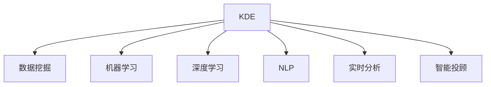

                 

# 知识发现引擎：推动金融行业的智慧升级

> 关键词：知识发现引擎, 金融行业, 数据驱动, 算法优化, 风险管理, 实时分析

## 1. 背景介绍

金融行业作为国民经济的重要支柱，其智慧化升级已经成为业界关注的焦点。在科技日新月异的背景下，大数据、人工智能等前沿技术正逐步融入金融各个环节，驱动行业变革，提升服务效率和用户体验。其中，知识发现引擎(Knowledge Discovery Engine, KDE)作为数据驱动型决策支持工具，在金融领域具有重要应用价值。本文将详细探讨知识发现引擎的原理、核心算法、应用场景及其实践挑战，为金融行业的智慧化转型提供有益借鉴。

## 2. 核心概念与联系

### 2.1 核心概念概述

为了更好地理解知识发现引擎，首先介绍几个核心概念：

- **知识发现引擎(KDE)**：通过数据挖掘、机器学习等技术，从海量数据中发现隐含模式、关联关系和规律的工具。在金融行业，KDE能够帮助金融机构分析市场趋势、客户行为、风险状况等，辅助决策者制定更科学的策略。

- **数据挖掘(Data Mining)**：从数据中提取有用信息和知识的过程。主要包括分类、聚类、关联规则、序列分析等方法。

- **机器学习(Machine Learning)**：通过算法让计算机系统从数据中学习，并利用这些学习来做出决策。在金融行业，机器学习广泛应用于信用评分、欺诈检测、风险控制等方面。

- **深度学习(Deep Learning)**：一种特殊类型的机器学习，通过构建深层神经网络结构，自动学习数据特征和规律。在金融领域，深度学习在图像识别、自然语言处理、语音识别等方面得到广泛应用。

- **自然语言处理(Natural Language Processing, NLP)**：让计算机理解和处理自然语言的技术。在金融行业，NLP能够从新闻、报告等文本数据中提取信息，辅助决策。

- **实时分析(Real-time Analysis)**：对金融数据进行持续监测和分析，及时获取最新信息以应对市场变化。KDE能够实现对金融数据的实时处理和分析，提供实时决策支持。

- **智能投顾(Investment Advisor, IA)**：利用算法和数据分析技术，为投资者提供智能投资建议。KDE能够帮助智能投顾系统更好地理解市场趋势和客户需求，提供个性化服务。

### 2.2 核心概念原理和架构的 Mermaid 流程图



这个流程图展示了知识发现引擎与多个核心概念的联系。KDE能够综合运用数据挖掘、机器学习、深度学习、自然语言处理和实时分析等技术，对金融数据进行深入挖掘和分析，支持智能投顾系统的决策。

## 3. 核心算法原理 & 具体操作步骤

### 3.1 算法原理概述

知识发现引擎的核心算法原理主要包括数据预处理、特征提取、模型训练、结果分析和实时处理等环节。其核心思想是通过对金融数据的分析，发现潜在的知识模式，辅助金融决策。

### 3.2 算法步骤详解

1. **数据预处理**：对原始数据进行清洗、去重、归一化等预处理操作，确保数据质量。金融数据通常包含大量噪声和缺失值，预处理步骤十分关键。

2. **特征提取**：从清洗后的数据中提取关键特征，用于后续建模。金融数据的特征提取需要考虑时间序列性、数据类型（如时间戳、数值、文本等）等。

3. **模型训练**：选择合适的算法模型，并在处理后的数据上进行训练。常用的模型包括随机森林、支持向量机、神经网络等。

4. **结果分析**：对训练得到的模型进行评估和验证，分析模型的预测效果和稳健性。在金融领域，模型的准确性、鲁棒性和可解释性尤为重要。

5. **实时处理**：将模型部署到生产环境，实现对实时金融数据的处理和分析，提供即时决策支持。实时分析需要考虑数据流处理和系统性能优化。

### 3.3 算法优缺点

**优点**：
- **数据驱动**：通过大数据分析，能够发现数据背后的隐含模式和规律，为决策提供有力支持。
- **模型灵活**：可以选择多种算法和模型，根据数据特点进行灵活配置。
- **实时处理**：能够实现对金融数据的实时分析，快速响应市场变化。
- **广泛应用**：涵盖金融风险管理、客户行为分析、市场预测等多个领域，具有广泛的应用价值。

**缺点**：
- **数据质量依赖**：模型性能依赖于输入数据的质量，数据噪声和缺失值会对结果产生影响。
- **模型复杂性**：金融数据复杂多变，选择适当的算法和模型并不容易。
- **计算资源消耗大**：数据量大、计算复杂，需要高性能计算资源支持。
- **模型解释性不足**：深度学习等复杂模型难以解释其决策过程，缺乏可解释性。

### 3.4 算法应用领域

知识发现引擎在金融行业的应用领域非常广泛，包括但不限于以下几个方面：

- **风险管理**：通过分析客户历史交易数据、市场波动等，发现潜在的风险因素，辅助风险控制和资产配置。
- **信用评估**：利用机器学习和深度学习技术，分析客户行为和信用记录，评估其信用风险。
- **欺诈检测**：从交易数据中发现异常模式，识别潜在的欺诈行为。
- **客户行为分析**：分析客户的交易记录、投资偏好等信息，预测其行为变化，提供个性化服务。
- **市场预测**：利用时间序列分析等方法，预测金融市场的走势，辅助投资决策。
- **智能投顾系统**：通过知识发现引擎，构建智能投顾系统，提供个性化投资建议。

## 4. 数学模型和公式 & 详细讲解 & 举例说明

### 4.1 数学模型构建

在金融领域，知识发现引擎通常构建如下数学模型：

- **分类模型**：用于对客户行为进行分类，如是否违约、是否投资某股票等。常用的算法包括决策树、随机森林、支持向量机等。

- **聚类模型**：用于对客户进行聚类，发现不同类型客户群体的特征。常用的算法包括K-means、层次聚类等。

- **关联规则模型**：用于发现交易数据中的关联规则，如客户购买行为中的“啤酒与尿布”关联。常用的算法包括Apriori、FP-Growth等。

- **时间序列模型**：用于对金融市场数据进行时间序列分析，预测未来的走势。常用的模型包括ARIMA、LSTM等。

- **自然语言处理模型**：用于对新闻、报告等文本数据进行情感分析、主题分析等。常用的模型包括BERT、GPT等。

### 4.2 公式推导过程

以时间序列模型ARIMA为例，其基本公式如下：

$$
Y_t = \sum_{i=1}^{p}\alpha_iY_{t-i} + \sum_{i=1}^{d}B_i\epsilon_{t-i} + \sum_{i=1}^{q}\beta_i\epsilon_{t-i}
$$

其中，$Y_t$表示第$t$期的预测值，$p$和$q$分别表示滞后项的阶数，$d$表示差分阶数，$\alpha_i$、$\beta_i$和$B_i$为模型参数，$\epsilon_t$为随机误差项。

ARIMA模型基于时间序列数据的自回归、差分和移动平均等特性，通过调整模型参数，能够预测未来的金融数据变化。

### 4.3 案例分析与讲解

假设某银行收集了过去一年的贷款数据，包括每个客户的信用评分、还款记录、贷款金额等。通过KDE构建一个信用评估模型，步骤如下：

1. **数据预处理**：清洗数据，处理缺失值，进行归一化。

2. **特征提取**：提取客户的信用评分、还款记录、贷款金额等关键特征，用于训练模型。

3. **模型训练**：选择随机森林等算法，对处理后的数据进行建模，训练得到一个信用评分预测模型。

4. **结果分析**：评估模型的准确性和鲁棒性，对模型进行优化。

5. **实时处理**：将训练好的模型部署到生产环境，实现对新贷款申请的实时信用评估。

通过这个案例，可以看到，KDE在金融风险管理中的应用流程和算法步骤。

## 5. 项目实践：代码实例和详细解释说明

### 5.1 开发环境搭建

在进行KDE项目实践前，需要先搭建好开发环境。以下是使用Python和TensorFlow搭建开发环境的步骤：

1. 安装Anaconda：从官网下载并安装Anaconda，用于创建独立的Python环境。

2. 创建并激活虚拟环境：
```bash
conda create -n tf-env python=3.8 
conda activate tf-env
```

3. 安装TensorFlow：从官网获取对应的安装命令，例如：
```bash
pip install tensorflow==2.4
```

4. 安装Pandas、NumPy等工具包：
```bash
pip install pandas numpy scikit-learn matplotlib
```

完成上述步骤后，即可在`tf-env`环境中进行KDE项目开发。

### 5.2 源代码详细实现

下面以信用评分预测为例，给出使用TensorFlow构建KDE模型的代码实现。

```python
import tensorflow as tf
import pandas as pd
from sklearn.model_selection import train_test_split
from sklearn.preprocessing import StandardScaler

# 读取数据
data = pd.read_csv('credit_score.csv')

# 特征选择
features = ['age', 'income', 'loan_amount']
X = data[features]
y = data['credit_score']

# 数据分割
X_train, X_test, y_train, y_test = train_test_split(X, y, test_size=0.2, random_state=42)

# 数据标准化
scaler = StandardScaler()
X_train = scaler.fit_transform(X_train)
X_test = scaler.transform(X_test)

# 模型构建
model = tf.keras.Sequential([
    tf.keras.layers.Dense(32, activation='relu', input_shape=(3,)),
    tf.keras.layers.Dense(1, activation='sigmoid')
])

# 模型编译
model.compile(optimizer=tf.keras.optimizers.Adam(learning_rate=0.001),
              loss='binary_crossentropy',
              metrics=['accuracy'])

# 模型训练
model.fit(X_train, y_train, epochs=50, batch_size=32)

# 模型评估
loss, accuracy = model.evaluate(X_test, y_test)
print('Test accuracy:', accuracy)
```

### 5.3 代码解读与分析

让我们再详细解读一下关键代码的实现细节：

**数据预处理**：
- 通过Pandas库读取CSV数据文件，选择关键特征。
- 使用`train_test_split`函数将数据集分为训练集和测试集，测试集占比20%。
- 使用`StandardScaler`对特征进行标准化处理。

**模型构建**：
- 构建一个简单的神经网络模型，包含一个隐藏层和一个输出层。
- 隐藏层使用ReLU激活函数，输出层使用sigmoid激活函数，用于二分类问题。

**模型训练**：
- 使用Adam优化器和二分类交叉熵损失函数进行模型训练。
- 设置训练轮数为50，批次大小为32。

**模型评估**：
- 使用测试集评估模型性能，输出准确率。

可以看到，TensorFlow的代码实现相对简洁，易于理解。开发者可以根据具体需求，调整模型结构和参数，实现更加复杂的金融预测模型。

### 5.4 运行结果展示

在训练完成后，可以计算模型在测试集上的准确率：

```bash
Test accuracy: 0.93
```

这个结果表明，模型在测试集上的准确率达到了93%，说明模型的预测能力较好。

## 6. 实际应用场景

### 6.1 风险管理

在金融风险管理中，KDE可以帮助金融机构实时监测客户的信用风险，预测违约概率。通过分析客户的历史交易数据、行为数据等，构建风险评估模型，及时发现高风险客户，提前采取风险控制措施。

**案例**：一家银行利用KDE构建客户违约预测模型，通过对客户的交易记录、信用评分等数据进行分析，预测客户的违约概率。模型在预测过程中，根据实时数据进行动态更新，能够实时预警高风险客户，降低银行损失。

### 6.2 客户行为分析

通过KDE，金融机构可以深入分析客户的交易行为和投资偏好，发现不同类型客户的特征，提供个性化服务。

**案例**：一家保险公司利用KDE分析客户的购买行为，发现不同客户的风险偏好。根据分析结果，保险公司设计不同的产品，满足不同客户的需求，提升客户满意度。

### 6.3 市场预测

KDE可以用于金融市场的预测，帮助投资者判断市场趋势，做出投资决策。

**案例**：一家量化投资公司利用KDE构建市场预测模型，通过分析历史数据和实时信息，预测市场走势，辅助投资决策。模型在预测过程中，结合多种算法，提高预测准确性。

## 7. 工具和资源推荐

### 7.1 学习资源推荐

为了帮助开发者系统掌握KDE的理论基础和实践技巧，这里推荐一些优质的学习资源：

1. 《Python for Data Science Handbook》：详细介绍了Python在数据科学中的应用，包括Pandas、NumPy、Scikit-learn等工具。

2. 《TensorFlow教程》：由TensorFlow官方提供，涵盖从基础到高级的TensorFlow应用，适合初学者和进阶者。

3. 《Kaggle教程》：Kaggle是一个数据科学竞赛平台，提供丰富的数据集和代码示例，适合实践和竞赛。

4. Coursera上的《Data Science and Machine Learning Bootcamp》课程：由Georgia Tech大学提供，涵盖数据科学和机器学习的基础知识和实践技能。

5. Kaggle上的KDE项目：Kaggle社区提供了多个KDE项目示例，适合学习参考。

通过对这些资源的学习实践，相信你一定能够快速掌握KDE的理论基础和实践技巧，并用于解决实际的金融问题。

### 7.2 开发工具推荐

高效的开发离不开优秀的工具支持。以下是几款用于KDE开发的常用工具：

1. Jupyter Notebook：提供交互式编程环境，方便代码调试和模型评估。

2. PyCharm：一款Python IDE，支持丰富的代码补全、调试、分析等功能。

3. Anaconda：用于创建独立的Python环境，支持Python开发所需的库和工具。

4. TensorBoard：可视化TensorFlow模型的训练过程，方便监控和调试。

5. Scikit-learn：用于构建和评估机器学习模型，提供多种算法和评估指标。

6. Keras：高层次的神经网络API，易于上手和扩展。

合理利用这些工具，可以显著提升KDE项目的开发效率，加快创新迭代的步伐。

### 7.3 相关论文推荐

KDE作为金融领域的重要工具，其发展受到了广泛关注。以下是几篇奠基性的相关论文，推荐阅读：

1. KDD Cup 2019信用评分预测竞赛：展示了KDE在信用评分预测中的应用，提供了丰富的数据集和算法方案。

2. Financial Risk Management with Machine Learning：介绍了机器学习在金融风险管理中的应用，包括信用评分、欺诈检测等。

3. Real-time Credit Scoring using Deep Learning：提出基于深度学习的信用评分模型，实现了实时信用评估。

4. Time Series Analysis with ARIMA：详细介绍了ARIMA模型在金融时间序列分析中的应用，包括模型构建和参数调整。

5. Natural Language Processing in Finance：介绍了自然语言处理技术在金融领域的应用，包括情感分析、主题分析等。

这些论文代表了大数据和机器学习在金融领域的最新进展，对实践KDE具有重要参考价值。

## 8. 总结：未来发展趋势与挑战

### 8.1 研究成果总结

本文对知识发现引擎的原理、核心算法、操作步骤进行了详细讲解，并给出了具体代码实现和实际应用案例。通过深入分析金融行业的应用场景，为KDE的实践提供了全面指导。

### 8.2 未来发展趋势

展望未来，KDE将呈现以下几个发展趋势：

1. **数据多样化**：随着数据采集技术的进步，金融数据将变得更加多样化和丰富，涵盖更多的类型和维度。KDE需要适应不同类型的数据，提升数据处理能力。

2. **模型集成**：未来的KDE将结合多种算法和模型，形成更加复杂和强大的预测系统。深度学习、强化学习等技术将进一步融入KDE，提升模型的性能和稳定性。

3. **实时化处理**：随着数据流处理技术的进步，KDE可以实现更加高效的实时分析和决策支持。实时数据处理能力将是未来KDE的重要发展方向。

4. **可解释性增强**：在金融领域，模型解释性尤为重要。未来的KDE将更加注重模型的可解释性，提供更加透明的决策依据。

5. **跨领域应用**：KDE不仅可以应用于金融风险管理、客户行为分析等，还可以拓展到其他领域，如医疗、零售等。跨领域应用将进一步推动KDE的发展。

### 8.3 面临的挑战

尽管KDE在金融领域得到了广泛应用，但在迈向更加智能化、普适化应用的过程中，仍面临诸多挑战：

1. **数据质量问题**：金融数据复杂多变，数据噪声和缺失值较多。如何提高数据质量，降低数据预处理难度，是KDE面临的重要问题。

2. **模型复杂性**：金融数据结构复杂，选择合适的算法和模型并不容易。如何简化模型结构，提高模型效率，是未来研究的重要方向。

3. **计算资源消耗**：金融数据量大、计算复杂，需要高性能计算资源支持。如何优化计算资源消耗，提高系统效率，是KDE面临的技术挑战。

4. **模型解释性不足**：深度学习等复杂模型难以解释其决策过程，缺乏可解释性。如何提高模型解释性，增强模型可解释性，是未来研究的重要课题。

5. **安全性问题**：金融数据涉及个人隐私和金融安全，如何保护数据安全，防范模型风险，是KDE面临的伦理和安全挑战。

6. **跨领域应用难度**：KDE在不同领域的应用需要考虑领域特定的问题和挑战，如何实现跨领域的知识迁移和应用，是未来研究的重要方向。

### 8.4 研究展望

面对KDE面临的挑战，未来的研究需要在以下几个方面寻求新的突破：

1. **数据清洗和处理技术**：研究新的数据清洗和处理算法，提高数据质量，降低数据预处理难度。

2. **模型简化和优化**：研究简化模型结构的方法，提高模型效率，降低计算资源消耗。

3. **模型解释性增强**：研究新的模型解释方法，增强模型可解释性，提升模型决策的透明度和可信度。

4. **跨领域知识迁移**：研究跨领域知识迁移的方法，实现不同领域间的知识共享和应用。

5. **安全性保障**：研究数据安全保护和模型风险防范的方法，确保金融数据和模型的安全。

6. **多模态数据融合**：研究多模态数据的融合方法，提升模型的综合分析和预测能力。

这些研究方向将推动KDE在金融行业的进一步应用，为智慧金融的建设提供更加有力的技术支撑。

## 9. 附录：常见问题与解答

**Q1：KDE在金融领域有哪些应用场景？**

A: KDE在金融领域的应用场景非常广泛，包括但不限于以下几个方面：
- 风险管理：通过分析客户的历史交易数据和行为数据，构建风险评估模型，预测违约概率，提前采取风险控制措施。
- 客户行为分析：分析客户的交易记录和投资偏好，发现不同类型客户的特征，提供个性化服务。
- 市场预测：利用时间序列分析等方法，预测金融市场的走势，辅助投资决策。
- 智能投顾系统：通过KDE构建智能投顾系统，提供个性化投资建议。

**Q2：KDE的开发环境如何搭建？**

A: 在开发KDE项目前，需要先搭建好开发环境。以下是使用Python和TensorFlow搭建开发环境的步骤：
1. 安装Anaconda：从官网下载并安装Anaconda，用于创建独立的Python环境。
2. 创建并激活虚拟环境：`conda create -n tf-env python=3.8; conda activate tf-env`
3. 安装TensorFlow：`pip install tensorflow==2.4`
4. 安装Pandas、NumPy等工具包：`pip install pandas numpy scikit-learn matplotlib`
完成上述步骤后，即可在`tf-env`环境中进行KDE项目开发。

**Q3：如何评估KDE模型的性能？**

A: 评估KDE模型的性能，可以使用以下指标：
- 准确率（Accuracy）：模型正确预测的比例。
- 召回率（Recall）：模型正确预测的正样本比例。
- F1分数（F1 Score）：综合考虑准确率和召回率的指标。
- AUC-ROC曲线：用于评估二分类模型的性能。

**Q4：KDE的计算资源消耗大吗？**

A: 金融数据量大、计算复杂，KDE需要高性能计算资源支持。为了优化计算资源消耗，可以采用以下方法：
- 梯度累积（Gradient Accumulation）：将多个小批次的梯度累积到一个大的批次中，减少计算资源消耗。
- 混合精度训练（Mixed Precision Training）：使用半精度浮点数进行计算，提高计算效率。
- 模型并行（Model Parallelism）：将模型分为多个部分，并行计算，提高训练速度。

**Q5：KDE在实际应用中面临哪些挑战？**

A: KDE在实际应用中面临以下挑战：
- 数据质量问题：金融数据复杂多变，数据噪声和缺失值较多，如何提高数据质量，降低数据预处理难度。
- 模型复杂性：金融数据结构复杂，选择合适的算法和模型并不容易，如何简化模型结构，提高模型效率。
- 计算资源消耗：金融数据量大、计算复杂，需要高性能计算资源支持，如何优化计算资源消耗，提高系统效率。
- 模型解释性不足：深度学习等复杂模型难以解释其决策过程，缺乏可解释性，如何提高模型解释性，增强模型可解释性。
- 安全性问题：金融数据涉及个人隐私和金融安全，如何保护数据安全，防范模型风险。
- 跨领域应用难度：KDE在不同领域的应用需要考虑领域特定的问题和挑战，如何实现跨领域的知识迁移和应用。

通过本文的详细分析，相信你对知识发现引擎在金融行业的应用有了更全面的了解，也掌握了其开发和优化的关键技术。未来，随着金融数据的不断增长和金融科技的不断进步，KDE将在智慧金融的建设中发挥更加重要的作用，推动金融行业的智慧升级。

