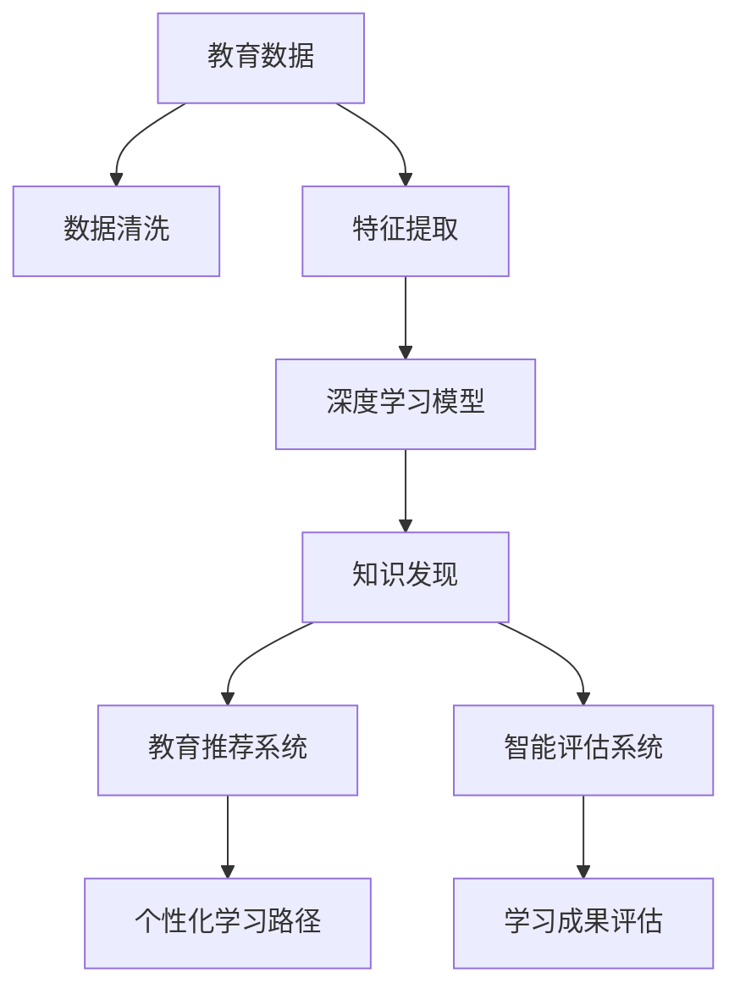

                 

# 知识发现引擎：教育领域的智慧转型

## 1. 背景介绍

### 1.1 问题由来
在当今快速发展的信息化时代，教育领域正面临着前所未有的挑战和变革。随着数字化技术的发展，传统的教育模式逐渐向智能化、个性化和高效化转型。知识发现引擎作为一种先进的教育技术，能够帮助教师和学生更高效地获取、组织和应用知识，提升学习效果和教育质量。

然而，知识发现引擎的设计和实现需要跨学科的知识和技能，包括数据科学、人工智能、心理学、教育学等多个领域。因此，对教育领域而言，如何将这些技术整合到实际的教育场景中，成为一项亟需解决的问题。

### 1.2 问题核心关键点
知识发现引擎的核心在于通过数据分析、机器学习等技术手段，从大规模的教育数据中提取有价值的信息和模式，为教育决策、学习推荐、智能评估等提供支持。关键点包括：

- **数据采集与处理**：如何高效地采集和处理教育数据，是知识发现引擎的第一步。数据质量直接影响后续分析的结果。
- **特征工程**：如何从原始数据中提取关键特征，构建合理的特征集合，是模型性能提升的关键。
- **模型选择与优化**：选择合适的机器学习模型，并通过调参、模型融合等手段优化模型性能。
- **应用落地与反馈**：如何将模型成果转化为实际的应用，并在应用过程中收集反馈，不断优化模型。

### 1.3 问题研究意义
知识发现引擎在教育领域的应用，具有以下重要意义：

1. **提升教学质量**：通过智能推荐、个性化学习路径设计，帮助学生更高效地掌握知识。
2. **优化教育资源**：通过数据分析，识别优质教育资源，优化教学资源配置。
3. **支持教育决策**：通过深度学习模型，提供基于数据的决策支持，帮助教育管理者做出科学决策。
4. **推动教育公平**：通过智能评估和个性化学习，缩小教育资源分配差距，促进教育公平。

## 2. 核心概念与联系

### 2.1 核心概念概述

在讨论知识发现引擎的核心概念前，需要先了解以下几个关键概念：

- **知识发现**（Knowledge Discovery）：从大规模数据中提取有价值信息的过程。
- **教育数据**：包括学生的学习行为数据、教师的教学行为数据、学校的运营数据等，是知识发现的基础。
- **机器学习**（Machine Learning）：通过数据训练模型，自动发现数据中的规律和模式。
- **深度学习**（Deep Learning）：一种特殊的机器学习技术，通过多层神经网络进行复杂数据的表示和处理。
- **教育推荐系统**：通过学习学生的学习行为和偏好，推荐适合的学习资源和路径。
- **智能评估系统**：通过自然语言处理、图像识别等技术，自动评估学生的学习成果和进步。

这些概念之间的逻辑关系可以通过以下Mermaid流程图来展示：



这个流程图展示了从数据采集到最终应用的知识发现引擎的基本流程：

1. 教育数据通过数据清洗和特征提取，进入深度学习模型进行训练。
2. 训练好的模型用于知识发现，识别有价值的信息和模式。
3. 知识发现的结果用于教育推荐系统和智能评估系统，提供个性化学习和评估支持。

### 2.2 核心概念原理和架构

#### 数据采集与处理
数据采集与处理是知识发现引擎的第一步，主要包括数据清洗、数据整合、数据预处理等环节。

- **数据清洗**：去除或修正数据中的噪声和错误，保证数据的质量。
- **数据整合**：将来自不同来源的数据合并为一个统一的数据集，以便于后续分析。
- **数据预处理**：对数据进行标准化、归一化、缺失值处理等操作，确保数据适合模型训练。

#### 特征工程
特征工程是知识发现引擎中一个关键环节，其目的是从原始数据中提取出最具代表性和预测性的特征，构建特征集合。

- **特征选择**：根据领域知识和模型需求，选择最相关的特征。
- **特征构建**：通过对原始数据进行组合、变换，创建新的特征。
- **特征缩放**：将特征值缩放到相同的尺度，避免某些特征对模型有主导影响。

#### 模型选择与优化
选择合适的机器学习模型，并通过调参、模型融合等手段优化模型性能。

- **模型选择**：根据任务类型和数据特点选择合适的模型，如分类模型、回归模型、聚类模型等。
- **模型调参**：通过交叉验证、网格搜索等方法，找到最优的模型参数。
- **模型融合**：将多个模型的预测结果进行融合，提高预测精度和鲁棒性。

#### 应用落地与反馈
知识发现引擎的应用落地需要考虑模型的部署、数据的存储、系统的集成等环节。同时，收集用户的反馈，不断优化模型。

- **模型部署**：将训练好的模型部署到实际的教育场景中，提供服务。
- **数据存储**：设计高效的数据存储方案，保证数据的可访问性和安全性。
- **系统集成**：将知识发现引擎与其他教育系统进行集成，实现数据的实时更新和共享。
- **用户反馈**：收集用户对知识发现引擎的反馈，用于模型优化和改进。

## 3. 核心算法原理 & 具体操作步骤
### 3.1 算法原理概述

知识发现引擎的核心算法原理主要基于数据挖掘、机器学习和深度学习技术，通过构建和优化模型，从教育数据中提取有价值的信息和模式。

- **数据挖掘**：从大规模的教育数据中提取隐含的、未知的、有用的信息。
- **机器学习**：通过数据训练模型，自动发现数据中的规律和模式。
- **深度学习**：通过多层神经网络进行复杂数据的表示和处理。

### 3.2 算法步骤详解

知识发现引擎的算法步骤主要包括以下几个关键环节：

#### Step 1: 数据采集与处理
1. **数据采集**：从教育系统中收集学生、教师、学校的运营数据。
2. **数据清洗**：去除或修正数据中的噪声和错误。
3. **数据整合**：将来自不同来源的数据合并为一个统一的数据集。
4. **数据预处理**：对数据进行标准化、归一化、缺失值处理等操作。

#### Step 2: 特征工程
1. **特征选择**：根据领域知识和模型需求，选择最相关的特征。
2. **特征构建**：通过对原始数据进行组合、变换，创建新的特征。
3. **特征缩放**：将特征值缩放到相同的尺度。

#### Step 3: 模型选择与优化
1. **模型选择**：根据任务类型和数据特点选择合适的模型，如分类模型、回归模型、聚类模型等。
2. **模型调参**：通过交叉验证、网格搜索等方法，找到最优的模型参数。
3. **模型融合**：将多个模型的预测结果进行融合，提高预测精度和鲁棒性。

#### Step 4: 应用落地与反馈
1. **模型部署**：将训练好的模型部署到实际的教育场景中，提供服务。
2. **数据存储**：设计高效的数据存储方案，保证数据的可访问性和安全性。
3. **系统集成**：将知识发现引擎与其他教育系统进行集成，实现数据的实时更新和共享。
4. **用户反馈**：收集用户对知识发现引擎的反馈，用于模型优化和改进。

### 3.3 算法优缺点

知识发现引擎的优点包括：

- **高效性**：通过自动化处理和分析，大幅提升数据处理的效率。
- **准确性**：通过机器学习和深度学习技术，提高预测和推荐的准确性。
- **个性化**：通过智能推荐和学习路径设计，提供个性化的学习体验。

同时，知识发现引擎也存在以下缺点：

- **数据依赖**：需要大量高质量的教育数据进行训练，数据质量和数量直接影响模型效果。
- **技术门槛高**：涉及数据科学、机器学习、深度学习等多个领域，技术门槛较高。
- **解释性不足**：复杂模型的决策过程往往难以解释，难以满足某些应用场景的需求。

### 3.4 算法应用领域

知识发现引擎的应用领域非常广泛，主要包括以下几个方面：

- **智能推荐系统**：根据学生的学习行为和偏好，推荐适合的学习资源和路径。
- **学习成果评估系统**：通过自然语言处理、图像识别等技术，自动评估学生的学习成果和进步。
- **教学资源优化**：通过数据分析，识别优质教育资源，优化教学资源配置。
- **教育决策支持系统**：通过深度学习模型，提供基于数据的决策支持，帮助教育管理者做出科学决策。
- **个性化学习路径设计**：根据学生的学习能力和兴趣，设计个性化的学习路径。

## 4. 数学模型和公式 & 详细讲解 & 举例说明
### 4.1 数学模型构建

知识发现引擎的数学模型构建主要涉及以下几个关键步骤：

1. **数据表示**：将教育数据转换为适合机器学习模型的格式，如向量、矩阵等。
2. **特征表示**：通过特征工程，将原始数据转换为机器学习模型可理解的特征表示。
3. **模型表示**：选择合适的机器学习模型，并构建对应的模型表示。

### 4.2 公式推导过程

以学生学习成果评估系统为例，说明知识发现引擎的数学模型构建和公式推导过程。

假设有一组学生的学习行为数据 $D=\{x_i\}_{i=1}^N$，其中 $x_i$ 表示第 $i$ 个学生的行为数据。设 $y_i$ 为学生的学习成果，$y_i \in \{1, 2, \cdots, K\}$，$K$ 为学生学习成果的类别数。

定义一个基于决策树的分类模型，模型参数为 $T=\{(t_j)\}_{j=1}^M$，其中 $t_j$ 表示第 $j$ 个决策树的参数。模型的预测函数为：

$$
\hat{y}_i = \arg\max_j (t_j \cdot \text{features}(x_i))
$$

其中 $\text{features}(x_i)$ 表示第 $i$ 个学生行为数据的特征表示。

模型的损失函数为交叉熵损失，公式如下：

$$
L(T, D) = -\frac{1}{N} \sum_{i=1}^N \sum_{k=1}^K y_{ik} \log \text{Pr}(y_i=k|T, x_i)
$$

其中 $\text{Pr}(y_i=k|T, x_i)$ 表示模型在给定学生行为数据 $x_i$ 和决策树模型 $T$ 的情况下，预测学生学习成果为第 $k$ 类的概率。

### 4.3 案例分析与讲解

以一个具体的案例来说明知识发现引擎在教育领域的应用。

假设一个在线教育平台收集了大量学生在学习过程中的数据，包括观看视频时长、练习题正确率、互动评分等。平台希望通过这些数据，预测学生的学习成果，并提供个性化的学习路径。

1. **数据采集与处理**：收集学生的学习行为数据，去除或修正数据中的噪声和错误。
2. **特征工程**：选择与学习成果相关的特征，如观看视频时长、练习题正确率等，并进行特征构建和缩放。
3. **模型选择与优化**：选择决策树模型，通过交叉验证和网格搜索等方法，找到最优的模型参数。
4. **应用落地与反馈**：将训练好的模型部署到平台上，根据学生行为数据预测其学习成果，并提供个性化的学习路径。同时，收集用户反馈，用于模型优化和改进。

## 5. 项目实践：代码实例和详细解释说明
### 5.1 开发环境搭建

在进行知识发现引擎的实践前，我们需要准备好开发环境。以下是使用Python进行项目实践的环境配置流程：

1. 安装Anaconda：从官网下载并安装Anaconda，用于创建独立的Python环境。

2. 创建并激活虚拟环境：
```bash
conda create -n pytorch-env python=3.8 
conda activate pytorch-env
```

3. 安装Python和相关库：
```bash
pip install numpy pandas sklearn scikit-learn tensorflow tensorflow-hub jupyter notebook ipython
```

完成上述步骤后，即可在`pytorch-env`环境中开始项目实践。

### 5.2 源代码详细实现

这里我们以一个简单的学生学习成果评估系统为例，给出使用Python和TensorFlow进行项目实践的代码实现。

首先，定义一个基于决策树模型的学习成果评估系统：

```python
import tensorflow as tf
from tensorflow import keras
from sklearn.model_selection import train_test_split
from sklearn.metrics import accuracy_score, confusion_matrix

# 加载数据集
train_data, test_data = train_test_split(train_data, test_size=0.2, random_state=42)

# 构建决策树模型
model = keras.Sequential([
    keras.layers.Dense(64, activation='relu', input_shape=(num_features,)),
    keras.layers.Dense(64, activation='relu'),
    keras.layers.Dense(K, activation='softmax')
])

# 编译模型
model.compile(optimizer='adam', loss='sparse_categorical_crossentropy', metrics=['accuracy'])

# 训练模型
model.fit(train_data, epochs=10, validation_data=test_data)

# 评估模型
y_pred = model.predict(test_data)
accuracy = accuracy_score(test_labels, y_pred)
conf_matrix = confusion_matrix(test_labels, y_pred)
```

然后，定义特征工程过程：

```python
# 定义特征提取函数
def extract_features(data):
    features = []
    for x in data:
        # 特征构建
        features.append([x['观看视频时长'], x['练习题正确率'], x['互动评分']])
    return features

# 提取特征
train_features = extract_features(train_data)
test_features = extract_features(test_data)
```

最后，启动模型训练和评估流程：

```python
# 训练模型
model.fit(train_features, epochs=10, validation_data=test_features)

# 评估模型
y_pred = model.predict(test_features)
accuracy = accuracy_score(test_labels, y_pred)
conf_matrix = confusion_matrix(test_labels, y_pred)
```

以上就是使用Python和TensorFlow进行学生学习成果评估系统的完整代码实现。可以看到，通过定义模型、编译模型、训练模型和评估模型，我们成功构建了一个简单的学习成果评估系统。

### 5.3 代码解读与分析

让我们再详细解读一下关键代码的实现细节：

**提取特征函数**：
- 定义了特征提取函数 `extract_features`，用于从原始数据中提取特征。
- 对每个样本的观看视频时长、练习题正确率和互动评分进行组合，构建新的特征表示。

**模型定义与编译**：
- 定义了一个包含多个全连接层的决策树模型，并编译模型，设置损失函数和优化器。
- 通过 `model.fit` 方法进行模型训练，并指定训练轮数和验证集。

**模型评估**：
- 使用 `model.predict` 方法对测试集进行预测，并计算预测准确率和混淆矩阵。
- 通过 `accuracy_score` 和 `confusion_matrix` 函数，评估模型的性能。

## 6. 实际应用场景

### 6.1 智能推荐系统

智能推荐系统是知识发现引擎在教育领域的重要应用之一。通过分析学生的学习行为数据，推荐适合的学习资源和路径，提升学习效果。

在实际应用中，可以通过收集学生的点击、观看、练习等行为数据，构建推荐模型。模型可以根据学生的兴趣和行为特征，预测其对不同学习资源的需求，从而提供个性化的推荐。

### 6.2 学习成果评估系统

学习成果评估系统通过自然语言处理和图像识别技术，自动评估学生的学习成果和进步。

在实际应用中，可以将学生的作业、论文、项目等文本和图像数据作为输入，使用预训练的语言模型进行文本分析，使用图像识别模型进行图像分析，综合评估学生的学习成果。

### 6.3 教学资源优化

教学资源优化通过数据分析，识别优质教育资源，优化教学资源配置。

在实际应用中，可以收集教师的教学行为数据、学生的学习行为数据等，分析哪些资源对学生的学习效果提升最大，从而优化资源的分配和利用。

### 6.4 未来应用展望

未来，知识发现引擎在教育领域的应用将更加广泛和深入。例如：

- **智能教材推荐**：通过分析学生的学习行为和偏好，推荐适合的学习教材和资料。
- **学习路径设计**：根据学生的学习能力和兴趣，设计个性化的学习路径，提升学习效果。
- **教育决策支持**：通过深度学习模型，提供基于数据的决策支持，帮助教育管理者做出科学决策。

## 7. 工具和资源推荐

### 7.1 学习资源推荐

为了帮助开发者系统掌握知识发现引擎的理论基础和实践技巧，这里推荐一些优质的学习资源：

1. 《Python数据科学手册》：涵盖了Python在数据科学、机器学习、深度学习等领域的全面应用。
2. 《机器学习实战》：提供了大量实际案例，帮助读者理解和应用机器学习技术。
3. 《深度学习》：由深度学习领域的知名专家撰写，系统介绍了深度学习的基本原理和应用。
4. 《TensorFlow实战》：由TensorFlow的开发者撰写，提供了TensorFlow的实践指南和案例。
5. Coursera的《机器学习》课程：由斯坦福大学的Andrew Ng教授主讲，涵盖了机器学习的基础知识和应用。

通过对这些资源的学习实践，相信你一定能够快速掌握知识发现引擎的技术框架，并用于解决实际的NLP问题。

### 7.2 开发工具推荐

高效的开发离不开优秀的工具支持。以下是几款用于知识发现引擎开发的常用工具：

1. Jupyter Notebook：提供了交互式编程环境，方便开发者进行数据探索和模型调试。
2. TensorBoard：TensorFlow的可视化工具，可以实时监测模型训练状态，并提供丰富的图表呈现方式。
3. Scikit-learn：提供了大量机器学习算法和工具，方便开发者构建和优化模型。
4. Pandas：提供了高效的数据处理和分析功能，方便开发者进行数据预处理和特征工程。

合理利用这些工具，可以显著提升知识发现引擎的开发效率，加快创新迭代的步伐。

### 7.3 相关论文推荐

知识发现引擎的发展源于学界的持续研究。以下是几篇奠基性的相关论文，推荐阅读：

1. "A Framework for Knowledge Discovery"（知识发现的框架）：提出了一种基于数据挖掘和机器学习的知识发现框架，奠定了知识发现领域的基础。
2. "Knowledge Discovery in Databases"（数据库中的知识发现）：系统介绍了知识发现的基本方法和应用场景。
3. "Deep Learning for Natural Language Processing"（深度学习在自然语言处理中的应用）：介绍了深度学习在自然语言处理中的应用，包括文本分类、情感分析、机器翻译等。
4. "Machine Learning for Health"（健康领域中的机器学习）：介绍了机器学习在健康领域的应用，包括疾病预测、患者分类、医疗影像分析等。

这些论文代表了大语言模型微调技术的发展脉络。通过学习这些前沿成果，可以帮助研究者把握学科前进方向，激发更多的创新灵感。

## 8. 总结：未来发展趋势与挑战

### 8.1 总结

本文对知识发现引擎在教育领域的应用进行了全面系统的介绍。首先阐述了知识发现引擎的研究背景和意义，明确了其在提升教学质量、优化教育资源、支持教育决策等方面的独特价值。其次，从原理到实践，详细讲解了知识发现引擎的数学模型构建、算法步骤、工具资源等关键环节，给出了知识发现引擎的完整代码实例。同时，本文还广泛探讨了知识发现引擎在智能推荐、学习成果评估、教学资源优化等多个领域的应用前景，展示了知识发现引擎的广阔前景。

通过本文的系统梳理，可以看到，知识发现引擎在教育领域的应用前景广阔，具有显著的智能化和个性化优势。未来，伴随深度学习、机器学习等技术的持续进步，知识发现引擎必将在教育领域发挥更大的作用，助力教育公平和教育质量的提升。

### 8.2 未来发展趋势

展望未来，知识发现引擎的发展趋势主要包括以下几个方面：

1. **深度学习模型的普及**：随着深度学习技术的普及，知识发现引擎将更加依赖深度学习模型，提升模型的预测和推荐精度。
2. **多模态数据的融合**：未来的知识发现引擎将更加关注多模态数据的融合，如文本、图像、音频等数据的联合分析，提升模型的综合能力。
3. **个性化学习路径设计**：通过深度学习模型，设计个性化的学习路径，提升学生的学习效果。
4. **教育决策支持系统**：通过深度学习模型，提供基于数据的决策支持，帮助教育管理者做出科学决策。
5. **教育资源的优化配置**：通过数据分析，优化教学资源配置，提升教育资源的利用效率。

### 8.3 面临的挑战

尽管知识发现引擎在教育领域的应用前景广阔，但在迈向更加智能化、普适化应用的过程中，它仍面临着诸多挑战：

1. **数据质量问题**：数据质量和数据量的不足，可能导致知识发现引擎的性能下降。需要进一步优化数据采集和处理流程，提升数据质量。
2. **模型复杂性**：知识发现引擎涉及多种算法和模型，模型的复杂性可能导致应用部署困难。需要进一步优化模型结构和性能，提升应用效率。
3. **隐私和安全问题**：教育数据涉及学生的隐私和安全，需要采取有效的隐私保护措施，确保数据的安全性。
4. **技术门槛高**：知识发现引擎涉及多种技术领域，技术门槛较高。需要进一步普及相关知识，提升教育技术的应用水平。

### 8.4 研究展望

面向未来，知识发现引擎的研究方向主要包括以下几个方面：

1. **知识发现的新方法**：探索新的知识发现方法，如基于生成对抗网络的生成式知识发现，提升知识发现的效果和可解释性。
2. **多模态数据的融合**：进一步研究多模态数据的融合方法，提升知识发现引擎的综合能力。
3. **教育数据的标准化**：制定教育数据的标准化规范，促进教育数据的共享和利用。
4. **知识发现与教学策略的结合**：探索知识发现与教学策略的结合方法，提升教学效果和学习效果。
5. **教育技术的普及**：进一步普及教育技术知识，提升教育技术的应用水平，推动教育技术的普及和应用。

## 9. 附录：常见问题与解答

**Q1: 知识发现引擎在教育领域有哪些应用？**

A: 知识发现引擎在教育领域的应用包括：

1. 智能推荐系统：根据学生的学习行为和偏好，推荐适合的学习资源和路径。
2. 学习成果评估系统：通过自然语言处理和图像识别技术，自动评估学生的学习成果和进步。
3. 教学资源优化：通过数据分析，识别优质教育资源，优化教学资源配置。
4. 教育决策支持系统：通过深度学习模型，提供基于数据的决策支持，帮助教育管理者做出科学决策。
5. 个性化学习路径设计：根据学生的学习能力和兴趣，设计个性化的学习路径。

**Q2: 知识发现引擎的开发过程中需要注意哪些问题？**

A: 知识发现引擎的开发过程中需要注意以下问题：

1. 数据采集与处理：需要高效地采集和处理教育数据，确保数据的质量和完整性。
2. 特征工程：需要选择合适的特征，并进行特征构建和缩放，确保特征的有效性和可解释性。
3. 模型选择与优化：需要选择合适的机器学习模型，并进行调参和模型融合，确保模型的泛化能力和精度。
4. 应用落地与反馈：需要设计高效的数据存储方案，并不断收集用户反馈，用于模型优化和改进。

**Q3: 知识发现引擎在开发过程中可能遇到哪些困难？**

A: 知识发现引擎在开发过程中可能遇到以下困难：

1. 数据依赖：需要大量高质量的教育数据进行训练，数据质量和数量直接影响模型效果。
2. 技术门槛高：涉及数据科学、机器学习、深度学习等多个领域，技术门槛较高。
3. 模型复杂性：涉及多种算法和模型，模型的复杂性可能导致应用部署困难。
4. 隐私和安全问题：教育数据涉及学生的隐私和安全，需要采取有效的隐私保护措施，确保数据的安全性。

**Q4: 知识发现引擎在实际应用中需要注意哪些问题？**

A: 知识发现引擎在实际应用中需要注意以下问题：

1. 数据质量问题：数据质量和数据量的不足，可能导致知识发现引擎的性能下降。需要进一步优化数据采集和处理流程，提升数据质量。
2. 模型复杂性：知识发现引擎涉及多种算法和模型，模型的复杂性可能导致应用部署困难。需要进一步优化模型结构和性能，提升应用效率。
3. 隐私和安全问题：教育数据涉及学生的隐私和安全，需要采取有效的隐私保护措施，确保数据的安全性。

**Q5: 知识发现引擎在实际应用中如何收集用户反馈？**

A: 知识发现引擎在实际应用中可以通过以下方式收集用户反馈：

1. 调查问卷：通过设计问卷，收集用户对知识发现引擎的使用体验和满意度。
2. 用户行为分析：通过分析用户的使用行为和数据，收集用户反馈。
3. 用户反馈系统：设计用户反馈系统，让用户能够方便地提交反馈。
4. 用户访谈：通过访谈用户，深入了解用户的使用体验和需求。

通过不断收集和分析用户反馈，知识发现引擎可以不断优化模型和系统，提升用户体验和应用效果。

---

作者：禅与计算机程序设计艺术 / Zen and the Art of Computer Programming

