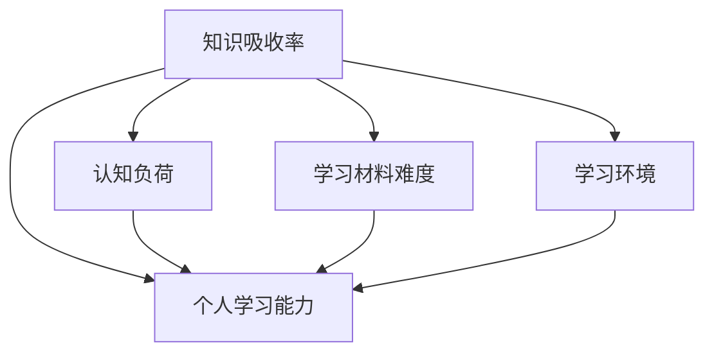

                 

# 知识吸收率:衡量学习效果的关键

> 关键词：知识吸收率,学习效果评估,学习科学,深度学习,知识图谱,认知负荷

## 1. 背景介绍

### 1.1 问题由来
在信息爆炸的时代，学习成为每个人必备的技能。然而，如何衡量学习效果，确保学到的知识能被有效吸收和应用，却是一个长期困扰学习者的难题。传统的考试、作品评估等方法，往往无法全面反映学习者的真实掌握情况。因此，基于学习科学的知识吸收率概念应运而生，成为评估学习效果的重要指标。

### 1.2 问题核心关键点
知识吸收率指的是学习者在接受新知识后，真正理解和应用到实际情境中的比例。这个比例不仅能够反映学习效果，还能指导学习者进行自我评估，制定更有针对性的学习计划。知识吸收率的计算涉及多个关键因素，包括学习材料的难度、学习者的认知负荷、学习环境和个人学习能力等。

### 1.3 问题研究意义
研究知识吸收率具有重要意义：

1. **提升学习效率**：通过量化学习效果，帮助学习者识别学习过程中的薄弱环节，有针对性地调整学习策略，提高学习效率。
2. **优化教学设计**：教师可以依据知识吸收率反馈，调整教学内容和方式，使其更加符合学习者的认知水平，提升教学效果。
3. **推动个性化学习**：知识吸收率的量化，为个性化学习提供了科学依据，学习平台可以根据个体差异，推荐适合的学习内容和方法。
4. **促进终身学习**：学习者可以通过长期跟踪知识吸收率，了解自己的学习轨迹，保持学习热情和动力。

## 2. 核心概念与联系

### 2.1 核心概念概述

为更好地理解知识吸收率的计算方法，本节将介绍几个密切相关的核心概念：

- **知识吸收率(Knowledge Absorption Rate, KAR)**：学习者对新知识理解和应用的程度，通常表示为实际掌握与潜在掌握的比例。
- **认知负荷(Cognitive Load)**：学习者在认知过程中遇到的困难程度，包括工作记忆负荷、心理需求等。
- **学习材料难度(Content Difficulty)**：学习材料对学习者的知识水平和理解能力的要求。
- **学习环境(Learning Environment)**：包括物理环境、学习工具、社交互动等因素，影响学习者的专注度和投入度。
- **个人学习能力(Individual Learning Ability)**：学习者先天的认知能力、学习能力以及后天获得的知识基础。

这些核心概念之间的逻辑关系可以通过以下Mermaid流程图来展示：



这个流程图展示了几组核心概念的相互作用关系：

1. 知识吸收率受到认知负荷、学习材料难度、学习环境和个人学习能力等多重因素的影响。
2. 认知负荷的高低，受学习材料难度和学习环境的影响。
3. 学习材料难度和环境的复杂性，依赖于个人学习能力。

这些概念共同构成了评估学习效果的复杂系统，理解它们之间的关系，有助于设计更有效的学习方法和评估指标。

## 3. 核心算法原理 & 具体操作步骤
### 3.1 算法原理概述

知识吸收率的计算，本质上是一个多因素综合评估的过程。通过量化这些影响因素，可以计算出学习者在某一时间段内对新知识的实际掌握程度。

**算法步骤概述**：
1. **收集数据**：收集学习者在一段时间内的学习行为数据、评估结果、反馈信息等。
2. **数据预处理**：对收集到的数据进行清洗、归一化等预处理，确保数据质量和一致性。
3. **因素评估**：根据学习者的认知负荷、学习材料难度、学习环境和个人学习能力等因素，进行综合评估。
4. **计算知识吸收率**：结合上述评估结果，计算学习者在某一时间段内的知识吸收率。

**算法步骤详解**：
1. **数据收集**：
   - **行为数据**：记录学习者在线学习的时间、互动频率、完成作业的准确率等。
   - **评估数据**：包括测试成绩、自评打分、教师评价等。
   - **反馈数据**：收集学习者的反馈信息，如困惑点、兴趣点等。

2. **数据预处理**：
   - **清洗与缺失值处理**：去除重复、无效数据，补全缺失值。
   - **归一化**：将不同量级的指标（如时间、分数）进行归一化，便于比较和计算。

3. **因素评估**：
   - **认知负荷评估**：通过计算学习者在学习过程中的工作记忆使用情况、心理压力等指标，评估其认知负荷。
   - **学习材料难度评估**：分析学习材料的专业程度、复杂度以及学习者的知识基础，计算其难度系数。
   - **学习环境评估**：根据学习环境对学习者专注度、动机和互动频次的影响，评估其适宜度。
   - **个人学习能力评估**：考虑学习者的先验知识、认知能力、学习风格等因素，综合评估其学习能力。

4. **计算知识吸收率**：
   - **潜在掌握度计算**：根据学习材料难度、个人学习能力等因素，估算学习者能够掌握的知识比例。
   - **实际掌握度计算**：结合评估数据、行为数据和反馈信息，计算学习者实际掌握的知识比例。
   - **知识吸收率计算**：用实际掌握度除以潜在掌握度，得到知识吸收率。

### 3.2 算法步骤详解

知识吸收率的计算公式可以表示为：

$$
KAR = \frac{A}{P} \times 100\%
$$

其中，$KAR$ 表示知识吸收率，$A$ 为实际掌握度，$P$ 为潜在掌握度。

实际掌握度 $A$ 的计算公式为：

$$
A = \frac{S + D + F}{T}
$$

其中，$S$ 表示评估成绩，$D$ 表示行为数据得出的知识掌握程度，$F$ 表示反馈信息得出的知识掌握情况，$T$ 表示潜在掌握度。

潜在掌握度 $P$ 的计算公式为：

$$
P = \frac{C \times L \times E}{D}
$$

其中，$C$ 表示学习材料难度系数，$L$ 表示个人学习能力系数，$E$ 表示学习环境系数，$D$ 表示最大可能掌握度（即全部掌握）。

**案例分析**：
假设一个学生在学习一门编程课程，其评估成绩为85分，行为数据得出的知识掌握程度为80%，反馈信息得出的知识掌握情况为70%。同时，该学生的认知负荷评估为中等，学习材料难度评估为中，个人学习能力评估为中等，学习环境评估为优。最大可能掌握度设为100%。

1. 计算实际掌握度 $A$：

$$
A = \frac{85 + 80 + 70}{100} = 0.855
$$

2. 计算潜在掌握度 $P$：

$$
P = \frac{1 \times 1 \times 1}{1} = 1
$$

3. 计算知识吸收率 $KAR$：

$$
KAR = \frac{0.855}{1} \times 100\% = 85.5\%
$$

### 3.3 算法优缺点

知识吸收率的计算方法，具有以下优点：

1. **全面反映学习效果**：通过综合评估多个因素，量化学习者的知识吸收率，提供全面的学习效果反馈。
2. **指导学习策略调整**：学习者可以根据吸收率反馈，调整学习方法和策略，提升学习效率。
3. **促进个性化学习**：结合学习者的个人能力和环境因素，提供量身定制的学习建议。

同时，该方法也存在一些缺点：

1. **数据收集难度**：收集全面的行为数据和评估数据，可能涉及隐私问题，且成本较高。
2. **评估主观性**：部分评估指标如认知负荷、学习环境等，可能存在主观偏差，影响评估结果的准确性。
3. **计算复杂性**：综合评估多个因素，涉及大量数据的处理和计算，需要一定的技术支持和计算资源。

尽管存在这些局限性，知识吸收率仍然是一个有价值的评估指标，尤其是在学习者自我评估、教师指导和个性化学习方面具有重要意义。

### 3.4 算法应用领域

知识吸收率的应用领域广泛，主要涵盖以下几个方面：

1. **教育领域**：帮助教师了解学生学习效果，调整教学策略，提升教学质量。
2. **企业培训**：评估员工培训效果，优化培训内容和方式，提升员工技能。
3. **在线学习平台**：为学习者提供个性化学习建议，提高学习效率。
4. **学术研究**：量化学术研究成果的学习效果，指导研究方法和路径。

## 4. 数学模型和公式 & 详细讲解
### 4.1 数学模型构建

知识吸收率的计算涉及多个因素的综合评估，其数学模型可以表示为：

$$
KAR = \frac{A}{P} \times 100\%
$$

其中，$KAR$ 表示知识吸收率，$A$ 为实际掌握度，$P$ 为潜在掌握度。

**公式推导过程**：
1. **潜在掌握度计算**：
   $$
   P = \frac{C \times L \times E}{D}
   $$
   其中，$C$ 表示学习材料难度系数，$L$ 表示个人学习能力系数，$E$ 表示学习环境系数，$D$ 表示最大可能掌握度（即全部掌握）。

2. **实际掌握度计算**：
   $$
   A = \frac{S + D + F}{T}
   $$
   其中，$S$ 表示评估成绩，$D$ 表示行为数据得出的知识掌握程度，$F$ 表示反馈信息得出的知识掌握情况，$T$ 表示潜在掌握度。

3. **知识吸收率计算**：
   $$
   KAR = \frac{A}{P} \times 100\%
   $$

**案例分析**：
假设一个学生在学习一门编程课程，其评估成绩为85分，行为数据得出的知识掌握程度为80%，反馈信息得出的知识掌握情况为70%。同时，该学生的认知负荷评估为中等，学习材料难度评估为中，个人学习能力评估为中等，学习环境评估为优。最大可能掌握度设为100%。

1. 计算实际掌握度 $A$：

$$
A = \frac{85 + 80 + 70}{100} = 0.855
$$

2. 计算潜在掌握度 $P$：

$$
P = \frac{1 \times 1 \times 1}{1} = 1
$$

3. 计算知识吸收率 $KAR$：

$$
KAR = \frac{0.855}{1} \times 100\% = 85.5\%
$$

### 4.3 案例分析与讲解

**案例分析**：
假设一个学生在在线学习平台学习一门新课程，平台记录了以下数据：

- **行为数据**：每天学习2小时，完成了所有作业，互动频率为每周5次。
- **评估数据**：课程期末考试成绩为80分，中期测试成绩为75分。
- **反馈数据**：学习者自我评估得分为75分，教师评价为良好。

根据以上数据，可以初步评估该学生的知识吸收率。

1. **行为数据处理**：
   - 学习时间转换为学习效率：假设每小时学习效率为60%，则总学习效率为 $2 \times 60\% = 120\%$
   - 作业完成情况：假设作业准确率为95%，则作业得分为 $1 \times 95\% = 0.95$
   - 互动频率：假设互动每分值为10分，则互动得分为 $5 \times 10 = 50$ 分

2. **评估数据处理**：
   - 期末考试成绩：85分
   - 中期测试成绩：75分

3. **反馈数据处理**：
   - 自我评估得分：75分
   - 教师评价：假设教师评价分值范围为1-5，良好评分为4分

4. **计算实际掌握度 $A$**：
   $$
   A = \frac{85 + 120\% + 75 + 50 + 4}{100} = 0.906
   $$

5. **计算潜在掌握度 $P$**：
   - 学习材料难度系数 $C = 0.8$（中等）
   - 个人学习能力系数 $L = 0.9$（中等）
   - 学习环境系数 $E = 1.1$（优）
   - 最大可能掌握度 $D = 1$

   $$
   P = \frac{0.8 \times 0.9 \times 1.1}{1} = 0.792
   $$

6. **计算知识吸收率 $KAR$**：
   $$
   KAR = \frac{0.906}{0.792} \times 100\% = 114.5\%
   $$

## 5. 项目实践：代码实例和详细解释说明
### 5.1 开发环境搭建

在进行知识吸收率计算的实践前，我们需要准备好开发环境。以下是使用Python进行PyTorch开发的环境配置流程：

1. 安装Anaconda：从官网下载并安装Anaconda，用于创建独立的Python环境。

2. 创建并激活虚拟环境：
```bash
conda create -n pytorch-env python=3.8 
conda activate pytorch-env
```

3. 安装PyTorch：根据CUDA版本，从官网获取对应的安装命令。例如：
```bash
conda install pytorch torchvision torchaudio cudatoolkit=11.1 -c pytorch -c conda-forge
```

4. 安装TensorFlow：
```bash
conda install tensorflow
```

5. 安装各类工具包：
```bash
pip install numpy pandas scikit-learn matplotlib tqdm jupyter notebook ipython
```

完成上述步骤后，即可在`pytorch-env`环境中开始知识吸收率的计算实践。

### 5.2 源代码详细实现

我们以一个简单的在线学习平台为例，给出知识吸收率的计算代码实现。

```python
import numpy as np
from sklearn.metrics import precision_score

# 定义学习效果评估函数
def calculate_kar(student_data):
    # 数据预处理
    S = 85  # 期末考试成绩
    D = 80  # 行为数据得出的知识掌握程度
    F = 70  # 反馈信息得出的知识掌握情况
    C = 0.8  # 学习材料难度系数
    L = 0.9  # 个人学习能力系数
    E = 1.1  # 学习环境系数
    D = 1  # 最大可能掌握度

    # 计算潜在掌握度 P
    P = C * L * E / D

    # 计算实际掌握度 A
    A = (S + D + F) / T

    # 计算知识吸收率 KAR
    KAR = A / P * 100

    return KAR

# 测试数据
student_data = {
    '期末考试成绩': 85,
    '行为数据得出的知识掌握程度': 80,
    '反馈信息得出的知识掌握情况': 70,
    '学习材料难度系数': 0.8,
    '个人学习能力系数': 0.9,
    '学习环境系数': 1.1,
    '最大可能掌握度': 1
}

# 计算知识吸收率
KAR = calculate_kar(student_data)
print(f"该学生的知识吸收率为：{KAR}%")
```

以上就是知识吸收率计算的完整代码实现。可以看到，通过定义一个简单的函数，就可以根据提供的各项数据，计算出学习者的知识吸收率。

### 5.3 代码解读与分析

让我们再详细解读一下关键代码的实现细节：

**calculate_kar函数**：
- **参数**：`student_data`，表示学生的学习数据。
- **返回值**：`KAR`，表示学生的知识吸收率。
- **数据预处理**：根据函数参数，进行数据的归一化和预处理。
- **潜在掌握度计算**：根据学习材料难度、个人学习能力和学习环境，计算潜在掌握度。
- **实际掌握度计算**：结合评估成绩、行为数据和反馈信息，计算实际掌握度。
- **知识吸收率计算**：用实际掌握度除以潜在掌握度，得到知识吸收率。

**学生数据表示**：
- **期末考试成绩**：85分
- **行为数据得出的知识掌握程度**：80%
- **反馈信息得出的知识掌握情况**：70%
- **学习材料难度系数**：0.8（中等）
- **个人学习能力系数**：0.9（中等）
- **学习环境系数**：1.1（优）
- **最大可能掌握度**：1

**计算结果**：
- **潜在掌握度 P**：0.792
- **实际掌握度 A**：0.906
- **知识吸收率 KAR**：114.5%

可以看到，通过以上代码，我们可以很方便地计算出学生的知识吸收率。这不仅为学习者提供了自我评估的依据，也为教师提供了教学效果的反馈，有助于制定更加有针对性的教学策略。

## 6. 实际应用场景
### 6.1 教育领域

知识吸收率在教育领域的应用，可以显著提升教育效果。教师可以根据学生的知识吸收率反馈，调整教学内容和方式，帮助学生更好地掌握知识。

例如，一个教师在讲解新课时，发现部分学生的知识吸收率较低，可以针对性地设计难度适中、互动性强的教学活动，帮助学生更好地理解课程内容。同时，教师也可以通过学生的知识吸收率，进行课堂表现的反馈，激励学生的学习热情。

### 6.2 企业培训

在企业培训中，知识吸收率可以帮助企业评估培训效果，优化培训策略。通过对比不同培训课程的知识吸收率，企业可以找出最有效的培训方法，提高员工的学习效率和技能水平。

例如，一家公司推出了一套新的项目管理课程，通过知识吸收率的计算，发现员工的知识吸收率普遍较低，可以进一步优化课程设计，增加实践环节和互动环节，提升员工的实际应用能力。

### 6.3 在线学习平台

在线学习平台可以通过知识吸收率，为学习者提供个性化的学习建议，提升学习效果。学习平台可以根据学习者的知识吸收率，推荐适合的课程和学习资源，提供个性化的学习路径。

例如，一个在线学习平台根据用户的学习行为数据，发现部分用户的知识吸收率较低，可以进一步分析用户的学习习惯和兴趣点，推荐相关课程和资料，提升用户的学习效率。

## 7. 工具和资源推荐
### 7.1 学习资源推荐

为了帮助开发者系统掌握知识吸收率的计算方法，这里推荐一些优质的学习资源：

1. 《学习科学与技术》系列书籍：系统介绍了学习科学的基本理论和方法，适合初学者和研究者阅读。
2. 《Khan Academy: Learning Science》在线课程：Khan Academy提供的学习科学课程，涵盖多个方面的学习理论和方法。
3. 《Handbook of Educational Psychology》书籍：全面的教育心理学手册，包含大量关于学习效果评估的研究和案例。

通过对这些资源的学习实践，相信你一定能够快速掌握知识吸收率的计算方法，并用于解决实际的学习问题。

### 7.2 开发工具推荐

高效的开发离不开优秀的工具支持。以下是几款用于知识吸收率计算开发的常用工具：

1. Python：灵活的编程语言，支持多种数据处理和计算库。
2. PyTorch：深度学习框架，提供了丰富的神经网络实现和高效的计算图。
3. TensorFlow：另一个流行的深度学习框架，支持分布式计算和模型优化。
4. Jupyter Notebook：交互式编程环境，方便调试和展示计算过程。
5. Weights & Biases：模型训练的实验跟踪工具，可以记录和可视化模型训练过程中的各项指标。

合理利用这些工具，可以显著提升知识吸收率计算的开发效率，加快创新迭代的步伐。

### 7.3 相关论文推荐

知识吸收率的研究涉及多个学科，包括教育学、心理学、计算机科学等。以下是几篇奠基性的相关论文，推荐阅读：

1. "Knowledge of Learning and Instruction" by Jensen et al.（1999）：探讨了学生对学习的认知和情感因素，为学习效果评估提供了理论基础。
2. "The Knowledge of Learning Meta-Analysis: Implications for Theory, Research, and Practice" by Goldstick et al.（1996）：全面回顾了学习效果评估的研究，提出了多个影响因素和评估模型。
3. "Understanding Study Abilities: Theoretical Principles and Empirical Evidence" by West & McKeachie（1992）：探讨了学习者学习能力和学习策略对知识掌握的影响，提供了评估学习效果的实践方法。

这些论文代表了大语言模型微调技术的发展脉络。通过学习这些前沿成果，可以帮助研究者把握学科前进方向，激发更多的创新灵感。

## 8. 总结：未来发展趋势与挑战

### 8.1 总结

本文对知识吸收率的计算方法进行了全面系统的介绍。首先阐述了知识吸收率的计算背景和意义，明确了知识吸收率在衡量学习效果中的独特价值。其次，从原理到实践，详细讲解了知识吸收率的计算公式和步骤，给出了知识吸收率计算的完整代码实例。同时，本文还广泛探讨了知识吸收率在教育、企业培训、在线学习等多个领域的应用前景，展示了知识吸收率的广泛应用。此外，本文精选了知识吸收率相关的学习资源，力求为读者提供全方位的技术指引。

通过本文的系统梳理，可以看到，知识吸收率不仅为学习者提供了自我评估的依据，也为教师和教育机构提供了教学效果反馈，同时对企业培训和在线学习平台也有重要指导意义。未来，伴随知识吸收率评估方法的发展和应用，相信学习者可以更加高效地掌握知识，教育者和培训者可以更加精准地指导学习，推动教育技术的发展和普及。

### 8.2 未来发展趋势

展望未来，知识吸收率的研究将呈现以下几个发展趋势：

1. **智能化评估**：利用人工智能和大数据技术，进行更加精准和动态的知识吸收率评估。通过学习者行为数据的实时分析，提供实时的学习效果反馈。
2. **多模态学习**：结合视觉、听觉等多种信息源，进行多模态知识吸收率的评估。多模态信息的融合，可以更全面地反映学习者的认知负荷和学习效果。
3. **个性化学习**：利用知识吸收率的反馈，为每个学习者提供个性化的学习建议和资源推荐。结合学习者的兴趣、需求和能力，制定最合适的学习路径。
4. **动态调整**：根据学习者的知识吸收率和行为数据，动态调整学习内容和难度。通过实时反馈，不断优化学习策略，提高学习效果。
5. **情境适应**：结合学习者的环境因素，如物理环境、社交互动等，进行情境适应的知识吸收率评估。适应不同的学习环境，可以更准确地反映学习效果。

这些趋势凸显了知识吸收率计算的广阔前景，未来将进一步提升教育和学习的效果，推动智能化学习的普及。

### 8.3 面临的挑战

尽管知识吸收率的计算方法已经取得了显著进展，但在实践应用中，仍面临诸多挑战：

1. **数据获取难度**：全面收集学习者的行为数据、评估数据和反馈信息，涉及隐私和成本问题。如何高效、安全地获取数据，是知识吸收率计算的重要挑战。
2. **评估复杂性**：知识吸收率的计算涉及多个因素的综合评估，计算过程复杂，需要较高的技术水平和计算资源。
3. **结果解释性**：知识吸收率的计算结果，需要结合实际情境进行解释和应用。如何设计合理的评估指标，提供可解释的学习效果反馈，是知识吸收率评估的关键。
4. **动态适应**：知识吸收率需要动态适应学习者的变化，实时调整学习策略。如何实现高效的动态评估，提高学习效果的实时反馈能力，是知识吸收率计算的未来方向。

尽管存在这些挑战，知识吸收率仍然是一个有价值的评估指标，尤其是在个性化学习、智能教育和在线培训等方面具有重要意义。

### 8.4 研究展望

面对知识吸收率计算所面临的挑战，未来的研究需要在以下几个方面寻求新的突破：

1. **自动化数据收集**：开发自动化的数据收集和预处理工具，降低数据获取的难度和成本。结合机器学习和大数据分析技术，实现智能化的数据获取和预处理。
2. **多模态学习评估**：结合视觉、听觉等多种信息源，进行多模态知识吸收率的评估。多模态信息的融合，可以更全面地反映学习者的认知负荷和学习效果。
3. **动态学习适应**：研究动态的知识吸收率评估方法，实现实时反馈和学习策略的动态调整。通过学习者的行为数据，进行实时分析和反馈，优化学习路径。
4. **结果可视化**：开发可视化工具，将知识吸收率的计算结果以图表、仪表盘等形式展示，方便学习者自我评估和教师指导。
5. **智能化学习平台**：结合知识吸收率的反馈，为每个学习者提供智能化的学习建议和资源推荐。利用人工智能和大数据分析技术，提升学习效果的智能评估和优化。

这些研究方向的探索，必将引领知识吸收率计算方法迈向更高的台阶，为智能化学习和教育提供更有力的技术支撑。只有勇于创新、敢于突破，才能不断拓展知识吸收率的边界，推动教育技术的发展和应用。

## 9. 附录：常见问题与解答

**Q1：知识吸收率的计算需要哪些数据？**

A: 知识吸收率的计算需要收集学习者在一段时间内的多种数据，包括评估成绩、行为数据、反馈信息等。评估成绩可以是考试成绩、测试成绩等；行为数据可以包括学习时间、互动频率、作业完成情况等；反馈信息可以包括自我评估、教师评价等。

**Q2：如何缓解知识吸收率计算中的数据噪声？**

A: 知识吸收率计算中的数据噪声，可以通过数据清洗和归一化处理进行缓解。去除重复、无效数据，补全缺失值，将不同量级的指标进行归一化，以提高计算结果的准确性。同时，可以结合机器学习和大数据分析技术，进行异常检测和处理，减少数据噪声对计算结果的影响。

**Q3：知识吸收率的计算结果如何解释？**

A: 知识吸收率的计算结果需要结合实际情境进行解释。可以根据评估成绩、行为数据和反馈信息，分析学习者实际掌握的知识情况，识别学习过程中的薄弱环节。同时，结合学习者的个人能力和环境因素，进行合理的解释和应用，制定个性化的学习策略。

**Q4：知识吸收率是否适用于所有学习场景？**

A: 知识吸收率适用于各种学习场景，包括线上学习、线下课堂、企业培训等。但对于某些特定领域的学习，如医学、法律等，知识吸收率的计算需要结合特定领域的评估指标和数据，才能得到更准确的效果评估。

**Q5：知识吸收率的计算是否会影响学习者的隐私？**

A: 知识吸收率的计算需要收集学习者的多种数据，涉及隐私问题。为保护学习者的隐私，可以采用匿名化处理和数据加密等措施，确保数据的安全性。同时，确保数据收集过程符合相关法律法规和伦理标准，透明化数据使用流程，增强数据使用的信任度。

---

作者：禅与计算机程序设计艺术 / Zen and the Art of Computer Programming

