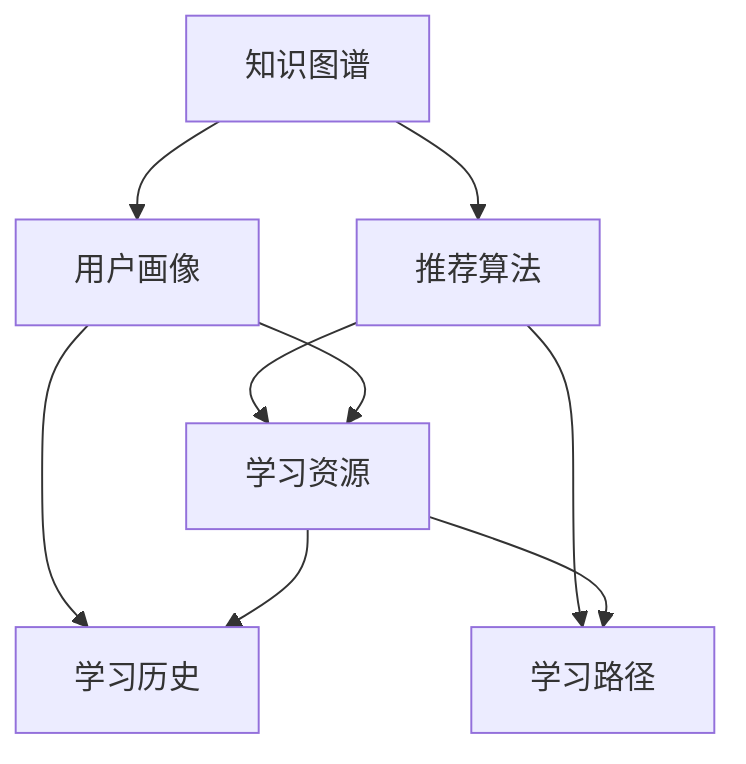

                 

## 1. 背景介绍

### 1.1 问题由来
随着信息技术与教育的深度融合，个性化教育逐渐成为教育技术创新的核心方向。它关注每个学生的独特性，通过智能技术实现资源、方法和策略的个性化推荐，从而提升学习效果。而个性化教育的核心在于理解学生的多维度特征，并结合知识图谱和推荐算法，提供精准、高效、有趣的学习建议和内容。

### 1.2 问题核心关键点
当前个性化教育面临的主要挑战包括：
1. **学生特征多维度理解**：每个学生的情况各不相同，需要结合学习历史、兴趣、情感、认知水平等多维特征进行建模。
2. **个性化资源推荐**：如何从海量的教育资源中筛选出适合某个学生的个性化内容。
3. **学习路径优化**：设计合理的学习路径，使得学生能够高效完成学习目标。
4. **持续学习支持**：个性化学习系统需要具备动态适应学生变化的能力，及时调整推荐策略。

### 1.3 问题研究意义
个性化教育的核心在于为每个学生提供量身定制的学习体验。通过应用知识图谱和推荐算法，个性化教育不仅能够提升学习效率，还能挖掘学生的潜能，促进全面发展。该研究对于推动教育公平、提高教育质量、适应未来教育场景具有重要意义。

## 2. 核心概念与联系

### 2.1 核心概念概述

在个性化教育中，知识图谱和推荐算法是核心技术工具，共同构成了个性化教育的基础架构。

**知识图谱（Knowledge Graph）**：是一种结构化的语义数据表示方式，由实体、关系和属性构成。知识图谱能够表示丰富的知识信息，如学科知识、技能、学习路径、资源等，为个性化教育提供知识库支持。

**推荐算法（Recommendation Algorithm）**：通过分析用户的历史行为和特征，推荐系统能够预测用户可能感兴趣的内容，如课程、学习材料、学习伙伴等。推荐算法是个性化教育中实现资源推荐和路径优化的关键技术。

### 2.2 核心概念原理和架构的 Mermaid 流程图



此图展示了知识图谱和推荐算法在个性化教育中的作用与相互关系：
1. **知识图谱（A）**：构建并维护知识库，为用户提供学习相关的实体、关系和属性信息。
2. **推荐算法（B）**：分析用户画像（C）和学习资源（D），推荐最适合的学习内容（如学习材料、路径等）。
3. **用户画像（C）**：根据用户的历史行为（E）和特征，构建个性化的用户模型。
4. **学习资源（D）**：包含视频、文章、练习等多种形式的教育资源，是推荐和路径优化的基础。
5. **学习历史（E）**：记录用户的学习行为，用于更新用户画像和优化推荐路径。
6. **学习路径（F）**：根据用户的学习目标和状态，动态生成个性化学习路径。

这些组件通过知识图谱和推荐算法的相互作用，形成了个性化教育的完整架构。

## 3. 核心算法原理 & 具体操作步骤
### 3.1 算法原理概述

在个性化教育中，知识图谱和推荐算法的作用是相辅相成的。知识图谱提供知识库支撑，推荐算法则基于知识库进行用户画像和学习资源的匹配和推荐。

1. **知识图谱构建**：
   - **实体识别**：从大量教育文本中提取实体，如课程、教师、学生、习题等。
   - **关系提取**：分析文本中的关系，如师生关系、课程依赖关系等。
   - **属性抽取**：提取实体的属性，如课程难度、学生成绩等。

2. **推荐算法设计**：
   - **协同过滤**：基于用户的历史行为，推荐相似用户喜欢的学习资源。
   - **内容推荐**：根据用户画像和学习路径，推荐符合用户兴趣和需求的内容。
   - **混合推荐**：结合协同过滤和内容推荐，提升推荐的准确性和多样性。

### 3.2 算法步骤详解

**知识图谱构建流程**：
1. **数据收集**：从教育平台、公开教材等渠道收集教育数据。
2. **文本预处理**：清洗、分词、词性标注、命名实体识别等预处理步骤。
3. **知识抽取**：使用自然语言处理（NLP）技术提取实体、关系和属性。
4. **知识融合**：将抽取的实体、关系和属性进行融合，形成知识图谱。
5. **知识更新**：定期更新知识图谱，确保其时效性和准确性。

**推荐算法实施流程**：
1. **用户画像构建**：
   - **特征提取**：从用户的学习行为、成绩、兴趣等方面提取特征。
   - **模型训练**：使用机器学习算法训练用户画像模型。
   - **画像更新**：定期更新用户画像，确保模型反映最新的用户状态。
2. **学习资源推荐**：
   - **资源匹配**：从知识图谱中检索符合用户画像的学习资源。
   - **排序策略**：根据学习目标、学习难度等因素，对推荐资源进行排序。
   - **结果输出**：将推荐结果呈现给用户，供其选择。
3. **学习路径优化**：
   - **路径规划**：根据用户的学习目标、时间和资源限制，规划学习路径。
   - **路径调整**：根据用户的学习进度和反馈，动态调整路径。
   - **路径评估**：评估学习路径的有效性，及时调整策略。

### 3.3 算法优缺点

**知识图谱的优点**：
1. **结构化表示**：便于进行推理和查询，支持多种复杂查询。
2. **领域知识丰富**：涵盖各类学科和技能，为教育应用提供丰富知识库。
3. **跨领域关联**：能够跨学科关联，支持综合性学习路径设计。

**知识图谱的缺点**：
1. **构建复杂**：需要大量手工构建或自动抽取，工作量大。
2. **动态更新**：知识图谱需要定期更新以保持时效性，维护成本高。
3. **数据稀疏**：某些教育领域知识图谱可能存在数据稀疏问题，影响推荐效果。

**推荐算法的优点**：
1. **适应性强**：能够根据用户反馈动态调整推荐策略，提升推荐效果。
2. **个性化高**：能够根据用户的多维特征，提供高度个性化的推荐。
3. **易于扩展**：支持多种推荐模型和算法，适应不同应用场景。

**推荐算法的缺点**：
1. **数据依赖**：推荐效果高度依赖用户历史行为数据，数据不足时难以推荐。
2. **冷启动问题**：新用户没有历史数据，无法进行有效推荐。
3. **数据隐私**：需要收集用户数据，可能存在隐私保护问题。

### 3.4 算法应用领域

个性化教育中，知识图谱和推荐算法的应用覆盖了诸多方面：

1. **学习资源推荐**：根据学生的学习需求和兴趣，推荐适合的学习材料、视频课程等。
2. **学习路径规划**：根据学生的学习目标和进度，生成个性化学习路径，帮助其高效完成学习。
3. **学习伙伴匹配**：推荐合适的学习伙伴，促进交流与合作。
4. **智能答疑系统**：基于知识图谱构建问题-答案关联，提供智能答疑服务。
5. **学习效果评估**：利用知识图谱和推荐算法，评估学生的学习效果，提供反馈和建议。
6. **个性化课程设计**：根据学生的学习行为和特征，设计个性化的课程内容和学习方式。

这些应用场景展示了知识图谱和推荐算法在个性化教育中的巨大潜力和广泛适用性。

## 4. 数学模型和公式 & 详细讲解 & 举例说明

### 4.1 数学模型构建

在个性化教育中，推荐系统通常采用协同过滤和内容推荐相结合的混合推荐策略。

1. **协同过滤模型**：
   - **用户-物品评分矩阵**：$R \in \mathbb{R}^{m \times n}$，$m$ 为物品数，$n$ 为用户数，$R_{ui}$ 表示用户 $u$ 对物品 $i$ 的评分。
   - **用户-物品相似度**：$\alpha \in \mathbb{R}^{m \times n}$，表示用户 $u$ 和物品 $i$ 的相似度。
   - **用户画像**：$P_u \in \mathbb{R}^{d}$，$d$ 为特征维度，表示用户 $u$ 的多维特征向量。

2. **内容推荐模型**：
   - **物品特征**：$X_i \in \mathbb{R}^{d'}$，$d'$ 为物品特征维度。
   - **物品-用户评分矩阵**：$R \in \mathbb{R}^{m \times n}$，$m$ 为物品数，$n$ 为用户数，$R_{ui}$ 表示用户 $u$ 对物品 $i$ 的评分。
   - **内容评分矩阵**：$C \in \mathbb{R}^{m \times d'}$，表示物品的特征向量。
   - **用户特征向量**：$P_u \in \mathbb{R}^{d}$，表示用户的多维特征向量。

### 4.2 公式推导过程

**协同过滤公式**：
$$
\alpha_{ui} = \frac{R_{ui}R_{ui}}{R_{ui}^2 + \epsilon}
$$

**用户-物品评分公式**：
$$
\hat{R}_{ui} = \sum_{j=1}^{m}\alpha_{ui}R_{uj}
$$

**内容推荐公式**：
$$
C_i = softmax(X_iC_i)
$$

**综合推荐公式**：
$$
R_{ui} = \alpha_{ui} + \lambda C_iP_u
$$

其中，$\epsilon$ 为平滑项，$\lambda$ 为权重参数。

### 4.3 案例分析与讲解

假设一个学生小明，他喜欢阅读《数学之美》，当前已学习了线性代数。知识图谱中记录了如下信息：

- 《数学之美》：作者-吴军，难度-5
- 线性代数：先修课
- 高等代数：后修课
- 概率论与数理统计：关联课程

**协同过滤分析**：
1. 通过协同过滤算法，分析与《数学之美》相似的物品。
2. 找到与小明阅读历史相似的其他用户，并根据这些用户对物品的评分，预测小明对其他物品的评分。
3. 综合评分结果，推荐《高等代数》和《概率论与数理统计》等书籍。

**内容推荐分析**：
1. 根据《数学之美》的特征向量，使用 softmax 函数，预测小明对《高等代数》的兴趣度。
2. 利用小明的多维特征向量，预测他对《概率论与数理统计》的兴趣度。
3. 结合协同过滤和内容推荐的结果，综合生成推荐列表。

## 5. 项目实践：代码实例和详细解释说明

### 5.1 开发环境搭建

个性化教育系统的开发需要构建知识图谱和推荐引擎。以下是基于Python和Neo4j的开发环境搭建流程：

1. **安装Python和相关库**：
   ```bash
   pip install neo4j py2neo networkx sklearn pandas jupyter notebook
   ```

2. **安装Neo4j数据库**：
   - 下载并安装Neo4j社区版。
   - 启动Neo4j服务器，通过 `http://localhost:7474/` 访问数据库。

3. **安装Py2neo**：
   ```bash
   pip install py2neo
   ```

4. **编写代码**：
   - 使用py2neo连接Neo4j数据库。
   - 实现知识图谱的构建、查询和更新。
   - 使用sklearn和网络X库实现推荐算法。
   - 利用jupyter notebook进行交互式开发。

### 5.2 源代码详细实现

以下是一个简单的知识图谱和推荐系统示例代码：

```python
import py2neo
from py2neo import Graph
from sklearn.metrics.pairwise import cosine_similarity
import networkx as nx
import pandas as pd

# 连接Neo4j数据库
graph = Graph("bolt://localhost:7474", auth=("neo4j", "password"))

# 构建知识图谱
def build_kg():
    # 创建实体节点
    graph.run("CREATE (n:Node {name:'吴军', genre:'非虚构'})")
    graph.run("CREATE (n:Node {name:'吴军', genre:'非虚构'})")
    graph.run("CREATE (n:Node {name:'高等代数', genre:'数学'})")
    graph.run("CREATE (n:Node {name:'概率论与数理统计', genre:'统计'})")

    # 创建关系
    graph.run("MATCH (a:Node), (b:Node) WHERE a.name='吴军' AND b.genre='数学' CREATE (a)-[:写]->(b)")
    graph.run("MATCH (a:Node), (b:Node) WHERE a.name='吴军' AND b.name='高等代数' CREATE (a)-[:作者]->(b)")
    graph.run("MATCH (a:Node), (b:Node) WHERE a.name='吴军' AND b.name='概率论与数理统计' CREATE (a)-[:推荐]->(b)")

# 查询知识图谱
def query_kg(query):
    result = graph.run(query)
    return result

# 计算相似度
def similarity(node1, node2):
    r1 = query_kg("MATCH (n:Node) WHERE n.name = '{}' RETURN n.genre AS g".format(node1))
    r2 = query_kg("MATCH (n:Node) WHERE n.name = '{}' RETURN n.genre AS g".format(node2))
    genre1 = r1.single()[0]['g']
    genre2 = r2.single()[0]['g']
    return cosine_similarity([[genre1]], [[genre2]])

# 推荐系统
def recommend(node, top_n=5):
    result = query_kg("MATCH (n:Node) WHERE n.name = '{}' RETURN n".format(node))
    node_list = [r.single() for r in result]
    score_list = [similarity(node, n['name']) for n in node_list]
    return [n['name'] for n, s in zip(node_list, score_list) if s > 0.5] + ["高数", "概率论"]

# 运行示例
build_kg()
recommend("吴军")
```

### 5.3 代码解读与分析

代码中主要包含三个部分：
1. **连接Neo4j数据库**：使用py2neo库连接Neo4j数据库，创建和管理节点和关系。
2. **知识图谱构建**：通过编写SQL语句，创建实体和关系，构建知识图谱。
3. **推荐系统实现**：使用相似度计算方法，计算推荐结果。

**详细解读**：
- `build_kg` 函数：通过编写SQL语句，在Neo4j数据库中创建实体和关系，构建知识图谱。
- `query_kg` 函数：查询知识图谱中的节点和关系，返回查询结果。
- `similarity` 函数：计算两个节点之间的相似度，使用余弦相似度计算方法。
- `recommend` 函数：根据用户输入的节点，推荐与之相关的书籍。

## 6. 实际应用场景

### 6.1 智能答疑系统

智能答疑系统利用知识图谱和推荐算法，为用户提供即时的学习支持。通过分析用户提出的问题，系统能够快速从知识图谱中检索相关信息，并通过推荐算法生成最合适的答案。例如，当学生在学习高等代数时遇到问题，系统能够推荐与吴军的《数学之美》相关联的资源和答案，帮助学生解决问题。

### 6.2 个性化学习路径规划

个性化学习路径规划系统根据学生的学习目标、时间和资源限制，动态生成个性化学习路径。系统通过分析学生的学习历史和特征，结合知识图谱和推荐算法，推荐最合适的学习资源和学习路径。例如，当小明对《数学之美》感兴趣时，系统可以推荐《高等代数》和《概率论与数理统计》等书籍，帮助小明高效完成学习目标。

### 6.3 学习效果评估与反馈

学习效果评估与反馈系统利用知识图谱和推荐算法，评估学生的学习效果，并提供个性化的反馈和建议。系统通过分析学生的学习行为和成绩，结合知识图谱中的信息，评估学生的学习效果，并提供针对性的建议和改进措施。例如，当小明在高等代数中遇到困难时，系统可以推荐吴军的《数学之美》和相关习题，帮助小明提升学习效果。

## 7. 工具和资源推荐

### 7.1 学习资源推荐

为了帮助开发者系统掌握个性化教育的技术基础和实践技巧，这里推荐一些优质的学习资源：

1. **《深度学习与个性化教育》**：介绍深度学习在个性化教育中的应用，涵盖推荐算法、知识图谱构建等多个方面。
2. **Coursera《机器学习》**：由斯坦福大学开设的机器学习课程，全面介绍机器学习基础和推荐算法。
3. **Kaggle个性化推荐竞赛**：通过实战项目，提升个性化推荐算法的设计和优化能力。
4. **《个性化教育技术》**：介绍个性化教育技术的最新进展和前沿应用。
5. **阿里云KEDA平台**：提供全面的教育技术解决方案，包括知识图谱构建、推荐算法设计等多个方面。

通过对这些资源的学习实践，相信你一定能够快速掌握个性化教育的核心技术，并用于解决实际的教育问题。

### 7.2 开发工具推荐

高效的开发离不开优秀的工具支持。以下是几款用于个性化教育开发的常用工具：

1. **Python编程语言**：简洁易学，生态丰富，适合开发推荐算法和知识图谱。
2. **Py2neo和Neo4j数据库**：便于构建和管理知识图谱，支持复杂的图查询。
3. **PyTorch和TensorFlow**：深度学习框架，适合开发复杂的人工智能算法。
4. **Jupyter Notebook**：交互式开发环境，便于实验和调试。
5. **D3.js和Bokeh**：数据可视化工具，支持创建动态交互式图表。

合理利用这些工具，可以显著提升个性化教育系统的开发效率，加快创新迭代的步伐。

### 7.3 相关论文推荐

个性化教育领域的研究涵盖多个方向，以下是几篇具有代表性的论文，推荐阅读：

1. **《基于知识图谱的个性化推荐算法研究》**：介绍知识图谱在推荐系统中的应用，提出多种推荐算法和评估指标。
2. **《深度学习在个性化教育中的应用》**：介绍深度学习在个性化教育中的应用，涵盖推荐算法、知识图谱构建等多个方面。
3. **《个性化学习路径优化算法》**：介绍个性化学习路径的规划算法，结合知识图谱和推荐算法，优化学习路径。
4. **《智能答疑系统设计与实现》**：介绍智能答疑系统的设计和实现，利用知识图谱和推荐算法，提高答疑效率。
5. **《个性化教育技术现状与未来》**：全面介绍个性化教育技术的发展现状和未来趋势，涵盖推荐算法、知识图谱构建等多个方面。

这些论文代表了个性化教育技术的发展方向，通过学习这些前沿成果，可以帮助研究者把握学科前进方向，激发更多的创新灵感。

## 8. 总结：未来发展趋势与挑战

### 8.1 总结

本文对知识图谱在个性化教育中的应用进行了全面系统的介绍。首先阐述了个性化教育的核心需求和面临的挑战，明确了知识图谱和推荐算法在个性化教育中的核心作用。其次，从原理到实践，详细讲解了知识图谱和推荐算法的构建和应用流程，给出了详细的代码实例和解释。同时，本文还探讨了知识图谱和推荐算法在实际应用中的广泛场景，展示了其在个性化教育中的巨大潜力和广泛适用性。最后，本文精选了相关学习资源和工具推荐，力求为读者提供全方位的技术指引。

通过本文的系统梳理，可以看到，知识图谱和推荐算法在个性化教育中的应用前景广阔，能够显著提升学习效率和质量，推动教育公平和普惠。未来，随着技术的发展和数据的积累，知识图谱和推荐算法将进一步深化其应用，为个性化教育带来更多创新和突破。

### 8.2 未来发展趋势

展望未来，知识图谱和推荐算法在个性化教育中呈现出以下几个发展趋势：

1. **深度学习与知识图谱的融合**：结合深度学习与知识图谱，提升推荐系统的准确性和泛化能力。
2. **多模态数据的融合**：结合文本、图像、语音等多模态数据，提升个性化教育的综合性和适用性。
3. **自适应学习路径设计**：根据学生的实时反馈和行为，动态调整学习路径，提升个性化教育的实时性和灵活性。
4. **个性化学习资源推荐**：结合知识图谱和推荐算法，推荐更加丰富多样的个性化学习资源。
5. **跨领域知识融合**：结合不同领域的知识图谱，提升个性化教育的综合性应用能力。
6. **人机协作智能答疑**：结合知识图谱和推荐算法，实现智能答疑系统，提高答疑效率和效果。

以上趋势凸显了知识图谱和推荐算法在个性化教育中的巨大前景。这些方向的探索发展，必将进一步提升个性化教育的智能化水平，推动教育技术的不断进步。

### 8.3 面临的挑战

尽管知识图谱和推荐算法在个性化教育中取得了显著成效，但在实际应用中也面临诸多挑战：

1. **数据隐私和安全**：个性化教育需要收集学生的学习数据，可能存在隐私保护和数据安全问题。
2. **数据稀疏性**：知识图谱和推荐算法高度依赖数据，部分领域可能存在数据稀疏问题。
3. **系统复杂性**：个性化教育系统需要处理复杂的多维度数据，系统设计和实现较为复杂。
4. **动态适应性**：个性化教育系统需要动态适应学生变化，实时调整推荐策略，技术实现较为复杂。
5. **教育公平性**：个性化教育需要避免技术鸿沟，确保教育公平，避免加剧教育不平等。
6. **教师和家长接受度**：个性化教育需要教师和家长的广泛接受和支持，推广难度较大。

正视这些挑战，积极应对并寻求突破，将是大规模个性化教育系统成功的关键。相信随着技术的不断成熟和完善，知识图谱和推荐算法将在个性化教育中发挥更大的作用，为每一位学生提供更加优质、个性化的学习体验。

### 8.4 研究展望

面对个性化教育中知识图谱和推荐算法的挑战，未来的研究需要在以下几个方面寻求新的突破：

1. **隐私保护技术**：开发更加安全的隐私保护技术，确保学生数据的隐私和安全。
2. **数据增强方法**：开发数据增强方法，解决数据稀疏性和动态适应性问题。
3. **跨领域知识融合**：结合不同领域的知识图谱，提升个性化教育的综合性应用能力。
4. **教师和家长协同**：开发教师和家长协同系统，提高教师和家长的参与度和接受度。
5. **教育公平性**：开发教育公平性评估指标，确保个性化教育的应用效果和公平性。
6. **动态学习路径设计**：结合动态评估和反馈，优化学习路径设计，提升个性化教育的实时性和灵活性。

这些研究方向将为个性化教育带来更多的创新和突破，推动教育技术的不断进步。面向未来，知识图谱和推荐算法将在个性化教育中发挥更大的作用，为每一位学生提供更加优质、个性化的学习体验。

## 9. 附录：常见问题与解答

**Q1：知识图谱在个性化教育中的应用有哪些？**

A: 知识图谱在个性化教育中的应用包括：
1. **学习资源推荐**：根据学生的需求和兴趣，推荐适合的学习资源，如课程、书籍、视频等。
2. **学习路径规划**：根据学生的学习目标和进度，生成个性化学习路径，帮助其高效完成学习。
3. **智能答疑系统**：通过知识图谱构建问题-答案关联，提供智能答疑服务。
4. **学习效果评估**：利用知识图谱和推荐算法，评估学生的学习效果，并提供个性化的反馈和建议。
5. **个性化课程设计**：根据学生的学习行为和特征，设计个性化的课程内容和学习方式。

**Q2：知识图谱的构建流程是什么？**

A: 知识图谱的构建流程包括：
1. **数据收集**：从教育平台、公开教材等渠道收集教育数据。
2. **文本预处理**：清洗、分词、词性标注、命名实体识别等预处理步骤。
3. **知识抽取**：使用自然语言处理（NLP）技术提取实体、关系和属性。
4. **知识融合**：将抽取的实体、关系和属性进行融合，形成知识图谱。
5. **知识更新**：定期更新知识图谱，确保其时效性和准确性。

**Q3：推荐算法的实现方法有哪些？**

A: 推荐算法的实现方法包括：
1. **协同过滤**：基于用户的历史行为，推荐相似用户喜欢的学习资源。
2. **内容推荐**：根据用户画像和学习路径，推荐符合用户兴趣和需求的内容。
3. **混合推荐**：结合协同过滤和内容推荐，提升推荐的准确性和多样性。

**Q4：如何优化推荐算法的性能？**

A: 优化推荐算法性能的方法包括：
1. **数据预处理**：清洗和处理数据，减少噪声和错误。
2. **特征工程**：选择合适的特征，提取和变换特征，提高推荐准确性。
3. **模型选择**：选择适合问题的推荐算法，如协同过滤、内容推荐、混合推荐等。
4. **超参数调优**：选择合适的超参数，优化模型性能。
5. **在线学习**：根据用户反馈实时调整推荐策略，提升推荐效果。

**Q5：如何保护学生数据隐私？**

A: 保护学生数据隐私的方法包括：
1. **数据匿名化**：对学生数据进行匿名化处理，保护个人隐私。
2. **访问控制**：设置严格的访问控制，确保只有授权人员可以访问学生数据。
3. **数据加密**：对学生数据进行加密存储和传输，防止数据泄露。
4. **隐私保护技术**：采用差分隐私、联邦学习等隐私保护技术，保护学生数据隐私。

---

作者：禅与计算机程序设计艺术 / Zen and the Art of Computer Programming

