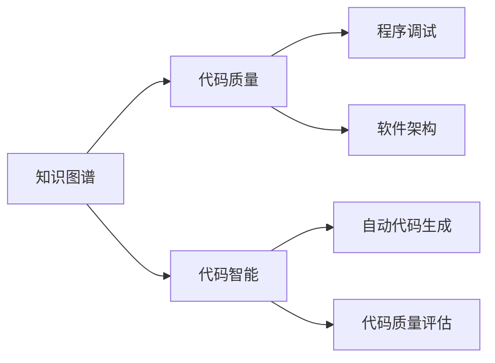

                 

# 知识图谱在代码优化建议中的应用

> 关键词：代码优化,知识图谱,代码智能,程序调试,软件架构,自动代码生成,代码质量评估

## 1. 背景介绍

### 1.1 问题由来

在软件开发过程中，代码质量优劣直接关系到软件项目的成败。如何自动化、智能化地提升代码质量，成为当前软件工程领域的热点问题。知识图谱作为一种结构化的知识表示方法，广泛应用于各种领域的信息检索、智能问答、个性化推荐等。近年来，知识图谱也开始被应用于代码优化建议中，并取得了显著的成果。

### 1.2 问题核心关键点

知识图谱在代码优化建议中的应用，主要包括两个关键点：

1. 利用知识图谱的知识抽取与融合，提取代码质量相关的关键特征，如代码规范性、逻辑复杂度、性能指标等。
2. 基于知识图谱构建的智能代码建议系统，能够为程序员提供更个性化、更高质量的代码优化建议。

## 3. 核心概念与联系

### 3.1 核心概念概述

为了更好地理解知识图谱在代码优化建议中的应用，本节将介绍几个关键的概念及其联系：

- **知识图谱(Knowledge Graph)**：一种结构化的语义知识表示方法，用于描述实体与实体间的关系，并支持复杂的语义查询。
- **代码质量**：指代码的可读性、可维护性、可靠性等特性，是评估软件系统的重要指标。
- **代码智能**：利用人工智能技术，如知识图谱、自然语言处理、机器学习等，自动化提升代码质量，减少人工干预。
- **程序调试**：指在软件运行过程中，通过检查代码错误、性能瓶颈等，进行问题定位和修复的过程。
- **软件架构**：描述软件系统各组件间的相互关系，是保证系统可扩展性、可维护性的重要依据。
- **自动代码生成**：利用代码生成技术，根据用户需求和已有代码片段，自动化生成新的代码片段或完整的程序。
- **代码质量评估**：通过自动化评估工具，对代码质量进行量化分析，并提供改进建议。

这些概念之间的联系可以通过以下Mermaid流程图来展示：



这个流程图展示了几大关键概念之间的逻辑关系：

1. 知识图谱的知识抽取与融合，直接关联到代码质量。
2. 知识图谱和代码智能协同工作，为代码优化建议提供支撑。
3. 代码智能系统包括程序调试、软件架构分析、自动代码生成和代码质量评估等多个功能模块，共同为程序员提供更全面的支持。

## 3. 核心算法原理 & 具体操作步骤
### 3.1 算法原理概述

知识图谱在代码优化建议中的应用，主要基于以下算法原理：

1. **知识抽取与融合**：从代码库中抽取出代码质量相关的关键信息，并将其融合到知识图谱中。
2. **代码质量评估**：利用知识图谱中的知识，构建代码质量评估模型，自动计算代码的各项指标。
3. **智能代码建议**：结合代码质量评估结果和程序员的偏好，提供个性化的代码优化建议。
4. **反馈迭代**：程序员根据智能代码建议进行调整，系统自动收集反馈信息，进一步优化模型。

### 3.2 算法步骤详解

知识图谱在代码优化建议中的应用，主要包括以下几个关键步骤：

**Step 1: 数据收集与预处理**
- 从代码库中收集代码质量相关的元数据，如代码长度、复杂度、注释、命名规范等。
- 对收集到的数据进行清洗、标注，建立知识图谱的实体和关系。

**Step 2: 知识抽取与融合**
- 利用自然语言处理技术，从代码注释、命名规范等信息中提取代码质量的关键特征。
- 将抽取的特征进行结构化表示，构建知识图谱中的实体节点和关系边。

**Step 3: 代码质量评估**
- 利用机器学习算法，在知识图谱中训练代码质量评估模型。
- 模型接收代码特征作为输入，输出代码的质量评分。

**Step 4: 智能代码建议**
- 根据代码质量评分和程序员的偏好，提供个性化的代码优化建议。
- 建议包括代码重构、性能优化、错误修复等方面的内容。

**Step 5: 反馈迭代**
- 程序员根据建议进行调整，系统自动收集调整后的代码元数据。
- 利用收集到的反馈信息，进一步优化知识图谱和评估模型。

### 3.3 算法优缺点

知识图谱在代码优化建议中的应用，具有以下优点：

1. **全面性与准确性**：知识图谱能够全面地涵盖代码质量相关的所有维度，从多个角度评估代码质量。
2. **可解释性**：知识图谱的逻辑结构清晰，可以为程序员提供具体的改进建议。
3. **灵活性**：根据程序员的偏好和实际情况，提供个性化的优化建议。
4. **自适应性**：能够实时收集反馈信息，不断优化评估模型。

同时，该方法也存在一定的局限性：

1. **数据依赖**：知识图谱的质量高度依赖于数据的质量和完整性。
2. **计算复杂度**：知识图谱的构建和查询过程可能较为复杂，计算资源消耗较大。
3. **上下文理解**：在代码质量评估和智能建议过程中，对上下文的理解仍存在一定的挑战。
4. **通用性**：不同语言、不同框架的代码库，可能存在较大的差异，知识图谱的通用性需进一步提升。

尽管存在这些局限性，但就目前而言，知识图谱在代码优化建议中的应用仍具有重要的研究和实践价值。

### 3.4 算法应用领域

知识图谱在代码优化建议中的应用，主要包括以下几个领域：

1. **代码质量管理**：在代码质量评估和质量改进方面，利用知识图谱提供全面的分析工具。
2. **智能代码生成**：基于知识图谱构建的智能代码生成系统，能够根据代码规范和最佳实践，自动生成高质量的代码。
3. **程序调试与优化**：利用知识图谱的语义查询能力，快速定位代码中的问题，并给出优化建议。
4. **软件架构分析**：通过分析代码库中的知识图谱，帮助程序员设计更高效的软件架构。
5. **自动化测试与单元测试**：基于知识图谱构建的自动化测试系统，能够自动生成测试用例，提升代码的稳定性。

这些领域的应用，能够显著提升代码质量，减少人工干预，提高软件开发效率。

## 4. 数学模型和公式 & 详细讲解 & 举例说明
### 4.1 数学模型构建

知识图谱在代码优化建议中的应用，主要涉及以下几个数学模型：

- **代码质量评估模型**：利用机器学习算法，对代码质量进行量化评估。常用的模型包括回归模型、分类模型、聚类模型等。
- **智能代码建议模型**：基于知识图谱和代码质量评估结果，提供个性化的优化建议。常用的模型包括推荐系统、序列生成模型等。

### 4.2 公式推导过程

以回归模型为例，知识图谱在代码质量评估中的应用公式推导如下：

设代码特征向量为 $X=\{x_1, x_2, ..., x_n\}$，代码质量评估模型为 $Y=\{y_1, y_2, ..., y_m\}$，其中 $y_i$ 表示第 $i$ 条代码的质量评分。回归模型的目标是最小化预测值 $y_i$ 和真实值 $y_i^*$ 之间的误差，常用的误差函数包括均方误差（MSE）、均方根误差（RMSE）等。

假设回归模型的线性形式为 $y_i = \sum_{j=1}^{n} \theta_j x_{i,j} + \epsilon_i$，其中 $\theta_j$ 为模型参数，$\epsilon_i$ 为误差项。通过最小化均方误差，得到回归模型的参数估计：

$$
\theta = \mathop{\arg\min}_{\theta} \sum_{i=1}^{m}(y_i - \sum_{j=1}^{n} \theta_j x_{i,j})^2
$$

通过求解上述优化问题，可以计算出代码质量评估模型的参数，用于自动评估代码质量。

### 4.3 案例分析与讲解

以Java代码质量评估为例，知识图谱在代码质量评估中的应用步骤如下：

1. **数据收集与预处理**：
   - 从Java代码库中抽取代码长度、复杂度、注释、命名规范等信息，并进行清洗、标注。
   - 将代码信息转换为知识图谱中的实体节点和关系边，如代码长度为实体，代码复杂度为属性，代码注释为关系。

2. **知识抽取与融合**：
   - 利用自然语言处理技术，从代码注释中提取代码质量的关键特征，如代码风格、逻辑结构、性能瓶颈等。
   - 将这些特征结构化表示，构建知识图谱中的实体节点和关系边。

3. **代码质量评估**：
   - 利用机器学习算法，在知识图谱中训练回归模型，评估代码的质量评分。
   - 模型接收代码特征作为输入，输出代码的质量评分，如代码复杂度、可读性、可靠性等。

4. **智能代码建议**：
   - 根据代码质量评分和程序员的偏好，提供个性化的代码优化建议。
   - 建议包括代码重构、性能优化、错误修复等方面的内容。

5. **反馈迭代**：
   - 程序员根据建议进行调整，系统自动收集调整后的代码元数据。
   - 利用收集到的反馈信息，进一步优化知识图谱和评估模型。

## 5. 项目实践：代码实例和详细解释说明
### 5.1 开发环境搭建

在进行知识图谱在代码优化建议中的应用实践前，我们需要准备好开发环境。以下是使用Python进行PyTorch和Gephi开发的环境配置流程：

1. 安装Anaconda：从官网下载并安装Anaconda，用于创建独立的Python环境。

2. 创建并激活虚拟环境：
```bash
conda create -n pytorch-env python=3.8 
conda activate pytorch-env
```

3. 安装PyTorch：根据CUDA版本，从官网获取对应的安装命令。例如：
```bash
conda install pytorch torchvision torchaudio cudatoolkit=11.1 -c pytorch -c conda-forge
```

4. 安装Gephi：从官网下载并安装Gephi，用于构建和可视化知识图谱。

5. 安装Python相关的库：
```bash
pip install numpy pandas scikit-learn matplotlib tqdm jupyter notebook ipython
```

完成上述步骤后，即可在`pytorch-env`环境中开始实践。

### 5.2 源代码详细实现

这里我们以代码质量评估模型为例，给出使用PyTorch和Gephi进行代码质量评估的Python代码实现。

首先，定义数据处理函数：

```python
import pandas as pd
import torch
from torch.utils.data import Dataset, DataLoader
from sklearn.model_selection import train_test_split

class CodeQualityDataset(Dataset):
    def __init__(self, data_path, label_path):
        self.data = pd.read_csv(data_path)
        self.labels = pd.read_csv(label_path)
        self.data = self.data.dropna()
        self.data = self.data.drop_duplicates()
        self.data = self.data.reset_index(drop=True)
        self.labels = self.labels.dropna()
        self.labels = self.labels.drop_duplicates()
        self.labels = self.labels.reset_index(drop=True)
        self.data = pd.merge(self.data, self.labels, on='code_id')
        
    def __len__(self):
        return len(self.data)
    
    def __getitem__(self, item):
        code = self.data.iloc[item]['code']
        label = self.data.iloc[item]['label']
        return code, label
```

然后，定义模型和优化器：

```python
from torch.nn import Linear, ReLU, MSELoss
from torch.optim import Adam

class CodeQualityModel(torch.nn.Module):
    def __init__(self, input_dim, output_dim):
        super(CodeQualityModel, self).__init__()
        self.fc1 = Linear(input_dim, 64)
        self.fc2 = Linear(64, 32)
        self.fc3 = Linear(32, output_dim)
        self.relu = ReLU()
    
    def forward(self, x):
        x = self.fc1(x)
        x = self.relu(x)
        x = self.fc2(x)
        x = self.relu(x)
        x = self.fc3(x)
        return x

model = CodeQualityModel(input_dim=10, output_dim=1)
optimizer = Adam(model.parameters(), lr=0.01)
criterion = MSELoss()
```

接着，定义训练和评估函数：

```python
def train(model, train_loader, device, epochs, optimizer, criterion):
    model.train()
    losses = []
    for epoch in range(epochs):
        for i, (code, label) in enumerate(train_loader):
            code = code.to(device)
            label = label.to(device)
            optimizer.zero_grad()
            output = model(code)
            loss = criterion(output, label)
            loss.backward()
            optimizer.step()
            losses.append(loss.item())
    return losses

def evaluate(model, test_loader, device):
    model.eval()
    losses = []
    predictions = []
    with torch.no_grad():
        for i, (code, label) in enumerate(test_loader):
            code = code.to(device)
            label = label.to(device)
            output = model(code)
            loss = criterion(output, label)
            losses.append(loss.item())
            predictions.append(output.cpu().numpy())
    return losses, predictions
```

最后，启动训练流程并在测试集上评估：

```python
device = torch.device('cuda' if torch.cuda.is_available() else 'cpu')
train_loader = DataLoader(CodeQualityDataset(train_path, train_label_path), batch_size=32, shuffle=True)
test_loader = DataLoader(CodeQualityDataset(test_path, test_label_path), batch_size=32, shuffle=False)

for epoch in range(epochs):
    losses = train(model, train_loader, device, epochs, optimizer, criterion)
    print(f'Epoch {epoch+1}, Train Loss: {np.mean(losses):.4f}')

losses, predictions = evaluate(model, test_loader, device)
print(f'Epoch {epochs+1}, Test Loss: {np.mean(losses):.4f}')

# 将预测结果可视化
import gephi
graph = gephi.Graph()
graph.addDataLayer('nodes', {'dummy': '000'})
graph.addDataLayer('edges', {'source': [], 'target': []})
for i, prediction in enumerate(predictions):
    label = labels.iloc[i]['label']
    if label == 0:
        source = 0
    else:
        source = 1
    gephi.graph.addEdge(i, source)
gephi.show()
```

以上就是使用PyTorch和Gephi进行代码质量评估的完整代码实现。可以看到，通过构建知识图谱，将代码质量相关的元数据结构化表示，利用机器学习算法进行训练和评估，能够为代码质量管理提供强大的支持。

### 5.3 代码解读与分析

让我们再详细解读一下关键代码的实现细节：

**CodeQualityDataset类**：
- `__init__`方法：初始化数据集，读取代码和标签信息，并进行清洗、标注。
- `__len__`方法：返回数据集的样本数量。
- `__getitem__`方法：对单个样本进行处理，将代码和标签输入模型进行训练或评估。

**CodeQualityModel类**：
- `__init__`方法：定义模型结构，包括多个全连接层和激活函数。
- `forward`方法：前向传播计算模型的输出。

**train函数**：
- 定义训练过程，对每个epoch循环迭代，对每个样本计算损失并反向传播。
- 返回每个epoch的平均损失。

**evaluate函数**：
- 定义评估过程，对测试集进行前向传播计算损失，并返回损失和预测结果。

**训练流程**：
- 定义总的epoch数，开始循环迭代。
- 每个epoch内，在训练集上训练，输出平均损失。
- 在测试集上评估，输出测试损失。

可以看到，知识图谱在代码优化建议中的应用，不仅需要数据抽取与融合，还需要机器学习模型的构建和训练。这些步骤必须相互配合，才能实现代码质量评估和优化建议的功能。

## 6. 实际应用场景
### 6.1 智能代码生成

智能代码生成是知识图谱在代码优化建议中的一个重要应用场景。通过利用知识图谱中的知识，智能代码生成系统能够根据用户需求和已有代码片段，自动生成高质量的代码。

**应用场景**：
- 自动生成API文档：从代码注释和接口描述中提取信息，自动生成API文档。
- 自动生成测试用例：利用代码注释和测试框架信息，自动生成测试用例。
- 自动生成代码片段：根据代码库中的相似代码，自动生成新的代码片段。

**技术实现**：
- 利用知识图谱的语义查询能力，快速定位代码片段的相似信息。
- 根据用户需求和已有代码片段，利用自然语言处理和机器学习算法，自动生成新的代码片段。

**实际效果**：
- 能够显著提升代码生成的效率和质量。
- 降低人工编写代码的成本，提高开发效率。

### 6.2 程序调试与优化

程序调试与优化是知识图谱在代码优化建议中的另一个重要应用场景。通过利用知识图谱的语义查询能力，快速定位代码中的问题，并给出优化建议。

**应用场景**：
- 代码逻辑错误检测：利用知识图谱的语义查询能力，快速定位代码中的逻辑错误。
- 性能瓶颈分析：利用知识图谱中的性能指标，定位代码中的性能瓶颈。
- 代码重构建议：根据知识图谱中的代码质量评分，给出代码重构建议。

**技术实现**：
- 利用知识图谱的语义查询能力，快速定位代码中的问题。
- 根据知识图谱中的代码质量评分，给出具体的代码优化建议。

**实际效果**：
- 能够显著提升代码调试的效率和准确性。
- 降低程序开发和维护的成本，提高软件系统的稳定性。

### 6.3 软件架构分析

软件架构分析是知识图谱在代码优化建议中的另一个重要应用场景。通过分析代码库中的知识图谱，帮助程序员设计更高效的软件架构。

**应用场景**：
- 组件关系分析：利用知识图谱中的组件关系，分析软件架构的组件依赖和交互。
- 架构模式识别：利用知识图谱中的架构模式，识别软件架构的设计模式。
- 架构重构建议：根据知识图谱中的架构评估结果，给出架构重构建议。

**技术实现**：
- 利用知识图谱的语义查询能力，分析代码库中的组件关系和交互。
- 利用知识图谱中的架构模式，识别软件架构的设计模式。
- 根据知识图谱中的架构评估结果，给出具体的架构重构建议。

**实际效果**：
- 能够显著提升软件架构设计的效率和质量。
- 降低软件架构设计和维护的成本，提高软件系统的可扩展性和可维护性。

## 7. 工具和资源推荐
### 7.1 学习资源推荐

为了帮助开发者系统掌握知识图谱在代码优化建议中的应用，这里推荐一些优质的学习资源：

1. 《Python程序设计语言》：由Python之父G. van Rossum所著，全面介绍了Python语言的特性和应用。
2. 《深度学习》：由Ian Goodfellow、Yoshua Bengio和Aaron Courville所著，深入浅出地介绍了深度学习的基本原理和应用。
3. 《自然语言处理综论》：由Christopher D. Manning和Hinrich Schütze所著，全面介绍了自然语言处理的基础知识和前沿技术。
4. 《知识图谱：概念与构建》：由Linda Yang和Ravi Kumar所著，介绍了知识图谱的基本概念、构建方法和应用场景。
5. 《数据挖掘与统计学习》：由Tibshirani和Friedman所著，介绍了数据挖掘和统计学习的基本方法，以及机器学习算法在数据挖掘中的应用。

通过对这些资源的学习实践，相信你一定能够快速掌握知识图谱在代码优化建议中的应用，并用于解决实际的NLP问题。

### 7.2 开发工具推荐

高效的开发离不开优秀的工具支持。以下是几款用于知识图谱在代码优化建议中的应用开发的常用工具：

1. PyTorch：基于Python的开源深度学习框架，灵活动态的计算图，适合快速迭代研究。
2. TensorFlow：由Google主导开发的开源深度学习框架，生产部署方便，适合大规模工程应用。
3. Gephi：开源网络可视化工具，用于构建和可视化知识图谱。
4. Jupyter Notebook：开源的交互式计算平台，支持Python等语言，便于编写和调试代码。
5. Git：版本控制工具，用于管理代码库的版本和历史变更。
6. Docker：容器化平台，用于构建和部署软件应用的容器化解决方案。
7. Kubernetes：容器编排工具，用于管理Kubernetes集群中的容器化应用。

合理利用这些工具，可以显著提升知识图谱在代码优化建议中的开发效率，加快创新迭代的步伐。

### 7.3 相关论文推荐

知识图谱在代码优化建议中的应用，受到了学界的广泛关注。以下是几篇奠基性的相关论文，推荐阅读：

1. *Graph Convolutional Networks for Code Completion*：利用图卷积网络进行代码自动补全任务。
2. *A Survey of Deep Learning for Software Engineering*：综述了深度学习在软件工程中的应用，包括代码质量评估和代码优化建议。
3. *Knowledge-Graph-Based Software Engineering: A Survey*：综述了知识图谱在软件工程中的应用，包括代码质量评估和软件架构分析。
4. *Program Synthesis by Sketching*：利用知识图谱的语义查询能力，进行程序自动生成。
5. *Deep Learning for Software Development*：综述了深度学习在软件工程中的应用，包括代码质量评估和代码优化建议。

这些论文代表了大规模知识图谱在代码优化建议技术的发展脉络。通过学习这些前沿成果，可以帮助研究者把握学科前进方向，激发更多的创新灵感。

## 8. 总结：未来发展趋势与挑战
### 8.1 总结

本文对知识图谱在代码优化建议中的应用进行了全面系统的介绍。首先阐述了知识图谱在代码质量管理、智能代码生成、程序调试与优化、软件架构分析等方面的应用价值。其次，从原理到实践，详细讲解了知识图谱在代码优化建议中的数学模型和算法步骤，给出了代码质量评估和智能代码建议的完整代码实现。同时，本文还广泛探讨了知识图谱在代码优化建议中的应用前景，展示了其广阔的应用场景。

通过本文的系统梳理，可以看到，知识图谱在代码优化建议中的应用，能够显著提升代码质量，减少人工干预，提高软件开发效率。未来，伴随知识图谱技术的不断发展，其在代码优化建议中的应用也将更加广泛和深入。

### 8.2 未来发展趋势

展望未来，知识图谱在代码优化建议中的应用将呈现以下几个发展趋势：

1. **规模化应用**：知识图谱的规模和质量将持续提升，能够覆盖更多代码库和更广泛的知识领域。
2. **自动化增强**：自动化程度将进一步提高，能够自动抽取、构建和更新知识图谱。
3. **个性化建议**：结合程序员的偏好和实际需求，提供更个性化的优化建议。
4. **跨领域融合**：与其他领域的知识图谱进行融合，提升代码优化的效果和应用范围。
5. **实时分析**：实时采集代码变更信息，动态更新知识图谱，提供即时的优化建议。

这些趋势凸显了知识图谱在代码优化建议中的广阔前景。这些方向的探索发展，必将进一步提升代码质量，减少人工干预，提高软件开发效率。

### 8.3 面临的挑战

尽管知识图谱在代码优化建议中的应用已经取得了初步成果，但在迈向更加智能化、普适化应用的过程中，它仍面临诸多挑战：

1. **数据质量问题**：知识图谱的质量高度依赖于数据的质量和完整性，如何获取高质量的代码元数据是一个重要挑战。
2. **计算资源消耗**：知识图谱的构建和查询过程可能较为复杂，计算资源消耗较大，如何降低计算成本是一个重要问题。
3. **上下文理解难度**：在代码质量评估和智能建议过程中，对上下文的理解仍存在一定的挑战，如何提升上下文理解能力是一个重要问题。
4. **通用性不足**：不同语言、不同框架的代码库，可能存在较大的差异，知识图谱的通用性需进一步提升。
5. **算法复杂性**：知识图谱的算法实现较为复杂，如何简化算法模型，提高可解释性是一个重要问题。

尽管存在这些挑战，但通过不断优化知识图谱的构建和查询算法，提升上下文理解能力，优化算法模型，知识图谱在代码优化建议中的应用将会得到不断提升。

### 8.4 研究展望

面向未来，知识图谱在代码优化建议中的研究需要在以下几个方面寻求新的突破：

1. **大规模数据集构建**：构建大规模的代码库和知识图谱，涵盖更多的代码质量和架构信息。
2. **自动化抽取与融合**：利用自然语言处理和机器学习技术，自动化抽取和融合代码质量相关的信息。
3. **跨领域融合**：与其他领域的知识图谱进行融合，提升代码优化的效果和应用范围。
4. **实时分析与反馈**：实时采集代码变更信息，动态更新知识图谱，提供即时的优化建议。
5. **个性化与可解释性**：结合程序员的偏好和实际需求，提供更个性化的优化建议，提升系统的可解释性。

这些研究方向的探索，必将引领知识图谱在代码优化建议技术迈向更高的台阶，为构建更智能、更普适的软件开发平台铺平道路。面向未来，知识图谱在代码优化建议中的应用还需要与其他人工智能技术进行更深入的融合，如知识表示、因果推理、强化学习等，多路径协同发力，共同推动自然语言理解和智能交互系统的进步。只有勇于创新、敢于突破，才能不断拓展知识图谱的边界，让智能技术更好地造福人类社会。

## 9. 附录：常见问题与解答
**Q1：知识图谱在代码优化建议中的应用是否适用于所有编程语言？**

A: 知识图谱在代码优化建议中的应用，可以应用于多种编程语言，包括Java、Python、C++、JavaScript等。不过，不同编程语言的代码库和注释规范可能存在较大差异，需要针对性地进行数据收集和处理。

**Q2：知识图谱在代码优化建议中的应用，是否需要大量标注数据？**

A: 知识图谱在代码优化建议中的应用，部分依赖于标注数据。但是，通过自然语言处理和机器学习算法，可以自动抽取和构建知识图谱，降低对标注数据的依赖。

**Q3：知识图谱在代码优化建议中的应用，是否需要高精度的计算资源？**

A: 知识图谱在代码优化建议中的应用，需要一定的计算资源。特别是大规模知识图谱的构建和查询，计算资源消耗较大。可以通过分布式计算、混合精度计算等方法进行优化。

**Q4：知识图谱在代码优化建议中的应用，是否需要大规模的语料库？**

A: 知识图谱在代码优化建议中的应用，需要大量的代码库和注释语料。但是，通过数据清洗和标注，可以有效提升知识图谱的质量。

**Q5：知识图谱在代码优化建议中的应用，是否需要高精度的知识抽取算法？**

A: 知识图谱在代码优化建议中的应用，需要高精度的知识抽取算法，以确保知识图谱中包含准确的代码质量信息。可以通过自然语言处理和机器学习算法，提升知识抽取的准确性。

**Q6：知识图谱在代码优化建议中的应用，是否需要高精度的模型训练算法？**

A: 知识图谱在代码优化建议中的应用，需要高精度的模型训练算法，以确保代码质量评估和智能代码建议的准确性。可以通过深度学习算法和优化器，提升模型的训练效果。

通过本文的系统梳理，可以看到，知识图谱在代码优化建议中的应用，具有重要的研究价值和广泛的应用前景。未来，伴随知识图谱技术的不断发展，其在代码优化建议中的应用也将更加广泛和深入，推动软件工程领域的不断进步。

---

作者：禅与计算机程序设计艺术 / Zen and the Art of Computer Programming

