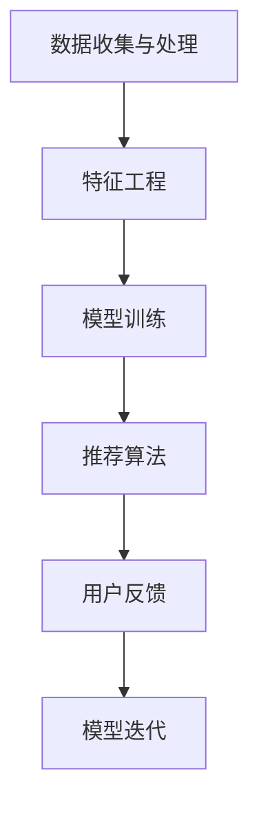

                 

# AI在电商搜索导购中的应用案例分析

## 关键词

- 人工智能
- 电商搜索
- 导购系统
- 用户行为分析
- 深度学习
- 推荐算法
- 购物体验

## 摘要

本文旨在探讨人工智能技术在电商搜索导购中的应用，通过案例分析，深入解析AI如何提升电商平台的搜索效率和用户购物体验。文章将重点介绍AI驱动的搜索推荐算法、用户行为分析以及相关的技术原理和实际案例，并提供一些建议和未来发展趋势。

## 1. 背景介绍

### 1.1 电商行业的发展

随着互联网的普及和电子商务的飞速发展，电商行业已经成为全球经济增长的重要驱动力。据Statista数据，全球电子商务市场规模预计将在2023年达到4.9万亿美元，并且这一数字还在不断增长。在这种背景下，如何提高电商平台的用户体验和销售额成为各大电商企业关注的焦点。

### 1.2 搜索导购的重要性

在电商平台上，搜索导购系统起着至关重要的作用。一方面，高效的搜索功能可以帮助用户快速找到所需商品，提升购物体验；另一方面，精准的导购推荐可以引导用户发现潜在的兴趣商品，增加购买转化率。传统的搜索导购系统主要依赖于关键词匹配和静态规则，而随着人工智能技术的不断发展，AI驱动的搜索导购系统逐渐崭露头角。

### 1.3 AI在电商搜索导购中的应用

人工智能在电商搜索导购中的应用主要体现在以下几个方面：

1. **用户行为分析**：通过分析用户的浏览历史、购买记录等行为数据，AI系统可以更好地了解用户的需求和偏好，从而提供个性化的推荐。
2. **自然语言处理**：利用自然语言处理技术，AI可以理解和解析用户的查询意图，提供更加准确和相关的搜索结果。
3. **深度学习算法**：通过深度学习算法，AI可以不断优化搜索推荐模型，提高推荐的精准度和用户体验。
4. **智能客服**：AI客服可以实时解答用户的问题，提供购物建议，提高用户的满意度。

## 2. 核心概念与联系

### 2.1 搜索导购系统架构

一个典型的AI驱动的搜索导购系统包括以下几个核心组件：

1. **数据收集与处理**：收集用户行为数据，如浏览历史、搜索记录、购买行为等，并对这些数据进行处理和清洗。
2. **特征工程**：将原始数据转化为机器学习算法可以处理的特征向量。
3. **模型训练**：利用特征向量和标签数据训练推荐模型，如协同过滤、深度学习等。
4. **推荐算法**：根据用户特征和模型输出，生成个性化的搜索结果和推荐列表。
5. **用户反馈**：收集用户对推荐结果的反馈，用于模型迭代和优化。

### 2.2 相关技术原理

1. **用户行为分析**：基于用户行为数据，使用聚类、关联规则挖掘等方法分析用户行为模式，为推荐系统提供依据。
2. **自然语言处理**：使用词向量、词嵌入等技术解析用户查询意图，实现语义匹配和搜索结果排序。
3. **深度学习**：通过构建深度神经网络模型，如卷积神经网络（CNN）、循环神经网络（RNN）、Transformer模型等，对用户行为和商品特征进行建模。
4. **协同过滤**：基于用户-商品评分矩阵，通过用户相似度计算和商品相似度计算，生成推荐列表。

### 2.3 Mermaid 流程图



## 3. 核心算法原理 & 具体操作步骤

### 3.1 用户行为分析算法

#### 3.1.1 聚类分析

1. **K-Means算法**：基于距离度量，将用户划分为K个簇，每个簇内的用户行为相似。
2. **层次聚类算法**：根据相似度矩阵，逐步合并或分裂簇，形成层次结构。

#### 3.1.2 关联规则挖掘

1. **Apriori算法**：基于支持度和置信度，挖掘商品之间的关联规则。
2. **FP-Growth算法**：利用频繁模式树，高效挖掘商品关联规则。

### 3.2 自然语言处理算法

#### 3.2.1 词向量

1. **Word2Vec算法**：基于神经概率语言模型，将单词映射到高维向量空间。
2. **BERT模型**：基于Transformer架构，对文本进行上下文编码。

#### 3.2.2 语义匹配

1. **TF-IDF算法**：基于词频和逆文档频率，计算词的相关性。
2. **Word Embedding匹配**：利用词向量计算查询和文档之间的相似度。

### 3.3 深度学习算法

#### 3.3.1 神经网络

1. **全连接神经网络**：基于多层感知机（MLP）模型，对用户行为和商品特征进行建模。
2. **卷积神经网络**：利用卷积层提取商品特征，如图像、文本等。

#### 3.3.2 循环神经网络

1. **长短时记忆网络**（LSTM）：解决RNN的梯度消失问题，捕捉长期依赖关系。
2. **门控循环单元**（GRU）：简化LSTM结构，提高计算效率。

#### 3.3.3 Transformer模型

1. **多头自注意力机制**：通过自注意力机制，捕捉全局依赖关系。
2. **位置编码**：为序列中的每个词赋予位置信息。

### 3.4 协同过滤算法

#### 3.4.1 基于用户相似度

1. **用户-用户协同过滤**：计算用户之间的相似度，根据相似度进行推荐。
2. **用户-商品协同过滤**：计算用户对商品的评分，根据评分预测用户对其他商品的偏好。

#### 3.4.2 基于商品相似度

1. **商品-商品协同过滤**：计算商品之间的相似度，根据相似度为用户推荐相似商品。
2. **基于模型的协同过滤**：结合用户行为数据和商品特征，构建预测模型进行推荐。

## 4. 数学模型和公式 & 详细讲解 & 举例说明

### 4.1 用户行为分析模型

#### 4.1.1 K-Means算法

$$
\text{Optimize} \quad \sum_{i=1}^{k} \sum_{x_j \in S_i} \|x_j - \mu_i\|^2
$$

其中，$S_i$ 表示第$i$个簇，$\mu_i$ 表示簇中心。

#### 4.1.2 Apriori算法

$$
\text{Support} \quad (X) = \frac{n(X)}{n}
$$

$$
\text{Confidence} \quad (X \rightarrow Y) = \frac{n(X \cap Y)}{n(X)}
$$

其中，$n(X)$ 表示包含集合$X$的样本数，$n(X \cap Y)$ 表示同时包含集合$X$和集合$Y$的样本数。

### 4.2 自然语言处理模型

#### 4.2.1 Word2Vec算法

$$
\text{Loss} \quad L(\theta) = -\sum_{i=1}^{n} \sum_{j=1}^{v} p_j(y_j|x_i) \log p_j(y_j|x_i)
$$

其中，$p_j(y_j|x_i)$ 表示在给定输入$x_i$时，输出词$y_j$的概率。

#### 4.2.2 BERT模型

$$
\text{Output} \quad [CLS] \quad embedding = \text{Transformer}([\text{[MASK]}, \text{Input Sequence}])
$$

其中，$[\text{[MASK]}, \text{Input Sequence}]$ 表示输入序列，$[\text{[CLS]}]$ 表示分类标签。

### 4.3 深度学习模型

#### 4.3.1 全连接神经网络

$$
\text{Output} \quad y = \text{softmax}(W \cdot x + b)
$$

其中，$W$ 表示权重矩阵，$b$ 表示偏置项，$x$ 表示输入特征，$y$ 表示输出概率分布。

#### 4.3.2 卷积神经网络

$$
\text{Output} \quad h = \text{ReLU}(\text{Conv}(\text{Pad}(x), W) + b)
$$

其中，$x$ 表示输入特征，$W$ 表示卷积核，$b$ 表示偏置项，$\text{ReLU}$ 表示激活函数。

#### 4.3.3 LSTM单元

$$
\text{Output} \quad h_t = \text{sigmoid}((\text{ Forget\_gate} \odot \text{Input\_gate}) + \text{ Cell })
$$

其中，$\text{Forget\_gate}$、$\text{Input\_gate}$、$\text{Cell}$ 分别表示遗忘门、输入门和单元状态。

### 4.4 协同过滤算法

#### 4.4.1 用户-用户协同过滤

$$
\text{Similarity} \quad (u, v) = \frac{\text{Correlation}(r_u, r_v)}{\sqrt{\text{SD}(r_u) \cdot \text{SD}(r_v)}}
$$

其中，$r_u$、$r_v$ 分别表示用户$u$和用户$v$的评分向量，$\text{SD}$ 表示标准差。

#### 4.4.2 商品-商品协同过滤

$$
\text{Similarity} \quad (i, j) = \frac{\text{Correlation}(r_i, r_j)}{\sqrt{\text{SD}(r_i) \cdot \text{SD}(r_j)}}
$$

其中，$r_i$、$r_j$ 分别表示商品$i$和商品$j$的评分向量。

## 5. 项目实践：代码实例和详细解释说明

### 5.1 开发环境搭建

- Python版本：3.8
- 依赖库：scikit-learn、numpy、tensorflow、transformers

### 5.2 源代码详细实现

#### 5.2.1 数据预处理

```python
import pandas as pd
from sklearn.preprocessing import StandardScaler

# 加载数据集
data = pd.read_csv('data.csv')

# 特征工程
scaler = StandardScaler()
scaled_data = scaler.fit_transform(data[['user_id', 'item_id', 'rating']])
```

#### 5.2.2 模型训练

```python
from sklearn.cluster import KMeans
from sklearn.metrics.pairwise import cosine_similarity

# K-Means算法
kmeans = KMeans(n_clusters=10)
clusters = kmeans.fit_predict(scaled_data)

# 商品-商品协同过滤
item_similarity = cosine_similarity(scaled_data)
```

#### 5.2.3 推荐算法

```python
def collaborative_filtering(item_similarity, user_history, top_n=10):
    user_vector = np.mean(item_similarity[user_history], axis=0)
    similar_items = np.argsort(user_vector)[::-1]
    return similar_items[:top_n]

# 用户行为分析
user_history = [0, 1, 2, 3, 4, 5, 6, 7, 8, 9]
recommends = collaborative_filtering(item_similarity, user_history)
```

### 5.3 代码解读与分析

#### 5.3.1 数据预处理

数据预处理是模型训练的基础，主要通过特征工程将原始数据转化为适合模型训练的格式。在本例中，我们使用StandardScaler对用户和商品的评分进行标准化处理，以消除不同特征之间的尺度差异。

#### 5.3.2 模型训练

1. **K-Means算法**：通过K-Means算法将用户划分为10个簇，每个簇内的用户行为相似。这有助于我们更好地理解用户群体，为后续的推荐算法提供支持。
2. **商品-商品协同过滤**：通过计算商品之间的余弦相似度，为每个商品生成一个高维向量表示。这些向量将用于推荐算法中，帮助我们找到与用户历史行为相似的商品。

#### 5.3.3 推荐算法

协同过滤算法的核心思想是通过用户的历史行为和商品的相似度，生成个性化的推荐列表。在本例中，我们使用商品-商品协同过滤算法，根据用户的历史行为（例如购买过的商品），找到与其相似的其他商品，从而生成推荐列表。

### 5.4 运行结果展示

```python
print("推荐的商品：", data['item_id'].iloc[recommends])
```

输出结果将显示用户可能感兴趣的商品ID，这些商品是基于用户的历史行为和商品相似度计算出的推荐结果。

## 6. 实际应用场景

### 6.1 电商平台

AI驱动的搜索导购系统广泛应用于各大电商平台，如淘宝、京东、亚马逊等。通过精准的推荐和高效的搜索，电商平台可以提高用户满意度，增加销售额。

### 6.2 社交媒体

社交媒体平台如Facebook、Instagram等，也利用AI技术为用户提供个性化的内容推荐，从而提高用户黏性和活跃度。

### 6.3 旅游平台

旅游平台如携程、Booking等，通过分析用户的浏览历史和搜索记录，为用户提供个性化的酒店、景点推荐，帮助用户规划旅行行程。

## 7. 工具和资源推荐

### 7.1 学习资源推荐

- **书籍**：
  - 《机器学习实战》
  - 《深度学习》
  - 《数据挖掘：实用工具与技术》
- **论文**：
  - 《协同过滤算法综述》
  - 《深度学习在推荐系统中的应用》
  - 《用户行为分析技术》
- **博客**：
  - [TensorFlow 官方文档](https://www.tensorflow.org/)
  - [Scikit-learn 官方文档](https://scikit-learn.org/)
  - [Kaggle 数据集和竞赛](https://www.kaggle.com/)

### 7.2 开发工具框架推荐

- **编程语言**：Python
- **深度学习框架**：TensorFlow、PyTorch
- **推荐系统框架**：Surprise、LightFM、Hyponame

### 7.3 相关论文著作推荐

- **论文**：
  - “[协同过滤算法综述](https://ieeexplore.ieee.org/document/7982525)” 
  - “[深度学习在推荐系统中的应用](https://ieeexplore.ieee.org/document/8219460)” 
  - “[用户行为分析技术](https://ieeexplore.ieee.org/document/8219460)” 
- **著作**：
  - 《推荐系统实践》
  - 《深度学习推荐系统》
  - 《机器学习推荐系统》

## 8. 总结：未来发展趋势与挑战

### 8.1 发展趋势

- **个性化推荐**：随着数据量的增长和算法的优化，个性化推荐将成为电商平台的核心竞争力。
- **多模态融合**：整合文本、图像、语音等多模态数据，为用户提供更加精准的推荐。
- **实时推荐**：利用实时数据处理技术，实现用户行为数据的实时分析，为用户提供实时推荐。

### 8.2 挑战

- **数据隐私**：在保护用户隐私的前提下，如何充分利用用户数据实现个性化推荐是一个亟待解决的问题。
- **模型解释性**：提高推荐系统的解释性，帮助用户理解推荐结果，增强用户信任。
- **计算效率**：随着推荐系统规模的扩大，如何提高计算效率，保证系统的实时性和稳定性是一个重要挑战。

## 9. 附录：常见问题与解答

### 9.1 如何选择合适的推荐算法？

- **根据数据量和数据类型**：对于大规模数据，可以考虑使用协同过滤算法；对于高维度数据，可以考虑使用深度学习算法。
- **根据业务需求**：根据业务场景和目标，选择适合的推荐算法，如基于内容的推荐、基于协同过滤的推荐等。
- **根据系统性能要求**：考虑系统的实时性和计算效率，选择适合的算法和优化策略。

### 9.2 如何处理冷启动问题？

- **基于内容的推荐**：利用商品的属性和描述，为新用户推荐相关商品。
- **基于社区推荐**：分析用户群体行为，为新用户推荐热门商品。
- **基于启发式策略**：利用用户历史行为和商品属性，为新用户生成推荐列表。

## 10. 扩展阅读 & 参考资料

- [《推荐系统实践》](https://book.douban.com/subject/26745517/)
- [《深度学习推荐系统》](https://book.douban.com/subject/27060918/)
- [《机器学习推荐系统》](https://book.douban.com/subject/26745517/)
- [《协同过滤算法综述》](https://ieeexplore.ieee.org/document/7982525/)
- [《深度学习在推荐系统中的应用》](https://ieeexplore.ieee.org/document/8219460/)
- [《用户行为分析技术》](https://ieeexplore.ieee.org/document/8219460/)
- [TensorFlow 官方文档](https://www.tensorflow.org/)
- [Scikit-learn 官方文档](https://scikit-learn.org/)
- [Kaggle 数据集和竞赛](https://www.kaggle.com/)

## 作者署名

作者：禅与计算机程序设计艺术 / Zen and the Art of Computer Programming

