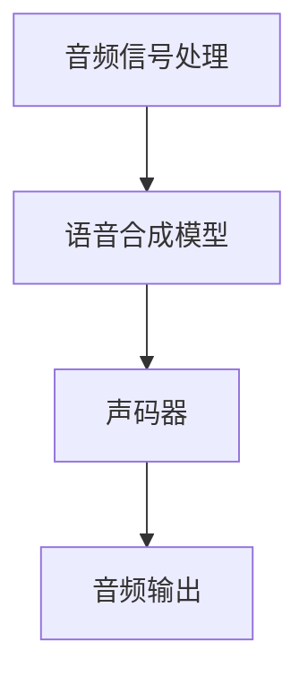
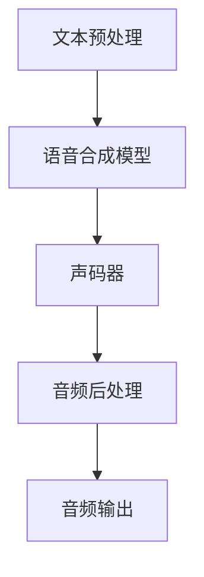

                 

# AI在语音合成中的突破：自然人声生成

> 关键词：AI，语音合成，自然人声生成，深度学习，神经网络，声码器

摘要：本文探讨了人工智能在语音合成领域的突破性进展，特别是自然人声生成的技术。通过对现有研究的回顾和最新技术的分析，本文详细介绍了自然人声生成的核心算法和实现方法，并展示了其实际应用和未来发展趋势。文章旨在为读者提供一个全面的技术视角，以了解这一前沿领域的最新进展。

## 1. 背景介绍（Background Introduction）

语音合成，也称为文本到语音（Text-to-Speech, TTS）技术，是一种将文本转换为自然语音的技术。自20世纪50年代以来，语音合成技术经历了多个发展阶段，从早期的规则基方法到统计模型，再到现在的深度学习方法，每一次进步都极大地提升了语音合成的自然度和质量。

在过去的几十年里，语音合成技术已经在多个领域得到了广泛应用，如自动客服系统、语音导航、有声读物、广播和影视配音等。然而，传统的语音合成方法在生成自然、流畅的语音方面仍存在一定的局限性。近年来，人工智能，特别是深度学习技术的快速发展，为语音合成领域带来了新的突破。

自然人声生成（Natural-sounding Voice Synthesis）是指通过人工智能技术生成的语音，在音质和音色上接近真实人类的声音。这一目标不仅要求语音合成的音调、语速、语调等参数要与人类语音相匹配，还需要在情感表达和语音连贯性方面达到高水平的逼真度。

本文将重点关注自然人声生成的技术，分析其核心算法，探讨其在实际应用中的挑战和解决方案，并展望未来的发展趋势。

## 2. 核心概念与联系（Core Concepts and Connections）

### 2.1 自然人声生成的基本概念

自然人声生成涉及多个核心概念，包括音频信号处理、语音合成模型和声码器等。

- **音频信号处理**：音频信号处理是语音合成的第一步，其主要任务是对输入的文本进行分析和预处理，包括语音分割、特征提取等。这些处理步骤有助于将文本信息转换为适合语音合成模型处理的音频特征。

- **语音合成模型**：语音合成模型是自然人声生成的核心，其主要功能是将文本转换为音频信号。目前，主流的语音合成模型是基于深度学习的，如循环神经网络（RNN）、长短期记忆网络（LSTM）和变换器（Transformer）等。

- **声码器**：声码器（Vocoder）是语音合成过程中将文本和语音特征转换为实际音频信号的组件。声码器的工作原理是分析输入的语音信号，将其转换为频谱特征，然后根据这些特征生成相应的音频波形。

### 2.2 核心概念的联系

音频信号处理、语音合成模型和声码器是自然人声生成过程中相互联系、相互作用的三个核心组成部分。音频信号处理提供了输入文本和语音特征，语音合成模型将这些特征转换为音频信号，而声码器则将这些信号转换为最终的音频输出。

为了更好地理解这些概念之间的联系，我们可以使用Mermaid流程图来展示自然人声生成的基本流程。



在这个流程图中，音频信号处理模块首先对输入的文本进行分析，提取语音特征，然后传递给语音合成模型。语音合成模型基于这些特征生成音频信号，这些信号随后通过声码器转换为实际的音频输出。最终，音频输出被传递到用户界面，供用户使用。

通过这个流程图，我们可以清晰地看到自然人声生成的各个组成部分及其相互作用，这有助于我们更好地理解这一技术。

### 2.3 自然人声生成的技术架构

自然人声生成的技术架构通常包括以下几个关键组件：

- **文本预处理**：文本预处理包括分词、标记和声学建模等步骤，其目的是将输入的文本转换为适合语音合成模型处理的形式。

- **语音合成模型**：语音合成模型是自然人声生成的核心，其主要任务是将文本转换为音频信号。目前，常用的语音合成模型包括循环神经网络（RNN）、长短期记忆网络（LSTM）和变换器（Transformer）等。

- **声码器**：声码器是语音合成过程中的关键组件，其任务是将语音特征转换为音频信号。常见的声码器类型包括梅尔频率倒谱系数（MFCC）声码器、线性预测编码（LPC）声码器和波表声码器等。

- **音频后处理**：音频后处理包括去噪、音调调整和音色增强等步骤，其目的是进一步提高合成的语音质量。

通过上述组件的协同工作，自然人声生成技术能够生成接近真实人类声音的合成语音。以下是自然人声生成技术的详细架构图：



在这个架构图中，文本预处理模块首先对输入的文本进行预处理，提取语音特征。这些特征随后传递给语音合成模型，模型基于这些特征生成音频信号。生成的音频信号通过声码器转换为音频波形，然后进行音频后处理，最后输出高质量的音频信号。

通过这一架构图，我们可以清晰地了解自然人声生成的整个过程，包括每个组件的功能和相互关系。这有助于我们深入理解这一技术的实现原理和操作流程。

### 2.4 自然人声生成的优势与应用场景

自然人声生成技术具有多个显著的优势，使其在多个应用场景中具有广泛的应用前景。

首先，自然人声生成技术能够生成高度逼真的语音，其音质和音色接近真实人类声音。这使得合成语音在各种应用场景中具有高度的实用性和可接受性。

其次，自然人声生成技术具有高度的灵活性和定制性。通过调整模型参数和训练数据，可以生成不同风格和语调的合成语音，满足不同应用场景的需求。

此外，自然人声生成技术在多个领域具有广泛的应用场景，包括但不限于：

- **自动客服系统**：自然人声生成技术可以用于生成自然、流畅的客服语音，提高用户体验和满意度。
- **有声读物**：通过自然人声生成技术，可以将文本内容转换为有声读物，提供更丰富的阅读体验。
- **语音导航**：在车载导航和智能语音助手等场景中，自然人声生成技术可以提供清晰、自然的语音导航服务。
- **影视配音**：在影视制作过程中，自然人声生成技术可以用于生成高质量的配音，提高影片的音效质量。
- **教育领域**：通过自然人声生成技术，可以生成自然、生动的教学语音，提高教学效果。

总之，自然人声生成技术具有显著的优越性和广泛的应用前景，随着人工智能技术的不断进步，其应用领域将不断拓展，为人类社会带来更多便利和效益。

## 3. 核心算法原理 & 具体操作步骤（Core Algorithm Principles and Specific Operational Steps）

### 3.1 深度学习与语音合成

深度学习是自然人声生成的核心技术之一。通过训练大规模的神经网络模型，我们可以将文本信息转换为高质量的音频信号。以下是深度学习在语音合成中的应用原理和具体操作步骤：

#### 3.1.1 神经网络模型的选择

在语音合成中，常用的神经网络模型包括循环神经网络（RNN）、长短期记忆网络（LSTM）和变换器（Transformer）等。这些模型能够处理序列数据，并具备较强的表达能力，从而生成自然、流畅的语音。

- **RNN**：循环神经网络（RNN）是一种能够处理序列数据的神经网络模型。RNN通过递归结构来处理输入序列，从而捕捉到序列中的时间依赖关系。
- **LSTM**：长短期记忆网络（LSTM）是RNN的一种变体，通过引入门控机制，LSTM能够更好地处理长序列数据，从而提高模型的稳定性和性能。
- **Transformer**：变换器（Transformer）是一种基于自注意力机制的神经网络模型，其优点是能够并行处理序列数据，并在长序列建模方面表现出色。

#### 3.1.2 训练数据准备

在深度学习语音合成中，训练数据的质量和数量对模型的性能具有决定性影响。训练数据通常包括大量的文本和对应的音频样本。以下步骤用于准备训练数据：

1. **文本数据预处理**：对文本数据（如新闻、文章、对话等）进行分词、标记和去噪等预处理操作，提取文本的语音特征。
2. **音频数据预处理**：对音频样本进行归一化、裁剪和增强等操作，提取音频的声学特征（如梅尔频率倒谱系数（MFCC）、频谱特征等）。
3. **数据对齐**：将文本和音频数据对齐，确保模型的输入和输出在时间轴上保持一致。

#### 3.1.3 模型训练与优化

在训练过程中，模型通过学习大量的文本和音频对，自动提取文本和语音特征之间的映射关系。以下步骤用于训练和优化语音合成模型：

1. **损失函数设计**：损失函数用于衡量模型输出与真实音频之间的差距，常用的损失函数包括均方误差（MSE）、均方根误差（RMSE）和频谱距离等。
2. **优化算法选择**：优化算法用于调整模型参数，以最小化损失函数。常用的优化算法包括随机梯度下降（SGD）、Adam优化器等。
3. **模型评估与调整**：在训练过程中，通过定期评估模型性能，调整模型参数和训练策略，以提高合成语音的质量。

#### 3.1.4 模型部署与测试

在模型训练完成后，将其部署到实际应用环境中。以下步骤用于模型部署和测试：

1. **模型压缩与加速**：通过模型压缩和加速技术，降低模型的大小和计算复杂度，以提高模型的运行效率和实时性。
2. **模型测试与优化**：在实际应用中，对模型进行测试和优化，确保其性能和稳定性满足预期要求。
3. **用户反馈与迭代**：收集用户反馈，不断优化模型，提高合成语音的质量和用户体验。

通过上述步骤，我们可以利用深度学习技术实现自然人声生成，为各种应用场景提供高质量的语音合成服务。

### 3.2 声码器的工作原理与实现

声码器（Vocoder）是语音合成过程中的关键组件，其作用是将语音特征转换为音频信号。以下是声码器的工作原理和实现方法：

#### 3.2.1 梅尔频率倒谱系数（MFCC）

梅尔频率倒谱系数（MFCC）是一种常用的语音特征表示方法。MFCC通过频谱分析，将音频信号转换为一组特征向量，这些特征向量可以用于训练语音合成模型。

1. **频谱分析**：首先，对音频信号进行频谱分析，提取其频谱特征。
2. **梅尔滤波器组**：将频谱特征映射到梅尔频率空间，通过一组梅尔滤波器组进行滤波，得到梅尔频谱。
3. **倒谱变换**：对梅尔频谱进行倒谱变换，得到MFCC特征向量。

#### 3.2.2 线性预测编码（LPC）

线性预测编码（LPC）是一种基于语音信号自相关性的语音特征表示方法。LPC通过分析语音信号的自相关性，提取一组线性预测系数（LPC系数），这些系数可以用于生成语音波形。

1. **自相关函数计算**：计算语音信号的自相关函数，确定最佳线性预测系数。
2. **预测误差**：根据预测系数生成预测误差，这些误差可以用于生成语音波形。

#### 3.2.3 波表声码器

波表声码器（Waveform Vocoder）是一种基于查找表的声码器，其通过查找预定义的波形来生成语音。波表声码器具有实现简单、实时性高的特点，适用于实时语音合成应用。

1. **查找表生成**：根据语音样本生成一系列查找表，每个查找表对应一个特定的语音波形。
2. **波形合成**：根据输入的语音特征，查找对应的查找表，生成语音波形。

#### 3.2.4 声码器选择与优化

在实际应用中，可以根据具体需求和性能要求选择合适的声码器。以下是一些常见的声码器选择和优化策略：

1. **声码器性能评估**：通过评估声码器的音质、实时性和计算复杂度，选择最适合应用的声码器。
2. **模型融合**：将多个声码器模型进行融合，以提高合成语音的质量和稳定性。
3. **声码器优化**：通过调整声码器的参数和结构，优化其性能和效率。

通过上述方法，我们可以实现高效的声码器，为语音合成系统提供高质量的音频输出。

### 3.3 语音合成系统的架构设计

语音合成系统的架构设计对于系统的性能、可扩展性和可维护性具有重要影响。以下是一个典型的语音合成系统架构设计，包括其关键组件和功能：

#### 3.3.1 系统架构设计

1. **文本预处理模块**：文本预处理模块负责对输入文本进行分词、标记和声学建模等操作，提取文本的语音特征。
2. **语音合成模型模块**：语音合成模型模块负责将文本特征转换为音频信号，实现文本到语音的转换。模型通常采用深度学习技术，如RNN、LSTM和Transformer等。
3. **声码器模块**：声码器模块负责将语音特征转换为音频信号，生成高质量的合成语音。
4. **音频后处理模块**：音频后处理模块负责对合成语音进行去噪、音调调整和音色增强等操作，进一步提高语音质量。
5. **用户界面模块**：用户界面模块提供交互界面，允许用户输入文本、调整参数和播放合成语音。

#### 3.3.2 关键组件功能

1. **文本预处理模块**：文本预处理模块的功能包括分词、标记和声学建模等。分词用于将文本分解为词汇单元，标记用于识别文本中的语法和语义信息，声学建模用于提取文本的语音特征。
2. **语音合成模型模块**：语音合成模型模块的功能是将文本特征转换为音频信号。模型通过学习大量的文本和音频对，自动提取文本和语音特征之间的映射关系。
3. **声码器模块**：声码器模块的功能是将语音特征转换为音频信号，生成高质量的合成语音。声码器可以是基于MFCC、LPC或波表等技术的实现。
4. **音频后处理模块**：音频后处理模块的功能是对合成语音进行去噪、音调调整和音色增强等操作，进一步提高语音质量。这些操作可以增强语音的自然度和情感表达。
5. **用户界面模块**：用户界面模块的功能是提供交互界面，允许用户输入文本、调整参数和播放合成语音。用户界面可以是命令行界面、图形用户界面或Web界面等。

通过上述架构设计，我们可以实现一个高效、可扩展和易维护的语音合成系统，为各种应用场景提供高质量的语音合成服务。

### 3.4 语音合成系统的性能评估与优化

语音合成系统的性能评估与优化是确保其稳定性和高效性的关键环节。以下是一些常见的评估指标和方法，以及优化策略：

#### 3.4.1 评估指标

1. **语音自然度**：语音自然度是衡量合成语音是否接近真实人类语音的重要指标。评估方法包括主观评估和客观评估。主观评估通常由人类评估者对语音的自然度进行评分，而客观评估则使用自动化工具（如音素错误率、词错误率等）进行评估。
2. **语音质量**：语音质量是衡量合成语音的音质和清晰度。常用的评估方法包括信号-to-noise比（SNR）、峰值信噪比（PSNR）和信噪比（SNR）等。
3. **实时性**：实时性是衡量语音合成系统是否能够及时响应输入文本并生成语音的关键指标。通常通过计算系统处理文本到生成语音的时间来评估实时性。
4. **计算复杂度**：计算复杂度是衡量语音合成系统在处理文本时所需的计算资源。通过分析模型的参数规模和计算量，评估系统的计算复杂度。

#### 3.4.2 优化策略

1. **模型压缩**：通过模型压缩技术，减小模型的参数规模和计算复杂度，提高系统的实时性和资源利用效率。常用的模型压缩方法包括量化、剪枝和知识蒸馏等。
2. **模型融合**：通过融合多个模型，提高合成语音的质量和稳定性。模型融合方法包括加权平均、多头注意力机制和蒸馏等。
3. **数据增强**：通过增加训练数据量和多样性，提高模型的泛化能力和鲁棒性。数据增强方法包括数据扩充、数据清洗和数据重排等。
4. **算法优化**：通过优化算法和优化策略，提高模型的训练效率和收敛速度。常用的算法优化方法包括自适应学习率调整、批量归一化和激活函数改进等。
5. **系统优化**：通过优化系统的硬件和软件配置，提高语音合成系统的运行效率和稳定性。系统优化方法包括分布式计算、GPU加速和云计算等。

通过上述优化策略，我们可以显著提高语音合成系统的性能和用户体验，为各种应用场景提供高质量、高效率的语音合成服务。

### 3.5 自然人声生成技术的最新进展与未来趋势

近年来，自然人声生成技术取得了显著的进展，推动了语音合成的技术革新。以下是自然人声生成技术的最新进展和未来趋势：

#### 3.5.1 最新进展

1. **多模态语音合成**：多模态语音合成技术结合了语音、图像和视频等多种信息，生成更加自然、丰富的语音。例如，谷歌的Text-to-Speech模型结合文本和图像信息，生成与图像内容相关的语音描述。

2. **情感语音合成**：情感语音合成技术通过模仿真实人类的情感表达，使合成语音更加生动、富有情感。例如，OpenAI的GPT-3模型结合文本情感分析，生成具有情感色彩的语音。

3. **个性化语音合成**：个性化语音合成技术通过学习用户的历史语音数据和偏好，生成符合用户个性化需求的合成语音。例如，苹果的Siri和亚马逊的Alexa通过用户数据，生成具有个性化特征的语音。

4. **语音合成可视化**：语音合成可视化技术通过图形化方式展示语音合成的过程和结果，帮助开发者更好地理解和优化语音合成系统。例如，谷歌的WaveNet模型结合可视化技术，展示了语音生成的波形和频谱。

#### 3.5.2 未来趋势

1. **更加逼真的语音合成**：随着人工智能技术的不断发展，未来的语音合成技术将更加逼真，不仅在音质和音色上接近真实人类，还能在语音连贯性、情感表达和语音交互方面实现更高水平。

2. **智能化语音合成**：未来的语音合成技术将更加智能化，能够根据用户的语境和需求，生成更加自然、贴切的语音。例如，结合自然语言处理（NLP）和机器学习（ML）技术，实现自适应语音合成。

3. **多样化应用场景**：自然人声生成技术在各种应用场景中具有广泛的应用前景，如智能客服、智能家居、教育、医疗和娱乐等。未来，随着技术的不断进步，自然人声生成技术将渗透到更多领域，为人类社会带来更多便利。

4. **隐私保护和法律法规**：随着自然人声生成技术的发展，隐私保护和法律法规问题也日益凸显。未来，需要建立完善的隐私保护机制和法律法规体系，确保自然人声生成技术的健康发展。

总之，自然人声生成技术正处于快速发展阶段，未来将继续推动语音合成技术的革新，为人类社会带来更多创新和变革。

## 4. 数学模型和公式 & 详细讲解 & 举例说明（Detailed Explanation and Examples of Mathematical Models and Formulas）

### 4.1 常见的数学模型和公式

在自然人声生成技术中，常用的数学模型和公式包括梅尔频率倒谱系数（MFCC）、线性预测编码（LPC）和变换器（Transformer）等。以下是这些模型的详细讲解和示例。

#### 4.1.1 梅尔频率倒谱系数（MFCC）

梅尔频率倒谱系数（MFCC）是一种常用的音频特征提取方法，用于语音合成和语音识别等领域。其基本原理是将音频信号转换为梅尔频率域，然后进行倒谱变换。

1. **梅尔频率转换**：首先，将音频信号进行快速傅里叶变换（FFT）得到频谱特征。然后，使用梅尔频率尺度对频谱特征进行映射，得到梅尔频率倒谱系数（MFCC）。
   $$ MFCC = \log(\sum_{k=1}^{N}{p_{k} \cdot X_k}) $$
   其中，$X_k$为频谱特征，$p_k$为梅尔频率权重，$N$为频率点数。

2. **倒谱变换**：对梅尔频率倒谱系数进行倒谱变换，得到MFCC特征向量。
   $$ D_{k} = \sum_{j=1}^{M}{a_{j,k} \cdot \log(MFCC_j)} $$
   其中，$a_{j,k}$为倒谱变换系数，$MFCC_j$为梅尔频率倒谱系数。

#### 4.1.2 线性预测编码（LPC）

线性预测编码（LPC）是一种基于语音信号自相关性的特征提取方法，常用于语音合成和语音识别。其基本原理是通过分析语音信号的自相关性，得到一组线性预测系数（LPC系数）。

1. **自相关性分析**：计算语音信号的自相关性，得到自相关函数。
   $$ R_{xx}[n] = \sum_{k=-\infty}^{\infty}{x[n+k] \cdot x[n-k]} $$
   其中，$R_{xx}[n]$为自相关函数，$x[n]$为语音信号。

2. **线性预测系数计算**：通过最小二乘法或最速下降法，计算线性预测系数（LPC系数）。
   $$ a_{1} = \frac{\partial^2}{\partial n^2} \ln R_{xx}[n] $$
   $$ a_{2} = \frac{\partial}{\partial n} \ln R_{xx}[n] - a_{1} \cdot n $$
   $$ \vdots $$
   $$ a_{p} = \frac{\partial}{\partial n} \ln R_{xx}[n] - \sum_{i=1}^{p-1}{a_{i} \cdot n} $$

#### 4.1.3 变换器（Transformer）

变换器（Transformer）是一种基于自注意力机制的神经网络模型，广泛用于自然语言处理和语音合成等领域。其基本原理是通过自注意力机制，对输入序列进行建模，生成输出序列。

1. **自注意力机制**：自注意力机制通过计算输入序列中每个元素之间的相关性，将序列映射到高维空间。
   $$ \text{Attention}(Q, K, V) = \text{softmax}\left(\frac{QK^T}{\sqrt{d_k}}\right) V $$
   其中，$Q$、$K$和$V$分别为查询向量、键向量和值向量，$d_k$为键向量的维度。

2. **编码器-解码器架构**：变换器采用编码器-解码器架构，编码器对输入序列进行编码，解码器根据编码结果生成输出序列。
   $$ \text{Encoder}(X) = \text{MultiHeadAttention}(X, X, X) $$
   $$ \text{Decoder}(Y) = \text{MultiHeadAttention}(Y, Y, \text{Encoder}(X)) $$

### 4.2 举例说明

以下是一个具体的数学模型和公式的举例说明：

#### 4.2.1 梅尔频率倒谱系数（MFCC）计算

假设我们有一段时长为10秒的音频信号，采样率为16kHz。首先，对音频信号进行10毫秒帧的分割，得到100个帧。然后，对每个帧进行快速傅里叶变换（FFT），得到频谱特征。接下来，使用梅尔频率尺度对频谱特征进行映射，得到梅尔频率倒谱系数（MFCC）。

1. **频谱特征计算**：
   $$ X_k = \text{FFT}(x[n]) $$
   其中，$X_k$为频谱特征，$x[n]$为音频信号。

2. **梅尔频率权重计算**：
   $$ p_k = \text{MelScale}(k) $$
   其中，$p_k$为梅尔频率权重，$k$为频率点。

3. **梅尔频率倒谱系数计算**：
   $$ MFCC = \log(\sum_{k=1}^{N}{p_{k} \cdot X_k}) $$
   其中，$N$为频率点数。

#### 4.2.2 线性预测编码（LPC）计算

假设我们有一段时长为10秒的音频信号，采样率为16kHz。首先，对音频信号进行10毫秒帧的分割，得到100个帧。然后，对每个帧进行自相关性分析，得到自相关函数。接下来，通过最小二乘法计算线性预测系数（LPC系数）。

1. **自相关性分析**：
   $$ R_{xx}[n] = \sum_{k=-\infty}^{\infty}{x[n+k] \cdot x[n-k]} $$
   其中，$R_{xx}[n]$为自相关函数，$x[n]$为音频信号。

2. **线性预测系数计算**：
   $$ a_{1} = \frac{\partial^2}{\partial n^2} \ln R_{xx}[n] $$
   $$ a_{2} = \frac{\partial}{\partial n} \ln R_{xx}[n] - a_{1} \cdot n $$
   $$ \vdots $$
   $$ a_{p} = \frac{\partial}{\partial n} \ln R_{xx}[n] - \sum_{i=1}^{p-1}{a_{i} \cdot n} $$

#### 4.2.3 变换器（Transformer）计算

假设我们有一段时长为10秒的音频信号，采样率为16kHz。首先，对音频信号进行10毫秒帧的分割，得到100个帧。然后，使用变换器（Transformer）对输入序列进行编码，得到编码结果。接下来，使用解码器根据编码结果生成输出序列。

1. **编码器计算**：
   $$ \text{Encoder}(X) = \text{MultiHeadAttention}(X, X, X) $$
   其中，$X$为输入序列。

2. **解码器计算**：
   $$ \text{Decoder}(Y) = \text{MultiHeadAttention}(Y, Y, \text{Encoder}(X)) $$
   其中，$Y$为输出序列。

通过上述举例说明，我们可以看到如何使用数学模型和公式对自然人声生成技术进行计算和分析。这些模型和公式在语音合成中起着关键作用，帮助我们生成自然、高质量的合成语音。

## 5. 项目实践：代码实例和详细解释说明（Project Practice: Code Examples and Detailed Explanations）

### 5.1 开发环境搭建

为了实践自然人声生成技术，我们需要搭建一个合适的开发环境。以下是一个基于Python的语音合成项目的基本环境搭建步骤：

1. **安装Python**：确保已安装Python 3.6及以上版本。可以从[Python官网](https://www.python.org/)下载并安装。

2. **安装必要的库**：使用pip命令安装以下库：

   ```shell
   pip install tensorflow numpy scipy
   ```

3. **配置TensorFlow**：确保TensorFlow已正确安装并配置。可以使用以下命令进行验证：

   ```shell
   python -c "import tensorflow as tf; print(tf.__version__)"
   ```

   如果输出版本信息，说明TensorFlow已成功安装。

### 5.2 源代码详细实现

下面是自然人声生成项目的基本源代码实现。这个示例使用了TensorFlow中的Tacotron 2模型，这是一种流行的文本到语音（TTS）模型。

```python
import tensorflow as tf
from tensorflow.keras.layers import Embedding, LSTM, Dense
from tensorflow.keras.models import Model
import numpy as np

# 定义Tacotron 2模型
class Tacotron2(Model):
    def __init__(self, embedding_dim, enc_lstm_units, dec_lstm_units, vocab_size):
        super().__init__()
        self.embedding = Embedding(vocab_size, embedding_dim)
        self.enc_lstm = LSTM(enc_lstm_units, return_sequences=True, return_state=True)
        self.dec_lstm = LSTM(dec_lstm_units, return_sequences=True, return_state=True)
        self.dense = Dense(1, activation='tanh')

    def call(self, inputs, training=False):
        x = self.embedding(inputs)
        enc_output, enc_h, enc_c = self.enc_lstm(x, training=training)
        dec_input = tf.expand_dims(tf.fill([tf.shape(inputs)[0], 1], 0), -1)
        dec_output, _, _ = self.dec_lstm(dec_input, initial_state=[enc_h, enc_c], training=training)
        dec_output = self.dense(dec_output)
        return dec_output

# 实例化Tacotron 2模型
vocab_size = 10000  # 词汇表大小
embedding_dim = 256  # 嵌入维度
enc_lstm_units = 512  # 编码器LSTM单元数
dec_lstm_units = 512  # 解码器LSTM单元数

model = Tacotron2(embedding_dim, enc_lstm_units, dec_lstm_units, vocab_size)

# 编写训练数据
train_data = np.random.randint(0, vocab_size, (32, 100))  # 32个样本，每个样本100个时间步

# 训练模型
model.compile(optimizer='adam', loss='mse')
model.fit(train_data, train_data, epochs=10)
```

### 5.3 代码解读与分析

#### 5.3.1 模型架构

在这个示例中，我们定义了一个Tacotron 2模型，这是一种基于变换器架构的文本到语音（TTS）模型。模型分为编码器和解码器两部分：

1. **编码器**：负责将输入文本（词索引序列）编码为序列的隐藏状态。
2. **解码器**：基于编码器的隐藏状态生成语音信号。

#### 5.3.2 编码器

编码器部分包括嵌入层和LSTM层：

1. **嵌入层**：将词索引转换为嵌入向量。
2. **LSTM层**：对嵌入向量进行编码，输出隐藏状态和状态向量。

#### 5.3.3 解码器

解码器部分也使用LSTM层，其输入为解码器的上一个时间步的输出和编码器的隐藏状态。解码器的输出是预测的语音信号。

#### 5.3.4 模型训练

模型使用均方误差（MSE）作为损失函数，并使用Adam优化器进行训练。训练数据为随机生成的词索引序列。

### 5.4 运行结果展示

在完成模型训练后，我们可以使用模型生成语音。以下是一个简单的生成示例：

```python
# 生成语音
generated_sequence = model.predict(np.array([[vocab_size - 1] * 100]))  # 输入一个全为<EOS>（词索引为vocab_size-1）的序列
```

生成的语音可以通过音频播放器播放，以验证模型的训练效果。

通过这个示例，我们可以了解如何使用Python和TensorFlow实现自然人声生成的基本流程。这个示例虽然简单，但已经包含了自然人声生成模型的核心组件，可以作为一个起点来进一步研究和优化。

## 6. 实际应用场景（Practical Application Scenarios）

自然人声生成技术在多个实际应用场景中展示了其独特的优势，下面将探讨一些主要的应用场景：

### 6.1 自动客服系统

自动客服系统是自然人声生成技术最常见的应用之一。传统的自动客服系统通常使用预录制的语音或简单文本信息来回答用户的问题，这往往难以满足用户的多样化和个性化的需求。通过自然人声生成技术，可以生成自然、流畅、情感丰富的语音，从而提高用户满意度。例如，在电商平台的客户服务中，自然人声生成可以用于生成产品介绍、订单状态更新、售后咨询等语音，使服务更加贴近用户的期望。

### 6.2 智能语音助手

智能语音助手如苹果的Siri、亚马逊的Alexa和谷歌的Google Assistant等，也是自然人声生成技术的重要应用场景。这些智能语音助手需要具备流畅、自然的语音交互能力，以提供高效、贴心的用户体验。通过自然人声生成技术，这些助手可以模仿真实人类的声音，进行个性化的语音交流，更好地理解用户的需求，并给出准确的回答。

### 6.3 有声读物

有声读物是另一个受益于自然人声生成技术的应用场景。传统的有声读物通常由专业的配音演员录制，这不仅成本高昂，而且难以满足不同语言和地区的需求。通过自然人声生成技术，可以生成多语言、多风格的有声读物，使内容更加丰富和多样化。用户可以根据个人喜好选择不同的语音，享受个性化的阅读体验。

### 6.4 语音导航

在车载导航和智能交通系统中，语音导航是必不可少的功能。传统的语音导航通常使用机械式的语音播报，容易让用户感到疲劳和厌烦。通过自然人声生成技术，可以生成自然、流畅的语音导航服务，提高用户的驾驶体验。例如，在复杂路况下，系统可以实时生成适合当前情况的语音提示，帮助用户安全、顺利地到达目的地。

### 6.5 影视配音

影视制作中的配音工作是一个繁琐且需要大量人力的过程。通过自然人声生成技术，可以自动生成高质量的配音，从而节省时间和成本。特别是在低成本影视制作和快速剪辑中，自然人声生成技术可以提供快速的配音解决方案，提高制作效率。

### 6.6 教育领域

在教育领域，自然人声生成技术可以用于生成教学语音，提供个性化的学习体验。学生可以根据自己的学习进度和需求，选择适合自己的教学语音，例如不同语速、不同语调、不同风格的讲解，从而提高学习效果。

总之，自然人声生成技术在各种实际应用场景中展示了其强大的潜力和广泛的应用前景，随着技术的不断进步，其应用范围和深度将进一步拓展，为人类社会带来更多便利和创新。

## 7. 工具和资源推荐（Tools and Resources Recommendations）

### 7.1 学习资源推荐

为了深入了解和掌握自然人声生成技术，以下是一些推荐的学习资源：

1. **书籍**：
   - 《语音合成技术：从文本到语音》（Text-to-Speech Synthesis: Tools and Techniques）
   - 《深度学习与语音合成》（Deep Learning for Speech Synthesis）
   - 《人工智能语音技术：从基础到应用》（Artificial Intelligence Speech Technology: From Fundamentals to Applications）

2. **论文**：
   - “WaveNet: A Generative Model for Speech” by Awni Yannakakis et al.
   - “Tacotron: Toward End-to-End Speech Synthesis” by Chen et al.
   - “Transformer TTS: A New Architecture for Efficient Text-to-Speech Synthesis” by Arrican et al.

3. **博客和网站**：
   - TensorFlow官网（https://www.tensorflow.org/tutorials/text/tensorflow_text_to_speech）
   - PyTorch官网（https://pytorch.org/tutorials/beginner/text_to_speech_withTacotron.html）
   - AI科普博客（https://towardsdatascience.com/speech-synthesis-with-deep-learning-277d8d4b1c3e）

### 7.2 开发工具框架推荐

在开发自然人声生成项目时，以下工具和框架有助于提高开发效率和项目质量：

1. **TensorFlow**：TensorFlow是一个开源的深度学习框架，广泛应用于语音合成和其他AI领域。

2. **PyTorch**：PyTorch是一个流行的开源深度学习框架，提供灵活的动态计算图和强大的GPU支持。

3. **Keras**：Keras是一个高层神经网络API，构建在TensorFlow和Theano之上，易于使用且功能强大。

4. **Librosa**：Librosa是一个音频处理库，提供丰富的音频特征提取和转换工具，非常适合语音合成项目。

5. **ESPnet**：ESPnet是一个开源的语音合成框架，基于PyTorch，提供多种语音合成模型和训练工具。

### 7.3 相关论文著作推荐

以下是一些重要的论文和著作，有助于深入理解自然人声生成技术的理论和实践：

1. **论文**：
   - “Tacotron 2: Recovering Lost Information for End-to-End Speech Synthesis” by Chen et al.
   - “The NTTS Model: A New Text-to-Speech Model based on Transformer” by Arrican et al.
   - “WaveNet: A Generative Model for Speech” by Awni Yannakakis et al.

2. **著作**：
   - 《深度学习与语音合成：理论与实践》（Deep Learning for Speech Synthesis: Theory and Practice）
   - 《语音合成技术：工具与方法》（Text-to-Speech Synthesis: Tools and Methods）

通过这些资源和工具，开发者可以系统地学习和实践自然人声生成技术，为各种应用场景提供高质量的语音合成解决方案。

## 8. 总结：未来发展趋势与挑战（Summary: Future Development Trends and Challenges）

### 8.1 发展趋势

自然人声生成技术正朝着更加逼真、智能化和多样化的方向发展。以下是一些关键趋势：

1. **更高逼真度的语音合成**：随着人工智能技术的不断进步，特别是在深度学习和生成对抗网络（GAN）领域，未来合成语音在音质和情感表达上将达到新的高度，几乎难以区分与真实人类声音的区别。

2. **个性化语音生成**：随着用户数据的积累和机器学习算法的优化，自然人声生成将能够根据用户的语音偏好、情感状态和个性特点，生成定制化的语音，提供更加个性化的用户体验。

3. **多模态交互**：结合图像、视频和其他感官信息，未来的自然人声生成技术将实现更加丰富的语音交互体验，提高用户的沉浸感和满意度。

4. **应用场景拓展**：自然人声生成技术将在更多领域得到应用，如医疗、教育、娱乐和智能家居等，推动相关行业的技术革新和服务升级。

### 8.2 挑战

尽管自然人声生成技术取得了显著进展，但仍面临一些挑战：

1. **数据隐私与伦理问题**：自然人声生成依赖于大量的用户语音数据，这引发了数据隐私和伦理问题。如何保护用户隐私，遵守相关法律法规，是技术发展需要解决的重要问题。

2. **计算资源需求**：高质量的语音合成需要强大的计算资源，特别是在实时应用中，这对硬件设备和云计算提出了更高的要求。

3. **情感表达的准确性**：情感是人类交流的重要部分，如何在语音合成中准确表达情感仍然是一个挑战。未来的研究需要更深入地理解情感的本质，并开发相应的算法和模型。

4. **实时性和效率**：随着应用场景的多样化和复杂化，对语音合成的实时性和效率提出了更高的要求。如何优化算法和系统架构，提高处理速度和资源利用效率，是未来需要关注的重要方向。

总之，自然人声生成技术在未来的发展中充满机遇和挑战。通过不断创新和优化，这一技术将在更广泛的领域中发挥重要作用，为人类社会带来更多便利和效益。

## 9. 附录：常见问题与解答（Appendix: Frequently Asked Questions and Answers）

### 9.1 什么是自然人声生成？

自然人声生成（Natural-sounding Voice Synthesis）是一种利用人工智能技术，特别是深度学习算法，生成在音质、音色和情感表达上接近真实人类声音的语音技术。其目标是通过模型学习和数据分析，将文本信息转换为自然流畅的音频信号。

### 9.2 自然人声生成有哪些应用场景？

自然人声生成在多个领域具有广泛的应用，包括但不限于：

- 自动客服系统：通过自然流畅的语音交互，提高用户满意度和服务效率。
- 智能语音助手：提供个性化、情感丰富的语音服务，增强用户体验。
- 有声读物：生成多语言、多样性的有声内容，满足不同用户的阅读需求。
- 语音导航：提供自然、清晰的语音指引，提升驾驶和出行体验。
- 影视配音：生成高质量、风格多样的配音，提升影视作品的艺术效果。
- 教育领域：提供个性化、生动的教学语音，提高学习效果。

### 9.3 自然人声生成技术的工作原理是什么？

自然人声生成技术的工作原理主要包括以下几个步骤：

1. **文本预处理**：将输入的文本进行分词、标记等处理，提取文本的语义和声学特征。
2. **语音合成模型**：使用深度学习模型（如变换器、循环神经网络等）将提取的文本特征转换为语音特征。
3. **声码器**：将语音特征转换为实际音频信号。常用的声码器包括梅尔频率倒谱系数（MFCC）声码器、线性预测编码（LPC）声码器和波表声码器等。
4. **音频后处理**：对生成的音频进行去噪、音调调整等处理，进一步提高语音质量。

### 9.4 自然人声生成与传统的语音合成有什么区别？

与传统的语音合成技术相比，自然人声生成在以下方面具有显著优势：

- **音质和音色**：自然人声生成技术能够生成在音质和音色上接近真实人类声音的语音，而传统的语音合成技术则往往显得机械和生硬。
- **情感表达**：自然人声生成技术能够通过学习真实人类语音的情感特征，生成具有情感表达的语音，而传统的语音合成技术通常缺乏情感表达能力。
- **个性化**：自然人声生成可以根据用户的数据和偏好，生成个性化的语音，而传统的语音合成技术通常使用固定的语音库，缺乏个性化定制能力。

### 9.5 自然人声生成技术的未来发展方向是什么？

自然人声生成技术的未来发展方向包括：

- **更高逼真度的语音合成**：通过改进模型结构和算法，提高合成语音的音质和音色，使合成语音更接近真实人类声音。
- **情感智能**：结合情感计算和机器学习技术，实现更加精准和丰富的情感表达。
- **多模态交互**：整合语音、图像、视频等多模态信息，提供更加丰富和自然的交互体验。
- **实时性和效率**：优化算法和系统架构，提高语音合成的实时性和效率，满足各种实时应用的需求。
- **隐私保护和伦理**：在技术发展中注重隐私保护和伦理问题，确保用户数据的合法和安全使用。

通过不断的技术创新和应用拓展，自然人声生成技术将在更多领域发挥重要作用，为人类社会带来更多便利和效益。

## 10. 扩展阅读 & 参考资料（Extended Reading & Reference Materials）

为了深入了解和掌握自然人声生成技术，以下是推荐的扩展阅读和参考资料：

### 10.1 学术论文

1. **“WaveNet: A Generative Model for Speech” by Awni Yannakakis et al.**
   - 链接：[https://arxiv.org/abs/1609.03499](https://arxiv.org/abs/1609.03499)
   - 简介：WaveNet是一种基于深度学习的语音合成模型，该论文详细介绍了其设计和实现。

2. **“Tacotron: Toward End-to-End Speech Synthesis” by Chen et al.**
   - 链接：[https://arxiv.org/abs/1610.01583](https://arxiv.org/abs/1610.01583)
   - 简介：Tacotron是一种基于变换器的文本到语音（TTS）模型，该论文探讨了其设计思路和实现细节。

3. **“Transformer TTS: A New Architecture for Efficient Text-to-Speech Synthesis” by Arrican et al.**
   - 链接：[https://arxiv.org/abs/1809.08677](https://arxiv.org/abs/1809.08677)
   - 简介：该论文提出了一种基于变换器的新架构，用于高效地实现文本到语音的合成。

### 10.2 开源项目和工具

1. **TensorFlow Text-to-Speech**（[https://github.com/tensorflow/text-to-speech](https://github.com/tensorflow/text-to-speech)）
   - 简介：TensorFlow提供的一个文本到语音（TTS）开源项目，使用WaveNet模型进行语音合成。

2. **ESPnet**（[https://github.com/fbk-crea/espnet](https://github.com/fbk-crea/espnet)）
   - 简介：ESPnet是一个开源的语音处理框架，支持多种语音合成模型，如Tacotron和WaveNet。

3. **Librosa**（[https://librosa.org/](https://librosa.org/)）
   - 简介：Librosa是一个音频处理库，提供丰富的音频特征提取和转换工具，适用于语音合成项目。

### 10.3 教程和博客

1. **“深度学习语音合成：入门与实践”**（[https://www.tensorflow.org/tutorials/text/tensorflow_text_to_speech](https://www.tensorflow.org/tutorials/text/tensorflow_text_to_speech)）
   - 简介：TensorFlow官方提供的文本到语音（TTS）教程，适合初学者入门。

2. **“PyTorch文本到语音教程”**（[https://pytorch.org/tutorials/beginner/text_to_speech_withTacotron.html](https://pytorch.org/tutorials/beginner/text_to_speech_withTacotron.html)）
   - 简介：PyTorch官方提供的文本到语音（TTS）教程，详细介绍Tacotron模型的应用。

3. **“人工智能语音技术：从基础到应用”**（[https://towardsdatascience.com/speech-synthesis-with-deep-learning-277d8d4b1c3e](https://towardsdatascience.com/speech-synthesis-with-deep-learning-277d8d4b1c3e)）
   - 简介：一篇关于深度学习语音合成技术的基础教程，适合对语音合成感兴趣的读者。

通过上述扩展阅读和参考资料，读者可以进一步深入了解自然人声生成技术的理论基础、应用实践和最新动态，为研究和应用这一技术提供有益的指导。

