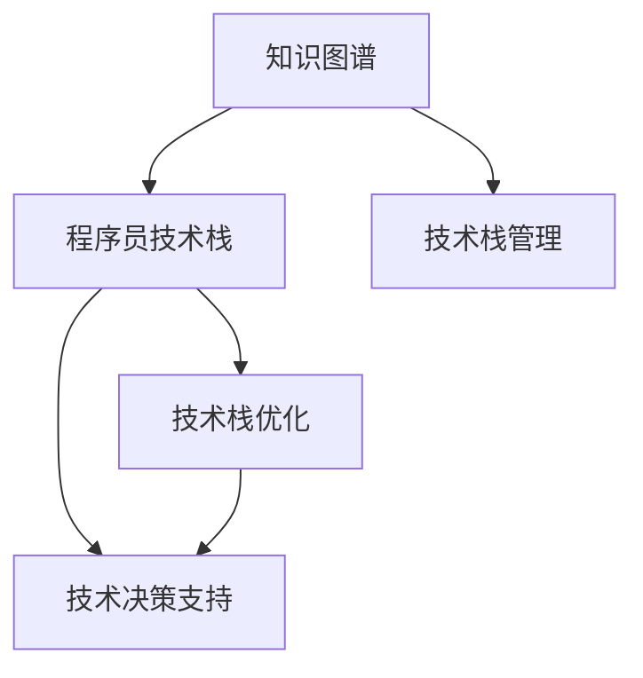

                 

# 知识图谱在程序员技术栈管理中的应用

> 关键词：知识图谱, 程序员技术栈, 技术管理, 技术栈优化, 技术决策支持, 编程知识图谱

## 1. 背景介绍

随着软件行业的快速发展，团队规模和复杂度不断增加，技术栈管理和团队协作面临诸多挑战。传统的技术管理方法往往难以应对，导致技术债务增加，团队效率低下，难以形成有效的知识共享。面对这一困境，越来越多的企业开始关注技术栈管理的重要性，并寻求新的解决方案。

知识图谱作为新兴的数据技术，以其强大的数据表示和推理能力，在程序员技术栈管理中显示出巨大的应用潜力。本文将深入探讨知识图谱在技术栈管理中的应用，分析其核心原理和操作步骤，并展示具体的项目实践和应用案例。

## 2. 核心概念与联系

### 2.1 核心概念概述

为更好地理解知识图谱在程序员技术栈管理中的应用，本节将介绍几个密切相关的核心概念：

- **知识图谱(Knowledge Graph)**：一种基于图形结构的数据表示方式，用于描述实体、属性、关系等知识，支持高效的数据查询和推理。
- **程序员技术栈(Programmer Technology Stack)**：指一组软件技术组件，包括编程语言、框架、库、工具等，用于构建和维护软件系统。
- **技术栈管理(Technology Stack Management)**：指通过管理和优化技术栈，提升软件系统的性能、稳定性和可维护性，促进团队协作和知识共享。
- **技术栈优化(Technology Stack Optimization)**：指通过分析技术栈中的瓶颈和冗余，优化技术选型和架构，提高开发效率和系统性能。
- **技术决策支持(Technology Decision Support)**：指通过知识图谱等数据技术，为技术选型、架构设计和团队协作提供辅助决策支持，降低技术管理复杂度。

这些核心概念之间的逻辑关系可以通过以下Mermaid流程图来展示：



这个流程图展示了一体化的知识图谱技术栈管理框架：

1. 知识图谱描述技术栈中的实体、属性、关系等知识。
2. 技术栈管理通过知识图谱提供技术选型和优化建议。
3. 技术栈优化利用知识图谱优化技术架构和组件选择。
4. 技术决策支持通过知识图谱辅助技术选型和团队协作。

这些概念共同构成了知识图谱在程序员技术栈管理中的应用基础。

## 3. 核心算法原理 & 具体操作步骤
### 3.1 算法原理概述

知识图谱在程序员技术栈管理中的应用主要基于以下核心算法原理：

- **实体识别与关系抽取**：通过自然语言处理技术，从技术文档、代码注释、开发博客等文本数据中提取技术实体和关系，构建知识图谱。
- **知识图谱嵌入**：使用深度学习算法，如TransE、KG-BERT等，将知识图谱中的实体和关系映射到低维向量空间中，便于计算和推理。
- **图谱查询与推理**：通过图谱查询语言(如SPARQL)和图神经网络算法，在知识图谱中进行实体的查找和关系推理，获取技术选型和优化建议。
- **关联规则挖掘**：利用关联规则算法，从知识图谱中挖掘出技术实体之间的依赖关系和推荐组合，辅助技术选型。

### 3.2 算法步骤详解

基于知识图谱的程序员技术栈管理，一般包括以下几个关键步骤：

**Step 1: 数据采集与预处理**
- 收集程序员技术栈的相关数据，如技术文档、代码注释、开发博客、技术调研报告等。
- 对数据进行清洗和格式化，去除冗余和噪音，确保数据质量。

**Step 2: 实体识别与关系抽取**
- 使用自然语言处理技术，如命名实体识别(NER)、依存句法分析、关系抽取等，从文本中提取出技术实体和关系。
- 构建知识图谱，将实体和关系存储为图谱节点和边，形成知识网络。

**Step 3: 知识图谱嵌入**
- 使用深度学习算法，如TransE、KG-BERT等，将知识图谱中的实体和关系映射到低维向量空间中。
- 训练和验证模型，优化图谱嵌入效果，确保模型的准确性和泛化能力。

**Step 4: 图谱查询与推理**
- 定义图谱查询语言，编写查询规则，获取技术选型和优化建议。
- 使用图神经网络算法，对知识图谱进行推理，获取更深层次的技术关联和依赖关系。

**Step 5: 应用与优化**
- 将知识图谱应用于技术栈管理中，辅助技术选型、架构优化和团队协作。
- 根据反馈和评估结果，持续优化知识图谱和查询算法，提升技术栈管理的精准度和效率。

### 3.3 算法优缺点

知识图谱在程序员技术栈管理中的应用具有以下优点：
1. **全面覆盖**：知识图谱能够全面覆盖技术栈中的各个方面，提供全面的技术选型和优化建议。
2. **高效推理**：通过图神经网络算法，知识图谱能够高效地进行实体查找和关系推理，提升技术决策的准确性。
3. **自适应更新**：知识图谱能够动态更新，随着技术栈的变化不断学习和适应，提升其时效性。
4. **可扩展性强**：知识图谱可以很容易地扩展到多个领域，支持多语言和多数据源的整合。

同时，该方法也存在一定的局限性：
1. **数据获取难度大**：构建知识图谱需要大量的技术文档和代码注释，数据获取难度较大。
2. **模型训练成本高**：深度学习算法训练成本较高，需要高性能计算资源和专业技能。
3. **数据偏差问题**：知识图谱中可能存在数据偏差，导致推理结果的不准确性。
4. **规则复杂性**：构建高效的查询规则和推理算法需要较深的技术积累，有一定复杂性。

尽管存在这些局限性，但就目前而言，知识图谱在程序员技术栈管理中的应用仍然显示出巨大的潜力。未来相关研究的重点在于如何进一步降低数据获取和模型训练成本，提高知识图谱的易用性和推理效果。

### 3.4 算法应用领域

知识图谱在程序员技术栈管理中的应用，主要涵盖以下几个领域：

- **技术选型与优化**：根据项目需求和团队能力，推荐合适的技术栈选型，优化现有技术栈，提升开发效率和系统性能。
- **架构设计与评估**：利用知识图谱分析技术栈中的瓶颈和冗余，提供架构设计和优化的建议，提升系统稳定性。
- **技术知识共享**：构建知识图谱，存储和共享技术栈中的知识和经验，促进团队协作和知识传递。
- **技术决策支持**：通过知识图谱提供技术决策支持，降低技术管理复杂度，提高决策准确性。
- **自动化测试与部署**：利用知识图谱进行测试用例和部署策略的自动生成，提高自动化测试和部署的覆盖率和效率。

## 4. 数学模型和公式 & 详细讲解 & 举例说明
### 4.1 数学模型构建

知识图谱在程序员技术栈管理中的应用，主要基于知识图谱嵌入和图谱查询的数学模型。

记知识图谱中的实体为 $E$，关系为 $R$，图谱节点为 $N$，则知识图谱可以表示为三元组集 $\mathcal{G} = \{(h,r,t)\}$，其中 $h$ 和 $t$ 为节点，$r$ 为边。图谱节点 $N$ 表示为集合 $\{e_1, e_2, ..., e_M\}$，其中 $M$ 为节点总数。

**实体嵌入**：
- 将实体 $e_i$ 表示为向量 $\vec{e_i} \in \mathbb{R}^d$，其中 $d$ 为向量维度。
- 使用TransE等算法，将实体嵌入映射到低维向量空间中。

**关系嵌入**：
- 将关系 $r$ 表示为向量 $\vec{r} \in \mathbb{R}^d$，其中 $d$ 为向量维度。
- 使用TransE等算法，将关系嵌入映射到低维向量空间中。

**图谱查询与推理**：
- 定义图谱查询语言，编写查询规则，获取技术选型和优化建议。
- 使用图神经网络算法，如GCN、GNN等，对知识图谱进行推理，获取更深层次的技术关联和依赖关系。

### 4.2 公式推导过程

以知识图谱嵌入的TransE算法为例，其核心公式如下：

$$
\min_{\theta} \frac{1}{2} \sum_{(h,r,t) \in \mathcal{G}} ||\vec{e_h} + \vec{r} - \vec{e_t}||^2
$$

其中 $\theta$ 为模型参数，$\vec{e_h}$、$\vec{e_t}$ 和 $\vec{r}$ 分别为实体嵌入、关系嵌入和未知的实体嵌入。

使用随机梯度下降等优化算法，最小化上述目标函数，得到最优的实体嵌入和关系嵌入。

### 4.3 案例分析与讲解

**案例一：技术栈选型与优化**

假设某软件开发团队在面临技术选型时，希望选择合适的编程语言和框架。知识图谱可以帮助他们进行以下步骤：

1. 数据采集：从代码库、技术博客、开发文档等来源，收集与技术栈相关的数据。
2. 实体识别与关系抽取：提取代码中使用的编程语言、框架名称、依赖库等实体，以及它们之间的依赖关系。
3. 知识图谱嵌入：使用TransE等算法，将实体和关系嵌入到低维向量空间中。
4. 图谱查询与推理：编写查询规则，获取根据项目需求和团队能力，推荐合适的技术栈选型，优化现有技术栈。

**案例二：架构设计与评估**

某企业开发了一个大型分布式系统，希望通过知识图谱优化系统架构。知识图谱可以帮助他们进行以下步骤：

1. 数据采集：从系统设计文档、代码注释、架构设计等来源，收集与系统架构相关的数据。
2. 实体识别与关系抽取：提取系统中的组件名称、依赖关系、设计模式等实体，以及它们之间的依赖关系。
3. 知识图谱嵌入：使用TransE等算法，将实体和关系嵌入到低维向量空间中。
4. 图谱查询与推理：编写查询规则，获取系统中的瓶颈和冗余，提供架构设计和优化的建议。

## 5. 项目实践：代码实例和详细解释说明
### 5.1 开发环境搭建

在进行知识图谱实践前，我们需要准备好开发环境。以下是使用Python进行PyTorch和GATE（General Architecture for Text Engineering）开发的环境配置流程：

1. 安装Anaconda：从官网下载并安装Anaconda，用于创建独立的Python环境。

2. 创建并激活虚拟环境：
```bash
conda create -n kg-env python=3.8 
conda activate kg-env
```

3. 安装PyTorch：根据CUDA版本，从官网获取对应的安装命令。例如：
```bash
conda install pytorch torchvision torchaudio cudatoolkit=11.1 -c pytorch -c conda-forge
```

4. 安装GATE：
```bash
pip install gate-ng
```

5. 安装各类工具包：
```bash
pip install numpy pandas scikit-learn matplotlib tqdm jupyter notebook ipython
```

完成上述步骤后，即可在`kg-env`环境中开始知识图谱的构建和应用实践。

### 5.2 源代码详细实现

下面我们以知识图谱嵌入和查询为例，给出使用PyTorch和GATE对技术栈数据进行知识图谱嵌入和查询的PyTorch代码实现。

首先，定义知识图谱的基本节点和关系：

```python
from gate.trex import *
from torch import nn

# 定义实体和关系
entities = ['Python', 'Java', 'React', 'Angular', 'Spring', 'TensorFlow', 'PyTorch', 'Scikit-learn', 'Docker', 'Kubernetes']
relationships = ['uses', 'has', 'is-framework-of', 'is-library-of', 'is-platform-for']

# 构建知识图谱
kg = Trex()
for e1, e2 in zip(entities, entities[1:]):
    kg.add_triple(e1, relationships[2], e2)
for e1, e2 in zip(entities, ['TensorFlow', 'PyTorch']):
    kg.add_triple(e1, relationships[3], e2)
for e1, e2 in zip(entities[4:], entities[1:]):
    kg.add_triple(e1, relationships[0], e2)

# 将知识图谱转换为GraphNetwork格式
g = to_graph_network(kg)
```

然后，定义实体嵌入和关系嵌入模型：

```python
# 定义实体嵌入模型
class EntityEmbedding(nn.Module):
    def __init__(self, embedding_dim):
        super(EntityEmbedding, self).__init__()
        self.embedding = nn.Embedding(len(entities), embedding_dim)

    def forward(self, x):
        return self.embedding(x)

# 定义关系嵌入模型
class RelationEmbedding(nn.Module):
    def __init__(self, embedding_dim):
        super(RelationEmbedding, self).__init__()
        self.embedding = nn.Embedding(len(relationships), embedding_dim)

    def forward(self, x):
        return self.embedding(x)
```

接着，定义训练函数和优化器：

```python
# 定义优化器
optimizer = torch.optim.Adam(params=[p for p in g.parameters() if p.requires_grad], lr=0.01)

# 定义训练函数
def train_step(batch):
    h, r, t = batch
    with torch.no_grad():
        h_emb = entity_emb(h)
        r_emb = relation_emb(r)
        t_emb = entity_emb(t)
        loss = (h_emb + r_emb - t_emb)**2
        optimizer.zero_grad()
        loss.backward()
        optimizer.step()
    return loss
```

最后，启动训练流程：

```python
# 训练知识图谱嵌入
embedding_dim = 100
entity_emb = EntityEmbedding(embedding_dim)
relation_emb = RelationEmbedding(embedding_dim)

for epoch in range(100):
    epoch_loss = 0
    for batch in g):
        epoch_loss += train_step(batch)
    epoch_loss /= len(g)
    print(f"Epoch {epoch+1}, loss: {epoch_loss:.3f}")
```

以上就是使用PyTorch和GATE构建和训练知识图谱的完整代码实现。可以看到，利用知识图谱嵌入技术，可以在低维向量空间中表示技术栈中的实体和关系，方便进行高效的图谱查询和推理。

### 5.3 代码解读与分析

让我们再详细解读一下关键代码的实现细节：

**定义知识图谱基本节点和关系**：
- 首先定义了技术栈中的实体和关系，构建了一个基本的知识图谱。
- 利用Trex库将知识图谱转换为GraphNetwork格式，便于后续嵌入和查询。

**定义实体嵌入和关系嵌入模型**：
- 使用nn.Embedding定义实体嵌入模型，将实体映射到低维向量空间中。
- 定义关系嵌入模型，同样将关系映射到低维向量空间中。

**定义训练函数和优化器**：
- 定义优化器，选择合适的优化算法和超参数。
- 编写训练函数，利用Adam算法更新模型参数，最小化损失函数。

**启动训练流程**：
- 设定训练的epoch数和batch大小，开始迭代训练。
- 在每个epoch中，计算平均损失，并打印输出。

通过这些代码，我们可以高效地构建和训练知识图谱，为技术栈管理提供辅助决策支持。

## 6. 实际应用场景

### 6.1 技术选型与优化

某互联网公司需要开发一个新的电商网站，希望通过知识图谱进行技术选型和优化。知识图谱可以帮助他们进行以下步骤：

1. 数据采集：从技术调研报告、开发博客、技术选型文档等来源，收集与电商网站相关的技术数据。
2. 实体识别与关系抽取：提取网站中使用的编程语言、框架、库、组件等实体，以及它们之间的依赖关系。
3. 知识图谱嵌入：使用TransE等算法，将实体和关系嵌入到低维向量空间中。
4. 图谱查询与推理：编写查询规则，获取根据项目需求和团队能力，推荐合适的技术栈选型，优化现有技术栈。

### 6.2 架构设计与评估

某金融公司开发了一个金融交易系统，希望通过知识图谱优化系统架构。知识图谱可以帮助他们进行以下步骤：

1. 数据采集：从系统设计文档、代码注释、架构设计等来源，收集与金融交易系统相关的数据。
2. 实体识别与关系抽取：提取系统中的组件名称、依赖关系、设计模式等实体，以及它们之间的依赖关系。
3. 知识图谱嵌入：使用TransE等算法，将实体和关系嵌入到低维向量空间中。
4. 图谱查询与推理：编写查询规则，获取系统中的瓶颈和冗余，提供架构设计和优化的建议。

### 6.3 技术决策支持

某科技公司希望通过知识图谱辅助技术决策，知识图谱可以帮助他们进行以下步骤：

1. 数据采集：从开发文档、技术博客、技术调研报告等来源，收集与技术决策相关的数据。
2. 实体识别与关系抽取：提取技术栈中的编程语言、框架、库、组件等实体，以及它们之间的依赖关系。
3. 知识图谱嵌入：使用TransE等算法，将实体和关系嵌入到低维向量空间中。
4. 图谱查询与推理：编写查询规则，获取根据项目需求和团队能力，推荐合适的技术栈选型，辅助技术决策。

## 7. 工具和资源推荐
### 7.1 学习资源推荐

为了帮助开发者系统掌握知识图谱在程序员技术栈管理中的应用，这里推荐一些优质的学习资源：

1. **《知识图谱理论与实践》系列博文**：由知识图谱技术专家撰写，深入浅出地介绍了知识图谱的原理、构建和应用。
2. **Stanford《Knowledge Graphs for Representing and Reasoning About Concepts》课程**：斯坦福大学开设的知识图谱课程，有Lecture视频和配套作业，带你系统了解知识图谱的基本概念和经典模型。
3. **《Programming Knowledge Graphs》书籍**：一本详细介绍编程知识图谱的书籍，涵盖知识图谱在程序员技术栈管理中的应用实例。
4. **KG-BERT官方文档**：KG-BERT库的官方文档，提供了知识图谱嵌入和查询的完整代码示例，是学习知识图谱嵌入的重要资源。
5. **Princeton《Knowledge Graphs in Natural Language Processing》论文**：一篇详细介绍知识图谱在自然语言处理中应用的经典论文，展示了知识图谱如何与自然语言处理技术相结合。

通过对这些资源的学习实践，相信你一定能够快速掌握知识图谱在程序员技术栈管理中的应用，并用于解决实际的NLP问题。

### 7.2 开发工具推荐

高效的开发离不开优秀的工具支持。以下是几款用于知识图谱构建和应用的常用工具：

1. **PyTorch**：基于Python的开源深度学习框架，灵活动态的计算图，适合快速迭代研究。
2. **TensorFlow**：由Google主导开发的开源深度学习框架，生产部署方便，适合大规模工程应用。
3. **GATE**：英国爱丁堡大学开发的通用文本工程技术框架，支持文本数据的抽取、转换、存储和分析。
4. **KG-BERT**：一款基于BERT的知识图谱嵌入工具，支持大规模知识图谱的嵌入和查询。
5. **GraphSAGE**：一款基于图神经网络的图谱查询工具，支持高效的图谱推理和查询。

合理利用这些工具，可以显著提升知识图谱构建和应用任务的开发效率，加快创新迭代的步伐。

### 7.3 相关论文推荐

知识图谱在程序员技术栈管理中的应用源于学界的持续研究。以下是几篇奠基性的相关论文，推荐阅读：

1. **《Knowledge Graphs: A Brief Survey and Tutorial on Their Construction and Application》**：介绍知识图谱的基本概念和构建方法。
2. **《A Survey on Knowledge Graph Embeddings》**：详细综述知识图谱嵌入技术的研究进展和应用实例。
3. **《Knowledge Graph Embeddings for Recommendation Systems: A Survey》**：研究知识图谱嵌入在推荐系统中的应用。
4. **《Programmable Knowledge Graphs for Software Engineering》**：研究知识图谱在软件工程中的应用，涵盖技术选型、架构设计等多个方面。
5. **《Graph Neural Networks: A Review of Methods and Applications》**：综述图神经网络在知识图谱查询和推理中的应用。

这些论文代表了大规模知识图谱在程序员技术栈管理中的研究脉络。通过学习这些前沿成果，可以帮助研究者把握学科前进方向，激发更多的创新灵感。

## 8. 总结：未来发展趋势与挑战

### 8.1 总结

本文对知识图谱在程序员技术栈管理中的应用进行了全面系统的介绍。首先阐述了知识图谱的原理和核心概念，明确了知识图谱在技术栈管理中的重要作用。其次，从原理到实践，详细讲解了知识图谱嵌入和查询的关键步骤，给出了知识图谱构建和应用的具体代码实现。同时，本文还广泛探讨了知识图谱在技术选型、架构优化、决策支持等多个场景的应用前景，展示了其巨大的应用潜力。此外，本文精选了知识图谱学习的各类资源，力求为读者提供全方位的技术指引。

通过本文的系统梳理，可以看到，知识图谱在程序员技术栈管理中的应用前景广阔，可以显著提升技术栈管理的效率和效果，推动软件技术栈的优化升级。随着知识图谱技术的不断演进，相信其在技术管理领域的应用将更加广泛，为软件开发带来更多的智能化和自动化支持。

### 8.2 未来发展趋势

展望未来，知识图谱在程序员技术栈管理中的应用将呈现以下几个发展趋势：

1. **自动化程度提升**：知识图谱的构建和嵌入将逐步实现自动化，减少人工干预和数据标注的工作量，提高效率和准确性。
2. **多模态数据融合**：知识图谱将逐步融合多模态数据，如代码、文档、知识库等，提升对复杂技术栈的建模能力。
3. **实时动态更新**：知识图谱将具备实时动态更新的能力，能够及时反映技术栈的变化，保持数据的时效性。
4. **深度学习结合**：知识图谱将更多地结合深度学习技术，提升推理和查询的准确性和效率。
5. **模型解释性增强**：知识图谱将更加注重模型的解释性和可解释性，便于开发者理解和调试。
6. **应用场景扩展**：知识图谱将在更多领域得到应用，如智能推荐、自动化测试、故障诊断等，提升软件开发的质量和效率。

以上趋势凸显了知识图谱在程序员技术栈管理中的应用潜力，相信随着技术的不懈探索和实践积累，知识图谱将在软件开发和软件工程中扮演越来越重要的角色。

### 8.3 面临的挑战

尽管知识图谱在程序员技术栈管理中的应用已经展现出巨大的优势，但在实现其广泛应用的过程中，仍面临诸多挑战：

1. **数据获取和标注成本高**：构建知识图谱需要大量的数据和人工标注，成本较高，制约了知识图谱的快速推广。
2. **模型复杂度增加**：知识图谱的构建和嵌入过程复杂，需要专业知识和技术积累，对开发者的要求较高。
3. **实时更新困难**：知识图谱的实时更新机制尚未完善，无法及时反映技术栈的变化，影响数据的时效性。
4. **可解释性不足**：知识图谱的推理过程缺乏可解释性，难以理解和调试，影响开发者的信任和使用意愿。
5. **知识图谱泛化能力有待提升**：知识图谱在不同领域和场景中的泛化能力需要进一步提升，才能实现广泛应用。

尽管存在这些挑战，但知识图谱在程序员技术栈管理中的应用前景广阔，随着技术的不懈探索和实践积累，相信这些挑战终将逐一被克服，知识图谱必将在构建人机协同的智能系统中扮演越来越重要的角色。

### 8.4 研究展望

面向未来，知识图谱在程序员技术栈管理中的应用需要在以下几个方面进行突破：

1. **自动化知识图谱构建**：研究如何自动化地从文本数据中抽取实体和关系，构建知识图谱，降低人工标注的成本。
2. **高效知识图谱嵌入**：研究高效的知识图谱嵌入算法，提升嵌入效果和查询性能，降低计算成本。
3. **增强模型解释性**：研究知识图谱推理过程的可解释性，提升模型的透明性和可靠性。
4. **多模态数据融合**：研究如何将代码、文档、知识库等多模态数据融合到知识图谱中，提升知识图谱的建模能力。
5. **实时动态更新**：研究如何实现知识图谱的实时动态更新机制，保持数据的时效性。

这些研究方向的探索，必将引领知识图谱在程序员技术栈管理中的应用迈向更高的台阶，为软件开发和软件工程带来更多的智能化和自动化支持。

## 9. 附录：常见问题与解答

**Q1：知识图谱在技术栈管理中需要哪些数据？**

A: 知识图谱在技术栈管理中的应用需要以下数据：
1. 技术文档：如技术调研报告、开发手册、代码注释等，包含技术栈中使用的编程语言、框架、库、组件等实体。
2. 项目案例：如技术选型文档、架构设计文档、代码库等，包含技术栈中的依赖关系和组件依赖。
3. 知识库：如开源代码库、技术博客、技术论坛等，包含技术栈中的技术趋势、最佳实践、经验总结等。

**Q2：知识图谱的实体识别和关系抽取有哪些常用方法？**

A: 知识图谱的实体识别和关系抽取主要基于以下方法：
1. 命名实体识别（Named Entity Recognition, NER）：从文本中识别出实体及其类型。
2. 依存句法分析（Dependency Parsing）：分析句子的语法结构，提取实体之间的关系。
3. 关系抽取（Relation Extraction）：从文本中识别出实体之间的关系。
4. 知识图谱模式匹配：基于已有的知识图谱模式，从文本中提取实体和关系。

**Q3：知识图谱嵌入的TransE算法有哪些局限性？**

A: TransE算法在知识图谱嵌入中的应用存在以下局限性：
1. 假设实体和关系为向量表示，无法处理复杂的高维向量。
2. 难以处理实体和关系的非线性关系，需要大量手工标注数据。
3. 难以处理实体和关系的多义词义，容易产生歧义。
4. 难以处理大规模知识图谱，计算复杂度高。

尽管存在这些局限性，但TransE算法在知识图谱嵌入中仍具有较高的实用价值，尤其是在小规模知识图谱的构建中表现优异。

**Q4：知识图谱在技术栈管理中的应用前景如何？**

A: 知识图谱在技术栈管理中的应用前景广阔，主要体现在以下几个方面：
1. 技术选型与优化：帮助团队快速选择和优化技术栈，提升开发效率和系统性能。
2. 架构设计与评估：提供架构设计和优化的建议，提升系统稳定性和可维护性。
3. 技术决策支持：辅助技术选型和团队协作，降低技术管理复杂度，提高决策准确性。
4. 自动化测试与部署：自动生成测试用例和部署策略，提高自动化测试和部署的覆盖率和效率。

总之，知识图谱在技术栈管理中的应用前景广阔，能够显著提升技术栈管理的效率和效果，推动软件开发和软件工程的发展。

**Q5：知识图谱的实时动态更新机制如何实现？**

A: 知识图谱的实时动态更新机制主要通过以下方法实现：
1. 数据源的实时采集：从代码库、文档库、技术博客等数据源实时采集数据，更新知识图谱。
2. 增量式嵌入与推理：采用增量式知识图谱嵌入和推理算法，减少计算量和数据存储量。
3. 多模态数据融合：融合代码、文档、知识库等多模态数据，提升知识图谱的建模能力。
4. 分布式处理：利用分布式计算框架，提高知识图谱的更新效率和数据处理能力。

通过这些技术手段，知识图谱可以实现实时动态更新，保持数据的及时性和准确性。

---

作者：禅与计算机程序设计艺术 / Zen and the Art of Computer Programming

