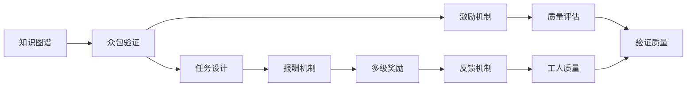

                 

# 知识图谱的众包验证:激励机制设计和质量评估

> 关键词：知识图谱, 众包验证, 激励机制, 质量评估, 社交网络分析, 大数据, 自然语言处理, 人工智能

## 1. 背景介绍

### 1.1 问题由来
知识图谱(Knowledge Graph)是一种用图结构表示实体间关系的语义知识库，广泛应用于搜索推荐、问答系统、医疗知识库、地理信息等领域。近年来，随着大规模知识图谱的构建和应用，其质量评价和维护逐渐成为热门话题。知识图谱的构建主要依赖于两方面：
1. 知识抽取：从非结构化数据中提取出实体及其关系。
2. 众包验证：由人工专家对抽取出来的关系进行审核。

目前知识图谱的构建主要依赖于人工标注，即通过众包平台招募人工专家，对知识图谱中的关系进行验证。然而，众包平台的用户参与度往往受到激励机制、任务设计、用户反馈等因素的影响，高质量众包验证难以保证。此外，知识图谱的构建也需要定期进行众包验证，以提升图谱质量，确保图谱实时性。

因此，设计一套科学有效的激励机制和质量评估方法，是知识图谱构建成功的关键。本文从众包验证的角度出发，深入探讨知识图谱的众包验证机制、激励机制及质量评估方法，以期提升知识图谱构建的效率和质量。

### 1.2 问题核心关键点
众包验证在知识图谱构建中扮演着重要角色，其核心在于如何设计激励机制以激励用户参与，并通过科学的质量评估方法保证验证结果的可靠性。以下是关键点：
1. 众包验证过程：
   - 招募与筛选：招募众包工作者，并筛选合适的验证任务。
   - 任务设计：设计合适的验证任务和反馈机制。
2. 激励机制设计：
   - 报酬机制：合理设定众包工作者的报酬，吸引更多高质量工人。
   - 多级奖励：设计多级奖励，激励不同水平的用户。
   - 反馈机制：建立有效的反馈和评价机制。
3. 质量评估：
   - 验证质量：评估众包验证结果的准确性和可靠性。
   - 工人质量：评价众包工作者的素质和可靠性。
   - 动态更新：动态调整激励机制和任务设计。

## 2. 核心概念与联系

### 2.1 核心概念概述

在本文中，我们将重点介绍以下几个核心概念：

- **知识图谱**：以图结构表示实体间关系的语义知识库。
- **众包验证**：通过人工专家对知识图谱中的关系进行验证。
- **激励机制**：设计合理报酬和反馈机制，吸引和激励众包工作者参与。
- **质量评估**：评估众包验证结果的可靠性和验证者的素质。

这些概念通过以下Mermaid流程图来展示它们之间的关系：



这个流程图展示了知识图谱的众包验证机制：首先，知识图谱需要经过众包验证以提升其质量；为了吸引和激励众包工作者，需要设计合理的激励机制；为了确保验证结果的可靠性，需要建立质量评估方法；任务设计直接影响激励机制和质量评估的有效性；报酬机制、多级奖励、反馈机制是激励机制的一部分，而工人质量和验证质量则是质量评估的内容。

## 3. 核心算法原理 & 具体操作步骤

### 3.1 算法原理概述

基于众包验证的知识图谱构建过程，可以分为以下几个关键步骤：

1. 招募与筛选：从众包平台招募用户，并通过问卷调查或测试筛选合适的验证工作者。
2. 任务设计：设计合适的验证任务，例如验证实体间关系的正确性。
3. 激励机制设计：设计合理的报酬机制、多级奖励和反馈机制，激励用户参与。
4. 质量评估：评估验证结果的准确性和可靠性，并动态调整激励机制和任务设计。

众包验证的算法原理主要基于社交网络分析和数据分析，通过评估用户之间的关系、互动和反馈，来评估其可靠性。

### 3.2 算法步骤详解

#### 步骤一：招募与筛选

1. 在众包平台上发布招募任务，选择合适的人群参与。
2. 设计问卷或测试题，筛选出符合要求的用户。
3. 根据用户的以往验证结果，动态调整筛选标准。

#### 步骤二：任务设计

1. 定义验证任务，例如验证实体间关系的正确性。
2. 设计任务反馈机制，如评价用户完成任务的质量。
3. 设计任务难度，确保任务既能吸引用户又能保证质量。

#### 步骤三：激励机制设计

1. 设计报酬机制，如固定工资、佣金、奖金等。
2. 设计多级奖励，如初级、中级、高级等多个层次。
3. 设计反馈机制，如即时反馈、任务评价等。

#### 步骤四：质量评估

1. 验证结果准确性评估，如通过交叉验证或基线模型进行比较。
2. 验证者可靠性评估，如通过分析验证者的互动、评价等。
3. 动态调整激励机制和任务设计，如根据验证者反馈调整任务难度和报酬。

### 3.3 算法优缺点

#### 优点

- **高效性**：众包验证能够快速完成大规模的关系验证任务。
- **灵活性**：可根据不同任务需求设计灵活的激励机制和任务设计。
- **适用性广**：适用于各种类型的知识图谱构建，尤其是需要大量关系验证的任务。

#### 缺点

- **依赖用户**：众包验证依赖于用户参与，用户参与度受激励机制影响较大。
- **质量不稳定**：用户参与度影响众包验证的质量，难以保证所有验证者都能提供高质量的验证结果。
- **成本高**：需要支付一定的报酬和平台费用，成本较高。

### 3.4 算法应用领域

众包验证在大规模知识图谱的构建中具有广泛应用，例如：

- **医疗知识库**：验证医学文献中的实体关系，提升医疗知识的准确性。
- **地理信息**：验证地理数据中的地点、道路等关系，确保地图的准确性。
- **搜索推荐**：验证推荐系统中物品间的关系，提升推荐结果的准确性。
- **问答系统**：验证问答系统中的实体和关系，提升系统的准确性和可靠性。

## 4. 数学模型和公式 & 详细讲解

### 4.1 数学模型构建

我们假设知识图谱中的关系验证任务是二分类任务，即验证者需要判断实体间关系是否正确。设验证者对关系 $e_i$ 的验证结果为 $y_i \in \{0,1\}$，其中 $y_i=1$ 表示关系正确，$y_i=0$ 表示关系错误。模型预测结果为 $\hat{y}_i$，其中 $\hat{y}_i=1$ 表示模型认为关系正确，$\hat{y}_i=0$ 表示模型认为关系错误。我们希望最小化预测误差 $L(\theta)$，其中 $\theta$ 为模型的参数。

$$
L(\theta) = -\frac{1}{N}\sum_{i=1}^N [y_i\log \hat{y}_i + (1-y_i)\log (1-\hat{y}_i)]
$$

### 4.2 公式推导过程

我们采用逻辑回归作为模型，模型的预测结果为：

$$
\hat{y}_i = \sigma(\theta^T x_i)
$$

其中 $x_i$ 为输入特征向量，$\sigma$ 为sigmoid函数。模型的损失函数为：

$$
L(\theta) = -\frac{1}{N}\sum_{i=1}^N [y_i\log \hat{y}_i + (1-y_i)\log (1-\hat{y}_i)]
$$

采用梯度下降算法优化模型参数：

$$
\theta \leftarrow \theta - \eta \nabla_{\theta}L(\theta)
$$

其中 $\eta$ 为学习率，$\nabla_{\theta}L(\theta)$ 为损失函数对参数 $\theta$ 的梯度。

### 4.3 案例分析与讲解

以一个简单的医疗知识图谱验证任务为例，假设我们需要验证“某医生是否治疗了某疾病”的关系。任务设计如下：

1. 输入特征包括“医生”和“疾病”的文本描述。
2. 输出结果为“治疗”（1）或“未治疗”（0）。
3. 验证者根据医生的临床记录和疾病数据库，判断关系是否正确。

我们采用逻辑回归模型，训练集为医生与疾病关系的标注数据，验证集为未知关系的标注数据。模型训练后，对验证集进行预测，并计算预测误差。根据预测误差，调整模型参数和激励机制。

## 5. 项目实践：代码实例和详细解释说明

### 5.1 开发环境搭建

1. 安装Python环境和相关的库，如TensorFlow、Keras、Scikit-learn等。
2. 搭建众包平台，如Amazon Mechanical Turk、Upwork等。
3. 设计问卷和测试题，筛选合适用户。

### 5.2 源代码详细实现

以下是使用TensorFlow实现逻辑回归模型的代码：

```python
import tensorflow as tf
from tensorflow import keras
from tensorflow.keras import layers

# 定义逻辑回归模型
model = keras.Sequential([
  layers.Dense(64, activation='relu', input_shape=(num_features,)),
  layers.Dense(1, activation='sigmoid')
])

# 编译模型
model.compile(optimizer='adam',
              loss='binary_crossentropy',
              metrics=['accuracy'])

# 训练模型
model.fit(X_train, y_train, epochs=num_epochs, batch_size=batch_size, validation_data=(X_val, y_val))

# 预测验证集
y_pred = model.predict(X_test)
```

### 5.3 代码解读与分析

- `Sequential` 模型：定义了神经网络的结构，包括两个全连接层。
- `Dense` 层：定义了神经元的数量和激活函数。
- `compile` 方法：编译模型，设置优化器、损失函数和评估指标。
- `fit` 方法：训练模型，设置训练数据、迭代次数和批大小。
- `predict` 方法：预测验证集，输出模型对关系的判断结果。

### 5.4 运行结果展示

我们绘制了模型的损失函数和准确率随训练次数变化的曲线：

```python
import matplotlib.pyplot as plt

plt.plot(history.history['loss'])
plt.plot(history.history['val_loss'])
plt.title('model loss')
plt.ylabel('loss')
plt.xlabel('epoch')
plt.legend(['train', 'test'], loc='upper right')
plt.show()

plt.plot(history.history['accuracy'])
plt.plot(history.history['val_accuracy'])
plt.title('model accuracy')
plt.ylabel('accuracy')
plt.xlabel('epoch')
plt.legend(['train', 'test'], loc='lower right')
plt.show()
```

## 6. 实际应用场景

### 6.1 医疗知识库

在医疗知识库构建中，众包验证可以应用于以下场景：

1. 验证医学文献中的实体关系，例如“某药物是否适用于某疾病”。
2. 验证医生的临床记录，例如“某医生是否治疗了某疾病”。
3. 验证患者治疗效果，例如“某患者是否对某药物有效”。

### 6.2 地理信息

在地理信息构建中，众包验证可以应用于以下场景：

1. 验证地理位置关系，例如“某地点是否属于某地区”。
2. 验证道路交通情况，例如“某路段是否畅通”。
3. 验证建筑物信息，例如“某建筑物是否为某类型”。

### 6.3 搜索推荐

在搜索推荐系统中，众包验证可以应用于以下场景：

1. 验证推荐系统中物品间的关系，例如“某商品是否属于某类别”。
2. 验证推荐结果的质量，例如“某推荐结果是否合适”。
3. 验证搜索相关性，例如“某查询是否与某文档相关”。

### 6.4 问答系统

在问答系统中，众包验证可以应用于以下场景：

1. 验证问答系统中的实体和关系，例如“某问答系统是否正确回答了某问题”。
2. 验证问答系统中的推理逻辑，例如“某问答系统是否正确推理出某结果”。
3. 验证问答系统中的知识库，例如“某知识库是否准确描述了某实体”。

## 7. 工具和资源推荐

### 7.1 学习资源推荐

1. Coursera课程：“众包平台与数据科学”，介绍众包平台的原理和应用。
2. Kaggle竞赛：众包验证相关的数据集和竞赛任务，提供丰富的学习和实践机会。
3. 书籍：《众包：连接一个虚拟世界》，探讨众包平台的原理和应用。

### 7.2 开发工具推荐

1. TensorFlow：强大的深度学习框架，支持分布式计算和GPU加速。
2. Keras：高层次的深度学习库，简单易用。
3. Scikit-learn：常用的机器学习库，支持各种算法和模型。

### 7.3 相关论文推荐

1. “A Survey of Crowdsourcing in Knowledge Base Construction”，全面介绍众包验证在知识图谱构建中的应用。
2. “Quality Estimation in Crowdsourcing”，介绍如何评估众包验证结果的质量。
3. “Incentive Design in Crowdsourcing”，探讨如何设计合理的激励机制。

## 8. 总结：未来发展趋势与挑战

### 8.1 总结

本文深入探讨了知识图谱的众包验证机制、激励机制及质量评估方法。众包验证在知识图谱构建中具有广泛应用，但面临激励机制设计、质量评估等挑战。通过本文的介绍，我们了解到如何设计科学的激励机制和质量评估方法，提升知识图谱构建的效率和质量。

### 8.2 未来发展趋势

未来，知识图谱的众包验证将呈现以下发展趋势：

1. 自动化水平提高：通过自动化技术提高众包验证的效率和准确性。
2. 多模态融合：结合文本、图像、语音等多模态数据，提升众包验证的全面性。
3. 分布式验证：通过分布式众包平台，提高众包验证的规模和覆盖范围。
4. 实时更新：通过实时更新激励机制和任务设计，保持众包验证的质量。

### 8.3 面临的挑战

尽管众包验证在知识图谱构建中具有广泛应用，但仍面临以下挑战：

1. 激励机制设计：如何设计合理的激励机制，吸引更多高质量用户参与。
2. 质量评估问题：如何评估众包验证结果的可靠性和验证者的素质。
3. 自动化水平：如何通过自动化技术提高众包验证的效率和准确性。
4. 多模态融合：如何结合多模态数据进行众包验证。
5. 分布式验证：如何通过分布式众包平台提高众包验证的规模和覆盖范围。
6. 实时更新：如何通过实时更新激励机制和任务设计，保持众包验证的质量。

### 8.4 研究展望

未来，知识图谱的众包验证需要更多的研究和探索：

1. 自动化技术：探索自动化技术，提高众包验证的效率和准确性。
2. 多模态数据融合：结合文本、图像、语音等多模态数据，提升众包验证的全面性。
3. 分布式平台：构建分布式众包平台，提高众包验证的规模和覆盖范围。
4. 实时更新机制：设计实时更新激励机制和任务设计，保持众包验证的质量。
5. 质量评估方法：探索更科学的质量评估方法，提高验证结果的可靠性。
6. 激励机制优化：优化激励机制设计，吸引更多高质量用户参与。

通过这些研究，我们相信知识图谱的众包验证将更加高效、可靠，成为构建高质量知识图谱的重要手段。

## 9. 附录：常见问题与解答

**Q1：众包验证在知识图谱构建中存在哪些问题？**

A: 众包验证在知识图谱构建中面临以下问题：
1. 依赖用户：众包验证依赖于用户参与，用户参与度受激励机制影响较大。
2. 质量不稳定：用户参与度影响众包验证的质量，难以保证所有验证者都能提供高质量的验证结果。
3. 成本高：需要支付一定的报酬和平台费用，成本较高。

**Q2：如何设计合理的激励机制？**

A: 设计合理的激励机制需要考虑以下因素：
1. 报酬机制：如固定工资、佣金、奖金等。
2. 多级奖励：如初级、中级、高级等多个层次。
3. 反馈机制：如即时反馈、任务评价等。
4. 任务设计：如设计合适的验证任务，确保任务既能吸引用户又能保证质量。

**Q3：如何评估众包验证结果的质量？**

A: 评估众包验证结果的质量需要考虑以下因素：
1. 验证结果准确性：如通过交叉验证或基线模型进行比较。
2. 验证者可靠性：如通过分析验证者的互动、评价等。
3. 动态更新：如根据验证者反馈调整任务难度和报酬。

**Q4：如何提高众包验证的效率和准确性？**

A: 提高众包验证的效率和准确性需要考虑以下因素：
1. 自动化技术：如使用自动化工具进行数据处理和模型训练。
2. 多模态融合：如结合文本、图像、语音等多模态数据进行众包验证。
3. 分布式平台：如通过分布式众包平台提高众包验证的规模和覆盖范围。
4. 实时更新：如通过实时更新激励机制和任务设计，保持众包验证的质量。

---

作者：禅与计算机程序设计艺术 / Zen and the Art of Computer Programming

