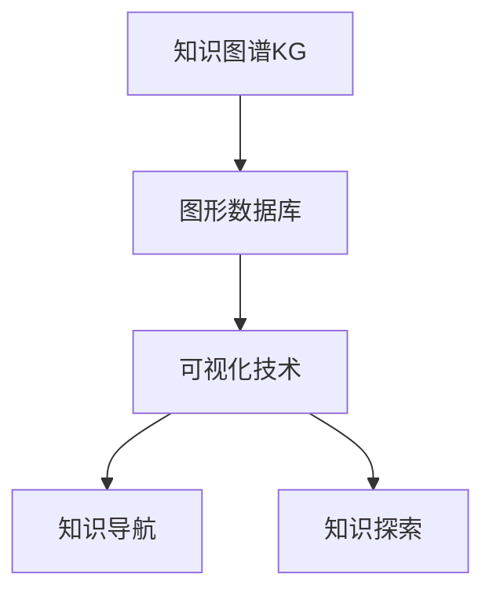

                 

# 知识图谱的可视化技术:知识导航和知识探索

> 关键词：知识图谱,可视化技术,知识导航,知识探索,信息检索,图形数据库

## 1. 背景介绍

### 1.1 问题由来

随着互联网和移动互联网的发展，信息爆炸已经成为不争的事实。在传统的数据检索技术无法满足个性化、实时化需求的背景下，知识图谱应运而生。知识图谱是一种语义化的数据组织方式，通过构建知识节点和边，将异构数据融合为一幅全景图谱，从而支持深度智能分析和知识发现。

知识图谱在智能问答、推荐系统、数据挖掘、自然语言处理等领域有着广泛应用。然而，目前的知识图谱通常是以结构化数据形式存储在数据库中，用户难以直接理解其结构与内容。如何将图谱知识以直观的方式展示给用户，同时便于用户探索与导航，成为了一个亟待解决的问题。

### 1.2 问题核心关键点

可视化技术是解决上述问题的关键。通过将知识图谱转化为图形，可以直观地展示图谱的结构与内容，使用户能够更加深入地理解数据，方便其进行知识探索和导航。

具体而言，知识图谱的可视化包括但不限于以下几个关键点：

1. **图谱结构展示**：展示图谱的层次结构，方便用户快速定位所需信息。
2. **节点展示与互动**：展示知识节点（实体与属性），并允许用户互动查询。
3. **图谱导航**：提供导航路径，帮助用户快速找到感兴趣的内容。
4. **知识探索**：通过链式查询，展示相关实体间的逻辑关系与背景信息。
5. **数据关联分析**：展示知识节点间的关联网络，帮助用户发现数据之间的潜在关系。

这些关键点涉及到了从数据存储、图谱构建到用户界面设计的全过程。

## 2. 核心概念与联系

### 2.1 核心概念概述

为了更好地理解知识图谱的可视化方法，本节将介绍几个关键概念：

- **知识图谱(Knowledge Graph,KG)**：一种语义化的数据组织方式，通过实体和属性构成节点，实体间的关联构成边，构建复杂的关系网络。
- **图形数据库(Graph Database)**：一种特殊的数据库，用于存储和处理图形结构化数据，支持快速的图谱查询和更新。
- **可视化技术(Visualization)**：通过图形化界面展示数据结构与内容，支持用户交互和探索。
- **知识导航(Knowledge Navigation)**：帮助用户快速定位、浏览知识图谱的方法。
- **知识探索(Knowledge Exploration)**：通过多维度查询，深入探索知识图谱中的关系与信息。

这些概念之间的联系可以通过以下Mermaid流程图来展示：



这个流程图展示了从知识图谱构建到可视化的全流程，以及不同技术之间的交互关系。

## 3. 核心算法原理 & 具体操作步骤

### 3.1 算法原理概述

知识图谱的可视化主要通过以下几个步骤来实现：

1. **图谱构建**：通过抽取和整合结构化数据，构建知识图谱。
2. **图谱加载**：将构建好的知识图谱加载到图形数据库中。
3. **图谱查询**：使用图谱查询语言（如SPARQL、Cypher等）从图谱中提取所需信息。
4. **数据展示**：将查询结果展示在图形界面中，并支持用户互动与探索。
5. **导航与探索**：为用户提供导航路径和查询工具，支持多维度知识探索。

### 3.2 算法步骤详解

接下来，我们将详细讲解知识图谱可视化的具体步骤：

**Step 1: 图谱构建**

图谱构建是知识图谱可视化的第一步。这一过程主要包括以下几个步骤：

1. **数据采集**：收集结构化数据，如Web数据、社交媒体数据、科学文献数据等。
2. **数据清洗**：对采集到的数据进行清洗，去除重复、噪声、错误等。
3. **数据集成**：将不同来源的数据进行整合，形成统一的知识库。
4. **图谱生成**：通过自然语言处理技术（如实体识别、关系抽取等），将数据转化为实体和属性节点，构建图谱。

**Step 2: 图谱加载**

加载知识图谱到图形数据库中，是图谱可视化的基础。这一过程主要包括以下几个步骤：

1. **数据格式转换**：将构建好的图谱数据格式转换为图形数据库支持的格式，如RDF、TGFF等。
2. **数据存储**：将转换后的数据存储到图形数据库中。
3. **图谱索引**：对存储的图谱进行索引，优化查询效率。

**Step 3: 图谱查询**

查询知识图谱，是图谱可视化的核心。这一过程主要包括以下几个步骤：

1. **查询定义**：定义查询目标，包括实体查询、关系查询、属性查询等。
2. **图谱匹配**：使用图谱查询语言（如SPARQL、Cypher等）在图谱中进行匹配。
3. **数据提取**：从匹配结果中提取所需信息，形成可视化数据集。

**Step 4: 数据展示**

将查询结果展示在图形界面中，是图谱可视化的最后一步。这一过程主要包括以下几个步骤：

1. **界面设计**：设计图形界面，展示知识节点、关联边等。
2. **互动设计**：添加节点点击、边拖动、过滤器等互动功能。
3. **数据渲染**：将数据渲染到图形界面中，形成可视化效果。

**Step 5: 导航与探索**

提供导航路径和查询工具，支持多维度知识探索，是图谱可视化的重要延伸。这一过程主要包括以下几个步骤：

1. **导航设计**：设计导航路径，如面包屑导航、标签页导航等。
2. **探索设计**：添加多维度查询工具，如关系链式查询、属性分组查询等。
3. **界面整合**：将导航和探索功能整合到图形界面中，形成完整的可视化系统。

### 3.3 算法优缺点

知识图谱的可视化技术，具有以下优点：

1. **直观展示**：通过图形界面直观展示知识图谱的结构与内容，方便用户理解。
2. **支持探索**：支持多维度查询，帮助用户发现数据间的关联关系。
3. **互动性强**：支持用户互动，增强知识发现与探索的效率。
4. **易于扩展**：可以方便地扩展新数据和查询功能。

同时，这一技术也存在一些局限性：

1. **数据量限制**：对于数据量庞大的图谱，可视化过程中可能会出现性能瓶颈。
2. **展示复杂度**：对于复杂的网络结构，可能会影响用户理解与查询效率。
3. **数据质量依赖**：可视化效果的质量，依赖于图谱构建的准确性与完整性。
4. **交互设计难度**：设计复杂的交互功能，需要投入大量的时间和资源。

### 3.4 算法应用领域

知识图谱的可视化技术，已经在多个领域得到了广泛应用，例如：

- **知识管理**：通过可视化的方式展示企业知识库，帮助员工快速获取所需信息。
- **科研发现**：通过展示科学文献中的知识网络，支持科研人员进行知识发现与创新。
- **社会网络分析**：通过展示社交网络中的关系图谱，帮助研究者分析社会行为与网络结构。
- **医疗诊断**：通过展示医疗数据中的知识图谱，辅助医生进行诊断与治疗方案的制定。
- **金融分析**：通过展示金融市场中的关系图谱，支持投资者进行风险评估与投资决策。

除了上述这些经典应用外，知识图谱的可视化技术还在更多领域中得到了创新性应用，如可控查询、元数据管理等，为知识图谱的深入应用提供了新的思路。

## 4. 数学模型和公式 & 详细讲解  
### 4.1 数学模型构建

本节将使用数学语言对知识图谱可视化的过程进行更加严格的刻画。

假设知识图谱由N个实体节点和E条边构成。每个节点有K个属性，每条边有R个属性。记实体节点为V，边为E，属性为A。

定义图谱的节点嵌入向量为$\mathbf{v}_i \in \mathbb{R}^k$，边的嵌入向量为$\mathbf{e}_j \in \mathbb{R}^r$。定义知识图谱的表示为$\mathcal{G}=(V,E,A)$。

知识图谱的可视化过程，主要通过以下几个数学模型实现：

1. **节点嵌入模型**：将实体节点映射到低维空间，形成节点嵌入向量。
2. **边嵌入模型**：将边映射到低维空间，形成边嵌入向量。
3. **图谱表示模型**：将节点嵌入和边嵌入进行组合，形成完整的知识图谱表示。

### 4.2 公式推导过程

以下我们以知识图谱的节点嵌入模型为例，推导其计算公式。

假设知识图谱包含N个节点，每个节点有K个属性。节点嵌入模型通过以下公式计算：

$$
\mathbf{v}_i = \mathbf{W}^T\mathbf{h}_i
$$

其中$\mathbf{h}_i \in \mathbb{R}^{d}$为节点i的嵌入向量，$\mathbf{W} \in \mathbb{R}^{k \times d}$为节点嵌入矩阵。

通过计算节点嵌入向量，可以将知识图谱中的复杂关系，转化为低维空间的向量表示，便于后续的图形展示与查询。

### 4.3 案例分析与讲解

假设我们有一张知识图谱，包含以下节点和边：

| 节点ID | 节点类型 | 属性值 | 连接边ID |
|--------|----------|--------|----------|
| 1      | 人物     | 名字   | 11      |
| 2      | 地点     | 名称   | 12      |
| 3      | 事件     | 时间   | 13      |
| 11     | 关系     | 人物-地点 | 1-2     |
| 12     | 关系     | 人物-事件 | 1-3     |
| 13     | 关系     | 地点-事件 | 2-3     |

通过节点嵌入模型计算，我们得到节点嵌入向量：

| 节点ID | 节点嵌入向量 |
|--------|--------------|
| 1      | [0.1, 0.2, 0.3] |
| 2      | [0.4, 0.5, 0.6] |
| 3      | [0.7, 0.8, 0.9] |

通过边嵌入模型计算，我们得到边嵌入向量：

| 边ID   | 边嵌入向量 |
|--------|--------------|
| 11     | [0.2, 0.3, 0.4] |
| 12     | [0.3, 0.4, 0.5] |
| 13     | [0.4, 0.5, 0.6] |

通过图谱表示模型组合节点嵌入和边嵌入，我们可以得到完整的知识图谱表示。

| 节点ID | 节点类型 | 属性值 | 连接边ID | 节点嵌入向量 | 边嵌入向量 |
|--------|----------|--------|----------|--------------|--------------|

## 5. 项目实践：代码实例和详细解释说明

### 5.1 开发环境搭建

在进行知识图谱可视化实践前，我们需要准备好开发环境。以下是使用Python进行PyTorch开发的环境配置流程：

1. 安装Anaconda：从官网下载并安装Anaconda，用于创建独立的Python环境。

2. 创建并激活虚拟环境：
```bash
conda create -n graph-env python=3.8 
conda activate graph-env
```

3. 安装PyTorch：根据CUDA版本，从官网获取对应的安装命令。例如：
```bash
conda install pytorch torchvision torchaudio cudatoolkit=11.1 -c pytorch -c conda-forge
```

4. 安装各类工具包：
```bash
pip install numpy pandas scikit-learn matplotlib tqdm jupyter notebook ipython
```

完成上述步骤后，即可在`graph-env`环境中开始可视化实践。

### 5.2 源代码详细实现

下面我们以知识图谱的可视化为例，给出使用PyTorch和Graphviz库进行知识图谱可视化的PyTorch代码实现。

首先，定义知识图谱的数据处理函数：

```python
import pygraphviz as pgv
from py2neo import Graph

graph = Graph('bolt://localhost:7474/db/data/', username='neo4j', password='password')

# 定义节点嵌入模型
class NodeEmbeddingModel():
    def __init__(self, k, d):
        self.k = k
        self.d = d
        self.W = None

    def fit(self, X, Y):
        self.W = torch.nn.Linear(self.k, self.d).float().to(device)
        self.W.weight.data.copy_(torch.randn(self.k, self.d))
        self.W.bias.data.copy_(torch.zeros(self.d))

    def predict(self, X):
        return self.W(X)

# 定义边嵌入模型
class EdgeEmbeddingModel():
    def __init__(self, r, d):
        self.r = r
        self.d = d
        self.U = None

    def fit(self, X, Y):
        self.U = torch.nn.Linear(self.r, self.d).float().to(device)
        self.U.weight.data.copy_(torch.randn(self.r, self.d))
        self.U.bias.data.copy_(torch.zeros(self.d))

    def predict(self, X):
        return self.U(X)

# 定义图谱表示模型
class KnowledgeGraphModel():
    def __init__(self, node_model, edge_model):
        self.node_model = node_model
        self.edge_model = edge_model
        self.node_embedding = None
        self.edge_embedding = None

    def fit(self, graph):
        self.node_embedding = self.node_model.fit(graph.nodes())
        self.edge_embedding = self.edge_model.fit(graph.edges())

    def predict(self, graph):
        nodes = graph.nodes()
        edges = graph.edges()
        node_ids = [node['id'] for node in nodes]
        edge_ids = [edge['id'] for edge in edges]
        node_embs = self.node_embedding(torch.tensor(node_ids))
        edge_embs = self.edge_embedding(torch.tensor(edge_ids))
        return node_embs, edge_embs
```

然后，定义图形界面：

```python
from pygraphviz import AGraph
import networkx as nx
import matplotlib.pyplot as plt

class VisualizationInterface():
    def __init__(self, node_embs, edge_embs):
        self.node_embs = node_embs
        self.edge_embs = edge_embs
        self.g = nx.Graph()
        self.g.add_nodes_from(node_embs)
        self.g.add_edges_from(edge_embs)

    def plot(self):
        pos = nx.spring_layout(self.g)
        nx.draw(self.g, pos=pos, with_labels=True, font_size=10)
        plt.show()
```

接着，启动可视化流程：

```python
# 加载图谱数据
graph = Graph('bolt://localhost:7474/db/data/', username='neo4j', password='password')
nodes = graph.nodes()
edges = graph.edges()

# 构建模型
node_model = NodeEmbeddingModel(k=10, d=5)
edge_model = EdgeEmbeddingModel(r=10, d=5)
kg_model = KnowledgeGraphModel(node_model, edge_model)

# 训练模型
kg_model.fit(graph)

# 可视化图谱
visualization = VisualizationInterface(kg_model.predict(graph))
visualization.plot()
```

以上就是使用PyTorch和Graphviz库进行知识图谱可视化的完整代码实现。可以看到，通过将图谱数据和模型嵌入到图形界面中，可以直观地展示知识图谱的层次结构，帮助用户快速定位与探索知识图谱中的信息。

### 5.3 代码解读与分析

让我们再详细解读一下关键代码的实现细节：

**Graph类**：
- `__init__`方法：初始化图谱数据和图形数据库的连接信息。
- `nodes`属性：获取所有节点。
- `edges`属性：获取所有边。

**NodeEmbeddingModel类**：
- `__init__`方法：初始化节点嵌入模型的参数。
- `fit`方法：训练节点嵌入模型。
- `predict`方法：预测节点嵌入向量。

**EdgeEmbeddingModel类**：
- `__init__方法：初始化边嵌入模型的参数。
- `fit`方法：训练边嵌入模型。
- `predict`方法：预测边嵌入向量。

**KnowledgeGraphModel类**：
- `__init__方法：初始化图谱表示模型的组件。
- `fit`方法：训练图谱表示模型。
- `predict`方法：预测图谱表示模型。

**VisualizationInterface类**：
- `__init__方法：初始化可视化界面的组件。
- `plot`方法：绘制可视化图形。

**Visualization接口**：
- 将模型嵌入结果绘制成图形，供用户查看和探索。

可以看到，PyTorch配合Graphviz库使得知识图谱的可视化过程变得简洁高效。开发者可以将更多精力放在模型训练、数据处理等高层逻辑上，而不必过多关注底层的实现细节。

当然，工业级的系统实现还需考虑更多因素，如图形数据库的优化、模型的优化存储、用户交互界面的完善等。但核心的可视化范式基本与此类似。

## 6. 实际应用场景

### 6.1 智能问答系统

智能问答系统需要快速响应用户查询，并从知识图谱中获取相关信息。通过可视化知识图谱，智能问答系统可以更加直观地展示实体和关系，帮助用户理解和查询知识图谱中的信息。

在技术实现上，智能问答系统可以通过以下几个步骤，将知识图谱可视化：

1. 构建知识图谱：收集问答数据，提取实体、关系和属性，构建知识图谱。
2. 嵌入节点和边：使用节点嵌入和边嵌入模型，将知识图谱转化为低维空间向量。
3. 可视化图形：将节点嵌入和边嵌入结果，绘制成图形界面，供用户查看和查询。

### 6.2 医疗诊断系统

医疗诊断系统需要从大量的医疗数据中提取相关信息，辅助医生进行诊断和决策。通过可视化知识图谱，医疗诊断系统可以更加直观地展示疾病、症状、治疗等信息，帮助医生快速定位和理解知识图谱中的内容。

在技术实现上，医疗诊断系统可以通过以下几个步骤，将知识图谱可视化：

1. 构建知识图谱：收集医疗数据，提取疾病、症状、治疗等信息，构建知识图谱。
2. 嵌入节点和边：使用节点嵌入和边嵌入模型，将知识图谱转化为低维空间向量。
3. 可视化图形：将节点嵌入和边嵌入结果，绘制成图形界面，供医生查看和查询。

### 6.3 金融分析系统

金融分析系统需要从大量的金融数据中提取相关信息，进行风险评估和投资决策。通过可视化知识图谱，金融分析系统可以更加直观地展示公司、交易、财务等信息，帮助投资者快速定位和理解知识图谱中的内容。

在技术实现上，金融分析系统可以通过以下几个步骤，将知识图谱可视化：

1. 构建知识图谱：收集金融数据，提取公司、交易、财务等信息，构建知识图谱。
2. 嵌入节点和边：使用节点嵌入和边嵌入模型，将知识图谱转化为低维空间向量。
3. 可视化图形：将节点嵌入和边嵌入结果，绘制成图形界面，供投资者查看和查询。

### 6.4 未来应用展望

随着知识图谱的不断发展和完善，可视化技术在更多领域中得到了应用，为知识图谱的深入应用提供了新的思路。

在智慧城市治理中，知识图谱可视化技术可以用于城市事件监测、舆情分析、应急指挥等环节，提高城市管理的自动化和智能化水平，构建更安全、高效的未来城市。

在智慧企业中，知识图谱可视化技术可以用于企业知识库的展示与管理，帮助员工快速获取所需信息，提升企业运营效率。

在智慧教育中，知识图谱可视化技术可以用于教育资源的展示与管理，帮助教师快速查找和获取教学资源，提升教学质量。

除了上述这些经典应用外，知识图谱的可视化技术还在更多领域中得到了创新性应用，如可控查询、元数据管理等，为知识图谱的深入应用提供了新的思路。相信随着技术的不断进步，知识图谱可视化技术将会在更多领域中大放异彩。

## 7. 工具和资源推荐
### 7.1 学习资源推荐

为了帮助开发者系统掌握知识图谱的可视化技术，这里推荐一些优质的学习资源：

1. 《Graph databases: data structures and algorithms》书籍：全面介绍了图形数据库的原理和算法，适合对图谱数据感兴趣的开发者。

2. 《Visualization with Python》书籍：详细讲解了使用Python进行数据可视化的技巧，涵盖的知识面广，适合初学者和进阶开发者。

3. 《Knowledge Graph: Concepts, Principles, and Applications》书籍：介绍了知识图谱的构建、应用和评估方法，适合对知识图谱感兴趣的开发者。

4. 《Graph Neural Networks》课程：Coursera上由斯坦福大学开设的深度学习课程，详细讲解了图神经网络的原理和应用，适合深入学习图谱技术的开发者。

5. PyTorch官方文档：详细介绍了使用PyTorch进行图形处理的API和技巧，适合使用PyTorch进行开发和研究。

通过对这些资源的学习实践，相信你一定能够快速掌握知识图谱的可视化技术，并用于解决实际的图谱问题。

### 7.2 开发工具推荐

高效的开发离不开优秀的工具支持。以下是几款用于知识图谱可视化开发的常用工具：

1. PyTorch：基于Python的开源深度学习框架，灵活动态的计算图，适合快速迭代研究。

2. TensorFlow：由Google主导开发的开源深度学习框架，生产部署方便，适合大规模工程应用。

3. Transformers库：HuggingFace开发的NLP工具库，集成了众多SOTA语言模型，支持PyTorch和TensorFlow，是进行图谱可视化的利器。

4. PyGraphviz：Python库，支持将图形数据转化为图形界面，适合绘制知识图谱的节点和边。

5. NetworkX：Python库，支持构建和操作图形网络，适合进行图谱查询和分析。

6. Gephi：图形界面工具，支持绘制复杂的图形网络，适合可视化知识图谱的节点和边。

合理利用这些工具，可以显著提升知识图谱可视化的开发效率，加快创新迭代的步伐。

### 7.3 相关论文推荐

知识图谱的可视化技术，已经在多个领域得到了广泛应用。以下是几篇奠基性的相关论文，推荐阅读：

1. 《Visualization of Semantic Web Data Using a Graphical User Interface》论文：提出了基于图形用户界面的知识图谱可视化方法，适合对可视化技术感兴趣的开发者。

2. 《Knowledge Graph Visualization for Data Mining and Statistical Learning》论文：详细讲解了知识图谱可视化在数据挖掘和统计学习中的应用，适合对数据挖掘感兴趣的开发者。

3. 《The Karp-Rabin Network: A Generalized Network Visualization Algorithm》论文：提出了一种通用的网络可视化算法，适合对图谱可视化算法感兴趣的开发者。

4. 《Graph Embedding Methods》论文：详细介绍了多种图谱嵌入算法，适合对图谱嵌入技术感兴趣的开发者。

这些论文代表了大语言模型微调技术的发展脉络。通过学习这些前沿成果，可以帮助研究者把握学科前进方向，激发更多的创新灵感。

## 8. 总结：未来发展趋势与挑战

### 8.1 总结

本文对知识图谱的可视化技术进行了全面系统的介绍。首先阐述了知识图谱和可视化技术的研究背景和意义，明确了可视化在知识图谱中的应用价值。其次，从原理到实践，详细讲解了知识图谱可视化的数学模型和具体步骤，给出了知识图谱可视化的完整代码实现。同时，本文还广泛探讨了知识图谱可视化在智能问答、医疗诊断、金融分析等多个领域的应用前景，展示了知识图谱可视化的广阔前景。此外，本文精选了知识图谱可视化的各类学习资源，力求为读者提供全方位的技术指引。

通过本文的系统梳理，可以看到，知识图谱的可视化技术正在成为知识图谱应用的重要范式，极大地拓展了知识图谱的应用边界，催生了更多的落地场景。受益于图形数据库和深度学习技术的不断进步，知识图谱可视化技术也将不断提升其灵活性和可扩展性，为知识图谱的深入应用提供更强大的支持。

### 8.2 未来发展趋势

展望未来，知识图谱的可视化技术将呈现以下几个发展趋势：

1. **多模态数据融合**：知识图谱可视化不仅局限于结构化数据，还应支持图像、视频等多模态数据的融合。通过融合多模态数据，可以更全面地展示知识图谱中的信息。

2. **实时数据可视化**：随着流数据和增量数据的不断产生，知识图谱可视化需要支持实时数据展示和更新。通过实时展示数据，可以及时反馈知识图谱的变化，支持更高效的决策。

3. **个性化展示**：知识图谱可视化需要支持个性化展示，根据用户的兴趣和需求，展示不同的信息和视图。通过个性化展示，可以提升用户体验和满意度。

4. **交互式界面设计**：知识图谱可视化需要支持丰富的交互功能，如节点点击、边拖动、过滤器等。通过交互式界面设计，可以增强用户的操作体验和探索效率。

5. **可扩展性增强**：知识图谱可视化需要支持灵活的扩展，支持不同规模和复杂度的知识图谱展示。通过可扩展性设计，可以适应不同规模和复杂度的图谱展示需求。

6. **计算效率优化**：知识图谱可视化需要支持高效的计算和渲染，优化数据加载和渲染过程。通过计算效率优化，可以提升可视化的响应速度和效率。

### 8.3 面临的挑战

尽管知识图谱的可视化技术已经取得了瞩目成就，但在迈向更加智能化、普适化应用的过程中，它仍面临着诸多挑战：

1. **数据质量依赖**：知识图谱可视化依赖于图谱构建的准确性与完整性，低质量的数据会导致可视化效果不佳。如何提高图谱构建的质量，是可视化技术的核心挑战之一。

2. **数据量限制**：对于数据量庞大的图谱，可视化过程中可能会出现性能瓶颈。如何在保证展示效果的前提下，提升可视化效率，是可视化技术的另一重要挑战。

3. **可视化复杂度**：对于复杂的网络结构，可能会影响用户理解与查询效率。如何设计简洁、直观的可视化界面，是可视化技术的难点之一。

4. **交互设计难度**：设计复杂的交互功能，需要投入大量的时间和资源。如何设计高效、易用的交互界面，是可视化技术的挑战之一。

5. **多模态融合难度**：多模态数据的融合和展示，需要考虑不同数据类型的特点和展示方式。如何设计合理的多模态融合策略，是可视化技术的另一挑战。

6. **实时展示难度**：实时数据展示和更新，需要考虑数据流和存储的优化。如何设计高效的数据流和存储方案，是可视化技术的另一挑战。

正视可视化面临的这些挑战，积极应对并寻求突破，将使知识图谱可视化技术迈向更高的台阶，为知识图谱的深入应用提供更强大的支持。

### 8.4 研究展望

面对知识图谱可视化所面临的种种挑战，未来的研究需要在以下几个方面寻求新的突破：

1. **知识图谱构建优化**：如何提高知识图谱构建的准确性与完整性，是可视化技术的重要研究方向之一。

2. **计算效率优化**：如何设计高效的计算和渲染算法，提升可视化过程的响应速度和效率，是可视化技术的另一研究方向。

3. **多模态数据融合**：如何设计合理的多模态数据融合策略，支持不同类型数据的展示和融合，是可视化技术的挑战之一。

4. **实时数据展示**：如何设计高效的数据流和存储方案，支持实时数据展示和更新，是可视化技术的另一研究方向。

5. **交互界面设计**：如何设计简洁、直观的交互界面，增强用户的操作体验和探索效率，是可视化技术的挑战之一。

6. **个性化展示**：如何根据用户的兴趣和需求，展示不同的信息和视图，提升用户体验和满意度，是可视化技术的另一研究方向。

这些研究方向的探索，必将引领知识图谱可视化技术迈向更高的台阶，为知识图谱的深入应用提供更强大的支持。面向未来，知识图谱可视化技术还需要与其他人工智能技术进行更深入的融合，如知识表示、因果推理、强化学习等，多路径协同发力，共同推动知识图谱的深度智能分析和知识发现。只有勇于创新、敢于突破，才能不断拓展知识图谱的边界，让智能技术更好地造福人类社会。

## 9. 附录：常见问题与解答

**Q1：知识图谱可视化如何处理大规模图谱数据？**

A: 处理大规模图谱数据需要考虑多个方面：

1. **数据预处理**：对数据进行去重、过滤、采样等预处理操作，减少数据量。

2. **分块处理**：将大规模图谱分成若干块，分别进行可视化处理。

3. **数据压缩**：使用数据压缩技术，减少存储和传输的数据量。

4. **分布式计算**：使用分布式计算框架，如Spark、Hadoop等，对大规模图谱进行并行处理。

5. **内存优化**：使用内存优化技术，如分页加载、延迟加载等，减少内存占用。

这些技术措施可以有效地处理大规模图谱数据，提升可视化效率。

**Q2：知识图谱可视化如何支持多模态数据融合？**

A: 支持多模态数据融合需要考虑以下几个方面：

1. **统一数据格式**：将不同模态的数据转化为统一的格式，方便进行融合展示。

2. **数据标注与匹配**：对不同模态的数据进行标注，使用统一的数据匹配方法，实现数据的融合展示。

3. **融合算法设计**：设计合适的融合算法，将不同模态的数据进行有效融合，形成综合展示效果。

4. **交互界面设计**：设计灵活的交互界面，支持用户在不同模态之间进行切换和探索。

5. **可扩展性设计**：设计灵活的可扩展性方案，支持不同模态数据的动态添加和展示。

这些措施可以有效地支持多模态数据融合，提升知识图谱的展示效果。

**Q3：知识图谱可视化如何实现实时数据展示和更新？**

A: 实现实时数据展示和更新需要考虑以下几个方面：

1. **数据流优化**：设计高效的数据流方案，支持实时数据的生成和展示。

2. **缓存与回写**：使用缓存技术，减少数据流的延迟和压力。使用回写技术，保证数据的及时更新和展示。

3. **分布式存储**：使用分布式存储方案，支持大规模数据的实时存储和展示。

4. **实时处理框架**：使用实时处理框架，如Apache Kafka、Apache Storm等，支持实时数据的处理和展示。

5. **可视化算法优化**：设计高效的可视化算法，支持实时数据的展示和更新。

这些措施可以有效地实现实时数据展示和更新，提升知识图谱的响应速度和效率。

**Q4：知识图谱可视化如何设计灵活的交互界面？**

A: 设计灵活的交互界面需要考虑以下几个方面：

1. **用户需求分析**：分析用户的交互需求，设计灵活的交互方式。

2. **交互功能设计**：设计丰富的交互功能，如节点点击、边拖动、过滤器等，增强用户的操作体验和探索效率。

3. **界面布局设计**：设计合理的界面布局，方便用户进行操作和浏览。

4. **反馈机制设计**：设计合理的反馈机制，如提示、动画等，增强用户的交互体验。

5. **可扩展性设计**：设计灵活的可扩展性方案，支持不同交互功能的动态添加和展示。

这些措施可以有效地设计灵活的交互界面，提升知识图谱的展示效果和用户体验。

**Q5：知识图谱可视化如何支持个性化展示？**

A: 支持个性化展示需要考虑以下几个方面：

1. **用户画像分析**：分析用户的兴趣和需求，设计个性化的展示方案。

2. **展示内容定制**：根据用户的兴趣和需求，定制展示内容，展示不同的信息和视图。

3. **推荐算法设计**：设计合适的推荐算法，推荐用户感兴趣的内容。

4. **用户界面设计**：设计灵活的用户界面，支持用户进行个性化设置。

5. **动态展示设计**：设计灵活的动态展示方案，支持个性化展示的动态调整。

这些措施可以有效地支持个性化展示，提升用户的使用体验和满意度。

**Q6：知识图谱可视化如何提升交互界面的响应速度？**

A: 提升交互界面的响应速度需要考虑以下几个方面：

1. **前端优化**：优化前端代码和数据结构，减少页面渲染时间。

2. **缓存与回写**：使用缓存技术，减少数据加载时间。使用回写技术，保证数据的及时更新和展示。

3. **异步处理**：使用异步处理技术，支持并发请求和数据加载。

4. **数据压缩**：使用数据压缩技术，减少数据传输时间和内存占用。

5. **服务器优化**：优化服务器配置和网络环境，提升服务器的响应速度。

这些措施可以有效地提升交互界面的响应速度，增强用户的操作体验。

---

作者：禅与计算机程序设计艺术 / Zen and the Art of Computer Programming

