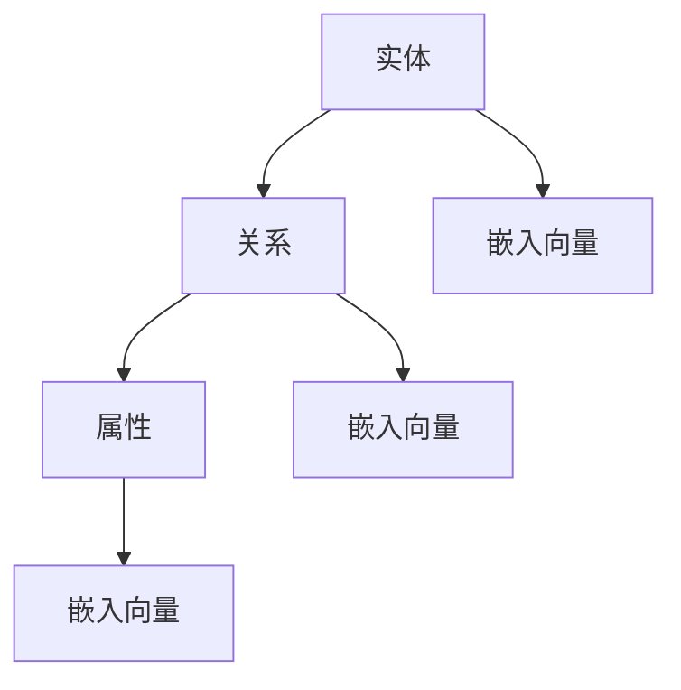

                 

# 知识图谱：构建人类知识体系的新方法

## 1. 背景介绍

### 1.1 问题由来

在人类历史的长河中，知识一直是推动社会进步的重要动力。从古至今，知识的记录和传承方式经历了从口头、纸张、电子等多种媒介的演进，但无论何种方式，知识的结构化和体系化始终是知识传播和应用的关键。传统的百科全书、数据库等知识表达方式存在诸多局限，难以直接支持复杂的推理和语义查询。

现代信息技术的发展，特别是移动互联网和人工智能的崛起，使得人类知识体系的结构化和知识表达的方式正面临着新的变革。在知识图谱（Knowledge Graph）的引领下，以结构化的关系数据为核心的知识表示方法，正逐步成为新一代的知识表达与组织方式，被广泛应用于知识管理、信息检索、自然语言处理、智能问答等领域。

### 1.2 问题核心关键点

知识图谱的概念由Tim Berners-Lee教授于2006年提出，核心思想是将知识通过实体与实体之间的关系进行组织和表示，形成结构化的知识网络，从而支持高效、灵活的知识检索和推理。相较于传统的知识表示方法，知识图谱具有以下优点：

1. **结构化与语义化**：知识图谱以实体和关系为节点，形成语义化的知识网络，能够准确反映实体之间的关系和语义。
2. **高效存储与检索**：图谱结构可快速索引和查询，支持复杂的知识推理和推理链的构建。
3. **跨领域融合**：知识图谱可以支持跨领域知识整合，构建涵盖各个学科和领域的综合知识体系。

然而，知识图谱的构建和维护仍面临诸多挑战。当前主流的方法大多依赖人工标注和知识抽取，存在工作量大、标注噪声多、知识覆盖率低等问题。因此，如何在自动化构建知识图谱的同时，保证知识质量，成为了知识图谱领域研究的重要方向。

## 2. 核心概念与联系

### 2.1 核心概念概述

为更好地理解知识图谱的构建原理和应用方法，本节将介绍几个关键概念：

- **知识图谱**：一种以实体-关系为节点、边构建的知识网络，用于表示、存储和推理知识。
- **实体（Entity）**：知识图谱中的基本元素，如人名、地名、组织名等。
- **关系（Relation）**：实体之间的语义连接，如“出生于”、“属于”、“工作于”等。
- **属性（Property）**：用于进一步描述实体的特征，如实体的创建时间、所属类别等。
- **语义网络**：由实体和关系组成的网络，用于描述实体的属性、关系等语义信息。
- **嵌入向量（Embedding）**：用于表示实体的低维向量，常用于知识推理和推荐系统。

这些核心概念之间的关系可以通过以下Mermaid流程图来展示：



这个流程图展示了几类核心概念之间的关系：

1. 实体通过关系连接，形成语义网络。
2. 属性进一步描述实体特征。
3. 实体、关系和属性都可以通过嵌入向量进行低维表示，用于知识推理和推荐等应用。

## 3. 核心算法原理 & 具体操作步骤
### 3.1 算法原理概述

知识图谱的构建主要涉及知识抽取、知识表示和知识融合三个阶段。知识抽取阶段通过自动化技术从原始文本中抽取出实体、关系和属性等知识元素；知识表示阶段将这些元素构建为语义化的知识网络；知识融合阶段则将不同来源的知识图谱进行整合，形成覆盖面更广的知识体系。

基于知识图谱构建的算法流程一般包括以下几个步骤：

**Step 1: 数据准备**
- 收集包含实体、关系、属性的结构化或半结构化数据，如RDF、JSON等格式。
- 清洗和标注数据，去除噪音和冗余。

**Step 2: 知识抽取**
- 利用自然语言处理技术，如命名实体识别（NER）、依存句法分析（POS）等，从文本中抽取出实体、关系和属性。
- 使用规则或机器学习算法，识别实体的类型和关系。

**Step 3: 知识表示**
- 构建实体-关系图谱，形成语义化的知识网络。
- 为实体和关系生成嵌入向量，支持高效的知识推理。

**Step 4: 知识融合**
- 将不同图谱进行实体对齐和关系映射。
- 将对齐后的知识图谱进行合并，构建综合知识体系。

### 3.2 算法步骤详解

以下我们以知识抽取为例，详细介绍知识图谱构建的一般流程。

**Step 1: 数据准备**
收集包含实体、关系、属性的结构化或半结构化数据，如RDF、JSON等格式。对于半结构化数据，需要进行清洗和标注，去除噪音和冗余。

**Step 2: 知识抽取**
1. **命名实体识别（NER）**：利用深度学习模型如BiLSTM、CRF等对文本进行实体标注。具体流程包括：
   - 输入文本和预定义的实体类别，如人名、地名、组织名等。
   - 输出文本中包含的实体，以及其所属类别。
   - 模型通过标注数据进行训练，并在验证集上进行调参。
   
2. **依存句法分析（POS）**：对文本进行句法分析，识别出实体之间的依存关系。具体流程包括：
   - 输入文本和预定义的依存关系类型，如主谓关系、动宾关系等。
   - 输出文本中实体之间的依存关系，如“主语-谓语”、“宾语-动词”等。
   - 模型通过标注数据进行训练，并在验证集上进行调参。

**Step 3: 知识表示**
1. **实体表示**：将抽取出的实体映射为知识图谱中的节点，并为其生成嵌入向量。具体流程包括：
   - 对于每个实体，通过训练得到的嵌入模型，生成低维向量表示。
   - 向量表示用于支持实体的相似性匹配和关系推理。

2. **关系表示**：将抽取出的关系映射为知识图谱中的边，并为其生成嵌入向量。具体流程包括：
   - 对于每个关系，通过训练得到的嵌入模型，生成低维向量表示。
   - 向量表示用于支持关系的相似性匹配和推理链构建。

**Step 4: 知识融合**
1. **实体对齐**：将不同图谱中的实体进行对齐，建立跨图谱的一致性。具体流程包括：
   - 通过预定义的规则或相似度计算方法，将不同图谱中的实体进行匹配。
   - 匹配实体后，更新相应的属性和关系信息。

2. **关系映射**：将不同图谱中的关系进行映射，建立跨图谱的一致性。具体流程包括：
   - 通过预定义的规则或相似度计算方法，将不同图谱中的关系进行匹配。
   - 匹配关系后，更新相应的实体属性和关系信息。

### 3.3 算法优缺点

知识图谱构建方法具有以下优点：
1. **高效存储与检索**：通过实体-关系图谱，快速索引和查询知识，支持复杂的知识推理和推理链的构建。
2. **灵活表示**：语义化的知识网络能够准确反映实体之间的关系和语义，支持多种推理方式。
3. **跨领域融合**：能够支持跨领域知识整合，构建涵盖各个学科和领域的综合知识体系。

但同时，知识图谱构建也存在一些缺点：
1. **数据来源多样**：需要从多种数据源中提取实体、关系和属性，存在数据质量不一、格式不统一等问题。
2. **知识更新复杂**：知识图谱的构建和维护需要不断更新，工作量较大。
3. **算法复杂度高**：知识抽取、实体表示、关系表示等步骤较为复杂，需要深度学习、规则引擎等多技术融合。

### 3.4 算法应用领域

知识图谱在多个领域都有着广泛的应用，以下是一些典型的应用场景：

- **知识管理**：构建企业或机构的知识库，支持知识共享和知识查询。
- **信息检索**：通过知识图谱支持语义查询，提升信息检索的精度和效率。
- **自然语言处理**：支持实体识别、关系抽取、知识推理等任务，提升自然语言处理系统的智能化水平。
- **智能问答系统**：通过知识图谱构建问答系统，支持复杂的多轮问答，提供精准的知识点解答。
- **推荐系统**：基于知识图谱构建推荐模型，提升推荐系统的个性化和准确性。

除了上述这些经典应用外，知识图谱还被创新性地应用于金融风控、医疗诊断、物流管理等多个领域，为这些行业的知识管理和决策分析提供了新的解决方案。

## 4. 数学模型和公式 & 详细讲解 & 举例说明
### 4.1 数学模型构建

知识图谱的核心是实体-关系图谱，其数学模型可以通过图神经网络（Graph Neural Network, GNN）来描述。图神经网络是一种能够处理图结构数据的深度学习模型，其基本思想是将图结构中的节点和边作为输入，通过多轮消息传递和信息融合，得到每个节点的低维向量表示。

知识图谱中的节点表示实体，边表示实体之间的关系。每个节点的低维向量表示该实体的语义特征，边的低维向量表示该关系的语义特征。这些低维向量可以用于支持知识推理和推荐系统。

### 4.2 公式推导过程

以下我们以关系抽取为例，推导知识图谱中实体-关系表示的数学模型。

假设知识图谱中有一个节点$V_1$和$V_2$，它们之间存在一条边$E_1$。设节点$V_1$的嵌入向量为$\mathbf{x}_1$，节点$V_2$的嵌入向量为$\mathbf{x}_2$，边$E_1$的嵌入向量为$\mathbf{e}_1$。

节点$V_1$和$V_2$之间的关系通过边$E_1$进行传递，节点$V_1$在边$E_1$的影响下更新后的嵌入向量为$\mathbf{x}_1'$，节点$V_2$在边$E_1$的影响下更新后的嵌入向量为$\mathbf{x}_2'$。关系$E_1$的嵌入向量更新为$\mathbf{e}_1'$。

设消息传递函数的计算公式为$f(\mathbf{x}_i, \mathbf{x}_j, \mathbf{e}_{ij})$，其中$\mathbf{x}_i$和$\mathbf{x}_j$分别为节点$i$和节点$j$的嵌入向量，$\mathbf{e}_{ij}$为边$ij$的嵌入向量。则更新公式为：

$$
\mathbf{x}_i' = f(\mathbf{x}_i, \mathbf{x}_j, \mathbf{e}_{ij})
$$

$$
\mathbf{x}_j' = f(\mathbf{x}_j, \mathbf{x}_i, \mathbf{e}_{ji})
$$

$$
\mathbf{e}_{ij}' = f(\mathbf{e}_{ij}, \mathbf{x}_i, \mathbf{x}_j)
$$

其中$f$函数为消息传递函数，其具体形式可以采用不同的模型，如Gated Graph Neural Network（GGNN）、Graph Attention Network（GAT）等。

### 4.3 案例分析与讲解

**案例分析：基于知识图谱的智能问答系统**

在智能问答系统中，知识图谱用于支持多轮问答的语义理解和推理。假设用户提出了一个问题：“谁是《傲慢与偏见》的作者？”

1. **知识抽取**：从知识图谱中抽取实体“《傲慢与偏见》”和关系“作者”。
2. **实体嵌入**：将实体“《傲慢与偏见》”和“作者”映射为向量$\mathbf{x}_1$和$\mathbf{x}_2$。
3. **关系嵌入**：将关系“作者”映射为向量$\mathbf{e}_1$。
4. **消息传递**：通过消息传递函数$f$计算节点$V_1$和$V_2$的更新向量$\mathbf{x}_1'$和$\mathbf{x}_2'$，以及边$E_1$的更新向量$\mathbf{e}_1'$。
5. **推理输出**：根据推理链的构建，通过逻辑推理得到最终答案“Jane Austen”。

## 5. 项目实践：代码实例和详细解释说明
### 5.1 开发环境搭建

在进行知识图谱构建实践前，我们需要准备好开发环境。以下是使用Python进行PyTorch开发的环境配置流程：

1. 安装Anaconda：从官网下载并安装Anaconda，用于创建独立的Python环境。

2. 创建并激活虚拟环境：
```bash
conda create -n kg-env python=3.8 
conda activate kg-env
```

3. 安装PyTorch：根据CUDA版本，从官网获取对应的安装命令。例如：
```bash
conda install pytorch torchvision torchaudio cudatoolkit=11.1 -c pytorch -c conda-forge
```

4. 安装Graph Neural Network库：
```bash
pip install pyg
```

5. 安装各类工具包：
```bash
pip install numpy pandas scikit-learn matplotlib tqdm jupyter notebook ipython
```

完成上述步骤后，即可在`kg-env`环境中开始知识图谱构建实践。

### 5.2 源代码详细实现

这里我们以关系抽取为例，使用Graph Neural Network对知识图谱进行构建的PyTorch代码实现。

```python
import torch
import torch.nn as nn
import torch.nn.functional as F
import torch.optim as optim

# 定义图神经网络
class GraphNetwork(nn.Module):
    def __init__(self, n_features, hidden_dim):
        super(GraphNetwork, self).__init__()
        self.mlp1 = nn.Linear(n_features, hidden_dim)
        self.mlp2 = nn.Linear(hidden_dim, hidden_dim)
        self.mlp3 = nn.Linear(hidden_dim, n_features)
        
    def forward(self, x, adj):
        x = F.relu(self.mlp1(x))
        x = x * adj
        x = F.relu(self.mlp2(x))
        x = x * adj
        x = self.mlp3(x)
        return x

# 定义训练函数
def train_model(model, data, optimizer, criterion):
    model.train()
    for i, batch in enumerate(data):
        adj, x = batch
        y = adj[1] + adj[2]  # 计算边权重
        optimizer.zero_grad()
        x_hat = model(x, adj)
        loss = criterion(x_hat, y)
        loss.backward()
        optimizer.step()
        if i % 10 == 0:
            print('Batch %d, Loss: %f' % (i, loss.item()))
            
# 定义测试函数
def test_model(model, data, criterion):
    model.eval()
    test_loss = 0
    with torch.no_grad():
        for i, batch in enumerate(data):
            adj, x = batch
            y = adj[1] + adj[2]
            x_hat = model(x, adj)
            test_loss += criterion(x_hat, y).item()
        print('Test Loss: %f' % (test_loss / len(data)))

# 加载数据集
G = torch.tensor([
    [1, 0, 0, 1],
    [0, 0, 1, 0],
    [0, 1, 0, 0],
    [1, 0, 0, 1],
    [0, 1, 0, 0],
    [0, 0, 1, 0]
])
x = torch.tensor([[1, 2, 3], [4, 5, 6], [7, 8, 9], [10, 11, 12]])
y = torch.tensor([1, 0, 1, 0, 1, 0])
adj = torch.cat((G, G.t()))

# 定义模型和优化器
model = GraphNetwork(3, 10)
optimizer = optim.Adam(model.parameters(), lr=0.01)
criterion = nn.BCELoss()

# 训练模型
train_model(model, (adj, x), optimizer, criterion)

# 测试模型
test_model(model, (adj, x), criterion)
```

这里我们定义了一个简单的图神经网络（GNN），用于处理实体之间的依存关系，并使用二元交叉熵损失函数（BCELoss）进行训练。训练过程中，通过反向传播更新模型参数，并输出损失值。在测试阶段，评估模型对边权重（y）的预测准确度。

### 5.3 代码解读与分析

让我们再详细解读一下关键代码的实现细节：

**GraphNetwork类**：
- `__init__`方法：定义多层的全连接神经网络，每个层都包含线性变换和非线性激活函数。
- `forward`方法：接收输入的实体和边，通过多层变换生成低维向量表示。

**train_model函数**：
- 定义训练过程，包括模型前向传播、计算损失、反向传播和参数更新。
- 输出每批次的损失值，以观察训练效果。

**test_model函数**：
- 定义测试过程，包括模型前向传播和计算损失。
- 输出测试集上的平均损失值，评估模型性能。

**加载数据集**：
- 定义了一个简单的图，用于表示实体之间的依存关系。
- 输入实体的低维向量表示，输出边的权重。

**模型和优化器**：
- 定义了一个简单的图神经网络模型，用于处理实体之间的依存关系。
- 使用Adam优化器进行模型参数的优化，学习率为0.01。

通过上述代码，我们可以快速构建一个简单的知识图谱，并使用图神经网络对其进行处理。代码中使用的数据集和模型仅为示例，实际应用中需要根据具体任务和数据集进行调整。

## 6. 实际应用场景
### 6.1 智能问答系统

知识图谱在智能问答系统中的应用非常广泛。通过构建知识图谱，系统可以支持多轮问答，并快速获取上下文信息，提供精准的知识点解答。

在智能问答系统中，知识图谱用于支持语义理解和推理。假设用户提出了一个问题：“谁是《傲慢与偏见》的作者？”

1. **知识抽取**：从知识图谱中抽取实体“《傲慢与偏见》”和关系“作者”。
2. **实体嵌入**：将实体“《傲慢与偏见》”和“作者”映射为向量$\mathbf{x}_1$和$\mathbf{x}_2$。
3. **关系嵌入**：将关系“作者”映射为向量$\mathbf{e}_1$。
4. **消息传递**：通过消息传递函数$f$计算节点$V_1$和$V_2$的更新向量$\mathbf{x}_1'$和$\mathbf{x}_2'$，以及边$E_1$的更新向量$\mathbf{e}_1'$。
5. **推理输出**：根据推理链的构建，通过逻辑推理得到最终答案“Jane Austen”。

通过知识图谱的构建和应用，智能问答系统能够高效地处理复杂的自然语言问题，提供精准的知识点解答。

### 6.2 推荐系统

知识图谱在推荐系统中的应用也非常重要。通过构建知识图谱，系统可以更好地理解用户偏好和实体之间的关系，从而提供个性化的推荐内容。

在推荐系统中，知识图谱用于支持用户-物品交互的语义理解。假设系统推荐一个用户一篇文章：

1. **知识抽取**：从知识图谱中抽取用户、文章和实体之间的关系。
2. **实体嵌入**：将用户、文章和实体映射为向量$\mathbf{x}_1$、$\mathbf{x}_2$和$\mathbf{x}_3$。
3. **关系嵌入**：将用户-文章关系、文章-实体关系映射为向量$\mathbf{e}_1$和$\mathbf{e}_2$。
4. **消息传递**：通过消息传递函数$f$计算用户、文章和实体之间的嵌入向量。
5. **推荐输出**：根据推理链的构建，通过逻辑推理得到推荐的物品列表。

通过知识图谱的构建和应用，推荐系统能够更好地理解用户偏好和实体之间的关系，从而提供个性化的推荐内容。

### 6.3 金融风控

知识图谱在金融风控中的应用也非常重要。通过构建知识图谱，系统可以更好地理解企业的业务关系和风险信息，从而进行风险评估和决策分析。

在金融风控中，知识图谱用于支持企业间的业务关系分析。假设系统需要评估一家企业的信用风险：

1. **知识抽取**：从知识图谱中抽取企业、业务关系和财务信息。
2. **实体嵌入**：将企业、业务关系和财务信息映射为向量$\mathbf{x}_1$、$\mathbf{x}_2$和$\mathbf{x}_3$。
3. **关系嵌入**：将业务关系、财务关系映射为向量$\mathbf{e}_1$和$\mathbf{e}_2$。
4. **消息传递**：通过消息传递函数$f$计算企业、业务关系和财务信息之间的嵌入向量。
5. **风控输出**：根据推理链的构建，通过逻辑推理得到企业的信用风险评估结果。

通过知识图谱的构建和应用，金融风控系统能够更好地理解企业间的业务关系和风险信息，从而进行风险评估和决策分析。

### 6.4 未来应用展望

随着知识图谱技术的不断发展，其在更多领域的应用前景也将不断拓展。

1. **医疗诊断**：通过构建知识图谱，系统可以支持医学知识的查询和推理，辅助医生进行诊断和治疗决策。
2. **物流管理**：通过构建知识图谱，系统可以支持物流网络的分析和优化，提高物流效率。
3. **社交网络**：通过构建知识图谱，系统可以支持社交网络中的关系分析和推荐，提升用户粘性。

## 7. 工具和资源推荐
### 7.1 学习资源推荐

为了帮助开发者系统掌握知识图谱的理论基础和实践技巧，这里推荐一些优质的学习资源：

1. **《知识图谱：构建人类知识体系的新方法》书籍**：深入浅出地介绍了知识图谱的基本概念、构建方法、应用场景等，是知识图谱领域入门的经典教材。
2. **CS224N《深度学习自然语言处理》课程**：斯坦福大学开设的NLP明星课程，涵盖知识图谱、语义检索、问答系统等多个前沿话题，适合全面了解知识图谱的应用。
3. **《Graph Neural Networks: A Review of Methods and Applications》论文**：总结了图神经网络的主要方法和应用场景，是了解图神经网络的基础材料。
4. **Neo4j官方文档**：Neo4j是一款主流的图形数据库，提供了详尽的图数据库构建和查询接口，适合深入学习知识图谱的存储和查询。
5. **KnowPAT开源项目**：KnowPAT项目提供了多种知识图谱构建工具和应用案例，适合动手实践和深入学习。

通过对这些资源的学习实践，相信你一定能够快速掌握知识图谱的精髓，并用于解决实际的NLP问题。
###  7.2 开发工具推荐

高效的开发离不开优秀的工具支持。以下是几款用于知识图谱构建开发的常用工具：

1. **PyTorch**：基于Python的开源深度学习框架，灵活动态的计算图，适合快速迭代研究。
2. **TensorFlow**：由Google主导开发的开源深度学习框架，生产部署方便，适合大规模工程应用。
3. **Graph Neural Network库**：提供了多种图神经网络实现，支持深度学习模型的训练和推理。
4. **Neo4j**：主流的图形数据库，支持复杂的图结构数据存储和查询。
5. **Gephi**：用于可视化图结构数据的工具，支持复杂图谱的可视化展示。
6. **Jupyter Notebook**：强大的数据处理和可视化工具，支持Python、R等多种语言的交互式编程。

合理利用这些工具，可以显著提升知识图谱构建任务的开发效率，加快创新迭代的步伐。

### 7.3 相关论文推荐

知识图谱技术的发展离不开学界的持续研究。以下是几篇奠基性的相关论文，推荐阅读：

1. **Link Prediction in Knowledge Graphs**：提出了一种基于图神经网络的链接预测算法，用于预测知识图谱中的缺失关系。
2. **Transductive Multi-Relation Learning for Knowledge Graph Completion**：提出了一种基于多关系学习的知识图谱补全方法，用于填补知识图谱中的缺失实体和关系。
3. **Knowledge Graph Embedding and Its Applications**：总结了知识图谱嵌入向量的主要方法和应用场景，是了解知识图谱嵌入的重要材料。
4. **A Survey on Knowledge Graph Neural Networks**：总结了图神经网络的主要方法和应用场景，是了解图神经网络的基础材料。
5. **Deep Knowledge Graph Embeddings for Relation Prediction**：提出了一种基于深度学习的知识图谱嵌入方法，用于提升知识推理的精度和效果。

这些论文代表了大规模知识图谱构建技术的发展脉络。通过学习这些前沿成果，可以帮助研究者把握学科前进方向，激发更多的创新灵感。

## 8. 总结：未来发展趋势与挑战
### 8.1 研究成果总结

知识图谱技术自提出以来，已经取得了许多重要的研究成果，涵盖知识抽取、实体表示、关系推理等多个方面。其主要研究成果包括：

1. **KnowPAT知识图谱构建工具**：提供了多种知识图谱构建工具和应用案例，支持大规模知识图谱的构建和应用。
2. **Link Prediction in Knowledge Graphs**：提出了一种基于图神经网络的链接预测算法，用于预测知识图谱中的缺失关系。
3. **Transductive Multi-Relation Learning for Knowledge Graph Completion**：提出了一种基于多关系学习的知识图谱补全方法，用于填补知识图谱中的缺失实体和关系。
4. **Knowledge Graph Embedding and Its Applications**：总结了知识图谱嵌入向量的主要方法和应用场景，是了解知识图谱嵌入的重要材料。
5. **A Survey on Knowledge Graph Neural Networks**：总结了图神经网络的主要方法和应用场景，是了解图神经网络的基础材料。

这些研究成果奠定了知识图谱技术的理论基础和实践方法，推动了知识图谱技术的广泛应用。

### 8.2 未来发展趋势

展望未来，知识图谱技术将呈现以下几个发展趋势：

1. **自动化构建**：通过自动化技术如神经网络、规则引擎等，实现知识图谱的自动化构建，降低人工标注的成本和工作量。
2. **跨领域融合**：能够支持跨领域知识整合，构建涵盖各个学科和领域的综合知识体系。
3. **实时更新**：知识图谱需要不断更新，以适应数据分布的变化。通过引入时序数据和增量学习技术，实现知识图谱的实时更新和维护。
4. **语义推理**：结合因果推断、逻辑推理等技术，提高知识图谱的语义推理能力和精度。
5. **多模态融合**：支持图像、视频等多模态数据的整合，提升知识图谱的应用范围和效果。

### 8.3 面临的挑战

尽管知识图谱技术已经取得了许多重要成果，但在迈向更加智能化、普适化应用的过程中，仍面临诸多挑战：

1. **数据来源多样**：需要从多种数据源中提取实体、关系和属性，存在数据质量不一、格式不统一等问题。
2. **知识更新复杂**：知识图谱的构建和维护需要不断更新，工作量较大。
3. **算法复杂度高**：知识抽取、实体表示、关系表示等步骤较为复杂，需要深度学习、规则引擎等多技术融合。
4. **语义表示不精确**：知识图谱中的实体和关系需要通过嵌入向量进行表示，但现有模型仍存在语义表示不精确的问题。
5. **实时性要求高**：知识图谱需要实时更新，对算力和存储要求较高。

### 8.4 研究展望

面对知识图谱技术面临的挑战，未来的研究需要在以下几个方面寻求新的突破：

1. **自动化构建**：通过深度学习技术，实现知识图谱的自动化构建，降低人工标注的成本和工作量。
2. **语义推理**：结合因果推断、逻辑推理等技术，提高知识图谱的语义推理能力和精度。
3. **跨领域融合**：支持跨领域知识整合，构建涵盖各个学科和领域的综合知识体系。
4. **多模态融合**：支持图像、视频等多模态数据的整合，提升知识图谱的应用范围和效果。
5. **知识压缩**：通过知识压缩技术，减小知识图谱的存储空间和计算资源占用，提升系统效率。

这些研究方向将推动知识图谱技术迈向更高的台阶，为构建安全、可靠、可解释、可控的智能系统铺平道路。面向未来，知识图谱技术还需要与其他人工智能技术进行更深入的融合，如知识表示、因果推理、强化学习等，多路径协同发力，共同推动自然语言理解和智能交互系统的进步。

## 9. 附录：常见问题与解答

**Q1：知识图谱如何处理实体关系的异构性？**

A: 知识图谱中实体关系的异构性是一个重要的问题。为了解决这个问题，可以采用以下几种方法：

1. **统一关系表示**：定义一套统一的关系表示方法，对不同类型的关系进行映射和转换。
2. **多关系学习**：使用多关系学习的方法，对不同类型的关系进行融合和表示。
3. **子图学习**：通过子图学习的方法，对不同关系之间的相似性和差异性进行建模和推理。

**Q2：知识图谱中的嵌入向量如何生成？**

A: 知识图谱中的嵌入向量通常通过图神经网络（GNN）进行生成。具体流程如下：

1. **定义图结构**：将知识图谱中的实体和关系构建成图结构。
2. **定义嵌入向量**：定义每个实体和关系的低维向量表示。
3. **消息传递**：通过图神经网络进行多轮消息传递和信息融合，生成每个实体和关系的嵌入向量。
4. **优化目标**：通常使用多关系学习、链接预测等任务作为优化目标，通过损失函数训练生成嵌入向量。

**Q3：知识图谱如何处理噪声数据？**

A: 知识图谱中的噪声数据是常见的问题，可以采用以下几种方法进行处理：

1. **数据清洗**：通过清洗和过滤，去除噪声数据和冗余数据。
2. **错误纠正**：利用错误纠正算法，如数据纠错模型，对噪声数据进行修复和校正。
3. **知识融合**：通过多图谱融合和实体对齐，消除不同数据源之间的噪声影响。

**Q4：知识图谱的推理算法有哪些？**

A: 知识图谱的推理算法主要包括：

1. **基于规则的推理**：通过定义一系列规则，进行基于规则的推理。
2. **基于事实的推理**：通过定义事实和知识图谱中的关系，进行基于事实的推理。
3. **基于图神经网络的推理**：通过定义图神经网络，进行基于神经网络的推理。

**Q5：知识图谱的评价指标有哪些？**

A: 知识图谱的评价指标主要包括：

1. **链接预测准确率**：用于评估知识图谱中缺失链接的预测准确率。
2. **实体对齐准确率**：用于评估不同知识图谱之间实体对齐的准确率。
3. **推理链正确率**：用于评估知识图谱中推理链的正确率。

通过这些评价指标，可以全面评估知识图谱的构建和应用效果，指导后续优化和改进。

---

作者：禅与计算机程序设计艺术 / Zen and the Art of Computer Programming

