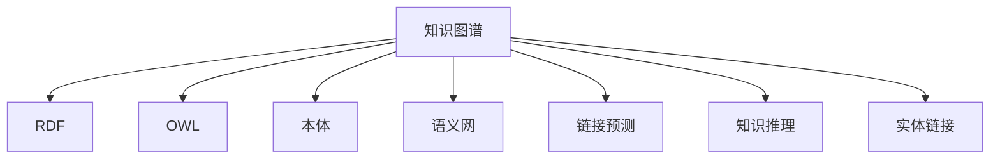

                 

# 知识图谱：构建和应用结构化知识库

## 1. 背景介绍

### 1.1 问题由来
在当前信息爆炸的时代，如何有效地组织和利用海量数据，成为了摆在科研和产业面前的重要课题。传统的关系型数据库和搜索引擎，虽然能有效管理结构化数据，但对于半结构化数据、无结构化文本和非结构化信息，如Web网页、文档、图像等，则显得力不从心。

为解决这一问题，学术界和工业界引入了知识图谱(Knowledge Graphs)的概念和技术。知识图谱旨在通过结构化数据的方式，对真实世界实体和它们之间的关系进行描述，从而构建一个能自动推理和关联的语义知识网络，辅助人类理解和决策。

### 1.2 问题核心关键点
知识图谱的核心思想是将知识表示为图形结构，每个节点表示一个实体(如人名、地名、产品等)，边表示实体之间的某种关系(如属于、类似、关联等)。通过构建知识图谱，可以为人工智能系统提供丰富的语义信息，辅助其完成更智能的查询、推理和决策。

知识图谱的应用范围非常广泛，涵盖了医疗、金融、教育、城市管理等多个领域。通过知识图谱，可以显著提升信息检索的精准度，加速知识发现和创新，提升决策支持的能力。

## 2. 核心概念与联系

### 2.1 核心概念概述

为更好地理解知识图谱的构建和应用，本节将介绍几个密切相关的核心概念：

- 知识图谱(Knowledge Graph)：通过结构化数据的方式，对实体和它们之间的关系进行描述，形成知识网络。
- RDF（Resource Description Framework）：用于表示语义网络的三元组格式，由资源、属性和值构成。
- OWL（Web Ontology Language）：用于定义本体模型的语言，描述实体之间的关系和属性。
- 本体(Ontology)：对现实世界知识进行形式化描述的框架，包括类别、属性、关系等概念。
- 语义网(Semantic Web)：基于Web的标准和协议，实现Web内容的语义化描述和自动化推理。
- 链接预测(Link Prediction)：利用机器学习模型，预测未知实体之间的关联关系，是知识图谱的重要应用之一。
- 知识推理(Knowledge Reasoning)：通过逻辑推理机制，利用已有知识库进行知识发现和智能决策。
- 实体链接(Entity Linking)：通过文本分析和信息抽取技术，将未结构化文本信息映射到知识图谱中的实体。

这些核心概念之间的逻辑关系可以通过以下Mermaid流程图来展示：



这个流程图展示的知识图谱的核心概念及其之间的关系：

1. 知识图谱以RDF、OWL等形式表示本体，描述实体和关系。
2. 本体定义了实体和属性之间的关系，并使用语义网协议进行互联。
3. 链接预测模型通过机器学习预测实体间的未知关系。
4. 知识推理引擎利用已有知识进行逻辑推理，发现新知识。
5. 实体链接技术将文本信息映射到知识图谱，完成信息抽取和实体消歧。

这些核心概念共同构成了知识图谱的知识表示和应用框架，使其能够支持各类智能应用，如问答系统、推荐系统、搜索引擎等。

## 3. 核心算法原理 & 具体操作步骤

### 3.1 算法原理概述

知识图谱的构建和应用涉及多个领域的知识表示、推理和抽取技术。其核心算法原理包括以下几个部分：

- 本体建模：定义实体、属性和关系的本体模型，为知识图谱提供语义框架。
- 数据获取：通过网络爬虫、API接口、数据存储等方式获取外部数据，构成知识图谱的初始数据集。
- 实体链接：对非结构化数据进行信息抽取和实体消歧，将文本信息映射到知识图谱中的实体。
- 关系抽取：通过关系抽取算法，从结构化数据中提取出实体之间的关系。
- 实体嵌入：使用神经网络等方法，将实体和关系进行向量表示，便于后续的推理和查询。
- 知识推理：通过逻辑推理算法，如规则推理、神经推理等，利用已有知识进行推理和预测。
- 链接预测：利用机器学习模型，预测未知实体之间的关系，如神经网络、图神经网络等。
- 查询优化：对查询语句进行语义分析和优化，提高查询效率。

知识图谱的构建和应用，涉及多个领域的知识表示、推理和抽取技术。其核心算法原理包括以下几个部分：

### 3.2 算法步骤详解

基于知识图谱的构建和应用，主要分为以下几个步骤：

**Step 1: 本体建模**
- 定义知识图谱的实体和属性，建立本体模型。
- 使用OWL等描述语言定义实体之间的关系和约束。
- 设计好本体模型后，使用本体编辑工具进行可视化设计和验证。

**Step 2: 数据获取**
- 使用网络爬虫抓取Web数据，如维基百科、百度百科等。
- 通过API接口获取结构化数据，如Yahoo Finance、Amazon等。
- 对PDF、Word等文档进行文本抽取和结构化处理。

**Step 3: 实体链接**
- 使用信息抽取技术，从非结构化文本中提取实体名称。
- 对提取的实体进行消歧，确定实体对应的唯一标识。
- 使用词向量或语义相似度算法，计算实体之间的相似度，进行实体链接。

**Step 4: 关系抽取**
- 使用基于规则或机器学习的方法，从结构化数据中抽取实体之间的关系。
- 使用命名实体识别(NER)、关系抽取(RE)等算法，从文本中提取出实体和关系。
- 将抽取的关系转换为RDF三元组，存储到知识图谱中。

**Step 5: 实体嵌入**
- 使用词嵌入模型，如Word2Vec、GloVe等，将实体和关系进行向量表示。
- 使用神经网络模型，如BERT、GNN等，将实体和关系映射到低维向量空间。
- 使用TransE、RotatE等框架，进行实体的嵌入和嵌入优化。

**Step 6: 知识推理**
- 使用规则推理器，如Protege、OWL-RL等，进行基本的逻辑推理。
- 使用神经推理模型，如NNF、NeST等，进行复杂的推理和预测。
- 使用Wikidata Query Service、Spotlight等外部推理服务，进行高级推理。

**Step 7: 链接预测**
- 使用基于图神经网络(GNN)的模型，预测实体之间的关系。
- 使用基于深度学习的方法，如GCN、GAT等，预测未知的关系。
- 使用关系图预测算法，如Cascading Classifier、TransE等，进行精确的预测。

**Step 8: 查询优化**
- 使用自然语言处理技术，解析用户查询语句。
- 使用查询重写和优化技术，提高查询效率。
- 使用分布式查询引擎，提高查询性能。

### 3.3 算法优缺点

知识图谱的构建和应用，具有以下优点：
1. 知识表示清晰：知识图谱采用结构化方式表示知识，便于理解和推理。
2. 语义丰富：知识图谱支持基于语义的查询和推理，提升信息检索的准确度。
3. 自动化程度高：自动化提取、抽取和推理过程，减少人工干预。
4. 灵活性高：适用于多种数据源和应用场景，具有较高的通用性。

同时，知识图谱也存在一定的局限性：
1. 数据获取难度大：构建知识图谱需要大量高质量的数据，获取成本较高。
2. 知识更新慢：现有知识图谱更新频率较低，难以实时反映最新的知识和趋势。
3. 质量控制困难：知识图谱的质量控制和验证需要专业知识和经验。
4. 推理难度高：复杂的推理过程需要高级算法和计算资源支持。

尽管存在这些局限性，但知识图谱在构建语义化知识库、提升智能决策能力方面的潜力巨大，被广泛应用于多个领域。

### 3.4 算法应用领域

知识图谱在多个领域得到了广泛的应用，涵盖以下核心场景：

- **医疗健康**：通过构建医疗知识图谱，辅助临床决策，提升医疗服务质量。
- **金融风控**：利用金融知识图谱，进行信用评估、风险预警等应用。
- **教育培训**：使用教育知识图谱，优化教学资源，提升教育质量。
- **城市治理**：在智慧城市中，利用城市知识图谱进行交通管理、环境监测等。
- **电子商务**：通过产品知识图谱，进行商品推荐、价格预测等应用。

此外，知识图谱还被应用于知识管理、安全监控、环境保护等多个领域，为各行各业提供了高效的知识管理和智能决策支持。

## 4. 数学模型和公式 & 详细讲解  
### 4.1 数学模型构建

知识图谱的构建和应用涉及多个领域的知识表示、推理和抽取技术。其核心算法原理包括以下几个部分：

- 本体建模：定义实体、属性和关系的本体模型，为知识图谱提供语义框架。
- 数据获取：通过网络爬虫、API接口、数据存储等方式获取外部数据，构成知识图谱的初始数据集。
- 实体链接：对非结构化数据进行信息抽取和实体消歧，将文本信息映射到知识图谱中的实体。
- 关系抽取：通过关系抽取算法，从结构化数据中提取出实体之间的关系。
- 实体嵌入：使用神经网络等方法，将实体和关系进行向量表示，便于后续的推理和查询。
- 知识推理：通过逻辑推理算法，如规则推理、神经推理等，利用已有知识进行推理和预测。
- 链接预测：利用机器学习模型，预测未知实体之间的关系，如神经网络、图神经网络等。
- 查询优化：对查询语句进行语义分析和优化，提高查询效率。

知识图谱的构建和应用，涉及多个领域的知识表示、推理和抽取技术。其核心算法原理包括以下几个部分：

### 4.2 公式推导过程

以下我们以关系抽取为例，推导基于深度学习的关系抽取模型。

关系抽取任务是将给定的实体-实体对映射到预定义的关系类别。假设给定关系空间为 $\mathcal{R}$，实体嵌入矩阵为 $E \in \mathbb{R}^{N \times D}$，其中 $N$ 为实体数量，$D$ 为嵌入维度。对于给定的两个实体 $e_i, e_j$，其向量表示分别为 $e_i \in \mathbb{R}^D$ 和 $e_j \in \mathbb{R}^D$。

定义关系 $r$ 对应的权重矩阵 $W_r \in \mathbb{R}^{D \times D}$，将 $e_i$ 和 $e_j$ 进行向量运算，计算两个实体之间的相似度 $s_{ij}$：

$$
s_{ij} = \text{softmax}(e_iW_r^T e_j)
$$

利用softmax函数将相似度映射到关系空间，得到每个关系类别的概率分布：

$$
\text{Pr}(r|e_i, e_j) = \text{softmax}(e_iW_r^T e_j)
$$

从而可以得到两个实体之间的最佳关系预测：

$$
\hat{r} = \arg\max_{r \in \mathcal{R}} \text{Pr}(r|e_i, e_j)
$$

这一过程可以通过神经网络模型实现，如基于卷积神经网络(CNN)、循环神经网络(RNN)、图神经网络(GNN)等，进行端到端的关系抽取。

### 4.3 案例分析与讲解

以医疗知识图谱为例，分析其构建和应用的具体过程。

**构建医疗知识图谱**

1. **本体建模**：定义医疗领域的实体和属性，如患者、疾病、治疗等。
2. **数据获取**：从医疗数据库、电子病历、研究论文中获取数据，构建初始数据集。
3. **实体链接**：使用自然语言处理技术，对电子病历等文本数据进行实体抽取和消歧，将文本信息映射到知识图谱中的实体。
4. **关系抽取**：从电子病历中抽取患者与疾病、治疗的关系，利用规则或深度学习方法，完成关系抽取。
5. **实体嵌入**：使用Word2Vec等模型，对实体和关系进行向量表示。
6. **知识推理**：利用规则推理器或神经推理模型，对已有知识进行推理，预测新的治疗方案和诊断结果。
7. **链接预测**：通过图神经网络等模型，预测未知的治疗关系和疾病关系，提升医疗服务的精准度。

**应用医疗知识图谱**

1. **辅助诊断**：医生通过输入病人的症状和历史数据，系统利用知识图谱进行推理，提供可能的疾病诊断和治疗方案。
2. **药物推荐**：根据病人的病情和治疗历史，推荐最适合的药物和治疗方案，提升治疗效果。
3. **病案管理**：利用知识图谱进行病案信息的存储和管理，提高医疗数据的管理效率。
4. **医疗研究**：通过知识图谱进行疾病研究，发现新的治疗方法和药物，提升科研水平。

## 5. 项目实践：代码实例和详细解释说明
### 5.1 开发环境搭建

在进行知识图谱开发前，我们需要准备好开发环境。以下是使用Python进行PyTorch开发的环境配置流程：

1. 安装Anaconda：从官网下载并安装Anaconda，用于创建独立的Python环境。

2. 创建并激活虚拟环境：
```bash
conda create -n kg-env python=3.8 
conda activate kg-env
```

3. 安装PyTorch：根据CUDA版本，从官网获取对应的安装命令。例如：
```bash
conda install pytorch torchvision torchaudio cudatoolkit=11.1 -c pytorch -c conda-forge
```

4. 安装各类工具包：
```bash
pip install numpy pandas scikit-learn matplotlib tqdm jupyter notebook ipython
```

完成上述步骤后，即可在`kg-env`环境中开始知识图谱的开发实践。

### 5.2 源代码详细实现

下面我们以关系抽取任务为例，给出使用Transformers库对BERT模型进行关系抽取的PyTorch代码实现。

首先，定义关系抽取任务的数据处理函数：

```python
from transformers import BertTokenizer, BertForRelationExtraction
from torch.utils.data import Dataset
import torch

class RelationExtractionDataset(Dataset):
    def __init__(self, texts, relations, tokenizer, max_len=128):
        self.texts = texts
        self.relations = relations
        self.tokenizer = tokenizer
        self.max_len = max_len
        
    def __len__(self):
        return len(self.texts)
    
    def __getitem__(self, item):
        text = self.texts[item]
        relation = self.relations[item]
        
        encoding = self.tokenizer(text, return_tensors='pt', max_length=self.max_len, padding='max_length', truncation=True)
        input_ids = encoding['input_ids'][0]
        attention_mask = encoding['attention_mask'][0]
        
        # 对relation进行编码
        encoded_relation = [relation2id[relation] for relation in relations] 
        encoded_relation.extend([relation2id['None']] * (self.max_len - len(encoded_relation)))
        labels = torch.tensor(encoded_relation, dtype=torch.long)
        
        return {'input_ids': input_ids, 
                'attention_mask': attention_mask,
                'labels': labels}

# 关系与id的映射
relation2id = {'None': 0, 'r1': 1, 'r2': 2, 'r3': 3, 'r4': 4}
id2relation = {v: k for k, v in relation2id.items()}

# 创建dataset
tokenizer = BertTokenizer.from_pretrained('bert-base-cased')

train_dataset = RelationExtractionDataset(train_texts, train_relations, tokenizer)
dev_dataset = RelationExtractionDataset(dev_texts, dev_relations, tokenizer)
test_dataset = RelationExtractionDataset(test_texts, test_relations, tokenizer)
```

然后，定义模型和优化器：

```python
from transformers import BertForRelationExtraction, AdamW

model = BertForRelationExtraction.from_pretrained('bert-base-cased', num_labels=len(relation2id))

optimizer = AdamW(model.parameters(), lr=2e-5)
```

接着，定义训练和评估函数：

```python
from torch.utils.data import DataLoader
from tqdm import tqdm
from sklearn.metrics import classification_report

device = torch.device('cuda') if torch.cuda.is_available() else torch.device('cpu')
model.to(device)

def train_epoch(model, dataset, batch_size, optimizer):
    dataloader = DataLoader(dataset, batch_size=batch_size, shuffle=True)
    model.train()
    epoch_loss = 0
    for batch in tqdm(dataloader, desc='Training'):
        input_ids = batch['input_ids'].to(device)
        attention_mask = batch['attention_mask'].to(device)
        labels = batch['labels'].to(device)
        model.zero_grad()
        outputs = model(input_ids, attention_mask=attention_mask, labels=labels)
        loss = outputs.loss
        epoch_loss += loss.item()
        loss.backward()
        optimizer.step()
    return epoch_loss / len(dataloader)

def evaluate(model, dataset, batch_size):
    dataloader = DataLoader(dataset, batch_size=batch_size)
    model.eval()
    preds, labels = [], []
    with torch.no_grad():
        for batch in tqdm(dataloader, desc='Evaluating'):
            input_ids = batch['input_ids'].to(device)
            attention_mask = batch['attention_mask'].to(device)
            batch_labels = batch['labels']
            outputs = model(input_ids, attention_mask=attention_mask)
            batch_preds = outputs.logits.argmax(dim=2).to('cpu').tolist()
            batch_labels = batch_labels.to('cpu').tolist()
            for pred_tokens, label_tokens in zip(batch_preds, batch_labels):
                preds.append(pred_tokens[:len(label_tokens)])
                labels.append(label_tokens)
                
    print(classification_report(labels, preds))
```

最后，启动训练流程并在测试集上评估：

```python
epochs = 5
batch_size = 16

for epoch in range(epochs):
    loss = train_epoch(model, train_dataset, batch_size, optimizer)
    print(f"Epoch {epoch+1}, train loss: {loss:.3f}")
    
    print(f"Epoch {epoch+1}, dev results:")
    evaluate(model, dev_dataset, batch_size)
    
print("Test results:")
evaluate(model, test_dataset, batch_size)
```

以上就是使用PyTorch对BERT进行关系抽取任务的关系抽取模型的完整代码实现。可以看到，得益于Transformers库的强大封装，我们可以用相对简洁的代码完成BERT模型的加载和关系抽取。

### 5.3 代码解读与分析

让我们再详细解读一下关键代码的实现细节：

**RelationExtractionDataset类**：
- `__init__`方法：初始化文本、关系、分词器等关键组件。
- `__len__`方法：返回数据集的样本数量。
- `__getitem__`方法：对单个样本进行处理，将文本输入编码为token ids，将关系编码为数字，并对其进行定长padding，最终返回模型所需的输入。

**relation2id和id2relation字典**：
- 定义了关系与数字id之间的映射关系，用于将token-wise的预测结果解码回真实的标签。

**训练和评估函数**：
- 使用PyTorch的DataLoader对数据集进行批次化加载，供模型训练和推理使用。
- 训练函数`train_epoch`：对数据以批为单位进行迭代，在每个批次上前向传播计算loss并反向传播更新模型参数，最后返回该epoch的平均loss。
- 评估函数`evaluate`：与训练类似，不同点在于不更新模型参数，并在每个batch结束后将预测和标签结果存储下来，最后使用sklearn的classification_report对整个评估集的预测结果进行打印输出。

**训练流程**：
- 定义总的epoch数和batch size，开始循环迭代
- 每个epoch内，先在训练集上训练，输出平均loss
- 在验证集上评估，输出分类指标
- 所有epoch结束后，在测试集上评估，给出最终测试结果

可以看到，PyTorch配合Transformers库使得BERT关系抽取的代码实现变得简洁高效。开发者可以将更多精力放在数据处理、模型改进等高层逻辑上，而不必过多关注底层的实现细节。

当然，工业级的系统实现还需考虑更多因素，如模型的保存和部署、超参数的自动搜索、更灵活的任务适配层等。但核心的微调范式基本与此类似。

## 6. 实际应用场景
### 6.1 医疗知识图谱

在医疗领域，知识图谱被广泛应用于辅助诊断、治疗方案推荐、病案管理等多个场景中。通过构建医疗知识图谱，可以有效整合和利用海量的医学数据，提升医疗服务的智能化水平。

例如，一个患者因为咳嗽、发热等症状来医院就诊，医生可以通过输入病人的症状，利用知识图谱进行推理，得到可能的疾病诊断和治疗方案。系统通过调用知识图谱中的数据，计算各个症状与疾病的关联度，并根据病人的历史数据，推荐最适合的治疗方案。这种智能辅助诊疗系统，能显著提高诊断的准确性和治疗效果。

### 6.2 金融知识图谱

在金融领域，知识图谱被用于信用评估、风险预警、市场分析等应用。通过构建金融知识图谱，可以有效整合和分析海量的金融数据，提升金融服务的智能化水平。

例如，一个金融公司可以利用知识图谱进行信用评估，通过分析客户的财务数据、信用历史等，预测客户的违约概率，并根据预测结果进行贷款审批和风险控制。知识图谱中的金融知识库，包含了大量的金融规则和模型，能快速响应新的金融市场变化，帮助金融机构制定更为科学合理的策略。

### 6.3 城市知识图谱

在智慧城市治理中，知识图谱被用于交通管理、环境监测、公共安全等应用。通过构建城市知识图谱，可以有效整合和分析城市数据，提升城市管理的智能化水平。

例如，一个城市可以利用知识图谱进行交通管理，通过分析交通流量、天气状况、车辆位置等数据，预测交通拥堵情况，并给出最优的交通管制方案。知识图谱中的城市知识库，包含了大量的交通规则和模式，能快速响应城市交通变化，帮助城市管理部门制定更为科学的交通管理策略。

### 6.4 未来应用展望

随着知识图谱和深度学习技术的不断发展，知识图谱的应用场景将越来越广泛，为各行各业带来变革性影响。

在智慧医疗领域，知识图谱能显著提升医疗服务的智能化水平，辅助临床决策，提升医疗质量。在金融风控领域，知识图谱能提升信用评估的准确性，防范金融风险。在城市管理中，知识图谱能优化交通管理，提升城市管理水平。此外，在教育培训、电子商务、科学研究等众多领域，知识图谱将带来新的应用突破。

## 7. 工具和资源推荐
### 7.1 学习资源推荐

为了帮助开发者系统掌握知识图谱的理论基础和实践技巧，这里推荐一些优质的学习资源：

1. 《Knowledge Graphs: Understanding and Applying Semantic Networks》书籍：系统介绍了知识图谱的基本概念、构建方法和应用场景，是入门知识图谱的必读书籍。

2. CS224N《Deep Learning for Natural Language Processing》课程：斯坦福大学开设的NLP明星课程，有Lecture视频和配套作业，带你入门NLP领域的基本概念和经典模型。

3. KG360开源项目：知识图谱领域的重要开源项目，提供了丰富的数据集和工具，助力知识图谱的研究和应用。

4. Stanford Knowledge Graph Dataset(SKOS)：来自Stanford大学的知识图谱数据集，包含多种领域的知识库，是知识图谱研究和应用的重要资源。

5. D2L PyTorch教程：深度学习领域权威的教程，包含知识图谱的详细介绍和实战案例，适合进阶学习。

通过对这些资源的学习实践，相信你一定能够快速掌握知识图谱的核心技术和应用方法，并用于解决实际的NLP问题。
###  7.2 开发工具推荐

高效的开发离不开优秀的工具支持。以下是几款用于知识图谱开发的工具：

1. Gephi：开源网络可视化工具，可用于绘制知识图谱的图形结构，便于直观理解。

2. Vega-Lite：基于Web的可视化库，可用于展示知识图谱的统计信息和关联关系，支持动态交互。

3. Neo4j：开源图数据库，支持高性能的图查询和分析，适合大规模知识图谱的存储和处理。

4. RDF4J：基于Java的开源RDF库，提供丰富的API和工具，方便进行知识图谱的操作和查询。

5. OWL2RDF：将OWL本体转换为RDF三元组，方便知识图谱的数据导入和导出。

6. SPARQL Query Language：用于查询知识图谱的标准查询语言，支持复杂的图查询和过滤。

合理利用这些工具，可以显著提升知识图谱的开发效率，加快创新迭代的步伐。

### 7.3 相关论文推荐

知识图谱和深度学习技术的发展源于学界的持续研究。以下是几篇奠基性的相关论文，推荐阅读：

1. 《Semantic Web》书籍：万维网联盟的早期工作，奠定了语义Web的理论基础，是知识图谱的重要来源。

2. 《Link Prediction in Knowledge Graphs》论文：系统综述了知识图谱中的链接预测算法，包括基于深度学习的方法和图神经网络。

3. 《Knowledge Graph Embeddings》论文：介绍如何使用向量表示技术，将知识图谱中的实体和关系进行嵌入，方便后续的推理和查询。

4. 《Cascading Classification Framework》论文：提出级联分类框架，用于关系抽取和链接预测，显著提高了模型的准确性。

5. 《Reasoning over Knowledge Graphs》论文：介绍知识推理的方法和工具，利用逻辑推理和神经推理，提升知识图谱的应用效果。

这些论文代表了大语言模型微调技术的发展脉络。通过学习这些前沿成果，可以帮助研究者把握学科前进方向，激发更多的创新灵感。

## 8. 总结：未来发展趋势与挑战

### 8.1 总结

本文对知识图谱的构建和应用进行了全面系统的介绍。首先阐述了知识图谱的背景和意义，明确了知识图谱在知识管理和智能决策方面的独特价值。其次，从原理到实践，详细讲解了知识图谱的数学模型和核心算法，给出了知识图谱构建的完整代码实例。同时，本文还广泛探讨了知识图谱在医疗、金融、城市治理等多个领域的应用前景，展示了知识图谱的巨大潜力。

通过本文的系统梳理，可以看到，知识图谱在构建语义化知识库、提升智能决策能力方面的潜力巨大，被广泛应用于多个领域。未来，伴随知识图谱和深度学习技术的持续演进，知识图谱必将在更广阔的应用领域大放异彩，深刻影响各行各业的生产生活方式。

### 8.2 未来发展趋势

展望未来，知识图谱技术将呈现以下几个发展趋势：

1. 数据规模持续增大。随着大数据技术的发展，知识图谱的数据规模将不断增大，能够容纳更丰富的语义信息。

2. 自动化程度提高。自动化实体链接、关系抽取、嵌入优化等过程，减少人工干预。

3. 推理能力增强。复杂的推理引擎和模型将大大提升知识图谱的智能水平，实现更高级别的知识发现和决策支持。

4. 跨领域融合加强。知识图谱将与自然语言处理、计算机视觉等技术深度融合，形成跨领域的多模态知识图谱，提升应用效果。

5. 实时性提升。通过分布式计算和查询优化，知识图谱的推理速度将不断提升，实现实时化的应用。

6. 普适性增强。知识图谱将广泛应用于更多领域，如农业、军事、能源等，为不同行业的智能化转型提供有力支持。

以上趋势凸显了知识图谱技术的广阔前景。这些方向的探索发展，必将进一步提升知识图谱的应用效果，为各行各业提供高效的知识管理和智能决策支持。

### 8.3 面临的挑战

尽管知识图谱在构建语义化知识库、提升智能决策能力方面的潜力巨大，但在迈向更加智能化、普适化应用的过程中，它仍面临着诸多挑战：

1. 数据获取难度大。构建知识图谱需要大量高质量的数据，获取成本较高。

2. 质量控制困难。现有知识图谱的质量控制和验证需要专业知识和经验。

3. 推理难度高。复杂的推理过程需要高级算法和计算资源支持。

4. 跨领域融合复杂。知识图谱的跨领域融合，需要克服不同领域之间的知识鸿沟。

尽管存在这些局限性，但知识图谱在构建语义化知识库、提升智能决策能力方面的潜力巨大，被广泛应用于多个领域。

### 8.4 研究展望

面对知识图谱面临的挑战，未来的研究需要在以下几个方面寻求新的突破：

1. 探索无监督和半监督知识图谱构建方法。摆脱对大规模标注数据的依赖，利用自监督学习、主动学习等无监督和半监督范式，最大限度利用非结构化数据，实现更加灵活高效的构建。

2. 研究跨领域知识图谱融合技术。开发能够有效整合不同领域知识的融合算法，提升知识图谱的普适性和跨领域迁移能力。

3. 融合因果和对比学习范式。通过引入因果推断和对比学习思想，增强知识图谱建立稳定因果关系的能力，学习更加普适、鲁棒的语言表征，从而提升模型泛化性和抗干扰能力。

4. 引入更多先验知识。将符号化的先验知识，如知识图谱、逻辑规则等，与神经网络模型进行巧妙融合，引导知识图谱过程学习更准确、合理的知识表示。

5. 结合因果分析和博弈论工具。将因果分析方法引入知识图谱，识别出知识图谱决策的关键特征，增强输出解释的因果性和逻辑性。借助博弈论工具刻画人机交互过程，主动探索并规避知识图谱的脆弱点，提高系统稳定性。

6. 纳入伦理道德约束。在知识图谱训练目标中引入伦理导向的评估指标，过滤和惩罚有偏见、有害的输出倾向。同时加强人工干预和审核，建立知识图谱行为的监管机制，确保输出符合人类价值观和伦理道德。

这些研究方向的探索，必将引领知识图谱技术迈向更高的台阶，为构建安全、可靠、可解释、可控的智能系统铺平道路。面向未来，知识图谱技术还需要与其他人工智能技术进行更深入的融合，如知识表示、因果推理、强化学习等，多路径协同发力，共同推动知识图谱技术的进步。只有勇于创新、敢于突破，才能不断拓展知识图谱的边界，让智能技术更好地造福人类社会。

## 9. 附录：常见问题与解答
**Q1：知识图谱和传统的关系型数据库有何区别？**

A: 知识图谱和关系型数据库在数据表示和查询方式上有显著区别。

- 数据表示：知识图谱以图形结构表示数据，每个节点表示一个实体，边表示实体之间的关系。关系型数据库以表格形式表示数据，行表示记录，列表示属性。
- 数据查询：知识图谱通过推理引擎和查询语言进行复杂的语义查询，支持复杂的因果关系和语义推理。关系型数据库通过SQL语句进行查询，简单直观，但不适合复杂的关联查询。

知识图谱更适合处理半结构化、非结构化数据，如文本、图像、语音等，而关系型数据库更适合处理结构化数据，如表格数据。

**Q2：构建知识图谱需要哪些步骤？**

A: 构建知识图谱一般包括以下几个关键步骤：

1. 定义实体和属性，建立本体模型。
2. 使用网络爬虫、API接口、数据存储等方式获取外部数据，构成知识图谱的初始数据集。
3. 对非结构化数据进行信息抽取和实体消歧，将文本信息映射到知识图谱中的实体。
4. 从结构化数据中提取出实体之间的关系，利用规则或深度学习方法，完成关系抽取。
5. 使用词嵌入模型或神经网络模型，将实体和关系进行向量表示。
6. 利用推理引擎或神经推理模型，对已有知识进行推理，预测新的关系和知识。
7. 通过级联分类框架、图神经网络等方法，进行关系预测和优化。

以上步骤相互配合，可以构建出一个完整的知识图谱，用于后续的智能推理和查询。

**Q3：知识图谱在实际应用中如何提升决策支持能力？**

A: 知识图谱在实际应用中，通过构建丰富的语义知识库，辅助人工智能系统进行智能决策，提升决策支持能力。

例如，在医疗领域，知识图谱可以辅助医生进行疾病诊断和治疗方案推荐。医生通过输入病人的症状和历史数据，系统利用知识图谱进行推理，得到可能的疾病诊断和治疗方案。系统通过调用知识图谱中的数据，计算各个症状与疾病的关联度，并根据病人的历史数据，推荐最适合的治疗方案。这种智能辅助诊疗系统，能显著提高诊断的准确性和治疗效果。

在金融领域，知识图谱可以用于信用评估和风险预警。金融机构利用知识图谱进行信用评估，通过分析客户的财务数据、信用历史等，预测客户的违约概率，并根据预测结果进行贷款审批和风险控制。知识图谱中的金融知识库，包含了大量的金融规则和模型，能快速响应新的金融市场变化，帮助金融机构制定更为科学合理的策略。

在城市管理中，知识图谱可以用于交通管理和环境监测。城市管理部门利用知识图谱进行交通管理，通过分析交通流量、天气状况、车辆位置等数据，预测交通拥堵情况，并给出最优的交通管制方案。知识图谱中的城市知识库，包含了大量的交通规则和模式，能快速响应城市交通变化，帮助城市管理部门制定更为科学的交通管理策略。

**Q4：如何构建高效的知识图谱推理引擎？**

A: 构建高效的知识图谱推理引擎，需要从以下几个方面进行优化：

1. 优化图存储结构：使用高效的图存储格式，如GraphDB、Neo4j等，提升图查询和推理效率。

2. 优化推理算法：使用高效的推理算法，如基于规则的推理、基于神经网络的推理等，提升推理速度和准确性。

3. 优化推理引擎：使用高效的推理引擎，如Wikidata Query Service、Spotlight等，提升推理效果。

4. 优化查询语言：使用高效的查询语言，如SPARQL、Cypher等，提升查询效率。

5. 优化分布式计算：使用分布式计算框架，如Apache Flink、Apache Spark等，提升知识图谱的推理速度和处理能力。

合理利用这些技术，可以构建出一个高效的、能够处理大规模知识图谱的推理引擎，提升知识图谱的应用效果。

---

作者：禅与计算机程序设计艺术 / Zen and the Art of Computer Programming

