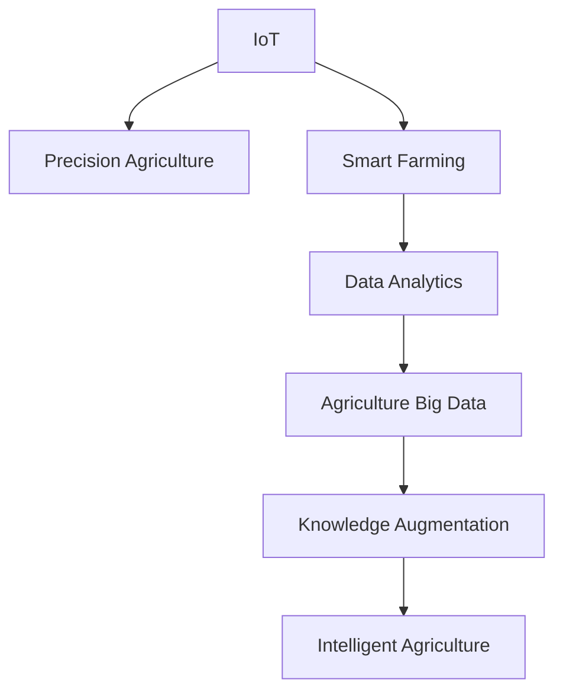

                 

# 知识型农业的发展与挑战

> 关键词：知识型农业,农业物联网,精准农业,智能农场,农业大数据

## 1. 背景介绍

### 1.1 问题由来
随着全球人口的不断增长和消费结构的升级，对食品的需求日益增加，同时也对农业生产效率提出了更高的要求。传统的农业生产方式，依赖于人力、经验和简单的机械化设备，难以适应现代化农业生产的需求。农业生产的低效率、不稳定性和不可持续性，成为制约农业发展的重大问题。

为了解决这些问题，知识型农业应运而生。知识型农业是指通过引入现代科技和信息技术，优化农业生产流程，提高生产效率，实现农业智能化、精准化、可持续化发展。知识型农业的核心在于知识赋能，即通过知识和技术的应用，使农业生产更加科学、精准、高效和可持续。

### 1.2 问题核心关键点
知识型农业的发展涉及多个核心关键点，包括：

- **农业物联网(IoT)**：通过传感器、监控设备等物联网技术，实时采集田间环境数据，如土壤湿度、温度、光照等，为农业生产决策提供数据支持。
- **精准农业(Precision Agriculture)**：利用遥感技术、GPS定位系统等，对农田进行精细化管理，减少资源浪费，提高生产效率。
- **智能农场(Smart Farming)**：通过自动化机械、智能机器人等，实现农业生产流程的自动化，降低人力成本，提升生产效率。
- **农业大数据(Agriculture Big Data)**：通过数据分析、挖掘技术，对农业生产数据进行综合分析，指导农业生产决策，提升生产管理水平。

这些关键技术和大数据驱动的应用，共同构成了知识型农业的技术基础和应用框架。

## 2. 核心概念与联系

### 2.1 核心概念概述

为更好地理解知识型农业，本节将介绍几个密切相关的核心概念：

- **农业物联网(IoT)**：通过传感器、监控设备等物联网技术，实时采集田间环境数据，为农业生产决策提供数据支持。
- **精准农业(Precision Agriculture)**：利用遥感技术、GPS定位系统等，对农田进行精细化管理，减少资源浪费，提高生产效率。
- **智能农场(Smart Farming)**：通过自动化机械、智能机器人等，实现农业生产流程的自动化，降低人力成本，提升生产效率。
- **农业大数据(Agriculture Big Data)**：通过数据分析、挖掘技术，对农业生产数据进行综合分析，指导农业生产决策，提升生产管理水平。
- **知识赋能(Augmented Knowledge)**：通过引入现代科技和信息技术，使农业生产更加科学、精准、高效和可持续。
- **智能化农业(Intelligent Agriculture)**：利用人工智能技术，如机器学习、深度学习等，优化农业生产流程，实现农业智能化管理。

这些核心概念之间的逻辑关系可以通过以下Mermaid流程图来展示：



这个流程图展示了的核心概念及其之间的关系：

1. 农业物联网通过实时采集田间环境数据，为精准农业提供数据支持。
2. 精准农业利用物联网数据，对农田进行精细化管理，减少资源浪费。
3. 智能农场通过自动化和机器人技术，实现生产流程自动化，降低人力成本。
4. 农业大数据通过数据分析和挖掘技术，为知识赋能和智能化农业提供数据基础。
5. 知识赋能通过引入现代科技，使农业生产更加科学、精准、高效和可持续。
6. 智能化农业利用人工智能技术，优化农业生产流程，实现农业智能化管理。

## 3. 核心算法原理 & 具体操作步骤
### 3.1 算法原理概述

知识型农业的核心算法原理，主要基于物联网数据的实时采集、精准农业的精细化管理、智能农场的自动化控制和农业大数据的深度分析。

- **农业物联网(IoT)**：通过传感器、监控设备等，实时采集田间环境数据，如土壤湿度、温度、光照等，为农业生产决策提供数据支持。数据采集过程一般涉及数据采集模块、数据存储模块和数据传输模块。

- **精准农业(Precision Agriculture)**：利用遥感技术、GPS定位系统等，对农田进行精细化管理，减少资源浪费，提高生产效率。精准农业的核心在于空间差异化管理，通过多源数据的融合和分析，实现精确施肥、精确播种等操作。

- **智能农场(Smart Farming)**：通过自动化机械、智能机器人等，实现农业生产流程的自动化，降低人力成本，提升生产效率。智能农场的关键在于自动化控制和机器人导航，需要依赖精确的定位系统和智能控制系统。

- **农业大数据(Agriculture Big Data)**：通过数据分析、挖掘技术，对农业生产数据进行综合分析，指导农业生产决策，提升生产管理水平。大数据分析过程包括数据预处理、特征工程、模型训练和结果解释等步骤。

### 3.2 算法步骤详解

以下是对知识型农业主要算法的详细步骤详解：

**3.2.1 农业物联网数据采集**
1. 选择合适的传感器和监控设备，如土壤湿度传感器、温度传感器、光照传感器等，进行安装和调试。
2. 建立数据采集模块，将传感器数据实时采集并存储到数据中心或云平台。
3. 配置数据传输模块，将采集到的数据通过WiFi、4G/5G等无线方式传输到云端或本地服务器。

**3.2.2 精准农业空间差异化管理**
1. 利用遥感技术和GPS定位系统，对农田进行空间划分区块，如利用卫星遥感数据生成农田空间地图。
2. 对每个区块进行数据采集和分析，如通过无人机搭载的传感器采集土壤和作物数据。
3. 结合历史数据和专家知识，建立多源数据融合模型，进行精准施肥、精准播种等操作。

**3.2.3 智能农场自动化控制**
1. 设计和安装自动化机械，如自动化收割机、自动灌溉系统等。
2. 配置智能控制系统，如利用计算机视觉和图像处理技术，实现农作物的自动识别和分类。
3. 通过机器学习和深度学习算法，训练机器人导航和操作模型，实现自主导航和精准操作。

**3.2.4 农业大数据综合分析**
1. 收集和整合多源农业数据，包括传感器数据、气象数据、农机作业数据等。
2. 进行数据清洗和预处理，如数据去噪、缺失值填补等。
3. 建立数据分析模型，如利用机器学习算法进行分类、回归、聚类等分析。
4. 通过数据可视化工具，将分析结果呈现给农业生产者和管理者。

### 3.3 算法优缺点

知识型农业的算法具有以下优点：
1. 提高生产效率。通过精准农业和智能农场技术，减少资源浪费，降低人力成本，提高生产效率。
2. 提升管理水平。通过农业大数据分析，提供科学的生产决策支持，提升农业管理水平。
3. 降低环境影响。通过精准施肥和灌溉，减少化肥和农药的使用，降低环境污染。
4. 实现可持续发展。通过智能监控和数据分析，优化资源利用，实现农业的可持续发展。

同时，这些算法也存在一些局限性：
1. 数据采集成本高。传感器和监控设备的价格较高，需要在前期投入较大成本。
2. 数据隐私和安全问题。农业数据的采集和存储涉及大量敏感信息，数据隐私和安全问题需特别注意。
3. 算法复杂度高。数据采集、分析、模型训练等过程复杂，需要专业的技术人员进行维护和优化。
4. 技术依赖性强。农业物联网和智能农场技术依赖于物联网设备和高精度传感器，技术依赖性较强。

尽管存在这些局限性，但知识型农业在提高农业生产效率和智能化管理方面具有显著优势，仍是大势所趋。

### 3.4 算法应用领域

知识型农业的算法主要应用于以下几个领域：

- **农业物联网**：广泛应用于温室大棚、果园、牧场等农业生产环境中，实现环境数据实时监控和采集。
- **精准农业**：广泛应用于农田管理、施肥、灌溉等环节，实现资源优化利用。
- **智能农场**：广泛应用于自动化机械和智能机器人操作，提升农业生产效率和质量。
- **农业大数据**：广泛应用于农场管理、供应链优化、市场预测等环节，提供科学决策支持。

此外，知识型农业的算法还被应用于农业机械自动化、农业机器人导航、农业气象预测等新兴领域，为农业生产带来更多可能。

## 4. 数学模型和公式 & 详细讲解  
### 4.1 数学模型构建

知识型农业的数学模型构建主要涉及以下几个方面：

- **农业物联网数据采集模型**：描述传感器数据采集和传输过程，通常涉及随机过程和线性回归模型。
- **精准农业空间差异化管理模型**：利用空间分析技术和机器学习算法，进行空间差异化管理，如利用随机森林和K-means聚类算法。
- **智能农场自动化控制模型**：利用计算机视觉和深度学习算法，进行物体识别和分类，如利用卷积神经网络(CNN)和循环神经网络(RNN)等。
- **农业大数据综合分析模型**：利用统计学和机器学习算法，进行数据综合分析和预测，如利用时间序列分析和支持向量机(SVM)等。

### 4.2 公式推导过程

以下是对知识型农业主要算法的数学公式推导过程：

**4.2.1 农业物联网数据采集模型**
假设传感器在单位时间内的噪声为 $\eta$，传感器读数为 $x$，真实值为 $\mu$，则传感器数据的数学模型为：

$$
x = \mu + \eta
$$

其中 $\mu$ 表示真实值，$\eta$ 表示噪声。

**4.2.2 精准农业空间差异化管理模型**
利用遥感技术和GPS定位系统，对农田进行空间划分区块，每个区块的传感器读数为 $x_i$，真实值为 $\mu_i$，噪声为 $\eta_i$，则空间差异化管理的数学模型为：

$$
x_i = \mu_i + \eta_i
$$

利用随机森林算法，对每个区块的传感器读数进行特征提取和分类，建立多源数据融合模型：

$$
y = f(x_1, x_2, ..., x_n)
$$

其中 $y$ 表示分类结果，$f$ 表示随机森林模型。

**4.2.3 智能农场自动化控制模型**
利用计算机视觉和深度学习算法，对农作物进行图像处理和分类，假设图像大小为 $M \times N$，每个像素的特征向量为 $\vec{v}$，真实标签为 $y$，则分类模型的数学模型为：

$$
y = g(\vec{v})
$$

其中 $g$ 表示深度学习模型。

**4.2.4 农业大数据综合分析模型**
利用统计学和机器学习算法，对农业数据进行综合分析和预测，假设农业数据集为 $D = \{(x_i, y_i)\}_{i=1}^N$，其中 $x_i$ 表示输入特征，$y_i$ 表示目标变量，则回归模型的数学模型为：

$$
y_i = h(x_i) + \epsilon_i
$$

其中 $h$ 表示回归模型，$\epsilon_i$ 表示随机误差。

### 4.3 案例分析与讲解

以智能农场自动化控制为例，下面进行详细案例分析：

**案例背景**：某智能农场需要通过无人机和自动化机械进行农作物的自动收割。

**数据采集**：无人机搭载的传感器实时采集农作物的图像和特征数据，并上传到云端服务器。

**模型训练**：利用深度学习算法，训练农作物分类模型，如利用卷积神经网络(CNN)对图像进行特征提取和分类。

**模型应用**：无人机自动飞入农田，识别并分类农作物，将分类结果发送给自动化收割机。自动化收割机根据分类结果，定位并收割特定作物，完成自动收割任务。

通过上述案例，可以看到，深度学习算法在智能农场自动化控制中发挥了重要作用，显著提升了农业生产效率和智能化水平。

## 5. 项目实践：代码实例和详细解释说明
### 5.1 开发环境搭建

在进行知识型农业实践前，我们需要准备好开发环境。以下是使用Python进行开发的环境配置流程：

1. 安装Anaconda：从官网下载并安装Anaconda，用于创建独立的Python环境。

2. 创建并激活虚拟环境：
```bash
conda create -n agriculture-env python=3.8 
conda activate agriculture-env
```

3. 安装必要的Python库：
```bash
pip install numpy pandas scikit-learn matplotlib tensorflow
```

4. 安装TensorFlow和Keras：
```bash
pip install tensorflow
pip install keras
```

5. 安装农业物联网相关的库：
```bash
pip install pymongo influxdb psycopg2
```

完成上述步骤后，即可在`agriculture-env`环境中开始知识型农业实践。

### 5.2 源代码详细实现

这里我们以智能农场自动化控制为例，给出使用TensorFlow和Keras进行农作物分类的PyTorch代码实现。

首先，导入必要的库：

```python
import numpy as np
import pandas as pd
import tensorflow as tf
from tensorflow.keras import layers
from tensorflow.keras.models import Sequential
from tensorflow.keras.layers import Conv2D, MaxPooling2D, Flatten, Dense
from tensorflow.keras.preprocessing.image import ImageDataGenerator
```

然后，定义模型和优化器：

```python
model = Sequential([
    layers.Conv2D(32, (3,3), activation='relu', input_shape=(224, 224, 3)),
    layers.MaxPooling2D((2,2)),
    layers.Conv2D(64, (3,3), activation='relu'),
    layers.MaxPooling2D((2,2)),
    layers.Conv2D(128, (3,3), activation='relu'),
    layers.MaxPooling2D((2,2)),
    layers.Flatten(),
    layers.Dense(128, activation='relu'),
    layers.Dense(1, activation='sigmoid')
])

model.compile(optimizer='adam', loss='binary_crossentropy', metrics=['accuracy'])
```

接着，定义训练和评估函数：

```python
train_data = ImageDataGenerator(rescale=1./255)
train_generator = train_data.flow_from_directory('train', target_size=(224, 224), batch_size=32, class_mode='binary')
test_data = ImageDataGenerator(rescale=1./255)
test_generator = test_data.flow_from_directory('test', target_size=(224, 224), batch_size=32, class_mode='binary')

def train_epoch(model, train_generator, batch_size, optimizer):
    model.fit(train_generator, steps_per_epoch=len(train_generator), epochs=10, validation_data=test_generator, validation_steps=len(test_generator), callbacks=[tf.keras.callbacks.EarlyStopping(patience=2)])

def evaluate(model, test_generator):
    model.evaluate(test_generator, steps=len(test_generator))
```

最后，启动训练流程并在测试集上评估：

```python
train_epoch(model, train_generator, batch_size=32, optimizer=optimizer)
evaluate(model, test_generator)
```

以上就是使用TensorFlow和Keras进行智能农场农作物分类的完整代码实现。可以看到，利用深度学习算法，可以高效地进行农作物的图像处理和分类，实现农业生产的智能化。

### 5.3 代码解读与分析

让我们再详细解读一下关键代码的实现细节：

**数据生成器定义**：
- `train_data` 和 `test_data`：定义图像数据生成器，对图像进行预处理和批量生成。
- `train_generator` 和 `test_generator`：通过图像数据生成器，生成训练集和测试集数据。

**模型定义**：
- `Sequential` 定义模型结构，包含多个卷积层、池化层、全连接层等。
- `Conv2D` 和 `MaxPooling2D` 定义卷积层和池化层。
- `Flatten` 和 `Dense` 定义全连接层。
- `ImageDataGenerator` 定义图像数据生成器。

**模型编译**：
- `model.compile` 定义模型的优化器、损失函数和评估指标。

**训练和评估函数**：
- `train_epoch` 定义训练过程，利用 `fit` 函数进行模型训练，并在验证集上进行验证。
- `evaluate` 定义评估过程，利用 `evaluate` 函数评估模型在测试集上的性能。

通过上述代码实现，可以有效地进行智能农场农作物分类的模型训练和评估，提升农业生产的智能化水平。

## 6. 实际应用场景
### 6.1 智能农场自动化控制

智能农场通过自动化机械和智能机器人，实现了农业生产的自动化和智能化管理。智能农场可以大幅提高农业生产效率和质量，降低人力成本，提升农业管理水平。

以智能收割为例，利用无人机和自动化机械，实现农作物的自动收割和分类。无人机搭载的传感器实时采集农作物的图像和特征数据，并上传到云端服务器。利用深度学习算法，训练农作物分类模型，实现对农作物的自动识别和分类。自动化收割机根据分类结果，定位并收割特定作物，完成自动收割任务。智能农场通过自动化控制和数据监控，提高了农业生产效率和智能化水平。

### 6.2 精准农业空间差异化管理

精准农业通过遥感技术和GPS定位系统，实现农田的精细化管理，减少资源浪费，提高生产效率。利用无人机和传感器，对农田进行空间划分区块，对每个区块进行数据采集和分析，建立多源数据融合模型。通过空间分析技术和机器学习算法，实现精确施肥、精确播种等操作，优化农业资源利用。

以精准施肥为例，利用卫星遥感数据生成农田空间地图，利用无人机搭载的传感器采集土壤和作物数据，结合历史数据和专家知识，建立多源数据融合模型，进行精准施肥操作。通过空间分析技术和机器学习算法，优化施肥方案，减少化肥和农药的使用，降低环境污染，提升农业生产效率和质量。

### 6.3 农业大数据综合分析

农业大数据通过数据分析、挖掘技术，对农业生产数据进行综合分析，提供科学的生产决策支持。利用统计学和机器学习算法，对农业数据进行综合分析和预测，指导农业生产决策，提升生产管理水平。

以农机作业数据为例，利用农业物联网采集田间环境数据，利用农业大数据综合分析模型，对农机作业数据进行分析和预测。通过时间序列分析和支持向量机(SVM)算法，优化农机作业计划，提高作业效率，降低作业成本。通过农业大数据综合分析，实现科学决策，提升农业管理水平。

### 6.4 未来应用展望

随着知识型农业技术的发展，未来将在以下几个方面取得新的突破：

1. **物联网技术普及**：农业物联网技术将得到更广泛的应用，实现田间环境数据的实时监控和采集，为精准农业和智能农场提供数据支持。
2. **人工智能算法优化**：深度学习和机器学习算法将不断优化，提高农作物分类的准确性和自动化农机作业的效率。
3. **知识管理平台建设**：建设农业知识管理平台，集成农业数据、专家知识、农机作业方案等，提供科学的农业生产决策支持。
4. **智能农场升级**：利用自动化机械和智能机器人，实现农业生产的全面自动化，进一步提高生产效率和智能化水平。
5. **农业大数据分析**：利用农业大数据综合分析模型，进行数据挖掘和预测，实现农业管理的科学化和智能化。

以上趋势将推动知识型农业技术不断进步，为农业生产带来更多可能，提升农业生产的效率和质量。

## 7. 工具和资源推荐
### 7.1 学习资源推荐

为了帮助开发者系统掌握知识型农业的理论基础和实践技巧，这里推荐一些优质的学习资源：

1. **《农业物联网技术与应用》**：介绍农业物联网的原理和应用，提供丰富的实际案例和工程实践。
2. **《精准农业技术指南》**：详细介绍精准农业的核心技术，包括遥感技术、GPS定位系统、无人机等。
3. **《智能农场设计与管理》**：涵盖智能农场的规划、设计、建设和运营全过程，提供详细的工程实践指南。
4. **《农业大数据分析与实践》**：介绍农业大数据的采集、处理和分析技术，提供丰富的实际案例和工程实践。
5. **Coursera《Agriculture 4.0》课程**：由爱丁堡大学开设的在线课程，涵盖农业物联网、精准农业、智能农场等前沿技术。
6. **edX《Precision Agriculture and Machine Learning》课程**：由加州大学伯克利分校开设的在线课程，介绍精准农业和机器学习在农业中的应用。

通过对这些资源的学习实践，相信你一定能够快速掌握知识型农业的理论基础和实践技巧，并用于解决实际的农业问题。

### 7.2 开发工具推荐

高效的开发离不开优秀的工具支持。以下是几款用于知识型农业开发的常用工具：

1. **Anaconda**：用于创建和管理Python虚拟环境，支持多种库和工具的快速安装。
2. **TensorFlow**：由Google主导开发的深度学习框架，支持分布式计算和模型部署。
3. **Keras**：基于TensorFlow的高级神经网络API，简单易用，适合快速原型开发和模型训练。
4. **OpenCV**：开源计算机视觉库，提供丰富的图像处理和特征提取工具。
5. **Jupyter Notebook**：交互式编程环境，支持Python和多种语言的快速开发和调试。
6. **AgRF**：农业生产管理系统，提供综合的农业生产管理和决策支持。

合理利用这些工具，可以显著提升知识型农业的开发效率，加快创新迭代的步伐。

### 7.3 相关论文推荐

知识型农业的研究涉及多个前沿领域，以下是几篇奠基性的相关论文，推荐阅读：

1. **《A Survey of Precision Agriculture Technologies and Applications》**：全面综述了精准农业的核心技术，包括遥感技术、GPS定位系统、无人机等。
2. **《Machine Learning in Agriculture: A Review》**：介绍机器学习在农业中的应用，涵盖数据预处理、特征工程、模型训练和结果解释等。
3. **《Crop Phenotyping with Deep Learning》**：利用深度学习算法，对农作物进行图像处理和分类，提高农作物的识别准确性。
4. **《Real-time Data Monitoring and Analysis for Precision Agriculture》**：介绍物联网技术在精准农业中的应用，实现田间环境数据的实时监控和分析。
5. **《Agri-Forecasting: Data Mining and Statistical Modeling for Agriculture》**：介绍农业大数据的综合分析和预测方法，提高农业生产的科学化和智能化水平。

这些论文代表了大农业技术的发展脉络。通过学习这些前沿成果，可以帮助研究者把握学科前进方向，激发更多的创新灵感。

## 8. 总结：未来发展趋势与挑战

### 8.1 总结

本文对知识型农业的发展与挑战进行了全面系统的介绍。首先阐述了知识型农业的背景和核心概念，明确了知识型农业技术的发展方向和应用前景。其次，从原理到实践，详细讲解了知识型农业的数学模型和关键步骤，给出了知识型农业实践的完整代码实现。同时，本文还探讨了知识型农业在智能农场、精准农业、农业大数据等领域的应用，展示了知识型农业技术的巨大潜力。此外，本文还推荐了知识型农业的学习资源、开发工具和相关论文，力求为读者提供全方位的技术指引。

通过本文的系统梳理，可以看到，知识型农业通过现代科技和信息技术的应用，显著提高了农业生产的效率和智能化水平，具有广阔的发展前景。

### 8.2 未来发展趋势

展望未来，知识型农业的发展将呈现以下几个趋势：

1. **技术融合发展**：知识型农业将与物联网、大数据、人工智能等技术深度融合，实现农业生产的全方位智能化管理。
2. **技术标准化**：知识型农业技术将逐渐标准化，提升技术的可扩展性和互操作性，实现大规模应用。
3. **技术普及应用**：知识型农业技术将得到广泛应用，逐步覆盖农业生产的各个环节，提升农业生产效率和质量。
4. **技术创新突破**：知识型农业技术将继续突破，实现更多新应用场景，推动农业生产方式的变革。

### 8.3 面临的挑战

尽管知识型农业技术已经取得了显著成就，但在迈向更加智能化、普适化应用的过程中，仍面临诸多挑战：

1. **技术复杂度高**：知识型农业技术涉及多源数据的融合、高精度传感器和智能设备的安装和维护，技术复杂度较高。
2. **成本高昂**：知识型农业技术的引入和应用，需要较高的初始投资和技术支持，对中小农场来说，经济负担较重。
3. **数据隐私和安全问题**：农业数据的采集和存储涉及大量敏感信息，数据隐私和安全问题需特别注意。
4. **技术标准化不足**：知识型农业技术尚未完全标准化，导致技术兼容性和互操作性较差。
5. **技术推广难度大**：知识型农业技术推广需要多方协同合作，政府、企业、科研机构需共同努力。

尽管存在这些挑战，但知识型农业技术的发展是大势所趋，未来必将带来农业生产方式的重大变革，提升农业生产的效率和质量。

### 8.4 研究展望

面向未来，知识型农业的研究需要在以下几个方面寻求新的突破：

1. **技术标准化**：建立知识型农业技术的标准体系，提升技术的可扩展性和互操作性，实现大规模应用。
2. **成本降低**：通过技术创新和应用推广，降低知识型农业技术的初始投资和经济负担。
3. **数据隐私和安全**：制定数据隐私和安全标准，确保农业数据的保护。
4. **技术推广应用**：加强政府、企业、科研机构的协同合作，推动知识型农业技术的广泛应用。
5. **技术创新突破**：持续开展前沿研究，推动知识型农业技术的持续创新和突破。

## 9. 附录：常见问题与解答

**Q1：知识型农业对农业生产有哪些优势？**

A: 知识型农业通过引入现代科技和信息技术，显著提高了农业生产的效率和智能化水平，具体优势如下：

1. **提高生产效率**：利用精准农业和智能农场技术，减少资源浪费，降低人力成本，提高生产效率。
2. **提升管理水平**：利用农业大数据分析，提供科学的生产决策支持，提升农业管理水平。
3. **降低环境影响**：通过精准施肥和灌溉，减少化肥和农药的使用，降低环境污染。
4. **实现可持续发展**：通过智能监控和数据分析，优化资源利用，实现农业的可持续发展。

**Q2：知识型农业的核心技术包括哪些？**

A: 知识型农业的核心技术主要包括：

1. **农业物联网(IoT)**：通过传感器、监控设备等物联网技术，实时采集田间环境数据，为农业生产决策提供数据支持。
2. **精准农业(Precision Agriculture)**：利用遥感技术、GPS定位系统等，对农田进行精细化管理，减少资源浪费，提高生产效率。
3. **智能农场(Smart Farming)**：通过自动化机械、智能机器人等，实现农业生产流程的自动化，降低人力成本，提升生产效率。
4. **农业大数据(Agriculture Big Data)**：通过数据分析、挖掘技术，对农业生产数据进行综合分析，指导农业生产决策，提升生产管理水平。

**Q3：知识型农业的发展面临哪些挑战？**

A: 知识型农业的发展面临以下挑战：

1. **技术复杂度高**：知识型农业技术涉及多源数据的融合、高精度传感器和智能设备的安装和维护，技术复杂度较高。
2. **成本高昂**：知识型农业技术的引入和应用，需要较高的初始投资和技术支持，对中小农场来说，经济负担较重。
3. **数据隐私和安全问题**：农业数据的采集和存储涉及大量敏感信息，数据隐私和安全问题需特别注意。
4. **技术标准化不足**：知识型农业技术尚未完全标准化，导致技术兼容性和互操作性较差。
5. **技术推广难度大**：知识型农业技术推广需要多方协同合作，政府、企业、科研机构需共同努力。

尽管存在这些挑战，但知识型农业技术的发展是大势所趋，未来必将带来农业生产方式的重大变革，提升农业生产的效率和质量。

---

作者：禅与计算机程序设计艺术 / Zen and the Art of Computer Programming

