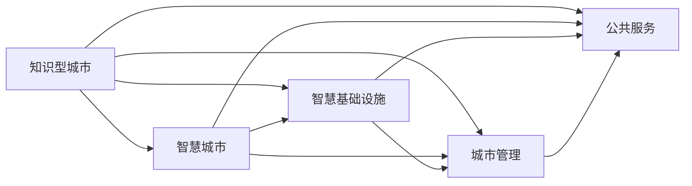

                 

# 知识型城市的规划与建设

> 关键词：知识型城市,智能城市,智慧城市,城市规划,智慧基础设施,城市管理,公共服务,数据驱动,数字孪生

## 1. 背景介绍

在数字化、网络化和智能化的浪潮中，全球各大城市都在积极寻求数字化转型，以提升城市治理能力、优化居民生活品质、促进经济可持续发展。知识型城市的概念因此应运而生，它强调以知识经济为基础，以信息技术为支撑，通过构建智慧城市，实现城市规划、建设、管理、服务的智能化。

### 1.1 知识型城市的内涵
知识型城市不仅重视科技研发和信息通信技术(ICT)的建设，更强调知识和智慧在城市管理中的应用。这种智慧体现在各个方面：从城市规划、环境监测、交通管理，到公共安全、医疗健康、教育娱乐，知识型城市通过数据的融合、分析与应用，实现城市运营的智能化和高效化。

### 1.2 智慧城市与知识型城市的联系
智慧城市是知识型城市的一个重要组成部分，其核心目标是通过智能化手段提升城市运行效率，而知识型城市则在此基础上，通过广泛的知识共享和智慧应用，进一步提升城市的智能化水平。智慧城市主要强调技术层面的智能化，而知识型城市则更注重知识的深度应用，使得城市变得更加智能和人性化。

## 2. 核心概念与联系

### 2.1 核心概念概述

#### 2.1.1 知识型城市
知识型城市是利用ICT技术，依托城市大数据，集成各类知识资源，构建智慧城市，推动经济、社会、环境协调发展的城市形态。其主要特征包括：

- **知识经济**：以科技、文化、教育、信息为支柱的现代产业体系。
- **信息化基础设施**：高速度、广覆盖、高可靠的信息通信网络。
- **智慧服务**：通过智能应用，提升公共服务的便捷性和精准性。
- **知识创新**：鼓励创新和创业，形成知识驱动的经济增长模式。

#### 2.1.2 智慧城市
智慧城市利用物联网、云计算、大数据等技术，通过实时监控和数据驱动，实现城市治理、公共服务、安全保障等方面的智能化，提升城市运行效率和居民生活质量。其主要特征包括：

- **物联网**：传感器和设备的广泛部署，实现对城市各项数据的实时监控。
- **大数据**：通过数据收集、存储、分析，提供城市管理决策支持。
- **智能应用**：如智能交通、智能电网、智能安防等，提高城市运营效率。
- **公众参与**：鼓励公众参与城市治理，提升城市治理透明度和公众满意度。

#### 2.1.3 智慧基础设施
智慧基础设施是指融合了ICT技术的各类基础设施，如智能电网、智能交通、智能环境监测系统等。其主要特征是：

- **智能化**：能够实时监控和反馈城市运行状态。
- **自适应**：能够根据环境变化动态调整运行参数。
- **互联互通**：各类基础设施能够互联互通，形成智能网络。

#### 2.1.4 城市管理
城市管理是城市治理的核心，包括城市规划、建设、维护、运营、服务等各个方面。知识型城市通过智慧基础设施和智能应用的结合，提升城市管理的效率和水平。

#### 2.1.5 公共服务
公共服务是城市管理的重点，包括教育、医疗、住房、交通、娱乐等各个领域。知识型城市通过智能化手段，优化公共服务流程，提升服务质量，满足居民的个性化需求。

### 2.2 核心概念之间的联系

这些概念之间存在紧密的联系，可以通过以下Mermaid流程图来展示：



这个流程图展示了知识型城市、智慧城市、智慧基础设施、城市管理、公共服务之间的联系：

1. **知识型城市**：是智慧城市的基础，依托ICT技术和知识资源的整合，为智慧城市建设提供支持。
2. **智慧城市**：通过智慧基础设施和智能应用的集成，实现城市运行的智能化。
3. **智慧基础设施**：是智慧城市的关键支撑，实现城市各项数据的实时监控和自适应调整。
4. **城市管理**：是智慧城市管理的重要内容，通过智慧基础设施和智能应用的结合，提升城市治理效率。
5. **公共服务**：是智慧城市的重要组成部分，通过智能化手段优化公共服务流程，提升服务质量。

## 3. 核心算法原理 & 具体操作步骤

### 3.1 算法原理概述

知识型城市的构建和智慧基础设施的建设，都需要依托先进的算法和技术。这些算法包括但不限于：

- **数据融合算法**：将来自不同来源的数据进行整合，形成统一的数据平台，方便数据的存储和分析。
- **数据挖掘算法**：通过分析数据，提取有价值的信息，为城市决策提供依据。
- **机器学习算法**：通过模型训练，实现城市管理的自动化和智能化。
- **模拟仿真算法**：通过构建数字孪生城市，实现城市运行状态的模拟和预测。

### 3.2 算法步骤详解

构建知识型城市的步骤大致包括以下几个方面：

#### 3.2.1 数据收集和整理
- **数据源**：来自物联网设备、传感器、城市管理系统等。
- **数据格式**：如时间序列数据、文本数据、图像数据等。
- **数据处理**：包括数据清洗、去重、格式转换等。

#### 3.2.2 数据融合和存储
- **数据融合**：通过数据融合算法，将不同来源的数据整合在一起。
- **数据存储**：使用数据库或数据湖技术，实现数据的存储和备份。

#### 3.2.3 数据分析和挖掘
- **数据分析**：使用统计分析、回归分析等方法，提取数据中的规律和趋势。
- **数据挖掘**：使用聚类、分类、关联规则等方法，发现数据中的潜在模式和知识。

#### 3.2.4 机器学习模型构建
- **模型选择**：选择合适的机器学习模型，如决策树、随机森林、深度学习等。
- **模型训练**：使用历史数据训练模型，获取参数。
- **模型评估**：使用测试集评估模型的性能，调整模型参数。

#### 3.2.5 智能应用开发
- **需求分析**：分析城市管理和服务需求，明确智能应用的功能和界面。
- **系统设计**：设计系统的架构和技术方案。
- **功能实现**：使用Python、Java、JavaScript等编程语言实现系统功能。
- **测试和部署**：进行系统测试，部署到生产环境。

#### 3.2.6 城市运营和维护
- **系统监控**：实时监控系统运行状态，及时发现和解决故障。
- **数据分析**：定期分析系统运行数据，优化系统性能。
- **用户反馈**：收集用户反馈，不断改进系统功能和服务质量。

### 3.3 算法优缺点

#### 3.3.1 优点
1. **数据驱动**：通过大数据和算法，提升城市管理的科学性和决策的精准性。
2. **高效便捷**：智能化手段大大提升了城市运行效率和服务质量。
3. **公共参与**：鼓励公众参与城市治理，提升透明度和满意度。
4. **创新驱动**：推动科技创新，形成知识驱动的经济增长模式。

#### 3.3.2 缺点
1. **数据隐私**：大量数据的收集和分析可能引发数据隐私问题。
2. **安全风险**：智能基础设施可能遭受网络攻击和数据泄露。
3. **技术壁垒**：构建智慧城市需要高度的专业技术和人才。
4. **成本高昂**：智慧基础设施和智能应用的建设需要大量资金投入。

### 3.4 算法应用领域

智慧城市和知识型城市的应用领域非常广泛，包括但不限于以下几个方面：

- **智能交通**：通过智慧交通系统，实现交通流量监测、信号优化、交通事故预警等。
- **智慧环保**：通过智能环境监测系统，实现空气质量监测、水质监测、垃圾分类等。
- **智慧医疗**：通过智慧医疗系统，实现医疗数据共享、远程诊断、健康管理等。
- **智慧教育**：通过智慧教育平台，实现在线学习、智能推荐、教育数据分析等。
- **智慧公共安全**：通过智能安防系统，实现视频监控、行为分析、异常检测等。

## 4. 数学模型和公式 & 详细讲解 & 举例说明

### 4.1 数学模型构建

在知识型城市的构建中，数学模型和算法是不可或缺的。以下是一个简化的数学模型示例，用于描述智慧城市中的智能交通系统。

**模型假设**：

- **交通流量**：$T(t)$，描述在时间$t$的交通流量。
- **平均速度**：$V(t)$，描述在时间$t$的平均速度。
- **事故发生率**：$A(t)$，描述在时间$t$的事故发生率。

**模型目标**：最小化交通拥堵和事故率。

### 4.2 公式推导过程

#### 4.2.1 交通流量模型
$$
T(t) = \sum_{i=1}^n f_i(t) \cdot v_i
$$

其中，$n$表示道路条数，$f_i(t)$表示第$i$条道路在时间$t$的流量，$v_i$表示第$i$条道路的通行能力。

#### 4.2.2 平均速度模型
$$
V(t) = \frac{T(t)}{\sum_{i=1}^n \frac{1}{v_i}}
$$

#### 4.2.3 事故发生率模型
$$
A(t) = \sum_{i=1}^n p_i(t) \cdot v_i
$$

其中，$p_i(t)$表示第$i$条道路在时间$t$的事故概率，$v_i$表示第$i$条道路的通行能力。

### 4.3 案例分析与讲解

以智能交通系统为例，我们可以使用机器学习算法构建预测模型，预测未来的交通流量和事故率，并根据预测结果进行交通信号优化和事故预警。

#### 4.3.1 数据集构建
- **历史数据**：从交通管理系统中获取历史交通流量、速度、事故记录等数据。
- **特征工程**：提取有用的特征，如天气、道路条件、时间、日期等。

#### 4.3.2 模型训练
- **模型选择**：使用随机森林、梯度提升树等算法进行模型训练。
- **模型评估**：使用均方误差、准确率等指标评估模型性能。
- **参数调优**：通过网格搜索、贝叶斯优化等方法调整模型参数。

#### 4.3.3 应用场景
- **交通信号优化**：根据预测结果，调整交通信号灯的周期和时长，避免拥堵。
- **事故预警**：根据预测结果，提前通知相关部门，做好事故处理准备。

## 5. 项目实践：代码实例和详细解释说明

### 5.1 开发环境搭建

#### 5.1.1 硬件要求
- **CPU**：Intel Xeon Gold或AMD Ryzen 7以上。
- **内存**：32GB以上。
- **存储**：NVIDIA GeForce RTX 2080或更高。

#### 5.1.2 软件要求
- **操作系统**：Ubuntu 18.04 LTS。
- **编程语言**：Python 3.8以上。
- **开发框架**：TensorFlow、PyTorch、Keras等。

#### 5.1.3 安装环境
```bash
# 安装依赖包
sudo apt-get update
sudo apt-get install python3-pip
pip3 install tensorflow keras

# 安装虚拟环境
python3 -m venv myenv
source myenv/bin/activate
```

### 5.2 源代码详细实现

#### 5.2.1 数据集处理
```python
import pandas as pd

# 读取数据
data = pd.read_csv('traffic_data.csv')

# 数据预处理
data = data.dropna()
data['date'] = pd.to_datetime(data['date'])
data = data.groupby('date').sum()

# 数据可视化
data.plot(kind='line')
plt.show()
```

#### 5.2.2 模型训练
```python
import tensorflow as tf
from tensorflow.keras import layers

# 构建模型
model = tf.keras.Sequential([
    layers.Dense(64, activation='relu', input_shape=(1,)),
    layers.Dense(1)
])

# 编译模型
model.compile(optimizer='adam', loss='mse')

# 训练模型
model.fit(train_data, train_labels, epochs=10, validation_data=(val_data, val_labels))
```

#### 5.2.3 模型评估
```python
import numpy as np

# 加载测试数据
test_data = np.load('test_data.npy')
test_labels = np.load('test_labels.npy')

# 模型评估
mse = np.mean((model.predict(test_data) - test_labels) ** 2)
print(f'Mean Squared Error: {mse:.2f}')
```

#### 5.2.4 应用场景
```python
import numpy as np

# 加载测试数据
test_data = np.load('test_data.npy')
test_labels = np.load('test_labels.npy')

# 模型预测
predictions = model.predict(test_data)

# 输出结果
for i in range(len(predictions)):
    print(f'Prediction for {test_data[i][0]}: {predictions[i]}')
```

### 5.3 代码解读与分析

#### 5.3.1 数据集处理
通过Pandas库，可以方便地读取和处理数据。数据预处理包括去重、时间转换、聚合等操作，最终得到格式统一、便于分析的数据集。

#### 5.3.2 模型训练
使用TensorFlow构建一个简单的神经网络模型，进行回归训练。使用均方误差作为损失函数，Adam优化器进行参数更新。通过训练数据和验证数据，评估模型性能，调整模型参数。

#### 5.3.3 模型评估
通过计算模型预测值与真实值之间的均方误差，评估模型在测试集上的预测效果。均方误差越小，模型的预测精度越高。

#### 5.3.4 应用场景
根据模型预测结果，对交通流量进行实时监控和调整。通过分析预测结果，优化交通信号灯的设置，减少拥堵，提高通行效率。

## 6. 实际应用场景

### 6.1 智能交通系统
智能交通系统通过传感器和摄像头，实时监测交通流量、速度和事故情况，使用机器学习算法进行数据分析和预测，优化交通信号控制，实现交通流的智能化管理。

#### 6.1.1 实时监控
通过视频监控和传感器，实时监测交通流量、速度和事故情况，收集大量数据。

#### 6.1.2 数据融合
将实时数据和历史数据进行融合，形成统一的数据平台，便于分析和预测。

#### 6.1.3 预测模型
使用机器学习算法，构建交通流量和事故率的预测模型，实时输出预测结果。

#### 6.1.4 信号优化
根据预测结果，自动调整交通信号灯的周期和时长，避免拥堵，提高通行效率。

#### 6.1.5 事故预警
根据预测结果，提前通知相关部门，做好事故处理准备。

### 6.2 智慧环保系统
智慧环保系统通过环境监测传感器和数据分析算法，实时监测空气质量、水质、垃圾分类等环境指标，使用智慧决策系统，优化环境管理策略，实现城市的绿色可持续发展。

#### 6.2.1 实时监测
通过环境监测传感器，实时监测空气质量、水质、垃圾分类等指标。

#### 6.2.2 数据分析
使用数据分析算法，提取环境数据中的规律和趋势，预测环境变化趋势。

#### 6.2.3 智慧决策
根据数据分析结果，优化环境管理策略，如垃圾分类指导、污染源监控等。

#### 6.2.4 智能调度
使用智能调度系统，优化资源配置，如垃圾收集路线、污染源处理等。

### 6.3 智慧医疗系统
智慧医疗系统通过智慧医疗平台和数据分析算法，实现医疗数据的共享和分析，使用智能诊断系统，提高医疗服务的质量和效率，实现精准医疗。

#### 6.3.1 数据共享
通过智慧医疗平台，实现医疗数据的共享和交换，优化医疗资源配置。

#### 6.3.2 数据分析
使用数据分析算法，提取医疗数据中的规律和趋势，预测疾病流行趋势。

#### 6.3.3 智能诊断
使用智能诊断系统，根据患者的历史数据和症状，快速诊断病情，提供精准的治疗方案。

#### 6.3.4 远程监控
通过远程监控系统，实时监测患者的健康状况，及时发现异常情况，提供紧急处理。

## 7. 工具和资源推荐

### 7.1 学习资源推荐

为了帮助开发者系统掌握知识型城市和智慧基础设施的构建技术，这里推荐一些优质的学习资源：

1. **《智慧城市建设与运营管理》**：系统介绍智慧城市的概念、技术架构、应用场景等，适合入门学习。
2. **《大数据与智慧城市》**：介绍大数据技术在智慧城市中的应用，涵盖数据采集、处理、分析等环节。
3. **《城市管理与智慧基础设施》**：详细介绍城市管理中使用的智慧基础设施，如智能交通、智慧环保等。
4. **《Python深度学习》**：介绍机器学习算法和深度学习框架在智慧城市中的应用，适合进阶学习。
5. **《物联网技术与应用》**：介绍物联网技术在智慧城市中的应用，涵盖传感器、通信协议、数据处理等。

通过对这些资源的学习实践，相信你一定能够快速掌握知识型城市和智慧基础设施的构建技术，并用于解决实际的智慧城市问题。

### 7.2 开发工具推荐

高效的开发离不开优秀的工具支持。以下是几款用于知识型城市和智慧基础设施开发的常用工具：

1. **Jupyter Notebook**：交互式编程环境，适合数据分析和机器学习。
2. **PyCharm**：Python集成开发环境，提供代码高亮、自动补全、调试等功能。
3. **RapidMiner**：数据挖掘和机器学习平台，提供可视化的数据分析和建模工具。
4. **Tableau**：数据可视化工具，帮助用户快速生成图表和报告。
5. **TensorFlow**：开源深度学习框架，适合构建复杂模型和进行大规模数据分析。

合理利用这些工具，可以显著提升知识型城市和智慧基础设施的开发效率，加快创新迭代的步伐。

### 7.3 相关论文推荐

知识型城市和智慧基础设施的发展源于学界的持续研究。以下是几篇奠基性的相关论文，推荐阅读：

1. **《智慧城市：理论与实践》**：介绍智慧城市的概念、技术架构和应用案例，探讨智慧城市的未来发展。
2. **《物联网技术在智慧城市中的应用》**：介绍物联网技术在智慧城市中的应用，涵盖传感器、通信协议、数据处理等。
3. **《知识型城市构建的挑战与对策》**：探讨知识型城市构建中的挑战和解决策略，提出基于大数据和人工智能的城市治理方案。
4. **《智慧基础设施的设计与实现》**：介绍智慧基础设施的设计和实现技术，涵盖智能交通、智慧环保、智慧医疗等。
5. **《城市管理的智慧化转型》**：探讨城市管理中的智慧化转型，提出基于物联网和人工智能的城市管理方案。

这些论文代表了大城市数字化转型的研究脉络。通过学习这些前沿成果，可以帮助研究者把握学科前进方向，激发更多的创新灵感。

## 8. 总结：未来发展趋势与挑战

### 8.1 研究成果总结

知识型城市和智慧基础设施的建设，已经取得了显著的进展，涵盖了智能交通、智慧环保、智慧医疗等多个领域。通过数据融合、数据分析、智能应用等技术，提升了城市管理的科学性和效率，改善了居民的生活质量。

### 8.2 未来发展趋势

展望未来，知识型城市和智慧基础设施将继续朝着以下方向发展：

1. **数据驱动**：通过大数据和算法，实现城市运营的智能化和自动化。
2. **智慧融合**：推动智慧基础设施与其他技术融合，如物联网、人工智能、区块链等。
3. **全民参与**：鼓励公众参与城市治理，提升透明度和满意度。
4. **跨域协同**：推动城市间、区域间的数据共享和协同管理。
5. **创新驱动**：推动科技创新，形成知识驱动的经济增长模式。

### 8.3 面临的挑战

尽管知识型城市和智慧基础设施已经取得了显著进展，但在迈向更加智能化、普适化应用的过程中，仍面临诸多挑战：

1. **数据隐私**：大量数据的收集和分析可能引发数据隐私问题。
2. **安全风险**：智慧基础设施可能遭受网络攻击和数据泄露。
3. **技术壁垒**：构建智慧城市需要高度的专业技术和人才。
4. **成本高昂**：智慧基础设施和智能应用的建设需要大量资金投入。

### 8.4 研究展望

面对知识型城市和智慧基础设施所面临的挑战，未来的研究需要在以下几个方面寻求新的突破：

1. **数据隐私保护**：引入隐私保护技术，如差分隐私、联邦学习等，保障数据隐私和安全。
2. **安全保障**：加强网络安全防护，使用加密技术和区块链技术，保护智慧基础设施的安全。
3. **技术标准化**：制定智慧城市和智慧基础设施的标准和规范，推动技术共享和协同发展。
4. **智能融合**：推动智慧基础设施与其他技术融合，如物联网、人工智能、区块链等，实现更加高效、安全、智能的城市运营。
5. **公众参与**：鼓励公众参与城市治理，提升透明度和满意度，形成知识驱动的治理模式。

这些研究方向的探索发展，必将引领知识型城市和智慧基础设施迈向更高的台阶，为构建安全、可靠、智能、可持续的城市提供新的技术支撑。

## 9. 附录：常见问题与解答

### 9.1 问题1：知识型城市和智慧城市有何区别？

答案：知识型城市强调知识经济和智慧基础设施的建设，而智慧城市更注重数据的智能化和应用。智慧城市是知识型城市的重要组成部分，两者相辅相成，共同推动城市的数字化转型。

### 9.2 问题2：如何构建智慧基础设施？

答案：构建智慧基础设施需要从以下几个方面入手：

1. **数据采集**：部署传感器、摄像头等设备，收集城市各项数据。
2. **数据融合**：将不同来源的数据进行整合，形成统一的数据平台，便于存储和分析。
3. **数据分析**：使用大数据和算法，提取数据中的规律和趋势，支持城市决策。
4. **智能应用**：开发智能应用，提升城市运行的智能化和自动化水平。
5. **安全保障**：加强网络安全防护，保障智慧基础设施的安全。

### 9.3 问题3：知识型城市在建设过程中需要注意哪些问题？

答案：在知识型城市建设过程中，需要注意以下几个问题：

1. **数据隐私**：保障数据隐私和安全，避免数据泄露和滥用。
2. **安全风险**：加强网络安全防护，保障智慧基础设施的安全。
3. **技术壁垒**：引入先进的ICT技术和专业人才，推动智慧城市建设。
4. **成本高昂**：合理规划建设资金，控制成本，实现经济效益和社会效益的双赢。
5. **公众参与**：鼓励公众参与城市治理，提升透明度和满意度。

### 9.4 问题4：知识型城市和智慧基础设施在应用过程中需要注意哪些问题？

答案：在知识型城市和智慧基础设施的应用过程中，需要注意以下几个问题：

1. **数据隐私**：保障数据隐私和安全，避免数据泄露和滥用。
2. **安全风险**：加强网络安全防护，保障智慧基础设施的安全。
3. **技术标准化**：制定智慧城市和智慧基础设施的标准和规范，推动技术共享和协同发展。
4. **智能融合**：推动智慧基础设施与其他技术融合，如物联网、人工智能、区块链等，实现更加高效、安全、智能的城市运营。
5. **公众参与**：鼓励公众参与城市治理，提升透明度和满意度，形成知识驱动的治理模式。

### 9.5 问题5：未来智慧城市的发展方向是什么？

答案：未来智慧城市的发展方向主要包括以下几个方面：

1. **数据驱动**：通过大数据和算法，实现城市运营的智能化和自动化。
2. **智慧融合**：推动智慧基础设施与其他技术融合，如物联网、人工智能、区块链等。
3. **全民参与**：鼓励公众参与城市治理，提升透明度和满意度。
4. **跨域协同**：推动城市间、区域间的数据共享和协同管理。
5. **创新驱动**：推动科技创新，形成知识驱动的经济增长模式。

通过这些方向的探索发展，未来智慧城市将更加智能化、普适化，为构建安全、可靠、智能、可持续的城市提供新的技术支撑。

---

作者：禅与计算机程序设计艺术 / Zen and the Art of Computer Programming

