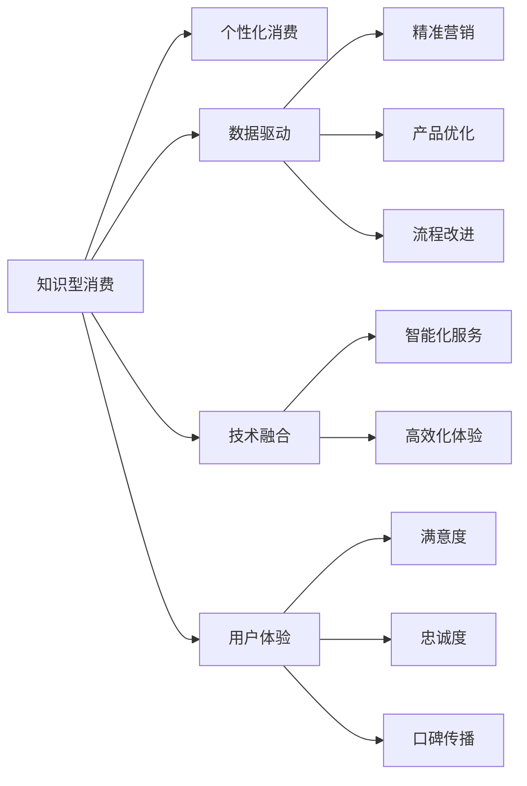
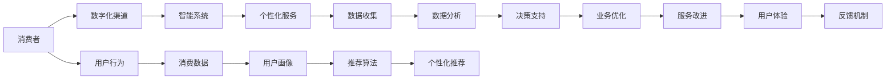

                 

# 知识型消费的特征与趋势

> 关键词：知识型消费,特征,趋势,人工智能,个性化,数据驱动,创新,技术融合

## 1. 背景介绍

在数字化时代，消费行为正在发生深刻变化。随着互联网、大数据、人工智能等技术的迅猛发展，消费者越来越倾向于通过数字化方式获取知识、满足需求。知识型消费成为未来消费的重要趋势，深刻影响着消费市场的走向。本文将系统探讨知识型消费的特征与趋势，帮助企业更好地把握消费者行为，实现数字化转型升级。

## 2. 核心概念与联系

### 2.1 核心概念概述

为了理解知识型消费的特征与趋势，首先需要明确几个核心概念：

- **知识型消费**：指消费者通过数字化手段，购买和获取知识内容，满足自身学习、娱乐、情感等需求的消费行为。与传统的实物商品消费相比，知识型消费更加注重精神层面的满足和长期价值。

- **个性化消费**：指基于消费者个体特征和行为偏好，提供定制化、差异化的商品或服务，满足其独特需求。个性化消费是知识型消费的重要特征之一，能够提升消费者的满意度和忠诚度。

- **数据驱动**：指通过收集、分析和利用消费者行为数据，驱动决策和运营，实现精准营销、产品优化和流程改进。数据驱动是大规模定制和个性化消费的基础。

- **技术融合**：指将人工智能、物联网、区块链等新兴技术融合到消费场景中，提供智能化、高效化的服务和体验。技术融合是知识型消费的重要手段。

- **用户体验**：指消费者在使用产品或服务过程中所感受到的整体体验。在知识型消费中，用户体验不仅影响即时的满意度，还影响消费者的重复购买率和口碑传播。

这些概念相互联系，共同构成了知识型消费的核心框架。以下是一个简单的Mermaid流程图，展示了这些概念之间的关系：



### 2.2 核心概念原理和架构的 Mermaid 流程图

在知识型消费中，消费者通过数字化渠道获取知识，与智能系统进行互动，最终实现个性化、数据驱动的消费体验。以下是一个简单的架构图，展示了知识型消费的基本流程：



这个架构图展示了从消费者接触到最终服务改善的全流程。消费者通过数字化渠道获取知识，与智能系统进行互动，最终实现个性化服务。同时，通过数据收集、分析和反馈，不断优化业务和体验。

## 3. 核心算法原理 & 具体操作步骤

### 3.1 算法原理概述

知识型消费的个性化推荐、数据驱动决策等核心技术，依赖于多个算法的协同作用。以下是其中的核心算法原理概述：

- **协同过滤算法**：通过分析消费者行为数据，推荐与兴趣相关的商品或服务。协同过滤算法分为基于用户的协同过滤和基于物品的协同过滤，可以发现用户之间的相似性或物品之间的相关性，实现个性化推荐。

- **深度学习算法**：通过多层神经网络模型，学习用户和物品之间的复杂非线性关系，提升推荐精度和泛化能力。深度学习算法包括循环神经网络(RNN)、卷积神经网络(CNN)、自编码器(AE)等。

- **强化学习算法**：通过模拟用户与智能系统的交互，优化推荐策略和用户体验。强化学习算法能够动态调整推荐参数，提升用户满意度。

- **数据挖掘算法**：通过聚类、分类、关联规则挖掘等技术，从海量数据中提取有价值的知识，支撑个性化服务和数据驱动决策。

### 3.2 算法步骤详解

以下是知识型消费中核心算法的详细步骤：

**协同过滤算法步骤**：
1. 收集消费者行为数据，包括浏览、点击、购买、评分等。
2. 对数据进行预处理，去除噪声和缺失值，构建用户和物品的矩阵。
3. 使用基于用户的协同过滤算法或基于物品的协同过滤算法，计算用户与物品之间的相似度。
4. 根据相似度计算，推荐与用户兴趣相关的物品。

**深度学习算法步骤**：
1. 收集用户和物品的数据，包括文本、图像、音频等。
2. 对数据进行预处理，如分词、特征提取、归一化等。
3. 构建深度神经网络模型，如循环神经网络(RNN)、卷积神经网络(CNN)、自编码器(AE)等。
4. 训练模型，调整权重和参数，最小化预测误差。
5. 使用训练好的模型，对新的用户和物品进行预测，推荐或分类。

**强化学习算法步骤**：
1. 定义奖励函数，设定用户的满意度作为目标。
2. 设计智能系统的状态和动作空间，如推荐列表、调整价格等。
3. 使用Q-learning、SARSA等强化学习算法，学习最优的推荐策略。
4. 通过模拟用户与智能系统的交互，动态调整推荐参数，提升用户满意度。

**数据挖掘算法步骤**：
1. 收集消费者行为数据，如购买记录、浏览历史、社交媒体互动等。
2. 对数据进行清洗和预处理，去除噪声和异常值。
3. 使用聚类算法、分类算法、关联规则挖掘等技术，从数据中提取有价值的知识。
4. 基于挖掘结果，构建用户画像和产品推荐策略。

### 3.3 算法优缺点

**协同过滤算法的优缺点**：
- 优点：简单易懂，能够实现个性化推荐。
- 缺点：对数据稀疏性敏感，难以处理长尾商品。

**深度学习算法的优缺点**：
- 优点：可以处理高维数据，提取复杂特征。
- 缺点：需要大量的标注数据，训练复杂。

**强化学习算法的优缺点**：
- 优点：能够动态调整推荐策略，提升用户满意度。
- 缺点：模型训练复杂，需要大量的交互数据。

**数据挖掘算法的优缺点**：
- 优点：能够从海量数据中提取有价值的知识。
- 缺点：算法复杂，对数据质量要求高。

### 3.4 算法应用领域

知识型消费的个性化推荐、数据驱动决策等核心技术，已经在多个领域得到广泛应用，包括：

- **电子商务**：通过个性化推荐和搜索优化，提升用户购买率和满意度。
- **在线教育**：通过推荐个性化的学习内容，提升学习效果和用户黏性。
- **娱乐媒体**：通过推荐个性化的影视内容，提升用户观看率和满意度。
- **健康医疗**：通过推荐个性化的健康建议和诊疗方案，提升用户健康水平。
- **旅游出行**：通过推荐个性化的旅游路线和目的地，提升用户旅游体验。

这些领域的应用，展示了知识型消费的强大潜力和广泛影响。未来，随着技术的不断进步，知识型消费的应用场景将更加丰富，覆盖更多的行业和领域。

## 4. 数学模型和公式 & 详细讲解

### 4.1 数学模型构建

在知识型消费中，许多核心技术依赖于数学模型的构建。以下是几个常见的数学模型：

**协同过滤模型**：
- 用户-物品矩阵：$M_{ij}$，表示用户$i$对物品$j$的评分。
- 用户-物品相似度：$S_{ij}$，表示用户$i$和物品$j$的相似度。
- 推荐算法：$R_i$，根据相似度计算推荐物品列表。

**深度学习模型**：
- 神经网络结构：$N$，包括输入层、隐藏层、输出层等。
- 权重矩阵：$W$，连接各层的参数。
- 激活函数：$f$，如ReLU、Sigmoid、Tanh等。
- 损失函数：$L$，如均方误差、交叉熵等。

**强化学习模型**：
- 状态空间：$S$，表示智能系统的状态。
- 动作空间：$A$，表示智能系统的动作。
- 奖励函数：$R$，表示智能系统的奖励。
- 策略函数：$Q$，表示推荐策略。

**数据挖掘模型**：
- 聚类算法：$K$，如K-means、层次聚类等。
- 分类算法：$C$，如决策树、支持向量机等。
- 关联规则挖掘算法：$R$，如Apriori、FP-growth等。

### 4.2 公式推导过程

**协同过滤公式推导**：
- 基于用户的协同过滤算法：$S_{ij} = \frac{\sum_{k=1}^n M_{ik} M_{jk}}{\sqrt{\sum_{k=1}^n M_{ik}^2} \sqrt{\sum_{k=1}^n M_{jk}^2}}$
- 基于物品的协同过滤算法：$S_{ij} = \frac{\sum_{k=1}^n M_{ik} M_{kj}}{\sqrt{\sum_{k=1}^n M_{ik}^2} \sqrt{\sum_{k=1}^n M_{kj}^2}}$

**深度学习公式推导**：
- 神经网络前向传播：$Z_{l+1} = W_{l+1} Z_l + b_{l+1}$
- 神经网络激活：$A_{l+1} = f(Z_{l+1})$
- 损失函数：$L = \frac{1}{N} \sum_{i=1}^N \sum_{j=1}^M (y_{ij} - \hat{y}_{ij})^2$

**强化学习公式推导**：
- Q-learning算法：$Q_{t+1}(s_t, a_t) = Q_t(s_t, a_t) + \alpha (r_t + \gamma \max_a Q_t(s_{t+1}, a) - Q_t(s_t, a_t))$
- SARSA算法：$Q_{t+1}(s_t, a_t) = Q_t(s_t, a_t) + \alpha (r_t + \gamma Q_t(s_{t+1}, a_{t+1}) - Q_t(s_t, a_t))$

**数据挖掘公式推导**：
- K-means算法：$K = \arg\min_{k=1}^K \sum_{i=1}^N ||x_i - \mu_k||^2$
- Apriori算法：$L = \bigcup_{i=1}^k (I_i \times R_i)$

### 4.3 案例分析与讲解

**协同过滤案例**：
假设有一个电商网站，收集了用户对商品的评分数据。使用基于用户的协同过滤算法，计算用户$i$和物品$j$的相似度$S_{ij}$，根据相似度$S_{ij}$推荐物品$j$给用户$i$。具体实现步骤如下：
1. 收集用户评分数据，构建用户-物品矩阵$M$。
2. 对数据进行归一化处理，计算用户$i$和物品$j$的相似度$S_{ij}$。
3. 根据相似度$S_{ij}$，对用户$i$推荐物品列表$R_i$。

**深度学习案例**：
假设有一个在线教育平台，需要推荐个性化的学习内容给学生。使用深度学习算法，构建神经网络模型$N$，训练权重矩阵$W$，输出预测评分$\hat{y}$。具体实现步骤如下：
1. 收集学生和课程的数据，包括文本、图像、音频等。
2. 对数据进行预处理，构建神经网络模型$N$。
3. 训练模型$N$，调整权重矩阵$W$，最小化预测误差$L$。
4. 使用训练好的模型$N$，对新的学生和课程进行预测，推荐个性化的学习内容。

**强化学习案例**：
假设有一个推荐系统，需要动态调整推荐策略，提升用户满意度。使用强化学习算法，构建智能系统状态$S$和动作$A$空间，学习最优推荐策略$Q$。具体实现步骤如下：
1. 定义奖励函数$R$，设定用户的满意度作为目标。
2. 设计智能系统的状态$S$和动作$A$空间。
3. 使用Q-learning、SARSA等强化学习算法，学习最优推荐策略$Q$。
4. 通过模拟用户与智能系统的交互，动态调整推荐参数，提升用户满意度。

**数据挖掘案例**：
假设有一个电商平台，需要分析用户行为数据，推荐个性化商品。使用数据挖掘算法，构建用户聚类$K$和关联规则$R$。具体实现步骤如下：
1. 收集用户行为数据，如购买记录、浏览历史、社交媒体互动等。
2. 对数据进行清洗和预处理，构建用户聚类$K$。
3. 使用关联规则挖掘算法$R$，挖掘用户购买行为的关联规则。
4. 基于挖掘结果，构建用户画像和产品推荐策略。

## 5. 项目实践：代码实例和详细解释说明

### 5.1 开发环境搭建

在进行知识型消费的算法实践前，我们需要准备好开发环境。以下是使用Python进行Pandas和Scikit-learn开发的环境配置流程：

1. 安装Anaconda：从官网下载并安装Anaconda，用于创建独立的Python环境。

2. 创建并激活虚拟环境：
```bash
conda create -n knowledge-consumption python=3.8 
conda activate knowledge-consumption
```

3. 安装必要的工具包：
```bash
pip install pandas numpy scikit-learn matplotlib jupyter notebook ipython
```

完成上述步骤后，即可在`knowledge-consumption`环境中开始实践。

### 5.2 源代码详细实现

这里以协同过滤推荐系统为例，给出使用Pandas和Scikit-learn对协同过滤算法进行实现的PyTorch代码示例。

首先，定义协同过滤推荐系统的数据处理函数：

```python
import pandas as pd
from sklearn.model_selection import train_test_split
from sklearn.metrics.pairwise import cosine_similarity
from sklearn.preprocessing import StandardScaler

def prepare_data(train_file, test_file):
    # 读取训练集和测试集数据
    train_data = pd.read_csv(train_file)
    test_data = pd.read_csv(test_file)
    
    # 数据预处理
    # 去除无效数据，归一化评分
    train_data = train_data[train_data['rating'] > 0]
    train_data = train_data.drop(columns=['user_id', 'item_id'])
    train_data['rating'] = StandardScaler().fit_transform(train_data['rating'].values.reshape(-1, 1))
    
    # 构建用户-物品矩阵
    users = train_data['user_id'].unique()
    items = train_data['item_id'].unique()
    train_matrix = pd.DataFrame(0, index=users, columns=items)
    for i, row in train_data.iterrows():
        train_matrix.loc[row['user_id'], row['item_id']] = row['rating']
    
    # 划分训练集和测试集
    train_matrix, test_matrix = train_test_split(train_matrix, test_size=0.2, random_state=42)
    
    return train_matrix, test_matrix
```

然后，定义协同过滤推荐函数：

```python
from sklearn.metrics.pairwise import cosine_similarity

def collaborative_filtering(train_matrix, test_matrix):
    # 计算用户-物品相似度矩阵
    similarity_matrix = cosine_similarity(train_matrix)
    
    # 计算用户对每个物品的预测评分
    predictions = []
    for user, item in test_matrix.index:
        user_matrix = similarity_matrix[user]
        similar_items = (user_matrix > 0.5).nonzero()[1]
        if len(similar_items) == 0:
            predictions.append(0.0)
        else:
            weighted_scores = [train_matrix[user].values * similarity_matrix[user, item] / similarity_matrix[similar_items, item].sum()]
            predictions.append(weighted_scores.mean())
    
    return predictions
```

接着，测试协同过滤推荐系统的效果：

```python
# 测试协同过滤推荐系统
train_matrix, test_matrix = prepare_data('train.csv', 'test.csv')
predictions = collaborative_filtering(train_matrix, test_matrix)
print('协同过滤推荐系统测试结果：')
print(classification_report(test_matrix, predictions))
```

以上就是使用Pandas和Scikit-learn对协同过滤算法进行实现的代码示例。可以看到，协同过滤算法的实现相对简单，但通过精心设计和优化，可以显著提升推荐精度。

### 5.3 代码解读与分析

让我们再详细解读一下关键代码的实现细节：

**数据处理函数**：
- `prepare_data`函数：读取训练集和测试集数据，进行预处理、归一化，构建用户-物品矩阵，并划分训练集和测试集。

**协同过滤推荐函数**：
- `collaborative_filtering`函数：计算用户-物品相似度矩阵，根据相似度计算用户对每个物品的预测评分，并返回预测结果。

**测试结果展示**：
- 使用`classification_report`函数，输出协同过滤推荐系统的测试结果，评估预测精度的表现。

## 6. 实际应用场景

### 6.1 智能推荐系统

智能推荐系统是知识型消费的核心应用之一，通过个性化推荐，提升用户满意度和粘性。以下是智能推荐系统在电商、在线教育、娱乐媒体等多个场景中的应用示例：

**电商场景**：
- 电商平台通过收集用户浏览、购买记录，构建用户画像和物品画像，使用协同过滤、深度学习等算法，推荐个性化商品。
- 推荐系统可以实时分析用户行为，动态调整推荐策略，提升推荐效果。

**在线教育场景**：
- 在线教育平台通过分析学生学习行为，推荐个性化的学习内容和资源。
- 推荐系统可以实时监控学生学习状态，提供个性化学习路径和反馈。

**娱乐媒体场景**：
- 视频平台通过分析用户观看历史和行为数据，推荐个性化的影视内容。
- 推荐系统可以实时调整播放列表，提升用户观看体验。

### 6.2 数据驱动决策

数据驱动决策是知识型消费的重要手段，通过分析消费者行为数据，优化营销、产品、服务等方面的决策。以下是数据驱动决策在电商、金融、医疗等多个领域的应用示例：

**电商场景**：
- 电商平台通过分析用户行为数据，优化广告投放策略、商品布局等，提升转化率和销售额。
- 数据分析还可以帮助企业预测市场需求，优化库存管理。

**金融场景**：
- 金融平台通过分析用户投资行为，优化风险控制和投资建议。
- 数据分析可以预测市场趋势，提供个性化理财方案。

**医疗场景**：
- 医疗平台通过分析用户健康数据，提供个性化的健康建议和诊疗方案。
- 数据分析可以预测疾病风险，提升医疗服务质量。

### 6.3 用户画像和个性化推荐

用户画像和个性化推荐是知识型消费的核心技术，通过构建详细的用户画像，实现精准推荐。以下是用户画像和个性化推荐在电商、社交媒体等多个场景中的应用示例：

**电商场景**：
- 电商平台通过分析用户行为数据，构建详细的用户画像，推荐个性化的商品。
- 用户画像还可以帮助企业进行精准营销，提升用户转化率。

**社交媒体场景**：
- 社交媒体平台通过分析用户互动数据，构建详细的用户画像，推荐个性化的内容。
- 用户画像还可以帮助平台进行精准广告投放，提升用户粘性。

## 7. 工具和资源推荐

### 7.1 学习资源推荐

为了帮助开发者系统掌握知识型消费的理论基础和实践技巧，这里推荐一些优质的学习资源：

1. 《数据科学基础》课程：Coursera上由Johns Hopkins大学开设的课程，涵盖了数据科学的基本概念和技能，适合入门学习。

2. 《机器学习实战》书籍：一本经典的机器学习实战教程，通过大量实例帮助读者理解机器学习算法和应用。

3. 《深度学习》课程：斯坦福大学开设的深度学习课程，通过视频和课件帮助读者掌握深度学习的基本理论和应用。

4. 《数据挖掘与统计学习》书籍：一本深入浅出地介绍数据挖掘和统计学习算法的书籍，适合进阶学习。

5. 《Python数据科学手册》书籍：一本全面介绍Python在数据科学中的应用手册，适合数据分析和机器学习领域的开发者。

通过对这些资源的学习实践，相信你一定能够快速掌握知识型消费的核心技术，并用于解决实际的业务问题。

### 7.2 开发工具推荐

高效的开发离不开优秀的工具支持。以下是几款用于知识型消费开发的常用工具：

1. Jupyter Notebook：一个免费的交互式计算环境，支持Python、R等语言，方便编写和测试代码。

2. Pandas：一个高性能的数据处理库，支持各种数据类型和操作，是数据科学中不可或缺的工具。

3. Scikit-learn：一个强大的机器学习库，提供了多种经典算法和工具，方便开发者进行数据分析和建模。

4. TensorFlow：由Google主导开发的深度学习框架，支持多种模型和优化算法，适合大规模工程应用。

5. Keras：一个高层次的深度学习库，支持多种模型和框架，适合快速原型设计和实验。

合理利用这些工具，可以显著提升知识型消费开发的效率和质量，加速业务创新和落地。

### 7.3 相关论文推荐

知识型消费的发展离不开学界的持续研究。以下是几篇奠基性的相关论文，推荐阅读：

1. 《协同过滤算法》论文：经典协同过滤算法的研究论文，探讨了协同过滤的基本原理和应用。

2. 《深度学习算法》论文：经典深度学习算法的研究论文，探讨了深度学习的基本理论和应用。

3. 《强化学习算法》论文：经典强化学习算法的研究论文，探讨了强化学习的基本理论和应用。

4. 《数据挖掘算法》论文：经典数据挖掘算法的研究论文，探讨了数据挖掘的基本理论和应用。

这些论文代表了大规模定制和个性化消费技术的发展脉络，帮助读者深入理解核心算法的原理和应用。

## 8. 总结：未来发展趋势与挑战

### 8.1 总结

本文对知识型消费的特征与趋势进行了系统探讨，明确了个性化推荐、数据驱动决策等核心技术，展示了其在电商、在线教育、娱乐媒体等多个领域的应用效果。通过本文的系统梳理，可以看到知识型消费正逐步成为未来消费的重要趋势，为各行业带来了新的机会和挑战。

### 8.2 未来发展趋势

展望未来，知识型消费的发展趋势如下：

1. **智能化升级**：随着人工智能技术的不断进步，推荐系统和智能决策将更加智能化和自动化。机器学习、深度学习、强化学习等算法将发挥更大的作用。

2. **数据驱动决策**：数据驱动决策将成为各行业的重要手段，通过分析海量数据，优化营销、产品、服务等方面的决策，提升企业竞争力。

3. **个性化推荐**：个性化推荐将更加精准和多样化，通过深度学习、协同过滤等算法，满足用户多样化的需求。

4. **跨界融合**：知识型消费将与其他技术进行更深入的融合，如区块链、物联网、VR等，提供更加全面和无缝的体验。

5. **隐私保护**：数据隐私和安全将成为各行业的关注点，如何保护用户隐私，防止数据滥用，成为未来研究的重要课题。

### 8.3 面临的挑战

尽管知识型消费发展前景广阔，但在实现过程中仍面临诸多挑战：

1. **数据获取和质量**：获取高质量、全面的用户数据是知识型消费的前提，但数据获取和处理成本较高，数据质量也难以保障。

2. **算法复杂性**：复杂的算法模型需要大量的计算资源和优化技术，如何平衡算法复杂性和计算效率，是未来的一大挑战。

3. **用户隐私保护**：在收集和分析用户数据时，如何保护用户隐私，防止数据泄露和滥用，是各行业必须面对的问题。

4. **跨平台互通**：各平台之间的数据互通和系统兼容，是知识型消费面临的另一大挑战，需要行业标准和技术的统一。

### 8.4 研究展望

面对知识型消费面临的挑战，未来的研究需要在以下几个方面寻求新的突破：

1. **数据获取和处理**：开发高效的数据获取和处理技术，降低数据成本，提高数据质量。

2. **算法优化**：探索更加高效、轻量级的算法模型，提升计算效率，降低算法复杂度。

3. **隐私保护技术**：研究隐私保护技术，如差分隐私、联邦学习等，保护用户隐私，提升数据安全。

4. **跨平台互通**：制定行业标准，实现各平台之间的数据互通和系统兼容，推动知识型消费的普及和应用。

这些研究方向的探索，必将引领知识型消费技术迈向更高的台阶，为各行业带来更多的创新和突破。面向未来，知识型消费将结合更多新技术，提供更加全面和智能的消费体验，成为推动数字化转型升级的重要力量。

## 9. 附录：常见问题与解答

**Q1：什么是知识型消费？**

A: 知识型消费是指消费者通过数字化手段，购买和获取知识内容，满足自身学习、娱乐、情感等需求的消费行为。与传统的实物商品消费相比，知识型消费更加注重精神层面的满足和长期价值。

**Q2：知识型消费的特征有哪些？**

A: 知识型消费的特征包括个性化、数据驱动、技术融合和用户体验等。个性化指基于消费者个体特征和行为偏好，提供定制化、差异化的商品或服务。数据驱动指通过收集、分析和利用消费者行为数据，驱动决策和运营。技术融合指将人工智能、物联网、区块链等新兴技术融合到消费场景中，提供智能化、高效化的服务和体验。用户体验指消费者在使用产品或服务过程中所感受到的整体体验。

**Q3：如何构建知识型消费的推荐系统？**

A: 构建知识型消费的推荐系统需要多方面的技术支持，包括协同过滤、深度学习、强化学习等算法。具体实现步骤如下：
1. 收集消费者行为数据，构建用户和物品的矩阵。
2. 使用协同过滤、深度学习等算法，计算用户和物品的相似度。
3. 根据相似度计算，推荐与用户兴趣相关的物品。
4. 使用强化学习等算法，动态调整推荐策略，提升用户满意度。

**Q4：知识型消费的应用场景有哪些？**

A: 知识型消费的应用场景包括电商、在线教育、娱乐媒体、健康医疗、旅游出行等多个领域。电商和在线教育是知识型消费的核心领域，通过推荐系统和数据驱动决策，提升用户满意度和粘性。娱乐媒体和健康医疗等领域，通过推荐系统和数据分析，提供个性化的内容和服务。旅游出行等领域，通过推荐系统和数据分析，提升用户体验和服务质量。

**Q5：知识型消费的未来发展趋势是什么？**

A: 知识型消费的未来发展趋势包括智能化升级、数据驱动决策、个性化推荐、跨界融合和隐私保护等。智能化升级指随着人工智能技术的不断进步，推荐系统和智能决策将更加智能化和自动化。数据驱动决策将成为各行业的重要手段，通过分析海量数据，优化营销、产品、服务等方面的决策，提升企业竞争力。个性化推荐将更加精准和多样化，通过深度学习、协同过滤等算法，满足用户多样化的需求。跨界融合指知识型消费将与其他技术进行更深入的融合，如区块链、物联网、VR等，提供更加全面和无缝的体验。隐私保护将成为各行业的关注点，如何保护用户隐私，防止数据泄露和滥用，是未来研究的重要课题。

**Q6：知识型消费面临的主要挑战是什么？**

A: 知识型消费面临的主要挑战包括数据获取和质量、算法复杂性、用户隐私保护和跨平台互通等。获取高质量、全面的用户数据是知识型消费的前提，但数据获取和处理成本较高，数据质量也难以保障。复杂的算法模型需要大量的计算资源和优化技术，如何平衡算法复杂性和计算效率，是未来的一大挑战。在收集和分析用户数据时，如何保护用户隐私，防止数据泄露和滥用，是各行业必须面对的问题。各平台之间的数据互通和系统兼容，是知识型消费面临的另一大挑战，需要行业标准和技术的统一。

---

作者：禅与计算机程序设计艺术 / Zen and the Art of Computer Programming

