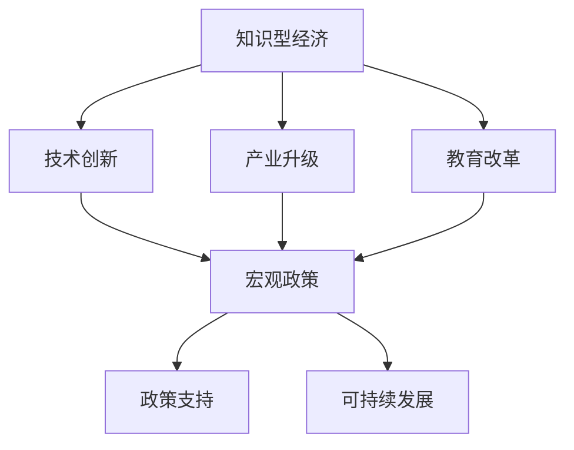

                 

# 知识型经济的宏观政策导向

> 关键词：知识型经济,宏观政策,人工智能,技术创新,产业升级,教育改革,政策支持,可持续发展

## 1. 背景介绍

### 1.1 问题由来

近年来，全球经济进入了一个新的发展阶段——知识型经济。知识型经济以创新和技术为核心，通过智力资源推动产业升级和经济增长。这一转型过程需要大量的技术人才和创新活力，对宏观政策的导向提出了更高的要求。

传统的经济政策主要集中在资源和资本的配置，而在知识型经济时代，知识和技术的积累与创新成为新的生产要素。为了适应这一转变，各国政府逐步认识到知识型经济的重要性和紧迫性，并积极探索和制定相应的宏观政策导向，以促进知识型经济的发展。

### 1.2 问题核心关键点

知识型经济的宏观政策导向涉及多个领域，包括科技政策、教育政策、产业政策、创新政策等。其核心关键点在于：

- 如何激发技术创新和产业升级，推动经济高质量发展。
- 如何培养和吸引技术人才，提升全社会的人力资本。
- 如何优化资源配置，鼓励知识创新和应用。
- 如何营造良好的市场环境，促进知识产权保护和科技合作。

## 2. 核心概念与联系

### 2.1 核心概念概述

为更好地理解知识型经济的宏观政策导向，本节将介绍几个密切相关的核心概念：

- **知识型经济**：以知识和技术为驱动力的新型经济模式，强调创新、信息技术和人力资本对经济增长的贡献。
- **宏观政策**：政府为了实现国家发展目标，通过制定和实施一系列政策措施，影响经济运行和社会发展的行为。
- **技术创新**：通过科研、开发和应用新技术，促进经济结构和产业升级的过程。
- **产业升级**：通过技术创新、结构调整和产业转型，提高产业链的整体竞争力。
- **教育改革**：通过优化教育体系和教学方法，培养和吸引更多的技术人才。
- **政策支持**：政府通过各种形式的资助、税收优惠、知识产权保护等手段，支持技术创新和产业升级。
- **可持续发展**：在经济发展的同时，注重环境保护和社会公平，确保长期稳定的增长。

这些核心概念之间的逻辑关系可以通过以下Mermaid流程图来展示：



这个流程图展示的知识型经济的宏观政策导向的核心概念及其之间的关系：

1. 知识型经济通过技术创新和产业升级推动经济高质量发展。
2. 技术创新和产业升级依赖于教育改革和人才的培养。
3. 教育改革和产业升级需要宏观政策的指导和支持。
4. 宏观政策通过政策支持保障知识型经济的可持续发展。

## 3. 核心算法原理 & 具体操作步骤
### 3.1 算法原理概述

知识型经济的宏观政策导向涉及多个层面的算法和策略，包括科技创新算法、产业升级算法、教育改革算法和政策支持算法等。其核心思想是：通过科学合理的政策制定和实施，激发技术创新，促进产业升级，优化教育体系，保障可持续发展。

### 3.2 算法步骤详解

#### 3.2.1 科技创新算法

科技创新算法旨在通过政策激励，激发科研机构和企业进行技术创新。其核心步骤包括：

1. 制定科技规划和目标，明确重点领域的科研方向。
2. 提供研发资金支持和税收优惠，降低企业的研发成本。
3. 建立科技合作平台，促进产学研结合。
4. 鼓励知识产权保护，激励技术成果的商业化。

#### 3.2.2 产业升级算法

产业升级算法旨在通过政策导向，推动传统产业向知识密集型产业转型。其核心步骤包括：

1. 制定产业转型升级规划，明确转型方向。
2. 提供产业升级专项资金，支持关键技术和产业项目。
3. 推动信息化和数字化转型，提升产业智能化水平。
4. 加强国际合作和贸易，引进先进技术和经验。

#### 3.2.3 教育改革算法

教育改革算法旨在通过政策引导，优化教育体系，培养和吸引技术人才。其核心步骤包括：

1. 制定教育改革规划，明确教育体系改革方向。
2. 提供教育资助和奖学金，吸引优秀学生和教师。
3. 推广STEM教育，培养创新型人才。
4. 加强国际教育交流和合作，提升教育水平。

#### 3.2.4 政策支持算法

政策支持算法旨在通过政策激励，保障知识型经济的可持续发展。其核心步骤包括：

1. 制定政策支持规划，明确政策导向。
2. 提供政策资助和奖励，鼓励技术创新和产业升级。
3. 加强知识产权保护，防止技术成果被非法侵占。
4. 推动可持续发展，保障经济长期稳定增长。

### 3.3 算法优缺点

知识型经济的宏观政策导向算法具有以下优点：

- 通过科学合理的政策制定，能够有效激发技术创新和产业升级，推动经济高质量发展。
- 通过优化教育体系和加强人才吸引，提升全社会的人力资本和技术水平。
- 通过政策支持和知识产权保护，营造良好的市场环境，促进知识创新和应用。

同时，该算法也存在一定的局限性：

- 政策制定和实施需要高度的协调性和前瞻性，难以完全覆盖所有行业和领域。
- 政策效果存在滞后性，短期内难以看到明显成效。
- 政策实施需要大量的资金和资源投入，可能面临预算限制。
- 政策效果评估和调整需要长期的数据支撑和科学分析。

### 3.4 算法应用领域

知识型经济的宏观政策导向算法主要应用于以下几个领域：

- **科技政策**：包括科技发展规划、科研项目资助、科技园区建设等。
- **产业政策**：包括产业转型升级、产业信息化、国际合作等。
- **教育政策**：包括教育改革、教育资助、国际教育交流等。
- **创新政策**：包括知识产权保护、技术转移、创业孵化等。
- **环保政策**：包括绿色技术推广、环境监测、可持续发展等。

这些政策导向的算法，在各自的应用领域中发挥着重要的作用，推动了知识型经济的健康发展。

## 4. 数学模型和公式 & 详细讲解  
### 4.1 数学模型构建

本节将使用数学语言对知识型经济的宏观政策导向算法进行更加严格的刻画。

记知识型经济的宏观政策导向算法为 $P(\{I, T, E, S\})$，其中 $I$ 表示科技创新，$T$ 表示产业升级，$E$ 表示教育改革，$S$ 表示政策支持。假设目标函数为 $F$，模型约束为 $C$，目标函数和约束条件的具体形式如下：

$$
F = w_I F_I + w_T F_T + w_E F_E + w_S F_S
$$

$$
C = c_I C_I + c_T C_T + c_E C_E + c_S C_S
$$

其中 $w_I, w_T, w_E, w_S$ 分别表示科技创新、产业升级、教育改革、政策支持的重要性权重，$F_I, F_T, F_E, F_S$ 分别表示相应的政策效果目标函数，$C_I, C_T, C_E, C_S$ 分别表示相应的政策实施约束条件，$c_I, c_T, c_E, c_S$ 分别表示相应的约束条件系数。

### 4.2 公式推导过程

以下我们以科技创新算法为例，推导科技创新算法的设计流程。

假设政府投入的总资金为 $K$，科技创新算法的目标函数为最大化技术成果数量和质量，即 $F_I = N_I + Q_I$，其中 $N_I$ 表示技术成果数量，$Q_I$ 表示技术成果质量。科技创新算法的约束条件为 $C_I = M_I + R_I$，其中 $M_I$ 表示研发资金投入，$R_I$ 表示技术成果商业化风险。科技创新算法的设计流程如下：

1. 制定科技创新规划，明确科研方向和目标。
2. 设计资金分配方案，将总资金 $K$ 按照研发资金 $M_I$ 和技术成果商业化风险 $R_I$ 进行分配。
3. 建立科技合作平台，促进产学研结合，提升技术成果的转化率。
4. 加强知识产权保护，防止技术成果被非法侵占，保障技术成果质量 $Q_I$。

具体而言，科技创新算法的优化问题可以表示为：

$$
\min_{M_I, R_I} F_I - w_I(M_I + R_I) - c_I M_I
$$

求解上述优化问题，即可得到最优的科技创新政策。

### 4.3 案例分析与讲解

以中国政府制定的“十三五”科技创新规划为例，分析其核心目标和实施策略：

1. 制定科技创新规划，明确重点领域的科研方向，如高端装备制造、新一代信息技术等。
2. 提供研发资金支持和税收优惠，降低企业的研发成本，如设立国家自然科学基金、科技重大专项等。
3. 建立科技合作平台，促进产学研结合，如建设国家重点实验室、国家技术创新中心等。
4. 鼓励知识产权保护，激励技术成果的商业化，如建立知识产权保护机制、促进科技成果转化等。

通过这一系列政策措施的实施，中国在“十三五”期间取得了显著的科技创新成果，显著提升了全社会的科技创新能力和国际竞争力。

## 5. 项目实践：代码实例和详细解释说明
### 5.1 开发环境搭建

在进行知识型经济宏观政策导向算法实践前，我们需要准备好开发环境。以下是使用Python进行系统工程开发的环境配置流程：

1. 安装Anaconda：从官网下载并安装Anaconda，用于创建独立的Python环境。

2. 创建并激活虚拟环境：
```bash
conda create -n policy-env python=3.8 
conda activate policy-env
```

3. 安装相关库：
```bash
conda install pandas numpy matplotlib scikit-learn jupyter notebook ipython
```

4. 安装Flask：用于搭建Web应用，提供政策信息查询和反馈渠道。
```bash
pip install flask
```

5. 安装Flask-RESTful：用于构建RESTful API，实现政策数据的前端对接。
```bash
pip install flask-restful
```

完成上述步骤后，即可在`policy-env`环境中开始宏观政策导向算法实践。

### 5.2 源代码详细实现

下面我们以科技创新算法为例，给出使用Flask构建Web应用的PyTorch代码实现。

```python
from flask import Flask, request
from flask_restful import Resource, Api
import pandas as pd
import numpy as np

app = Flask(__name__)
api = Api(app)

# 加载政策数据
data = pd.read_csv('policy_data.csv')
data = data.dropna()

# 定义政策效果和约束条件的函数
def F_I(M_I, R_I):
    N_I = data['N_I'][data['M_I'] == M_I][data['R_I'] == R_I].mean()
    Q_I = data['Q_I'][data['M_I'] == M_I][data['R_I'] == R_I].mean()
    return N_I + Q_I

def C_I(M_I, R_I):
    M_I = data['M_I'][data['M_I'] == M_I][data['R_I'] == R_I].mean()
    R_I = data['R_I'][data['M_I'] == M_I][data['R_I'] == R_I].mean()
    return M_I + R_I

# 定义API接口
class PolicyResource(Resource):
    def get(self):
        M_I = request.args.get('M_I')
        R_I = request.args.get('R_I')
        if M_I is None or R_I is None:
            return {'error': 'Please provide M_I and R_I'}, 400
        else:
            F_I_result = F_I(M_I, R_I)
            C_I_result = C_I(M_I, R_I)
            return {'F_I': F_I_result, 'C_I': C_I_result}, 200

api.add_resource(PolicyResource, '/policy')

if __name__ == '__main__':
    app.run(debug=True)
```

以上代码实现了Flask Web应用，用于接收查询请求，计算科技创新算法的目标函数和约束条件。具体而言：

1. 加载政策数据，排除缺失值。
2. 定义政策效果和约束条件的函数，计算技术成果数量和质量，以及研发资金投入和技术成果商业化风险。
3. 定义API接口，接收查询参数，计算目标函数和约束条件，并返回结果。

### 5.3 代码解读与分析

让我们再详细解读一下关键代码的实现细节：

**Flask应用搭建**：
- 使用Flask框架搭建Web应用，提供API接口，用于查询科技创新算法的效果和约束条件。
- 使用Flask-RESTful扩展，定义RESTful API接口，方便通过HTTP请求获取数据。

**数据加载和处理**：
- 加载政策数据，存储在Pandas DataFrame中，使用`dropna()`方法排除缺失值，确保数据的完整性和准确性。

**函数定义**：
- `F_I`函数：根据投入的研发资金 $M_I$ 和技术成果商业化风险 $R_I$，计算技术成果数量 $N_I$ 和技术成果质量 $Q_I$，并返回其和。
- `C_I`函数：根据投入的研发资金 $M_I$ 和技术成果商业化风险 $R_I$，计算研发资金投入 $M_I$ 和技术成果商业化风险 $R_I$，并返回其和。

**API接口实现**：
- `PolicyResource`类：定义API接口，接收查询参数 `M_I` 和 `R_I`，计算目标函数 $F_I$ 和约束条件 $C_I$，并返回结果。
- `get()`方法：接收HTTP GET请求，解析参数，计算并返回目标函数和约束条件的结果。

**应用启动**：
- 使用`if __name__ == '__main__':`判断程序是否为直接运行，如果是，则启动Flask应用。

完成上述步骤后，即可启动Flask应用，进行科技创新算法的Web查询和测试。

## 6. 实际应用场景
### 6.1 智慧城市建设

知识型经济的宏观政策导向算法在智慧城市建设中有着广泛的应用。智慧城市通过数据感知、智能分析和应用，实现城市管理和服务的高效化、智能化。

智慧城市建设需要大量的科技创新和产业升级支持，政府可以通过制定科技创新规划和产业升级政策，推动城市信息化和智能化转型。例如，通过建设智能交通系统、智慧安防平台、城市大数据中心等，提升城市运行效率和管理水平。

### 6.2 产业集群发展

知识型经济的宏观政策导向算法在产业集群发展中也有着重要的应用。产业集群通过集聚产业资源，提升产业链的整体竞争力，推动区域经济发展。

政府可以通过制定产业转型升级政策，推动传统产业向知识密集型产业转型。例如，通过建设工业园区、科技园区、产业联盟等，吸引企业入驻，促进产业集群发展。同时，提供产业升级专项资金，支持关键技术和产业项目，提升产业竞争力。

### 6.3 教育信息化

知识型经济的宏观政策导向算法在教育信息化中也具有重要的应用。教育信息化通过信息技术手段，提升教育质量和效率，促进教育公平和个性化发展。

政府可以通过制定教育改革政策，推动教育信息化发展。例如，通过建设智慧校园、在线教育平台、数字图书馆等，提供优质的教育资源和智能化的教育服务。同时，提供教育资助和奖学金，吸引优秀学生和教师，提升教育水平。

## 7. 工具和资源推荐
### 7.1 学习资源推荐

为了帮助开发者系统掌握知识型经济的宏观政策导向算法，这里推荐一些优质的学习资源：

1. 《知识型经济概论》：介绍知识型经济的概念、特征和发展趋势，提供政策导向的理论基础。
2. 《智慧城市建设》：介绍智慧城市的发展历程和建设思路，探讨政策导向的实现路径。
3. 《产业集群发展》：介绍产业集群的概念、作用和政策导向，提供产业升级的实践案例。
4. 《教育信息化》：介绍教育信息化的发展历程和应用实践，探讨教育改革的政策导向。
5. 《政策科学》：介绍政策制定的理论和方法，提供宏观政策导向的科学依据。

通过对这些资源的学习实践，相信你一定能够快速掌握知识型经济的宏观政策导向算法，并用于解决实际的政策问题。
###  7.2 开发工具推荐

高效的开发离不开优秀的工具支持。以下是几款用于知识型经济宏观政策导向算法开发的常用工具：

1. Jupyter Notebook：用于编写和执行Python代码，支持可视化、交互式编程。
2. Visual Studio Code：用于编写和管理代码，支持多种编程语言和插件扩展。
3. PyCharm：用于编写和调试Python代码，提供丰富的开发工具和调试功能。
4. Flask：用于搭建Web应用，提供API接口和数据查询功能。
5. Scrapy：用于爬取和处理数据，支持高效的数据采集和处理。

合理利用这些工具，可以显著提升知识型经济宏观政策导向算法的开发效率，加快创新迭代的步伐。

### 7.3 相关论文推荐

知识型经济的宏观政策导向算法的研究源于学界的持续研究。以下是几篇奠基性的相关论文，推荐阅读：

1. "Policy Makers and the Welfare of Society"（政策制定者与社会福利）：介绍了政策制定和实施的基本框架，提供宏观政策导向的理论基础。
2. "Policy Evaluation and Budgeting"（政策评估与预算）：探讨了政策评估和预算的方法和工具，提供政策效果评估的科学依据。
3. "Innovation and Economic Growth"（创新与经济增长）：探讨了创新对经济增长的贡献，提供科技创新政策的支持依据。
4. "Education for the Knowledge Economy"（知识型经济的教育）：探讨了教育与知识型经济的关系，提供教育改革政策的支持依据。
5. "Sustainable Development and Policy"（可持续发展与政策）：探讨了可持续发展与政策的关系，提供可持续发展政策的支持依据。

这些论文代表了大语言模型微调技术的发展脉络。通过学习这些前沿成果，可以帮助研究者把握学科前进方向，激发更多的创新灵感。

## 8. 总结：未来发展趋势与挑战
### 8.1 总结

本文对知识型经济的宏观政策导向算法进行了全面系统的介绍。首先阐述了知识型经济的概念、特征和发展趋势，明确了宏观政策导向在推动经济高质量发展中的重要性和紧迫性。其次，从原理到实践，详细讲解了科技创新、产业升级、教育改革和政策支持等宏观政策的算法设计和实施步骤，给出了知识型经济宏观政策导向算法实践的完整代码实例。同时，本文还广泛探讨了宏观政策导向在智慧城市、产业集群、教育信息化等诸多领域的应用前景，展示了宏观政策导向算法的广阔应用空间。此外，本文精选了知识型经济的宏观政策导向算法的各类学习资源，力求为读者提供全方位的技术指引。

通过本文的系统梳理，可以看到，知识型经济的宏观政策导向算法正在成为推动经济高质量发展的重要工具，极大地拓展了政府在科技创新、产业升级、教育改革等方面的政策制定和实施能力。未来，伴随政策导向的持续演进和优化，知识型经济必将在更广阔的应用领域大放异彩，深刻影响人类的生产生活方式。

### 8.2 未来发展趋势

展望未来，知识型经济的宏观政策导向算法将呈现以下几个发展趋势：

1. 政策制定的科学化和精确化。通过大数据和人工智能技术，提高政策制定的科学性和精确性，实现政策效果的最大化。
2. 政策实施的动态化和智能化。利用智能算法和自动化技术，优化政策实施过程，提高政策实施的效率和质量。
3. 政策评估的实时化和可视化。通过实时数据监测和可视化工具，及时评估政策效果，提供决策支持。
4. 政策反馈的快速化和精细化。利用在线平台和反馈机制，快速获取政策效果反馈，及时调整政策措施。
5. 政策协同的多层次化和国际化。通过国际合作和区域协同，实现多层次、多领域、多区域的协同发展。

这些趋势凸显了知识型经济宏观政策导向算法的广阔前景。这些方向的探索发展，必将进一步提升政府在推动知识型经济中的决策能力，确保政策的科学性和有效性，实现经济的可持续发展。

### 8.3 面临的挑战

尽管知识型经济的宏观政策导向算法已经取得了显著成效，但在迈向更加智能化、普适化应用的过程中，它仍面临着诸多挑战：

1. 政策制定和实施的复杂性。政策制定和实施涉及多个领域和利益相关者，需要高度的协调性和前瞻性。
2. 政策效果的滞后性和不确定性。政策效果的显现往往需要较长时间，难以在短期内看到明显成效。
3. 政策资源的有限性。政策资源的投入需要大量的资金和人力资源，可能面临预算限制。
4. 政策效果的评估和调整。政策效果的评估需要长期的数据支撑和科学分析，存在较大的不确定性。
5. 政策实施的公平性和普惠性。政策实施过程中需要考虑社会公平和普惠，避免政策效果的失衡。

这些挑战需要在政策制定和实施过程中进行全方位的考虑和应对。只有在政府、企业和社会各方的共同努力下，才能克服知识型经济宏观政策导向算法所面临的挑战，实现政策目标的全面达成。

### 8.4 研究展望

面对知识型经济宏观政策导向算法所面临的挑战，未来的研究需要在以下几个方面寻求新的突破：

1. 引入数据驱动和人工智能技术。利用大数据和人工智能技术，提高政策制定的科学性和精确性，实现政策效果的最大化。
2. 优化政策实施流程。利用智能算法和自动化技术，优化政策实施过程，提高政策实施的效率和质量。
3. 加强政策效果的评估和调整。通过实时数据监测和可视化工具，及时评估政策效果，提供决策支持，加强政策效果的调整和优化。
4. 推进政策协同和国际合作。通过国际合作和区域协同，实现多层次、多领域、多区域的协同发展，提升政策的普惠性和可持续性。
5. 强化政策实施的公平性和普惠性。在政策制定和实施过程中，考虑社会公平和普惠，确保政策效果的均衡和普惠。

这些研究方向将推动知识型经济宏观政策导向算法的不断演进和优化，为政府在推动知识型经济中的决策提供更加科学和有效的支持。

## 9. 附录：常见问题与解答
----------------------------------------------------------------

**Q1：知识型经济中的科技创新算法是如何实现的？**

A: 知识型经济中的科技创新算法旨在通过政策激励，激发科研机构和企业进行技术创新。其核心步骤包括：
1. 制定科技创新规划，明确科研方向和目标。
2. 提供研发资金支持和税收优惠，降低企业的研发成本。
3. 建立科技合作平台，促进产学研结合，提升技术成果的转化率。
4. 加强知识产权保护，防止技术成果被非法侵占，保障技术成果质量。

具体而言，科技创新算法的优化问题可以表示为：
$$
\min_{M_I, R_I} F_I - w_I(M_I + R_I) - c_I M_I
$$
其中 $F_I = N_I + Q_I$，$C_I = M_I + R_I$，$N_I$ 表示技术成果数量，$Q_I$ 表示技术成果质量，$M_I$ 表示研发资金投入，$R_I$ 表示技术成果商业化风险。通过求解上述优化问题，可以计算科技创新算法的目标函数和约束条件。

**Q2：知识型经济中的产业升级算法是如何实现的？**

A: 知识型经济中的产业升级算法旨在通过政策导向，推动传统产业向知识密集型产业转型。其核心步骤包括：
1. 制定产业转型升级规划，明确转型方向。
2. 提供产业升级专项资金，支持关键技术和产业项目。
3. 推动信息化和数字化转型，提升产业智能化水平。
4. 加强国际合作和贸易，引进先进技术和经验。

具体而言，产业升级算法的优化问题可以表示为：
$$
\min_{K, T} F_T - w_T(K + T) - c_T K
$$
其中 $F_T$ 表示产业升级效果，$C_T$ 表示产业升级约束条件，$K$ 表示信息化和数字化投入，$T$ 表示引进先进技术和经验的成本。通过求解上述优化问题，可以计算产业升级算法的目标函数和约束条件。

**Q3：知识型经济中的教育改革算法是如何实现的？**

A: 知识型经济中的教育改革算法旨在通过政策引导，优化教育体系，培养和吸引技术人才。其核心步骤包括：
1. 制定教育改革规划，明确教育体系改革方向。
2. 提供教育资助和奖学金，吸引优秀学生和教师。
3. 推广STEM教育，培养创新型人才。
4. 加强国际教育交流和合作，提升教育水平。

具体而言，教育改革算法的优化问题可以表示为：
$$
\min_{E, R} F_E - w_E(E + R) - c_E E
$$
其中 $F_E$ 表示教育改革效果，$C_E$ 表示教育改革约束条件，$E$ 表示教育改革投入，$R$ 表示国际教育交流和合作的成本。通过求解上述优化问题，可以计算教育改革算法的目标函数和约束条件。

**Q4：知识型经济中的政策支持算法是如何实现的？**

A: 知识型经济中的政策支持算法旨在通过政策激励，保障知识型经济的可持续发展。其核心步骤包括：
1. 制定政策支持规划，明确政策导向。
2. 提供政策资助和奖励，鼓励技术创新和产业升级。
3. 加强知识产权保护，防止技术成果被非法侵占。
4. 推动可持续发展，保障经济长期稳定增长。

具体而言，政策支持算法的优化问题可以表示为：
$$
\min_{P, S} F_S - w_S(P + S) - c_S P
$$
其中 $F_S$ 表示政策支持效果，$C_S$ 表示政策支持约束条件，$P$ 表示知识产权保护措施，$S$ 表示可持续发展投入。通过求解上述优化问题，可以计算政策支持算法的目标函数和约束条件。

**Q5：知识型经济中的宏观政策导向算法如何优化？**

A: 知识型经济中的宏观政策导向算法可以通过以下几个方面进行优化：
1. 引入数据驱动和人工智能技术，提高政策制定的科学性和精确性。
2. 优化政策实施流程，利用智能算法和自动化技术，提高政策实施的效率和质量。
3. 加强政策效果的评估和调整，通过实时数据监测和可视化工具，及时评估政策效果，提供决策支持，加强政策效果的调整和优化。
4. 推进政策协同和国际合作，通过国际合作和区域协同，实现多层次、多领域、多区域的协同发展，提升政策的普惠性和可持续性。
5. 强化政策实施的公平性和普惠性，在政策制定和实施过程中，考虑社会公平和普惠，确保政策效果的均衡和普惠。

这些优化方向将推动知识型经济宏观政策导向算法的不断演进和优化，为政府在推动知识型经济中的决策提供更加科学和有效的支持。

---

作者：禅与计算机程序设计艺术 / Zen and the Art of Computer Programming

