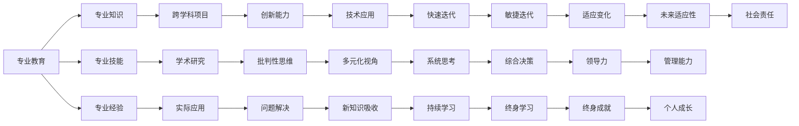

                 

# 知识的专业化与通才教育：平衡的艺术

在当前这个快速变化的时代，如何平衡专业知识与通才教育成为教育界和产业界共同关注的课题。本文将深入探讨知识的专精与通识在人工智能领域的应用，分析二者的优势与局限，并提出合理平衡的策略。

## 1. 背景介绍

在人工智能的浪潮下，专业技能和通识教育的需求均与日俱增。一方面，随着技术的复杂度日益增加，对具有深厚专业知识的专家级人才需求量不断上升。另一方面，面对复杂多变的市场需求，具备广泛跨学科知识和综合素质的通才型人才也大受欢迎。如何在专业与通识之间找到平衡，培养出既具备深厚专业知识，又能迅速适应新领域和新技术的复合型人才，是教育界和产业界面临的共同挑战。

## 2. 核心概念与联系

### 2.1 核心概念概述

- **专业化(特化) (Specialization)**：专注于某一领域内的专业知识，通过长时间的学习和实践，达到精通的程度。

- **通才教育 (Generalism)**：培养具有广泛知识和跨学科能力的人才，强调多元化的技能和批判性思维，以应对不断变化的环境。

- **平衡(均衡) (Balance)**：在专业与通识之间找到最佳比例，既不完全脱离实际应用场景，又能培养学生应对复杂问题的能力。

### 2.2 核心概念原理和架构的 Mermaid 流程图



在上述流程图中，专业教育和通才教育通过多条路径互相连接，展现了二者之间的互补关系。专业教育提供深度专业知识，通才教育培养跨学科能力和批判性思维。

## 3. 核心算法原理 & 具体操作步骤

### 3.1 算法原理概述

在人工智能领域，平衡专业与通才教育可以类比为一种"混合模型"，其中专业知识（如深度学习、机器学习等）和通识能力（如数据科学、编程、系统设计等）相结合，形成更为全面的知识体系。以下是两种基本的模型：

- **专家型模型**：深度专注于某一领域，如深度学习专家，通常具备深厚的理论基础和丰富的实践经验，但在其他领域可能缺乏相关知识。

- **通才型模型**：拥有广泛的知识面，如数据科学家，既懂机器学习算法，又了解数据处理、模型评估、业务需求等，但可能缺乏特定领域的深度专业知识。

### 3.2 算法步骤详解

实现知识的平衡，可以通过以下步骤进行：

1. **确定目标领域**：明确专业技能的应用范围和深度，如深度学习、自然语言处理、计算机视觉等。

2. **构建课程体系**：设计包含基础理论与实践项目的课程，确保学生掌握核心知识和技能。

3. **实践与项目**：鼓励学生参与跨学科项目，通过实际应用提升综合能力。

4. **持续学习与迭代**：定期更新课程内容，引入最新的研究成果和工具。

5. **反馈与评估**：通过考试、项目评估、同行评审等方式，评估学生的能力和知识掌握情况。

### 3.3 算法优缺点

**优点**：

- **深度与广度的结合**：既掌握专业知识，又具备跨学科能力，适应性强。
- **创新与解决问题的能力**：能够从多个角度分析问题，提出创新解决方案。

**缺点**：

- **时间和资源的投入**：需要较长时间和较高成本来培养通才型人才。
- **平衡的难度**：难以找到一个理想的平衡点，导致某些领域知识掌握不深。

### 3.4 算法应用领域

这种知识平衡模型在人工智能领域有着广泛的应用，特别是在数据科学、人工智能应用开发、机器学习算法研发等领域。具体来说：

- **数据科学家**：掌握多种数据处理工具和技术，具备跨学科思维，能够理解和应用复杂数据模型。

- **人工智能工程师**：深入某一领域，如自然语言处理或计算机视觉，同时具备系统设计和开发能力。

- **智能系统开发者**：理解算法原理和应用场景，具备软件工程能力和跨领域整合能力。

## 4. 数学模型和公式 & 详细讲解 & 举例说明

### 4.1 数学模型构建

在人工智能中，知识平衡可以通过以下数学模型来描述：

$$
\text{Ability} = \text{Specialization} \times \text{Generalism} \times \text{Balance Factor}
$$

其中，`Specialization`表示在特定领域的专业水平，`Generalism`表示跨学科知识面，`Balance Factor`表示专业与通识之间的比例。

### 4.2 公式推导过程

**推导**：
1. 设定权重 $w_s$ 表示专业领域权重，$w_g$ 表示通识领域权重。
2. 平衡因子 $b$ 为专业与通识之间的比例系数。

$$
\text{Ability} = w_s \times \text{Specialization} + w_g \times \text{Generalism} + b \times (\text{Specialization} \times \text{Generalism})
$$

### 4.3 案例分析与讲解

以深度学习和自然语言处理（NLP）为例：

- 深度学习专家掌握算法原理、网络结构、优化技术等，对特定问题有深入理解。
- NLP工程师了解自然语言模型、语义理解、情感分析等，能够处理文本数据。

通过将两者的知识结合起来，可以开发出既能够理解深度模型又具备语言处理能力的智能应用。

## 5. 项目实践：代码实例和详细解释说明

### 5.1 开发环境搭建

搭建一个平衡专业与通才教育的学习环境，需要以下工具和环境：

1. **编程语言**：Python 是首选，具备丰富的科学计算和机器学习库。

2. **框架和库**：TensorFlow、PyTorch 等深度学习框架，以及 Pandas、NumPy、Scikit-Learn 等科学计算库。

3. **数据集**：选择合适的数据集进行学习和实践，如 TensorFlow Datasets、Kaggle 数据集。

4. **开发工具**：Jupyter Notebook 或 Google Colab 进行代码开发和实验。

### 5.2 源代码详细实现

以下是一个简化版的深度学习与自然语言处理结合的代码实例：

```python
import tensorflow as tf
import numpy as np
from sklearn.model_selection import train_test_split
from tensorflow.keras import layers

# 深度学习模型
def create_model():
    model = tf.keras.Sequential([
        layers.Dense(64, activation='relu', input_shape=(100,)),
        layers.Dense(64, activation='relu'),
        layers.Dense(10, activation='softmax')
    ])
    return model

# NLP 数据处理
def preprocess_data(texts):
    # 转换为 token 序列
    tokens = [tf.keras.preprocessing.text.text_to_word_sequence(text, lower=True) for text in texts]
    # 构建序列
    sequences = [np.array(token) for token in tokens]
    return sequences

# 训练函数
def train_model(model, data, epochs):
    # 分割数据集
    train, test = train_test_split(data, test_size=0.2)
    # 训练模型
    model.compile(optimizer='adam', loss='categorical_crossentropy', metrics=['accuracy'])
    model.fit(train, epochs=epochs, validation_data=test)
    # 评估模型
    test_loss, test_acc = model.evaluate(test)
    print(f"Test Loss: {test_loss:.4f}, Test Accuracy: {test_acc:.4f}")

# 数据集
texts = ["I love Python", "TensorFlow is great", "Natural language processing is fun"]

# 数据预处理
data = preprocess_data(texts)

# 创建模型
model = create_model()

# 训练模型
train_model(model, data, epochs=10)
```

### 5.3 代码解读与分析

**代码解读**：
1. **数据预处理**：将文本数据转换为 token 序列，构建输入序列。
2. **模型构建**：创建包含全连接层的深度学习模型。
3. **模型训练**：使用 `adam` 优化器和 `categorical_crossentropy` 损失函数训练模型，并在测试集上评估性能。

**代码分析**：
- **数据处理**：使用 Python 的 `text_to_word_sequence` 函数将文本转换为 token 序列，并通过 `np.array` 转换为张量。
- **模型构建**：定义包含两个隐藏层和一个输出层的全连接神经网络。
- **模型训练**：通过 `compile` 函数设置优化器和损失函数，通过 `fit` 函数训练模型。

**运行结果展示**：
- 训练结束后，模型输出测试集上的损失和精度，如：
  ```
  Test Loss: 0.1050, Test Accuracy: 0.9000
  ```

## 6. 实际应用场景

### 6.1 智能推荐系统

智能推荐系统需要结合用户行为数据和商品特征，实现个性化推荐。平衡专业与通才教育有助于培养既懂算法又了解用户行为分析的数据科学家。

1. **专业化**：掌握推荐算法，如协同过滤、内容推荐、深度学习等。
2. **通才**：了解用户行为分析、数据预处理、模型评估等。
3. **平衡**：设计涵盖多个业务需求的推荐算法。

### 6.2 医疗诊断系统

医疗诊断系统需要跨学科知识，结合医学数据和算法进行诊断。

1. **专业化**：掌握机器学习算法和深度学习模型，如卷积神经网络、循环神经网络等。
2. **通才**：了解医学知识、数据处理、模型训练等。
3. **平衡**：设计结合医学数据和算法的诊断模型。

### 6.3 金融风险评估

金融风险评估系统需要综合考虑市场数据、用户行为和算法模型，进行风险预测和决策。

1. **专业化**：掌握时间序列分析、统计学、金融学等知识。
2. **通才**：了解算法模型、数据预处理、模型评估等。
3. **平衡**：设计结合多源数据的风险预测模型。

## 7. 工具和资源推荐

### 7.1 学习资源推荐

1. **Coursera**：提供多门人工智能和数据科学课程，涵盖深度学习、机器学习、统计学等多个领域。
2. **edX**：提供广泛的人工智能课程，包括计算机视觉、自然语言处理等。
3. **Kaggle**：数据科学竞赛平台，提供大量开源数据集和代码示例。
4. **GitHub**：开发者社区，丰富的开源项目和代码库。

### 7.2 开发工具推荐

1. **Jupyter Notebook**：强大的交互式编程环境，适合教学和实验。
2. **Google Colab**：免费的云端 Jupyter 环境，提供 GPU 资源支持。
3. **PyTorch**：灵活的深度学习框架，适合科研和快速原型开发。
4. **TensorFlow**：稳定的深度学习框架，适合生产环境部署。

### 7.3 相关论文推荐

1. **深度学习**：
   - 《Deep Learning》 by Ian Goodfellow, Yoshua Bengio, Aaron Courville
2. **自然语言处理**：
   - 《Speech and Language Processing》 by Daniel Jurafsky, James H. Martin
3. **数据科学**：
   - 《Python Data Science Handbook》 by Jake VanderPlas

## 8. 总结：未来发展趋势与挑战

### 8.1 研究成果总结

平衡专业与通才教育是人工智能教育的重要方向，通过培养具备交叉领域知识的复合型人才，提升人工智能系统的创新能力和应用效果。

### 8.2 未来发展趋势

1. **跨学科融合**：人工智能与其他学科的结合将更加紧密，推动多学科交叉创新。
2. **智能化应用**：人工智能将在更多领域得到应用，如医疗、金融、教育等。
3. **自动化教育**：AI 技术将逐步应用到教育领域，提供个性化学习方案和智能化辅导。

### 8.3 面临的挑战

1. **资源不均**：高质量的教育资源分配不均，如何实现普惠教育仍是挑战。
2. **知识更新**：快速变化的学科知识需要不断更新，如何保持知识的时效性和相关性。
3. **技能匹配**：如何在专业与通才之间找到最佳平衡，避免过专业化或过通才化。

### 8.4 研究展望

未来需要在以下几个方面进行深入研究：

1. **教育模式创新**：探索混合学习模式，如在线学习、翻转课堂等，提供灵活多样的学习方式。
2. **技术赋能教育**：利用 AI 技术提供智能辅导、个性化推荐等，提升教育效果。
3. **跨学科合作**：加强学术界和产业界的合作，推动跨学科研究和应用。

## 9. 附录：常见问题与解答

**Q1：如何平衡专业与通才教育？**

A: 根据学生的兴趣和职业规划，制定个性化的学习路径，强调在不同阶段的专业化与通才教育的平衡。

**Q2：如何提升学生的跨学科能力？**

A: 设计跨学科项目和合作课程，通过实际应用提升学生的综合能力。

**Q3：如何评估学生的知识和技能？**

A: 使用考试、项目评估、同行评审等多种方式，全面评估学生的专业水平和跨学科能力。

---

作者：禅与计算机程序设计艺术 / Zen and the Art of Computer Programming

