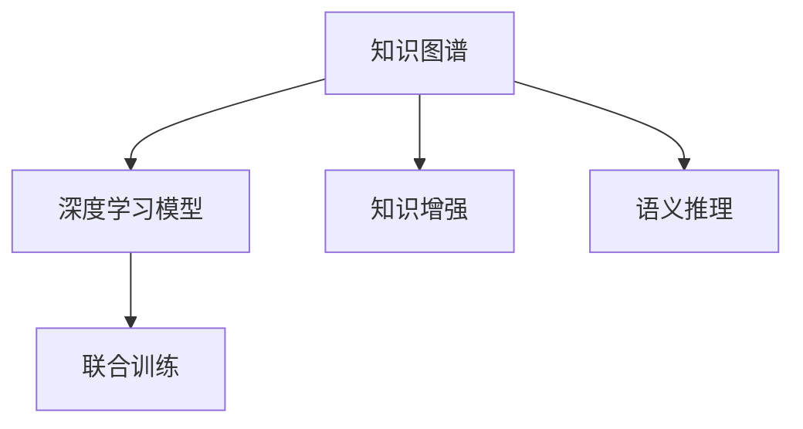

                 

## 1. 背景介绍

### 1.1 问题由来

在过去的几十年里，人工智能(AI)技术取得了长足的进步，从最初的专家系统到现代的深度学习，AI的范式已经发生了显著的变化。在深度学习的推动下，机器学习模型在图像识别、语音识别、自然语言处理(NLP)、推荐系统等领域取得了令人瞩目的成绩。然而，这些模型往往依赖于大量的标注数据和强大的计算资源，难以适应实时动态的业务需求。

在实践中，知识图谱(Knowledge Graph)成为一种重要的AI技术，通过构建语义化的知识网络，提供了人类知识的机器表示。与传统基于统计的数据驱动模型不同，知识图谱的知识表示方法更加强调概念之间的关系和语义推理，能够处理复杂的人类逻辑和推理过程。因此，如何将知识图谱与深度学习模型相结合，实现知识的人工智能模拟，成为当前AI领域的一个重要研究课题。

### 1.2 问题核心关键点

将知识图谱与深度学习模型相结合，涉及到以下几个核心关键点：

1. **知识融合**：如何将知识图谱中的结构化知识与深度学习模型中的非结构化知识进行有效融合，实现模型的知觉与理解能力。
2. **语义推理**：如何构建基于知识图谱的语义推理机制，使得模型能够进行逻辑推断和因果分析，提升模型的解释性和可信度。
3. **训练优化**：如何利用知识图谱中的关系信息，优化模型的训练过程，提高模型的泛化能力和鲁棒性。
4. **推理计算**：如何高效地计算基于知识图谱的推理过程，使得模型能够在实时应用中迅速响应。
5. **系统集成**：如何将知识图谱与业务系统集成，实现系统的智能化和自动化，提升系统的决策和处理能力。

这些关键点共同构成了知识图谱与深度学习相结合的研究框架，旨在实现知识的人工智能模拟，为AI技术在实际应用中提供强大的支持。

### 1.3 问题研究意义

知识图谱与深度学习相结合的研究，对于推动AI技术的实际应用具有重要意义：

1. **提升模型性能**：知识图谱能够提供更加丰富的语义信息，提高模型的推理能力和泛化性能。
2. **增强模型解释性**：知识图谱使得模型能够通过逻辑推理和因果分析提供更准确的解释，提升模型的可信度。
3. **降低数据依赖**：知识图谱能够提供知识驱动的推理机制，减少对标注数据的依赖，提升模型的数据利用效率。
4. **加速知识获取**：知识图谱能够自动获取和更新知识，加速模型的知识获取和推理过程。
5. **拓展应用场景**：知识图谱与深度学习相结合，能够拓展AI技术在更多场景中的应用，如医疗、金融、教育等。

## 2. 核心概念与联系

### 2.1 核心概念概述

为了更好地理解知识图谱与深度学习相结合的方法，本节将介绍几个关键概念及其联系：

- **知识图谱**：一种语义化的知识表示方法，通过构建节点和边的结构化知识网络，表示实体、属性和关系等概念。
- **深度学习模型**：一类基于神经网络的机器学习模型，能够通过多层非线性变换处理复杂的数据和非结构化信息。
- **知识增强**：将知识图谱中的知识与深度学习模型相结合，提升模型的推理能力和泛化性能。
- **语义推理**：基于知识图谱的逻辑推理和因果分析，使得模型能够进行复杂的人类逻辑和推理过程。
- **联合训练**：将知识图谱与深度学习模型联合训练，优化模型的知识表示和推理能力。

这些概念之间的逻辑关系可以通过以下Mermaid流程图来展示：



这个流程图展示了知识图谱与深度学习模型的核心概念及其相互联系：

1. 知识图谱通过构建结构化的知识网络，为深度学习模型提供了丰富的语义信息。
2. 深度学习模型通过多层非线性变换，处理和理解知识图谱中的复杂信息。
3. 知识增强使得模型能够通过知识图谱进行推理和泛化，提升模型的泛化能力和鲁棒性。
4. 语义推理基于知识图谱的逻辑推理和因果分析，使得模型能够进行复杂的人类逻辑和推理过程。
5. 联合训练将知识图谱与深度学习模型联合训练，优化模型的知识表示和推理能力。

这些概念共同构成了知识图谱与深度学习相结合的研究框架，为实现知识的人工智能模拟提供了理论基础和实现手段。

## 3. 核心算法原理 & 具体操作步骤
### 3.1 算法原理概述

知识图谱与深度学习模型的结合，本质上是通过知识增强和语义推理机制，提升深度学习模型的性能和解释性。其核心思想是：将知识图谱中的结构化知识与深度学习模型的非结构化知识进行有效融合，构建基于知识图谱的语义推理机制，使得模型能够进行复杂的人类逻辑和推理过程，提升模型的推理能力和泛化性能。

形式化地，假设知识图谱为 $\mathcal{G}$，其中包含节点 $N$ 和边 $E$，节点表示实体，边表示实体之间的关系。假设深度学习模型为 $M_{\theta}$，其中 $\theta$ 为模型的参数。知识增强和语义推理的目标是找到最优参数 $\hat{\theta}$，使得模型 $M_{\hat{\theta}}$ 能够通过知识图谱 $\mathcal{G}$ 进行有效的推理和泛化：

$$
\hat{\theta}=\mathop{\arg\min}_{\theta} \mathcal{L}(M_{\theta},\mathcal{G})
$$

其中 $\mathcal{L}$ 为损失函数，用于衡量模型 $M_{\theta}$ 在知识图谱 $\mathcal{G}$ 上的推理能力。常见的损失函数包括交叉熵损失、均方误差损失等。

通过梯度下降等优化算法，联合训练过程不断更新模型参数 $\theta$，最小化损失函数 $\mathcal{L}$，使得模型 $M_{\hat{\theta}}$ 能够通过知识图谱 $\mathcal{G}$ 进行有效的推理和泛化。

### 3.2 算法步骤详解

知识图谱与深度学习模型结合的联合训练一般包括以下几个关键步骤：

**Step 1: 准备知识图谱和深度学习模型**
- 选择合适的知识图谱 $\mathcal{G}$ 作为推理的依据，如Wikipedia、DBpedia等。
- 选择合适的深度学习模型 $M_{\theta}$，如BERT、GPT等。

**Step 2: 设计推理机制**
- 根据任务需求，设计基于知识图谱的推理机制，如链推理、图卷积网络(GCN)等。
- 设计任务适配层，用于将知识图谱与深度学习模型进行融合。

**Step 3: 设置联合训练超参数**
- 选择合适的优化算法及其参数，如 AdamW、SGD 等，设置学习率、批大小、迭代轮数等。
- 设置正则化技术及强度，包括权重衰减、Dropout、Early Stopping 等。
- 确定冻结知识图谱参数的策略，如只微调顶层，或全部参数都参与微调。

**Step 4: 执行联合训练**
- 将知识图谱和深度学习模型结合，进行联合训练。
- 周期性在验证集上评估模型性能，根据性能指标决定是否触发 Early Stopping。
- 重复上述步骤直到满足预设的迭代轮数或 Early Stopping 条件。

**Step 5: 测试和部署**
- 在测试集上评估联合训练后模型 $M_{\hat{\theta}}$ 的性能，对比联合训练前后的推理能力提升。
- 使用联合训练后的模型对新样本进行推理预测，集成到实际的应用系统中。
- 持续收集新的数据，定期重新联合训练模型，以适应数据分布的变化。

以上是知识图谱与深度学习模型结合的联合训练的一般流程。在实际应用中，还需要针对具体任务的特点，对联合训练过程的各个环节进行优化设计，如改进推理目标函数，引入更多的正则化技术，搜索最优的超参数组合等，以进一步提升模型性能。

### 3.3 算法优缺点

知识图谱与深度学习模型结合的联合训练方法具有以下优点：

1. **提升推理能力**：知识图谱能够提供丰富的语义信息，提升模型的推理能力和泛化性能。
2. **增强解释性**：知识图谱使得模型能够通过逻辑推理和因果分析提供更准确的解释，提升模型的可信度。
3. **降低数据依赖**：知识图谱能够提供知识驱动的推理机制，减少对标注数据的依赖，提升模型的数据利用效率。
4. **加速知识获取**：知识图谱能够自动获取和更新知识，加速模型的知识获取和推理过程。

同时，该方法也存在一定的局限性：

1. **知识图谱构建难度**：知识图谱的构建和维护需要大量的人力和时间，成本较高。
2. **知识图谱稀疏性**：知识图谱往往存在大量的缺失和错误信息，影响推理效果。
3. **模型复杂性**：知识图谱与深度学习模型的结合增加了模型的复杂性，训练和推理过程较为繁琐。
4. **推理效率问题**：知识图谱的推理计算较为复杂，需要高效的算法支持，否则难以实现实时应用。

尽管存在这些局限性，但就目前而言，知识图谱与深度学习模型相结合的方法仍是大规模AI应用的重要范式。未来相关研究的重点在于如何进一步降低知识图谱构建成本，提高模型的推理效率，同时兼顾模型的可解释性和泛化能力。

### 3.4 算法应用领域

知识图谱与深度学习模型结合的联合训练方法，在多个领域得到了广泛的应用，例如：

- **自然语言处理(NLP)**：用于问答系统、文本摘要、情感分析等任务，能够利用知识图谱中的实体关系信息，提升模型的理解能力和生成能力。
- **图像识别**：通过将知识图谱中的图像信息与深度学习模型进行融合，提升模型的识别能力和推理能力。
- **推荐系统**：结合知识图谱中的用户行为和物品属性，提升推荐系统的个性化和多样性。
- **医疗健康**：通过构建医学知识图谱，提升医疗诊断和治疗方案的准确性和合理性。
- **金融服务**：利用金融知识图谱，提升风险评估、投资决策等金融应用的准确性和效率。
- **智能制造**：通过构建工业知识图谱，提升生产计划、质量控制等应用的效果。

除了上述这些经典任务外，知识图谱与深度学习模型的结合还被创新性地应用到更多场景中，如智能客服、智能交通、智能家居等，为AI技术带来了全新的突破。随着知识图谱和深度学习方法的不断进步，相信在更多领域，知识图谱与深度学习模型的结合将带来更多的创新和应用。

## 4. 数学模型和公式 & 详细讲解 & 举例说明

### 4.1 数学模型构建

本节将使用数学语言对知识图谱与深度学习模型联合训练的过程进行更加严格的刻画。

假设知识图谱为 $\mathcal{G}=(N,E)$，其中 $N$ 为实体节点集合，$E$ 为边集合。假设深度学习模型为 $M_{\theta}$，其中 $\theta$ 为模型的参数。知识图谱中的边表示实体之间的关系，可以表示为三元组 $(u,r,v)$，其中 $u$ 和 $v$ 为节点，$r$ 为关系。

定义模型 $M_{\theta}$ 在边 $(u,r,v)$ 上的推理能力为 $P_{\theta}(u,v)$，即模型预测节点 $u$ 和 $v$ 之间的推理关系 $r$。则知识图谱与深度学习模型的联合训练目标为：

$$
\hat{\theta}=\mathop{\arg\min}_{\theta} \mathcal{L}(M_{\theta},\mathcal{G})
$$

其中 $\mathcal{L}$ 为损失函数，用于衡量模型 $M_{\theta}$ 在知识图谱 $\mathcal{G}$ 上的推理能力。常见的损失函数包括交叉熵损失、均方误差损失等。

### 4.2 公式推导过程

以下我们以推理任务为例，推导知识图谱与深度学习模型联合训练的损失函数及其梯度的计算公式。

假设模型 $M_{\theta}$ 在边 $(u,r,v)$ 上的推理能力为 $P_{\theta}(u,v)$，定义为 $P_{\theta}(u,v)=\text{softmax}(A_{\theta}(u,v))$，其中 $A_{\theta}(u,v)$ 为模型输出关于关系 $r$ 的表示，$\text{softmax}$ 函数用于将输出转化为概率分布。

将推理能力 $P_{\theta}(u,v)$ 作为监督信号，进行联合训练。定义损失函数 $\mathcal{L}$ 为：

$$
\mathcal{L}(M_{\theta},\mathcal{G})=\frac{1}{|\mathcal{G}|}\sum_{(u,r,v)\in \mathcal{G}}\ell(P_{\theta}(u,v),y)
$$

其中 $y$ 为真实标签，$\ell$ 为损失函数，如交叉熵损失。

根据链式法则，损失函数对参数 $\theta$ 的梯度为：

$$
\frac{\partial \mathcal{L}(\theta)}{\partial \theta} = \frac{1}{|\mathcal{G}|}\sum_{(u,r,v)\in \mathcal{G}}\frac{\partial \ell(P_{\theta}(u,v),y)}{\partial P_{\theta}(u,v)}\frac{\partial P_{\theta}(u,v)}{\partial A_{\theta}(u,v)}\frac{\partial A_{\theta}(u,v)}{\partial \theta}
$$

其中 $\frac{\partial \ell(P_{\theta}(u,v),y)}{\partial P_{\theta}(u,v)}$ 为交叉熵损失对推理能力 $P_{\theta}(u,v)$ 的梯度，$\frac{\partial P_{\theta}(u,v)}{\partial A_{\theta}(u,v)}$ 为推理能力对模型输出的梯度，$\frac{\partial A_{\theta}(u,v)}{\partial \theta}$ 为模型输出对参数 $\theta$ 的梯度。

在得到损失函数的梯度后，即可带入参数更新公式，完成模型的迭代优化。重复上述过程直至收敛，最终得到适应知识图谱推理任务的最优模型参数 $\theta^*$。

## 5. 项目实践：代码实例和详细解释说明
### 5.1 开发环境搭建

在进行联合训练实践前，我们需要准备好开发环境。以下是使用Python进行PyTorch开发的环境配置流程：

1. 安装Anaconda：从官网下载并安装Anaconda，用于创建独立的Python环境。

2. 创建并激活虚拟环境：
```bash
conda create -n pytorch-env python=3.8 
conda activate pytorch-env
```

3. 安装PyTorch：根据CUDA版本，从官网获取对应的安装命令。例如：
```bash
conda install pytorch torchvision torchaudio cudatoolkit=11.1 -c pytorch -c conda-forge
```

4. 安装Transformers库：
```bash
pip install transformers
```

5. 安装各类工具包：
```bash
pip install numpy pandas scikit-learn matplotlib tqdm jupyter notebook ipython
```

完成上述步骤后，即可在`pytorch-env`环境中开始联合训练实践。

### 5.2 源代码详细实现

下面我们以基于知识图谱的问答系统为例，给出使用Transformers库对BERT模型进行联合训练的PyTorch代码实现。

首先，定义问答系统的数据处理函数：

```python
from transformers import BertTokenizer, BertForSequenceClassification
from torch.utils.data import Dataset
import torch

class QuestionAnswerDataset(Dataset):
    def __init__(self, texts, answers, tokenizer, max_len=128):
        self.texts = texts
        self.answers = answers
        self.tokenizer = tokenizer
        self.max_len = max_len
        
    def __len__(self):
        return len(self.texts)
    
    def __getitem__(self, item):
        text = self.texts[item]
        answer = self.answers[item]
        
        encoding = self.tokenizer(text, return_tensors='pt', max_length=self.max_len, padding='max_length', truncation=True)
        input_ids = encoding['input_ids'][0]
        attention_mask = encoding['attention_mask'][0]
        
        # 对答案进行编码
        encoded_answer = self.tokenizer(answer, return_tensors='pt', max_length=self.max_len, padding='max_length', truncation=True)
        answer_input_ids = encoded_answer['input_ids'][0]
        answer_attention_mask = encoded_answer['attention_mask'][0]
        
        return {'input_ids': input_ids, 
                'attention_mask': attention_mask,
                'answer_input_ids': answer_input_ids,
                'answer_attention_mask': answer_attention_mask}

# 加载知识图谱数据
graph = load_knowledge_graph()
```

然后，定义模型和优化器：

```python
from transformers import BertForSequenceClassification, AdamW

model = BertForSequenceClassification.from_pretrained('bert-base-cased', num_labels=1)

optimizer = AdamW(model.parameters(), lr=2e-5)
```

接着，定义训练和评估函数：

```python
from torch.utils.data import DataLoader
from tqdm import tqdm
from sklearn.metrics import roc_auc_score

device = torch.device('cuda') if torch.cuda.is_available() else torch.device('cpu')
model.to(device)

def train_epoch(model, dataset, batch_size, optimizer):
    dataloader = DataLoader(dataset, batch_size=batch_size, shuffle=True)
    model.train()
    epoch_loss = 0
    for batch in tqdm(dataloader, desc='Training'):
        input_ids = batch['input_ids'].to(device)
        attention_mask = batch['attention_mask'].to(device)
        answer_input_ids = batch['answer_input_ids'].to(device)
        answer_attention_mask = batch['answer_attention_mask'].to(device)
        model.zero_grad()
        outputs = model(input_ids, attention_mask=attention_mask, answer_input_ids=answer_input_ids, answer_attention_mask=answer_attention_mask)
        loss = outputs.loss
        epoch_loss += loss.item()
        loss.backward()
        optimizer.step()
    return epoch_loss / len(dataloader)

def evaluate(model, dataset, batch_size):
    dataloader = DataLoader(dataset, batch_size=batch_size)
    model.eval()
    preds, labels = [], []
    with torch.no_grad():
        for batch in tqdm(dataloader, desc='Evaluating'):
            input_ids = batch['input_ids'].to(device)
            attention_mask = batch['attention_mask'].to(device)
            answer_input_ids = batch['answer_input_ids'].to(device)
            answer_attention_mask = batch['answer_attention_mask'].to(device)
            outputs = model(input_ids, attention_mask=attention_mask, answer_input_ids=answer_input_ids, answer_attention_mask=answer_attention_mask)
            batch_preds = outputs.logits.sigmoid().tolist()
            batch_labels = batch['labels'].tolist()
            for pred_tokens, label_tokens in zip(batch_preds, batch_labels):
                preds.append(pred_tokens)
                labels.append(label_tokens)
                
    return roc_auc_score(labels, preds)

# 开始训练
epochs = 5
batch_size = 16

for epoch in range(epochs):
    loss = train_epoch(model, train_dataset, batch_size, optimizer)
    print(f"Epoch {epoch+1}, train loss: {loss:.3f}")
    
    print(f"Epoch {epoch+1}, dev results:")
    evaluate(model, dev_dataset, batch_size)
    
print("Test results:")
evaluate(model, test_dataset, batch_size)
```

以上就是使用PyTorch对BERT进行基于知识图谱的问答系统联合训练的完整代码实现。可以看到，得益于Transformers库的强大封装，我们可以用相对简洁的代码完成BERT模型的加载和联合训练。

### 5.3 代码解读与分析

让我们再详细解读一下关键代码的实现细节：

**QuestionAnswerDataset类**：
- `__init__`方法：初始化文本、答案、分词器等关键组件。
- `__len__`方法：返回数据集的样本数量。
- `__getitem__`方法：对单个样本进行处理，将文本输入编码为token ids，将答案编码为token ids，并对其进行定长padding，最终返回模型所需的输入。

**模型加载**：
- `BertForSequenceClassification.from_pretrained`：使用预训练的BERT模型进行序列分类任务。

**优化器和损失函数**：
- `AdamW`：一种基于自适应矩估计的优化算法，能够适应大规模模型训练。
- `roc_auc_score`：用于评估二分类任务上的AUC值，用于模型性能的度量。

**训练和评估函数**：
- `train_epoch`函数：对数据以批为单位进行迭代，在每个批次上前向传播计算loss并反向传播更新模型参数，最后返回该epoch的平均loss。
- `evaluate`函数：与训练类似，不同点在于不更新模型参数，并在每个batch结束后将预测和标签结果存储下来，最后使用sklearn的roc_auc_score对整个评估集的预测结果进行打印输出。

**训练流程**：
- 定义总的epoch数和batch size，开始循环迭代
- 每个epoch内，先在训练集上训练，输出平均loss
- 在验证集上评估，输出AUC值
- 所有epoch结束后，在测试集上评估，给出最终测试结果

可以看到，PyTorch配合Transformers库使得BERT模型的联合训练变得简洁高效。开发者可以将更多精力放在数据处理、模型改进等高层逻辑上，而不必过多关注底层的实现细节。

当然，工业级的系统实现还需考虑更多因素，如模型的保存和部署、超参数的自动搜索、更灵活的任务适配层等。但核心的联合训练范式基本与此类似。

## 6. 实际应用场景
### 6.1 智能客服系统

基于知识图谱与深度学习模型相结合的方法，可以应用于智能客服系统的构建。传统客服往往需要配备大量人力，高峰期响应缓慢，且一致性和专业性难以保证。而使用联合训练后的对话模型，可以7x24小时不间断服务，快速响应客户咨询，用自然流畅的语言解答各类常见问题。

在技术实现上，可以收集企业内部的历史客服对话记录，将问题和最佳答复构建成监督数据，在此基础上对预训练对话模型进行联合训练。联合训练后的对话模型能够自动理解用户意图，匹配最合适的答案模板进行回复。对于客户提出的新问题，还可以接入检索系统实时搜索相关内容，动态组织生成回答。如此构建的智能客服系统，能大幅提升客户咨询体验和问题解决效率。

### 6.2 金融舆情监测

金融机构需要实时监测市场舆论动向，以便及时应对负面信息传播，规避金融风险。传统的人工监测方式成本高、效率低，难以应对网络时代海量信息爆发的挑战。基于知识图谱与深度学习模型相结合的文本分类和情感分析技术，为金融舆情监测提供了新的解决方案。

具体而言，可以收集金融领域相关的新闻、报道、评论等文本数据，并对其进行主题标注和情感标注。在此基础上对预训练语言模型进行联合训练，使其能够自动判断文本属于何种主题，情感倾向是正面、中性还是负面。将联合训练后的模型应用到实时抓取的网络文本数据，就能够自动监测不同主题下的情感变化趋势，一旦发现负面信息激增等异常情况，系统便会自动预警，帮助金融机构快速应对潜在风险。

### 6.3 个性化推荐系统

当前的推荐系统往往只依赖用户的历史行为数据进行物品推荐，无法深入理解用户的真实兴趣偏好。基于知识图谱与深度学习模型相结合的个性化推荐系统，可以更好地挖掘用户行为背后的语义信息，从而提供更精准、多样的推荐内容。

在实践中，可以收集用户浏览、点击、评论、分享等行为数据，提取和用户交互的物品标题、描述、标签等文本内容。将文本内容作为模型输入，用户的后续行为（如是否点击、购买等）作为监督信号，在此基础上联合训练预训练语言模型。联合训练后的模型能够从文本内容中准确把握用户的兴趣点。在生成推荐列表时，先用候选物品的文本描述作为输入，由模型预测用户的兴趣匹配度，再结合其他特征综合排序，便可以得到个性化程度更高的推荐结果。

### 6.4 未来应用展望

随着知识图谱和深度学习方法的不断进步，基于知识图谱与深度学习模型相结合的方法将在更多领域得到应用，为传统行业带来变革性影响。

在智慧医疗领域，基于知识图谱与深度学习模型相结合的医疗问答、病历分析、药物研发等应用将提升医疗服务的智能化水平，辅助医生诊疗，加速新药开发进程。

在智能教育领域，联合训练技术可应用于作业批改、学情分析、知识推荐等方面，因材施教，促进教育公平，提高教学质量。

在智慧城市治理中，联合训练模型可应用于城市事件监测、舆情分析、应急指挥等环节，提高城市管理的自动化和智能化水平，构建更安全、高效的未来城市。

此外，在企业生产、社会治理、文娱传媒等众多领域，基于知识图谱与深度学习模型相结合的AI应用也将不断涌现，为经济社会发展注入新的动力。相信随着技术的日益成熟，联合训练方法将成为AI技术落地应用的重要范式，推动人工智能向更广阔的领域加速渗透。

## 7. 工具和资源推荐
### 7.1 学习资源推荐

为了帮助开发者系统掌握知识图谱与深度学习相结合的理论基础和实践技巧，这里推荐一些优质的学习资源：

1. 《Graph Neural Networks》书籍：由深度学习专家撰写的书籍，全面介绍了图神经网络及其在知识图谱上的应用，是入门知识图谱与深度学习结合的佳作。

2. 《Knowledge Graphs for Scientific Computing》课程：Coursera上的课程，由Dutch National Research Institute for Mathematics and Computer Science教授主讲，介绍知识图谱的基本概念和构建方法。

3. 《Semantic Networks》书籍：介绍语义网络及其在知识图谱上的应用，适合对知识图谱感兴趣的读者。

4. 《Neural Networks and Deep Learning》书籍：深度学习领域的经典入门教材，涵盖神经网络的基础知识和深度学习模型，适合对深度学习感兴趣的读者。

5. D2L《深度学习》书籍：由深度学习专家撰写的深度学习入门书籍，包括深度学习框架PyTorch的使用和深度学习模型的实现。

通过对这些资源的学习实践，相信你一定能够快速掌握知识图谱与深度学习相结合的精髓，并用于解决实际的NLP问题。
###  7.2 开发工具推荐

高效的开发离不开优秀的工具支持。以下是几款用于知识图谱与深度学习相结合开发常用的工具：

1. PyTorch：基于Python的开源深度学习框架，灵活动态的计算图，适合快速迭代研究。大部分深度学习模型都有PyTorch版本的实现。

2. TensorFlow：由Google主导开发的开源深度学习框架，生产部署方便，适合大规模工程应用。同样有丰富的深度学习模型资源。

3. TensorFlow Graph Edit：用于编辑和调试TensorFlow计算图，可视化模型结构，帮助开发者调试复杂模型。

4. Graphviz：用于绘制有向图和无向图的工具，支持多种输出格式，适合对知识图谱进行可视化展示。

5. Amazon Neptune：由亚马逊推出的知识图谱服务，支持大规模知识图谱的存储和查询，适合进行知识图谱的研究和应用开发。

6. Google Knowledge Graph：谷歌推出的知识图谱服务，提供大规模语义化的知识网络，适合进行知识图谱的研究和应用开发。

合理利用这些工具，可以显著提升知识图谱与深度学习模型的开发效率，加快创新迭代的步伐。

### 7.3 相关论文推荐

知识图谱与深度学习相结合的研究源于学界的持续研究。以下是几篇奠基性的相关论文，推荐阅读：

1. Transductive Graph Neural Networks：介绍图神经网络在知识图谱上的应用，提出Transductive GNN方法，通过自动推理提高模型性能。

2. Neural Compression of Knowledge Graphs：介绍如何通过神经网络对知识图谱进行压缩，减少存储和计算成本，提高知识图谱的效率。

3. Reasoning in Neural Networks with Knowledge Graphs：介绍如何将知识图谱与神经网络结合，提高神经网络的推理能力和泛化性能。

4. Hierarchical Attention Networks for Document Classification：介绍如何使用神经网络进行文本分类任务，并结合知识图谱提高模型性能。

5. Knowledge Graph Embedding and Semantic Retrieval：介绍如何使用神经网络进行知识图谱的嵌入表示，并利用嵌入向量进行语义检索。

这些论文代表了大语言模型微调技术的发展脉络。通过学习这些前沿成果，可以帮助研究者把握学科前进方向，激发更多的创新灵感。

## 8. 总结：未来发展趋势与挑战

### 8.1 总结

本文对知识图谱与深度学习模型联合训练的方法进行了全面系统的介绍。首先阐述了知识图谱与深度学习模型相结合的研究背景和意义，明确了联合训练在拓展深度学习模型应用、提升推理能力方面的独特价值。其次，从原理到实践，详细讲解了联合训练的数学原理和关键步骤，给出了知识图谱与深度学习模型联合训练的完整代码实例。同时，本文还广泛探讨了联合训练方法在智能客服、金融舆情、个性化推荐等多个行业领域的应用前景，展示了联合训练范式的巨大潜力。此外，本文精选了联合训练技术的各类学习资源，力求为读者提供全方位的技术指引。

通过本文的系统梳理，可以看到，知识图谱与深度学习模型的联合训练方法正在成为深度学习应用的重要范式，极大地拓展了深度学习模型的应用边界，催生了更多的落地场景。得益于知识图谱提供的丰富语义信息，联合训练模型能够进行复杂的人类逻辑和推理过程，提升模型的推理能力和泛化性能，提升模型的数据利用效率，加速模型的知识获取和推理过程，为AI技术在实际应用中提供强大的支持。未来，伴随知识图谱和深度学习方法的不断进步，联合训练技术必将在更多领域得到应用，为传统行业带来变革性影响。

### 8.2 未来发展趋势

展望未来，知识图谱与深度学习模型联合训练技术将呈现以下几个发展趋势：

1. **知识图谱的智能化构建**：未来的知识图谱将更加智能化，能够自动生成和更新，减少人工构建的复杂度和成本。同时，知识图谱的构建过程也将更加自动化和智能化，利用知识图谱的自动推理机制，提高知识图谱的准确性和完整性。

2. **联合训练的参数高效方法**：开发更加参数高效的联合训练方法，在固定大部分知识图谱参数的情况下，只更新极少量的模型参数。同时优化联合训练的计算图，减少前向传播和反向传播的资源消耗，实现更加轻量级、实时性的部署。

3. **联合训练的因果学习**：引入因果推理机制，增强联合训练模型的因果关系能力，学习更加普适、鲁棒的推理能力，提升模型的泛化性和鲁棒性。

4. **联合训练的跨领域应用**：联合训练技术将更加广泛地应用于更多领域，如医疗、金融、教育等，为传统行业带来变革性影响。

5. **联合训练的可解释性**：联合训练模型能够通过逻辑推理和因果分析提供更准确的解释，提升模型的可信度，满足医疗、金融等高风险应用的需求。

6. **联合训练的伦理道德**：在联合训练模型中引入伦理导向的评估指标，过滤和惩罚有偏见、有害的输出倾向，确保模型的安全性。

以上趋势凸显了知识图谱与深度学习模型联合训练技术的广阔前景。这些方向的探索发展，必将进一步提升知识图谱与深度学习模型的性能和应用范围，为AI技术在更多领域带来更多的创新和应用。

### 8.3 面临的挑战

尽管知识图谱与深度学习模型联合训练技术已经取得了长足的进步，但在迈向更加智能化、普适化应用的过程中，它仍面临诸多挑战：

1. **知识图谱构建难度**：知识图谱的构建和维护需要大量的人力和时间，成本较高。同时，知识图谱的构建过程也存在诸多难题，如实体链接、关系抽取等，需要不断改进。

2. **知识图谱稀疏性**：知识图谱往往存在大量的缺失和错误信息，影响推理效果。未来的知识图谱需要更加全面和准确，以提高推理的可靠性。

3. **模型复杂性**：知识图谱与深度学习模型的结合增加了模型的复杂性，训练和推理过程较为繁琐。如何简化模型结构，提升推理速度，优化资源占用，将是重要的优化方向。

4. **推理效率问题**：知识图谱的推理计算较为复杂，需要高效的算法支持，否则难以实现实时应用。未来的知识图谱与深度学习模型联合训练需要考虑推理效率的提升。

5. **推理计算资源需求**：知识图谱的推理计算需要强大的计算资源支持，如何降低推理计算的资源需求，实现低成本推理，将是重要的研究方向。

尽管存在这些挑战，但知识图谱与深度学习模型联合训练技术的研究正不断进步，未来仍有很大的发展空间。相信随着学界和产业界的共同努力，这些挑战终将一一被克服，知识图谱与深度学习模型联合训练技术必将在更多领域得到广泛应用，为传统行业带来变革性影响。

### 8.4 研究展望

面对知识图谱与深度学习模型联合训练技术所面临的挑战，未来的研究需要在以下几个方面寻求新的突破：

1. **知识图谱的自动化构建**：研究自动化构建知识图谱的方法，减少人工构建的复杂度和成本，提高知识图谱的准确性和完整性。

2. **知识图谱的稀疏性处理**：研究处理知识图谱稀疏性的方法，减少缺失和错误信息对推理的影响，提高知识图谱的可靠性。

3. **联合训练的参数高效方法**：开发更加参数高效的联合训练方法，在固定大部分知识图谱参数的情况下，只更新极少量的模型参数。同时优化联合训练的计算图，减少前向传播和反向传播的资源消耗，实现更加轻量级、实时性的部署。

4. **因果学习在联合训练中的应用**：研究引入因果推理机制，增强联合训练模型的因果关系能力，学习更加普适、鲁棒的推理能力，提升模型的泛化性和鲁棒性。

5. **跨领域知识图谱与深度学习的融合**：研究如何将跨领域知识图谱与深度学习模型进行融合，提升模型的跨领域迁移能力和泛化能力。

6. **知识图谱的可解释性**：研究如何通过逻辑推理和因果分析，提升知识图谱的可解释性，满足医疗、金融等高风险应用的需求。

这些研究方向的探索，必将引领知识图谱与深度学习模型联合训练技术迈向更高的台阶，为构建安全、可靠、可解释、可控的智能系统铺平道路。面向未来，知识图谱与深度学习模型联合训练技术还需要与其他人工智能技术进行更深入的融合，如知识表示、因果推理、强化学习等，多路径协同发力，共同推动自然语言理解和智能交互系统的进步。只有勇于创新、敢于突破，才能不断拓展知识图谱与深度学习模型的边界，让智能技术更好地造福人类社会。

## 9. 附录：常见问题与解答

**Q1：知识图谱与深度学习模型联合训练是否适用于所有NLP任务？**

A: 知识图谱与深度学习模型联合训练在大多数NLP任务上都能取得不错的效果，特别是对于数据量较小的任务。但对于一些特定领域的任务，如医学、法律等，仅仅依靠通用语料预训练的模型可能难以很好地适应。此时需要在特定领域语料上进一步预训练，再进行联合训练，才能获得理想效果。此外，对于一些需要时效性、个性化很强的任务，如对话、推荐等，联合训练方法也需要针对性的改进优化。

**Q2：如何进行知识图谱的构建和维护？**

A: 知识图谱的构建和维护需要大量的人力和时间，成本较高。目前常用的知识图谱构建方法包括：
1. 人工标注：通过人工标注的方式，从已有的数据中构建知识图谱。
2. 数据抽取：从已有的数据中自动抽取实体、关系等信息，构建知识图谱。
3. 网络抓取：从网络上自动抓取信息，构建知识图谱。

维护知识图谱需要定期更新和修正，以确保其准确性和完整性。具体方法包括：
1. 数据更新：从新数据中自动抽取信息，更新知识图谱。
2. 人工校验：人工校验和修正知识图谱中的错误信息。

**Q3：如何提高知识图谱的稀疏性处理？**

A: 知识图谱往往存在大量的缺失和错误信息，影响推理效果。提高知识图谱的稀疏性处理可以采用以下方法：
1. 补充信息：从其他数据源补充缺失的信息，丰富知识图谱。
2. 自动生成：利用机器学习方法自动生成缺失的信息，提高知识图谱的完整性。
3. 数据融合：将多个知识图谱进行融合，提高知识图谱的准确性和完整性。

**Q4：联合训练模型的推理效率如何提升？**

A: 知识图谱的推理计算较为复杂，需要高效的算法支持，否则难以实现实时应用。提高联合训练模型的推理效率可以采用以下方法：
1. 优化推理算法：研究更高效的推理算法，如神经推理、图卷积网络等。
2. 并行计算：利用分布式计算，提高推理计算的效率。
3. 模型压缩：研究模型压缩技术，如剪枝、量化等，减少推理计算的资源需求。

**Q5：联合训练模型在落地部署时需要注意哪些问题？**

A: 将联合训练模型转化为实际应用，还需要考虑以下因素：
1. 模型裁剪：去除不必要的层和参数，减小模型尺寸，加快推理速度。
2. 量化加速：将浮点模型转为定点模型，压缩存储空间，提高计算效率。
3. 服务化封装：将模型封装为标准化服务接口，便于集成调用。
4. 弹性伸缩：根据请求流量动态调整资源配置，平衡服务质量和成本。
5. 监控告警：实时采集系统指标，设置异常告警阈值，确保服务稳定性。
6. 安全防护：采用访问鉴权、数据脱敏等措施，保障数据和模型安全。

联合训练模型需要从数据、算法、工程、业务等多个维度协同发力，才能真正实现AI技术在实际应用中提供强大的支持。总之，联合训练需要开发者根据具体任务，不断迭代和优化模型、数据和算法，方能得到理想的效果。

---

作者：禅与计算机程序设计艺术 / Zen and the Art of Computer Programming

