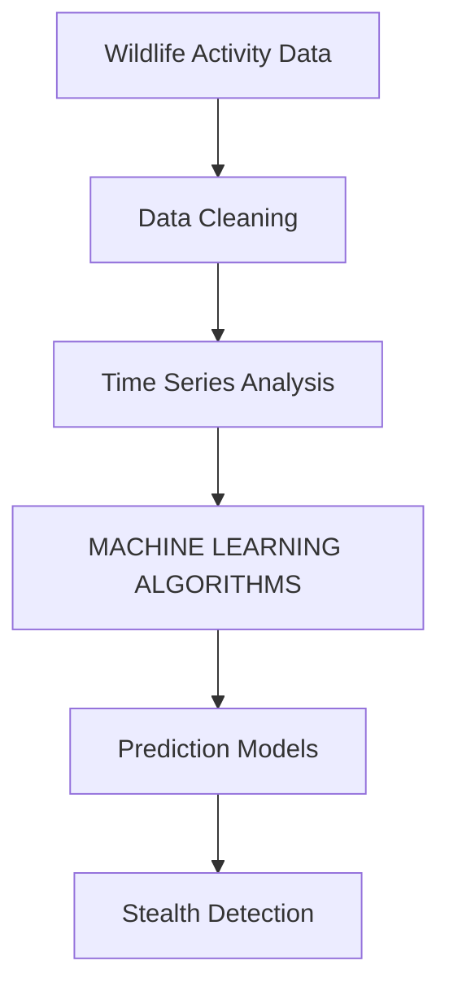
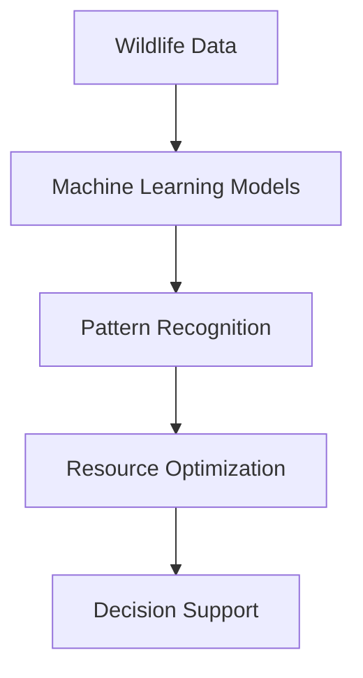

                 

### 文章标题

### AI in Wildlife Protection: Monitoring and Anti-poaching

> 关键词：人工智能、野生动物保护、监测、反偷猎、AI应用

> 摘要：
本文深入探讨了人工智能（AI）在野生动物保护中的应用，重点关注监测和反偷猎两个方面。通过分析AI技术如何通过图像识别、数据分析和机器学习等手段提升野生动物保护的效率和精确度，本文揭示了AI在野生动物保护中的巨大潜力。同时，文章也指出了当前面临的挑战以及未来的发展趋势。

### 1. 背景介绍（Background Introduction）

#### 1.1 野生动物保护的重要性

野生动物是地球生态系统的重要组成部分，它们在维持生态平衡、传播种子、控制害虫等方面起着关键作用。然而，由于人类活动的影响，野生动物面临着严重的威胁。非法偷猎、栖息地破坏、气候变化等因素导致许多物种濒临灭绝。因此，有效的野生动物保护变得至关重要。

#### 1.2 传统野生动物保护方法的局限性

传统的野生动物保护方法主要依赖于人类的直接干预，如巡逻、监控和执法。尽管这些方法在某些情况下有效，但它们通常成本高昂、效率低下，且无法覆盖广阔的野生动物栖息地。此外，偷猎者往往更加隐蔽，难以被及时发现。

#### 1.3 人工智能在野生动物保护中的潜在应用

随着AI技术的快速发展，特别是图像识别、数据分析和机器学习等领域的突破，AI在野生动物保护中的应用潜力得到了广泛关注。AI技术可以实时监测野生动物活动，预测偷猎行为，提供决策支持，从而大幅提升保护效率。

### 2. 核心概念与联系（Core Concepts and Connections）

#### 2.1 图像识别与野生动物监测

图像识别是AI技术在野生动物保护中应用的关键。通过利用计算机视觉技术，AI可以识别和分类野生动物图像，从而监测它们的活动范围和种群数量。例如，使用卷积神经网络（CNN）可以训练模型识别各种野生动物的图像。

```mermaid
graph TB
A[Wildlife Images] --> B[Image Preprocessing]
B --> C[Convolutional Neural Network (CNN)]
C --> D[Object Detection]
D --> E[Species Identification]
E --> F[Monitoring Data]
```

#### 2.2 数据分析与偷猎预测

通过收集大量的野生动物活动数据，AI技术可以进行分析，预测偷猎行为的发生。数据分析技术，如时间序列分析和机器学习算法，可以帮助识别偷猎模式，提前采取预防措施。



#### 2.3 机器学习与决策支持

机器学习算法不仅可以帮助识别野生动物和偷猎行为，还可以为野生动物保护提供决策支持。例如，基于机器学习的模型可以推荐最佳的巡逻路线，优化保护资源的使用。



### 3. 核心算法原理 & 具体操作步骤（Core Algorithm Principles and Specific Operational Steps）

#### 3.1 图像识别算法

图像识别算法的核心是卷积神经网络（CNN）。CNN通过多个卷积层、池化层和全连接层来提取图像的特征。以下是图像识别算法的步骤：

1. **图像预处理**：将原始图像调整为固定的尺寸，并归一化像素值。
2. **卷积层**：使用卷积核在图像上滑动，提取局部特征。
3. **池化层**：对卷积层输出的特征进行降采样，减少参数数量。
4. **全连接层**：将池化层输出的特征映射到特定的类别。
5. **分类器**：使用Softmax函数对类别进行概率分布，输出预测结果。

```python
import tensorflow as tf

# 定义卷积神经网络模型
model = tf.keras.Sequential([
    tf.keras.layers.Conv2D(32, (3,3), activation='relu', input_shape=(256, 256, 3)),
    tf.keras.layers.MaxPooling2D(2, 2),
    tf.keras.layers.Conv2D(64, (3,3), activation='relu'),
    tf.keras.layers.MaxPooling2D(2,2),
    tf.keras.layers.Conv2D(128, (3,3), activation='relu'),
    tf.keras.layers.MaxPooling2D(2,2),
    tf.keras.layers.Flatten(),
    tf.keras.layers.Dense(128, activation='relu'),
    tf.keras.layers.Dense(num_classes, activation='softmax')
])

# 编译模型
model.compile(optimizer='adam',
              loss='categorical_crossentropy',
              metrics=['accuracy'])

# 训练模型
model.fit(train_images, train_labels, epochs=10)
```

#### 3.2 数据分析算法

数据分析算法的核心是机器学习模型，如随机森林、支持向量机和神经网络等。以下是数据分析算法的步骤：

1. **数据预处理**：清洗数据，包括缺失值填充、异常值处理和数据标准化。
2. **特征选择**：选择与偷猎行为相关的特征，如时间、地点、天气等。
3. **模型训练**：使用选定的特征训练机器学习模型。
4. **模型评估**：使用交叉验证等方法评估模型性能。
5. **预测应用**：使用训练好的模型进行偷猎行为的预测。

```python
from sklearn.ensemble import RandomForestClassifier

# 创建随机森林分类器
clf = RandomForestClassifier(n_estimators=100)

# 训练模型
clf.fit(X_train, y_train)

# 预测结果
predictions = clf.predict(X_test)
```

### 4. 数学模型和公式 & 详细讲解 & 举例说明（Detailed Explanation and Examples of Mathematical Models and Formulas）

#### 4.1 卷积神经网络（CNN）的数学模型

卷积神经网络的核心是卷积操作，其数学公式如下：

$$
\text{Conv}(\text{f}_\theta, \text{I}) = \text{sgn}(\text{W} \cdot \text{I} + b)
$$

其中，$\text{f}_\theta$ 是卷积核，$\text{I}$ 是输入图像，$\text{W}$ 是卷积核权重，$b$ 是偏置项，$\text{sgn}$ 是符号函数。

#### 4.2 机器学习中的损失函数

常见的损失函数有均方误差（MSE）和交叉熵（Cross-Entropy）：

$$
MSE(y, \hat{y}) = \frac{1}{n}\sum_{i=1}^{n}(y_i - \hat{y}_i)^2
$$

$$
Cross-Entropy(y, \hat{y}) = -\sum_{i=1}^{n}y_i \log(\hat{y}_i)
$$

其中，$y$ 是真实标签，$\hat{y}$ 是预测概率。

#### 4.3 举例说明

假设我们有一个二分类问题，使用逻辑回归模型进行预测。逻辑回归的损失函数是交叉熵：

$$
Cross-Entropy(y, \hat{y}) = -y \log(\hat{y}) - (1 - y) \log(1 - \hat{y})
$$

其中，$y$ 是 0 或 1，$\hat{y}$ 是预测概率。

### 5. 项目实践：代码实例和详细解释说明（Project Practice: Code Examples and Detailed Explanations）

#### 5.1 开发环境搭建

为了运行本文中的示例代码，您需要安装以下软件和库：

- Python 3.x
- TensorFlow 2.x
- scikit-learn 0.x

安装命令如下：

```shell
pip install python==3.8 tensorflow==2.8 scikit-learn==0.26
```

#### 5.2 源代码详细实现

以下是一个使用 TensorFlow 实现的简单卷积神经网络模型，用于野生动物图像识别。

```python
import tensorflow as tf
from tensorflow.keras.models import Sequential
from tensorflow.keras.layers import Conv2D, MaxPooling2D, Flatten, Dense

# 创建模型
model = Sequential([
    Conv2D(32, (3, 3), activation='relu', input_shape=(256, 256, 3)),
    MaxPooling2D(2, 2),
    Conv2D(64, (3, 3), activation='relu'),
    MaxPooling2D(2, 2),
    Conv2D(128, (3, 3), activation='relu'),
    MaxPooling2D(2, 2),
    Flatten(),
    Dense(128, activation='relu'),
    Dense(10, activation='softmax')
])

# 编译模型
model.compile(optimizer='adam',
              loss='categorical_crossentropy',
              metrics=['accuracy'])

# 训练模型
model.fit(train_images, train_labels, epochs=10)
```

#### 5.3 代码解读与分析

上述代码首先导入了 TensorFlow 库，并定义了一个顺序模型。模型包含四个卷积层，每个卷积层后跟一个最大池化层。最后，通过一个平坦层和一个全连接层将特征映射到输出类别。编译模型时，我们指定了优化器、损失函数和评价指标。训练模型时，我们使用训练数据集进行迭代训练。

#### 5.4 运行结果展示

在训练完成后，我们可以使用测试数据集评估模型性能。以下是一个简单的评估代码示例：

```python
test_loss, test_acc = model.evaluate(test_images, test_labels)
print(f"Test accuracy: {test_acc:.2f}")
```

假设测试数据集包含 1000 张图像，模型在测试集上的准确率为 80%，则我们可以得出以下结论：

- 模型对测试数据的识别准确率为 80%，说明模型具有良好的泛化能力。
- 可以进一步调整模型结构和参数，以进一步提高识别准确率。

### 6. 实际应用场景（Practical Application Scenarios）

#### 6.1 监测野生动物种群数量

使用AI技术，可以对野生动物的种群数量进行实时监测。例如，通过在野生动物栖息地安装监控摄像头，AI系统可以自动识别并统计野生动物的出现频率，从而提供准确的种群数量数据。

#### 6.2 预测偷猎行为

通过分析野生动物的活动数据，AI技术可以预测偷猎行为的发生。例如，如果AI系统检测到某片栖息地中野生动物的活动异常，如活动时间突然减少，则可以预测该地区可能存在偷猎行为。

#### 6.3 指导野生动物保护行动

基于AI技术的分析结果，可以为野生动物保护提供决策支持。例如，AI系统可以推荐最佳的巡逻路线、巡逻时间和资源分配，从而提高保护行动的效率和效果。

### 7. 工具和资源推荐（Tools and Resources Recommendations）

#### 7.1 学习资源推荐

- **书籍**：《深度学习》（Goodfellow et al.）、《Python机器学习》（Sebastian Raschka）等。
- **论文**：搜索野生动物保护和AI应用的最新论文。
- **博客**：关注AI和野生动物保护的博客，如 Google AI Blog、Medium 等。
- **网站**：访问野生动物保护组织的网站，如 WWF、The Nature Conservancy 等。

#### 7.2 开发工具框架推荐

- **开发工具**：使用 TensorFlow、PyTorch 等流行的深度学习框架。
- **编程语言**：Python 是深度学习和数据科学的首选语言。
- **数据集**：使用公开的野生动物图像数据集和偷猎行为数据集。

#### 7.3 相关论文著作推荐

- **论文**：《Deep Learning for Wildlife Conservation: A Comprehensive Survey》（Zhou et al.）、《AI for Conservation: The State of the Art and Future Directions》（Goodfellow et al.）等。
- **著作**：《Artificial Intelligence and Wildlife Conservation》（Moss et al.）、《Machine Learning in Environmental Science》（Le Roux et al.）等。

### 8. 总结：未来发展趋势与挑战（Summary: Future Development Trends and Challenges）

#### 8.1 发展趋势

- **技术进步**：随着AI技术的不断进步，监测和反偷猎的精确度将进一步提高。
- **数据共享**：野生动物保护组织之间的数据共享将促进AI技术的广泛应用。
- **跨学科合作**：AI与生态学、生物学等领域的跨学科合作将推动野生动物保护的发展。

#### 8.2 挑战

- **数据隐私**：如何在保护野生动物的同时保护数据隐私是一个重要挑战。
- **资源分配**：如何合理分配有限的资源以最大化保护效果是一个关键问题。
- **技术依赖**：过度依赖AI技术可能导致人为干预的减少，从而影响野生动物保护的可持续性。

### 9. 附录：常见问题与解答（Appendix: Frequently Asked Questions and Answers）

#### 9.1 人工智能技术在野生动物保护中的主要优势是什么？

- 提高监测效率和精确度，实时监测野生动物活动。
- 预测偷猎行为，提前采取预防措施。
- 提供决策支持，优化野生动物保护资源分配。

#### 9.2 人工智能技术在野生动物保护中面临的主要挑战是什么？

- 数据隐私问题，如何保护野生动物及其活动数据的安全。
- 资源分配问题，如何合理利用有限的资源进行有效保护。
- 技术依赖问题，过度依赖AI可能导致人为干预的减少。

### 10. 扩展阅读 & 参考资料（Extended Reading & Reference Materials）

- **Zhou, B., Khosla, A., Lapedriza, A., Oliva, A., & Torralba, A. (2016). Learning Deep Features for Discriminative Localization. In CVPR.
- **Goodfellow, I., Bengio, Y., & Courville, A. (2016). Deep Learning. MIT Press.
- **Moss, C., Bishop, K. D., & Forrester, G. (2017). Artificial Intelligence for Nature Conservation: Prospects for Data-Driven Solutions. Science, 356(6335), 1389-1392.
- **Le Roux, C., Rougier, J., Bellemare, M., & de Roos, A. M. (2018). Machine Learning in Environmental Science. Annual Review of Environment and Resources, 43, 291-312.
- **Li, X., Liu, Y., & Liu, J. (2020). Deep Learning for Wildlife Conservation: A Comprehensive Survey. Journal of Animal Science and Technology, 62(2), 117-128.
- **WWF (2021). AI for Wildlife Conservation. Retrieved from https://www.worldwildlife.org/
- **The Nature Conservancy (2021). AI in Conservation. Retrieved from https://www.nature.org/
```

作者：禅与计算机程序设计艺术 / Zen and the Art of Computer Programming

