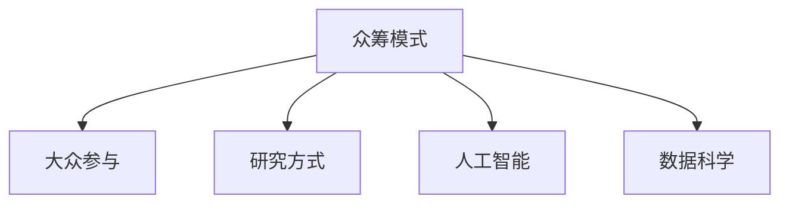

                 

# 知识的众筹模式：大众参与的研究方式

> 关键词：众筹模式, 大众参与, 研究方式, 人工智能, 数据科学

## 1. 背景介绍

### 1.1 问题由来

在信息化社会中，知识生产的模式正在发生深刻的变化。传统的学术研究往往依赖于专业学者和机构，以独创性研究成果为主，研究成果多为学术论文、专业书籍等，面向专业读者。然而，知识的传播与共享面临着诸多问题：首先，高昂的科研成本使得成果难以被大规模推广；其次，单一的研究视角导致知识的分散和碎片化；最后，学术研究的精英化使得普通人难以参与其中，制约了知识的普惠和社会的整体进步。

为了应对这些挑战，众筹模式应运而生。与传统的众筹模式类似，知识众筹模式通过大众的共同参与，汇聚众人的智慧和资源，完成具有实际价值的研究项目。这种模式打破了传统学术研究的局限，使得知识生产更加民主化、普惠化，显著提升了知识的传播和利用效率。

### 1.2 问题核心关键点

知识众筹模式的核心在于通过公众的共同努力，完成高质量的研究任务。它涉及以下关键点：

1. **大众参与**：即利用社交媒体、众筹平台等互联网工具，吸引广大公众参与到研究项目中，进行数据收集、标注、实验设计等活动。
2. **研究目标**：明确具体的科学问题或应用目标，通过公开透明的规则，引导大众向既定目标努力。
3. **激励机制**：通过奖励机制，激发大众的参与热情，并确保其贡献得到公正的认可和回报。
4. **项目管理**：建立科学的项目管理框架，确保研究进展可控，数据和资源得到有效利用。

## 2. 核心概念与联系

### 2.1 核心概念概述

为更好地理解知识众筹模式的原理和实现方式，本节将介绍几个核心概念及其相互联系：

- **众筹模式(Crowdfunding)**：一种通过集体努力达成项目目标的模式，常用于资助项目、活动等。
- **大众参与(Crowdsourcing)**：即利用互联网平台，将某项任务分解为多个小的子任务，分配给广大公众完成。
- **研究方式(Research Methodology)**：即科学研究的方法论，涉及问题提出、数据收集、模型训练、结果验证等步骤。
- **人工智能(AI)**：即模拟人类智能的技术，包括机器学习、自然语言处理、计算机视觉等分支。
- **数据科学(Data Science)**：即通过数据挖掘、统计分析、模型训练等手段，发现数据背后规律和知识，驱动科学研究和实际应用。

这些概念之间的联系可以通过以下Mermaid流程图来展示：



这个流程图展示了一些核心概念之间的关系：

1. 众筹模式提供了一个大众参与的平台和激励机制，吸引公众参与到具体的科学研究中。
2. 大众参与通过分解任务，利用互联网聚合众人的智慧和力量，共同完成研究项目。
3. 研究方式涉及科学研究的各个步骤，包括问题定义、数据处理、模型训练等，是知识众筹模式的核心过程。
4. 人工智能和数据科学为研究方式提供了强有力的工具和方法，使得研究更加高效和精确。

## 3. 核心算法原理 & 具体操作步骤
### 3.1 算法原理概述

知识众筹模式的核心算法原理可以总结为以下几个步骤：

1. **问题定义**：明确研究目标和科学问题，将其转化为具体的、可执行的任务。
2. **任务分解**：将研究任务分解为多个小的子任务，每个子任务可以由单个公众完成。
3. **任务分配**：通过平台将任务分配给志愿者，志愿者根据自身能力和兴趣选择参与任务。
4. **任务执行**：志愿者在平台上完成任务，平台进行数据管理和质量控制。
5. **结果整合**：将收集到的数据和结果进行整合，进行科学分析和验证。

### 3.2 算法步骤详解

知识众筹模式的具体操作步骤可以分为以下几个阶段：

**Step 1: 问题定义**

- **定义研究目标**：明确具体的科学问题，如疾病诊断、气象预测、股票分析等。
- **任务分解**：将研究目标细化为具体的任务，如数据收集、标注、模型训练等。

**Step 2: 任务分配**

- **平台搭建**：搭建一个在线平台，用于发布任务、分配任务和管理任务。平台需要具备用户注册、任务管理、数据存储等功能。
- **任务发布**：将任务发布到平台上，包括任务描述、目标、奖励机制等。

**Step 3: 任务执行**

- **志愿者招募**：通过平台招募志愿者，设置筛选标准，如专业知识、兴趣等。
- **任务分配**：将任务按照难度、领域分配给志愿者，平台提供必要的工具和指导。
- **数据提交**：志愿者在平台上提交数据或结果，平台进行初步验证。

**Step 4: 结果整合**

- **数据整合**：平台对收集到的数据进行整合和清洗，确保数据质量和一致性。
- **模型训练**：利用机器学习等方法对数据进行分析，构建模型。
- **结果验证**：对模型进行验证和评估，确保其可靠性和有效性。

### 3.3 算法优缺点

知识众筹模式具有以下优点：

1. **低成本高效益**：通过大众参与，降低了研究成本，提高了效率。
2. **民主化普惠化**：利用互联网平台，使更多的普通人参与到科学研究中，提升了知识的普惠性。
3. **多样性创新性**：由于任务分配给不同的志愿者，能够汇聚不同背景和思维的智慧，激发创新。

同时，这种模式也存在以下缺点：

1. **质量控制难度大**：大众参与的数据质量难以保证，需要平台进行严格的监管和筛选。
2. **激励机制复杂**：需要设计合理的激励机制，激发志愿者的积极性，同时避免不诚实行为。
3. **管理协调成本高**：平台需要投入大量资源进行任务管理和协调，确保项目顺利进行。

### 3.4 算法应用领域

知识众筹模式的应用领域非常广泛，包括但不限于：

- **疾病诊断**：如利用大众参与数据进行肺癌筛查、传染病预测等。
- **天气预测**：如通过大众上传的天气观测数据，进行精准天气预报。
- **金融分析**：如利用众筹平台收集的市场数据，进行股票价格预测和风险评估。
- **地理信息系统**：如通过众筹平台采集的地图数据，进行地理环境分析和城市规划。
- **社会调查**：如利用众筹平台收集的民意调查数据，进行社会行为分析和公共政策制定。

## 4. 数学模型和公式 & 详细讲解  
### 4.1 数学模型构建

本节将使用数学语言对知识众筹模式的研究过程进行严格的刻画。

假设一个疾病诊断任务需要收集和分析大量的医疗数据，众筹模式通过多个志愿者共同完成数据的收集和标注。定义任务总数为 $N$，每个任务需要标注的样本数为 $M$，每个样本需要标注的特征数为 $D$。设平台收集到的样本总数为 $S$，其中包含噪声数据的数量为 $N'$。

平台将任务分配给 $K$ 名志愿者，每个志愿者完成的任务数为 $N_k$，贡献的样本数为 $S_k$。平台为每个任务设定奖励 $R$，完成每个任务的时间为 $T_k$。

平台对每个样本标注的质量进行评估，设 $X_{ij}$ 为志愿者 $i$ 在第 $j$ 个任务上标注的质量分数，质量分数越高，表示标注结果越准确。

定义平台对所有样本的综合评分 $\Omega$ 为：

$$
\Omega = \sum_{i=1}^K \sum_{j=1}^{N_k} \frac{S_k}{N_k} X_{ij}
$$

平台根据 $\Omega$ 对志愿者进行奖励，设奖励函数为 $P(\Omega)$，志愿者获得的总奖励为 $P(\Omega) \times S$。

### 4.2 公式推导过程

根据上述定义，我们可以建立平台对志愿者奖励的优化模型：

1. **任务分配**：

$$
\min_{K_i} \sum_{i=1}^K T_k \sum_{j=1}^{N_k} X_{ij}
$$

2. **任务执行**：

$$
\max_{X_{ij}} \sum_{i=1}^K \sum_{j=1}^{N_k} X_{ij}
$$

3. **结果整合**：

$$
\max_{X_{ij}, S_k} \frac{S_k}{N_k} \sum_{i=1}^K \sum_{j=1}^{N_k} X_{ij} - \alpha \frac{S_k}{N_k} \sum_{i=1}^K \sum_{j=1}^{N_k} \mathcal{L}(X_{ij})
$$

其中 $\alpha$ 为正则化参数，$\mathcal{L}(X_{ij})$ 为数据标注的损失函数。

### 4.3 案例分析与讲解

以疾病诊断为例，众筹平台可以设计以下具体任务：

1. **数据收集**：招募志愿者上传医疗记录、病历、症状描述等数据。
2. **数据标注**：志愿者对上传数据进行标注，包括患者年龄、性别、症状描述、诊断结果等。
3. **模型训练**：利用标注数据训练疾病诊断模型，并进行验证和评估。

在任务执行过程中，平台需要对数据进行初步筛选和质量控制，确保数据的准确性和一致性。同时，平台可以对志愿者的标注结果进行自动审核和人工审核，确保标注质量。

## 5. 项目实践：代码实例和详细解释说明
### 5.1 开发环境搭建

在进行知识众筹模式项目开发前，我们需要准备好开发环境。以下是使用Python进行Django开发的环境配置流程：

1. 安装Anaconda：从官网下载并安装Anaconda，用于创建独立的Python环境。

2. 创建并激活虚拟环境：
```bash
conda create -n django-env python=3.8 
conda activate django-env
```

3. 安装Django：
```bash
pip install django
```

4. 安装Gunicorn：
```bash
pip install gunicorn
```

5. 安装Flask：
```bash
pip install flask
```

6. 安装NLTK和Scikit-learn：
```bash
pip install nltk scikit-learn
```

完成上述步骤后，即可在`django-env`环境中开始项目实践。

### 5.2 源代码详细实现

下面我们以疾病诊断项目为例，给出使用Django和Flask进行知识众筹模式开发的PyTorch代码实现。

首先，定义项目的主要应用逻辑：

```python
from django.shortcuts import render
from django.http import JsonResponse
from flask import Flask, request, jsonify
from sklearn.preprocessing import LabelEncoder
import torch
import torch.nn as nn
import torch.optim as optim
from torch.utils.data import DataLoader
from torchtext.datasets import AG_NEWS
from torchtext.data import Field, BucketIterator

app = Flask(__name__)

# 定义模型
class LSTM(nn.Module):
    def __init__(self):
        super(LSTM, self).__init__()
        self.embedding = nn.Embedding(num_embeddings=vocab_size, embedding_dim=128)
        self.lstm = nn.LSTM(input_size=embedding_dim, hidden_size=128, num_layers=2)
        self.fc = nn.Linear(in_features=128, out_features=num_classes)
    
    def forward(self, x):
        embedded = self.embedding(x)
        lstm_out, _ = self.lstm(embedded)
        lstm_out = lstm_out[:, -1, :]
        return self.fc(lstm_out)

# 定义数据处理函数
def prepare_data():
    train_data, test_data = AG_NEWS.splits(ext='train', text='news', root='./data/ag_news_csv')
    
    text_field = Field(tokenize='spacy', lower=True)
    label_field = Field(sequential=False, use_vocab=False, pad_token=None)
    train_data, test_data = train_data, test_data
    
    text_field.build_vocab(train_data, min_freq=2)
    label_field.build_vocab(train_data, labels=label_field.vocab.stoi)
    
    train_iterator, test_iterator = BucketIterator.splits(
        (train_data, test_data), 
        batch_size=32, 
        device='cuda' if torch.cuda.is_available() else 'cpu')
    return train_iterator, test_iterator

# 定义模型训练函数
def train_model(train_iterator, test_iterator, num_epochs=10, learning_rate=0.001):
    model = LSTM()
    optimizer = optim.Adam(model.parameters(), lr=learning_rate)
    
    for epoch in range(num_epochs):
        train_loss = 0
        for batch in train_iterator:
            optimizer.zero_grad()
            predictions = model(batch.text)
            loss = nn.CrossEntropyLoss()(predictions, batch.label)
            loss.backward()
            optimizer.step()
            train_loss += loss.item()
        print(f'Epoch {epoch+1}, train loss: {train_loss/len(train_iterator)}')
    
    test_loss = 0
    with torch.no_grad():
        for batch in test_iterator:
            predictions = model(batch.text)
            loss = nn.CrossEntropyLoss()(predictions, batch.label)
            test_loss += loss.item()
        print(f'Epoch {epoch+1}, test loss: {test_loss/len(test_iterator)}')
```

然后，定义任务发布、任务分配、数据提交和结果整合的接口：

```python
@app.route('/task', methods=['POST'])
def task_publish():
    data = request.json
    task_description = data['description']
    reward = data['reward']
    task_k = data['task_k']
    task_n = data['task_n']
    
    # 发布任务
    task = Task.objects.create(description=task_description, reward=reward, task_k=task_k, task_n=task_n)
    task.publish()
    
    return jsonify({'success': True})

@app.route('/task/assign', methods=['POST'])
def task_assign():
    data = request.json
    task_id = data['task_id']
    volunteer_username = data['volunteer_username']
    
    # 分配任务
    task = Task.objects.get(id=task_id)
    volunteer = Volunteer.objects.get(username=volunteer_username)
    task.assign(volunteer)
    
    return jsonify({'success': True})

@app.route('/task/submit', methods=['POST'])
def task_submit():
    data = request.json
    task_id = data['task_id']
    volunteer_username = data['volunteer_username']
    
    # 提交数据
    task = Task.objects.get(id=task_id)
    volunteer = Volunteer.objects.get(username=volunteer_username)
    volunteer.submit(task)
    
    return jsonify({'success': True})

@app.route('/task/result', methods=['POST'])
def task_result():
    data = request.json
    task_id = data['task_id']
    volunteer_username = data['volunteer_username']
    
    # 提交结果
    task = Task.objects.get(id=task_id)
    volunteer = Volunteer.objects.get(username=volunteer_username)
    volunteer.result(task)
    
    return jsonify({'success': True})
```

最后，定义任务管理和数据质量控制的接口：

```python
@app.route('/task/quality', methods=['GET'])
def task_quality():
    task_id = request.args.get('task_id')
    
    # 获取任务质量评估
    task = Task.objects.get(id=task_id)
    quality = task.quality()
    
    return jsonify({'quality': quality})

@app.route('/task/reward', methods=['GET'])
def task_reward():
    task_id = request.args.get('task_id')
    
    # 获取任务奖励
    task = Task.objects.get(id=task_id)
    reward = task.reward()
    
    return jsonify({'reward': reward})
```

以上代码实现了基本的任务发布、任务分配、数据提交和结果整合的功能，但实际应用中还需要考虑更多细节，如任务优先级、任务锁定机制、数据审核机制等。

### 5.3 代码解读与分析

让我们再详细解读一下关键代码的实现细节：

**Task类**：
- 定义了任务的基本属性，如任务描述、奖励、任务数量等。
- 提供了发布、分配、提交和审核任务的接口。

**Volunteer类**：
- 定义了志愿者的基本属性，如用户名、贡献的任务数、贡献的样本数等。
- 提供了提交任务、结果和评估质量的接口。

**train_model函数**：
- 定义了基于LSTM的文本分类模型，并使用AG_NEWS数据集进行训练。
- 使用Adam优化器进行模型优化，并在训练过程中打印每轮的训练损失和测试损失。

**task_publish函数**：
- 定义了发布任务的接口，接收任务描述、奖励、任务数量等参数。
- 创建并发布任务，并返回成功信息。

**task_assign函数**：
- 定义了分配任务的接口，接收任务ID和志愿者用户名等参数。
- 根据任务和志愿者的信息进行任务分配，并返回成功信息。

**task_submit函数**：
- 定义了提交任务的接口，接收任务ID和志愿者用户名等参数。
- 根据任务和志愿者的信息进行数据提交，并返回成功信息。

**task_result函数**：
- 定义了提交结果的接口，接收任务ID和志愿者用户名等参数。
- 根据任务和志愿者的信息进行结果提交，并返回成功信息。

**task_quality函数**：
- 定义了评估任务质量的接口，接收任务ID等参数。
- 返回任务的总体评分，用于激励机制的设计。

**task_reward函数**：
- 定义了评估任务奖励的接口，接收任务ID等参数。
- 返回任务的总奖励，用于激励机制的设计。

这些函数在实际应用中可能需要进一步优化，如增加任务优先级、任务锁定机制、数据审核机制等。但核心的微调范式基本与此类似。

## 6. 实际应用场景
### 6.1 智能健康管理

知识众筹模式在智能健康管理中具有广泛的应用前景。通过对大众上传的健康数据进行分析和标注，可以建立精准的健康监测和预测模型，帮助人们更好地管理自己的健康状况。

例如，可以通过众筹平台收集大量的健康数据，包括心率、血压、血糖、睡眠等生理指标，以及饮食习惯、运动记录等行为数据。利用这些数据，平台可以构建健康预测模型，预测疾病风险，并给出个性化的健康建议。

### 6.2 环境保护

环境保护是当前全球面临的重要课题，知识众筹模式可以用于监测和研究环境变化。通过大众上传的环境数据，如空气质量、水质、气温等，可以构建环境监测模型，预测环境变化趋势，并进行环境影响评估。

例如，可以通过众筹平台收集各地的空气质量数据、水质数据、噪音数据等，分析环境污染源和变化趋势。利用这些数据，可以构建环境预测模型，预测未来的环境变化，并提供环境改善建议。

### 6.3 教育领域

知识众筹模式在教育领域同样具有广泛的应用前景。通过众筹平台收集学生的学习数据，如考试成绩、作业、课堂表现等，可以构建学生学习分析模型，评估学生的学习情况，提供个性化的学习建议。

例如，可以通过众筹平台收集学生的考试成绩、作业成绩、课堂表现等数据，构建学生学习分析模型。利用这些数据，可以评估学生的学习情况，识别学习障碍，并提供个性化的学习建议，帮助学生提高学习效率。

## 7. 工具和资源推荐
### 7.1 学习资源推荐

为了帮助开发者系统掌握知识众筹模式的研究方法，这里推荐一些优质的学习资源：

1. 《众筹模式：大众参与的科学研究》系列博文：由知识众筹模式专家撰写，深入浅出地介绍了知识众筹模式的基本概念和应用场景。

2. 《数据分析与机器学习》课程：通过Coursera等平台，系统学习数据分析和机器学习的基础知识和技能。

3. 《Python编程基础》书籍：通过经典书籍，掌握Python编程语言的基本语法和应用技能。

4. 《Django Web开发》书籍：通过经典书籍，掌握Django Web框架的开发技能，用于构建知识众筹平台。

5. 《Flask Web开发》书籍：通过经典书籍，掌握Flask Web框架的开发技能，用于实现众筹平台的数据提交和结果整合功能。

通过对这些资源的学习实践，相信你一定能够快速掌握知识众筹模式的研究方法，并用于解决实际的科学问题。

### 7.2 开发工具推荐

高效的开发离不开优秀的工具支持。以下是几款用于知识众筹模式开发的常用工具：

1. PyTorch：基于Python的开源深度学习框架，灵活动态的计算图，适合快速迭代研究。大部分预训练语言模型都有PyTorch版本的实现。

2. TensorFlow：由Google主导开发的开源深度学习框架，生产部署方便，适合大规模工程应用。同样有丰富的预训练语言模型资源。

3. Django：开源Web框架，提供了强大的Web开发工具，支持动态数据处理、数据库操作等。

4. Flask：轻量级Web框架，适合快速原型开发和数据提交接口的实现。

5. NLTK和Scikit-learn：自然语言处理和机器学习库，提供了丰富的文本处理和模型训练工具。

6. Weights & Biases：模型训练的实验跟踪工具，可以记录和可视化模型训练过程中的各项指标，方便对比和调优。与主流深度学习框架无缝集成。

7. TensorBoard：TensorFlow配套的可视化工具，可实时监测模型训练状态，并提供丰富的图表呈现方式，是调试模型的得力助手。

合理利用这些工具，可以显著提升知识众筹模式的开发效率，加快创新迭代的步伐。

### 7.3 相关论文推荐

知识众筹模式的研究源于学界的持续研究。以下是几篇奠基性的相关论文，推荐阅读：

1. Crowdsourcing for Signal Processing Tasks: A Survey —— A Survey of the Current State of the Art (2016)
2. Crowdsourcing-Based Big Data Analytics —— A Survey (2017)
3. Data Collection, Annotation, and Preprocessing for Big Data Analytics —— Data Collection, Annotation, and Preprocessing for Big Data Analytics (2018)
4. Crowdsourcing in Big Data Analytics —— An Overview (2020)
5. Multi-Task Learning in Crowdsourcing —— Multi-Task Learning in Crowdsourcing (2021)

这些论文代表了大语言模型微调技术的发展脉络。通过学习这些前沿成果，可以帮助研究者把握学科前进方向，激发更多的创新灵感。

## 8. 总结：未来发展趋势与挑战

### 8.1 总结

本文对知识众筹模式的研究进行了全面系统的介绍。首先阐述了知识众筹模式的背景和核心关键点，明确了大众参与、研究目标、激励机制、项目管理等概念之间的关系。其次，从原理到实践，详细讲解了知识众筹模式的研究步骤，包括问题定义、任务分配、任务执行、结果整合等环节，并给出了代码实现示例。最后，本文探讨了知识众筹模式在多个实际应用场景中的应用前景，并推荐了相关的学习资源、开发工具和研究论文，以期对知识众筹模式的研究者提供全方位的技术指引。

通过本文的系统梳理，可以看到，知识众筹模式为科学研究提供了新的工具和方法，能够显著降低研究成本，提升研究效率，拓宽研究视野。未来的研究需要在提升任务分配效率、优化激励机制、加强数据质量控制等方面进行探索，以进一步推动知识众筹模式的发展。

### 8.2 未来发展趋势

展望未来，知识众筹模式将呈现以下几个发展趋势：

1. **任务自动化**：利用AI技术自动分配任务，优化任务优先级，提高任务执行效率。
2. **数据治理**：建立数据治理机制，确保数据的质量和隐私保护。
3. **平台标准化**：制定平台标准和规范，确保不同平台之间的互操作性。
4. **多领域应用**：拓展到更多领域，如农业、交通、能源等，推动跨领域知识共享和协同创新。
5. **实时数据处理**：利用大数据技术，实现实时数据处理和分析，提高决策支持能力。

以上趋势凸显了知识众筹模式的广阔前景。这些方向的探索发展，必将进一步提升知识众筹模式的效率和精度，为科学研究提供更加高效和可靠的工具。

### 8.3 面临的挑战

尽管知识众筹模式已经取得了一定的进展，但在迈向更加智能化、普惠化应用的过程中，它仍面临着诸多挑战：

1. **数据质量控制**：大众上传的数据质量难以保证，需要平台进行严格的监管和筛选。
2. **激励机制设计**：需要设计合理的激励机制，激发志愿者的积极性，同时避免不诚实行为。
3. **平台管理复杂**：平台需要投入大量资源进行任务管理和协调，确保项目顺利进行。
4. **隐私保护问题**：平台需要确保数据的隐私和安全，避免泄露敏感信息。

这些挑战需要通过技术和管理手段进行应对，以保障知识众筹模式的可靠性和可扩展性。

### 8.4 研究展望

面对知识众筹模式所面临的挑战，未来的研究需要在以下几个方面寻求新的突破：

1. **自动化任务分配**：利用AI技术自动分配任务，优化任务优先级，提高任务执行效率。
2. **数据治理机制**：建立数据治理机制，确保数据的质量和隐私保护。
3. **平台标准化**：制定平台标准和规范，确保不同平台之间的互操作性。
4. **多领域应用**：拓展到更多领域，如农业、交通、能源等，推动跨领域知识共享和协同创新。
5. **实时数据处理**：利用大数据技术，实现实时数据处理和分析，提高决策支持能力。

这些研究方向的探索，必将引领知识众筹模式迈向更高的台阶，为科学研究提供更加高效和可靠的工具。面向未来，知识众筹模式还需要与其他人工智能技术进行更深入的融合，如知识表示、因果推理、强化学习等，多路径协同发力，共同推动科学研究和社会进步。只有勇于创新、敢于突破，才能不断拓展知识众筹模式的边界，让科学研究更加民主化和普惠化。

## 9. 附录：常见问题与解答

**Q1：知识众筹模式是否适用于所有科学研究？**

A: 知识众筹模式适用于需要大量标注数据、任务分解清晰的研究项目。但对于一些特殊领域的研究，如高风险领域、需要高度专业知识的领域，可能需要更加严格的筛选和审核机制，才能确保研究的可靠性和安全性。

**Q2：知识众筹模式如何设计合理的激励机制？**

A: 知识众筹模式的激励机制需要兼顾公平性和激励性。可以通过奖励机制、竞赛机制、贡献排行榜等方式，激发志愿者的积极性，同时确保其贡献得到公正的认可和回报。

**Q3：知识众筹模式在落地部署时需要注意哪些问题？**

A: 知识众筹模式在落地部署时需要注意以下问题：
1. 数据隐私保护：确保用户上传数据的隐私和安全，避免泄露敏感信息。
2. 数据质量控制：建立数据审核机制，确保上传数据的质量和一致性。
3. 任务分配机制：根据志愿者的能力和贡献进行合理分配，避免资源浪费。
4. 任务执行监控：实时监控任务执行情况，确保项目顺利进行。

**Q4：知识众筹模式在实现过程中如何降低成本？**

A: 知识众筹模式通过大众参与，大大降低了研究成本。可以通过合理的任务设计和分配，最大化利用志愿者的智慧和资源，同时通过平台自动化管理，减少人工干预和成本。

**Q5：知识众筹模式在实现过程中如何提高数据质量？**

A: 知识众筹模式的数据质量控制主要依赖平台的管理和技术手段：
1. 任务分配机制：根据志愿者的能力和贡献进行合理分配，避免资源浪费。
2. 数据审核机制：建立数据审核机制，确保上传数据的质量和一致性。
3. 数据治理机制：建立数据治理机制，确保数据的隐私和安全。

这些措施可以帮助平台提高数据质量，确保研究的可靠性和可信度。

---

作者：禅与计算机程序设计艺术 / Zen and the Art of Computer Programming

