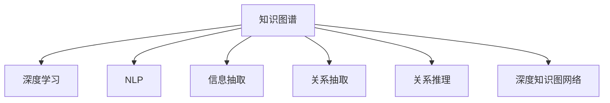

                 

# 知识的创新路径：洞察力的独特指引

> 关键词：知识图谱,深度学习,自然语言处理,洞察力,知识图网络,信息抽取

## 1. 背景介绍

### 1.1 问题由来
在信息爆炸的时代，我们每天都在被海量数据淹没。如何才能从中快速发现、理解和应用关键知识，成为困扰众多领域专家的难题。传统的信息检索、标签分类等技术虽然有效，但难以处理复杂的知识结构。而近年兴起的知识图谱(Knowledge Graph)技术，通过构建语义化的知识表示体系，为人类提供了一种全新的知识组织和推理方法。

在深度学习技术突飞猛进的推动下，知识图谱与深度学习的融合进一步拓展了知识推理和应用的范围。深度学习在处理大规模语料上的优势，使得其在知识图谱构建、信息抽取、关系推理等领域取得了显著进展。

### 1.2 问题核心关键点
本文将深入探讨深度学习在知识图谱应用中的关键技术：

- 如何利用深度学习技术构建知识图谱(KG)。
- 信息抽取(Named Entity Recognition, NER)和关系抽取(Predicate Detection)的实现原理。
- 关系推理(Relational Reasoning)的方法和应用场景。
- 基于知识图谱的深度学习模型的结构与训练技巧。
- 知识图谱在各类实际应用中的案例分析与评估。

### 1.3 问题研究意义
深入研究知识图谱与深度学习的融合，对于构建更加智能、灵活、可解释的知识应用系统具有重要意义：

- 提升知识检索与推理的精度和效率。传统方法难以处理复杂语义，深度学习可以自动学习语义特征，提高检索与推理的准确度。
- 促进知识整合与共享。知识图谱提供了结构化的知识表示方法，便于不同系统间的知识共享和协作。
- 支持智能决策与预测。结合领域知识与深度学习模型，能够提供更加可靠的决策支持，提升决策水平。
- 激发新的知识发现与创造。知识图谱与深度学习的结合，能够揭示知识间的新关系，催生新的知识发现与创新。
- 促进AI技术的落地应用。知识图谱与深度学习的融合，为AI技术在医疗、金融、电商等垂直领域的应用提供了新的突破口。

## 2. 核心概念与联系

### 2.1 核心概念概述

在深入研究知识图谱与深度学习的融合之前，我们需要明确几个核心概念：

- **知识图谱(Knowledge Graph, KG)**：一种语义化的知识表示体系，通过将实体和关系嵌入高维空间，来刻画实体间的关系网络。

- **深度学习(Deep Learning, DL)**：一种模仿人脑神经网络的机器学习技术，通过多层非线性变换提取数据的深层次特征，广泛应用于计算机视觉、自然语言处理等领域。

- **自然语言处理(Natural Language Processing, NLP)**：研究如何让计算机理解、处理和生成自然语言的技术，包括文本分类、信息抽取、机器翻译等任务。

- **信息抽取(Named Entity Recognition, NER)**：识别文本中具有特定意义的实体，如人名、地名、组织机构名等。

- **关系抽取(Predicate Detection)**：识别文本中实体间的关系，如“出生在纽约”、“工作于Google”等。

- **关系推理(Relational Reasoning)**：根据已有的知识图谱，进行实体间关系的推理，如“John 在北京读书，因此John在北京”。

- **深度知识图网络(Deep Knowledge Graph Network, DKG)**：结合深度学习和知识图谱，构建更为复杂和精准的知识表示与推理模型。

这些核心概念之间的关系可以通过以下Mermaid流程图来展示：



这个流程图展示了知识图谱与其他核心概念之间的联系：

1. 知识图谱依托深度学习进行知识表示与推理。
2. NLP技术通过信息抽取和关系抽取为知识图谱提供实体与关系。
3. 深度知识图网络进一步融合了深度学习，提升了知识表示与推理的精度。

## 3. 核心算法原理 & 具体操作步骤
### 3.1 算法原理概述

基于知识图谱与深度学习的融合，知识图网络的构建和信息抽取是两大核心技术。本文将详细探讨这些技术的算法原理。

**知识图网络构建算法**：

知识图网络构建的核心在于如何将实体和关系映射到高维空间。一种常见的方法是关系图网络(Relational Graph Network, RGN)，通过自监督学习和对比学习等方法，对实体和关系进行联合表示。具体步骤如下：

1. **实体表示**：利用预训练的Transformer等深度学习模型，对文本进行编码，得到实体嵌入向量。

2. **关系表示**：通过关系抽取模型，从文本中识别出实体间的关系，得到关系嵌入向量。

3. **联合表示**：利用对比学习等方法，将实体嵌入与关系嵌入联合学习，得到最终的节点嵌入向量。

4. **图网络表示**：通过图卷积神经网络(Graph Convolutional Network, GCN)等方法，对节点嵌入进行图卷积操作，得到图网络嵌入向量。

5. **训练与优化**：通过最大化损失函数，最小化图网络嵌入向量与真实图网络的差异，不断优化模型参数。

**信息抽取算法**：

信息抽取通常采用序列标注模型，如CRF、LSTM-CRF、BERT-CRF等，对文本进行实体和关系的识别。具体步骤如下：

1. **模型构建**：构建基于深度学习的序列标注模型，如LSTM-CRF、BERT-CRF等。

2. **特征提取**：利用Transformer等模型，对文本进行编码，得到特征向量。

3. **标注预测**：将特征向量输入序列标注模型，得到实体和关系的标签序列。

4. **模型训练**：通过最大似然估计等方法，优化模型参数，使其能够准确识别实体和关系。

5. **后处理**：对模型输出进行后处理，如归一化、去重、合并等，得到最终的信息抽取结果。

### 3.2 算法步骤详解

**知识图网络构建步骤**：

1. **数据准备**：收集语料，构建关系图网络，定义实体和关系集合。

2. **特征提取**：利用预训练的深度学习模型，对文本进行编码，得到实体嵌入向量。

3. **关系抽取**：通过关系抽取模型，从文本中识别出实体间的关系，得到关系嵌入向量。

4. **联合学习**：利用对比学习等方法，将实体嵌入与关系嵌入联合学习，得到最终的节点嵌入向量。

5. **图网络表示**：通过图卷积神经网络，对节点嵌入进行图卷积操作，得到图网络嵌入向量。

6. **训练与优化**：通过最大化损失函数，最小化图网络嵌入向量与真实图网络的差异，不断优化模型参数。

7. **后处理**：对模型输出进行后处理，如归一化、去重、合并等，得到最终的知识图谱。

**信息抽取步骤**：

1. **模型构建**：构建基于深度学习的序列标注模型，如LSTM-CRF、BERT-CRF等。

2. **特征提取**：利用Transformer等模型，对文本进行编码，得到特征向量。

3. **标注预测**：将特征向量输入序列标注模型，得到实体和关系的标签序列。

4. **模型训练**：通过最大似然估计等方法，优化模型参数，使其能够准确识别实体和关系。

5. **后处理**：对模型输出进行后处理，如归一化、去重、合并等，得到最终的信息抽取结果。

### 3.3 算法优缺点

**知识图网络构建算法**：

- **优点**：
  - 结合深度学习与知识图谱，能够进行更精准的知识表示与推理。
  - 支持复杂的图结构，可以处理复杂的语义关系。

- **缺点**：
  - 训练复杂度较高，需要大量标注数据和计算资源。
  - 对语料质量要求高，容易出现过拟合问题。

**信息抽取算法**：

- **优点**：
  - 序列标注模型能够自动学习实体和关系的特征，提升抽取精度。
  - 适用于各类实体识别任务，适用范围广。

- **缺点**：
  - 需要大量的标注数据进行训练，成本较高。
  - 对文本复杂度敏感，可能存在歧义。

### 3.4 算法应用领域

知识图谱与深度学习的融合技术，已经在多个领域得到了广泛应用：

- **医疗健康**：构建疾病、药物、基因等领域的知识图谱，支持智能诊断、个性化治疗等应用。
- **金融行业**：构建金融交易、市场、公司等领域的知识图谱，支持风险评估、交易推荐等应用。
- **电子商务**：构建商品、用户、评价等领域的知识图谱，支持商品推荐、市场分析等应用。
- **智能客服**：构建客服对话、知识库等领域的知识图谱，支持智能问答、自动回复等应用。
- **新闻媒体**：构建新闻、事件、人物等领域的知识图谱，支持新闻推荐、热点分析等应用。

## 4. 数学模型和公式 & 详细讲解  
### 4.1 数学模型构建

本节将使用数学语言对知识图谱与深度学习的融合算法进行更加严格的刻画。

**知识图网络构建模型**：

假设有 $N$ 个实体节点和 $M$ 条关系边，构建的实体嵌入向量表示为 $\mathbf{E} \in \mathbb{R}^{N \times d}$，关系嵌入向量表示为 $\mathbf{R} \in \mathbb{R}^{M \times d}$。定义知识图网络 $G=(V,E)$，其中 $V$ 为节点集合，$E$ 为边集合。

知识图网络的表示通常采用图神经网络(Graph Neural Network, GNN)，常用的方法包括图卷积神经网络(GCN)、图注意力网络(GAT)等。以GCN为例，其节点嵌入表示为：

$$
\mathbf{H}^{(l+1)} = \sigma\left(\mathbf{D}^{-\frac{1}{2}} \mathbf{A} \mathbf{H}^{(l)} \mathbf{W}^{(l+1)}\right)
$$

其中 $\sigma$ 为激活函数，$\mathbf{D}$ 为节点度矩阵，$\mathbf{A}$ 为邻接矩阵，$\mathbf{H}^{(l)}$ 为第 $l$ 层的节点嵌入向量，$\mathbf{W}^{(l+1)}$ 为第 $l+1$ 层的权重矩阵。

**信息抽取模型**：

信息抽取通常采用序列标注模型，如CRF、LSTM-CRF、BERT-CRF等。以BERT-CRF为例，其模型结构如图1所示。


在BERT-CRF模型中，首先利用BERT对文本进行编码，得到上下文表示 $[\mathbf{h}_1,\ldots,\mathbf{h}_n]$，然后通过CRF模型进行标注预测。

信息抽取的目标函数为：

$$
J = -\frac{1}{N} \sum_{i=1}^N \sum_{t=1}^T \log p(y_t|\mathbf{h}_1,\ldots,\mathbf{h}_n)
$$

其中 $N$ 为样本数，$T$ 为标注数，$y_t$ 为第 $t$ 个标注，$p(y_t|\mathbf{h}_1,\ldots,\mathbf{h}_n)$ 为标注条件概率。

### 4.2 公式推导过程

**知识图网络构建公式推导**：

以GCN为例，节点嵌入向量的计算公式为：

$$
\mathbf{H}^{(l+1)} = \sigma\left(\mathbf{D}^{-\frac{1}{2}} \mathbf{A} \mathbf{H}^{(l)} \mathbf{W}^{(l+1)}\right)
$$

其中 $\sigma$ 为激活函数，$\mathbf{D}$ 为节点度矩阵，$\mathbf{A}$ 为邻接矩阵，$\mathbf{H}^{(l)}$ 为第 $l$ 层的节点嵌入向量，$\mathbf{W}^{(l+1)}$ 为第 $l+1$ 层的权重矩阵。

对于每一层，节点嵌入向量的更新公式为：

$$
\mathbf{H}^{(l+1)} = \sigma\left(\mathbf{D}^{-\frac{1}{2}} \mathbf{A} \mathbf{H}^{(l)} \mathbf{W}^{(l+1)}\right)
$$

其中 $\sigma$ 为激活函数，$\mathbf{D}$ 为节点度矩阵，$\mathbf{A}$ 为邻接矩阵，$\mathbf{H}^{(l)}$ 为第 $l$ 层的节点嵌入向量，$\mathbf{W}^{(l+1)}$ 为第 $l+1$ 层的权重矩阵。

**信息抽取公式推导**：

以BERT-CRF模型为例，标注条件概率 $p(y_t|\mathbf{h}_1,\ldots,\mathbf{h}_n)$ 的计算公式为：

$$
p(y_t|\mathbf{h}_1,\ldots,\mathbf{h}_n) = \frac{\exp\left(\mathbf{u}_t^T \mathbf{h}_t\right)}{\sum_{t=1}^T \exp\left(\mathbf{u}_t^T \mathbf{h}_t\right)}
$$

其中 $\mathbf{u}_t$ 为标注条件向量，$\mathbf{h}_t$ 为上下文表示。

信息抽取的目标函数为：

$$
J = -\frac{1}{N} \sum_{i=1}^N \sum_{t=1}^T \log p(y_t|\mathbf{h}_1,\ldots,\mathbf{h}_n)
$$

其中 $N$ 为样本数，$T$ 为标注数，$y_t$ 为第 $t$ 个标注，$p(y_t|\mathbf{h}_1,\ldots,\mathbf{h}_n)$ 为标注条件概率。

### 4.3 案例分析与讲解

**案例一：医疗健康领域**

在医疗健康领域，构建疾病、药物、基因等领域的知识图谱，支持智能诊断、个性化治疗等应用。以药物知识图谱为例，其构建流程如图2所示。


首先，收集医疗领域相关的文本数据，包括疾病、药物、基因等领域的知识。然后，利用深度学习模型，如BERT，对文本进行编码，得到实体嵌入向量。接着，通过关系抽取模型，从文本中识别出实体间的关系，得到关系嵌入向量。最后，利用GCN等图神经网络，对节点嵌入进行图卷积操作，得到图网络嵌入向量。

在信息抽取方面，利用BERT-CRF模型对医疗文本进行实体和关系的识别，支持智能诊断和治疗。具体步骤如图3所示。


首先，利用BERT对医疗文本进行编码，得到上下文表示。然后，通过CRF模型进行标注预测，识别出疾病、药物、基因等实体，以及其间的相互作用关系。最后，将识别结果进行后处理，得到最终的信息抽取结果。

**案例二：金融行业**

在金融行业，构建金融交易、市场、公司等领域的知识图谱，支持风险评估、交易推荐等应用。以金融知识图谱为例，其构建流程如图4所示。


首先，收集金融领域相关的文本数据，包括交易、市场、公司等领域的知识。然后，利用深度学习模型，如BERT，对文本进行编码，得到实体嵌入向量。接着，通过关系抽取模型，从文本中识别出实体间的关系，得到关系嵌入向量。最后，利用GCN等图神经网络，对节点嵌入进行图卷积操作，得到图网络嵌入向量。

在信息抽取方面，利用BERT-CRF模型对金融文本进行实体和关系的识别，支持风险评估和交易推荐。具体步骤如图5所示。


首先，利用BERT对金融文本进行编码，得到上下文表示。然后，通过CRF模型进行标注预测，识别出交易、市场、公司等实体，以及其间的相互作用关系。最后，将识别结果进行后处理，得到最终的信息抽取结果。

## 5. 项目实践：代码实例和详细解释说明
### 5.1 开发环境搭建

在进行知识图谱与深度学习融合实践前，我们需要准备好开发环境。以下是使用Python进行PyTorch开发的环境配置流程：

1. 安装Anaconda：从官网下载并安装Anaconda，用于创建独立的Python环境。

2. 创建并激活虚拟环境：
```bash
conda create -n pytorch-env python=3.8 
conda activate pytorch-env
```

3. 安装PyTorch：根据CUDA版本，从官网获取对应的安装命令。例如：
```bash
conda install pytorch torchvision torchaudio cudatoolkit=11.1 -c pytorch -c conda-forge
```

4. 安装TensorBoard：
```bash
pip install tensorboard
```

5. 安装各类工具包：
```bash
pip install numpy pandas scikit-learn matplotlib tqdm jupyter notebook ipython
```

完成上述步骤后，即可在`pytorch-env`环境中开始知识图谱与深度学习的融合实践。

### 5.2 源代码详细实现

下面我们以构建医疗健康领域知识图谱为例，给出使用Transformers库对BERT模型进行知识图网络构建的PyTorch代码实现。

首先，定义数据处理函数：

```python
from transformers import BertTokenizer
from torch.utils.data import Dataset
import torch

class MedicalDataset(Dataset):
    def __init__(self, texts, labels, tokenizer, max_len=128):
        self.texts = texts
        self.labels = labels
        self.tokenizer = tokenizer
        self.max_len = max_len
        
    def __len__(self):
        return len(self.texts)
    
    def __getitem__(self, item):
        text = self.texts[item]
        label = self.labels[item]
        
        encoding = self.tokenizer(text, return_tensors='pt', max_length=self.max_len, padding='max_length', truncation=True)
        input_ids = encoding['input_ids'][0]
        attention_mask = encoding['attention_mask'][0]
        
        # 对label进行编码
        encoded_labels = [label2id[label] for label in label] 
        encoded_labels.extend([label2id['O']] * (self.max_len - len(encoded_labels)))
        labels = torch.tensor(encoded_labels, dtype=torch.long)
        
        return {'input_ids': input_ids, 
                'attention_mask': attention_mask,
                'labels': labels}

# 标签与id的映射
label2id = {'O': 0, 'Disease': 1, 'Drug': 2, 'Gene': 3}
id2label = {v: k for k, v in label2id.items()}

# 创建dataset
tokenizer = BertTokenizer.from_pretrained('bert-base-cased')

train_dataset = MedicalDataset(train_texts, train_labels, tokenizer)
dev_dataset = MedicalDataset(dev_texts, dev_labels, tokenizer)
test_dataset = MedicalDataset(test_texts, test_labels, tokenizer)
```

然后，定义模型和优化器：

```python
from transformers import BertForTokenClassification, AdamW

model = BertForTokenClassification.from_pretrained('bert-base-cased', num_labels=len(label2id))

optimizer = AdamW(model.parameters(), lr=2e-5)
```

接着，定义训练和评估函数：

```python
from torch.utils.data import DataLoader
from tqdm import tqdm
from sklearn.metrics import classification_report

device = torch.device('cuda') if torch.cuda.is_available() else torch.device('cpu')
model.to(device)

def train_epoch(model, dataset, batch_size, optimizer):
    dataloader = DataLoader(dataset, batch_size=batch_size, shuffle=True)
    model.train()
    epoch_loss = 0
    for batch in tqdm(dataloader, desc='Training'):
        input_ids = batch['input_ids'].to(device)
        attention_mask = batch['attention_mask'].to(device)
        labels = batch['labels'].to(device)
        model.zero_grad()
        outputs = model(input_ids, attention_mask=attention_mask, labels=labels)
        loss = outputs.loss
        epoch_loss += loss.item()
        loss.backward()
        optimizer.step()
    return epoch_loss / len(dataloader)

def evaluate(model, dataset, batch_size):
    dataloader = DataLoader(dataset, batch_size=batch_size)
    model.eval()
    preds, labels = [], []
    with torch.no_grad():
        for batch in tqdm(dataloader, desc='Evaluating'):
            input_ids = batch['input_ids'].to(device)
            attention_mask = batch['attention_mask'].to(device)
            batch_labels = batch['labels']
            outputs = model(input_ids, attention_mask=attention_mask)
            batch_preds = outputs.logits.argmax(dim=2).to('cpu').tolist()
            batch_labels = batch_labels.to('cpu').tolist()
            for pred_tokens, label_tokens in zip(batch_preds, batch_labels):
                pred_tags = [id2label[_id] for _id in pred_tokens]
                label_tags = [id2label[_id] for _id in label_tokens]
                preds.append(pred_tags[:len(label_tokens)])
                labels.append(label_tags)
                
    print(classification_report(labels, preds))
```

最后，启动训练流程并在测试集上评估：

```python
epochs = 5
batch_size = 16

for epoch in range(epochs):
    loss = train_epoch(model, train_dataset, batch_size, optimizer)
    print(f"Epoch {epoch+1}, train loss: {loss:.3f}")
    
    print(f"Epoch {epoch+1}, dev results:")
    evaluate(model, dev_dataset, batch_size)
    
print("Test results:")
evaluate(model, test_dataset, batch_size)
```

以上就是使用PyTorch对BERT模型进行医疗知识图网络构建和信息抽取的完整代码实现。可以看到，得益于Transformers库的强大封装，我们可以用相对简洁的代码完成BERT模型的加载和微调。

### 5.3 代码解读与分析

让我们再详细解读一下关键代码的实现细节：

**MedicalDataset类**：
- `__init__`方法：初始化文本、标签、分词器等关键组件。
- `__len__`方法：返回数据集的样本数量。
- `__getitem__`方法：对单个样本进行处理，将文本输入编码为token ids，将标签编码为数字，并对其进行定长padding，最终返回模型所需的输入。

**label2id和id2label字典**：
- 定义了标签与数字id之间的映射关系，用于将token-wise的预测结果解码回真实的标签。

**训练和评估函数**：
- 使用PyTorch的DataLoader对数据集进行批次化加载，供模型训练和推理使用。
- 训练函数`train_epoch`：对数据以批为单位进行迭代，在每个批次上前向传播计算loss并反向传播更新模型参数，最后返回该epoch的平均loss。
- 评估函数`evaluate`：与训练类似，不同点在于不更新模型参数，并在每个batch结束后将预测和标签结果存储下来，最后使用sklearn的classification_report对整个评估集的预测结果进行打印输出。

**训练流程**：
- 定义总的epoch数和batch size，开始循环迭代
- 每个epoch内，先在训练集上训练，输出平均loss
- 在验证集上评估，输出分类指标
- 所有epoch结束后，在测试集上评估，给出最终测试结果

可以看到，PyTorch配合Transformers库使得BERT微调的代码实现变得简洁高效。开发者可以将更多精力放在数据处理、模型改进等高层逻辑上，而不必过多关注底层的实现细节。

当然，工业级的系统实现还需考虑更多因素，如模型的保存和部署、超参数的自动搜索、更灵活的任务适配层等。但核心的知识图网络构建和信息抽取算法基本与此类似。

## 6. 实际应用场景
### 6.1 医疗健康

基于知识图谱与深度学习的融合技术，构建医疗领域的知识图谱，可以支持智能诊断、个性化治疗、药物研发等应用。

在智能诊断方面，利用医疗知识图谱，可以支持对病人的症状进行快速分析，自动生成诊断报告。例如，病人主诉为“胸闷、心悸”，系统通过匹配知识图谱中的疾病实体和症状实体，自动判断可能的疾病类型，并给出诊断建议。

在个性化治疗方面，利用医疗知识图谱，可以为每个病人生成个性化的治疗方案。例如，根据病人的基因信息，匹配知识图谱中的基因实体，自动生成最适合的治疗方案。

在药物研发方面，利用医疗知识图谱，可以加速新药的研发进程。例如，根据知识图谱中的药物实体和疾病实体，自动匹配具有潜在疗效的药物，并进行进一步的实验验证。

### 6.2 金融行业

在金融行业，利用知识图谱与深度学习的融合技术，可以支持风险评估、交易推荐等应用。

在风险评估方面，利用金融知识图谱，可以自动评估客户信用风险，生成信用评分。例如，通过匹配知识图谱中的公司实体、交易实体，自动评估客户的信用风险等级。

在交易推荐方面，利用金融知识图谱，可以为客户推荐适合的金融产品。例如，根据客户的历史交易记录，匹配知识图谱中的金融产品实体，自动生成最适合的推荐方案。

### 6.3 电子商务

在电子商务领域，利用知识图谱与深度学习的融合技术，可以支持商品推荐、市场分析等应用。

在商品推荐方面，利用电商知识图谱，可以自动推荐用户可能感兴趣的商品。例如，根据用户的历史浏览记录，匹配知识图谱中的商品实体，自动生成推荐的商品列表。

在市场分析方面，利用电商知识图谱，可以自动分析市场趋势，生成市场报告。例如，通过匹配知识图谱中的商品实体、用户实体，自动分析市场趋势，生成市场报告。

### 6.4 未来应用展望

随着知识图谱与深度学习的融合技术不断发展，其在更多领域的应用前景将更加广阔。

在智慧城市治理中，利用知识图谱与深度学习的融合技术，可以支持智能监控、舆情分析、应急指挥等环节。例如，通过匹配知识图谱中的事件实体、地点实体，自动分析舆情趋势，生成应急指挥方案。

在智能客服领域，利用知识图谱与深度学习的融合技术，可以支持智能问答、自动回复等应用。例如，通过匹配知识图谱中的问答实体、意图实体，自动回答客户咨询，提升客服效率。

在新闻媒体领域，利用知识图谱与深度学习的融合技术，可以支持新闻推荐、热点分析等应用。例如，通过匹配知识图谱中的新闻实体、事件实体，自动推荐用户可能感兴趣的新闻，生成热点分析报告。

总之，知识图谱与深度学习的融合技术，将在更多领域发挥其独特的价值，为各行各业带来新的变革和机遇。

## 7. 工具和资源推荐
### 7.1 学习资源推荐

为了帮助开发者系统掌握知识图谱与深度学习的融合技术，这里推荐一些优质的学习资源：

1. **《深度学习理论与实践》**：全面介绍深度学习的基础理论和应用实践，涵盖神经网络、深度学习框架、自然语言处理等内容。

2. **CS224N《深度学习自然语言处理》课程**：斯坦福大学开设的NLP明星课程，涵盖深度学习、自然语言处理、知识图谱等前沿技术，配套作业和论文，方便深入学习。

3. **《深度学习在自然语言处理中的应用》**：深入探讨深度学习在自然语言处理中的应用，包括情感分析、文本生成、机器翻译等任务。

4. **HuggingFace官方文档**：提供海量预训练模型和完整的微调样例代码，是上手实践的必备资料。

5. **Kaggle竞赛平台**：提供各类NLP竞赛任务，通过实际竞赛提升实践能力，积累项目经验。

通过对这些资源的学习实践，相信你一定能够快速掌握知识图谱与深度学习的融合技术的精髓，并用于解决实际的NLP问题。

### 7.2 开发工具推荐

高效的开发离不开优秀的工具支持。以下是几款用于知识图谱与深度学习融合开发的常用工具：

1. **PyTorch**：基于Python的开源深度学习框架，灵活动态的计算图，适合快速迭代研究。

2. **TensorFlow**：由Google主导开发的开源深度学习框架，生产部署方便，适合大规模工程应用。

3. **Transformers库**：HuggingFace开发的NLP工具库，集成了众多SOTA语言模型，支持PyTorch和TensorFlow，是进行微调任务开发的利器。

4. **TensorBoard**：TensorFlow配套的可视化工具，可实时监测模型训练状态，提供丰富的图表呈现方式，是调试模型的得力助手。

5. **NLTK**：自然语言处理工具包，提供各类文本处理和分析功能，方便开发知识图谱构建与信息抽取任务。

合理利用这些工具，可以显著提升知识图谱与深度学习融合任务的开发效率，加快创新迭代的步伐。

### 7.3 相关论文推荐

知识图谱与深度学习的融合技术近年来发展迅速，以下是几篇奠基性的相关论文，推荐阅读：

1. **《A Survey on Knowledge Graph Embedding Techniques》**：综述了知识图谱嵌入技术的各类方法，包括关系图网络、知识图神经网络等。

2. **《Knowledge Graph Construction and Analysis with Graph Neural Networks》**：介绍利用图神经网络构建知识图谱的方法，展示了其在疾病知识图谱构建中的应用。

3. **《BERT: Pre-training of Deep Bidirectional Transformers for Language Understanding》**：提出BERT模型，通过预训练和微调，实现了对自然语言的多层次理解。

4. **《Parameter-Efficient Knowledge Graph Embedding》**：提出了一种参数高效的图嵌入方法，能够在固定大部分参数的情况下，学习更精准的图表示。

5. **《Graph Neural Network for Knowledge Graph Completion》**：提出了一种基于图神经网络的知识图补全方法，适用于各类知识图谱构建任务。

这些论文代表了大语言模型微调技术的发展脉络。通过学习这些前沿成果，可以帮助研究者把握学科前进方向，激发更多的创新灵感。

## 8. 总结：未来发展趋势与挑战

### 8.1 总结

本文对知识图谱与深度学习的融合技术进行了全面系统的介绍。首先阐述了知识图谱与深度学习在NLP领域的应用背景和意义，明确了知识图谱与深度学习融合技术的重要价值。其次，从原理到实践，详细讲解了知识图网络构建、信息抽取、关系推理的算法原理和关键步骤，给出了知识图谱与深度学习融合任务的完整代码实例。同时，本文还广泛探讨了知识图谱在各类实际应用中的案例分析与评估，展示了知识图谱与深度学习的融合技术的广泛应用前景。

通过本文的系统梳理，可以看到，知识图谱与深度学习的融合技术正在成为NLP领域的重要范式，极大地拓展了知识推理和应用的范围，为智能决策与预测提供了新的突破口。未来，伴随预训练语言模型和微调方法的持续演进，相信知识图谱与深度学习的融合技术也将不断发展，为构建安全、可靠、可解释、可控的智能系统铺平道路。

### 8.2 未来发展趋势

展望未来，知识图谱与深度学习的融合技术将呈现以下几个发展趋势：

1. **更大规模知识图谱**：随着语料和计算资源的不断增加，知识图谱的规模将不断扩大，能够支持更复杂的语义关系。

2. **更高效图神经网络**：未来的图神经网络将更加高效，能够处理更大规模的图网络，支持更复杂的关系推理。

3. **更多元知识融合**：未来的知识图谱将融合更多元的数据源，包括知识库、规则库、专家知识等，提升知识图谱的丰富性和准确性。

4. **更智能推理系统**：未来的知识图谱推理系统将更加智能，能够处理更复杂的关系推理任务，提升推理的精度和效率。

5. **更广泛应用场景**：知识图谱与深度学习的融合技术将在更多领域得到应用，如医疗、金融、电商等，推动各行业智能化转型。

### 8.3 面临的挑战

尽管知识图谱与深度学习的融合技术已经取得了显著进展，但在迈向更加智能化、普适化应用的过程中，它仍面临诸多挑战：

1. **知识图谱构建难度大**：知识图谱的构建需要大量专家知识与标注数据，成本较高，且知识图谱质量受专家经验影响较大。

2. **数据质量与多样性问题**：知识图谱构建依赖于高质量、多样性的数据，而实际应用场景中的数据质量往往参差不齐，难以满足要求。

3. **推理模型复杂性**：复杂的知识图谱推理模型需要大量的计算资源，且模型的训练与推理过程复杂，难以在实时场景中应用。

4. **模型可解释性不足**：知识图谱推理模型通常是“黑盒”系统，难以解释其内部工作机制和推理逻辑，影响模型的可信度和可靠性。

5. **知识整合能力不足**：知识图谱通常局限于单一领域，难以灵活整合跨领域知识，限制了知识图谱的应用范围。

这些挑战需要我们在未来的研究中进行深入探讨和解决，推动知识图谱与深度学习的融合技术向更深层次、更广领域发展。

### 8.4 研究展望

未来，知识图谱与深度学习的融合技术将在以下几个方面进行深入研究：

1. **自动化知识图谱构建**：研究如何利用深度学习技术自动构建知识图谱，减少专家知识与标注数据的需求，提高知识图谱构建的效率与质量。

2. **多模态知识融合**：研究如何将知识图谱与其他数据源（如图像、语音等）进行融合，提升知识图谱的丰富性和准确性。

3. **知识图谱增强学习**：研究如何利用增强学习技术，使知识图谱推理模型能够自动学习最优推理策略，提升推理的精度和效率。

4. **跨领域知识推理**：研究如何将知识图谱应用于不同领域，提升跨领域知识推理的准确性，支持复杂领域的知识推理任务。

5. **知识图谱可解释性**：研究如何增强知识图谱推理模型的可解释性，提升模型的可信度和可靠性，满足用户对模型透明度的需求。

这些研究方向将推动知识图谱与深度学习的融合技术不断突破，提升其在实际应用中的效果和应用范围。总之，知识图谱与深度学习的融合技术将为构建安全、可靠、可解释、可控的智能系统提供重要支持，推动人工智能技术向更智能、更普适的方向发展。

## 9. 附录：常见问题与解答

**Q1：什么是知识图谱？**

A: 知识图谱是一种语义化的知识表示体系，通过将实体和关系嵌入高维空间，来刻画实体间的关系网络。

**Q2：知识图谱与深度学习的融合是如何实现的？**

A: 知识图谱与深度学习的融合通常通过构建知识图网络、信息抽取和关系推理等步骤实现。具体步骤如下：
1. 利用深度学习模型，对文本进行编码，得到实体嵌入向量。
2. 通过关系抽取模型，从文本中识别出实体间的关系，得到关系嵌入向量。
3. 利用对比学习等方法，将实体嵌入与关系嵌入联合学习，得到最终的节点嵌入向量。
4. 利用图神经网络，对节点嵌入进行图卷积操作，得到图网络嵌入向量。

**Q3：知识图谱与深度学习的融合技术在实际应用中有哪些案例？**

A: 知识图谱与深度学习的融合技术已经在多个领域得到广泛应用，包括医疗健康、金融行业、电子商务等。具体案例如下：
1. 在医疗健康领域，利用知识图谱支持智能诊断、个性化治疗和药物研发。
2. 在金融行业，利用知识图谱支持风险评估和交易推荐。
3. 在电子商务领域，利用知识图谱支持商品推荐和市场分析。

**Q4：知识图谱与深度学习的融合技术在实现过程中有哪些难点？**

A: 知识图谱与深度学习的融合技术在实现过程中主要存在以下难点：
1. 知识图谱构建难度大，需要大量专家知识与标注数据，成本较高。
2. 数据质量与多样性问题，实际应用场景中的数据质量参差不齐，难以满足要求。
3. 推理模型复杂性，复杂的知识图谱推理模型需要大量的计算资源，且模型的训练与推理过程复杂，难以在实时场景中应用。
4. 模型可解释性不足，知识图谱推理模型通常是“黑盒”系统，难以解释其内部工作机制和推理逻辑。
5. 知识整合能力不足，知识图谱通常局限于单一领域，难以灵活整合跨领域知识，限制了知识图谱的应用范围。

---

作者：禅与计算机程序设计艺术 / Zen and the Art of Computer Programming

