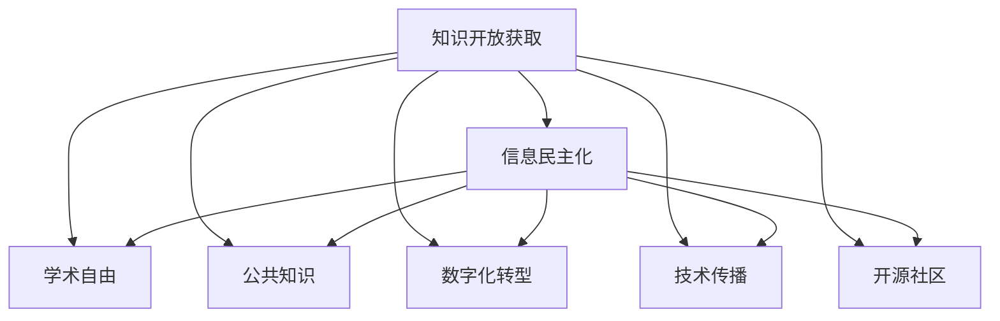
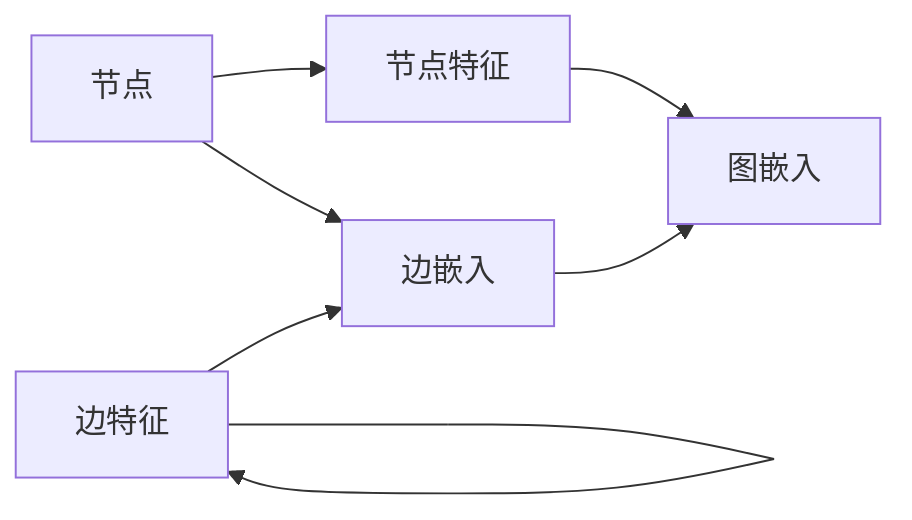

                 

# 知识的开放获取：信息民主化的影响

> 关键词：知识开放获取, 信息民主化, 学术自由, 公共知识, 数字化转型, 技术传播, 开源社区

## 1. 背景介绍

### 1.1 问题由来
在信息时代，知识获取的便捷性和多样性使得信息民主化成为可能。知识的开放获取不仅仅是学术界和科研机构的责任，也是每个公民的权利。它不仅关乎科学知识的传播与共享，更涉及社会公平、教育普及以及经济发展。本文将探讨知识开放获取的重要性，以及其在促进信息民主化方面的影响。

### 1.2 问题核心关键点
知识开放获取是指将学术研究、科研成果、数据集等以免费、公开的方式向公众提供。这种做法能够确保知识不被特定利益集团垄断，让每个人都有平等获取、利用知识的机会。信息民主化则是指通过知识的开放获取，使得所有人都能平等地获取和利用信息，从而提升社会整体的知识水平和决策能力。

本文将围绕以下关键问题展开：
1. 知识开放获取的现状与挑战。
2. 信息民主化在教育、科研、经济等方面的具体影响。
3. 开放获取与信息民主化的未来发展趋势。
4. 开放获取与信息民主化面临的挑战及应对策略。

### 1.3 问题研究意义
知识开放获取和信息民主化对社会进步具有深远影响。它们能促进知识的广泛传播与利用，激发社会创新，推动科技进步，实现教育公平，促进社会经济的发展。此外，知识开放获取还有助于打破信息孤岛，构建开放、协作的科研生态，促进学术自由和创新。

本文旨在深入分析知识开放获取的现状和影响，探讨其在促进信息民主化方面的作用，为相关政策制定和实践提供理论基础和参考。

## 2. 核心概念与联系

### 2.1 核心概念概述

为更好地理解知识开放获取和信息民主化的关系，本节将介绍几个密切相关的核心概念：

- **知识开放获取 (Open Access)**：将学术研究、科研成果、数据集等以免费、公开的方式向公众提供。目的是确保知识不被特定利益集团垄断，让每个人都有平等获取、利用知识的机会。

- **信息民主化 (Information Democracy)**：通过知识的开放获取，使得所有人都能平等地获取和利用信息，从而提升社会整体的知识水平和决策能力。信息民主化强调知识的普及和平等获取，打破信息不对称，促进社会的知识共享和公平。

- **学术自由 (Academic Freedom)**：指学者在科研、教学、出版等学术活动中的自由权利。学术自由是知识开放获取的重要基础，确保学者能够自由地发表研究成果，促进知识传播和交流。

- **公共知识 (Public Knowledge)**：指在公共领域公开的信息和知识，任何人都可以自由地访问、使用、修改和分享。公共知识的开放获取是信息民主化的核心。

- **数字化转型 (Digital Transformation)**：通过数字化手段，将传统业务流程、生产模式、管理方式等进行全面升级和优化，以提升效率、降低成本、创新服务。数字化转型为知识开放获取提供了技术支持。

- **技术传播 (Technology Diffusion)**：指新技术、新知识的传播和普及过程。技术传播是知识开放获取的重要途径，通过互联网、社交媒体等平台，促进知识的广泛传播。

- **开源社区 (Open Source Community)**：由志愿者组成，共同开发、维护和传播开源软件的社区。开源社区为知识开放获取提供了强大的技术支持。

这些核心概念之间的逻辑关系可以通过以下Mermaid流程图来展示：



这个流程图展示了一系列核心概念之间的相互联系：

1. 知识开放获取是信息民主化的基础，确保知识的广泛传播。
2. 学术自由和公共知识是知识开放获取的前提，保障知识的平等获取。
3. 数字化转型和技术传播为知识开放获取提供了技术支持。
4. 开源社区则为知识开放获取提供了强大的社区支持。

这些概念共同构成了知识开放获取和信息民主化的理论基础，为其发展提供了理论支持和实践指导。

## 3. 核心算法原理 & 具体操作步骤
### 3.1 算法原理概述

知识开放获取和信息民主化的实现原理主要包括：

- **数据挖掘与抽取**：从大量数据源中挖掘和抽取有用的信息，构建知识图谱。
- **自然语言处理**：对文本数据进行清洗、标注、分类等处理，生成结构化知识。
- **数据可视化**：将复杂的数据信息通过图表、仪表盘等方式直观展示，便于理解和分析。
- **智能推荐**：利用推荐算法，为用户提供个性化的知识推荐服务。
- **交互式问答**：通过问答系统，实时解答用户的问题，提升信息获取的效率和质量。

这些技术手段的综合应用，实现了知识的开放获取和信息民主化。

### 3.2 算法步骤详解

基于知识开放获取和信息民主化的实现原理，本节将详细讲解其实现步骤：

1. **数据收集与整理**：收集来自不同来源的数据，如学术论文、科技报告、专利文献、新闻报道等。对数据进行清洗、标注和整合，构建统一的知识库。

2. **数据挖掘与抽取**：利用自然语言处理技术，对文本数据进行分词、命名实体识别、关系抽取等处理，生成结构化的知识表示。例如，将文本中的事实信息转换为结构化的三元组（实体、关系、实体）。

3. **知识图谱构建**：将结构化知识表示构建为知识图谱，形成实体之间关系的图结构。知识图谱可以采用RDF（资源描述框架）、GraphDB等形式表示，便于查询和分析。

4. **数据可视化**：将知识图谱通过图表、仪表盘等方式展示，提供直观的信息展示。常用的可视化工具包括Gephi、Tableau、D3.js等。

5. **智能推荐**：利用推荐算法，如协同过滤、矩阵分解等，对用户进行个性化推荐。推荐系统可以根据用户的历史行为、兴趣偏好等，生成个性化的知识推荐列表。

6. **交互式问答**：构建问答系统，如IBM Watson、Google AI等，实时解答用户的问题。问答系统可以结合自然语言理解、知识图谱等技术，提供准确的回答。

### 3.3 算法优缺点

知识开放获取和信息民主化的方法具有以下优点：

- **促进知识共享**：知识开放获取使得任何人都可以自由访问和利用知识，促进了知识的广泛传播和共享。
- **提升社会创新**：知识的开放获取有助于激发社会创新，促进科技进步和经济发展。
- **实现教育公平**：信息民主化使得人人平等获取知识，提升了教育水平，促进了教育公平。
- **提高决策质量**：信息民主化使得政策制定者能够获取更多信息，提高决策质量。

同时，也存在一些局限性：

- **数据质量问题**：开放获取的数据质量参差不齐，可能包含错误、不完整或不准确的信息。
- **技术门槛**：知识开放获取和信息民主化需要一定的技术支持，对技术能力和资源要求较高。
- **隐私和安全问题**：开放获取的信息可能涉及隐私和安全性问题，需要采取相应的保护措施。
- **知识产权争议**：开放获取可能引发知识产权争议，需要制定相应的法律法规进行规范。

### 3.4 算法应用领域

知识开放获取和信息民主化在多个领域都有广泛的应用，例如：

- **教育领域**：通过开放获取的教育资源，实现教育公平，提升教育质量。例如，Coursera、edX等在线教育平台提供的公开课程，使得全球学生都能平等地获取优质教育资源。

- **科研领域**：科研论文、数据集等公开分享，促进学术交流和合作。例如，arXiv、Google Scholar等平台提供的开放获取文献，使得科研人员能够自由访问和利用最新研究成果。

- **医疗领域**：医疗数据和研究成果的开放获取，促进医学研究和实践。例如，PubMed、PMC等平台提供的开放获取医疗文献，使得医疗从业人员能够获取最新的医学知识。

- **政府治理**：政府决策和政策制定的信息公开透明，提升政府透明度和公众信任。例如，政府数据开放平台，如Data.gov、CKAN等，提供开放获取的政府数据，促进公共事务的透明化。

## 4. 数学模型和公式 & 详细讲解 & 举例说明

### 4.1 数学模型构建

本节将使用数学语言对知识开放获取和信息民主化的实现过程进行严格的刻画。

记知识图谱为 $G=(V,E)$，其中 $V$ 为节点集合，表示实体；$E$ 为边集合，表示实体之间的关系。设实体 $v_i$ 的特征向量为 $\boldsymbol{a}_i$，边 $e_{ij}$ 的特征向量为 $\boldsymbol{b}_{ij}$。

知识图谱的表示可以使用图神经网络 (Graph Neural Network, GNN) 进行处理。一个简单的 GNN 模型结构如图 1 所示。



其中，$A$ 表示节点特征，$H$ 表示节点嵌入，$E$ 表示边特征，$G$ 表示图嵌入。

### 4.2 公式推导过程

知识图谱的节点嵌入表示可以通过以下公式进行推导：

$$
\boldsymbol{h}_i = \text{AGNN}(\boldsymbol{a}_i, \boldsymbol{h}_j^{(t-1)})
$$

其中，$\boldsymbol{h}_i^{(t)}$ 为第 $t$ 层的节点嵌入，$AGNN$ 表示图神经网络模型，$F_{ij}$ 表示边 $e_{ij}$ 上的特征函数，$\text{MLP}$ 表示多层感知机模型。

### 4.3 案例分析与讲解

以医疗知识图谱为例，展示知识图谱的构建和分析过程。

1. **数据收集**：收集医疗领域的相关数据，如电子病历、临床试验、医学文献等。
2. **数据清洗与标注**：对数据进行清洗、标注，提取医疗实体和关系。例如，将“病人”标记为实体，“住院”标记为关系。
3. **知识图谱构建**：利用 GNN 模型，构建医疗知识图谱。例如，将病人、医生、医院等医疗实体构建成节点，将“就诊”、“住院”、“治疗”等关系构建成边。
4. **知识图谱分析**：利用知识图谱分析工具，如Tableau、Gephi等，对医疗知识图谱进行可视化展示。例如，可视化病人的就诊路径、医生的诊疗能力等。

## 5. 项目实践：代码实例和详细解释说明
### 5.1 开发环境搭建

在进行知识开放获取和信息民主化实践前，我们需要准备好开发环境。以下是使用Python进行PyTorch开发的环境配置流程：

1. 安装Anaconda：从官网下载并安装Anaconda，用于创建独立的Python环境。

2. 创建并激活虚拟环境：
```bash
conda create -n pytorch-env python=3.8 
conda activate pytorch-env
```

3. 安装PyTorch：根据CUDA版本，从官网获取对应的安装命令。例如：
```bash
conda install pytorch torchvision torchaudio cudatoolkit=11.1 -c pytorch -c conda-forge
```

4. 安装各类工具包：
```bash
pip install numpy pandas scikit-learn matplotlib tqdm jupyter notebook ipython
```

完成上述步骤后，即可在`pytorch-env`环境中开始实践。

### 5.2 源代码详细实现

这里我们以医疗知识图谱的构建为例，给出使用PyTorch和GNN模型对医疗知识图谱进行开发的PyTorch代码实现。

首先，定义医疗知识图谱的节点和边类：

```python
from torch.nn import Linear, ReLU
from torch_geometric.nn import GraphConv

class MedicalNode:
    def __init__(self, in_channels):
        self.lin1 = Linear(in_channels, 128)
        self.conv1 = GraphConv(128, 128)
        self.lin2 = Linear(128, 128)
        self.conv2 = GraphConv(128, 128)
        self.lin3 = Linear(128, num_classes)

class MedicalEdge:
    def __init__(self, in_channels):
        self.lin1 = Linear(in_channels, 128)
        self.conv1 = GraphConv(128, 128)
        self.lin2 = Linear(128, 128)
        self.conv2 = GraphConv(128, 128)
        self.lin3 = Linear(128, 128)
```

然后，定义GNN模型和训练函数：

```python
import torch.nn as nn
import torch.optim as optim

class GraphNetwork(nn.Module):
    def __init__(self, in_channels, num_classes):
        super(GraphNetwork, self).__init__()
        self.node = MedicalNode(in_channels)
        self.edge = MedicalEdge(in_channels)
        self.lin3 = nn.Linear(128, num_classes)

    def forward(self, x):
        h = self.node(x)
        h = self.edge(h)
        h = torch.cat([h, x], dim=1)
        return self.lin3(h)

def train(GraphNetwork, data_loader, optimizer, epochs):
    model = GraphNetwork(in_channels, num_classes)
    model.train()
    for epoch in range(epochs):
        for data in data_loader:
            optimizer.zero_grad()
            output = model(data.x)
            loss = nn.functional.cross_entropy(output, data.y)
            loss.backward()
            optimizer.step()
```

最后，启动训练流程并在测试集上评估：

```python
import torch

from torch_geometric.datasets import TUDataset
from torch_geometric.load import download_TUDataset

dataset = TUDataset('MUTAG')
data_loader = torch.utils.data.DataLoader(dataset, batch_size=16)

train(GraphNetwork, data_loader, optimizer, epochs=10)

# 测试集评估
test_loader = torch.utils.data.DataLoader(test_dataset, batch_size=16)
with torch.no_grad():
    test_output = model(test_loader)
    print('Test loss: {:.4f}'.format(test_output))
```

以上就是使用PyTorch对医疗知识图谱进行构建和分析的完整代码实现。可以看到，得益于PyTorch和Graph Neural Network的强大封装，代码实现变得简洁高效。

### 5.3 代码解读与分析

让我们再详细解读一下关键代码的实现细节：

**MedicalNode类**：
- `__init__`方法：初始化节点模型的参数和层结构。
- `forward`方法：定义节点模型的前向传播过程。

**MedicalEdge类**：
- `__init__`方法：初始化边模型的参数和层结构。
- `forward`方法：定义边模型的前向传播过程。

**GraphNetwork类**：
- `__init__`方法：初始化图神经网络模型的层结构和参数。
- `forward`方法：定义整个模型的前向传播过程。

**train函数**：
- 利用PyTorch和Graph Neural Network对模型进行训练。
- 在每个epoch内，对每个批次的数据进行前向传播和反向传播，计算损失并更新模型参数。

可以看到，PyTorch和Graph Neural Network为医疗知识图谱的构建和分析提供了强大的工具支持。开发者可以根据具体任务的需求，进一步定制和优化节点和边模型的结构，以实现更精准的预测和分析。

## 6. 实际应用场景
### 6.1 教育领域

在教育领域，知识开放获取和信息民主化能够提供丰富的教育资源，提升教育质量和公平性。例如：

- **在线课程**：Coursera、edX等在线教育平台提供的公开课程，使得全球学生都能平等地获取优质教育资源。
- **教学资源共享**：教师和学生可以自由访问和共享教学资源，提升教学效果。例如，Khan Academy提供的免费教学资源，使得学习者能够自主学习。
- **学习平台**：知识开放获取和信息民主化还催生了各种学习平台，如Socrative、Quizlet等，提供智能化的学习体验。

### 6.2 科研领域

科研领域的知识开放获取和信息民主化能够促进学术交流和合作，提升科研效率。例如：

- **开放获取文献**：arXiv、Google Scholar等平台提供的开放获取文献，使得科研人员能够自由访问和利用最新研究成果。
- **数据共享**：科研数据和实验结果的公开分享，促进科研协作和创新。例如，NASA Open Data集提供了大量的天文观测数据，使得科学家能够自由地进行科研活动。
- **科研工具**：开源软件和工具的共享，提高科研效率。例如，Python、R等开源编程语言和工具，使得科研人员能够方便地进行数据分析和建模。

### 6.3 医疗领域

医疗领域的知识开放获取和信息民主化能够提升医疗服务的质量和效率。例如：

- **电子病历共享**：医生和医疗机构可以自由访问和共享电子病历，提升医疗服务质量。例如，HIE (Health Information Exchange)平台提供的电子病历共享，使得不同医疗机构之间的信息互通。
- **临床试验数据**：临床试验数据的开放获取，促进医学研究和实践。例如，clinicaltrials.gov平台提供的临床试验数据，使得研究人员能够自由访问和利用临床试验结果。
- **医疗知识图谱**：医疗知识图谱的构建和共享，提升医学研究和实践。例如，PubMed、PMC等平台提供的开放获取医疗文献，使得医疗从业人员能够获取最新的医学知识。

### 6.4 政府治理

政府治理领域的知识开放获取和信息民主化能够提升政府透明度和公众信任。例如：

- **政府数据开放**：政府数据开放平台，如Data.gov、CKAN等，提供开放获取的政府数据，促进公共事务的透明化。
- **公共事务参与**：公民可以通过开放获取的信息，参与公共事务的讨论和决策，提升政府的透明度和公众参与度。
- **政策制定**：政策制定者可以获取更多信息，提高决策质量。例如，政府开放获取的预算和政策数据，使得公众能够监督政府的决策过程。

## 7. 工具和资源推荐
### 7.1 学习资源推荐

为了帮助开发者系统掌握知识开放获取和信息民主化的理论基础和实践技巧，这里推荐一些优质的学习资源：

1. **Coursera《Coursera中的教育技术》课程**：由斯坦福大学开设的NLP明星课程，有Lecture视频和配套作业，带你入门NLP领域的基本概念和经典模型。

2. **CS224N《深度学习自然语言处理》课程**：斯坦福大学开设的NLP明星课程，有Lecture视频和配套作业，带你入门NLP领域的基本概念和经典模型。

3. **《自然语言处理》书籍**：自然语言处理领域的经典教材，详细介绍了NLP的基本概念和算法。

4. **Kaggle数据集**：Kaggle平台提供的各种数据集，涵盖NLP、图像、音频等多个领域，是数据科学和NLP领域的重要资源。

5. **Wikipedia百科**：维基百科提供了丰富的知识资源，任何人都可以自由访问和编辑。

通过对这些资源的学习实践，相信你一定能够快速掌握知识开放获取和信息民主化的精髓，并用于解决实际的NLP问题。

### 7.2 开发工具推荐

高效的开发离不开优秀的工具支持。以下是几款用于知识开放获取和信息民主化开发的常用工具：

1. **Python**：Python是NLP领域的主流编程语言，提供了丰富的NLP库和工具。
2. **PyTorch**：基于Python的开源深度学习框架，灵活动态的计算图，适合快速迭代研究。大部分预训练语言模型都有PyTorch版本的实现。
3. **TensorFlow**：由Google主导开发的开源深度学习框架，生产部署方便，适合大规模工程应用。同样有丰富的预训练语言模型资源。
4. **NLTK**：自然语言处理工具包，提供了丰富的NLP工具和数据集，适合学习和研究。
5. **Spacy**：自然语言处理工具库，提供了高性能的分词、词性标注、命名实体识别等NLP功能。

合理利用这些工具，可以显著提升知识开放获取和信息民主化的开发效率，加快创新迭代的步伐。

### 7.3 相关论文推荐

知识开放获取和信息民主化的发展源于学界的持续研究。以下是几篇奠基性的相关论文，推荐阅读：

1. **Knowledge Sharing through OAI-OAI: The Case for the Digital Library**：提出开放获取数字图书馆的概念，探讨了知识共享的可能性。

2. **A Survey of Open Source License Terms and Conditions**：分析了常见的开源许可协议，探讨了开源软件和数据共享的规范和法律问题。

3. **A Framework for Digital Scholarly Communication**：提出了数字学术交流的框架，探讨了开放获取学术交流的潜力。

4. **Open Access to Scientific Information**：探讨了开放获取科学信息的意义和挑战，提出了解决方案。

5. **The World Intellectual Property Organization Copyright Protection for Digital Documents**：探讨了数字文档的知识产权保护问题，提供了开放获取的解决方案。

这些论文代表了大规模知识开放获取和信息民主化的发展脉络。通过学习这些前沿成果，可以帮助研究者把握学科前进方向，激发更多的创新灵感。

## 8. 总结：未来发展趋势与挑战
### 8.1 总结

本文对知识开放获取和信息民主化的实现原理和操作步骤进行了全面系统的介绍。首先阐述了知识开放获取和信息民主化的重要性，明确了其对教育、科研、政府治理等方面的影响。其次，从原理到实践，详细讲解了知识开放获取和信息民主化的数学模型和算法步骤，给出了知识图谱构建和分析的完整代码实例。同时，本文还广泛探讨了知识开放获取和信息民主化在教育、科研、医疗等多个领域的应用前景，展示了其在促进信息民主化方面的巨大潜力。

通过本文的系统梳理，可以看到，知识开放获取和信息民主化对社会进步具有深远影响。它们能促进知识的广泛传播与利用，激发社会创新，推动科技进步，实现教育公平，促进社会经济的发展。未来，伴随技术的不断发展，知识开放获取和信息民主化必将在更广泛的领域得到应用，为构建开放、协作的社会环境提供新的动力。

### 8.2 未来发展趋势

展望未来，知识开放获取和信息民主化将呈现以下几个发展趋势：

1. **技术驱动**：随着人工智能、大数据等技术的进步，知识开放获取和信息民主化将变得更加智能化和高效化。例如，利用AI进行知识图谱的构建和分析，利用大数据进行知识推荐和智能问答。

2. **跨领域融合**：知识开放获取和信息民主化将与更多领域进行深度融合，如教育、医疗、政府治理等。通过跨领域合作，提升知识传播和利用的效果。

3. **全球化发展**：全球化的知识共享和合作将成为常态。例如，全球知识共享平台，如Wikipedia、Google Scholar等，将继续扩大其影响力。

4. **标准和规范**：制定和完善知识开放获取和信息民主化的标准和规范，保障数据安全和知识产权。例如，制定开放获取的规范和标准，建立知识产权保护机制。

5. **伦理和社会责任**：知识开放获取和信息民主化需要关注伦理和社会责任问题，避免负面影响。例如，确保开放获取的信息质量和公正性，避免误导性信息传播。

以上趋势凸显了知识开放获取和信息民主化技术的广阔前景。这些方向的探索发展，必将进一步推动知识的广泛传播和利用，促进社会的知识共享和公平。

### 8.3 面临的挑战

尽管知识开放获取和信息民主化已经取得了瞩目成就，但在迈向更加智能化、普适化应用的过程中，它仍面临着诸多挑战：

1. **数据质量问题**：开放获取的数据质量参差不齐，可能包含错误、不完整或不准确的信息。如何提高数据质量，保证开放获取信息的可靠性，将是一大难题。

2. **技术门槛**：知识开放获取和信息民主化需要一定的技术支持，对技术能力和资源要求较高。如何降低技术门槛，使得更多人能够参与知识共享和利用，将是一个重要的问题。

3. **隐私和安全问题**：开放获取的信息可能涉及隐私和安全性问题，需要采取相应的保护措施。如何保护用户隐私，确保信息安全，将是一个重要的问题。

4. **知识产权争议**：开放获取可能引发知识产权争议，需要制定相应的法律法规进行规范。如何平衡开放获取和知识产权保护，将是一个重要的问题。

5. **可持续性问题**：知识开放获取和信息民主化需要长期投入和维护，如何保证其可持续性，将是一个重要的问题。

正视知识开放获取和信息民主化面临的这些挑战，积极应对并寻求突破，将是大规模知识开放获取和信息民主化走向成熟的必由之路。相信随着学界和产业界的共同努力，这些挑战终将一一被克服，知识开放获取和信息民主化必将在构建开放、协作的社会环境方面发挥越来越重要的作用。

### 8.4 研究展望

面对知识开放获取和信息民主化所面临的种种挑战，未来的研究需要在以下几个方面寻求新的突破：

1. **提升数据质量**：通过数据清洗、标注和验证等技术手段，提高开放获取数据的准确性和可靠性。例如，利用AI技术进行数据自动标注和验证。

2. **降低技术门槛**：通过开源工具和社区支持，降低知识开放获取和信息民主化的技术门槛，使得更多人能够参与知识共享和利用。例如，推广PyTorch、TensorFlow等开源框架，提供易用的API和文档。

3. **保护隐私和安全**：通过隐私保护技术和安全技术，保护开放获取的信息隐私和安全。例如，采用差分隐私技术保护用户隐私，采用加密技术保护数据安全。

4. **制定规范和标准**：制定和完善知识开放获取和信息民主化的标准和规范，保障数据质量和知识产权。例如，制定开放获取的规范和标准，建立知识产权保护机制。

5. **可持续性研究**：研究如何实现知识开放获取和信息民主化的可持续性，保证其长期发展。例如，通过政府支持、社区合作等手段，保证知识共享和利用的持续性。

这些研究方向的探索，必将引领知识开放获取和信息民主化技术迈向更高的台阶，为构建开放、协作的社会环境提供新的动力。面向未来，知识开放获取和信息民主化技术还需要与其他人工智能技术进行更深入的融合，如知识表示、因果推理、强化学习等，多路径协同发力，共同推动知识的广泛传播和利用。只有勇于创新、敢于突破，才能不断拓展知识开放获取和信息民主化的边界，让知识共享和利用更好地造福人类社会。

## 9. 附录：常见问题与解答

**Q1：知识开放获取和信息民主化是否适用于所有领域？**

A: 知识开放获取和信息民主化在大多数领域都有广泛的应用，特别是在教育、科研、政府治理等领域。但在一些特定领域，如医疗、法律等，仅仅依靠通用语料预训练的模型可能难以很好地适应。此时需要在特定领域语料上进一步预训练，再进行微调，才能获得理想效果。

**Q2：如何缓解知识开放获取和信息民主化过程中的数据质量问题？**

A: 数据质量问题是知识开放获取和信息民主化面临的主要挑战之一。缓解这一问题的主要方法包括：

1. 数据清洗和预处理：通过数据清洗和预处理技术，去除噪声和错误数据。例如，使用文本清洗工具去除无关信息，使用异常检测算法识别和处理异常数据。

2. 数据标注和验证：对开放获取的数据进行标注和验证，确保数据的质量和准确性。例如，使用众包标注平台进行数据标注，使用人工验证工具进行数据验证。

3. 数据融合和集成：通过数据融合和集成技术，提高数据质量和可靠性。例如，利用多源数据融合技术，将不同来源的数据进行整合，提升数据的全面性和准确性。

4. 数据标准化：制定和推广数据标准化规范，确保数据的可比性和一致性。例如，制定开放获取的数据标准和规范，提升数据的规范化和标准化。

这些方法能够有效地缓解数据质量问题，提高开放获取数据的准确性和可靠性。

**Q3：知识开放获取和信息民主化对教育领域的影响有哪些？**

A: 知识开放获取和信息民主化对教育领域的影响主要体现在以下几个方面：

1. 教育资源的平等获取：通过开放获取的教育资源，实现教育资源的平等分配，提升教育公平性。例如，在线课程、教学资源共享等，使得全球学生都能平等地获取优质教育资源。

2. 教学模式的创新：知识开放获取和信息民主化催生了各种创新的教学模式，如翻转课堂、混合式学习等，提升教学效果。例如，MOOC（大规模在线开放课程）平台提供的在线学习资源，使得学生能够自主学习。

3. 教学方法的改进：通过开放获取的教学资源和方法，改进教学方法，提升教学质量。例如，利用开放获取的教学资源，设计个性化的教学方案，提升学生的学习效果。

4. 教师专业发展：知识开放获取和信息民主化提供了丰富的教学资源和专业发展平台，提升教师的专业水平。例如，在线教师培训平台提供的免费课程和资源，帮助教师提升教学能力。

这些影响表明，知识开放获取和信息民主化能够促进教育的公平和质量提升，推动教育现代化的进程。

**Q4：知识开放获取和信息民主化对科研领域的影响有哪些？**

A: 知识开放获取和信息民主化对科研领域的影响主要体现在以下几个方面：

1. 科研资源的平等获取：通过开放获取的科研数据和文献，实现科研资源的平等分配，提升科研公平性。例如，开放获取的科研数据和文献，使得科研人员能够自由访问和利用最新研究成果。

2. 科研合作的促进：知识开放获取和信息民主化促进了科研人员的合作和交流，提升科研效率。例如，开放的科研数据和文献，使得不同领域的科研人员能够自由地进行科研合作和交流。

3. 科研方法的改进：通过开放获取的科研工具和方法，改进科研方法，提升科研质量。例如，开源软件和工具的共享，提高科研效率。

4. 科研创新能力的提升：知识开放获取和信息民主化提供了丰富的科研资源和知识，提升科研人员的创新能力。例如，开放获取的科研数据和文献，使得科研人员能够获取更多的信息，进行创新性研究。

这些影响表明，知识开放获取和信息民主化能够促进科研资源的平等获取和高效利用，推动科研创新和进步。

**Q5：知识开放获取和信息民主化对医疗领域的影响有哪些？**

A: 知识开放获取和信息民主化对医疗领域的影响主要体现在以下几个方面：

1. 医疗资源的平等获取：通过开放获取的医疗资源，实现医疗资源的平等分配，提升医疗公平性。例如，电子病历共享、医疗数据开放等，使得不同医疗机构之间的信息互通。

2. 医疗服务的改进：知识开放获取和信息民主化提升了医疗服务的质量和效率。例如，医疗知识图谱的构建和共享，提升医学研究和实践。

3. 医疗研究的促进：开放获取的医疗数据和文献，促进了医学研究的合作和创新。例如，临床试验数据的开放获取，使得研究人员能够自由访问和利用临床试验结果。

4. 医疗知识的共享：知识开放获取和信息民主化提供了丰富的医疗知识和资源，提升医疗人员的知识水平。例如，开放获取的医疗文献，使得医疗从业人员能够获取最新的医学知识。

这些影响表明，知识开放获取和信息民主化能够促进医疗资源的平等获取和高效利用，推动医疗服务的改进和医学研究的创新。

---

作者：禅与计算机程序设计艺术 / Zen and the Art of Computer Programming

