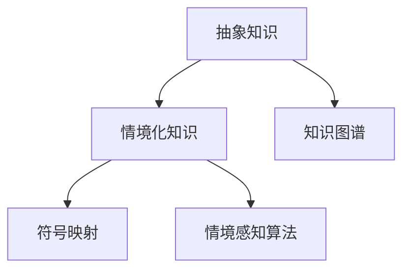
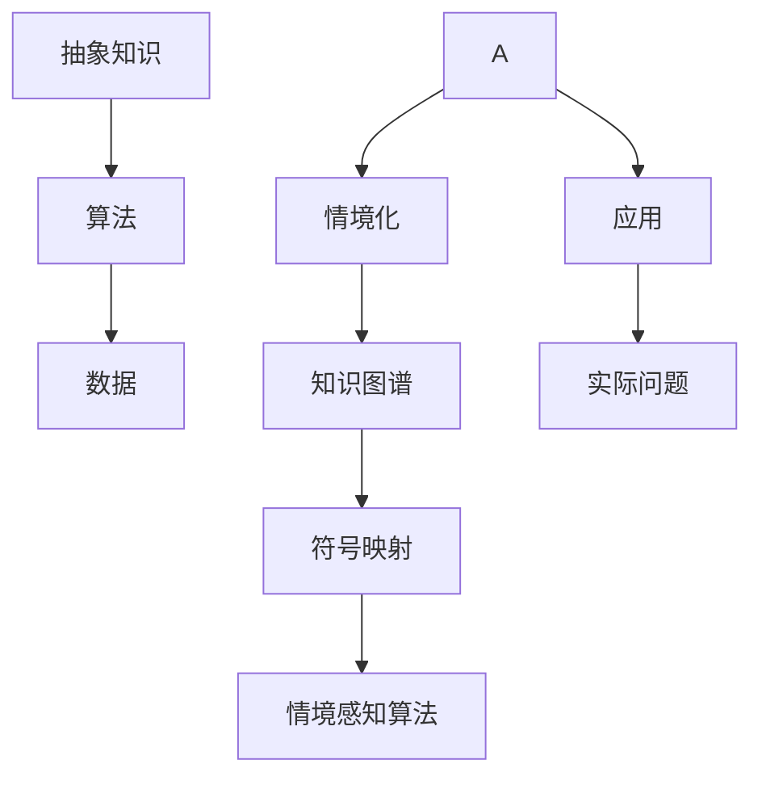

                 

## 1. 背景介绍

### 1.1 问题由来

在计算机科学和人工智能领域，知识的抽象化与形式化一直是推动技术进步的关键。从早期的逻辑推理，到现代的机器学习和深度学习，抽象概念的数学建模和算法实现是构建复杂系统的基础。然而，随着技术的日益复杂化，人们越来越意识到，抽象知识与现实世界的应用之间存在一定的脱节。如何让抽象概念更好地服务于实际应用，成为当前研究的热点。

### 1.2 问题核心关键点

情境化知识（Contextualized Knowledge），即将抽象概念与特定情境相结合，使知识在实际应用中具有明确性和可操作性。这涉及到以下几个核心问题：

- 如何理解和建模情境？
- 如何将情境化知识应用于解决具体问题？
- 情境化知识在实际应用中的挑战与对策？

本文将围绕这三个关键点，探讨知识情境化的原理、方法和应用，旨在为将抽象概念转化为实际应用提供系统性的指导。

## 2. 核心概念与联系

### 2.1 核心概念概述

要理解知识情境化，首先需要了解几个相关核心概念：

- **抽象知识**：指不依赖具体情境，具有普适性的知识，如数学定理、逻辑规则等。
- **情境化知识**：指将抽象知识与具体情境相结合，使知识在特定情境下具有实际应用价值。
- **知识图谱**：以图结构表示知识关系的系统，帮助理解复杂知识网络。
- **符号映射**：通过映射将抽象符号与现实世界对象关联，实现知识情境化。
- **情境感知算法**：通过学习情境信息，优化算法以适应特定情境的需求。

这些概念之间的联系可以通过以下Mermaid流程图来展示：



### 2.2 核心概念原理和架构的 Mermaid 流程图



这个流程图展示了从抽象知识到情境化知识，再到具体应用的整个过程：

1. 抽象知识通过算法和数据进行处理，转化为情境化知识。
2. 情境化知识通过符号映射与知识图谱关联，形成情境感知算法。
3. 情境感知算法应用于实际问题，实现知识的情境化。

## 3. 核心算法原理 & 具体操作步骤

### 3.1 算法原理概述

知识的情境化过程可以视为将抽象知识通过算法映射到具体情境中。其核心原理包括：

- **符号映射**：将抽象符号映射到具体对象或属性上，建立符号与情境的关联。
- **知识图谱构建**：通过构建知识图谱，理解抽象知识在情境中的结构关系。
- **情境感知算法设计**：设计算法使其能够动态感知和适应情境变化，实现知识的情境化应用。

### 3.2 算法步骤详解

以下是知识情境化的详细步骤：

1. **抽象知识抽象**：
   - 提取领域内抽象的知识元素，如定理、规则、算法等。
   - 将知识形式化，以符号、公式或算法表示。

2. **情境定义**：
   - 确定具体的应用情境，如行业需求、业务流程等。
   - 收集与情境相关的数据，如用户行为、环境因素等。

3. **知识图谱构建**：
   - 构建领域知识图谱，映射抽象知识与情境之间的联系。
   - 利用图谱工具如Neo4j、Gephgraph等，对知识进行可视化表示。

4. **符号映射**：
   - 将抽象符号与情境中的对象或属性关联，建立映射关系。
   - 使用RDF、OWL等语义网技术，定义符号映射的规则和逻辑。

5. **情境感知算法设计**：
   - 设计算法，使其能够接收情境信息，动态调整行为。
   - 结合机器学习、深度学习等技术，优化算法性能。

6. **知识情境化应用**：
   - 将情境化知识应用于实际问题解决。
   - 通过API、接口等形式，集成到业务系统中。

7. **评估与迭代**：
   - 收集反馈数据，评估知识情境化应用的效果。
   - 根据评估结果，迭代优化知识图谱、算法和应用模型。

### 3.3 算法优缺点

知识情境化算法的优点包括：

- **增强知识适应性**：将抽象知识与具体情境结合，提升知识在实际应用中的适用性。
- **促进知识传递**：通过符号映射和知识图谱，促进知识的理解和传递。
- **提高问题解决效率**：情境感知算法能够快速适应情境变化，提高问题解决效率。

然而，该算法也存在一些缺点：

- **构建复杂**：构建知识图谱和符号映射需要大量工作，且过程复杂。
- **数据依赖性强**：情境化知识依赖于情境数据，数据质量影响算法效果。
- **算法复杂性高**：情境感知算法设计复杂，需要综合考虑多个因素。

### 3.4 算法应用领域

知识情境化算法在多个领域都有广泛应用：

- **医疗诊断**：将医学知识与患者病情结合，构建情境感知算法，提高诊断准确性。
- **金融风控**：将金融知识与市场数据结合，构建情境感知模型，降低风险。
- **智能客服**：将客服知识与用户行为结合，构建情境感知系统，提升服务质量。
- **教育推荐**：将教育知识与学生行为结合，构建情境感知系统，提供个性化推荐。

## 4. 数学模型和公式 & 详细讲解 & 举例说明

### 4.1 数学模型构建

知识情境化过程可以通过数学模型进行形式化描述。以医疗诊断为例，假设有一个抽象的知识库，包含一系列医学规则和算法。设情境为患者的历史病历和当前症状，记为$x$。设抽象知识库为$K$，其中包含多个规则$R_i$。设情境感知算法为$A$，目标是从$K$中选择最符合$x$的规则$R_i$。

### 4.2 公式推导过程

设$x$为患者当前症状，$R_i$为第$i$个医学规则，$P(R_i|x)$为在情境$x$下规则$R_i$的概率。则选择最符合$x$的规则$R_i$的过程可以形式化为：

$$
\hat{R}_i = \mathop{\arg\max}_{R_i} P(R_i|x) = \mathop{\arg\max}_{R_i} \frac{P(R_i)}{P(x|R_i)}
$$

其中$P(R_i)$为规则$R_i$在知识库$K$中的先验概率，$P(x|R_i)$为在规则$R_i$下患者出现症状$x$的概率。

### 4.3 案例分析与讲解

以医疗诊断为例，将患者的症状$x$映射到知识库中的具体规则$R_i$。

1. 收集患者的病历数据，提取症状$x$。
2. 构建医学知识图谱，定义规则$R_i$及其与症状$x$的关系。
3. 通过符号映射将$x$映射到知识图谱中的节点。
4. 利用情境感知算法$A$，在知识图谱中查找与症状$x$匹配的规则$R_i$。
5. 输出诊断结果，并进行后续治疗建议。

## 5. 项目实践：代码实例和详细解释说明

### 5.1 开发环境搭建

要实现知识情境化的算法，需要搭建一个包含知识库、符号映射和情境感知算法的开发环境。以下是一些常见工具和库：

- **知识库构建工具**：如Neo4j、Gephgraph、Protege等。
- **符号映射工具**：如RDF、OWL、SPARQL等。
- **情境感知算法库**：如TensorFlow、PyTorch、Scikit-Learn等。
- **数据处理工具**：如Pandas、NumPy等。

### 5.2 源代码详细实现

以下是一个简单的医疗诊断示例，展示如何构建情境化知识系统：

```python
from neo4j import GraphDatabase
from rdf import RDFGraph

# 连接数据库
graph_db = GraphDatabase.driver('bolt://localhost:7687', auth=('neo4j', 'password'))

# 构建知识图谱
graph = RDFGraph()
graph.add((r'disease', r'is_subtype_of', r'illness'))
graph.add((r'diabetes', r'is_subtype_of', r'disease'))
graph.add((r'hypoglycemia', r'is_subtype_of', r'diabetes'))
graph.add((r'hypoglycemia', r'has_symptom', r'weakness'))
graph.add((r'hypoglycemia', r'has_symptom', r'dizziness'))
graph.add((r'hypoglycemia', r'has_symptom', r'blurred_vision'))
graph_db.write_transaction(lambda tx: tx.run("CREATE (d:Disease) RETURN d", graph))

# 构建情境感知算法
def get_diagnosis(x):
    # 根据症状$x$，在知识图谱中查找匹配的疾病$d$
    result = graph_db.run("MATCH (d:Disease) WHERE any(s:Symptom in relationships(d)<-[:HAS_SYMPTOM]-(:d)) CONTAINS $x RETURN d", {'x': x})
    # 返回诊断结果
    return result.single()[0]['name'] if result.single() else None

# 测试
print(get_diagnosis('weakness'))
```

### 5.3 代码解读与分析

上述代码展示了一个简单的情境感知算法，其核心步骤包括：

1. **知识图谱构建**：使用Neo4j数据库，将医学知识构建为图谱形式，方便查询和推理。
2. **情境感知算法设计**：定义了一个函数`get_diagnosis`，根据患者的症状$x$，在知识图谱中查找匹配的疾病$d$。
3. **测试与评估**：通过测试`get_diagnosis`函数，验证其正确性。

### 5.4 运行结果展示

运行上述代码，输出结果应为`'hypoglycemia'`，表示患者可能患有低血糖。

## 6. 实际应用场景

### 6.1 医疗诊断

医疗诊断是知识情境化应用的典型场景。通过将医学知识与患者病情结合，构建情境感知算法，可以显著提高诊断准确性和效率。

### 6.2 金融风控

金融风控中，知识情境化算法可以将金融知识与市场数据结合，构建情境感知模型，降低风险。

### 6.3 智能客服

智能客服中，知识情境化算法可以将客服知识与用户行为结合，构建情境感知系统，提升服务质量。

### 6.4 教育推荐

教育推荐中，知识情境化算法可以将教育知识与学生行为结合，构建情境感知系统，提供个性化推荐。

## 7. 工具和资源推荐

### 7.1 学习资源推荐

1. **《知识图谱与语义网》**：深入浅出地介绍了知识图谱的基本概念和构建方法，适合入门学习。
2. **《符号映射与语义网》**：详细讲解了符号映射的原理和技术实现，适合进阶学习。
3. **《情境感知算法》**：介绍了多种情境感知算法的原理和应用案例，适合深入研究。

### 7.2 开发工具推荐

1. **Neo4j**：领先的知识图谱数据库，支持复杂的图谱构建和查询。
2. **TensorFlow**：强大的深度学习框架，适合构建复杂的算法模型。
3. **PyTorch**：灵活的深度学习框架，适合快速迭代开发。
4. **Scikit-Learn**：Python中的机器学习库，适合快速原型开发。

### 7.3 相关论文推荐

1. **《知识图谱在医疗诊断中的应用》**：介绍了知识图谱在医疗诊断中的构建和应用。
2. **《情境感知算法的构建与优化》**：详细探讨了情境感知算法的构建和优化方法。
3. **《符号映射与语义网的技术实现》**：介绍了符号映射与语义网的技术实现方法。

## 8. 总结：未来发展趋势与挑战

### 8.1 总结

本文从背景、原理、步骤和应用等多个角度，系统介绍了知识情境化的过程。通过符号映射和知识图谱，将抽象知识与具体情境结合，提升了知识的适用性和可操作性。通过情境感知算法，动态适应情境变化，提高了问题解决效率。

### 8.2 未来发展趋势

1. **知识图谱的自动化构建**：随着知识图谱构建技术的进步，自动化构建知识图谱将成为可能。
2. **情境感知算法的深度学习化**：结合深度学习技术，设计更加智能的情境感知算法。
3. **多模态知识的情境化**：将视觉、听觉等多模态数据与文本知识结合，实现多模态情境化。
4. **边缘计算的情境感知**：将情境感知算法部署到边缘设备，实时响应情境变化。

### 8.3 面临的挑战

1. **知识图谱的复杂性**：构建知识图谱需要大量手工标注，过程复杂且耗时。
2. **数据质量问题**：情境感知算法依赖于情境数据，数据质量直接影响算法效果。
3. **算法复杂性**：设计复杂的情境感知算法，需要综合考虑多个因素。
4. **实时性要求**：实时响应情境变化，对算法的实时性要求较高。

### 8.4 研究展望

未来的研究需要在以下几个方面寻求新的突破：

1. **自动化构建知识图谱**：开发自动化构建知识图谱的工具和方法，减少手工标注的复杂性。
2. **情境感知算法的优化**：结合深度学习、强化学习等技术，优化情境感知算法的性能。
3. **多模态知识的融合**：将视觉、听觉等多模态数据与文本知识结合，实现多模态情境化。
4. **边缘计算的情境感知**：将情境感知算法部署到边缘设备，实时响应情境变化。

## 9. 附录：常见问题与解答

**Q1：如何构建知识图谱？**

A: 构建知识图谱需要以下步骤：
1. 收集领域内相关的知识元素，如定理、规则、算法等。
2. 定义知识元素之间的关系，如继承、实例化等。
3. 使用工具如Neo4j、Gephgraph等，将知识元素构建为图谱形式。

**Q2：情境感知算法的设计原则是什么？**

A: 情境感知算法的设计原则包括：
1. 实时性：算法应能够快速响应情境变化。
2. 可扩展性：算法应能够处理大规模数据集。
3. 鲁棒性：算法应具备一定的鲁棒性，避免对特定数据集的过度依赖。

**Q3：如何提高知识图谱的构建效率？**

A: 提高知识图谱构建效率的方法包括：
1. 自动化构建工具：使用自动化构建工具，减少手工标注的工作量。
2. 开源社区贡献：贡献开源社区的知识图谱，利用社区的力量提升构建效率。
3. 领域专家合作：与领域专家合作，共同构建知识图谱。

**Q4：如何处理知识图谱中的歧义问题？**

A: 处理知识图谱中的歧义问题的方法包括：
1. 明确知识图谱的结构：定义知识元素之间的明确关系，减少歧义。
2. 使用多源数据融合：结合多个知识源的数据，减少单源数据的歧义。
3. 人工审核与修正：人工审核和修正知识图谱中的歧义问题，确保其准确性。

**Q5：如何评估情境感知算法的性能？**

A: 评估情境感知算法的性能方法包括：
1. 数据集划分：将数据集划分为训练集、验证集和测试集。
2. 模型验证：在验证集上评估模型性能，调整参数。
3. 性能指标：使用准确率、召回率、F1值等性能指标评估模型效果。
4. 应用效果：将模型应用到实际问题中，评估其应用效果。

---

作者：禅与计算机程序设计艺术 / Zen and the Art of Computer Programming

