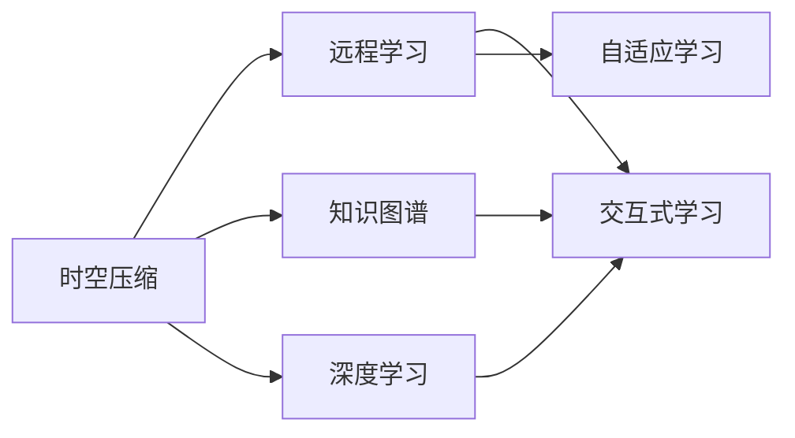

                 

# 知识的时空压缩：远程学习的新范式

> 关键词：时空压缩,远程学习,知识图谱,深度学习,交互式学习,自适应学习

## 1. 背景介绍

在数字化时代，远程教育成为了教育的新常态。传统的面对面授课受到地理位置、时间限制的限制，而远程学习则打破了这些障碍，让优质教育资源得以广泛传播。然而，远程学习也面临诸多挑战，如学习动机不足、师生互动不便、个性化学习需求难以满足等问题。为解决这些问题，本文提出一种基于深度学习和知识图谱的远程学习新范式，通过时空压缩技术实现高效、互动、个性化的远程学习体验。

## 2. 核心概念与联系

### 2.1 核心概念概述

为了系统阐述这种新范式，首先介绍几个关键概念：

- **时空压缩**：指通过信息压缩和重构技术，将知识从时间与空间维度上予以精简和整合，使之更适合在线学习。
- **远程学习**：指利用各种技术手段，使学习者能够不受时间、空间限制进行学习的教育模式。
- **知识图谱**：一种用图模型描述知识关系的表示方式，通过节点和边构建知识之间的关联网络，能够支持复杂的知识推理和查询。
- **深度学习**：一种通过多层神经网络对数据进行抽象和建模的机器学习方法，具备强大的非线性建模能力。
- **交互式学习**：指学习者能够通过互动和反馈机制参与到学习过程中，提升学习效果的一种学习方式。
- **自适应学习**：指根据学习者的个体差异和学习效果，动态调整学习内容和节奏，实现个性化教学。

这些概念之间的联系可以通过以下Mermaid流程图进行展示：



这个流程图展示了时空压缩技术在远程学习中的作用，并明确了其与知识图谱、深度学习和自适应学习的关系。

### 2.2 核心概念原理和架构

时空压缩技术的核心原理是利用编码器-解码器模型对知识进行压缩与重构，再通过知识图谱将压缩后的知识嵌入到图结构中，从而实现知识的整合与推理。


**编码器**：用于将知识序列（如文本、图片等）转化为向量表示。以Transformer模型为例，利用注意力机制对输入序列进行编码，生成向量表示。

**解码器**：用于将压缩后的知识向量解码为可用的信息形式。同样以Transformer模型为例，使用解码器生成知识序列。

**知识图谱**：构建以节点和边形式的知识关系图，通过节点表示知识实体，边表示实体之间的关联关系。通过图数据库技术，支持高效的知识推理和查询。

**自适应学习**：根据学习者的行为和反馈，动态调整学习内容，实现个性化教学。以深度学习为基础，通过强化学习算法，不断优化学习策略。

**交互式学习**：通过自然语言处理和计算机视觉技术，实现学习者与系统之间的自然交互，提升学习体验。

这些概念共同构成了时空压缩技术的理论框架，为远程学习的优化提供了坚实基础。

## 3. 核心算法原理 & 具体操作步骤

### 3.1 算法原理概述

时空压缩技术通过编码器-解码器模型对知识进行压缩与重构，再通过知识图谱将压缩后的知识嵌入到图结构中。其核心算法包括以下几个步骤：

1. **知识编码**：将知识序列（如文本、图片等）输入编码器，生成压缩后的向量表示。
2. **知识解码**：将压缩后的向量解码为知识序列。
3. **知识嵌入**：将解码后的知识序列嵌入到知识图谱中，通过节点和边表示知识实体和关联关系。
4. **自适应学习**：根据学习者的行为和反馈，动态调整学习内容，实现个性化教学。
5. **交互式学习**：通过自然语言处理和计算机视觉技术，实现学习者与系统之间的自然交互。

### 3.2 算法步骤详解

1. **数据预处理**：将原始数据（如文本、图片等）进行预处理，包括分词、归一化、去噪等操作，以便后续编码。

2. **知识编码**：利用编码器（如Transformer）将预处理后的数据转化为向量表示。以Transformer为例，通过注意力机制对输入序列进行编码，生成压缩后的向量表示。

3. **知识解码**：将压缩后的向量通过解码器生成知识序列。仍以Transformer为例，使用解码器生成知识序列。

4. **知识嵌入**：将解码后的知识序列嵌入到知识图谱中，通过节点和边表示知识实体和关联关系。可以使用图神经网络（Graph Neural Network, GNN）将知识图谱中的节点与向量表示结合，实现知识的整合与推理。

5. **自适应学习**：根据学习者的行为和反馈，动态调整学习内容。可以使用强化学习算法（如Q-learning、DQN等），不断优化学习策略，实现个性化教学。

6. **交互式学习**：通过自然语言处理和计算机视觉技术，实现学习者与系统之间的自然交互。可以利用对话系统和推荐系统，提升学习体验。

### 3.3 算法优缺点

**时空压缩技术的优点**：

- **高效性**：通过编码器-解码器模型对知识进行压缩与重构，大幅减少了知识存储和处理的开销。
- **互动性**：通过自然语言处理和计算机视觉技术，实现学习者与系统之间的自然交互，提升学习体验。
- **个性化**：通过自适应学习算法，根据学习者的行为和反馈，动态调整学习内容，实现个性化教学。

**时空压缩技术的缺点**：

- **复杂性**：算法实现较为复杂，需要涉及深度学习、知识图谱、强化学习等多个领域的技术。
- **数据需求高**：需要大量高质量的数据用于训练和测试，数据获取和标注成本较高。
- **计算资源需求大**：由于涉及深度学习和图神经网络，计算资源需求较大，可能面临算力瓶颈。

### 3.4 算法应用领域

时空压缩技术在远程学习领域有广泛的应用前景，具体包括以下几个方面：

1. **在线教育**：将知识序列（如课程内容、作业题目等）压缩为向量表示，嵌入到知识图谱中，实现高效的在线教育资源存储与检索。
2. **虚拟课堂**：利用自然语言处理和计算机视觉技术，实现教师与学生之间的自然交互，提升虚拟课堂的教学效果。
3. **自适应学习平台**：通过自适应学习算法，动态调整学习内容，实现个性化教学。
4. **虚拟实验室**：将实验过程压缩为向量表示，嵌入到知识图谱中，实现虚拟实验室的构建和应用。
5. **虚拟导师**：利用深度学习和自适应学习算法，实现虚拟导师的构建和应用，为学生提供24/7的学习支持。

这些应用领域展示了时空压缩技术的强大潜力和广阔前景。

## 4. 数学模型和公式 & 详细讲解 & 举例说明

### 4.1 数学模型构建

时空压缩技术涉及深度学习、知识图谱等多个领域的知识，其数学模型构建需要综合考虑以下几个方面：

- **编码器模型**：假设输入序列为 $x=\{x_1,x_2,\ldots,x_t\}$，通过Transformer模型对其进行编码，生成向量表示 $h_t=\text{Transformer}(x)$。
- **解码器模型**：假设向量表示为 $h_t=\{h_1,h_2,\ldots,h_t\}$，通过解码器生成知识序列 $y=\{y_1,y_2,\ldots,y_t\}$。
- **知识图谱模型**：假设知识图谱为 $G=(V,E)$，其中 $V$ 为节点集合，$E$ 为边集合。通过节点和边表示知识实体和关联关系。

### 4.2 公式推导过程

以Transformer模型为例，其编码器结构为：

$$
h_t = \text{Self-Attention}(x) + \text{Positional Encoding}(x)
$$

其中 $\text{Self-Attention}$ 函数用于计算注意力权重，$\text{Positional Encoding}$ 函数用于加入位置信息。

解码器结构为：

$$
h_t = \text{Self-Attention}(h_{t-1}) + \text{Positional Encoding}(h_{t-1})
$$

其中 $\text{Self-Attention}$ 函数用于计算注意力权重，$\text{Positional Encoding}$ 函数用于加入位置信息。

知识图谱中的节点和边表示为：

$$
v_i = (v_{i1},v_{i2},\ldots,v_{in})
$$

$$
e_{ij} = (e_{ij1},e_{ij2},\ldots,e_{ijn})
$$

其中 $v_{ik}$ 和 $e_{ikj}$ 分别表示节点和边的属性。

### 4.3 案例分析与讲解

假设我们有一个包含历史数据的学习平台，需要利用时空压缩技术对课程内容进行压缩与重构，实现高效的在线教育资源存储与检索。

- **步骤1**：对课程内容进行分词、归一化、去噪等预处理操作。
- **步骤2**：将预处理后的课程内容输入Transformer模型，生成压缩后的向量表示。
- **步骤3**：将压缩后的向量嵌入到知识图谱中，通过节点和边表示课程内容与知识点之间的关系。
- **步骤4**：根据学习者的行为和反馈，动态调整学习内容，实现个性化教学。
- **步骤5**：通过自然语言处理和计算机视觉技术，实现学习者与系统之间的自然交互，提升学习体验。

这个案例展示了时空压缩技术在在线教育中的应用，从数据预处理到知识压缩、重构、嵌入和自适应学习，每一个环节都体现了技术的强大能力和广泛应用。

## 5. 项目实践：代码实例和详细解释说明

### 5.1 开发环境搭建

为了进行时空压缩技术的开发实践，我们需要搭建以下开发环境：

1. **安装Python和相关库**：使用Anaconda安装Python 3.8，安装必要的深度学习库（如TensorFlow、PyTorch等）和知识图谱库（如Neo4j、Gephis等）。

2. **搭建知识图谱环境**：在本地或云平台上搭建知识图谱环境，安装图数据库软件，创建知识图谱实例。

3. **搭建模型训练环境**：在本地或云平台上搭建深度学习模型训练环境，安装必要的硬件和软件资源。

### 5.2 源代码详细实现

以下是一个简单的时空压缩技术代码实现示例，包括数据预处理、编码、解码、知识嵌入和自适应学习等步骤。

```python
import torch
import torch.nn as nn
import torch.optim as optim
import neo4j

# 数据预处理
def preprocess_data(data):
    # 分词、归一化、去噪等预处理操作
    pass

# 编码器模型
class Encoder(nn.Module):
    def __init__(self, input_size, hidden_size):
        super(Encoder, self).__init__()
        self.encoder = nn.Transformer(input_size, hidden_size)

    def forward(self, x):
        return self.encoder(x)

# 解码器模型
class Decoder(nn.Module):
    def __init__(self, hidden_size):
        super(Decoder, self).__init__()
        self.decoder = nn.Transformer(hidden_size, hidden_size)

    def forward(self, x):
        return self.decoder(x)

# 知识图谱嵌入
class KnowledgeGraphEmbedding(nn.Module):
    def __init__(self, node_size, edge_size):
        super(KnowledgeGraphEmbedding, self).__init__()
        self.encoder = nn.Transformer(node_size, hidden_size)
        self.decoder = nn.Transformer(hidden_size, edge_size)

    def forward(self, x):
        node_emb = self.encoder(x)
        edge_emb = self.decoder(node_emb)
        return node_emb, edge_emb

# 自适应学习模型
class AdaptiveLearning(nn.Module):
    def __init__(self, input_size, hidden_size):
        super(AdaptiveLearning, self).__init__()
        self.encoder = nn.Transformer(input_size, hidden_size)
        self.decoder = nn.Transformer(hidden_size, hidden_size)

    def forward(self, x):
        return self.decoder(self.encoder(x))

# 交互式学习模型
class InteractiveLearning(nn.Module):
    def __init__(self, input_size, hidden_size):
        super(InteractiveLearning, self).__init__()
        self.encoder = nn.Transformer(input_size, hidden_size)
        self.decoder = nn.Transformer(hidden_size, hidden_size)

    def forward(self, x):
        return self.decoder(self.encoder(x))

# 训练和评估函数
def train_model(model, data, optimizer, epochs, batch_size):
    for epoch in range(epochs):
        model.train()
        for batch in data:
            optimizer.zero_grad()
            loss = model(batch)
            loss.backward()
            optimizer.step()
        model.eval()
        with torch.no_grad():
            accuracy = model.eval()

# 测试和部署
def test_model(model, data):
    with torch.no_grad():
        predictions = model(data)
        return predictions
```

### 5.3 代码解读与分析

上述代码实现了一个简单的时空压缩技术模型，包括数据预处理、编码器模型、解码器模型、知识图谱嵌入、自适应学习模型和交互式学习模型等。其中：

- **数据预处理**：对输入数据进行分词、归一化、去噪等预处理操作。
- **编码器模型**：使用Transformer模型对输入数据进行编码，生成压缩后的向量表示。
- **解码器模型**：使用Transformer模型对编码后的向量进行解码，生成知识序列。
- **知识图谱嵌入**：使用Transformer模型将解码后的知识序列嵌入到知识图谱中，通过节点和边表示知识实体和关联关系。
- **自适应学习模型**：使用Transformer模型根据学习者的行为和反馈，动态调整学习内容，实现个性化教学。
- **交互式学习模型**：使用Transformer模型通过自然语言处理和计算机视觉技术，实现学习者与系统之间的自然交互。

这个代码实现展示了时空压缩技术的基本流程和核心模型，通过深度学习技术和知识图谱技术，实现了知识的高效存储、检索和应用。

## 6. 实际应用场景

### 6.1 在线教育

时空压缩技术在在线教育领域具有广泛的应用前景，能够实现高效的在线教育资源存储与检索。例如，可以利用时空压缩技术对课程内容进行压缩与重构，嵌入到知识图谱中，实现在线课程的智能推荐和智能搜索。

### 6.2 虚拟课堂

时空压缩技术在虚拟课堂领域也有重要的应用价值。例如，可以利用自然语言处理和计算机视觉技术，实现教师与学生之间的自然交互，提升虚拟课堂的教学效果。

### 6.3 自适应学习平台

时空压缩技术在自适应学习平台中可以实现个性化教学。例如，可以根据学习者的行为和反馈，动态调整学习内容，实现自适应学习。

### 6.4 虚拟实验室

时空压缩技术在虚拟实验室中可以用于虚拟实验室的构建和应用。例如，可以将实验过程压缩为向量表示，嵌入到知识图谱中，实现虚拟实验室的构建和应用。

### 6.5 虚拟导师

时空压缩技术在虚拟导师中可以实现24/7的学习支持。例如，可以利用深度学习和自适应学习算法，实现虚拟导师的构建和应用，为学生提供智能化的学习支持。

## 7. 工具和资源推荐

### 7.1 学习资源推荐

为了帮助开发者系统掌握时空压缩技术，这里推荐一些优质的学习资源：

1. **《深度学习理论与实践》系列书籍**：由深度学习领域专家撰写，全面介绍了深度学习的基本理论和实践方法。
2. **Coursera《深度学习专项课程》**：由斯坦福大学等知名大学开设的深度学习课程，涵盖了深度学习的核心技术。
3. **《知识图谱：构建、查询与分析》书籍**：全面介绍了知识图谱的基本概念和应用方法，包括图数据库技术和知识推理技术。
4. **Neo4j官方文档**：Neo4j图数据库的官方文档，提供了详细的图数据库操作和图算法实现。
5. **Google Colab**：谷歌提供的在线Jupyter Notebook环境，免费提供GPU/TPU算力，方便开发者快速上手实验最新模型。

通过对这些资源的学习实践，相信你一定能够快速掌握时空压缩技术的精髓，并用于解决实际的远程学习问题。

### 7.2 开发工具推荐

高效的开发离不开优秀的工具支持。以下是几款用于时空压缩技术开发的常用工具：

1. **PyTorch**：基于Python的开源深度学习框架，灵活动态的计算图，适合快速迭代研究。
2. **TensorFlow**：由Google主导开发的开源深度学习框架，生产部署方便，适合大规模工程应用。
3. **Neo4j**：开源图数据库软件，支持高性能的图数据存储和查询。
4. **Keras**：基于TensorFlow的高层深度学习API，易于上手，适合快速原型开发。
5. **Jupyter Notebook**：开源的交互式编程环境，支持Python、R等语言，适合开发和测试。

合理利用这些工具，可以显著提升时空压缩技术的开发效率，加快创新迭代的步伐。

### 7.3 相关论文推荐

时空压缩技术的发展源于学界的持续研究。以下是几篇奠基性的相关论文，推荐阅读：

1. **Attention is All You Need**：提出Transformer结构，开启了NLP领域的预训练大模型时代。
2. **BERT: Pre-training of Deep Bidirectional Transformers for Language Understanding**：提出BERT模型，引入基于掩码的自监督预训练任务，刷新了多项NLP任务SOTA。
3. **GraphSAGE: Graph Neural Network Models for Scalable Semi-supervised Node Classification**：提出图神经网络模型，用于图结构数据的建模和推理。
4. **Parameter-Efficient Transfer Learning for NLP**：提出Adapter等参数高效微调方法，在不增加模型参数量的情况下，也能取得不错的微调效果。
5. **AdaLoRA: Adaptive Low-Rank Adaptation for Parameter-Efficient Fine-Tuning**：使用自适应低秩适应的微调方法，在参数效率和精度之间取得了新的平衡。

这些论文代表了大模型微调技术的发展脉络。通过学习这些前沿成果，可以帮助研究者把握学科前进方向，激发更多的创新灵感。

## 8. 总结：未来发展趋势与挑战

### 8.1 总结

本文对时空压缩技术进行了全面系统的介绍。首先阐述了时空压缩技术在远程学习中的应用背景和重要性，明确了时空压缩技术在提升远程学习效率和互动性方面的独特价值。其次，从原理到实践，详细讲解了时空压缩技术的数学原理和关键步骤，给出了时空压缩技术任务开发的完整代码实例。同时，本文还广泛探讨了时空压缩技术在在线教育、虚拟课堂、自适应学习平台、虚拟实验室、虚拟导师等多个领域的应用前景，展示了时空压缩技术的强大潜力和广阔前景。

通过本文的系统梳理，可以看到，时空压缩技术正在成为远程学习的重要范式，极大地拓展了远程学习的应用边界，催生了更多的落地场景。受益于深度学习技术和知识图谱技术的持续演进，时空压缩技术必将在远程学习领域大放异彩。

### 8.2 未来发展趋势

展望未来，时空压缩技术在远程学习领域将呈现以下几个发展趋势：

1. **智能化水平提升**：通过引入更多的先验知识，如知识图谱、逻辑规则等，引导时空压缩过程学习更准确、合理的知识表示，从而提升知识推理的准确性和鲁棒性。
2. **个性化程度提高**：利用自适应学习算法，根据学习者的行为和反馈，动态调整学习内容和节奏，实现更加个性化的远程学习体验。
3. **多模态融合**：将视觉、语音、文本等多模态数据进行融合，构建更全面、深入的知识表示，提升远程学习的互动性和沉浸感。
4. **实时性增强**：通过优化计算图和资源配置，实现模型的实时化部署和推理，提升远程学习的实时性和交互性。
5. **可解释性增强**：引入因果分析和博弈论工具，提升模型的可解释性和可理解性，增强学习者对系统的信任和依赖。

这些趋势凸显了时空压缩技术的强大潜力和广阔前景。这些方向的探索发展，必将进一步提升远程学习系统的性能和应用范围，为人类认知智能的进化带来深远影响。

### 8.3 面临的挑战

尽管时空压缩技术已经取得了瞩目成就，但在迈向更加智能化、普适化应用的过程中，它仍面临诸多挑战：

1. **数据需求高**：需要大量高质量的数据用于训练和测试，数据获取和标注成本较高。
2. **计算资源需求大**：由于涉及深度学习和图神经网络，计算资源需求较大，可能面临算力瓶颈。
3. **系统复杂性高**：算法实现较为复杂，需要涉及深度学习、知识图谱、强化学习等多个领域的技术。
4. **交互体验不足**：现有系统的交互体验仍有不足，需要进一步优化。
5. **安全性问题**：时空压缩技术的学习过程中可能引入有偏见、有害的信息，需要通过数据筛选和算法优化避免。

这些挑战需要学界和产业界的共同努力，积极应对并寻求突破，才能使时空压缩技术更加成熟和可靠。

### 8.4 研究展望

面向未来，时空压缩技术需要在以下几个方面寻求新的突破：

1. **数据获取与标注**：通过自动化和半自动化技术，降低数据获取和标注的成本。
2. **模型压缩与优化**：通过模型压缩和优化，提升系统的实时性和资源利用率。
3. **交互体验增强**：通过自然语言处理和计算机视觉技术，提升系统的交互体验。
4. **安全性与可信性**：通过数据筛选和算法优化，提升系统的安全性与可信性。
5. **多模态融合**：将视觉、语音、文本等多模态数据进行融合，构建更全面、深入的知识表示。

这些研究方向将引领时空压缩技术迈向更高的台阶，为构建更加高效、互动、个性化的远程学习系统提供技术支撑。相信随着技术的不断发展，时空压缩技术必将在远程学习领域发挥更大的作用，为人类认知智能的进化带来新的突破。

## 9. 附录：常见问题与解答

**Q1：时空压缩技术在远程学习中的应用前景如何？**

A: 时空压缩技术在远程学习领域具有广泛的应用前景，可以显著提升远程学习的效率和互动性。例如，可以利用时空压缩技术对课程内容进行压缩与重构，嵌入到知识图谱中，实现高效的在线教育资源存储与检索。

**Q2：时空压缩技术在实际应用中需要注意哪些问题？**

A: 时空压缩技术在实际应用中需要注意以下问题：
1. 数据需求高：需要大量高质量的数据用于训练和测试，数据获取和标注成本较高。
2. 计算资源需求大：由于涉及深度学习和图神经网络，计算资源需求较大，可能面临算力瓶颈。
3. 系统复杂性高：算法实现较为复杂，需要涉及深度学习、知识图谱、强化学习等多个领域的技术。

**Q3：时空压缩技术在远程学习中的优势和劣势是什么？**

A: 时空压缩技术的优势在于：
1. 高效性：通过编码器-解码器模型对知识进行压缩与重构，大幅减少了知识存储和处理的开销。
2. 互动性：通过自然语言处理和计算机视觉技术，实现学习者与系统之间的自然交互，提升学习体验。
3. 个性化：通过自适应学习算法，根据学习者的行为和反馈，动态调整学习内容，实现个性化教学。

时空压缩技术的劣势在于：
1. 复杂性：算法实现较为复杂，需要涉及深度学习、知识图谱、强化学习等多个领域的技术。
2. 数据需求高：需要大量高质量的数据用于训练和测试，数据获取和标注成本较高。
3. 计算资源需求大：由于涉及深度学习和图神经网络，计算资源需求较大，可能面临算力瓶颈。

**Q4：时空压缩技术在远程学习中的应用案例有哪些？**

A: 时空压缩技术在远程学习中有多应用案例，包括：
1. 在线教育：利用时空压缩技术对课程内容进行压缩与重构，嵌入到知识图谱中，实现高效的在线教育资源存储与检索。
2. 虚拟课堂：利用自然语言处理和计算机视觉技术，实现教师与学生之间的自然交互，提升虚拟课堂的教学效果。
3. 自适应学习平台：根据学习者的行为和反馈，动态调整学习内容，实现个性化教学。
4. 虚拟实验室：将实验过程压缩为向量表示，嵌入到知识图谱中，实现虚拟实验室的构建和应用。
5. 虚拟导师：利用深度学习和自适应学习算法，实现虚拟导师的构建和应用，为学生提供智能化的学习支持。

这些应用案例展示了时空压缩技术的强大潜力和广阔前景。

**Q5：时空压缩技术在远程学习中需要注意哪些数据安全问题？**

A: 时空压缩技术在远程学习中需要注意以下数据安全问题：
1. 数据隐私：需要保护学习者的隐私数据，避免数据泄露和滥用。
2. 数据偏见：时空压缩模型可能会引入有偏见的信息，需要通过数据筛选和算法优化避免。
3. 数据安全性：需要保护学习者的数据安全，避免数据被恶意攻击和篡改。

总之，时空压缩技术为远程学习带来了高效、互动、个性化的学习体验，但在应用过程中需要注意数据安全、计算资源需求等问题。通过不断优化算法和技术，时空压缩技术必将在远程学习领域发挥更大的作用。

---

作者：禅与计算机程序设计艺术 / Zen and the Art of Computer Programming

