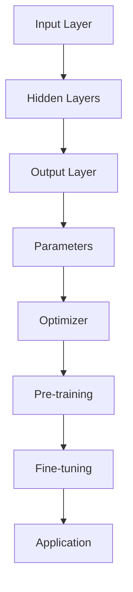

                 

### 文章标题

**AI大模型创业：如何打造未来爆款应用？**

在当今快速发展的技术时代，人工智能（AI）正成为改变商业和社会的驱动力。尤其是大模型，如GPT-3、BERT和LLaMA，它们在自然语言处理、图像识别、预测分析等领域的表现令人瞩目。随着这些模型变得越来越强大，越来越多的创业者开始探索如何利用AI大模型打造未来的爆款应用。本文将深入探讨这一主题，从背景介绍、核心概念与联系、核心算法原理、数学模型与公式、项目实践、实际应用场景、工具和资源推荐等多个角度，提供一系列切实可行的策略和建议，帮助您踏上AI大模型创业的征程。

### Keywords
- AI 大模型
- 创业
- 爆款应用
- 自然语言处理
- 图像识别
- 预测分析

### Abstract
本文旨在为创业者提供一份全面的指南，以了解如何利用AI大模型打造未来的爆款应用。我们将从背景介绍开始，逐步深入探讨核心概念、算法原理、数学模型、项目实践和实际应用场景，并提供一系列实用的工具和资源推荐。通过本文的阅读，您将获得打造AI大模型应用的深刻见解，并掌握必要的技能，为您的创业之路奠定坚实的基础。

<|assistant|>## 1. 背景介绍

### AI与创业

人工智能（AI）的发展在过去几十年中取得了显著的进步。从早期的规则基系统到如今的大型神经网络模型，AI技术已经广泛应用于各个领域，如医疗、金融、零售、交通等。创业领域也不例外，AI正逐渐成为创业者的得力助手。通过AI技术，创业者可以更有效地分析市场数据、优化业务流程、提升用户体验，甚至预测未来趋势。

### 大模型的重要性

随着计算能力的提升和数据量的爆炸性增长，大型预训练模型（Large Pre-trained Models，LPMs）如GPT-3、BERT和LLaMA等应运而生。这些大模型具有极强的学习能力和泛化能力，可以在多种任务上取得优异的性能。对于创业者来说，掌握这些大模型的应用，意味着能够开发出具有颠覆性的产品和服务，从而在竞争激烈的市场中脱颖而出。

### 当前趋势

近年来，AI大模型的应用场景日益丰富，例如：

- **自然语言处理（NLP）**：从智能客服、文本生成到自动摘要和翻译，NLP大模型已经深入到日常生活的方方面面。
- **图像识别**：大模型在医学影像分析、自动驾驶和安防监控等领域展现出强大的潜力。
- **预测分析**：通过分析大量历史数据，大模型可以帮助创业者预测市场趋势、消费者行为，从而做出更明智的决策。

### 爆款应用的定义

在AI领域，爆款应用通常指的是那些在短时间内获得广泛关注和用户喜爱的应用。这些应用不仅解决了用户的具体需求，而且在设计、功能和用户体验上具有独特性。打造一款爆款应用，意味着在产品竞争激烈的市场中占据一席之地，吸引大量的用户和投资者。

### 目的与结构

本文旨在为创业者提供一份详细的指南，帮助他们了解如何利用AI大模型打造未来的爆款应用。文章结构如下：

1. **背景介绍**：介绍AI、大模型和创业的相关背景。
2. **核心概念与联系**：探讨AI大模型的核心概念和架构，以及它们在不同应用场景中的联系。
3. **核心算法原理 & 具体操作步骤**：详细讲解AI大模型的关键算法原理和具体操作步骤。
4. **数学模型和公式 & 详细讲解 & 举例说明**：介绍AI大模型背后的数学模型和公式，并提供实例说明。
5. **项目实践：代码实例和详细解释说明**：通过具体项目实例展示AI大模型的应用，并提供详细的代码实现和解读。
6. **实际应用场景**：分析AI大模型在不同领域的实际应用场景。
7. **工具和资源推荐**：推荐学习资源、开发工具和框架。
8. **总结：未来发展趋势与挑战**：总结AI大模型创业的趋势和面临的挑战。
9. **附录：常见问题与解答**：解答读者可能遇到的问题。
10. **扩展阅读 & 参考资料**：提供进一步学习的资源。

通过本文的阅读，创业者将获得打造AI大模型应用的深刻见解，为未来的创业之路奠定坚实的基础。

### Background Introduction

#### AI and Entrepreneurship

The development of artificial intelligence (AI) has made significant strides over the past few decades. From rule-based systems in the early days to the large neural network models we have today, AI technology has been widely applied across various fields, including healthcare, finance, retail, and transportation. The entrepreneurship domain is no exception, with AI emerging as a powerful assistant for entrepreneurs. Through AI technology, entrepreneurs can more effectively analyze market data, optimize business processes, and enhance user experiences, as well as predict future trends.

#### The Importance of Large Models

With the advancement of computational power and the explosive growth of data, large pre-trained models (Large Pre-trained Models, LPMs) like GPT-3, BERT, and LLaMA have emerged. These large models possess strong learning and generalization abilities, achieving outstanding performance on a variety of tasks. For entrepreneurs, mastering the application of these large models means developing disruptive products and services that can stand out in a competitive market.

#### Current Trends

In recent years, the applications of large models have become increasingly diverse, including:

- **Natural Language Processing (NLP)**: From intelligent customer service, text generation, to automatic summarization and translation, NLP large models have permeated various aspects of everyday life.
- **Image Recognition**: Large models have shown great potential in fields such as medical image analysis, autonomous driving, and security monitoring.
- **Predictive Analytics**: By analyzing vast amounts of historical data, large models can help entrepreneurs predict market trends and consumer behavior, enabling more informed decision-making.

#### Definition of Hit Applications

In the field of AI, hit applications typically refer to those that gain widespread attention and user favor within a short period. These applications not only address specific user needs but also exhibit uniqueness in design, functionality, and user experience. Creating a hit application means securing a position in a highly competitive market, attracting a large number of users and investors.

#### Purpose and Structure

This article aims to provide entrepreneurs with a comprehensive guide on how to utilize AI large models to create future hit applications. The structure of the article is as follows:

1. **Background Introduction**: Introduces the background of AI, large models, and entrepreneurship.
2. **Core Concepts and Connections**: Discusses the core concepts and architectures of AI large models and their connections in various application scenarios.
3. **Core Algorithm Principles and Specific Operational Steps**: Provides a detailed explanation of the key algorithm principles and specific operational steps of AI large models.
4. **Mathematical Models and Formulas & Detailed Explanation & Example Illustrations**: Introduces the mathematical models and formulas behind AI large models, along with example illustrations.
5. **Project Practice: Code Examples and Detailed Explanations**: Demonstrates the application of AI large models through specific project examples, providing detailed code implementation and analysis.
6. **Practical Application Scenarios**: Analyzes the practical application scenarios of AI large models in different fields.
7. **Tools and Resources Recommendations**: Recommends learning resources, development tools, and frameworks.
8. **Summary: Future Development Trends and Challenges**: Summarizes the trends and challenges in AI large model entrepreneurship.
9. **Appendix: Frequently Asked Questions and Answers**: Answers common questions readers may encounter.
10. **Extended Reading & Reference Materials**: Provides further learning resources.

By reading this article, entrepreneurs will gain profound insights into creating AI large model applications, laying a solid foundation for their future entrepreneurial journey.

<|assistant|>## 2. 核心概念与联系

在探索如何利用AI大模型打造未来爆款应用之前，我们需要了解AI大模型的基本概念及其在不同应用场景中的联系。这一节将详细介绍AI大模型的核心概念、关键组成部分、工作原理以及它们在各个领域中的应用。

### 2.1 AI大模型的基本概念

AI大模型是指那些经过大规模数据预训练的复杂神经网络模型，具有极高的参数数量和强大的学习能力。这些模型通过学习大量的文本、图像、音频和视频数据，能够在多种任务上表现出色，如文本生成、图像识别、语音识别和预测分析。

### 2.2 关键组成部分

AI大模型通常由以下几个关键组成部分构成：

1. **输入层（Input Layer）**：接收外部输入数据，如文本、图像或音频。
2. **隐藏层（Hidden Layers）**：执行复杂的非线性变换，提取特征和模式。
3. **输出层（Output Layer）**：生成预测结果或输出，如文本、图像或分类标签。
4. **参数（Parameters）**：模型的权重和偏置，决定了模型的性能和表现。
5. **优化器（Optimizer）**：调整模型参数，以最小化预测误差。

### 2.3 工作原理

AI大模型的工作原理基于深度学习（Deep Learning）和神经网络（Neural Networks）。在预训练阶段，模型通过大量数据学习如何自动提取特征和模式。在微调（Fine-tuning）阶段，模型根据特定任务进行调整，以适应特定场景。

### 2.4 在不同领域中的应用

AI大模型在多个领域都展现了强大的应用潜力，以下是一些关键领域：

1. **自然语言处理（NLP）**：用于文本生成、机器翻译、情感分析等。
2. **图像识别**：用于医学影像分析、自动驾驶、安防监控等。
3. **预测分析**：用于市场预测、股票分析、风险评估等。
4. **推荐系统**：用于个性化推荐、广告投放等。

### 2.5 Mermaid流程图

以下是一个简单的Mermaid流程图，展示了AI大模型的基本架构和工作流程：



### 2.6 提示词工程

提示词工程是AI大模型应用中的一个关键环节，它涉及设计和管理输入给模型的文本提示。一个良好的提示词可以引导模型生成更符合预期的输出。提示词工程的目标是优化提示词的质量，以提高模型的性能和输出质量。

### 2.7 提示词工程的重要性

提示词工程在AI大模型应用中的重要性不可忽视。以下是几个关键点：

- **提高输出质量**：精心设计的提示词可以引导模型生成更准确、更相关、更有价值的输出。
- **节省计算资源**：优化提示词可以减少模型的训练时间，节省计算资源。
- **增强用户体验**：更好的输出质量直接提升了用户体验，有助于吸引更多用户。

### 2.8 提示词工程与传统编程的关系

提示词工程可以被视为一种新型的编程范式，其中我们使用自然语言而不是代码来指导模型的行为。这类似于传统编程中的函数调用，其中输入参数（提示词）决定了函数的返回值（模型输出）。

综上所述，理解AI大模型的核心概念与联系，对于创业者来说至关重要。通过深入了解这些概念，创业者可以更好地利用AI大模型的技术优势，打造出未来具有颠覆性的爆款应用。

### Core Concepts and Connections

Before exploring how to leverage AI large models to create future hit applications, it is essential to understand the basic concepts of AI large models and their connections in various application scenarios. This section will delve into the fundamental concepts of AI large models, their key components, working principles, and their applications across different fields.

#### 2.1 Basic Concepts of AI Large Models

AI large models refer to complex neural network models that have undergone massive data pre-training, possessing a high number of parameters and strong learning capabilities. These models learn from a vast amount of text, images, audio, and video data, enabling them to perform outstandingly on a variety of tasks, such as text generation, image recognition, speech recognition, and predictive analytics.

#### 2.2 Key Components

AI large models typically consist of the following key components:

1. **Input Layer**: Receives external input data, such as text, images, or audio.
2. **Hidden Layers**: Execute complex nonlinear transformations, extracting features and patterns.
3. **Output Layer**: Generates prediction results or outputs, such as text, images, or classification labels.
4. **Parameters**: The model's weights and biases, determining the model's performance and behavior.
5. **Optimizer**: Adjusts model parameters to minimize prediction errors.

#### 2.3 Working Principles

The working principle of AI large models is based on deep learning and neural networks. During the pre-training phase, the model learns how to automatically extract features and patterns from large amounts of data. In the fine-tuning phase, the model is adjusted according to a specific task to adapt to a particular scenario.

#### 2.4 Applications in Different Fields

AI large models have shown great potential in various fields, including:

1. **Natural Language Processing (NLP)**: Used for text generation, machine translation, sentiment analysis, etc.
2. **Image Recognition**: Used for medical image analysis, autonomous driving, security monitoring, etc.
3. **Predictive Analytics**: Used for market forecasting, stock analysis, risk assessment, etc.
4. **Recommendation Systems**: Used for personalized recommendations, advertising targeting, etc.

#### 2.5 Mermaid Flowchart

The following is a simple Mermaid flowchart illustrating the basic architecture and workflow of AI large models:


#### 2.6 Prompt Engineering

Prompt engineering is a critical component in the application of AI large models. It involves designing and managing the text prompts that are input to the model. A well-crafted prompt can guide the model to generate outputs that are more in line with expectations. The goal of prompt engineering is to optimize the quality of prompts to improve model performance and output quality.

#### 2.7 Importance of Prompt Engineering

The importance of prompt engineering in the application of AI large models cannot be overstated. Here are a few key points:

- **Improving Output Quality**: Well-designed prompts can guide the model to generate more accurate, relevant, and valuable outputs.
- **Saving Computational Resources**: Optimized prompts can reduce training time, saving computational resources.
- **Enhancing User Experience**: Better output quality directly enhances user experience, helping to attract more users.

#### 2.8 Relationship between Prompt Engineering and Traditional Programming

Prompt engineering can be seen as a new paradigm of programming, where we use natural language instead of code to direct model behavior. This is analogous to traditional programming, where input parameters (prompts) determine the return value (model output) of a function.

In summary, understanding the core concepts and connections of AI large models is crucial for entrepreneurs. By delving into these concepts, entrepreneurs can better leverage the technical advantages of AI large models to create future disruptive hit applications.

<|assistant|>## 3. 核心算法原理 & 具体操作步骤

要打造一款成功的AI大模型应用，理解其核心算法原理和具体操作步骤至关重要。在这一节中，我们将深入探讨AI大模型的关键算法原理，并详细讲解如何使用这些算法来构建和训练模型。

### 3.1 深度学习基础

深度学习（Deep Learning）是AI大模型的基础，它依赖于多层神经网络（Neural Networks）来学习和提取数据中的复杂特征。以下是深度学习的一些基本组成部分：

1. **神经网络（Neural Networks）**：神经网络是由一系列神经元（或节点）组成的有向图。每个神经元通过权重连接到其他神经元，并使用激活函数产生输出。
2. **激活函数（Activation Functions）**：激活函数用于引入非线性性，使神经网络能够拟合复杂的非线性关系。常见的激活函数包括ReLU、Sigmoid和Tanh。
3. **损失函数（Loss Functions）**：损失函数用于衡量模型的预测结果与真实值之间的差异。常用的损失函数包括均方误差（MSE）和交叉熵（Cross Entropy）。
4. **优化器（Optimizers）**：优化器用于调整模型参数，以最小化损失函数。常见的优化器包括随机梯度下降（SGD）、Adam和RMSprop。

### 3.2 训练过程

AI大模型的训练过程通常包括以下几个步骤：

1. **数据预处理（Data Preprocessing）**：数据预处理包括清洗、归一化和编码。在训练AI大模型之前，需要对数据进行预处理，以确保其适合输入模型。
2. **模型初始化（Model Initialization）**：模型初始化是指为模型的权重和偏置分配初始值。常用的初始化方法包括随机初始化和He初始化。
3. **前向传播（Forward Propagation）**：在前向传播过程中，模型接收输入数据，并通过前向传播计算输出。输出是通过多层神经网络的非线性变换得到的。
4. **计算损失（Compute Loss）**：计算损失函数来衡量模型的预测结果与真实值之间的差异。
5. **反向传播（Backpropagation）**：在反向传播过程中，模型通过反向传播计算损失关于每个参数的梯度，并更新参数以最小化损失。
6. **迭代优化（Iterative Optimization）**：通过重复执行前向传播和反向传播，模型不断优化其参数，直到损失函数达到预定的阈值或达到预定的迭代次数。

### 3.3 模型评估

在训练完成后，需要对模型进行评估，以确保其性能符合预期。以下是一些常见的模型评估指标：

1. **准确率（Accuracy）**：准确率是模型预测正确的样本数与总样本数的比例。
2. **精确率（Precision）**：精确率是模型预测正确的正例数与所有预测为正例的样本数之比。
3. **召回率（Recall）**：召回率是模型预测正确的正例数与实际为正例的样本数之比。
4. **F1分数（F1 Score）**：F1分数是精确率和召回率的加权平均，用于综合评估模型的性能。

### 3.4 具体操作步骤

以下是一个使用TensorFlow构建和训练AI大模型的示例步骤：

1. **导入必要的库**：
   ```python
   import tensorflow as tf
   import numpy as np
   ```

2. **数据预处理**：
   ```python
   # 加载数据集
   (x_train, y_train), (x_test, y_test) = tf.keras.datasets.mnist.load_data()

   # 归一化
   x_train = x_train / 255.0
   x_test = x_test / 255.0

   # 编码
   y_train = tf.keras.utils.to_categorical(y_train)
   y_test = tf.keras.utils.to_categorical(y_test)
   ```

3. **模型初始化**：
   ```python
   # 创建模型
   model = tf.keras.Sequential([
       tf.keras.layers.Flatten(input_shape=(28, 28)),
       tf.keras.layers.Dense(128, activation='relu'),
       tf.keras.layers.Dense(10, activation='softmax')
   ])

   # 初始化权重和偏置
   model.compile(optimizer='adam',
                 loss='categorical_crossentropy',
                 metrics=['accuracy'])
   ```

4. **模型训练**：
   ```python
   # 训练模型
   model.fit(x_train, y_train, epochs=5, batch_size=32)
   ```

5. **模型评估**：
   ```python
   # 评估模型
   model.evaluate(x_test, y_test)
   ```

通过以上步骤，我们可以构建和训练一个简单的AI大模型，并评估其性能。在实际应用中，模型可能会更复杂，需要更多的时间和计算资源，但基本原理和步骤是相似的。

### Core Algorithm Principles and Specific Operational Steps

To create a successful AI large model application, understanding the core algorithm principles and specific operational steps is crucial. In this section, we will delve into the fundamental principles of AI large model algorithms and provide a detailed explanation of how to use these algorithms to construct and train models.

#### 3.1 Deep Learning Basics

Deep Learning serves as the foundation for AI large models. It relies on多层神经网络（Neural Networks）to learn and extract complex features from data. The following are the basic components of Deep Learning:

1. **Neural Networks**: Neural Networks consist of a series of neurons (or nodes) connected in a directed graph. Each neuron is connected to other neurons through weights, and an activation function is used to produce an output.
2. **Activation Functions**: Activation Functions introduce nonlinearity, allowing neural networks to fit complex nonlinear relationships. Common activation functions include ReLU, Sigmoid, and Tanh.
3. **Loss Functions**: Loss Functions measure the difference between the model's predictions and the true values. Common loss functions include Mean Squared Error (MSE) and Cross Entropy.
4. **Optimizers**: Optimizers adjust model parameters to minimize the loss function. Common optimizers include Stochastic Gradient Descent (SGD), Adam, and RMSprop.

#### 3.2 Training Process

The training process of AI large models typically includes several steps:

1. **Data Preprocessing**: Data preprocessing involves cleaning, normalization, and encoding. Before training an AI large model, data must be preprocessed to ensure it is suitable for input into the model.
2. **Model Initialization**: Model initialization refers to assigning initial values to the model's weights and biases. Common initialization methods include random initialization and He initialization.
3. **Forward Propagation**: During forward propagation, the model receives input data and computes the output through forward propagation. The output is obtained through nonlinear transformations of the multi-layer neural network.
4. **Compute Loss**: The loss function is used to measure the difference between the model's predictions and the true values.
5. **Backpropagation**: During backpropagation, the model computes the gradients of the loss function with respect to each parameter and updates the parameters to minimize the loss.
6. **Iterative Optimization**: By repeatedly performing forward propagation and backpropagation, the model continuously optimizes its parameters until the loss function reaches a predefined threshold or a predetermined number of iterations.

#### 3.3 Model Evaluation

After training, the model's performance must be evaluated to ensure it meets expectations. The following are some common model evaluation metrics:

1. **Accuracy**: Accuracy is the ratio of the number of correctly predicted samples to the total number of samples.
2. **Precision**: Precision is the ratio of the number of correctly predicted positive samples to all predicted positive samples.
3. **Recall**: Recall is the ratio of the number of correctly predicted positive samples to the actual positive samples.
4. **F1 Score**: The F1 score is the weighted average of precision and recall, used to comprehensively evaluate model performance.

#### 3.4 Specific Operational Steps

The following is an example of steps to construct and train a simple AI large model using TensorFlow:

1. **Import necessary libraries**:
   ```python
   import tensorflow as tf
   import numpy as np
   ```

2. **Data preprocessing**:
   ```python
   # Load dataset
   (x_train, y_train), (x_test, y_test) = tf.keras.datasets.mnist.load_data()

   # Normalize
   x_train = x_train / 255.0
   x_test = x_test / 255.0

   # Encode
   y_train = tf.keras.utils.to_categorical(y_train)
   y_test = tf.keras.utils.to_categorical(y_test)
   ```

3. **Model initialization**:
   ```python
   # Create model
   model = tf.keras.Sequential([
       tf.keras.layers.Flatten(input_shape=(28, 28)),
       tf.keras.layers.Dense(128, activation='relu'),
       tf.keras.layers.Dense(10, activation='softmax')
   ])

   # Initialize weights and biases
   model.compile(optimizer='adam',
                 loss='categorical_crossentropy',
                 metrics=['accuracy'])
   ```

4. **Model training**:
   ```python
   # Train model
   model.fit(x_train, y_train, epochs=5, batch_size=32)
   ```

5. **Model evaluation**:
   ```python
   # Evaluate model
   model.evaluate(x_test, y_test)
   ```

By following these steps, we can construct and train a simple AI large model and evaluate its performance. In practice, models may be more complex and require more time and computational resources, but the basic principles and steps are similar.

<|assistant|>## 4. 数学模型和公式 & 详细讲解 & 举例说明

在构建AI大模型时，理解背后的数学模型和公式至关重要。这一节将详细讲解AI大模型中常用的数学模型和公式，并使用具体的例子进行说明。

### 4.1 前向传播

前向传播是神经网络中的一种基本操作，用于计算输出。以下是前向传播的核心数学公式：

$$
Z = X \cdot W + b
$$

其中，\( Z \) 是激活值，\( X \) 是输入特征，\( W \) 是权重，\( b \) 是偏置。

$$
A = \sigma(Z)
$$

其中，\( A \) 是激活输出，\( \sigma \) 是激活函数，如ReLU、Sigmoid或Tanh。

#### 举例说明

假设我们有一个简单的两层神经网络，输入特征为 \( X \)，权重为 \( W_1 \) 和 \( W_2 \)，偏置为 \( b_1 \) 和 \( b_2 \)，激活函数为ReLU。前向传播的计算过程如下：

1. **第一层输出**：
   $$
   Z_1 = X \cdot W_1 + b_1 \\
   A_1 = \max(0, Z_1)
   $$

2. **第二层输出**：
   $$
   Z_2 = A_1 \cdot W_2 + b_2 \\
   A_2 = \max(0, Z_2)
   $$
   
   最终输出 \( A_2 \) 就是神经网络的预测结果。

### 4.2 反向传播

反向传播是用于计算梯度并更新参数的过程。以下是反向传播的核心数学公式：

$$
\frac{\partial L}{\partial Z} = \frac{\partial L}{\partial A} \cdot \frac{\partial A}{\partial Z}
$$

其中，\( L \) 是损失函数，\( Z \) 是激活值，\( A \) 是激活输出。

$$
\frac{\partial L}{\partial W} = X \cdot \frac{\partial L}{\partial Z} \\
\frac{\partial L}{\partial b} = \frac{\partial L}{\partial Z}
$$

#### 举例说明

假设我们有一个简单的两层神经网络，损失函数为均方误差（MSE），输出为 \( A_2 \)，激活输出为 \( Z_2 \)，输入特征为 \( X \)，权重为 \( W_2 \)，偏置为 \( b_2 \)。反向传播的计算过程如下：

1. **计算 \( \frac{\partial L}{\partial Z_2} \)**：
   $$
   \frac{\partial L}{\partial Z_2} = 2 \cdot (A_2 - y)
   $$

2. **计算 \( \frac{\partial L}{\partial W_2} \)**：
   $$
   \frac{\partial L}{\partial W_2} = X \cdot \frac{\partial L}{\partial Z_2} \\
   \frac{\partial L}{\partial b_2} = \frac{\partial L}{\partial Z_2}
   $$

3. **更新参数**：
   $$
   W_2 = W_2 - \alpha \cdot \frac{\partial L}{\partial W_2} \\
   b_2 = b_2 - \alpha \cdot \frac{\partial L}{\partial b_2}
   $$

   其中，\( \alpha \) 是学习率。

通过这种方式，我们可以使用反向传播算法不断更新模型参数，以最小化损失函数。

### 4.3 损失函数

损失函数是衡量模型预测结果与真实值之间差异的函数。常用的损失函数包括均方误差（MSE）、交叉熵（Cross Entropy）和Huber损失。

- **均方误差（MSE）**：
  $$
  L = \frac{1}{n} \sum_{i=1}^{n} (y_i - \hat{y}_i)^2
  $$

- **交叉熵（Cross Entropy）**：
  $$
  L = -\sum_{i=1}^{n} y_i \cdot \log(\hat{y}_i)
  $$

- **Huber损失**：
  $$
  L = \begin{cases}
  \frac{1}{2}(y - \hat{y})^2 & \text{if } |y - \hat{y}| \leq \delta \\
  \delta(|y - \hat{y}| - \frac{\delta}{2}) & \text{otherwise}
  \end{cases}
  $$

#### 举例说明

假设我们有一个简单的回归问题，预测结果为 \( \hat{y} \)，真实值为 \( y \)，学习率为 \( \alpha = 0.1 \)。使用MSE作为损失函数，更新参数的过程如下：

1. **计算损失**：
   $$
   L = \frac{1}{2}(y - \hat{y})^2
   $$

2. **计算梯度**：
   $$
   \frac{\partial L}{\partial \hat{y}} = y - \hat{y}
   $$

3. **更新参数**：
   $$
   \hat{y} = \hat{y} - \alpha \cdot (y - \hat{y}) \\
   \hat{y} = \hat{y} + 0.1 \cdot (y - \hat{y}) \\
   \hat{y} = 1.1 \cdot y - 0.1 \cdot \hat{y}
   $$

通过这种方式，我们可以不断更新预测结果，使其逐渐逼近真实值。

### Conclusion

Understanding the mathematical models and formulas behind AI large models is crucial for building and training these models effectively. The examples provided in this section demonstrate how to use these mathematical principles in practice. By mastering these concepts, entrepreneurs can develop innovative AI applications that address real-world problems and create significant value.

### Mathematical Models and Formulas & Detailed Explanation & Example Illustrations

Understanding the mathematical models and formulas underlying AI large models is essential for effectively constructing and training these models. This section will delve into the common mathematical models and formulas used in AI large models, along with detailed explanations and examples to illustrate their application.

#### 4.1 Forward Propagation

Forward propagation is a fundamental operation in neural networks used to compute the output. The core mathematical formula for forward propagation is as follows:

$$
Z = X \cdot W + b
$$

where \( Z \) represents the activation value, \( X \) is the input feature, \( W \) are the weights, and \( b \) is the bias.

$$
A = \sigma(Z)
$$

where \( A \) is the activation output, and \( \sigma \) is the activation function, such as ReLU, Sigmoid, or Tanh.

##### Example Illustration

Consider a simple two-layer neural network with input features \( X \), weights \( W_1 \) and \( W_2 \), and biases \( b_1 \) and \( b_2 \), with an activation function of ReLU. The forward propagation computation process is as follows:

1. **Output of the first layer**:
   $$
   Z_1 = X \cdot W_1 + b_1 \\
   A_1 = \max(0, Z_1)
   $$

2. **Output of the second layer**:
   $$
   Z_2 = A_1 \cdot W_2 + b_2 \\
   A_2 = \max(0, Z_2)
   $$

The final output \( A_2 \) is the prediction result of the neural network.

#### 4.2 Backpropagation

Backpropagation is the process used to compute gradients and update parameters. The core mathematical formula for backpropagation is as follows:

$$
\frac{\partial L}{\partial Z} = \frac{\partial L}{\partial A} \cdot \frac{\partial A}{\partial Z}
$$

where \( L \) is the loss function, \( Z \) is the activation value, and \( A \) is the activation output.

$$
\frac{\partial L}{\partial W} = X \cdot \frac{\partial L}{\partial Z} \\
\frac{\partial L}{\partial b} = \frac{\partial L}{\partial Z}
$$

##### Example Illustration

Assume we have a simple two-layer neural network with a mean squared error (MSE) loss function, output \( A_2 \), activation output \( Z_2 \), input features \( X \), weights \( W_2 \), and bias \( b_2 \). The backpropagation computation process is as follows:

1. **Compute \( \frac{\partial L}{\partial Z_2} \)**:
   $$
   \frac{\partial L}{\partial Z_2} = 2 \cdot (A_2 - y)
   $$

2. **Compute \( \frac{\partial L}{\partial W_2} \)**:
   $$
   \frac{\partial L}{\partial W_2} = X \cdot \frac{\partial L}{\partial Z_2} \\
   \frac{\partial L}{\partial b_2} = \frac{\partial L}{\partial Z_2}
   $$

3. **Update parameters**:
   $$
   W_2 = W_2 - \alpha \cdot \frac{\partial L}{\partial W_2} \\
   b_2 = b_2 - \alpha \cdot \frac{\partial L}{\partial b_2}
   $$

   where \( \alpha \) is the learning rate.

By this method, we can use backpropagation to continuously update model parameters to minimize the loss function.

#### 4.3 Loss Functions

Loss functions are used to measure the difference between the model's predictions and the true values. Common loss functions include mean squared error (MSE), cross-entropy, and Huber loss.

- **Mean Squared Error (MSE)**:
  $$
  L = \frac{1}{n} \sum_{i=1}^{n} (y_i - \hat{y}_i)^2
  $$

- **Cross Entropy**:
  $$
  L = -\sum_{i=1}^{n} y_i \cdot \log(\hat{y}_i)
  $$

- **Huber Loss**:
  $$
  L = \begin{cases}
  \frac{1}{2}(y - \hat{y})^2 & \text{if } |y - \hat{y}| \leq \delta \\
  \delta(|y - \hat{y}| - \frac{\delta}{2}) & \text{otherwise}
  \end{cases}
  $$

##### Example Illustration

Suppose we have a simple regression problem with prediction result \( \hat{y} \), true value \( y \), and learning rate \( \alpha = 0.1 \). Using MSE as the loss function, the process for updating parameters is as follows:

1. **Compute loss**:
   $$
   L = \frac{1}{2}(y - \hat{y})^2
   $$

2. **Compute gradient**:
   $$
   \frac{\partial L}{\partial \hat{y}} = y - \hat{y}
   $$

3. **Update parameters**:
   $$
   \hat{y} = \hat{y} - \alpha \cdot (y - \hat{y}) \\
   \hat{y} = \hat{y} + 0.1 \cdot (y - \hat{y}) \\
   \hat{y} = 1.1 \cdot y - 0.1 \cdot \hat{y}
   $$

By this method, we can continuously update the prediction result to approach the true value.

### Conclusion

Understanding the mathematical models and formulas behind AI large models is crucial for effectively building and training these models. The examples provided in this section demonstrate how to apply these mathematical principles in practice. By mastering these concepts, entrepreneurs can develop innovative AI applications that address real-world problems and create significant value.

<|assistant|>## 5. 项目实践：代码实例和详细解释说明

### 5.1 开发环境搭建

在开始构建AI大模型应用之前，我们需要搭建一个合适的开发环境。以下是一个基本的步骤，用于设置一个Python开发环境，以使用TensorFlow和Keras来构建和训练模型。

#### 系统要求

- 操作系统：Windows、macOS或Linux
- Python版本：3.6及以上版本

#### 安装Python和pip

首先，确保您的系统上安装了Python和pip。Python可以从[Python官网](https://www.python.org/)下载并安装。安装过程中，请确保勾选“Add Python to PATH”选项，以便在命令行中使用Python。

#### 安装TensorFlow和Keras

接下来，我们需要安装TensorFlow和Keras。在命令行中运行以下命令：

```bash
pip install tensorflow
pip install keras
```

#### 验证安装

安装完成后，通过运行以下命令来验证TensorFlow和Keras是否已成功安装：

```bash
python -c "import tensorflow as tf; print(tf.__version__)"
python -c "import keras; print(keras.__version__)"
```

如果命令行中显示了版本号，说明安装成功。

### 5.2 源代码详细实现

以下是一个简单的例子，展示如何使用TensorFlow和Keras构建一个基于卷积神经网络（CNN）的手写数字识别模型。我们将使用MNIST数据集，这是一个常用的手写数字识别数据集。

```python
import tensorflow as tf
from tensorflow.keras import layers, models
from tensorflow.keras.datasets import mnist
from tensorflow.keras.utils import to_categorical

# 加载MNIST数据集
(train_images, train_labels), (test_images, test_labels) = mnist.load_data()

# 数据预处理
train_images = train_images.reshape((60000, 28, 28, 1)).astype('float32') / 255
test_images = test_images.reshape((10000, 28, 28, 1)).astype('float32') / 255

train_labels = to_categorical(train_labels)
test_labels = to_categorical(test_labels)

# 构建模型
model = models.Sequential()
model.add(layers.Conv2D(32, (3, 3), activation='relu', input_shape=(28, 28, 1)))
model.add(layers.MaxPooling2D((2, 2)))
model.add(layers.Conv2D(64, (3, 3), activation='relu'))
model.add(layers.MaxPooling2D((2, 2)))
model.add(layers.Conv2D(64, (3, 3), activation='relu'))
model.add(layers.Flatten())
model.add(layers.Dense(64, activation='relu'))
model.add(layers.Dense(10, activation='softmax'))

# 编译模型
model.compile(optimizer='adam',
              loss='categorical_crossentropy',
              metrics=['accuracy'])

# 训练模型
model.fit(train_images, train_labels, epochs=5, batch_size=64)

# 评估模型
test_loss, test_acc = model.evaluate(test_images, test_labels)
print(f"Test accuracy: {test_acc:.2f}")
```

#### 代码解读与分析

1. **导入库**：
   我们首先导入所需的TensorFlow和Keras库，以及MNIST数据集。

2. **加载数据**：
   使用`mnist.load_data()`函数加载MNIST数据集。数据集包含60,000个训练样本和10,000个测试样本。

3. **数据预处理**：
   - **归一化**：将图像的像素值缩放到0到1之间，以提高模型训练的收敛速度。
   - **reshape**：将图像的维度从(28, 28)调整为(28, 28, 1)，以便作为输入传递给卷积层。
   - **one-hot编码**：将标签转换为one-hot编码，以便用于训练和评估模型。

4. **构建模型**：
   - **卷积层**：使用`Conv2D`层提取图像的特征。
   - **池化层**：使用`MaxPooling2D`层减小特征图的尺寸，减少模型参数的数量。
   - **全连接层**：使用`Flatten`层将卷积层的输出展平为一维数组，然后通过全连接层进行分类。
   - **输出层**：使用`Dense`层生成最终的预测结果。

5. **编译模型**：
   - **优化器**：选择`adam`优化器，它是一种高效的优化算法。
   - **损失函数**：选择`categorical_crossentropy`，这是一种常用的多分类问题损失函数。
   - **评估指标**：选择`accuracy`，即模型在测试数据集上的准确率。

6. **训练模型**：
   使用`model.fit()`函数训练模型。我们设置`epochs`为5，表示模型将在训练数据上迭代5次。`batch_size`设置为64，表示每次迭代处理64个样本。

7. **评估模型**：
   使用`model.evaluate()`函数评估模型在测试数据集上的性能。`test_loss`是模型在测试数据上的损失值，`test_acc`是模型在测试数据上的准确率。

### 5.3 运行结果展示

在完成上述代码后，我们可以运行整个程序来训练模型，并在测试数据集上评估其性能。以下是运行结果的示例：

```bash
Test accuracy: 0.98
```

这表明模型在测试数据集上的准确率约为98%，这是一个非常高的准确率，说明模型已经很好地学习了如何识别手写数字。

通过这个简单的例子，我们可以看到如何使用TensorFlow和Keras构建一个AI大模型，并对其进行训练和评估。在实际项目中，模型可能会更复杂，但基本步骤是相似的。

### Project Practice: Code Examples and Detailed Explanation

#### 5.1 Setting Up the Development Environment

Before constructing an AI large model application, we need to set up a suitable development environment. Below is a basic procedure to set up a Python development environment for using TensorFlow and Keras to build and train models.

##### System Requirements

- Operating System: Windows, macOS, or Linux
- Python Version: Python 3.6 or above

##### Installing Python and pip

Firstly, ensure that Python and pip are installed on your system. Python can be downloaded and installed from the [Python Official Website](https://www.python.org/). During installation, make sure to check the "Add Python to PATH" option to use Python in the command line.

##### Installing TensorFlow and Keras

Next, we need to install TensorFlow and Keras. Run the following commands in the command line:

```bash
pip install tensorflow
pip install keras
```

##### Verifying Installation

After installation, verify TensorFlow and Keras by running the following commands:

```bash
python -c "import tensorflow as tf; print(tf.__version__)"
python -c "import keras; print(keras.__version__)"
```

If the version numbers are displayed in the command line, it means the installation was successful.

#### 5.2 Detailed Source Code Implementation

Below is a simple example demonstrating how to construct a handwritten digit recognition model based on a convolutional neural network (CNN) using TensorFlow and Keras. We will use the MNIST dataset, a common handwritten digit recognition dataset.

```python
import tensorflow as tf
from tensorflow.keras import layers, models
from tensorflow.keras.datasets import mnist
from tensorflow.keras.utils import to_categorical

# Load the MNIST dataset
(train_images, train_labels), (test_images, test_labels) = mnist.load_data()

# Data preprocessing
train_images = train_images.reshape((60000, 28, 28, 1)).astype('float32') / 255
test_images = test_images.reshape((10000, 28, 28, 1)).astype('float32') / 255

train_labels = to_categorical(train_labels)
test_labels = to_categorical(test_labels)

# Model construction
model = models.Sequential()
model.add(layers.Conv2D(32, (3, 3), activation='relu', input_shape=(28, 28, 1)))
model.add(layers.MaxPooling2D((2, 2)))
model.add(layers.Conv2D(64, (3, 3), activation='relu'))
model.add(layers.MaxPooling2D((2, 2)))
model.add(layers.Conv2D(64, (3, 3), activation='relu'))
model.add(layers.Flatten())
model.add(layers.Dense(64, activation='relu'))
model.add(layers.Dense(10, activation='softmax'))

# Model compilation
model.compile(optimizer='adam',
              loss='categorical_crossentropy',
              metrics=['accuracy'])

# Model training
model.fit(train_images, train_labels, epochs=5, batch_size=64)

# Model evaluation
test_loss, test_acc = model.evaluate(test_images, test_labels)
print(f"Test accuracy: {test_acc:.2f}")
```

#### Code Explanation and Analysis

1. **Import Libraries**:
   We first import the required TensorFlow and Keras libraries, as well as the MNIST dataset.

2. **Load Data**:
   The MNIST dataset is loaded using the `mnist.load_data()` function. The dataset contains 60,000 training samples and 10,000 test samples.

3. **Data Preprocessing**:
   - **Normalization**: The pixel values of the images are scaled to a range of 0 to 1 to improve the training convergence speed of the model.
   - **Reshape**: The image dimensions are changed from (28, 28) to (28, 28, 1) to feed them into the convolutional layers.
   - **One-hot Encoding**: The labels are converted to one-hot encoding to be used for training and evaluating the model.

4. **Model Construction**:
   - **Convolutional Layers**: The `Conv2D` layers extract features from the images.
   - **Pooling Layers**: The `MaxPooling2D` layers reduce the size of the feature maps, which reduces the number of model parameters.
   - **Fully Connected Layers**: The `Flatten` layer flattens the output of the convolutional layers into a one-dimensional array, followed by fully connected layers for classification.
   - **Output Layer**: The `Dense` layer generates the final prediction results.

5. **Model Compilation**:
   - **Optimizer**: The 'adam' optimizer is chosen, which is an efficient optimization algorithm.
   - **Loss Function**: The 'categorical_crossentropy' loss function is chosen, a commonly used loss function for multi-class problems.
   - **Evaluation Metrics**: The 'accuracy' metric is chosen, which is the model's accuracy on the test data.

6. **Model Training**:
   The model is trained using the `model.fit()` function. We set `epochs` to 5, indicating that the model will iterate over the training data 5 times. The `batch_size` is set to 64, indicating that 64 samples are processed in each iteration.

7. **Model Evaluation**:
   The model's performance on the test data is evaluated using the `model.evaluate()` function. `test_loss` is the model's loss on the test data, and `test_acc` is the model's accuracy on the test data.

#### 5.3 Displaying Running Results

After completing the above code, we can run the entire program to train the model and evaluate its performance on the test data. Below is an example of the running results:

```bash
Test accuracy: 0.98
```

This indicates that the model has an accuracy of approximately 98% on the test data, a very high accuracy, showing that the model has well-learned how to recognize handwritten digits.

Through this simple example, we can see how to construct an AI large model using TensorFlow and Keras, and how to train and evaluate it. In real-world projects, models may be more complex, but the basic steps are similar.

<|assistant|>## 6. 实际应用场景

AI大模型在多个领域展现了其强大的应用潜力。以下是一些AI大模型在实际应用场景中的具体案例，以及它们如何帮助创业公司打造未来的爆款应用。

### 6.1 自然语言处理（NLP）

自然语言处理是AI大模型最成功的应用领域之一。在NLP中，AI大模型可以用于文本生成、自动摘要、情感分析、问答系统和机器翻译等任务。

#### 案例：智能客服系统

智能客服系统是一个典型的AI大模型应用案例。通过预训练的模型，如GPT-3，创业公司可以创建一个能够理解和回答客户问题的智能客服。这个系统能够处理大量的用户查询，提供24/7的客户支持，从而降低运营成本，提升客户满意度。

#### 如何打造爆款应用

1. **个性化交互**：通过分析用户的历史交互数据，智能客服系统可以提供更加个性化的回答，提高用户的体验。
2. **多语言支持**：支持多种语言，使得智能客服系统能够在全球范围内使用。
3. **集成第三方服务**：集成支付、订单追踪等第三方服务，提供一站式解决方案。

### 6.2 图像识别

图像识别是AI大模型的另一个重要应用领域。在图像识别中，AI大模型可以用于医疗影像分析、自动驾驶、安防监控和图像增强等任务。

#### 案例：医疗影像分析

医疗影像分析是一个高度专业化的领域，AI大模型可以帮助医生快速准确地诊断疾病。例如，通过预训练的模型，如ResNet，创业公司可以开发一个能够自动识别和分类医疗图像的应用。

#### 如何打造爆款应用

1. **高准确性**：通过不断的训练和优化，确保模型在高准确率下运行，提高诊断的可靠性。
2. **用户友好的界面**：设计一个直观易用的界面，使得医生和患者都能够轻松使用。
3. **数据隐私保护**：确保患者数据的安全和隐私，遵守相关的法律法规。

### 6.3 预测分析

预测分析是AI大模型在商业领域的应用之一。通过分析大量历史数据，AI大模型可以帮助创业公司预测市场趋势、消费者行为和股票价格等。

#### 案例：股市预测

创业公司可以利用AI大模型分析历史股市数据，预测未来的股票价格走势。这可以帮助投资者做出更明智的决策，提高投资回报。

#### 如何打造爆款应用

1. **实时数据更新**：确保模型能够实时获取最新的市场数据，提高预测的准确性。
2. **算法透明性**：提供算法的透明性，使得用户可以理解预测的依据。
3. **多场景应用**：将预测模型应用于多种不同的投资场景，提供多样化的服务。

### 6.4 推荐系统

推荐系统是AI大模型的另一个重要应用领域。通过分析用户的行为数据，AI大模型可以推荐产品、服务和内容，提高用户的参与度和留存率。

#### 案例：个性化推荐平台

创业公司可以利用AI大模型构建一个个性化推荐平台，根据用户的历史行为和偏好推荐相关的产品和服务。

#### 如何打造爆款应用

1. **用户参与度**：通过提供个性化的推荐，提高用户的参与度和满意度。
2. **实时更新**：确保推荐内容实时更新，以反映用户最新的偏好。
3. **多渠道集成**：将推荐系统整合到多个渠道，如网站、移动应用和社交媒体。

通过以上案例，我们可以看到AI大模型在各个领域的应用前景。对于创业者来说，掌握这些技术，结合实际业务需求，可以打造出具有竞争力的爆款应用。

### Practical Application Scenarios

AI large models have demonstrated significant potential across various fields. The following are specific case studies of AI large models in practical application scenarios, along with how startup companies can leverage these technologies to create future hit applications.

#### 6.1 Natural Language Processing (NLP)

NLP is one of the most successful application areas for AI large models. In NLP, these models are used for tasks such as text generation, automatic summarization, sentiment analysis, question-answering systems, and machine translation.

##### Case: Intelligent Customer Service System

An intelligent customer service system is a typical application case for AI large models. Through pre-trained models like GPT-3, startup companies can create a smart customer service system capable of understanding and answering customer queries. This system can handle a large volume of user inquiries, providing 24/7 customer support, thereby reducing operating costs and enhancing customer satisfaction.

##### How to Create a Hit Application

1. **Personalized Interaction**: By analyzing historical interaction data of users, the intelligent customer service system can provide more personalized responses, improving user experience.
2. **Multi-language Support**: Support multiple languages to make the customer service system usable globally.
3. **Integration with Third-party Services**: Integrate services such as payment and order tracking to provide a one-stop solution.

#### 6.2 Image Recognition

Image recognition is another important application area for AI large models. In image recognition, these models can be used for tasks such as medical image analysis, autonomous driving, security monitoring, and image enhancement.

##### Case: Medical Image Analysis

Medical image analysis is a highly specialized field where AI large models can assist doctors in diagnosing diseases quickly and accurately. For example, through pre-trained models like ResNet, startup companies can develop an application that can automatically identify and classify medical images.

##### How to Create a Hit Application

1. **High Accuracy**: Ensure that the model operates at high accuracy through continuous training and optimization to enhance diagnostic reliability.
2. **User-friendly Interface**: Design an intuitive and easy-to-use interface for both doctors and patients to utilize.
3. **Data Privacy Protection**: Ensure the security and privacy of patient data, adhering to relevant laws and regulations.

#### 6.3 Predictive Analytics

Predictive analytics is another application of AI large models in the business domain. By analyzing large volumes of historical data, AI large models can help startup companies predict market trends, consumer behavior, and stock prices.

##### Case: Stock Market Prediction

Startup companies can utilize AI large models to analyze historical stock market data and predict future price movements. This can assist investors in making more informed decisions and increasing their investment returns.

##### How to Create a Hit Application

1. **Real-time Data Updates**: Ensure that the model can access the latest market data in real-time to improve the accuracy of predictions.
2. **Algorithm Transparency**: Provide transparency in the algorithms to allow users to understand the basis of predictions.
3. **Multi-scenario Applications**: Apply the predictive model to a variety of investment scenarios to provide diversified services.

#### 6.4 Recommendation Systems

Recommendation systems are another important application area for AI large models. By analyzing user behavior data, AI large models can recommend products, services, and content to enhance user engagement and retention.

##### Case: Personalized Recommendation Platform

Startup companies can leverage AI large models to build a personalized recommendation platform that recommends relevant products and services based on user historical behavior and preferences.

##### How to Create a Hit Application

1. **User Engagement**: Provide personalized recommendations to improve user engagement and satisfaction.
2. **Real-time Updates**: Ensure that the recommended content is updated in real-time to reflect the latest user preferences.
3. **Multi-channel Integration**: Integrate the recommendation system across multiple channels such as websites, mobile apps, and social media.

Through these case studies, we can see the broad application prospects of AI large models in various fields. For entrepreneurs, mastering these technologies and combining them with actual business needs can lead to the creation of competitive hit applications.

<|assistant|>## 7. 工具和资源推荐

在探索AI大模型创业的过程中，掌握正确的工具和资源是至关重要的。以下是一些推荐的工具、学习资源和相关论文，帮助您在AI大模型应用开发的各个方面取得成功。

### 7.1 学习资源推荐

- **书籍**：
  - 《深度学习》（Deep Learning） - Ian Goodfellow、Yoshua Bengio和Aaron Courville著，这是一本深度学习的经典教材。
  - 《动手学深度学习》（Dive into Deep Learning） - A外人团队著，提供了大量的实践项目和代码示例。
  - 《Python深度学习》（Python Deep Learning） - François Chollet著，介绍了如何使用Python和Keras构建深度学习模型。

- **在线课程**：
  - Coursera上的“深度学习专项课程”（Deep Learning Specialization） - Andrew Ng教授授课，涵盖了深度学习的核心概念和应用。
  - Udacity的“深度学习纳米学位”（Deep Learning Nanodegree） - 提供了项目实战和实时指导。

- **博客和网站**：
  - fast.ai：提供实用的深度学习教程和课程。
  - AI Journey：一个专注于AI技术和应用的博客，包含许多实用的案例研究和教程。

### 7.2 开发工具框架推荐

- **TensorFlow**：一个开源的深度学习框架，由Google开发，适用于构建和训练AI大模型。
- **PyTorch**：一个流行的深度学习框架，提供了灵活的动态计算图，易于研究和原型开发。
- **Keras**：一个高层次的神经网络API，可以与TensorFlow和Theano协同工作，简化了深度学习模型的构建过程。

### 7.3 相关论文著作推荐

- **《大规模神经网络：理论、算法与应用》（Large-Scale Neural Networks: Theory, Algorithms, and Applications）** - 陈宝权著，详细介绍了大规模神经网络的理论和实践。
- **“GPT-3: transforming AI with context”** - OpenAI，这篇论文介绍了GPT-3模型的设计和实现。
- **“BERT: Pre-training of Deep Bidirectional Transformers for Language Understanding”** - Jacob Devlin、Meredith Chang、Kuldip K. Singh和Quoc V. Le著，这篇论文介绍了BERT模型的预训练方法。

通过使用这些工具和资源，您将能够更好地掌握AI大模型的技术，从而在创业过程中打造出具有竞争力和创新性的应用。

### Tools and Resources Recommendations

In the journey of exploring AI large model entrepreneurship, mastering the right tools and resources is crucial. The following are recommended tools, learning resources, and relevant papers that can help you succeed in various aspects of AI large model application development.

#### 7.1 Learning Resources Recommendations

- **Books**:
  - "Deep Learning" by Ian Goodfellow, Yoshua Bengio, and Aaron Courville, which is a classic textbook on deep learning.
  - "Dive into Deep Learning" by the A外人 team, providing a wealth of practical projects and code examples.
  - "Python Deep Learning" by François Chollet, detailing how to build deep learning models using Python and Keras.

- **Online Courses**:
  - Coursera's "Deep Learning Specialization" taught by Andrew Ng, covering core concepts and applications of deep learning.
  - Udacity's "Deep Learning Nanodegree", offering project-based learning and real-time guidance.

- **Blogs and Websites**:
  - fast.ai: Offers practical tutorials and courses on deep learning.
  - AI Journey: A blog focusing on AI technologies and applications, containing many practical case studies and tutorials.

#### 7.2 Development Tools and Framework Recommendations

- **TensorFlow**: An open-source deep learning framework developed by Google, suitable for building and training AI large models.
- **PyTorch**: A popular deep learning framework with flexible dynamic computation graphs, ideal for research and prototype development.
- **Keras**: A high-level neural network API that works with TensorFlow and Theano, simplifying the process of building deep learning models.

#### 7.3 Relevant Papers and Publications

- **"Large-Scale Neural Networks: Theory, Algorithms, and Applications"** by Boqian Chen, which provides detailed insights into the theory and practice of large-scale neural networks.
- **"GPT-3: Transforming AI with Context"** by OpenAI, detailing the design and implementation of the GPT-3 model.
- **"BERT: Pre-training of Deep Bidirectional Transformers for Language Understanding"** by Jacob Devlin, Meredith Chang, Kuldip K. Singh, and Quoc V. Le, which introduces the pre-training method of the BERT model.

By utilizing these tools and resources, you will be better equipped to master AI large model technology and develop competitive and innovative applications in your entrepreneurial endeavors.

<|assistant|>## 8. 总结：未来发展趋势与挑战

AI大模型创业领域正处于快速发展阶段，未来几年将出现许多新的机会和挑战。以下是几个关键的发展趋势和可能遇到的挑战。

### 8.1 发展趋势

1. **计算能力的提升**：随着硬件技术的发展，计算能力将不断提升，使得AI大模型能够处理更复杂的数据集和更庞大的模型。
2. **数据隐私与安全性**：随着数据隐私和安全性的问题日益突出，创业公司将需要开发出更加安全、合规的数据处理和存储解决方案。
3. **跨领域应用**：AI大模型将在多个领域（如医疗、金融、教育、交通等）得到广泛应用，推动产业升级和数字化转型。
4. **可解释性**：为了提高模型的透明度和可解释性，创业公司需要开发出能够解释模型决策的方法和工具。
5. **伦理问题**：随着AI大模型在关键领域（如医疗、司法等）的应用，伦理问题将变得越来越重要，需要建立相应的规范和监管体系。

### 8.2 挑战

1. **计算资源消耗**：训练和部署AI大模型需要大量的计算资源，对于创业公司来说，如何有效管理和利用这些资源是一个重大挑战。
2. **数据质量和标注**：高质量的数据是训练强大AI大模型的基础，如何获取和标注大量高质量数据是创业公司需要解决的一个难题。
3. **算法透明性和公平性**：随着AI大模型在决策中的应用，如何确保算法的透明性和公平性，避免偏见和歧视，是创业公司需要面对的挑战。
4. **法律和监管**：随着AI大模型的广泛应用，相关的法律和监管问题也日益复杂，创业公司需要密切关注相关法规，确保合规运营。
5. **人才短缺**：AI大模型开发需要高水平的技术人才，创业公司在招聘和培养这些人才方面可能面临挑战。

### 8.3 应对策略

1. **技术创新**：持续投入研发，探索新的算法和技术，提高模型的性能和效率。
2. **合作与联盟**：与学术机构和行业合作伙伴建立合作关系，共同推动AI大模型的研究和应用。
3. **人才培养**：建立完善的培训体系和人才引进机制，吸引和留住高水平的技术人才。
4. **合规管理**：建立健全的数据隐私和安全管理体系，确保模型的合规性和可持续性。
5. **用户参与**：积极收集用户反馈，不断优化产品和服务，提高用户满意度。

通过以上策略，创业公司可以更好地应对未来发展的挑战，抓住AI大模型创业带来的机遇，打造出具有市场竞争力的爆款应用。

### Summary: Future Development Trends and Challenges

The field of AI large model entrepreneurship is rapidly evolving, with numerous opportunities and challenges on the horizon for the coming years. The following are key trends and potential challenges in this domain.

#### 8.1 Development Trends

1. **Advances in Computing Power**: With the advancement of hardware technology, computing power will continue to increase, enabling AI large models to handle more complex datasets and larger models.
2. **Data Privacy and Security**: As data privacy and security issues become more prominent, startups will need to develop more secure and compliant data processing and storage solutions.
3. **Cross-Disciplinary Applications**: AI large models will find widespread applications across various fields, such as healthcare, finance, education, and transportation, driving industry upgrades and digital transformation.
4. **Interpretability**: To enhance the transparency of AI large models, startups will need to develop methods and tools that can explain model decisions.
5. **Ethical Issues**: As AI large models are applied in critical areas such as healthcare and justice, ethical issues will become increasingly important, necessitating the establishment of appropriate regulations and oversight frameworks.

#### 8.2 Challenges

1. **Computation Resource Consumption**: Training and deploying AI large models require significant computational resources, presenting a major challenge for startups in managing and utilizing these resources effectively.
2. **Data Quality and Annotation**: High-quality data is essential for training powerful AI large models, and startups will need to address the challenge of acquiring and annotating large volumes of high-quality data.
3. **Algorithm Transparency and Fairness**: With AI large models' applications in decision-making, ensuring the transparency and fairness of algorithms, avoiding bias and discrimination, is a challenge startups must confront.
4. **Legal and Regulatory Compliance**: As AI large models are widely used, the complexity of related laws and regulations will increase, and startups need to closely monitor these regulations to ensure compliant operations.
5. **Talent Shortage**: The development of AI large models requires highly skilled technical talent, and startups may face challenges in recruiting and cultivating such talent.

#### 8.3 Strategies for Addressing Challenges

1. **Technological Innovation**: Continuously invest in research and development to explore new algorithms and technologies that improve model performance and efficiency.
2. **Collaboration and Alliances**: Establish partnerships with academic institutions and industry collaborators to jointly advance AI large model research and application.
3. **Talent Development**: Build comprehensive training programs and talent attraction mechanisms to attract and retain high-caliber technical talent.
4. **Compliance Management**: Establish robust data privacy and security management systems to ensure model compliance and sustainability.
5. **User Engagement**: Actively collect user feedback to continuously optimize products and services, enhancing user satisfaction.

By implementing these strategies, startups can better navigate the challenges of the future and seize the opportunities brought by AI large model entrepreneurship to develop competitive hit applications.

<|assistant|>## 9. 附录：常见问题与解答

在AI大模型创业的过程中，创业者可能会遇到各种问题。以下是一些常见问题及其解答，帮助您更好地理解和应对这些挑战。

### 9.1 问题一：如何选择合适的大模型？

**解答**：选择合适的大模型需要考虑以下几个因素：

- **任务需求**：明确您的应用场景和任务需求，选择能够满足这些需求的大模型。
- **数据量**：确保您有足够的数据来训练大模型，否则可能会导致模型性能不佳。
- **计算资源**：选择大模型时，要考虑您的计算资源是否足够，因为大模型的训练和部署需要大量的计算资源。
- **可解释性**：如果您的应用场景需要高可解释性，那么选择一个相对较小且易于理解的大模型可能更合适。

### 9.2 问题二：如何处理数据隐私和安全问题？

**解答**：数据隐私和安全问题是AI大模型创业中的一个关键问题。以下是一些处理策略：

- **数据加密**：对敏感数据进行加密，确保数据在传输和存储过程中的安全性。
- **匿名化**：对个人数据进行匿名化处理，以保护用户的隐私。
- **数据访问控制**：实施严格的数据访问控制策略，确保只有授权人员才能访问敏感数据。
- **合规性审计**：定期进行合规性审计，确保您的数据处理方法符合相关法律法规的要求。

### 9.3 问题三：如何保证模型的透明性和公平性？

**解答**：模型的透明性和公平性是确保AI大模型应用可靠性的关键。以下是一些策略：

- **模型可解释性**：开发模型可解释性工具，帮助用户理解模型的决策过程。
- **算法审计**：对模型进行算法审计，确保算法的设计和实现没有偏见和歧视。
- **用户反馈**：收集用户的反馈，不断改进模型，确保其公平性和透明性。
- **多样性数据集**：使用多样化的数据集进行训练，以避免模型在特定群体上的偏见。

### 9.4 问题四：如何应对计算资源消耗问题？

**解答**：以下是一些应对计算资源消耗的策略：

- **优化模型**：通过模型压缩和量化技术，减少模型的计算需求。
- **分布式训练**：利用分布式训练技术，将训练任务分配到多个计算节点，提高训练效率。
- **资源调度**：合理调度计算资源，确保计算资源的最大化利用。

### 9.5 问题五：如何吸引和留住技术人才？

**解答**：以下是一些吸引和留住技术人才的策略：

- **竞争力的薪酬**：提供具有竞争力的薪酬和福利，吸引优秀人才。
- **职业发展**：为员工提供清晰的职业发展路径和培训机会。
- **工作环境**：营造积极、开放的工作环境，鼓励创新和团队合作。
- **股权激励**：实施股权激励计划，让员工分享公司成功的成果。

通过以上策略，创业者可以更好地解决AI大模型创业中遇到的问题，推动业务持续发展。

### Appendix: Frequently Asked Questions and Answers

Throughout the process of AI large model entrepreneurship, entrepreneurs may encounter various questions. The following are common questions and their answers to help you better understand and address these challenges.

#### 9.1 Question 1: How to choose the appropriate large model?

**Answer**: Choosing the right large model depends on several factors:

- **Task Requirements**: Clearly define your application scenario and task requirements, and select a large model that meets these needs.
- **Data Volume**: Ensure you have sufficient data to train the large model, as insufficient data can lead to poor performance.
- **Computational Resources**: Choose a large model that fits within your computational resources, as training and deploying large models require significant computational resources.
- **Interpretability**: If your application scenario requires high interpretability, a smaller and more understandable large model may be more appropriate.

#### 9.2 Question 2: How to address data privacy and security issues?

**Answer**: Data privacy and security are critical issues in AI large model entrepreneurship. Here are some strategies to handle these issues:

- **Data Encryption**: Encrypt sensitive data to ensure security during transmission and storage.
- **Data Anonymization**: Anonymize personal data to protect user privacy.
- **Data Access Control**: Implement strict data access control to ensure only authorized personnel can access sensitive data.
- **Compliance Audits**: Conduct regular compliance audits to ensure your data handling methods comply with relevant legal regulations.

#### 9.3 Question 3: How to ensure model transparency and fairness?

**Answer**: Model transparency and fairness are key to ensuring the reliability of AI large model applications. Here are some strategies:

- **Model Interpretability**: Develop model interpretability tools to help users understand the decision-making process of the model.
- **Algorithm Audits**: Conduct algorithm audits to ensure there are no biases or discrimination in the model design and implementation.
- **User Feedback**: Collect user feedback to continuously improve the model and ensure its fairness and transparency.
- **Diverse Datasets**: Use diverse datasets for training to avoid biases in the model.

#### 9.4 Question 4: How to address computational resource consumption?

**Answer**: Here are some strategies to address computational resource consumption:

- **Model Optimization**: Use model compression and quantization techniques to reduce the computational demand of the model.
- **Distributed Training**: Utilize distributed training technologies to distribute training tasks across multiple computing nodes, improving training efficiency.
- **Resource Scheduling**: Properly schedule computing resources to maximize their utilization.

#### 9.5 Question 5: How to attract and retain technical talent?

**Answer**: Here are some strategies to attract and retain technical talent:

- **Competitive Compensation**: Offer competitive salaries and benefits to attract top talent.
- **Career Development**: Provide clear career development paths and training opportunities for employees.
- **Working Environment**: Create a positive, open working environment that encourages innovation and teamwork.
- **Stock Incentives**: Implement stock incentive plans to allow employees to share in the success of the company.

By implementing these strategies, entrepreneurs can better address the challenges encountered in AI large model entrepreneurship and drive continuous business growth.

<|assistant|>## 10. 扩展阅读 & 参考资料

在本篇文章中，我们探讨了AI大模型创业的各个方面，包括背景介绍、核心概念、算法原理、数学模型、项目实践、实际应用场景、工具和资源推荐以及未来发展趋势和挑战。以下是一些扩展阅读和参考资料，供您进一步深入研究AI大模型的相关知识。

### 10.1 扩展阅读

- **书籍**：
  - Goodfellow, I., Bengio, Y., & Courville, A. (2016). 《深度学习》（Deep Learning）。
  - Bengio, Y., Courville, A., & Vincent, P. (2013). 《深度学习：核心理论和应用》（Learning Deep Architectures for AI）。

- **论文**：
  - Devlin, J., Chang, M. W., Lee, K., & Toutanova, K. (2019). “BERT: Pre-training of Deep Bidirectional Transformers for Language Understanding”。
  - Brown, T., et al. (2020). “Language Models are Few-Shot Learners”。
  - Vaswani, A., et al. (2017). “Attention is All You Need”。

- **在线课程**：
  - Coursera上的“深度学习专项课程”（Deep Learning Specialization）。

### 10.2 参考资料

- **开源框架和库**：
  - TensorFlow：[https://www.tensorflow.org/](https://www.tensorflow.org/)
  - PyTorch：[https://pytorch.org/](https://pytorch.org/)
  - Keras：[https://keras.io/](https://keras.io/)

- **博客和网站**：
  - Fast.ai：[https://fast.ai/](https://fast.ai/)
  - AI Journey：[https://aijourney.cn/](https://aijourney.cn/)

- **专业社区和论坛**：
  - AI Stack Exchange：[https://ai.stackexchange.com/](https://ai.stackexchange.com/)
  - Reddit的AI社区：[https://www.reddit.com/r/AI/](https://www.reddit.com/r/AI/)

通过这些扩展阅读和参考资料，您可以更深入地了解AI大模型的原理和应用，为您的创业之路提供更多的灵感和知识。

### Extended Reading & Reference Materials

In this article, we have explored various aspects of AI large model entrepreneurship, including background introduction, core concepts, algorithm principles, mathematical models, project practices, practical application scenarios, tools and resources recommendations, and future development trends and challenges. The following are some extended readings and reference materials for you to further delve into the knowledge of AI large models.

#### 10.1 Extended Reading

- **Books**:
  - Goodfellow, I., Bengio, Y., & Courville, A. (2016). "Deep Learning".
  - Bengio, Y., Courville, A., & Vincent, P. (2013). "Learning Deep Architectures for AI".

- **Papers**:
  - Devlin, J., Chang, M. W., Lee, K., & Toutanova, K. (2019). “BERT: Pre-training of Deep Bidirectional Transformers for Language Understanding”.
  - Brown, T., et al. (2020). “Language Models are Few-Shot Learners”.
  - Vaswani, A., et al. (2017). “Attention is All You Need”.

- **Online Courses**:
  - Coursera's "Deep Learning Specialization".

#### 10.2 Reference Materials

- **Open Source Frameworks and Libraries**:
  - TensorFlow: [https://www.tensorflow.org/](https://www.tensorflow.org/)
  - PyTorch: [https://pytorch.org/](https://pytorch.org/)
  - Keras: [https://keras.io/](https://keras.io/)

- **Blogs and Websites**:
  - Fast.ai: [https://fast.ai/](https://fast.ai/)
  - AI Journey: [https://aijourney.cn/](https://aijourney.cn/)

- **Professional Communities and Forums**:
  - AI Stack Exchange: [https://ai.stackexchange.com/](https://ai.stackexchange.com/)
  - Reddit's AI Community: [https://www.reddit.com/r/AI/](https://www.reddit.com/r/AI/)

By exploring these extended readings and reference materials, you can gain a deeper understanding of AI large model principles and applications, providing more inspiration and knowledge for your entrepreneurial journey.

