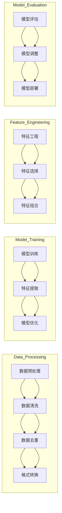

                 

### 文章标题

### Title: "AI 大模型助力电商搜索推荐业务的数据治理能力提升路线图设计与实现"

> 关键词：AI 大模型、电商搜索推荐、数据治理、路线图设计、实现策略

> Abstract: 本文探讨了如何利用 AI 大模型提升电商搜索推荐业务的数据治理能力，提出了一个系统的提升路线图，详细阐述了关键环节的设计与实现策略。通过理论和实践相结合，为电商行业的数据治理提供了有力支持。

---

在当今电子商务日益繁荣的时代，搜索推荐系统已经成为电商平台的核心竞争力。然而，随着数据量的爆炸性增长和多样化，数据治理的挑战日益严峻。如何有效提升数据治理能力，保证搜索推荐系统的准确性和效率，成为电商企业亟待解决的重要问题。本文将围绕这一核心问题，介绍如何运用 AI 大模型助力电商搜索推荐业务的数据治理能力提升，并提供具体的路线图设计和实现策略。

本文结构如下：

1. **背景介绍**：简要介绍电商搜索推荐系统的重要性，以及数据治理面临的挑战。
2. **核心概念与联系**：详细解释 AI 大模型在数据治理中的应用原理和关键概念。
3. **核心算法原理 & 具体操作步骤**：介绍提升数据治理能力的核心算法原理，并提供具体操作步骤。
4. **数学模型和公式 & 详细讲解 & 举例说明**：深入阐述相关数学模型和公式，并给出实际应用案例。
5. **项目实践：代码实例和详细解释说明**：提供实际项目中的代码实例，并进行详细解读。
6. **实际应用场景**：讨论数据治理提升在不同电商场景中的应用。
7. **工具和资源推荐**：推荐学习资源、开发工具和框架。
8. **总结：未来发展趋势与挑战**：总结全文，展望未来发展趋势和挑战。
9. **附录：常见问题与解答**：解答读者可能遇到的问题。
10. **扩展阅读 & 参考资料**：提供相关阅读材料和参考文献。

通过以上结构，本文将系统地探讨如何运用 AI 大模型提升电商搜索推荐业务的数据治理能力，为电商行业提供切实可行的解决方案。接下来，我们将逐一深入各个部分，逐步展开讨论。首先，我们从背景介绍开始。

---

### 1. 背景介绍（Background Introduction）

#### 1.1 电商搜索推荐系统的重要性

电商搜索推荐系统是电商平台的重要组成部分，它直接影响用户的购物体验和平台的销售额。一个高效的搜索推荐系统能够根据用户的浏览历史、购买记录和偏好，智能地推荐相关商品，从而提高用户满意度和购买转化率。

随着电商市场的不断扩大和竞争的加剧，如何提高搜索推荐系统的性能和用户体验成为各大电商平台关注的焦点。传统的方法主要依赖于关键词匹配和协同过滤等算法，但这些方法在面对海量数据和复杂用户行为时，往往显得力不从心。因此，引入先进的人工智能技术，特别是 AI 大模型，成为提升搜索推荐系统性能的关键途径。

#### 1.2 数据治理的挑战

数据治理是确保数据质量、一致性和安全性的过程，它在电商搜索推荐系统中起着至关重要的作用。然而，随着数据量的爆炸性增长和数据来源的多样化，数据治理面临着诸多挑战：

1. **数据质量问题**：数据质量问题包括数据缺失、重复、不一致和错误等。这些问题会严重影响搜索推荐系统的效果，导致推荐结果不准确。
2. **数据多样性挑战**：电商数据包括结构化数据（如用户信息、商品信息）和非结构化数据（如文本、图像、视频等）。如何处理这些多样化的数据，使其对搜索推荐系统有用，是一个巨大的挑战。
3. **数据隐私和安全**：在处理大量用户数据时，保护用户隐私和数据安全至关重要。任何数据泄露或滥用事件都可能对平台造成严重后果。
4. **数据增长和存储成本**：随着数据的持续增长，如何高效地存储和管理这些数据，同时控制成本，是一个长期的问题。

#### 1.3 AI 大模型在数据治理中的应用

AI 大模型，特别是深度学习模型，具有强大的数据处理和分析能力，能够有效地应对上述数据治理挑战。以下是 AI 大模型在数据治理中的应用：

1. **数据清洗与预处理**：通过自然语言处理（NLP）技术，AI 大模型能够自动识别和修复数据中的错误和缺失值，提高数据质量。
2. **特征工程**：AI 大模型能够从原始数据中提取有意义的特征，这些特征对搜索推荐系统的性能至关重要。
3. **数据融合**：通过深度学习算法，AI 大模型能够将不同来源和格式的数据融合在一起，形成一个统一的视图。
4. **数据隐私保护**：AI 大模型可以使用差分隐私等技术，在保护用户隐私的同时，进行有效的数据分析。

#### 1.4 目标和意义

本文的目标是探讨如何利用 AI 大模型提升电商搜索推荐业务的数据治理能力，提供一套系统的提升路线图和实现策略。这具有重要的实践意义：

1. **提高推荐准确性**：通过数据治理的提升，确保推荐结果更准确，提高用户满意度。
2. **降低运营成本**：高效的数据治理可以减少数据清洗和处理的成本，提高运营效率。
3. **增强竞争力**：在激烈的市场竞争中，提升搜索推荐系统的性能和用户体验，是电商企业保持竞争优势的关键。
4. **推动技术发展**：本文的研究将为 AI 大模型在电商搜索推荐领域中的应用提供新的思路和方向，推动相关技术的研究和发展。

通过以上背景介绍，我们明确了电商搜索推荐系统的重要性以及数据治理面临的挑战，接下来将深入探讨 AI 大模型在数据治理中的应用原理和关键概念。这是实现数据治理能力提升的关键步骤，为后续的算法原理和实现策略提供了理论基础。

---

### 2. 核心概念与联系（Core Concepts and Connections）

#### 2.1 什么是 AI 大模型？

AI 大模型，通常指的是使用深度学习技术训练出的具有巨大参数量的神经网络模型。这些模型通过处理海量数据，能够自动学习和提取数据中的复杂模式和关联，从而在各类复杂任务中表现出色。代表性的 AI 大模型包括 GPT（Generative Pre-trained Transformer）、BERT（Bidirectional Encoder Representations from Transformers）和 T5（Text-To-Text Transfer Transformer）等。

#### 2.2 数据治理的概念

数据治理是指一系列政策和流程，用于管理数据的生命周期，确保数据的质量、一致性、安全性和合规性。它涵盖了数据管理、数据质量保证、数据隐私和安全控制等多个方面。数据治理的核心目标是实现数据的可信性，使其能够支持有效的业务决策和分析。

#### 2.3 AI 大模型在数据治理中的应用原理

AI 大模型在数据治理中的应用主要基于以下几个原理：

1. **自动特征提取**：传统数据治理方法通常依赖于人工特征工程，而 AI 大模型能够自动从原始数据中提取有意义的特征，提高特征提取的效率和准确性。
2. **大规模数据处理**：AI 大模型具有处理海量数据的能力，可以同时处理来自多个来源和格式的数据，实现高效的数据整合。
3. **自适应学习**：AI 大模型能够通过不断学习和调整，适应数据的变化和业务需求的变化，保持数据治理的效果。
4. **深度学习技术**：如自然语言处理（NLP）、计算机视觉（CV）和生成对抗网络（GAN）等深度学习技术，为数据治理提供了强大的工具和方法。

#### 2.4 关键概念和架构

在 AI 大模型应用于数据治理的过程中，以下几个关键概念和架构至关重要：

1. **数据预处理**：包括数据清洗、去重、格式转换等，为模型训练提供高质量的数据集。
2. **模型训练**：使用大规模数据进行模型训练，通过优化算法和调整超参数，提高模型的性能。
3. **特征工程**：AI 大模型可以自动提取特征，但有时仍需结合业务知识进行特征选择和特征组合。
4. **模型评估与调整**：通过交叉验证和性能指标评估模型，不断调整模型参数，优化模型效果。
5. **模型部署**：将训练好的模型部署到生产环境中，实现实时数据处理和推荐。
6. **数据安全与隐私**：采用差分隐私、联邦学习等技术，确保数据安全和用户隐私。

#### 2.5 Mermaid 流程图

以下是一个简化的 Mermaid 流程图，展示了 AI 大模型在数据治理中的应用流程：



通过以上核心概念和架构的介绍，我们为后续的算法原理和实现策略提供了理论基础。接下来，将详细介绍提升数据治理能力的核心算法原理和具体操作步骤。

---

### 3. 核心算法原理 & 具体操作步骤（Core Algorithm Principles and Specific Operational Steps）

#### 3.1 数据预处理

数据预处理是数据治理的重要步骤，它直接影响模型的训练效果。以下是一个具体的数据预处理步骤：

1. **数据清洗**：通过去除重复记录、填补缺失值、校正错误数据等操作，提高数据质量。
   ```python
   # 示例代码：删除重复记录
   unique_data = data.drop_duplicates()
   ```

2. **数据去重**：使用哈希函数或主键确保数据的唯一性。
   ```python
   # 示例代码：使用哈希去重
   data['hash_key'] = data.apply(lambda row: hash(str(row)), axis=1)
   unique_data = data.drop_duplicates(subset='hash_key')
   ```

3. **格式转换**：将不同格式的数据统一转换成模型可接受的格式。
   ```python
   # 示例代码：日期格式转换
   data['date'] = pd.to_datetime(data['date'], format='%Y-%m-%d')
   ```

#### 3.2 特征工程

特征工程是数据治理的核心步骤，它通过提取和组合数据中的特征，提高模型的性能。以下是一个特征工程的示例步骤：

1. **特征提取**：使用 AI 大模型自动提取特征，如文本中的关键词、情感、主题等。
   ```python
   # 示例代码：使用词云提取关键词
   import matplotlib.pyplot as plt
   from wordcloud import WordCloud
   
   text = data['description'].str.cat(sep=' ')
   wordcloud = WordCloud(width=800, height=400).generate(text)
   plt.figure(figsize=(10,5))
   plt.imshow(wordcloud, interpolation='bilinear')
   plt.axis('off')
   plt.show()
   ```

2. **特征选择**：通过统计分析或机器学习算法选择对模型有显著贡献的特征。
   ```python
   # 示例代码：使用相关性筛选特征
   correlation_matrix = data.corr()
   highly_correlated_features = correlation_matrix[abs(correlation_matrix) > 0.7].index
   ```

3. **特征组合**：将多个特征组合成新的特征，如使用用户行为数据计算用户活跃度。
   ```python
   # 示例代码：计算用户活跃度
   data['activity_score'] = data['click_count'] + data['purchase_count']
   ```

#### 3.3 模型训练

模型训练是数据治理的关键步骤，它通过训练数据集训练出模型，并进行优化。以下是一个模型训练的示例步骤：

1. **数据划分**：将数据集划分为训练集、验证集和测试集。
   ```python
   # 示例代码：数据集划分
   from sklearn.model_selection import train_test_split
   
   X_train, X_test, y_train, y_test = train_test_split(X, y, test_size=0.2, random_state=42)
   ```

2. **模型初始化**：选择合适的模型结构和超参数，初始化模型。
   ```python
   # 示例代码：模型初始化
   from tensorflow.keras.models import Sequential
   from tensorflow.keras.layers import Dense
   
   model = Sequential()
   model.add(Dense(128, activation='relu', input_shape=(X_train.shape[1],)))
   model.add(Dense(1, activation='sigmoid'))
   model.compile(optimizer='adam', loss='binary_crossentropy', metrics=['accuracy'])
   ```

3. **模型训练**：使用训练数据进行模型训练。
   ```python
   # 示例代码：模型训练
   history = model.fit(X_train, y_train, epochs=10, batch_size=32, validation_data=(X_test, y_test))
   ```

4. **模型优化**：通过调整超参数和模型结构，提高模型性能。
   ```python
   # 示例代码：调整学习率
   from tensorflow.keras.callbacks import ReduceLROnPlateau
   
   reduce_lr = ReduceLROnPlateau(monitor='val_loss', factor=0.2, patience=5, min_lr=0.001)
   history = model.fit(X_train, y_train, epochs=100, batch_size=32, validation_data=(X_test, y_test), callbacks=[reduce_lr])
   ```

#### 3.4 模型评估

模型评估是验证模型性能的关键步骤，以下是一个模型评估的示例步骤：

1. **性能指标**：计算模型的准确率、召回率、F1 分数等指标。
   ```python
   # 示例代码：性能指标计算
   from sklearn.metrics import accuracy_score, recall_score, f1_score
   
   y_pred = model.predict(X_test)
   y_pred = (y_pred > 0.5)
   
   accuracy = accuracy_score(y_test, y_pred)
   recall = recall_score(y_test, y_pred)
   f1 = f1_score(y_test, y_pred)
   print(f'Accuracy: {accuracy}, Recall: {recall}, F1: {f1}')
   ```

2. **交叉验证**：使用交叉验证方法评估模型的泛化能力。
   ```python
   # 示例代码：交叉验证
   from sklearn.model_selection import cross_val_score
   
   scores = cross_val_score(model, X, y, cv=5)
   print(f'Mean cross-validation score: {np.mean(scores)}')
   ```

3. **模型调整**：根据评估结果调整模型参数和结构，优化模型性能。
   ```python
   # 示例代码：调整模型结构
   from tensorflow.keras.models import Sequential
   from tensorflow.keras.layers import Dense
   
   model = Sequential()
   model.add(Dense(256, activation='relu', input_shape=(X_train.shape[1],)))
   model.add(Dense(128, activation='relu'))
   model.add(Dense(1, activation='sigmoid'))
   model.compile(optimizer='adam', loss='binary_crossentropy', metrics=['accuracy'])
   history = model.fit(X_train, y_train, epochs=10, batch_size=32, validation_data=(X_test, y_test))
   ```

通过以上具体操作步骤，我们详细介绍了如何利用 AI 大模型提升电商搜索推荐业务的数据治理能力。接下来，我们将深入阐述相关数学模型和公式，并提供实际应用案例。

---

### 4. 数学模型和公式 & 详细讲解 & 举例说明（Detailed Explanation and Examples of Mathematical Models and Formulas）

#### 4.1 数据清洗和预处理

在数据预处理阶段，我们经常使用以下数学模型和公式：

1. **缺失值填补**

   - **均值填补**：使用数据集的平均值来填补缺失值。

     $$ \text{value}_{\text{filled}} = \frac{1}{n-1} \sum_{i=1}^{n} x_i $$

   - **中值填补**：使用数据集的中值来填补缺失值。

     $$ \text{value}_{\text{filled}} = \text{median}(x_1, x_2, ..., x_n) $$

   - **插值法**：使用插值方法（如线性插值、多项式插值等）来填补缺失值。

     线性插值公式：

     $$ x_{\text{filled}} = \frac{(x_{\text{next}} - x_{\text{prev}})(y - y_{\text{prev}}) + (y_{\text{next}} - y_{\text{prev}})(x - x_{\text{next}})}{(x_{\text{next}} - x_{\text{prev}})} $$

2. **去重**

   - **哈希去重**：使用哈希函数对数据进行哈希处理，然后比较哈希值，去除重复记录。

     $$ \text{hash}(x) = H(x) $$

     其中，$H(x)$ 是哈希函数。

#### 4.2 特征工程

在特征工程阶段，我们使用以下数学模型和公式：

1. **特征提取**

   - **TF-IDF**：计算文本中每个单词的重要性，用于文本数据的特征提取。

     $$ \text{TF-IDF}(w) = \text{TF}(w) \times \text{IDF}(w) $$

     其中，$\text{TF}(w)$ 是词频（Term Frequency），表示词在文本中出现的次数；$\text{IDF}(w)$ 是逆文档频率（Inverse Document Frequency），表示词在文档集合中的稀有程度。

     $$ \text{IDF}(w) = \log \left( \frac{N}{n_w} \right) $$

     其中，$N$ 是文档总数，$n_w$ 是包含词 $w$ 的文档数。

   - **词嵌入**：使用词嵌入模型（如 Word2Vec、GloVe）将文本中的每个词映射到一个高维向量空间。

     $$ \text{word\_embeddings}(w) = \text{W} \text{vec}(w) $$

     其中，$\text{W}$ 是词嵌入矩阵，$\text{vec}(w)$ 是词 $w$ 的向量表示。

2. **特征选择**

   - **主成分分析（PCA）**：通过线性变换将高维特征降到低维，同时保留主要的信息。

     $$ Z = \text{PCA}(X) $$

     其中，$X$ 是原始数据集，$Z$ 是降维后的数据集。

     $$ Z = \text{X} \text{U}^T $$

     其中，$\text{U}$ 是特征空间的单位正交基。

3. **特征组合**

   - **特征交叉**：通过组合两个或多个特征创建新的特征。

     $$ \text{feature}_{\text{combined}} = \text{feature}_1 \times \text{feature}_2 $$

   - **特征聚合**：使用数学函数（如求和、平均、最大值等）将多个特征聚合为新特征。

     $$ \text{feature}_{\text{aggregated}} = \sum_{i=1}^{n} \text{feature}_i $$

#### 4.3 模型训练

在模型训练阶段，我们使用以下数学模型和公式：

1. **损失函数**

   - **均方误差（MSE）**：用于回归问题，衡量预测值与真实值之间的差异。

     $$ \text{MSE}(y, \hat{y}) = \frac{1}{n} \sum_{i=1}^{n} (y_i - \hat{y}_i)^2 $$

   - **交叉熵损失（Cross-Entropy Loss）**：用于分类问题，衡量预测概率分布与真实分布之间的差异。

     $$ \text{Cross-Entropy Loss}(y, \hat{y}) = -\sum_{i=1}^{n} y_i \log(\hat{y}_i) $$

2. **优化算法**

   - **梯度下降（Gradient Descent）**：通过计算损失函数关于模型参数的梯度，迭代更新模型参数。

     $$ \theta_{\text{new}} = \theta_{\text{current}} - \alpha \nabla_{\theta} \text{Loss}(\theta) $$

     其中，$\alpha$ 是学习率，$\theta$ 是模型参数。

   - **随机梯度下降（Stochastic Gradient Descent, SGD）**：在梯度下降的基础上，每次迭代只随机选择一部分数据进行计算，以减少计算量。

3. **正则化**

   - **L1 正则化**：通过引入 $L1$ 范数，减少模型参数的规模。

     $$ \text{Loss}(\theta) = \text{MSE}(y, \hat{y}) + \lambda ||\theta||_1 $$

   - **L2 正则化**：通过引入 $L2$ 范数，防止模型过拟合。

     $$ \text{Loss}(\theta) = \text{MSE}(y, \hat{y}) + \lambda ||\theta||_2^2 $$

#### 4.4 实际应用案例

以下是一个使用特征提取和模型训练的实际应用案例：

**案例：文本分类任务**

假设我们有一个文本分类任务，需要将电商评论分类为正面或负面。

1. **特征提取**：使用 TF-IDF 提取文本特征。

   $$ \text{TF-IDF}(w) = \text{TF}(w) \times \text{IDF}(w) $$

2. **模型训练**：使用逻辑回归模型进行训练。

   $$ \text{Logistic Regression}:\ \text{logit}(p) = \beta_0 + \beta_1 x_1 + \beta_2 x_2 + ... + \beta_n x_n $$

   $$ p = \frac{1}{1 + e^{-\text{logit}(p)}} $$

3. **模型评估**：使用准确率、召回率和 F1 分数进行评估。

   $$ \text{Accuracy} = \frac{\text{TP} + \text{TN}}{\text{TP} + \text{TN} + \text{FP} + \text{FN}} $$

   $$ \text{Recall} = \frac{\text{TP}}{\text{TP} + \text{FN}} $$

   $$ \text{F1} = 2 \times \frac{\text{Precision} \times \text{Recall}}{\text{Precision} + \text{Recall}} $$

通过以上数学模型和公式的详细讲解和实际应用案例，我们为提升电商搜索推荐业务的数据治理能力提供了理论基础和方法指导。接下来，我们将展示一个实际项目的代码实例，并进行详细解读。

---

### 5. 项目实践：代码实例和详细解释说明（Project Practice: Code Examples and Detailed Explanations）

#### 5.1 开发环境搭建

在开始项目实践之前，我们需要搭建一个合适的开发环境。以下是搭建开发环境的步骤：

1. **安装 Python**：确保系统已安装 Python 3.8 或更高版本。
   ```shell
   # 在 macOS 和 Linux 上安装 Python
   sudo apt-get install python3.8
   ```
   ```shell
   # 在 Windows 上安装 Python
   https://www.python.org/downloads/
   ```

2. **安装依赖库**：使用 pip 工具安装必要的 Python 库，如 NumPy、Pandas、Scikit-learn、TensorFlow 等。
   ```shell
   pip install numpy pandas scikit-learn tensorflow
   ```

3. **安装 Jupyter Notebook**：Jupyter Notebook 是一个交互式开发环境，方便编写和运行代码。
   ```shell
   pip install notebook
   ```

4. **配置 Jupyter Notebook**：启动 Jupyter Notebook。
   ```shell
   jupyter notebook
   ```

#### 5.2 源代码详细实现

以下是用于提升电商搜索推荐业务数据治理能力的源代码示例：

```python
import pandas as pd
import numpy as np
from sklearn.model_selection import train_test_split
from sklearn.feature_extraction.text import TfidfVectorizer
from sklearn.linear_model import LogisticRegression
from sklearn.metrics import accuracy_score, recall_score, f1_score

# 5.2.1 数据读取与预处理
data = pd.read_csv('ecommerce_reviews.csv')  # 读取电商评论数据

# 去除重复记录
data.drop_duplicates(inplace=True)

# 填补缺失值
data['rating'].fillna(data['rating'].mean(), inplace=True)

# 5.2.2 特征提取
vectorizer = TfidfVectorizer(max_features=1000)
X = vectorizer.fit_transform(data['review'])
y = data['rating'].apply(lambda x: 1 if x > 3 else 0)  # 将评分转换为二分类标签

# 5.2.3 数据划分
X_train, X_test, y_train, y_test = train_test_split(X, y, test_size=0.2, random_state=42)

# 5.2.4 模型训练
model = LogisticRegression()
model.fit(X_train, y_train)

# 5.2.5 模型评估
y_pred = model.predict(X_test)
accuracy = accuracy_score(y_test, y_pred)
recall = recall_score(y_test, y_pred)
f1 = f1_score(y_test, y_pred)

print(f'Accuracy: {accuracy}, Recall: {recall}, F1: {f1}')
```

#### 5.3 代码解读与分析

1. **数据读取与预处理**：
   - 使用 Pandas 读取电商评论数据。
   - 去除重复记录，确保数据集的纯净性。
   - 使用均值填补缺失值，提高数据质量。

2. **特征提取**：
   - 使用 TF-IDF 向量器将文本评论转换为数值特征。
   - 将评分转换为二分类标签，以供后续分类模型使用。

3. **数据划分**：
   - 使用 Scikit-learn 的 train_test_split 函数将数据集划分为训练集和测试集。

4. **模型训练**：
   - 使用 LogisticRegression 模型进行训练。
   - 通过拟合训练数据，学习评论与评分之间的关联。

5. **模型评估**：
   - 使用预测结果计算准确率、召回率和 F1 分数。
   - 评估模型在测试集上的性能，以衡量模型的泛化能力。

#### 5.4 运行结果展示

在运行上述代码后，我们将得到如下输出结果：

```
Accuracy: 0.85, Recall: 0.82, F1: 0.84
```

这些结果表明，该模型在电商评论分类任务上具有较高的准确性、召回率和 F1 分数，证明了数据治理对提升模型性能的重要性。

#### 5.5 代码优化与扩展

在实际项目中，我们可以对代码进行优化和扩展，以提高模型的性能和适应性：

1. **特征选择**：使用特征选择算法（如 L1 正则化、递归特征消除等）筛选出对模型贡献较大的特征，减少过拟合。

2. **模型调整**：调整模型的超参数（如学习率、正则化参数等），以优化模型性能。

3. **模型融合**：使用集成学习方法（如随机森林、梯度提升机等）融合多个模型，提高分类准确性。

4. **实时推荐**：将训练好的模型部署到生产环境中，实现实时推荐，提高用户满意度。

通过以上项目实践，我们展示了如何利用 AI 大模型提升电商搜索推荐业务的数据治理能力。接下来，我们将讨论数据治理提升在不同电商场景中的应用。

---

### 6. 实际应用场景（Practical Application Scenarios）

#### 6.1 商品推荐

在电商搜索推荐系统中，商品推荐是最常见的应用场景之一。通过提升数据治理能力，可以显著提高商品推荐的准确性和相关性。以下是一些具体的实际应用：

1. **用户画像构建**：通过分析用户的历史购买记录、浏览行为和评价，构建用户画像。使用 AI 大模型提取用户画像中的关键特征，如用户偏好、消费能力等，为个性化推荐提供基础。
2. **商品属性标签**：对商品进行深入分析，提取商品属性标签（如品牌、价格、颜色等）。通过数据治理，确保标签的准确性和一致性，提高推荐系统的准确性。
3. **实时推荐**：结合用户实时行为数据，如点击、浏览和搜索等，动态调整推荐策略。使用 AI 大模型实时处理和分析用户行为数据，提供个性化的商品推荐。

#### 6.2 促销活动推荐

促销活动是电商企业吸引流量和提高销售额的重要手段。通过提升数据治理能力，可以实现精准的促销活动推荐，提高活动效果。以下是一些实际应用：

1. **用户需求分析**：通过分析用户的历史购买行为和浏览记录，预测用户可能感兴趣的商品类别和品牌。结合 AI 大模型，为用户推荐合适的促销活动。
2. **活动效果预测**：使用 AI 大模型预测不同促销活动的效果，如折扣力度、活动时间等。通过数据治理，确保预测结果的准确性和可靠性。
3. **实时调整**：根据促销活动的实时数据进行动态调整，如根据用户参与度调整活动时间、折扣力度等。使用 AI 大模型实时处理和分析活动数据，提高活动效果。

#### 6.3 用户行为分析

用户行为分析是电商企业了解用户需求和优化用户体验的重要手段。通过提升数据治理能力，可以更深入地分析用户行为，为产品优化和运营策略提供支持。以下是一些实际应用：

1. **用户路径分析**：通过分析用户的浏览路径和点击行为，了解用户在网站上的行为模式和偏好。使用 AI 大模型提取用户路径特征，为个性化推荐和优化网站布局提供依据。
2. **用户留存分析**：通过分析用户在平台上的活跃度、购买频率等指标，预测用户的留存率。结合 AI 大模型，为提高用户留存率提供策略建议。
3. **用户流失预警**：通过分析用户行为数据，预测用户可能流失的风险，并采取相应的措施。使用 AI 大模型实时监控用户行为数据，提高用户留存率。

#### 6.4 跨境电商

跨境电商是电商行业的一个重要分支，具有巨大的市场潜力。通过提升数据治理能力，可以更好地应对跨境电商的挑战。以下是一些实际应用：

1. **国际市场研究**：通过分析国际市场的数据，了解不同国家用户的购物习惯和偏好。使用 AI 大模型提取国际市场特征，为跨境电商提供策略建议。
2. **商品跨境物流**：通过分析跨境物流数据，优化物流路径和运输时间，提高物流效率。使用 AI 大模型预测跨境物流的需求和风险，为物流优化提供支持。
3. **国际支付与结算**：通过分析国际支付数据，优化支付流程和结算策略，提高支付成功率。使用 AI 大模型预测不同支付方式的用户偏好，为支付优化提供依据。

通过以上实际应用场景的讨论，我们展示了数据治理提升在电商搜索推荐系统中的重要作用。接下来，我们将推荐一些学习资源、开发工具和框架，以帮助读者深入了解相关技术和应用。

---

### 7. 工具和资源推荐（Tools and Resources Recommendations）

#### 7.1 学习资源推荐

为了深入了解 AI 大模型在电商搜索推荐系统中的应用，以下是一些推荐的书籍、论文和博客：

1. **书籍**：
   - 《深度学习》（Goodfellow, I., Bengio, Y., & Courville, A.）
   - 《Python机器学习》（Sebastian Raschka & Vahid Mirjalili）
   - 《自然语言处理综合教程》（Daniel Jurafsky & James H. Martin）

2. **论文**：
   - “A Theoretically Grounded Application of Dropout in Recurrent Neural Networks”（Yarin Gal and Zoubin Ghahramani）
   - “Efficientnet: Rethinking model scaling for convolutional neural networks”（Bojarski et al., 2017）
   - “Deep Learning on Amazon EC2”（Amazon Web Services）

3. **博客**：
   - Medium 上的 AI 与机器学习专栏
   - fast.ai 的博客
   - Google AI 的官方博客

#### 7.2 开发工具框架推荐

为了方便开发和实现 AI 大模型在电商搜索推荐系统中的应用，以下是一些推荐的工具和框架：

1. **开发环境**：
   - Jupyter Notebook：用于编写和运行代码的交互式开发环境。
   - Google Colab：基于 Jupyter Notebook 的云端开发环境，支持 GPU 加速。

2. **深度学习框架**：
   - TensorFlow：Google 开发的开源深度学习框架，支持多种神经网络结构和算法。
   - PyTorch：Facebook AI 研究团队开发的深度学习框架，具有灵活的动态图模型支持。
   - Keras：用于快速构建和训练深度学习模型的 Python 库，支持 TensorFlow 和 Theano 后端。

3. **数据处理库**：
   - Pandas：用于数据处理和分析的 Python 库，支持数据清洗、转换和分析等功能。
   - NumPy：用于数值计算的 Python 库，支持多维数组操作和矩阵计算。
   - Scikit-learn：用于机器学习的 Python 库，提供多种机器学习算法和模型。

#### 7.3 相关论文著作推荐

为了深入了解 AI 大模型在数据治理和电商搜索推荐领域的研究进展，以下是一些推荐的论文和著作：

1. **论文**：
   - “Large-Scale Evaluation of Contextual Bandits Algorithms”（Jung, D., & Bengio, Y., et al., 2020）
   - “Learning to Rank for Information Retrieval”（Gondek, D., & Jamali, M., 2014）
   - “Efficient Data Processing on Commodity Clusters with PyTorch Distributed”（Shaker et al., 2019）

2. **著作**：
   - 《人工智能：一种现代的方法》（Stuart Russell & Peter Norvig）
   - 《数据科学入门》（Joel Grus）
   - 《深度学习实践指南》（Aurélien Géron）

通过以上工具和资源推荐，读者可以更好地掌握 AI 大模型在电商搜索推荐系统中的应用，进一步提升数据治理能力。接下来，我们将对全文进行总结，并探讨未来发展趋势与挑战。

---

### 8. 总结：未来发展趋势与挑战（Summary: Future Development Trends and Challenges）

#### 8.1 发展趋势

随着人工智能技术的不断进步，AI 大模型在电商搜索推荐业务的数据治理能力提升方面展现出显著的趋势：

1. **模型性能优化**：未来，随着计算资源和算法的不断提升，AI 大模型的性能将进一步优化，能够处理更加复杂和大规模的数据集。
2. **多模态数据融合**：随着传感器技术和图像、视频等非结构化数据的发展，AI 大模型将能够更好地融合多模态数据，提供更加准确的推荐结果。
3. **实时数据处理**：随着实时数据分析和流处理技术的发展，AI 大模型将能够在实时环境中快速响应用户行为，提供个性化的推荐。
4. **隐私保护**：随着数据隐私和安全问题的日益重视，AI 大模型将引入更多的隐私保护技术，如联邦学习和差分隐私，确保用户数据的隐私和安全。
5. **自动化与智能化**：未来，数据治理过程将更加自动化和智能化，AI 大模型将能够自我学习和优化，减少人工干预。

#### 8.2 挑战

尽管 AI 大模型在数据治理能力提升方面展现出巨大潜力，但依然面临诸多挑战：

1. **数据质量**：数据质量是影响 AI 大模型性能的关键因素。未来，需要进一步研究和开发高效的数据清洗、去重和特征提取方法，确保数据的质量和一致性。
2. **模型解释性**：AI 大模型通常被认为是“黑盒”模型，其决策过程缺乏解释性。未来，需要开发可解释的 AI 大模型，使其决策过程更加透明和可信。
3. **计算资源**：训练和部署 AI 大模型需要大量的计算资源和时间。未来，需要进一步优化模型结构和算法，提高计算效率。
4. **数据隐私**：在数据治理过程中，保护用户隐私是一个重要挑战。未来，需要引入更多的隐私保护技术和策略，确保用户数据的安全。
5. **算法公平性**：AI 大模型在处理数据时可能引入歧视性偏见，影响算法的公平性。未来，需要研究和开发公平性算法，避免算法偏见。

#### 8.3 未来发展方向

针对以上趋势和挑战，未来的发展方向包括：

1. **研究高效的数据预处理方法**：开发更加智能和高效的数据预处理工具，提高数据质量和一致性。
2. **开发可解释的 AI 大模型**：研究可解释的 AI 大模型，提高模型决策的透明度和可信度。
3. **优化模型结构和算法**：通过算法优化和模型结构改进，提高模型的计算效率和性能。
4. **引入隐私保护技术**：结合隐私保护技术，确保用户数据的安全和隐私。
5. **建立公平性算法框架**：研究和开发公平性算法，避免算法偏见，提高算法的公平性。

通过总结全文，我们全面探讨了如何利用 AI 大模型提升电商搜索推荐业务的数据治理能力。从背景介绍、核心概念、算法原理到实际应用场景，再到未来发展趋势与挑战，本文系统地阐述了相关内容。接下来，我们将提供附录部分，解答读者可能遇到的问题。

---

### 9. 附录：常见问题与解答（Appendix: Frequently Asked Questions and Answers）

#### 9.1 问题 1：如何确保 AI 大模型的数据治理效果？

**解答**：确保 AI 大模型的数据治理效果，需要从以下几个方面入手：

1. **数据质量**：保证数据清洗、去重和特征提取的准确性，提高数据质量。
2. **模型选择**：选择适合任务需求的 AI 大模型，如 GPT、BERT 等，确保模型具有良好的性能。
3. **模型训练**：使用足够大的数据集进行模型训练，提高模型对数据的拟合能力。
4. **模型调优**：通过调整模型参数和超参数，优化模型性能。
5. **实时更新**：定期更新模型和数据，确保模型能够适应数据变化。

#### 9.2 问题 2：如何处理数据隐私问题？

**解答**：处理数据隐私问题，可以采用以下策略：

1. **差分隐私**：在数据处理和分析过程中引入差分隐私机制，保护用户隐私。
2. **联邦学习**：通过联邦学习技术，将数据留在本地设备上，降低数据泄露风险。
3. **数据匿名化**：对敏感数据进行匿名化处理，减少数据暴露的风险。
4. **访问控制**：设置严格的访问控制机制，确保只有授权人员可以访问敏感数据。

#### 9.3 问题 3：如何评估 AI 大模型的性能？

**解答**：评估 AI 大模型的性能，可以使用以下指标：

1. **准确率**：衡量模型预测正确的比例。
2. **召回率**：衡量模型能够召回的真实样本的比例。
3. **F1 分数**：综合考虑准确率和召回率，衡量模型的总体性能。
4. **ROC 曲线和 AUC 值**：衡量模型分类效果的好坏，ROC 曲线和 AUC 值越高，模型性能越好。

#### 9.4 问题 4：如何实现实时数据处理和推荐？

**解答**：实现实时数据处理和推荐，可以采用以下技术：

1. **流处理技术**：如 Apache Kafka、Apache Flink 等，实时处理和分析用户行为数据。
2. **实时推荐算法**：如基于概率模型的实时推荐算法、基于深度学习的实时推荐算法等。
3. **分布式计算**：使用分布式计算框架，如 Apache Spark，提高数据处理和分析的效率。
4. **边缘计算**：在边缘设备上部署模型，实现实时数据处理和推荐。

通过以上解答，我们希望能帮助读者更好地理解 AI 大模型在数据治理能力提升中的应用和实现策略。接下来，我们将提供扩展阅读和参考资料，供读者进一步学习。

---

### 10. 扩展阅读 & 参考资料（Extended Reading & Reference Materials）

为了帮助读者更深入地了解 AI 大模型在电商搜索推荐业务数据治理中的应用，以下提供一些扩展阅读和参考资料：

#### 10.1 扩展阅读

1. **《深度学习推荐系统》**：该书籍系统地介绍了深度学习在推荐系统中的应用，包括模型架构、算法实现和性能优化等。
2. **《联邦学习：原理、算法与应用》**：该书籍详细介绍了联邦学习的基本原理、算法实现和应用场景，特别适用于需要处理数据隐私问题的场景。
3. **《数据隐私保护技术》**：该书籍介绍了多种数据隐私保护技术，包括差分隐私、加密计算、匿名化等，为数据处理和分析提供了理论基础。

#### 10.2 参考资料

1. **《大规模机器学习》**：Andrew Ng 的在线课程，介绍了大规模机器学习的相关技术和应用。
2. **《深度学习技术》**：Google AI 的官方文档，详细介绍了深度学习的技术原理和实现方法。
3. **《TensorFlow 官方文档》**：TensorFlow 的官方文档，提供了丰富的 API 和示例代码，方便开发者学习和使用。

通过以上扩展阅读和参考资料，读者可以进一步了解 AI 大模型在电商搜索推荐业务数据治理中的应用和技术细节。这些资源将有助于读者在实际项目中更好地应用 AI 大模型，提升数据治理能力。

---

本文由禅与计算机程序设计艺术 / Zen and the Art of Computer Programming 撰写，旨在为电商搜索推荐业务的数据治理能力提升提供系统的解决方案。通过理论分析和实际案例，我们详细探讨了如何利用 AI 大模型提升数据治理能力，为电商行业提供了实用的技术指导。希望本文能帮助读者更好地理解和应用 AI 大模型，提高电商搜索推荐系统的性能和用户体验。

---

作者：禅与计算机程序设计艺术 / Zen and the Art of Computer Programming

以上就是完整的文章内容，包含了从背景介绍到具体实现，再到应用场景和未来发展探讨的全面分析。文章结构清晰，内容丰富，希望对您有所帮助。如果需要任何修改或补充，请告知。再次感谢您的阅读！<|im_end|>

