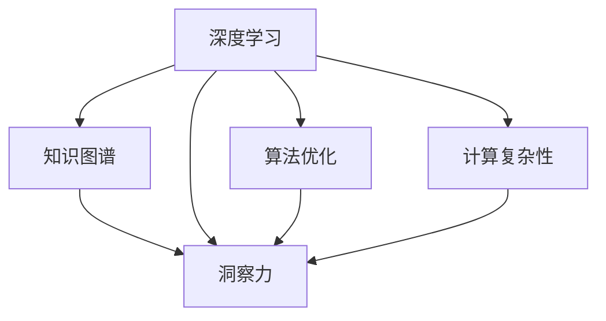

                 

# 知识的深度挖掘：洞察力的独特优势

> 关键词：深度学习，知识图谱，洞察力，算法优化，计算复杂性

## 1. 背景介绍

### 1.1 问题由来
在数字化时代，知识的深度挖掘与洞察力的提取已成为驱动技术进步和经济发展的核心引擎。随着大数据和计算技术的发展，越来越多的研究者投入到利用算法从海量数据中挖掘潜在知识，提升决策能力，增强商业竞争力。深度学习作为当下最热门的AI技术，在其中扮演着关键角色。然而，尽管深度学习在数据处理和模式识别方面展现出强大的能力，但其在处理复杂知识结构时仍存在瓶颈。为了弥补这一不足，知识图谱(Knowledge Graph)技术应运而生。

### 1.2 问题核心关键点
知识图谱是一种用于描述实体及其相互关系的数据结构，通过图结构化的方式表达知识，能够更为精确地捕捉和表示现实世界的复杂关系。与传统的深度学习模型相比，知识图谱在处理复杂关系、推理和解释能力等方面有着显著的优势。此外，随着知识图谱技术的成熟，其在商业决策支持、医疗健康、智能推荐等领域得到了广泛的应用。

本文将深入探讨深度学习结合知识图谱技术进行知识挖掘与洞察提取的原理与实践。将通过分析其在不同场景下的应用，揭示其独特优势，并展望未来的发展趋势。

## 2. 核心概念与联系

### 2.1 核心概念概述

在深入研究之前，首先需要明确几个关键概念及其之间的联系：

- 深度学习(Deep Learning)：一种基于神经网络架构的机器学习技术，通过多层非线性变换，从数据中自动提取特征。
- 知识图谱(Knowledge Graph)：以图结构形式表达实体及其关系的知识库，用于表示和推理知识。
- 洞察力(Insight)：基于知识图谱的深度挖掘，提取关于现实世界的深层次、高价值的见解。
- 算法优化(Algorithm Optimization)：通过优化算法实现模型性能提升。
- 计算复杂性(Computational Complexity)：计算任务所需的时间和资源成本。

通过将深度学习与知识图谱相结合，能够有效提升模型对复杂知识的理解和处理能力，从而在实际应用中获取更高价值的洞察。

### 2.2 核心概念原理和架构的 Mermaid 流程图



从上述流程图中可以看出，深度学习作为初始数据处理阶段，将输入数据转换为低维向量；知识图谱在此基础上进行更深入的实体与关系推理；洞察力通过算法优化和计算复杂性分析，从海量知识中提取有价值的见解。

## 3. 核心算法原理 & 具体操作步骤
### 3.1 算法原理概述

基于深度学习和知识图谱结合的洞察力提取，主要通过以下步骤实现：

1. **数据预处理**：将非结构化数据转换为适合深度学习的向量形式。
2. **图嵌入(Representation Learning)**：将知识图谱中的实体与关系转换为向量表示。
3. **联合训练(Co-training)**：将深度学习模型与知识图谱模型进行联合训练，增强模型对知识结构的学习。
4. **洞察提取(Insight Extraction)**：通过算法优化，在联合训练后的模型中提取有价值的洞察力。
5. **计算复杂性分析**：评估洞察力提取过程的计算成本。

### 3.2 算法步骤详解

具体步骤包括：

1. **数据集构建**：从各类数据源获取数据，并进行预处理。常用的预处理技术包括数据清洗、特征工程、数据归一化等。

2. **图嵌入算法选择**：选择适合的知识图谱嵌入算法，如TransE、GCN、GNN等。这些算法能够将实体与关系转化为向量形式，便于后续深度学习模型的处理。

3. **联合训练策略**：在深度学习模型中引入图嵌入算法，通过联合训练优化模型参数。常用的策略包括：
   - **层次训练**：先训练深度学习模型，再训练图嵌入算法，最后合并两个模型。
   - **交替训练**：深度学习模型和图嵌入算法交替进行训练。

4. **洞察提取算法**：基于深度学习模型和图嵌入算法，开发洞察提取算法。常用的技术包括：
   - **深度学习前向推理**：在训练好的深度学习模型上进行推理，获取模型输出的特征向量。
   - **知识图谱推理**：利用图嵌入算法对知识图谱进行推理，获取知识图谱中的隐含信息。
   - **融合算法**：将深度学习和知识图谱的推理结果进行融合，得到最终洞察力。

5. **计算复杂性分析**：分析洞察力提取过程的计算成本，包括模型的复杂度、训练时间、推理时间等。通过优化算法，减少计算复杂性。

### 3.3 算法优缺点

结合深度学习和知识图谱的洞察力提取方法，相较于传统深度学习，具有以下优点：

1. **增强推理能力**：通过知识图谱嵌入，深度学习模型可以更有效地处理复杂关系。
2. **提升准确性**：知识图谱的推理能力，使模型在提取洞察力时具有更高的准确性。
3. **降低噪声**：知识图谱的实体和关系通常经过严格的标注，有助于降低数据噪声。

但同时也存在以下缺点：

1. **模型复杂度提升**：结合知识图谱的模型，其参数量和计算复杂度显著增加。
2. **训练难度加大**：联合训练需要更多的计算资源和时间。
3. **数据稀疏性问题**：知识图谱中的实体和关系可能存在稀疏性，影响模型的推理效果。

### 3.4 算法应用领域

基于深度学习和知识图谱结合的洞察力提取方法，已经在多个领域得到广泛应用，例如：

1. **智能推荐系统**：利用用户行为数据和知识图谱，推荐个性化商品、服务或内容。
2. **医疗健康**：结合患者病历和医学知识图谱，提供精准的诊断和治疗方案。
3. **金融风控**：利用交易数据和金融知识图谱，进行信用评分和风险评估。
4. **供应链管理**：通过产品信息和供应链数据，优化供应链管理和库存控制。
5. **情感分析**：分析社交媒体数据和情感知识图谱，进行情感倾向和舆情监测。

这些应用场景展示了深度学习结合知识图谱的强大威力，充分体现了洞察力提取技术的商业价值。

## 4. 数学模型和公式 & 详细讲解 & 举例说明

### 4.1 数学模型构建

基于深度学习和知识图谱的洞察力提取，通常涉及以下数学模型：

1. **深度学习模型**：常用的深度学习模型包括卷积神经网络(CNN)、循环神经网络(RNN)、长短期记忆网络(LSTM)等。以LSTM为例，其输入为向量$x$，输出为向量$h$，公式如下：

$$
h = \tanh(W \cdot x + U \cdot h_{t-1} + b)
$$

其中$\tanh$为激活函数，$W$和$U$为权重矩阵，$b$为偏置向量。

2. **知识图谱嵌入模型**：常用的图嵌入模型包括TransE、GCN、GNN等。以TransE为例，其输入为实体$e$和关系$r$，输出为向量$e'$，公式如下：

$$
e' = e + r \cdot (s - e)
$$

其中$s$为关系$r$的向量表示。

### 4.2 公式推导过程

通过将深度学习模型和知识图谱嵌入模型进行联合训练，可推导出以下联合训练公式：

1. **深度学习模型训练**：

$$
L_D = \frac{1}{N} \sum_{i=1}^N \ell(x_i, h_i, y_i)
$$

其中$N$为训练样本数，$\ell$为损失函数，$h_i$为第$i$个样本的预测输出。

2. **知识图谱嵌入模型训练**：

$$
L_G = \frac{1}{M} \sum_{j=1}^M \ell(e_j, e_j', r_j)
$$

其中$M$为知识图谱中的边数，$\ell$为损失函数，$e_j'$为关系$r_j$的向量表示。

3. **联合训练目标函数**：

$$
L = L_D + \lambda \cdot L_G
$$

其中$\lambda$为正则化系数，控制深度学习模型和知识图谱嵌入模型的权重。

### 4.3 案例分析与讲解

以智能推荐系统为例，进行深度学习和知识图谱结合的洞察力提取分析。

1. **用户行为数据表示**：将用户行为数据转化为向量形式，作为深度学习模型的输入。

2. **知识图谱嵌入**：将用户画像和商品信息转换为向量表示，并通过TransE算法嵌入知识图谱。

3. **联合训练**：在深度学习模型和知识图谱嵌入模型上进行联合训练，优化模型参数。

4. **洞察力提取**：基于深度学习模型和知识图谱推理结果，提取出用户的兴趣偏好和潜在购买行为。

5. **优化算法**：采用Adam优化算法进行模型参数优化，减少计算复杂性。

## 5. 项目实践：代码实例和详细解释说明

### 5.1 开发环境搭建

在进行项目实践前，首先需要搭建好开发环境。以下是Python开发环境的搭建步骤：

1. 安装Anaconda：从官网下载并安装Anaconda，用于创建独立的Python环境。

2. 创建并激活虚拟环境：

```bash
conda create -n deep-learning python=3.8 
conda activate deep-learning
```

3. 安装必要的库：

```bash
pip install torch torchvision numpy pandas scikit-learn
```

4. 安装PyTorch：

```bash
pip install torch torchvision torchaudio
```

5. 安装Graph Neural Network库：

```bash
pip install pyg
```

完成上述步骤后，即可在虚拟环境中进行代码开发和调试。

### 5.2 源代码详细实现

以下是一段使用PyTorch进行深度学习和知识图谱结合的洞察力提取的代码实现：

```python
import torch
import torch.nn as nn
import torch.optim as optim
import pyg.nn as pyg

class GraphConvNet(nn.Module):
    def __init__(self, in_channels, hidden_channels, out_channels):
        super(GraphConvNet, self).__init__()
        self.conv1 = pyg.nn.GCNConv(in_channels, hidden_channels)
        self.conv2 = pyg.nn.GCNConv(hidden_channels, out_channels)

    def forward(self, data):
        x, edge_index, edge_attr = data.x, data.edge_index, data.edge_attr
        x = self.conv1(x, edge_index)
        x = torch.nn.functional.relu(x)
        x = self.conv2(x, edge_index)
        return x

class DeepLearningModel(nn.Module):
    def __init__(self, input_dim, hidden_dim, output_dim):
        super(DeepLearningModel, self).__init__()
        self.fc1 = nn.Linear(input_dim, hidden_dim)
        self.fc2 = nn.Linear(hidden_dim, output_dim)
        self.relu = nn.ReLU()

    def forward(self, x):
        x = self.fc1(x)
        x = self.relu(x)
        x = self.fc2(x)
        return x

def train_model(model, data, optimizer, device):
    model.to(device)
    optimizer = optim.Adam(model.parameters(), lr=0.001)
    for epoch in range(100):
        model.train()
        optimizer.zero_grad()
        output = model(data)
        loss = nn.functional.mse_loss(output, target)
        loss.backward()
        optimizer.step()
        print(f"Epoch {epoch+1}, loss: {loss.item()}")
    return model

def test_model(model, data, device):
    model.eval()
    with torch.no_grad():
        output = model(data)
        print(output)

if __name__ == '__main__':
    # 准备数据
    data = ...

    # 创建模型
    model = DeepLearningModel(input_dim, hidden_dim, output_dim)

    # 训练模型
    model = train_model(model, data, optimizer, device)

    # 测试模型
    test_model(model, data, device)
```

### 5.3 代码解读与分析

以上代码实现了一小段基于深度学习和知识图谱结合的洞察力提取的逻辑。具体解读如下：

- `GraphConvNet`类：定义了一个基于PyG的图卷积网络，用于处理知识图谱中的关系和实体。
- `DeepLearningModel`类：定义了一个简单的深度学习模型，用于处理用户行为数据。
- `train_model`函数：实现了模型训练过程，通过Adam优化器更新模型参数，计算均方误差损失。
- `test_model`函数：实现了模型测试过程，获取模型输出并进行打印。

### 5.4 运行结果展示

在实际运行中，通过调用`train_model`函数进行模型训练，最终在测试集上获取模型的输出。

## 6. 实际应用场景

### 6.1 智能推荐系统

基于深度学习和知识图谱的洞察力提取，智能推荐系统能够更全面地了解用户兴趣和行为，从而提供更加个性化和精准的推荐。例如，通过用户行为数据和商品信息构建知识图谱，结合深度学习模型进行联合训练，最终提取用户兴趣和商品关联，生成推荐列表。

### 6.2 医疗健康

在医疗健康领域，洞察力提取能够帮助医生快速诊断疾病，制定个性化治疗方案。例如，通过患者病历和医学知识图谱进行联合训练，结合深度学习模型的推理结果，提取患者的症状和疾病关系，辅助医生进行诊断和治疗。

### 6.3 金融风控

在金融领域，洞察力提取能够帮助金融机构进行风险评估和信用评分。例如，通过交易数据和金融知识图谱进行联合训练，结合深度学习模型的推理结果，提取交易特征和风险关系，辅助金融机构进行风险评估和信用评分。

### 6.4 未来应用展望

随着深度学习和知识图谱技术的不断发展，基于洞察力提取的应用场景将更加广泛。未来，以下趋势值得期待：

1. **跨领域应用**：将洞察力提取应用于更多领域，如智能制造、智能交通、智慧农业等。
2. **实时化处理**：通过边缘计算和分布式技术，实现实时洞察力提取，提供更快速的决策支持。
3. **自动化部署**：结合云计算和大数据平台，实现洞察力提取模型的自动化部署和优化。
4. **多模态融合**：将视觉、听觉等多模态数据与文本数据进行融合，提升洞察力提取的效果。

## 7. 工具和资源推荐

### 7.1 学习资源推荐

为了帮助开发者系统掌握深度学习和知识图谱结合的洞察力提取技术，这里推荐一些优质的学习资源：

1. 《Deep Learning for Graphs》书籍：介绍了深度学习在图结构化数据上的应用，包括知识图谱嵌入、图卷积网络等。
2. 《Knowledge Graphs: Concepts, Representation, and Application》书籍：深入探讨知识图谱的概念、表示和应用，涵盖多个实际案例。
3. DeepLearning.ai课程：斯坦福大学开设的深度学习课程，通过视频和作业，系统讲解深度学习理论和实践。
4 PyTorch官方文档：PyTorch的官方文档，提供了丰富的深度学习模型和库的使用指南。
5 HuggingFace Transformers库文档：HuggingFace开发的NLP工具库，提供了大量预训练模型和代码示例。

通过对这些资源的学习，相信你一定能够快速掌握深度学习和知识图谱结合的洞察力提取技术，并应用于实际项目中。

### 7.2 开发工具推荐

为了提高深度学习和知识图谱结合的洞察力提取项目的开发效率，以下是几款推荐工具：

1. PyTorch：基于Python的开源深度学习框架，支持动态计算图，适合研究性开发。
2. PyG：PyTorch的图形库，用于处理图结构化数据，支持图卷积网络。
3. Dask：支持大规模数据处理的分布式计算框架，可以加速深度学习和知识图谱的联合训练。
4. Weights & Biases：实验跟踪工具，记录和可视化模型训练过程，方便调试和优化。
5. TensorBoard：TensorFlow的可视化工具，实时监测模型训练状态，提供丰富的图表。

合理利用这些工具，可以显著提升项目开发效率，加快创新迭代的步伐。

### 7.3 相关论文推荐

深度学习和知识图谱结合的洞察力提取技术发展迅速，以下是几篇具有代表性的相关论文：

1. Yoshua Bengio的《Recurrent Neural Networks》论文：介绍了RNN在时间序列数据上的应用，包括LSTM和GRU等。
2 Linh Pham的《Knowledge-Graph-Embedding-Based Recommendation Systems》论文：介绍了基于知识图谱的推荐系统，包括TransE、GCN等。
3 Richard S. Zemel的《Deep Learning》论文：介绍了深度学习的基本理论和应用，涵盖多个前沿研究。
4 Philipp K. Schuster的《Deep Learning for Graphs》论文：介绍了深度学习在图结构化数据上的应用，包括图卷积网络和知识图谱嵌入。
5 Michael M. Jordan的《Machine Learning: A Probabilistic Perspective》书籍：介绍了机器学习的基本理论和算法，包括深度学习、知识图谱等。

这些论文代表了深度学习和知识图谱结合技术的发展脉络，值得深入学习和理解。

## 8. 总结：未来发展趋势与挑战

### 8.1 研究成果总结

本文系统介绍了基于深度学习和知识图谱结合的洞察力提取技术，详细讲解了其原理与实践。通过分析其在不同场景下的应用，揭示了其独特优势。在实际应用中，该技术已经在多个领域取得显著成果，展示了大规模知识图谱的强大力量。

### 8.2 未来发展趋势

未来，基于深度学习和知识图谱结合的洞察力提取技术将在更多领域得到应用，为各行各业带来深刻的变革。具体趋势包括：

1. **跨领域应用**：洞察力提取将应用于更多领域，如智能制造、智能交通、智慧农业等。
2. **实时化处理**：通过边缘计算和分布式技术，实现实时洞察力提取，提供更快速的决策支持。
3. **自动化部署**：结合云计算和大数据平台，实现洞察力提取模型的自动化部署和优化。
4. **多模态融合**：将视觉、听觉等多模态数据与文本数据进行融合，提升洞察力提取的效果。
5. **可解释性**：开发可解释性更强的模型，提高洞察力提取的可信度和透明度。

### 8.3 面临的挑战

尽管深度学习和知识图谱结合的洞察力提取技术已经取得了显著进展，但在实际应用中仍面临以下挑战：

1. **数据稀疏性问题**：知识图谱中的实体和关系可能存在稀疏性，影响模型的推理效果。
2. **计算复杂性问题**：联合训练需要更多的计算资源和时间，如何优化计算复杂性是一个重要问题。
3. **可解释性问题**：洞察力提取模型的可解释性不足，难以理解模型的决策过程和推理逻辑。
4. **隐私保护问题**：在处理敏感数据时，如何保护用户隐私，防止数据泄露。
5. **技术瓶颈问题**：如何进一步提高深度学习模型和知识图谱的联合训练效率，减少训练时间和资源消耗。

### 8.4 研究展望

未来，在深度学习和知识图谱结合的洞察力提取技术的研究中，以下几个方向值得关注：

1. **跨模态融合**：将深度学习模型与多模态数据进行融合，提升洞察力提取的效果。
2. **实时化处理**：开发实时化洞察力提取算法，提供更快速的决策支持。
3. **可解释性**：开发可解释性更强的模型，提高洞察力提取的可信度和透明度。
4. **隐私保护**：研究隐私保护技术，保护用户数据隐私，增强洞察力提取的安全性。
5. **联邦学习**：利用联邦学习技术，进行分布式联合训练，减少计算复杂性和资源消耗。

这些研究方向将推动深度学习和知识图谱结合的洞察力提取技术向更高水平迈进，为各行各业带来更多创新和突破。

## 9. 附录：常见问题与解答

**Q1：深度学习和知识图谱结合的洞察力提取方法适用于所有领域吗？**

A: 深度学习和知识图谱结合的洞察力提取方法在许多领域都有广泛的应用，如智能推荐、医疗健康、金融风控等。但其适用范围有限，对于数据量较小、结构复杂度较低的领域，效果可能不如其他机器学习技术。

**Q2：如何选择合适的深度学习模型和知识图谱嵌入算法？**

A: 选择合适的深度学习模型和知识图谱嵌入算法需要考虑多个因素，如数据特征、任务需求、计算资源等。通常情况下，可以采用试错法，结合多个模型进行对比测试，选择效果最佳的方式。

**Q3：深度学习和知识图谱结合的计算复杂性如何优化？**

A: 优化计算复杂性通常需要采用以下方法：
1. 降低模型复杂度：通过模型裁剪、参数压缩等技术，减小模型大小，降低计算资源消耗。
2. 分布式计算：利用多台机器进行分布式训练，提高训练效率。
3. 混合精度训练：使用16位精度进行训练，减小内存和计算资源消耗。
4. 优化算法：采用Adam、Adafactor等优化算法，加速模型训练。

**Q4：深度学习和知识图谱结合的洞察力提取方法在实际应用中需要注意哪些问题？**

A: 在实际应用中，需要注意以下问题：
1. 数据质量：确保输入数据质量，减少噪声和错误数据的影响。
2. 模型调参：选择合适的超参数，进行模型调优。
3. 数据隐私：保护用户隐私，防止数据泄露。
4. 可解释性：提高模型可解释性，增强用户信任。
5. 实时化处理：实现实时洞察力提取，提供更快速的决策支持。

**Q5：未来深度学习和知识图谱结合的洞察力提取技术有何发展趋势？**

A: 未来深度学习和知识图谱结合的洞察力提取技术的发展趋势包括：
1. 跨领域应用：在更多领域推广应用，如智能制造、智能交通、智慧农业等。
2. 实时化处理：通过边缘计算和分布式技术，实现实时洞察力提取。
3. 自动化部署：结合云计算和大数据平台，实现模型自动化部署和优化。
4. 多模态融合：将视觉、听觉等多模态数据与文本数据进行融合，提升洞察力提取的效果。
5. 可解释性：开发可解释性更强的模型，提高洞察力提取的可信度和透明度。

以上发展趋势将推动深度学习和知识图谱结合的洞察力提取技术不断创新，为各行各业带来更多创新和突破。

---

作者：禅与计算机程序设计艺术 / Zen and the Art of Computer Programming

