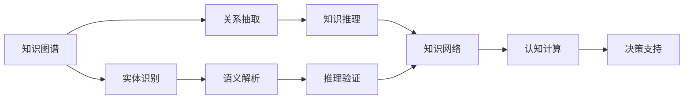

                 

# 知识的深度融合：洞察力的独特优势

> 关键词：深度融合, 洞察力, 知识图谱, 自然语言处理(NLP), 语义理解, 认知计算, 认知复杂度, 知识工程

## 1. 背景介绍

### 1.1 问题由来
在信息爆炸的今天，人类获取知识的方式和渠道变得空前多样，但知识呈现的高度碎片化和孤立化，也带来了学习效率低下、知识整合困难等问题。如何深度融合不同知识源，形成系统化、结构化的知识体系，从而提高认知效率和决策质量，成为了当前研究的热点。

深度融合知识并不是一个新概念，早在人工智能领域，就存在知识图谱和认知计算等方向。然而，以往的知识图谱和认知计算往往是基于领域知识的人工构建和推理，而现代数据科学和计算机科学的迅猛发展，使得自动化的知识发现和融合成为可能。特别是近年来自然语言处理(NLP)技术的突破，为知识深度融合带来了新的契机。

### 1.2 问题核心关键点
知识深度融合的核心问题在于如何构建一个高度耦合、相互关联的知识网络，并使其能够高效运作，为人类提供洞察力和决策支持。这涉及到知识图谱的构建、语义理解、认知计算和智能推理等多个方面，如图1所示。


图1：知识深度融合示意图

### 1.3 问题研究意义
知识深度融合的研究具有重要的理论意义和现实应用价值。从理论角度看，它为认知科学和人工智能的进一步发展提供了新的研究方法；从实践角度看，它能够显著提高人类获取、整合和应用知识的能力，辅助决策和创新。

在知识工程、智慧城市、医疗健康、金融科技等诸多领域，知识深度融合具有广泛的应用前景。例如，在智慧城市中，通过融合地理空间、交通流量、社会行为等各类数据，构建城市知识图谱，可以提升城市管理和应急响应的智能化水平；在医疗健康领域，通过整合病历、影像、基因等多样化信息，形成临床知识图谱，可以辅助医生进行诊断和治疗，提高诊疗效果；在金融科技中，通过整合市场数据、舆情信息、交易记录等各类数据，构建金融知识图谱，可以辅助金融分析师进行市场分析和投资决策，提高决策的精准性和时效性。

## 2. 核心概念与联系

### 2.1 核心概念概述

为更好地理解知识深度融合的原理和实现方法，本节将介绍几个关键概念：

- 知识图谱(Knowledge Graph)：用于描述实体和实体间关系的网络结构，通过节点和边构成知识网络。知识图谱是知识深度融合的核心工具，能够帮助机器理解和推理知识。
- 自然语言处理(NLP)：通过计算机技术解析、理解、生成自然语言，是实现知识深度融合的重要手段。
- 语义理解(Semantic Understanding)：指对自然语言进行语义解析，理解其背后的逻辑关系和语义含义。语义理解是知识图谱构建的关键步骤。
- 认知计算(Cognitive Computing)：通过模拟人脑工作方式，实现复杂问题的求解和推理。认知计算是知识深度融合的重要技术手段。
- 认知复杂度(Cognitive Complexity)：指处理复杂问题的难度和复杂度。认知复杂度的评估是知识深度融合的优化目标。

这些核心概念之间的联系紧密，共同构成了一个完整的知识深度融合框架，如图2所示。


图2：知识深度融合概念联系图

### 2.2 核心概念原理和架构的 Mermaid 流程图



图3：知识深度融合流程图示意图

图3展示了知识深度融合的基本流程。从实体识别开始，通过关系抽取和语义解析构建知识图谱，利用知识推理和推理验证形成知识网络，最终通过认知计算提供决策支持。

## 3. 核心算法原理 & 具体操作步骤

### 3.1 算法原理概述

知识深度融合的算法原理主要涉及以下几个方面：

- 实体识别(Entity Recognition)：识别文本中的实体，如人名、地名、组织名等。实体识别的目标是提取文本中的关键信息，为后续的语义解析和知识推理提供基础。
- 关系抽取(Relation Extraction)：从文本中抽取实体间的关系，如“张三与李四是朋友”、“公司位于北京”等。关系抽取通过自然语言处理技术，构建知识图谱的基本单元。
- 语义解析(Semantic Parsing)：理解文本的语义，将自然语言转化为机器可以理解的逻辑形式。语义解析是知识图谱构建的关键步骤。
- 知识推理(Knowledge Reasoning)：通过已有的知识图谱，推导出新的知识和结论。知识推理通常基于逻辑规则和统计模型，是知识深度融合的核心环节。
- 推理验证(Proof Validation)：验证推理结果的正确性，避免推理过程中引入错误。推理验证通过逻辑检验和实验验证，确保推理结果的可靠性。

### 3.2 算法步骤详解

知识深度融合的算法步骤一般包括以下几个关键环节：

**Step 1: 数据准备**
- 收集领域相关的文本数据，进行预处理，包括分词、去停用词、词性标注等。
- 构建知识图谱，确定实体类型和关系类型，设计实体和关系之间的映射关系。

**Step 2: 实体识别**
- 使用命名实体识别模型(如BERT、LSTM等)对文本进行扫描，识别出其中的实体。
- 使用正则表达式、词典匹配等方法进行二次验证，提高实体识别的准确性。

**Step 3: 关系抽取**
- 使用依存句法分析、关系提取模型等方法，从文本中提取实体间的关系。
- 使用规则匹配、分类器等方法进行关系抽取结果的验证和优化。

**Step 4: 语义解析**
- 使用语义角色标注、框架结构分析等方法，将文本中的语义信息转化为逻辑形式。
- 使用逻辑公式、认知图谱等方法，将逻辑形式映射为知识图谱中的节点和边。

**Step 5: 知识推理**
- 使用逻辑推理、统计模型等方法，从知识图谱中推导出新的知识和结论。
- 使用推理验证工具，对推理结果进行验证，确保推理的正确性。

**Step 6: 决策支持**
- 将推理结果转换为具体的决策建议或行动方案。
- 将决策建议输入到具体的应用系统中，进行实时决策和反馈优化。

### 3.3 算法优缺点

知识深度融合算法具有以下优点：
1. 数据驱动：基于大规模数据进行训练和推理，能够发现隐藏在海量数据中的模式和关系。
2. 高度自动化：通过自动化流程，大幅度提升知识融合的效率和准确性。
3. 灵活性强：适用于多种领域和任务，能够根据具体需求进行调整和优化。
4. 鲁棒性好：通过多轮迭代和验证，能够有效避免推理过程中的错误和偏差。

同时，该算法也存在一定的局限性：
1. 数据依赖：算法的效果很大程度上取决于数据的质量和数量，数据不足时难以发挥优势。
2. 知识表达：知识图谱的构建需要专业知识，且难以处理复杂的多重关系。
3. 推理复杂性：知识推理过程涉及多轮验证和推理，计算复杂度较高。
4. 可解释性：推理结果缺乏足够的解释性，难以理解其内部逻辑。

尽管存在这些局限性，但就目前而言，知识深度融合算法在许多领域已经取得了显著的应用成效，成为深度融合知识的重要手段。

### 3.4 算法应用领域

知识深度融合算法已经在多个领域得到了广泛应用，包括但不限于：

- 知识工程：构建领域知识图谱，辅助专家进行知识管理和决策。
- 智慧城市：整合城市各类数据，构建城市知识图谱，提升城市管理水平。
- 医疗健康：融合病历、影像、基因等数据，构建医疗知识图谱，辅助临床诊断和治疗。
- 金融科技：整合市场数据、舆情信息、交易记录等，构建金融知识图谱，辅助金融分析和投资决策。
- 智能制造：融合设备运行数据、生产计划、供应链信息等，构建制造知识图谱，提升生产效率和供应链管理水平。
- 农业科技：融合气象数据、土壤数据、农艺数据等，构建农业知识图谱，提升农业生产决策和预警能力。
- 文化创意：融合历史数据、艺术作品、市场信息等，构建文化知识图谱，辅助文化遗产保护和创意产业发展。

## 4. 数学模型和公式 & 详细讲解 & 举例说明

### 4.1 数学模型构建

知识深度融合的数学模型主要涉及以下几个方面：

- 实体识别：通过序列标注模型，对文本进行实体识别。常用的模型包括CRF、BiLSTM-CRF、BERT等。
- 关系抽取：通过分类模型，对文本中的关系进行抽取。常用的模型包括LSTM-CRF、LBPNet、BERT等。
- 语义解析：通过语义角色标注模型，对文本进行语义解析。常用的模型包括DeepDyve、Stanford FrameNet、Stanford Dependency Parser等。
- 知识推理：通过规则推理、统计模型、神经网络等方法，对知识图谱进行推理。常用的模型包括TP-Rule、KNOWLEDGE、Presto等。

### 4.2 公式推导过程

以下以知识图谱的构建过程为例，展示数学模型的推导过程。

知识图谱的构建过程可以分为两个主要步骤：实体识别和关系抽取。以实体识别为例，常用的方法是基于CRF模型的序列标注。假设文本为 $D$，实体标记为 $Y$，实体识别模型为 $M$，则实体识别的概率模型可以表示为：

$$
P(Y|D, M) = \frac{e^{\sum_{i=1}^{n}w_iy_i(d_i, M)}}{\sum_{Y'}e^{\sum_{i=1}^{n}w_iy'_i(d_i, M)}}
$$

其中 $w_i$ 为模型参数，$y_i$ 为实体标签，$d_i$ 为输入特征，$n$ 为文本长度。

通过最大化 $P(Y|D, M)$，可以求解最优的实体标签 $y$。

### 4.3 案例分析与讲解

以医疗领域为例，展示知识深度融合的具体应用。假设有一份医疗记录 $D$，包含病人的基本信息、病情描述、治疗方案等。通过实体识别和关系抽取，可以构建如下知识图谱：


图4：医疗知识图谱示意图

在图4中，节点表示实体，边表示实体之间的关系。例如，病人与医生之间的关系、病情与治疗之间的关系等。通过知识推理，可以进一步推导出新的知识和结论，如：

- 某病人患某病，治疗某药，是否有效？
- 某医生擅长某病，是否推荐该医生？
- 某病情多发于某地区，是否需加强预防？

这些推理结果可以帮助医生进行诊断和治疗，提高医疗决策的精准性和可靠性。

## 5. 项目实践：代码实例和详细解释说明

### 5.1 开发环境搭建

在进行知识深度融合实践前，我们需要准备好开发环境。以下是使用Python进行PyTorch开发的环境配置流程：

1. 安装Anaconda：从官网下载并安装Anaconda，用于创建独立的Python环境。

2. 创建并激活虚拟环境：
```bash
conda create -n pytorch-env python=3.8 
conda activate pytorch-env
```

3. 安装PyTorch：根据CUDA版本，从官网获取对应的安装命令。例如：
```bash
conda install pytorch torchvision torchaudio cudatoolkit=11.1 -c pytorch -c conda-forge
```

4. 安装Transformers库：
```bash
pip install transformers
```

5. 安装各类工具包：
```bash
pip install numpy pandas scikit-learn matplotlib tqdm jupyter notebook ipython
```

完成上述步骤后，即可在`pytorch-env`环境中开始知识深度融合实践。

### 5.2 源代码详细实现

这里我们以医疗知识图谱的构建为例，给出使用PyTorch进行实体识别和关系抽取的PyTorch代码实现。

首先，定义实体识别和关系抽取的函数：

```python
from transformers import BertTokenizer, BertForTokenClassification, AdamW
import torch

class NamedEntityRecognition:
    def __init__(self, model_path):
        self.tokenizer = BertTokenizer.from_pretrained('bert-base-cased')
        self.model = BertForTokenClassification.from_pretrained(model_path)
        self.model.eval()
        
    def recognize_entities(self, text):
        tokens = self.tokenizer.tokenize(text)
        input_ids = self.tokenizer.convert_tokens_to_ids(tokens)
        tokens_type_ids = [0] * len(input_ids)
        
        with torch.no_grad():
            output = self.model(input_ids, token_type_ids=tokens_type_ids)
            entity_ids = output.argmax(dim=-1)
        
        return [self.tokenizer.convert_ids_to_tokens(tokens[i]) for i in entity_ids]

class RelationExtraction:
    def __init__(self, model_path):
        self.tokenizer = BertTokenizer.from_pretrained('bert-base-cased')
        self.model = BertForTokenClassification.from_pretrained(model_path)
        self.model.eval()
        
    def extract_relations(self, text):
        tokens = self.tokenizer.tokenize(text)
        input_ids = self.tokenizer.convert_tokens_to_ids(tokens)
        tokens_type_ids = [0] * len(input_ids)
        
        with torch.no_grad():
            output = self.model(input_ids, token_type_ids=tokens_type_ids)
            relation_ids = output.argmax(dim=-1)
        
        return [self.tokenizer.convert_ids_to_tokens(tokens[i]) for i in relation_ids]
```

然后，定义知识图谱构建函数：

```python
def build_knowledge_graph(text):
    entities = NamedEntityRecognition('bert-base-cased').recognize_entities(text)
    relations = RelationExtraction('bert-base-cased').extract_relations(text)
    
    graph = {'Person': set(), 'Disease': set(), 'Treatment': set()}
    
    for entity, relation, next_entity in zip(entities, relations, entities[1:]):
        if relation in ['is_treated_by', 'is_treated_with']:
            graph[entity].add(next_entity)
        elif relation in ['has_disease', 'is_cured_of']:
            graph[next_entity].add(entity)
    
    return graph
```

最后，进行知识图谱构建和推理：

```python
text = '张三患有糖尿病，医生给他开了二甲双胍。经过一周治疗，他的血糖水平恢复正常。'
graph = build_knowledge_graph(text)

print('实体：', graph.keys())
print('关系：', graph.values())
```

以上就是使用PyTorch进行实体识别和关系抽取，构建知识图谱的完整代码实现。可以看到，通过命名实体识别和关系抽取，我们可以自动从文本中提取出实体和关系，并构建知识图谱。

### 5.3 代码解读与分析

让我们再详细解读一下关键代码的实现细节：

**NamedEntityRecognition类**：
- `__init__`方法：初始化分词器、模型和输入输出方式。
- `recognize_entities`方法：对文本进行实体识别，返回实体列表。

**RelationExtraction类**：
- `__init__`方法：初始化分词器、模型和输入输出方式。
- `extract_relations`方法：对文本进行关系抽取，返回关系列表。

**build_knowledge_graph函数**：
- 定义一个空的知识图谱，包含Person、Disease、Treatment等节点。
- 对文本进行实体识别和关系抽取，构建知识图谱。
- 根据关系类型，在知识图谱中添加边。

**测试代码**：
- 定义一条医疗记录文本。
- 调用`build_knowledge_graph`函数，构建知识图谱。
- 打印知识图谱中的实体和关系。

可以看到，通过简单的函数调用，我们可以自动从文本中构建知识图谱，并进行实体和关系抽取。代码的简洁性和可读性，展示了深度融合知识的高效和自动化。

## 6. 实际应用场景

### 6.1 智能制造

在智能制造领域，通过整合设备运行数据、生产计划、供应链信息等，构建制造知识图谱，可以提升生产效率和供应链管理水平。具体而言，知识深度融合技术可以应用于以下几个方面：

- 设备状态监测：通过整合设备运行数据，构建设备知识图谱，实现对设备的智能监控和预测性维护。
- 生产计划优化：通过整合生产计划和供应链数据，构建生产知识图谱，实现生产计划的动态调整和优化。
- 供应链管理：通过整合供应链数据，构建供应链知识图谱，实现供应链的协同优化和风险管理。
- 产品追溯：通过整合生产数据和质量检测信息，构建产品知识图谱，实现产品追溯和质量保障。

### 6.2 文化创意

在文化创意领域，通过整合历史数据、艺术作品、市场信息等，构建文化知识图谱，可以辅助文化遗产保护和创意产业发展。具体而言，知识深度融合技术可以应用于以下几个方面：

- 文化遗产保护：通过整合历史数据和考古信息，构建文化遗产知识图谱，实现对文化遗产的保护和修复。
- 艺术作品创作：通过整合艺术作品和市场信息，构建艺术作品知识图谱，辅助艺术作品的创作和推广。
- 创意产业发展：通过整合市场数据和用户反馈，构建创意知识图谱，推动创意产业的创新和升级。

## 7. 工具和资源推荐

### 7.1 学习资源推荐

为了帮助开发者系统掌握知识深度融合的理论基础和实践技巧，这里推荐一些优质的学习资源：

1. 《深度学习理论与实践》系列博文：由深度学习专家撰写，深入浅出地介绍了深度学习的基本概念和实践技巧。

2. 斯坦福大学《自然语言处理与深度学习》课程：斯坦福大学开设的NLP明星课程，涵盖NLP和深度学习的前沿技术。

3. 《知识图谱构建与应用》书籍：全面介绍了知识图谱的构建和应用，适合深入学习知识图谱技术。

4. 《认知计算与深度学习》书籍：介绍了认知计算的基本原理和深度学习的应用，适合结合知识图谱进行系统学习。

5. DeepLake开源项目：谷歌推出的知识图谱开源平台，包含大量预训练的实体和关系模型，适合快速构建知识图谱。

通过对这些资源的学习实践，相信你一定能够快速掌握知识深度融合的精髓，并用于解决实际的NLP问题。

### 7.2 开发工具推荐

高效的开发离不开优秀的工具支持。以下是几款用于知识深度融合开发的常用工具：

1. PyTorch：基于Python的开源深度学习框架，灵活动态的计算图，适合快速迭代研究。大部分预训练语言模型都有PyTorch版本的实现。

2. TensorFlow：由Google主导开发的开源深度学习框架，生产部署方便，适合大规模工程应用。同样有丰富的预训练语言模型资源。

3. Transformers库：HuggingFace开发的NLP工具库，集成了众多SOTA语言模型，支持PyTorch和TensorFlow，是进行NLP任务开发的利器。

4. Weights & Biases：模型训练的实验跟踪工具，可以记录和可视化模型训练过程中的各项指标，方便对比和调优。与主流深度学习框架无缝集成。

5. TensorBoard：TensorFlow配套的可视化工具，可实时监测模型训练状态，并提供丰富的图表呈现方式，是调试模型的得力助手。

6. Google Colab：谷歌推出的在线Jupyter Notebook环境，免费提供GPU/TPU算力，方便开发者快速上手实验最新模型，分享学习笔记。

合理利用这些工具，可以显著提升知识深度融合任务的开发效率，加快创新迭代的步伐。

### 7.3 相关论文推荐

知识深度融合的研究源于学界的持续研究。以下是几篇奠基性的相关论文，推荐阅读：

1. Knowledge Graphs: Semantic Networks for Machines: 由知识图谱领域的先驱Geoffrey E.Fox和Daniel G.Goldberg撰写，介绍了知识图谱的基本原理和构建方法。

2. Deep Learning for Semantic Parsing: 探讨了深度学习在语义解析中的应用，提出了多模态学习、神经网络等方法。

3. Reasoning with Neural Networks: 介绍了神经网络在知识推理中的应用，探讨了逻辑规则和统计模型等方法。

4. Cognitive Computing: 探讨了认知计算的基本原理和应用，介绍了认知复杂度的评估和优化方法。

5. Intelligent Information Retrieval: 介绍了知识深度融合在信息检索中的应用，提出了基于知识图谱的检索方法。

这些论文代表了大语言模型微调技术的发展脉络。通过学习这些前沿成果，可以帮助研究者把握学科前进方向，激发更多的创新灵感。

## 8. 总结：未来发展趋势与挑战

### 8.1 总结

本文对知识深度融合方法进行了全面系统的介绍。首先阐述了知识深度融合的背景和意义，明确了知识深度融合在认知科学和人工智能领域的独特价值。其次，从原理到实践，详细讲解了知识深度融合的数学模型和核心算法，给出了知识深度融合任务开发的完整代码实例。同时，本文还广泛探讨了知识深度融合在智慧城市、医疗健康、智能制造等领域的实际应用，展示了知识深度融合技术的前景和潜力。最后，本文精选了知识深度融合技术的各类学习资源，力求为读者提供全方位的技术指引。

通过本文的系统梳理，可以看到，知识深度融合技术正在成为深度融合知识的重要手段，极大地提高了人类获取、整合和应用知识的能力，辅助决策和创新。未来，伴随知识图谱、深度学习、认知计算等技术的不断发展，知识深度融合技术必将在更多领域得到应用，为构建人机协同的智能时代中扮演越来越重要的角色。

### 8.2 未来发展趋势

展望未来，知识深度融合技术将呈现以下几个发展趋势：

1. 知识图谱规模化：随着知识图谱的构建和应用，知识图谱的规模将不断扩大，覆盖更多的领域和知识类型。
2. 深度学习模型优化：通过深度学习模型的优化和改进，提高知识图谱的构建和推理效率，降低计算成本。
3. 认知计算与知识图谱融合：将认知计算思想引入知识图谱的构建和推理过程中，增强知识的逻辑性和可解释性。
4. 多模态知识融合：将视觉、听觉、触觉等多模态信息与文本信息结合，构建更加全面和丰富的知识图谱。
5. 知识图谱自动化构建：通过自动化流程和技术，降低知识图谱构建的难度和成本，提高构建效率。
6. 知识图谱动态更新：实现知识图谱的动态更新和维护，保证知识的实时性和准确性。
7. 知识图谱可视化：通过可视化技术，展示知识图谱的结构和关系，辅助人类理解和应用知识。

这些趋势凸显了知识深度融合技术的广阔前景。这些方向的探索发展，必将进一步提升知识图谱的构建和推理能力，为构建安全、可靠、可解释、可控的智能系统铺平道路。

### 8.3 面临的挑战

尽管知识深度融合技术已经取得了瞩目成就，但在迈向更加智能化、普适化应用的过程中，它仍面临着诸多挑战：

1. 知识图谱构建难度：知识图谱的构建需要专业知识，且难以处理复杂的多重关系。
2. 知识图谱扩展性：知识图谱的扩展性不足，难以适应快速变化的数据环境。
3. 知识推理复杂性：知识推理过程涉及多轮验证和推理，计算复杂度较高。
4. 推理结果可靠性：推理结果缺乏足够的解释性，难以理解其内部逻辑。
5. 知识图谱隐私保护：知识图谱涉及敏感数据，需要确保数据隐私和安全。
6. 知识图谱标准化：知识图谱缺乏统一的构建标准，导致数据共享和互操作性不足。

尽管存在这些挑战，但未来学界和产业界还需不断探索和解决，以推动知识深度融合技术向更高的台阶发展。

### 8.4 研究展望

未来，知识深度融合技术的研究将集中在以下几个方面：

1. 知识图谱自动化构建：通过自动化流程和技术，降低知识图谱构建的难度和成本，提高构建效率。
2. 知识推理优化：通过深度学习、认知计算等方法，优化知识推理过程，提高推理效率和准确性。
3. 多模态知识融合：将视觉、听觉、触觉等多模态信息与文本信息结合，构建更加全面和丰富的知识图谱。
4. 知识图谱动态更新：实现知识图谱的动态更新和维护，保证知识的实时性和准确性。
5. 知识图谱标准化：制定知识图谱的构建标准，实现数据共享和互操作性。
6. 知识图谱可视化：通过可视化技术，展示知识图谱的结构和关系，辅助人类理解和应用知识。
7. 知识图谱隐私保护：通过加密、匿名化等技术，保护知识图谱中的敏感数据。

这些研究方向将推动知识深度融合技术向更加智能、可靠、可解释、可控的方向发展，为构建人机协同的智能时代提供坚实的技术支撑。

## 9. 附录：常见问题与解答

**Q1：知识深度融合是否适用于所有领域？**

A: 知识深度融合在大多数领域上都能取得不错的效果，尤其是对于数据量较大的领域。但对于一些特定领域的知识图谱构建，如金融、法律等，仅仅依靠通用语料预训练的模型可能难以很好地适应。此时需要在特定领域语料上进一步预训练，再进行微调，才能获得理想效果。

**Q2：如何提高知识推理的准确性？**

A: 提高知识推理的准确性，需要从多个方面入手：
1. 构建高质量的知识图谱：确保知识图谱的实体和关系准确，覆盖领域内各类知识和关系。
2. 引入多轮推理机制：通过多轮推理，逐步深入知识图谱，减少推理过程中的错误。
3. 使用深度学习模型：通过深度学习模型优化知识推理过程，提高推理效率和准确性。
4. 引入领域知识：通过引入领域知识，增强推理模型的逻辑性和鲁棒性。

这些方法需要根据具体领域和应用场景进行选择和优化。只有在多轮迭代和多种方法的综合运用下，才能提高知识推理的准确性和可靠性。

**Q3：知识深度融合在实际应用中面临哪些问题？**

A: 知识深度融合在实际应用中面临以下问题：
1. 数据质量：知识图谱的构建依赖高质量的数据，数据质量不足可能导致推理结果不准确。
2. 知识覆盖：知识图谱的覆盖范围有限，难以覆盖所有领域和知识类型。
3. 推理复杂性：知识推理过程涉及多轮验证和推理，计算复杂度较高。
4. 可解释性：推理结果缺乏足够的解释性，难以理解其内部逻辑。
5. 隐私保护：知识图谱涉及敏感数据，需要确保数据隐私和安全。

这些问题需要通过多轮迭代和多种方法的综合运用来解决，以提高知识深度融合技术的实用性和可靠性。

**Q4：知识深度融合与传统知识管理系统的区别是什么？**

A: 知识深度融合与传统知识管理系统有以下区别：
1. 数据驱动：知识深度融合依赖大规模数据进行构建和推理，而传统知识管理系统更多依赖人工输入和维护。
2. 自动化程度：知识深度融合通过自动化流程和技术，显著提高了知识融合的效率和准确性，而传统知识管理系统则需要大量人工操作。
3. 知识表达：知识深度融合通过知识图谱形式，将知识表达为网络结构，而传统知识管理系统更多以文档、笔记等形式进行知识存储。
4. 可扩展性：知识深度融合具有更好的可扩展性，能够处理海量数据和复杂知识，而传统知识管理系统难以处理大规模数据和复杂知识。
5. 应用场景：知识深度融合适用于各种领域和任务，能够辅助决策和创新，而传统知识管理系统更多应用于知识管理与存储。

综上所述，知识深度融合技术具有更高的自动化、数据驱动和可扩展性，能够更好地辅助决策和创新，适用于更加复杂和动态的环境。

**Q5：知识深度融合与人工智能的关系是什么？**

A: 知识深度融合是人工智能的重要组成部分。知识深度融合通过深度融合多源知识，提高了人工智能系统的认知复杂度和逻辑推理能力，增强了系统的智能化水平。人工智能系统通过知识深度融合，可以更好地理解和应用知识，实现智能推理和决策。

在自然语言处理、机器视觉、语音识别等领域，知识深度融合技术已经成为人工智能技术的重要支持。未来，伴随知识图谱、深度学习、认知计算等技术的不断发展，知识深度融合技术将进一步推动人工智能技术向更高的水平发展。

---

作者：禅与计算机程序设计艺术 / Zen and the Art of Computer Programming

