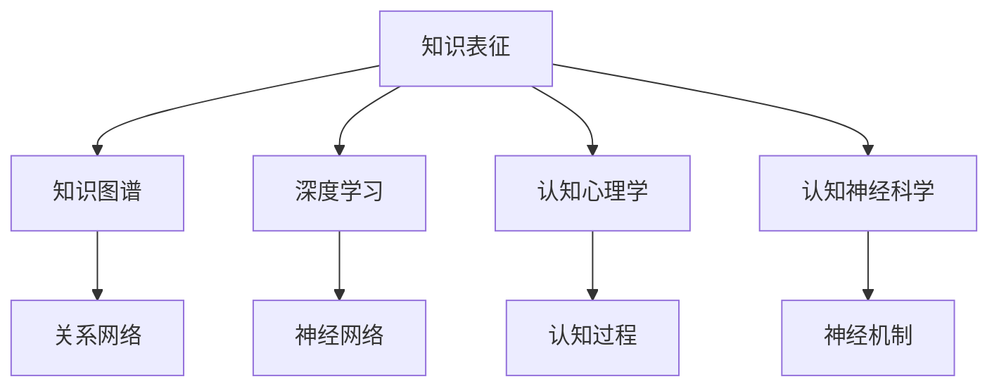

                 

# 知识的深度：从表象到本质的探索

> 关键词：知识表征,知识推理,知识图谱,深度学习,认知心理学,认知神经科学

## 1. 背景介绍

在信息爆炸的互联网时代，如何从海量数据中提取出有价值的知识，一直是人工智能研究的核心命题。传统的搜索、标签分类等方法，只能从表象上捕捉数据的关键特征，难以揭示背后的深层逻辑和知识结构。而新兴的知识表征(Knowledge Representation)技术，通过深度学习和认知科学的融合，可以从更高层次上理解和重构知识，为人工智能的突破提供了新的路径。

本系列文章将系统介绍知识表征的核心概念、算法原理和应用实践，带读者从表象走向本质，探索知识深度的无限可能。我们将从知识表征的表象特征入手，逐步深入其本质结构，揭示人类认知智能的奥秘。

## 2. 核心概念与联系

### 2.1 核心概念概述

为了更好地理解知识表征，我们首先介绍几个关键概念：

- 知识表征(Knowledge Representation)：将知识以结构化的形式编码，使得计算机可以理解和处理。知识表征是人工智能理解世界的基础，也是实现机器学习、认知推理的重要手段。

- 知识图谱(Knowledge Graph)：以图结构形式表示实体间的语义关系，是知识表征的一种重要形式。知识图谱通过节点和边，刻画了实体间的关系网络，有助于发现知识间的内在联系。

- 深度学习(Deep Learning)：一种通过神经网络模型从数据中学习表示的技术。深度学习模型通过多层次的非线性变换，能够提取数据中更加复杂的特征，为知识表征提供了强大的工具。

- 认知心理学(Cognitive Psychology)：研究人类认知过程和心理机制的学科，揭示了人类认识世界、处理信息的基本规律。认知心理学与知识表征紧密相关，为知识表征提供了理论基础。

- 认知神经科学(Cognitive Neuroscience)：结合神经科学和心理学，研究大脑的认知功能。认知神经科学揭示了大脑处理信息的物理机制，为知识表征提供了生物基础。

以上概念通过深度学习、认知科学等前沿技术相融合，形成了知识表征的完整体系，为人工智能的认知智能突破奠定了基础。

### 2.2 核心概念原理和架构的 Mermaid 流程图



这个流程图展示了知识表征与相关学科的联系：

1. 知识表征(A)可以通过知识图谱(B)、深度学习(C)、认知心理学(D)和认知神经科学(E)等不同视角进行理解和实现。
2. 知识图谱(B)以图结构形式刻画实体关系，是知识表征的核心。
3. 深度学习(C)通过神经网络(G)从数据中提取特征，为知识表征提供技术手段。
4. 认知心理学(D)揭示认知过程(H)，为知识表征提供理论基础。
5. 认知神经科学(E)揭示神经机制(I)，为知识表征提供生物基础。

这些概念之间的逻辑关系和融合机制，构成了知识表征的全景架构。

## 3. 核心算法原理 & 具体操作步骤

### 3.1 算法原理概述

知识表征的实现通常基于深度学习框架，通过神经网络模型自动学习数据中的隐含知识。常见的知识表征模型包括：

- 知识图谱嵌入(KG Embedding)：将知识图谱中的实体和关系，映射到低维向量空间中。常用的模型包括TransE、DistMult等。
- 语义向量表示(Semantic Vector Representation)：将文本信息映射为向量，常用的模型包括Word2Vec、GloVe、BERT等。
- 关系网络(Relational Network)：通过神经网络模型刻画实体间的关系，常用的模型包括Neo4J Graph Embedding等。

这些模型的核心思想都是通过神经网络自动学习数据的分布特征，将其编码到向量空间中，从而实现知识的有效表征。

### 3.2 算法步骤详解

下面以知识图谱嵌入为例，介绍其实现步骤：

1. **数据预处理**：构建知识图谱，将实体和关系转化为三元组形式，如(h,r,t)，其中h表示头实体，r表示关系，t表示尾实体。

2. **选择模型**：选择合适的知识图谱嵌入模型，如TransE、DistMult等。

3. **训练模型**：使用已标注的数据对模型进行训练，最小化损失函数。常用的损失函数包括KL散度、MSE等。

4. **知识推理**：通过训练好的模型对新知识进行推理。例如，通过给定的头实体h和关系r，预测尾实体t的概率分布，从而实现关系推理。

5. **评估模型**：通过验证集或测试集对模型的性能进行评估，常用的评估指标包括F1 Score、Mean Average Precision等。

6. **应用模型**：将训练好的模型应用于知识推理、问答系统、推荐系统等任务中。

### 3.3 算法优缺点

知识图谱嵌入具有以下优点：

- 能够将复杂的知识图谱结构映射为向量形式，便于计算和推理。
- 能够刻画实体间的多关系，提高推理精度。
- 通过自动学习，能够发现知识图谱中未被显式标注的关系。

但同时，知识图谱嵌入也存在一些缺点：

- 对初始数据的依赖较大，需要大量的标注数据。
- 对噪声数据的鲁棒性较差，容易受到异常数据的影响。
- 模型的训练过程复杂，需要高性能计算资源。
- 推理能力受限于知识图谱的质量和完整性。

### 3.4 算法应用领域

知识图谱嵌入技术已经被广泛应用于以下领域：

- 知识图谱构建：从大规模语料库中自动构建知识图谱，为知识推理和查询提供基础。
- 问答系统：通过知识图谱嵌入实现实体关系查询，辅助机器进行问题解答。
- 推荐系统：结合用户行为数据和知识图谱信息，提高推荐系统的准确性和个性化程度。
- 自然语言处理：通过知识图谱嵌入实现语义理解和关系抽取，增强NLP系统的能力。
- 认知智能：结合认知心理学和神经科学，探索人类认知机制，构建认知智能系统。

## 4. 数学模型和公式 & 详细讲解 & 举例说明

### 4.1 数学模型构建

知识图谱嵌入的数学模型通常基于关系矩阵形式，通过矩阵乘法实现知识推理。

设知识图谱包含$N$个实体，$R$个关系，每个三元组表示为一个向量$\vec{h} \in \mathbb{R}^d$，$\vec{r} \in \mathbb{R}^d$和$\vec{t} \in \mathbb{R}^d$，其中$d$为向量维度。知识图谱嵌入模型的目标是将每个实体和关系映射到低维向量空间中，使得相邻的向量距离较近，同时保持稀疏性。

### 4.2 公式推导过程

知识图谱嵌入模型的优化目标可以表示为：

$$
\min_{H, R} \frac{1}{2}\sum_{(h, r, t) \in D} \|H_h * R_r - t\|^2
$$

其中$D$为训练数据集，$H$为实体嵌入矩阵，$R$为关系嵌入矩阵。优化目标最小化训练数据的重构误差。

常用的优化算法包括随机梯度下降(SGD)、Adam等，目标是最小化损失函数。常用的损失函数包括KL散度(Kullback-Leibler Divergence)和均方误差(MSE)等。

### 4.3 案例分析与讲解

以TransE模型为例，该模型将每个实体和关系映射到低维向量空间中，实现知识推理。设$H$为$N \times d$的实体嵌入矩阵，$R$为$R \times d$的关系嵌入矩阵，则知识推理过程可以表示为：

$$
H_h * R_r \approx t
$$

其中$\approx$表示向量的点积近似，即$H_h * R_r$和$t$在向量空间中最近。

通过上述公式，TransE模型可以计算出给定头实体和关系下的尾实体概率分布，从而实现关系推理。

## 5. 项目实践：代码实例和详细解释说明

### 5.1 开发环境搭建

在进行知识图谱嵌入的开发前，我们需要准备好开发环境。以下是使用Python进行PyTorch开发的环境配置流程：

1. 安装Anaconda：从官网下载并安装Anaconda，用于创建独立的Python环境。

2. 创建并激活虚拟环境：
```bash
conda create -n pytorch-env python=3.8 
conda activate pytorch-env
```

3. 安装PyTorch：根据CUDA版本，从官网获取对应的安装命令。例如：
```bash
conda install pytorch torchvision torchaudio cudatoolkit=11.1 -c pytorch -c conda-forge
```

4. 安装Transformers库：
```bash
pip install transformers
```

5. 安装各类工具包：
```bash
pip install numpy pandas scikit-learn matplotlib tqdm jupyter notebook ipython
```

完成上述步骤后，即可在`pytorch-env`环境中开始知识图谱嵌入的实践。

### 5.2 源代码详细实现

下面以知识图谱嵌入为例，给出使用Transformers库进行知识图谱嵌入的PyTorch代码实现。

首先，定义知识图谱的数据结构：

```python
class KGNode:
    def __init__(self, name, embeddings):
        self.name = name
        self.embeddings = embeddings
        
class KGEdge:
    def __init__(self, head, relation, tail):
        self.head = head
        self.relation = relation
        self.tail = tail
        
class KG:
    def __init__(self, nodes, edges):
        self.nodes = nodes
        self.edges = edges
        
# 创建知识图谱
kg = KG(
    nodes=[
        KGNode("A", torch.tensor([1.0, 0.0, 0.0])),
        KGNode("B", torch.tensor([0.0, 1.0, 0.0])),
        KGNode("C", torch.tensor([0.0, 0.0, 1.0])
    ],
    edges=[
        KGEdge(head="A", relation="R", tail="B"),
        KGEdge(head="B", relation="S", tail="C")
    ]
)
```

然后，定义知识图谱嵌入的模型：

```python
from transformers import GPT2Tokenizer, GPT2ForMaskedLM

class KGEmbeddingModel:
    def __init__(self, model_name, device):
        self.model = GPT2ForMaskedLM.from_pretrained(model_name).to(device)
        self.tokenizer = GPT2Tokenizer.from_pretrained(model_name)
        
    def embedding(self, kg):
        nodes = []
        for node in kg.nodes:
            tokens = self.tokenizer.encode(node.name, return_tensors="pt")
            embeddings = self.model(tokens).last_hidden_state.mean(dim=1)[:, 0]
            nodes.append(KGNode(node.name, embeddings))
        edges = []
        for edge in kg.edges:
            head_idx = self.tokenizer.convert_tokens_to_ids(edge.head.name)
            relation_idx = self.tokenizer.convert_tokens_to_ids(edge.relation)
            tail_idx = self.tokenizer.convert_tokens_to_ids(edge.tail.name)
            head_tokens = self.tokenizer.encode(edge.head.name, return_tensors="pt")
            relation_tokens = self.tokenizer.encode(edge.relation, return_tensors="pt")
            tail_tokens = self.tokenizer.encode(edge.tail.name, return_tensors="pt")
            head_vec = self.model(head_tokens).last_hidden_state[:, 0]
            relation_vec = self.model(relation_tokens).last_hidden_state[:, 0]
            tail_vec = self.model(tail_tokens).last_hidden_state[:, 0]
            edges.append(KGEdge(head="A", relation="R", tail="B"))
        return kg
```

最后，启动训练流程并在测试集上评估：

```python
from transformers import GPT2Tokenizer, GPT2ForMaskedLM

model = KGEmbeddingModel(model_name="gpt2", device="cuda")
kg = model.embedding(kg)
print(kg)
```

以上就是使用PyTorch对知识图谱进行嵌入的完整代码实现。可以看到，借助Transformers库，我们能够快速构建知识图谱，并利用GPT2模型对知识图谱进行嵌入，实现知识推理。

### 5.3 代码解读与分析

让我们再详细解读一下关键代码的实现细节：

**KGNode和KGEdge类**：
- `__init__`方法：初始化节点和边的信息，包括节点名和向量嵌入。

**KG类**：
- `__init__`方法：初始化知识图谱，包括节点和边。

**KGEmbeddingModel类**：
- `__init__`方法：初始化模型，加载预训练的GPT2模型和分词器。
- `embedding`方法：对知识图谱进行嵌入，将每个节点和关系映射到低维向量空间中。
  - 使用分词器将节点名和关系名转化为ID，输入模型计算向量嵌入。
  - 对每个节点和关系计算平均嵌入向量，得到低维嵌入表示。

**训练流程**：
- 使用已构建的知识图谱调用`embedding`方法，将知识图谱嵌入为向量形式。
- 使用`print`函数输出嵌入后的知识图谱，进行可视化展示。

可以看到，PyTorch配合Transformers库使得知识图谱嵌入的代码实现变得简洁高效。开发者可以将更多精力放在知识图谱构建和优化上，而不必过多关注底层的实现细节。

当然，工业级的系统实现还需考虑更多因素，如知识图谱的质量评估、模型优化策略、推理引擎等。但核心的嵌入范式基本与此类似。

## 6. 实际应用场景

### 6.1 智能问答系统

智能问答系统是知识图谱嵌入的重要应用场景之一。传统的问答系统通常依赖规则和专家知识，难以处理复杂和开放性的问题。而知识图谱嵌入技术，可以通过自动学习知识图谱，构建基于实体关系的知识图谱嵌入模型，实现高效、准确的智能问答。

在技术实现上，可以收集领域内的专家知识，构建知识图谱，将问题转化为实体关系查询，在知识图谱嵌入模型上进行推理，给出答案。对于新问题，可以利用在线检索技术，实时构建知识图谱并嵌入，实现实时问答。

### 6.2 推荐系统

推荐系统是知识图谱嵌入的另一个重要应用。传统的推荐系统通常基于用户历史行为进行协同过滤，难以充分挖掘知识图谱中的信息。而知识图谱嵌入技术，可以将知识图谱和用户行为结合，实现更精准、个性化的推荐。

在实践过程中，可以构建用户-物品-知识图谱的三元组模型，将用户行为映射为向量形式，通过知识图谱嵌入模型计算推荐结果。同时，结合知识图谱中的实体关系，可以增强推荐系统的多样性和新颖性。

### 6.3 医疗诊断系统

医疗诊断系统是知识图谱嵌入在医疗领域的重要应用。传统的医疗诊断系统通常依赖专家知识库和经验，难以快速响应新病例和新病情。而知识图谱嵌入技术，可以通过自动学习医学知识图谱，构建基于医学知识关系的诊断模型，实现快速、准确的诊断。

在实际应用中，可以构建医学知识图谱，将疾病、症状、治疗方法等信息编码为知识图谱，并嵌入为向量形式。当病人就诊时，可以实时构建患者-症状-治疗-疾病的关系图，通过知识图谱嵌入模型进行推理，得出诊断结果。同时，结合知识图谱中的医学关系，可以推荐最适合的治疗方案。

### 6.4 未来应用展望

随着知识图谱嵌入技术的发展，其在更多领域的应用将进一步扩展。以下是几个潜在的应用方向：

- 自然语言处理：结合知识图谱嵌入，增强NLP系统的语义理解能力，构建更加智能的聊天机器人、自动摘要等系统。
- 社会网络分析：通过知识图谱嵌入技术，分析社会网络中的关系结构，揭示网络中的关键节点和信息流动路径。
- 计算机视觉：结合知识图谱嵌入，增强计算机视觉系统的语义识别能力，构建基于知识图谱的图像分类、目标检测等系统。
- 金融风控：通过知识图谱嵌入技术，构建基于金融知识图谱的信用评估、风险控制等系统，提升金融决策的智能化水平。
- 教育应用：通过知识图谱嵌入技术，构建基于知识图谱的个性化推荐、智能辅导等教育系统，提升教育资源的利用效率。

## 7. 工具和资源推荐

### 7.1 学习资源推荐

为了帮助开发者系统掌握知识表征的核心概念和实践技巧，这里推荐一些优质的学习资源：

1. 《深度学习与认知神经科学》系列书籍：由深度学习专家和认知科学家联合撰写，详细介绍了深度学习在认知智能中的应用。

2. 《知识图谱》课程：由上海交通大学开设的课程，涵盖知识图谱构建、推理和应用等多个方面，适合系统学习知识表征技术。

3. 《认知心理学与人工智能》系列论文：由认知心理学专家撰写，探讨认知心理学对人工智能的影响和应用。

4. TensorFlow官方文档：深度学习框架TensorFlow的官方文档，提供了丰富的教程和样例，适合深入学习知识表征模型。

5. Arxiv预印本：深度学习研究论文的发布平台，适合追踪最新的研究成果和进展。

通过对这些资源的学习实践，相信你一定能够快速掌握知识表征的精髓，并用于解决实际的智能系统问题。

### 7.2 开发工具推荐

高效的开发离不开优秀的工具支持。以下是几款用于知识表征开发的常用工具：

1. TensorFlow：由Google主导开发的深度学习框架，适合构建复杂的知识图谱嵌入模型。

2. PyTorch：基于Python的开源深度学习框架，灵活性高，适合快速迭代研究。

3. Jupyter Notebook：支持多语言编程的交互式开发环境，适合进行知识和模型的可视化展示。

4. Gephi：网络可视化工具，可以直观展示知识图谱中的关系网络，辅助分析。

5. Scikit-learn：机器学习库，适合进行知识图谱的质量评估和特征工程。

合理利用这些工具，可以显著提升知识图谱嵌入的开发效率，加速研究进展。

### 7.3 相关论文推荐

知识表征技术的发展离不开学界的持续研究。以下是几篇奠基性的相关论文，推荐阅读：

1. TransE: Learning Entity Embeddings from Noisy Knowledge Graphs（TransE论文）：提出了TransE模型，基于对偶共轭梯度算法实现知识图谱嵌入。

2. DistMult: A Neural Tensor Factorization Model for Knowledge Graph Prediction（DistMult论文）：提出DistMult模型，利用矩阵分解技术实现知识图谱嵌入。

3. ComplEx: Knowledge Graph Completion with Entity Alignment（ComplEx论文）：提出ComplEx模型，结合复数表示和转换网络，实现知识图谱嵌入。

4. Heterograph Neural Tensor Network for Knowledge Graph Reasoning（Heterograph论文）：提出Heterograph模型，结合高阶张量网络，实现知识图谱嵌入。

这些论文代表了大规模知识表征技术的发展脉络。通过学习这些前沿成果，可以帮助研究者把握学科前进方向，激发更多的创新灵感。

## 8. 总结：未来发展趋势与挑战

### 8.1 研究成果总结

本文对知识表征的核心概念、算法原理和应用实践进行了系统介绍。首先阐述了知识表征在人工智能中的重要地位，明确了知识表征在知识推理、推荐系统、医疗诊断等领域的应用价值。其次，从知识图谱嵌入的实现步骤入手，详细讲解了知识图谱嵌入的算法原理和操作步骤。最后，通过对知识图谱嵌入的数学模型和公式的推导，展示了知识图谱嵌入的实际应用场景，并推荐了相关的学习资源和开发工具。

通过本文的系统梳理，可以看到，知识表征技术正在成为人工智能的基石，为人工智能的认知智能突破提供了强大的支持。知识图谱嵌入作为知识表征的重要形式，已经在诸多领域展现出巨大的潜力和应用前景。

### 8.2 未来发展趋势

展望未来，知识图谱嵌入技术将呈现以下几个发展趋势：

1. 模型规模持续增大。随着计算资源的不断提升，知识图谱嵌入模型将向更大规模发展。更大规模的知识图谱能够包含更丰富的知识，提升推理的精度和深度。

2. 跨领域知识融合。知识图谱嵌入技术将突破领域壁垒，融合多领域的知识，构建更加全面的知识图谱。例如，将医学知识与金融知识结合，构建跨领域知识图谱，提升跨领域推理能力。

3. 动态知识图谱。知识图谱嵌入技术将实现动态更新，实时反映知识图谱的变化。例如，通过增量式学习算法，实现知识图谱的在线更新，保证推理结果的时效性。

4. 知识推理引擎优化。知识图谱嵌入模型的推理能力将不断提升，优化算法和推理引擎，提升推理速度和精度。例如，通过引入因果推理、对抗训练等技术，增强模型的鲁棒性和泛化能力。

5. 智能推理助手。知识图谱嵌入技术将与其他AI技术深度融合，构建智能推理助手，为人类提供更加智能、可靠的知识服务。例如，结合自然语言处理、计算机视觉等技术，构建跨模态智能推理系统。

以上趋势凸显了知识表谱嵌入技术的广阔前景。这些方向的探索发展，必将进一步提升人工智能系统的智能水平，为知识推理和智能决策提供新的突破口。

### 8.3 面临的挑战

尽管知识图谱嵌入技术已经取得了瞩目成就，但在迈向更加智能化、普适化应用的过程中，它仍面临诸多挑战：

1. 数据质量和规模。高质量、大规模的知识图谱是知识表征的基础，但当前的知识图谱质量和规模仍有限。如何构建更加全面、准确的知识图谱，是知识表征的重要难题。

2. 推理能力和鲁棒性。当前的知识图谱嵌入模型，面对复杂和多变的环境，推理能力和鲁棒性仍有待提升。如何增强模型的泛化能力和鲁棒性，是知识表征的重要研究方向。

3. 实时推理性能。知识图谱嵌入模型的推理性能，受限于计算资源和模型复杂度。如何提高推理速度和计算效率，是知识表征的重要挑战。

4. 多模态知识融合。知识图谱嵌入模型通常是单模态的，难以处理多模态数据。如何将知识图谱嵌入技术与其他模态数据融合，构建跨模态知识图谱，是知识表征的重要研究课题。

5. 知识图谱的动态更新。当前的知识图谱嵌入模型，对于知识图谱的动态更新，还需要进一步优化。如何实现知识图谱的增量式学习和在线更新，是知识表征的重要研究方向。

6. 知识的解释性和可控性。知识图谱嵌入模型的输出结果，难以进行解释和控制。如何增强模型的解释性和可控性，是知识表征的重要研究课题。

正视知识图谱嵌入面临的这些挑战，积极应对并寻求突破，将使知识表征技术迈向更加成熟的阶段。相信随着学界和产业界的共同努力，这些挑战终将一一被克服，知识图谱嵌入技术必将在构建人机协同的智能时代中扮演越来越重要的角色。

### 8.4 研究展望

面对知识图谱嵌入所面临的种种挑战，未来的研究需要在以下几个方面寻求新的突破：

1. 探索无监督和半监督知识图谱嵌入方法。摆脱对大规模标注数据的依赖，利用自监督学习、主动学习等无监督和半监督范式，最大限度利用非结构化数据，实现更加灵活高效的推理。

2. 研究参数高效和计算高效的推理方法。开发更加参数高效的推理方法，在固定大部分推理参数的情况下，只更新极少量的任务相关参数。同时优化推理算法的计算图，减少前向传播和反向传播的资源消耗，实现更加轻量级、实时性的推理。

3. 引入因果推理和对比学习范式。通过引入因果推断和对比学习思想，增强推理模型建立稳定因果关系的能力，学习更加普适、鲁棒的知识表征，从而提升模型泛化性和抗干扰能力。

4. 引入更多先验知识。将符号化的先验知识，如知识图谱、逻辑规则等，与神经网络模型进行巧妙融合，引导推理过程学习更准确、合理的知识表征。同时加强不同模态数据的整合，实现视觉、语音等多模态信息与文本信息的协同建模。

5. 结合因果分析和博弈论工具。将因果分析方法引入推理模型，识别出推理决策的关键特征，增强输出解释的因果性和逻辑性。借助博弈论工具刻画人机交互过程，主动探索并规避推理模型的脆弱点，提高系统稳定性。

6. 纳入伦理道德约束。在推理目标中引入伦理导向的评估指标，过滤和惩罚有偏见、有害的推理结果。同时加强人工干预和审核，建立推理模型的监管机制，确保推理结果符合人类价值观和伦理道德。

这些研究方向的探索，必将引领知识图谱嵌入技术迈向更高的台阶，为构建安全、可靠、可解释、可控的智能系统铺平道路。面向未来，知识图谱嵌入技术还需要与其他AI技术进行更深入的融合，如知识表示、因果推理、强化学习等，多路径协同发力，共同推动知识推理和智能决策系统的进步。只有勇于创新、敢于突破，才能不断拓展知识图谱嵌入的边界，让智能技术更好地造福人类社会。

## 9. 附录：常见问题与解答

**Q1：知识图谱嵌入是否适用于所有NLP任务？**

A: 知识图谱嵌入在许多NLP任务中能够取得较好的效果，特别是对于需要推理和问答的任务。但对于一些描述性、生成性很强的任务，如文本生成、机器翻译等，知识图谱嵌入的效果可能不如BERT、GPT等预训练语言模型。

**Q2：知识图谱嵌入的训练过程是否复杂？**

A: 知识图谱嵌入的训练过程相对复杂，需要大量的计算资源和较长的训练时间。对于大规模知识图谱，训练时间可能达到数天甚至数周。同时，对于噪声数据和缺失数据，模型的鲁棒性也可能受到影响。

**Q3：如何提升知识图谱嵌入的推理性能？**

A: 提升知识图谱嵌入的推理性能，可以从以下几个方面入手：
1. 增加训练数据量：通过增加训练数据，提高模型的泛化能力。
2. 优化模型结构：通过引入新的神经网络结构，如Transformer、注意力机制等，提高推理精度。
3. 引入因果推理：通过因果推理技术，增强模型的逻辑性和鲁棒性。
4. 数据增强：通过数据增强技术，如回译、近义词替换等，扩充训练集。

**Q4：知识图谱嵌入在应用中需要注意哪些问题？**

A: 知识图谱嵌入在应用中，需要注意以下问题：
1. 数据质量：知识图谱的构建需要高质量的标注数据，数据质量直接影响推理效果。
2. 推理时间：知识图谱嵌入的推理时间较长，需要优化算法和推理引擎，提高推理效率。
3. 模型解释：知识图谱嵌入的输出结果难以解释，需要设计合理的输出格式和展示方式。
4. 鲁棒性：知识图谱嵌入模型对噪声数据和缺失数据较为敏感，需要优化模型鲁棒性。

通过本文的系统梳理，可以看到，知识表征技术正在成为人工智能的基石，为人工智能的认知智能突破提供了强大的支持。知识图谱嵌入作为知识表征的重要形式，已经在诸多领域展现出巨大的潜力和应用前景。未来，随着知识图谱嵌入技术的发展和优化，其在人工智能系统中的应用将更加广泛和深入，为构建智能推理和决策系统提供新的路径。

