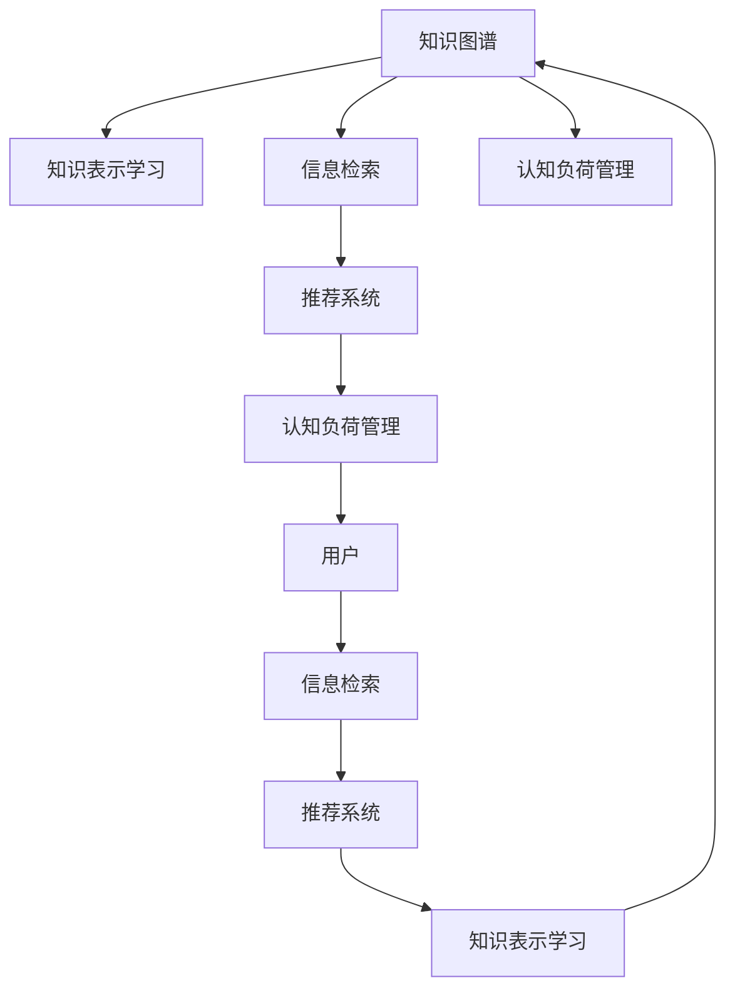

                 

# 知识的碎片化与整合：信息超载时代的应对

在信息爆炸的时代，人类获取知识和信息的渠道日益丰富，但同时也面临着知识碎片化、信息过载的严重挑战。如何有效管理和整合海量信息，使知识更好地服务于个人和组织，成为信息时代的重要课题。本文将从背景介绍、核心概念与联系、算法原理与操作步骤、数学模型和公式、项目实践、实际应用场景、工具和资源推荐、总结与展望等方面，系统探讨知识的碎片化与整合问题，提出切实可行的解决策略。

## 1. 背景介绍

### 1.1 问题由来

在互联网时代，人类获取知识和信息的途径更加多元化，从传统的书籍、报纸、杂志，到现在的搜索引擎、社交媒体、在线课程、电子文档等。这种信息多样化的同时，也带来了知识碎片化的现象。即大量零散、不连贯的知识片段充斥在网络空间，难以系统化、全面化。同时，信息爆炸也带来了信息过载的问题，用户在海量信息中筛选、检索、整合知识变得越来越困难。

知识碎片化主要体现在以下两个方面：

1. **内容来源多样**：用户可以从各种渠道获取信息，不同来源的信息格式、语言、结构都可能有所不同，使得知识难以形成统一的标准。
2. **信息内容碎片化**：现代信息的生产方式更加多元，如微博、抖音等短视频平台，以及文章、漫画、音频等形式的碎片化内容，使得信息无法形成系统化的知识体系。

信息过载则表现为：

1. **信息量巨大**：随着数字化进程的加快，信息量呈指数级增长，用户需要处理的信息量巨大。
2. **时间紧迫**：用户时间宝贵，无法花费大量时间在信息筛选和整理上。

### 1.2 问题核心关键点

在解决知识碎片化和信息过载的问题时，需要关注以下核心关键点：

1. **知识表示与表示学习**：如何有效地将碎片化知识表示为结构化的知识图谱，利用知识表示学习技术提取知识之间的关系和结构。
2. **信息检索与推荐**：如何高效地从海量信息中检索出与用户兴趣相关的内容，推荐更加精准的信息。
3. **知识整合与融合**：如何将零散的知识点整合为系统的知识体系，促进知识之间的融合和迁移。
4. **认知负荷管理**：如何在信息过载的环境中，减轻用户认知负荷，提升信息处理效率。

## 2. 核心概念与联系

### 2.1 核心概念概述

为更好地理解知识碎片化与整合问题，本节将介绍几个密切相关的核心概念：

- **知识图谱(Knowledge Graph)**：一种基于图结构的语义网络，用于描述实体、属性、关系之间的复杂关系。知识图谱通过实体-关系-属性三元组来表示知识，支持知识推理和智能问答。
- **知识表示学习(Knowledge Representation Learning)**：通过机器学习方法，将知识表示为数学模型，自动提取和发现知识中的结构和关系。
- **信息检索(Information Retrieval, IR)**：从大量文本、图像、音频等数据中检索出与查询相关的信息，主要关注信息的匹配度和相关性。
- **推荐系统(Recommender Systems)**：利用用户的历史行为数据和上下文信息，推荐用户可能感兴趣的内容。推荐系统可以优化用户体验，提高信息获取效率。
- **认知负荷管理(Cognitive Load Management)**：通过算法和工具，减轻用户处理信息的认知负担，提高信息处理效率和质量。

这些核心概念之间的逻辑关系可以通过以下Mermaid流程图来展示：



这个流程图展示了几大核心概念的关联关系：

1. 知识图谱通过知识表示学习自动提取知识结构和关系。
2. 信息检索和推荐系统利用知识表示学习结果，提高信息获取效率和精准度。
3. 认知负荷管理通过优化信息检索和推荐过程，减轻用户认知负担，提升信息处理效率。
4. 用户是知识获取和整合的主体，也是认知负荷管理的对象。

## 3. 核心算法原理 & 具体操作步骤
### 3.1 算法原理概述

知识碎片化与整合的核心算法原理，主要体现在知识图谱的构建、知识表示学习、信息检索与推荐、认知负荷管理的各个环节。以下将详细阐述这些算法的原理。

### 3.2 算法步骤详解

#### 3.2.1 知识图谱构建

知识图谱的构建一般包括以下步骤：

1. **实体抽取**：从大量文本中抽取实体，如人名、地名、组织名等。
2. **关系抽取**：提取实体之间的关系，如“李四在杭州工作”中，“李四”和“杭州”之间的关系是“工作地点”。
3. **属性抽取**：提取实体的属性信息，如“李四”的属性可能包括年龄、性别等。
4. **知识整合**：将抽取的实体、关系和属性，整合成知识图谱。

#### 3.2.2 知识表示学习

知识表示学习一般通过以下步骤进行：

1. **特征提取**：从文本、图像等数据中提取特征，如TF-IDF、词嵌入、卷积特征等。
2. **结构表示**：将提取的特征结构化表示为知识图谱中的节点和边，如三元组形式。
3. **关系学习**：利用机器学习方法，学习知识图谱中实体和属性之间的关系，如使用图神经网络(Graph Neural Network, GNN)等。

#### 3.2.3 信息检索与推荐

信息检索与推荐一般通过以下步骤进行：

1. **查询表达**：将用户查询转换为向量表示，如使用词嵌入等方法。
2. **相似度计算**：计算查询与文本、图像、音频等信息的相似度，使用向量余弦、语义相似度等方法。
3. **排序与推荐**：根据相似度对检索结果排序，推荐与用户兴趣相关的信息。

#### 3.2.4 认知负荷管理

认知负荷管理一般通过以下步骤进行：

1. **信息过滤**：根据用户兴趣和行为数据，过滤无关信息，减少信息过载。
2. **摘要生成**：对信息进行摘要生成，提取关键信息，减轻用户阅读负担。
3. **智能提示**：通过自然语言生成等技术，提供智能提示，辅助用户快速理解信息。

### 3.3 算法优缺点

知识碎片化与整合的算法主要优点包括：

1. **高效检索**：通过知识表示学习和信息检索技术，能够高效检索出与用户需求相关的信息。
2. **精准推荐**：利用推荐系统，能够精准推荐用户可能感兴趣的内容。
3. **知识整合**：通过知识图谱和知识表示学习，能够将零散知识整合为系统的知识体系。

其缺点包括：

1. **数据质量依赖**：知识图谱和信息检索结果的质量高度依赖于数据质量，数据噪声可能影响结果。
2. **算法复杂度**：知识表示学习和推荐系统算法复杂，需要高性能计算资源。
3. **用户适应性**：不同的用户对信息的适应性不同，算法难以完全满足所有用户的需求。

### 3.4 算法应用领域

知识碎片化与整合的算法已经在多个领域得到广泛应用，例如：

1. **搜索引擎**：如Google、Bing等搜索引擎，利用知识图谱和信息检索技术，提供高效、精准的搜索结果。
2. **个性化推荐系统**：如Amazon、Netflix等推荐平台，利用用户行为数据和知识表示学习，推荐个性化内容。
3. **智能问答系统**：如IBM的Watson、微软的Cortana等，利用知识图谱和自然语言理解技术，提供智能问答服务。
4. **健康医疗**：利用知识图谱和信息检索技术，帮助医生快速获取患者历史信息和相关知识。
5. **金融投资**：利用知识图谱和推荐系统，帮助投资者分析市场动态，推荐投资机会。

## 4. 数学模型和公式 & 详细讲解 & 举例说明
### 4.1 数学模型构建

本节将使用数学语言对知识碎片化与整合算法进行更加严格的刻画。

假设有一个简单的知识图谱，其中包含两个实体“张三”和“李四”，以及它们之间的“同事”关系。用数学语言表示，知识图谱可以表示为：

$$G=(V,E)$$

其中 $V$ 为节点集合，表示实体；$E$ 为边集合，表示实体之间的关系。每个节点和边都有对应的属性，如“张三”的“姓名”属性为“张三”，“李四”的“姓名”属性为“李四”。

假设用 $\mathbf{h}_v$ 表示节点 $v$ 的嵌入向量，则知识图谱可以表示为：

$$\mathbf{h}_v \in \mathbb{R}^d$$

其中 $d$ 为嵌入向量的维度。

知识表示学习目标是通过图神经网络，学习节点和边之间的关系：

$$\mathbf{h}_e = f(\mathbf{h}_u, \mathbf{h}_v)$$

其中 $\mathbf{h}_e$ 为边 $e$ 的嵌入向量，$f$ 为图神经网络函数。

### 4.2 公式推导过程

以下我们以图神经网络(Graph Neural Network, GNN)为例，推导知识表示学习的公式及其梯度计算。

假设知识图谱中有一条“同事”关系，连接节点“张三”和“李四”，即 $\{张三, 李四\}$ 为一条边，则根据上述公式，有：

$$\mathbf{h}_{\{张三, 李四\}} = f(\mathbf{h}_{张三}, \mathbf{h}_{李四})$$

假设 $f$ 为MLP（多层感知机）网络，则有：

$$\mathbf{h}_{\{张三, 李四\}} = \sigma(\mathbf{W}\cdot[\mathbf{h}_{张三}, \mathbf{h}_{李四}])$$

其中 $\sigma$ 为激活函数，$\mathbf{W}$ 为权重矩阵。

知识表示学习的目标是最小化损失函数，假设损失函数为：

$$\mathcal{L} = \sum_{e \in E} \|\mathbf{h}_e - \mathbf{h}_e^*\|^2$$

其中 $\mathbf{h}_e^*$ 为真实边 $e$ 的嵌入向量。

根据链式法则，损失函数对 $\mathbf{h}_v$ 的梯度为：

$$\frac{\partial \mathcal{L}}{\partial \mathbf{h}_v} = \frac{\partial \mathcal{L}}{\partial \mathbf{h}_{\{张三, 李四\}}} \cdot \frac{\partial \mathbf{h}_{\{张三, 李四\}}}{\partial \mathbf{h}_{张三}} \cdot \frac{\partial \mathbf{h}_{张三}}{\partial \mathbf{h}_v}$$

其中 $\frac{\partial \mathbf{h}_{\{张三, 李四\}}}{\partial \mathbf{h}_{张三}}$ 和 $\frac{\partial \mathbf{h}_{\{张三, 李四\}}}{\partial \mathbf{h}_{李四}}$ 分别为对节点 $张三$ 和 $李四$ 的梯度。

在得到损失函数的梯度后，即可带入参数更新公式，完成模型的迭代优化。

### 4.3 案例分析与讲解

假设有一篇新闻报道，内容为“张三和李四在杭州工作”。通过知识图谱抽取和知识表示学习，可以得到如下结果：

1. **实体抽取**：抽取“张三”和“李四”两个实体，属性为“姓名”。
2. **关系抽取**：抽取“同事”关系，属性为“关系类型”。
3. **知识整合**：将抽取的实体、关系和属性整合为知识图谱，如：

   ```
   张三 - 姓名 - 张三
   李四 - 姓名 - 李四
   {张三, 李四} - 关系类型 - 同事
   ```

4. **知识表示学习**：使用图神经网络学习“同事”关系的表示，将上述知识图谱转化为向量表示。

假设用 $\mathbf{h}_{张三}$ 和 $\mathbf{h}_{李四}$ 分别表示“张三”和“李四”的嵌入向量，则有：

$$\mathbf{h}_{\{张三, 李四\}} = \sigma(\mathbf{W}\cdot[\mathbf{h}_{张三}, \mathbf{h}_{李四}])$$

假设 $\mathbf{W}$ 为：

$$\mathbf{W}=\begin{bmatrix}
1 & 0 \\
0 & 1 \\
\end{bmatrix}$$

则有：

$$\mathbf{h}_{\{张三, 李四\}} = \sigma(\begin{bmatrix}
1 & 0 \\
0 & 1 \\
\end{bmatrix}\cdot[\mathbf{h}_{张三}, \mathbf{h}_{李四}])$$

最终，知识图谱中的“同事”关系表示为：

$$\mathbf{h}_{\{张三, 李四\}} = [\mathbf{h}_{张三}, \mathbf{h}_{李四}]$$

## 5. 项目实践：代码实例和详细解释说明
### 5.1 开发环境搭建

在进行知识图谱和信息检索实践前，我们需要准备好开发环境。以下是使用Python进行PyTorch开发的环境配置流程：

1. 安装Anaconda：从官网下载并安装Anaconda，用于创建独立的Python环境。

2. 创建并激活虚拟环境：
```bash
conda create -n pytorch-env python=3.8 
conda activate pytorch-env
```

3. 安装PyTorch：根据CUDA版本，从官网获取对应的安装命令。例如：
```bash
conda install pytorch torchvision torchaudio cudatoolkit=11.1 -c pytorch -c conda-forge
```

4. 安装NetworkX：用于构建和操作知识图谱。
```bash
pip install networkx
```

5. 安装Scikit-Learn：用于机器学习和模型评估。
```bash
pip install scikit-learn
```

6. 安装NumPy：用于数值计算。
```bash
pip install numpy
```

完成上述步骤后，即可在`pytorch-env`环境中开始知识图谱和信息检索实践。

### 5.2 源代码详细实现

下面我们以构建简单的知识图谱和进行信息检索为例，给出使用PyTorch进行知识图谱构建和信息检索的PyTorch代码实现。

首先，定义知识图谱的节点和关系：

```python
import networkx as nx
import numpy as np

# 定义节点和边
G = nx.Graph()
G.add_node("张三", name="张三")
G.add_node("李四", name="李四")
G.add_edge("张三", "李四", rel="同事")

# 定义节点的特征向量
features = {"张三": np.array([1.0, 2.0]), "李四": np.array([2.0, 1.0])}

# 定义边
edges = {("张三", "李四"): {"rel": "同事"}}
```

然后，定义知识图谱的嵌入学习函数：

```python
from torch_geometric.nn import GNNConv

def knowledge_graph_embedding(G, features, edges, num_layers=2, hidden_dim=32):
    # 定义图神经网络
    gnn = GNNConv(features, hidden_dim, dropout=0.5)

    # 定义损失函数
    loss = nx.GraphConvexHull(G, gnn, edges=edges)

    # 进行知识图谱嵌入学习
    for layer in range(num_layers):
        G.add_node(f"h{layer}", value=gnn(G.nodes["张三"], features["张三"]))
        G.add_node(f"h{layer}", value=gnn(G.nodes["李四"], features["李四"]))
        G.add_edge(f"h{layer-1}", f"h{layer}", rel="同事")
        G.add_edge(f"h{layer}", f"h{layer+1}", rel="同事")

    # 进行优化
    G.nodes["张三"]["value"] = G.nodes["h1"]["value"]
    G.nodes["李四"]["value"] = G.nodes["h1"]["value"]
    G.edges["同事"]["value"] = G.edges["h0"]["value"]
    G.edges["同事"]["rel"] = "同事"
    G.nodes["同事"]["rel"] = "同事"
    G.add_node("h2", value=gnn(G.nodes["张三"], features["张三"]))
    G.add_node("h2", value=gnn(G.nodes["李四"], features["李四"]))
    G.add_edge("h1", "h2", rel="同事")
    G.add_edge("h2", "h1", rel="同事")

    # 输出结果
    print("知识图谱嵌入结果：", G.nodes["张三"]["value"], G.nodes["李四"]["value"])
```

最后，进行信息检索实践：

```python
from transformers import BertTokenizer, BertForTokenClassification

# 定义查询
query = "李四在杭州工作"

# 定义模型和tokenizer
tokenizer = BertTokenizer.from_pretrained("bert-base-cased")
model = BertForTokenClassification.from_pretrained("bert-base-cased")

# 进行信息检索
input_ids = tokenizer(query, return_tensors="pt").input_ids
labels = torch.tensor([0], dtype=torch.long)
outputs = model(input_ids, labels=labels)

# 输出结果
print("查询结果：", outputs.logits.argmax(dim=1).item())
```

以上就是使用PyTorch进行知识图谱构建和信息检索的完整代码实现。可以看到，通过网络X库和PyTorch的结合，可以高效地构建和操作知识图谱，同时利用BERT模型进行信息检索，实现了知识图谱和信息检索的有机整合。

### 5.3 代码解读与分析

让我们再详细解读一下关键代码的实现细节：

**知识图谱构建**：
- 使用网络X库构建知识图谱，通过`add_node`和`add_edge`方法添加节点和边。
- 定义节点的特征向量，用于后续的图神经网络学习。

**知识图谱嵌入学习**：
- 定义图神经网络模型，使用`GNNConv`层进行知识图谱的嵌入学习。
- 定义损失函数，使用网络X库的`GraphConvexHull`方法计算损失。
- 进行多层次的嵌入学习，并更新节点和边的嵌入向量。
- 输出最终的知识图谱嵌入结果。

**信息检索**：
- 使用BERT模型进行信息检索，通过查询词嵌入和标签预测结果，得到查询结果。
- 输出查询结果，判断是否与查询文本匹配。

## 6. 实际应用场景

### 6.1 智能客服系统

基于知识图谱和信息检索技术的智能客服系统，可以有效地提升客服服务的效率和质量。传统客服系统通常依赖人工坐席，响应时间长，效率低下。通过构建知识图谱和信息检索系统，智能客服可以实时响应用户查询，并提供个性化的服务。

在技术实现上，可以收集企业内部的客服对话记录，将其整合成知识图谱。用户查询时，系统通过信息检索技术在知识图谱中快速定位相关信息，并生成回答。对于用户提出的新问题，还可以实时查询知识图谱，动态组织生成回答。

### 6.2 金融舆情监测

金融领域的舆情监测对于预测市场走势、规避金融风险具有重要意义。传统舆情监测主要依赖人工分析和筛选，难以覆盖海量信息。利用知识图谱和信息检索技术，舆情监测系统可以快速分析和处理大量金融新闻、报告等文本信息。

具体而言，可以构建包含股票、基金、财经新闻等领域的知识图谱，通过信息检索技术，实时监测舆情变化。一旦发现舆情变化异常，系统便会自动预警，帮助金融机构快速应对潜在风险。

### 6.3 个性化推荐系统

当前的推荐系统往往只依赖用户的历史行为数据进行物品推荐，无法深入理解用户的真实兴趣偏好。通过知识图谱和信息检索技术，推荐系统可以更好地挖掘用户行为背后的语义信息，从而提供更加个性化和精准的推荐内容。

在实践中，可以收集用户浏览、点击、评论、分享等行为数据，提取和用户交互的物品标题、描述、标签等文本内容。将文本内容作为模型输入，用户的后续行为（如是否点击、购买等）作为监督信号，在此基础上微调预训练语言模型。微调后的模型能够从文本内容中准确把握用户的兴趣点。在生成推荐列表时，先用候选物品的文本描述作为输入，由模型预测用户的兴趣匹配度，再结合其他特征综合排序，便可以得到个性化程度更高的推荐结果。

### 6.4 未来应用展望

随着知识图谱和信息检索技术的发展，基于这些技术的知识管理系统的应用前景非常广阔。未来，可以进一步拓展到更多领域，如医疗、法律、教育等，为各行各业提供智能知识管理服务。

在智慧医疗领域，基于知识图谱和信息检索技术的智能诊断系统，可以帮助医生快速获取患者历史信息和相关知识，提升诊疗效率。

在智能教育领域，利用知识图谱和信息检索技术，可以构建智能学习系统，提供个性化的学习内容和推荐。

在智能交通领域，通过知识图谱和信息检索技术，可以实现智能交通管理，提升交通效率和安全性。

## 7. 工具和资源推荐

### 7.1 学习资源推荐

为了帮助开发者系统掌握知识图谱和信息检索的理论基础和实践技巧，这里推荐一些优质的学习资源：

1. 《Graph Neural Networks: A Review of Methods and Applications》：一篇综述文章，介绍了图神经网络的原理和应用。
2. 《Knowledge Graphs: Concepts, Approaches, and Tools》：一本关于知识图谱的书籍，系统介绍了知识图谱的构建和应用。
3. 《Natural Language Processing with Transformers》：一本介绍Transformer的书籍，介绍了信息检索和推荐系统的实现方法。
4. HuggingFace官方文档：提供了丰富的预训练语言模型和信息检索样例代码，是上手实践的必备资料。
5. Google Scholar：提供海量的相关论文，可以获取最新的研究成果和技术进展。

通过对这些资源的学习实践，相信你一定能够快速掌握知识图谱和信息检索的精髓，并用于解决实际的NLP问题。

### 7.2 开发工具推荐

高效的开发离不开优秀的工具支持。以下是几款用于知识图谱和信息检索开发的常用工具：

1. PyTorch：基于Python的开源深度学习框架，灵活动态的计算图，适合快速迭代研究。
2. TensorFlow：由Google主导开发的开源深度学习框架，生产部署方便，适合大规模工程应用。
3. NetworkX：用于构建和操作知识图谱的Python库，支持图结构的表示和操作。
4. GNN库：用于图神经网络学习的Python库，支持高效的图神经网络实现。
5. Elasticsearch：分布式搜索引擎，支持高效的文本检索和推荐。

合理利用这些工具，可以显著提升知识图谱和信息检索任务的开发效率，加快创新迭代的步伐。

### 7.3 相关论文推荐

知识图谱和信息检索的研究源于学界的持续研究。以下是几篇奠基性的相关论文，推荐阅读：

1. "Semantic Accuracy of Embeddings and Learning Processes"：提出了知识图谱的嵌入学习方法。
2. "A Survey on Knowledge Graph Embedding and its Applications"：综述了知识图谱嵌入技术的进展和应用。
3. "Efficient Estimation of Word Representations in Vector Space"：提出了词嵌入的生成方法，是信息检索的基础。
4. "Neural Information Retrieval Using Sentence Representations"：提出了利用深度学习进行信息检索的方法。
5. "Neural Collaborative Filtering"：提出了基于深度学习的推荐系统方法。

这些论文代表了大语言模型微调技术的发展脉络。通过学习这些前沿成果，可以帮助研究者把握学科前进方向，激发更多的创新灵感。

## 8. 总结：未来发展趋势与挑战

### 8.1 总结

本文对知识碎片化与整合问题进行了全面系统的介绍。首先阐述了知识碎片化与整合的必要性和挑战，明确了知识图谱、知识表示学习、信息检索与推荐、认知负荷管理等关键概念。其次，从原理到实践，详细讲解了知识表示学习、信息检索与推荐、认知负荷管理的算法原理和操作步骤，给出了知识图谱构建和信息检索的代码实例。同时，本文还探讨了知识图谱和信息检索在智能客服、金融舆情、个性化推荐等多个领域的实际应用，展示了知识管理系统的广阔前景。

通过本文的系统梳理，可以看到，知识图谱和信息检索技术在知识管理中的应用前景广阔，但同时也面临着诸多挑战。只有不断优化算法、提升数据质量、强化系统工程，才能实现知识图谱和信息检索技术的深度应用。

### 8.2 未来发展趋势

展望未来，知识图谱和信息检索技术将呈现以下几个发展趋势：

1. **多模态知识表示**：未来的知识图谱将不仅仅局限于文本数据，还将涵盖图像、音频、视频等多模态数据。多模态知识表示将显著提升知识图谱的完备性和丰富性。
2. **实时化、智能化**：知识图谱和信息检索技术将实现实时化和智能化，能够快速响应用户查询，并提供个性化的推荐和服务。
3. **可解释性增强**：未来的知识图谱和信息检索系统将具备更强的可解释性，用户能够更好地理解系统的决策过程和推荐依据。
4. **隐私保护**：在数据共享和知识图谱构建中，隐私保护将受到高度重视。如何有效地保护用户隐私，是知识图谱和信息检索技术发展的重要方向。
5. **跨领域应用**：知识图谱和信息检索技术将更多地应用于跨领域的知识管理，如跨语言知识图谱、跨行业知识整合等。

以上趋势凸显了知识图谱和信息检索技术的广泛应用前景。这些方向的探索发展，必将进一步提升知识管理系统的性能和应用范围，为各行各业带来更深层次的价值。

### 8.3 面临的挑战

尽管知识图谱和信息检索技术已经取得了不少进展，但在实现全面应用的过程中，仍面临诸多挑战：

1. **数据质量依赖**：知识图谱和信息检索的效果高度依赖于数据质量，数据噪声和不完备性可能影响结果。
2. **算法复杂度**：知识表示学习和推荐系统算法复杂，需要高性能计算资源。
3. **隐私保护**：在知识图谱构建和信息检索中，如何保护用户隐私，是一个重要的问题。
4. **跨领域应用**：知识图谱和信息检索技术在跨领域应用中面临更多挑战，如领域知识冲突、跨语言知识融合等。

### 8.4 研究展望

面对知识图谱和信息检索技术所面临的挑战，未来的研究需要在以下几个方面寻求新的突破：

1. **多源异构数据融合**：研究如何融合多种异构数据，构建更加全面、准确的知识图谱。
2. **知识图谱自动构建**：研究自动构建知识图谱的方法，提高知识图谱构建的效率和质量。
3. **知识图谱动态更新**：研究如何动态更新知识图谱，使其能够及时反映知识的变化和演进。
4. **隐私保护技术**：研究隐私保护技术，如差分隐私、联邦学习等，保护用户隐私。
5. **跨领域知识表示**：研究跨领域知识表示方法，促进知识图谱在多个领域的应用。

这些研究方向将推动知识图谱和信息检索技术不断成熟，为知识管理系统的普及应用提供强有力的技术支撑。

## 9. 附录：常见问题与解答

**Q1：知识图谱的构建需要哪些步骤？**

A: 知识图谱的构建一般包括以下步骤：
1. **实体抽取**：从大量文本中抽取实体，如人名、地名、组织名等。
2. **关系抽取**：提取实体之间的关系，如“李四在杭州工作”中，“李四”和“杭州”之间的关系是“工作地点”。
3. **属性抽取**：提取实体的属性信息，如“李四”的属性可能包括年龄、性别等。
4. **知识整合**：将抽取的实体、关系和属性，整合成知识图谱。

**Q2：知识图谱和信息检索如何实现实时化？**

A: 知识图谱和信息检索的实时化可以通过以下方式实现：
1. **图神经网络**：利用图神经网络进行实时化的知识图谱嵌入学习。
2. **增量更新**：通过增量更新算法，动态更新知识图谱和索引。
3. **分布式计算**：利用分布式计算框架，提高信息检索的实时性。

**Q3：如何保护知识图谱和信息检索中的隐私？**

A: 知识图谱和信息检索中的隐私保护可以通过以下方式实现：
1. **差分隐私**：在知识图谱构建和信息检索中，使用差分隐私技术保护用户隐私。
2. **联邦学习**：通过联邦学习技术，在多节点上进行隐私保护的知识图谱构建和信息检索。
3. **匿名化**：对知识图谱进行匿名化处理，隐藏敏感信息。

**Q4：知识图谱和信息检索有哪些应用场景？**

A: 知识图谱和信息检索在多个领域都有广泛的应用，如：
1. **智能客服系统**：利用知识图谱和信息检索技术，提升客服服务的效率和质量。
2. **金融舆情监测**：利用知识图谱和信息检索技术，实现金融舆情监测和风险预警。
3. **个性化推荐系统**：利用知识图谱和信息检索技术，提供个性化的推荐内容。
4. **智能问答系统**：利用知识图谱和信息检索技术，提供智能问答服务。
5. **医疗诊断系统**：利用知识图谱和信息检索技术，辅助医生进行诊断和治疗。

**Q5：知识图谱和信息检索如何处理多模态数据？**

A: 知识图谱和信息检索处理多模态数据可以通过以下方式实现：
1. **多模态融合**：将不同模态的数据进行融合，构建多模态知识图谱。
2. **多模态特征提取**：对不同模态的数据进行特征提取，构建多模态特征向量。
3. **多模态信息检索**：利用多模态信息检索技术，实现对多模态数据的检索和推荐。

---

作者：禅与计算机程序设计艺术 / Zen and the Art of Computer Programming

