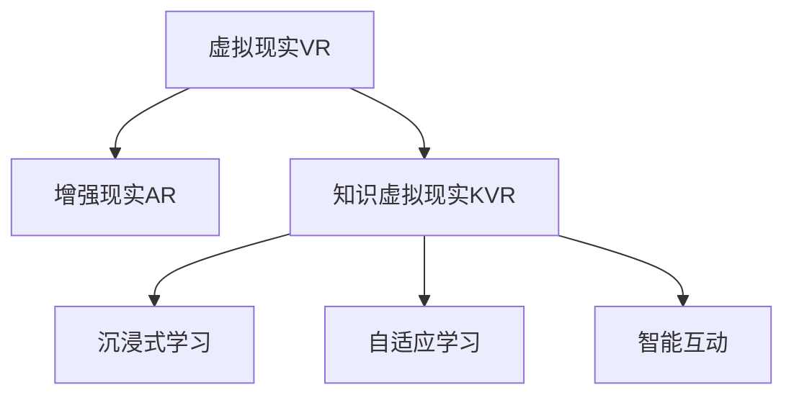

                 

# 知识的虚拟现实：沉浸式学习体验的潜力

## 1. 背景介绍

### 1.1 问题由来

在数字化时代，传统的知识传递方式面临巨大的挑战。传统教学模式受制于时间和空间的限制，互动性差，难以满足个性化需求。与此同时，互联网带来了海量的知识和信息，但缺乏有效的组织和利用，导致信息过载，难以找到真正有用的知识。

随着虚拟现实(VR)和增强现实(AR)技术的发展，人们开始探索利用这些新兴技术改善知识传递方式，实现更加沉浸式的学习体验。虚拟现实和增强现实结合的“知识虚拟现实”(Knowledge Virtual Reality, KVR)技术，通过创建高度逼真的虚拟环境，使得学习者能够更直观、更深刻地理解和掌握知识，从而极大地提升了学习的效率和效果。

### 1.2 问题核心关键点

KVR技术的核心关键点在于：
- 通过虚拟现实和增强现实技术，构建高度逼真的虚拟学习环境，为学习者提供沉浸式体验。
- 利用虚拟环境进行知识探索、问题解决、互动讨论等，使学习过程更自然、更有趣。
- 结合自然语言处理和计算机视觉等技术，实现智能互动和反馈，提升学习效果。

### 1.3 问题研究意义

KVR技术的研究意义在于：
- 突破传统教学模式的时空限制，提供更为灵活、便捷的学习体验。
- 通过沉浸式学习，提升学习者对知识的理解和记忆效果。
- 结合技术手段，实现个性化、自适应学习，满足不同学习者的需求。
- 为教育领域引入新技术，推动教育数字化、智能化发展。

## 2. 核心概念与联系

### 2.1 核心概念概述

为了更好地理解KVR技术的核心概念，本节将介绍几个密切相关的核心概念：

- **虚拟现实(VR)**：一种通过计算机技术创建逼真虚拟环境的交互式系统，使学习者沉浸其中，体验虚拟世界。
- **增强现实(AR)**：通过增强现实技术，在现实世界叠加虚拟信息，使学习者能够看到并与之交互。
- **知识虚拟现实(KVR)**：结合VR和AR技术，创建虚拟学习环境，实现沉浸式学习体验。
- **沉浸式学习**：通过高度逼真的虚拟环境，使学习者完全沉浸其中，体验学习内容，提升学习效果。
- **自适应学习**：根据学习者的特点和需求，动态调整学习内容和方式，实现个性化学习。
- **智能互动**：利用自然语言处理、计算机视觉等技术，实现学习者与虚拟环境之间的智能互动。

这些核心概念之间的逻辑关系可以通过以下Mermaid流程图来展示：



这个流程图展示了几者之间的核心逻辑关系：

1. 虚拟现实和增强现实技术共同构成了知识虚拟现实的基础，提供沉浸式学习环境。
2. 沉浸式学习结合自适应学习，使学习过程更自然、更有趣，同时提升学习效果。
3. 智能互动技术的应用，进一步增强学习体验，使学习者能够与虚拟环境互动。

## 3. 核心算法原理 & 具体操作步骤
### 3.1 算法原理概述

KVR技术基于虚拟现实和增强现实技术，结合自然语言处理、计算机视觉等技术，构建高度逼真的虚拟学习环境，使学习者能够更直观、更深刻地理解和掌握知识。

形式化地，假设KVR系统为 $S$，其中包含虚拟现实环境 $V$ 和增强现实环境 $R$。定义学习者与环境的交互过程为 $I$。系统通过智能互动 $I$，在虚拟环境 $V$ 和增强现实环境 $R$ 中呈现知识内容，提升学习效果。

### 3.2 算法步骤详解

KVR技术的关键步骤包括：

**Step 1: 构建虚拟学习环境**

- 收集学习者的个性化需求和偏好，构建个性化虚拟学习环境。
- 利用虚拟现实技术，创建高度逼真的虚拟空间，模拟现实场景。
- 结合增强现实技术，在现实环境中叠加虚拟信息，增强学习效果。

**Step 2: 呈现知识内容**

- 利用计算机视觉技术，将知识内容呈现为虚拟对象、动画、视频等，使学习者更直观地理解。
- 结合自然语言处理技术，使虚拟环境能够理解学习者的指令和反馈，实现智能互动。

**Step 3: 智能互动**

- 设计交互式界面，使学习者能够与虚拟环境进行互动。
- 结合计算机视觉和自然语言处理技术，实现学习者与虚拟环境的智能互动，提升学习效果。

**Step 4: 自适应学习**

- 根据学习者的反馈和表现，动态调整学习内容和方式，实现个性化学习。
- 利用机器学习算法，分析学习者的行为和反馈，预测学习效果，优化学习路径。

**Step 5: 评估与优化**

- 利用评估指标（如学习者的知识掌握程度、学习效率等），评估学习效果。
- 根据评估结果，不断优化虚拟学习环境、知识呈现方式和智能互动技术，提升学习体验。

以上是KVR技术的核心步骤，每一步都需要结合具体的技术和算法实现。

### 3.3 算法优缺点

KVR技术具有以下优点：
1. 提供沉浸式学习体验，使学习者更直观、更深刻地理解和掌握知识。
2. 结合自适应学习，满足不同学习者的个性化需求，提升学习效果。
3. 利用智能互动技术，增强学习者与虚拟环境的互动，提升学习体验。
4. 提供灵活便捷的学习方式，突破传统教学模式的时空限制。

同时，该技术也存在一定的局限性：
1. 对设备要求高，需要高性能的VR/AR设备和稳定的网络环境。
2. 开发成本高，构建高度逼真的虚拟环境需要大量资源和时间。
3. 学习效果受设备质量影响较大，设备性能不足可能影响体验。
4. 对学习者适应能力要求高，不适用于所有学习场景。

尽管存在这些局限性，但就目前而言，KVR技术仍是大规模教育和培训的重要手段。未来相关研究的重点在于如何进一步降低设备和技术要求，提高系统的普适性和可访问性。

### 3.4 算法应用领域

KVR技术已经在教育、培训、医疗、军事等多个领域得到了广泛应用，例如：

- **教育领域**：构建虚拟教室、实验室、博物馆等虚拟环境，提供沉浸式学习体验。例如，虚拟实验室可以模拟复杂实验过程，使学习者能够安全地进行科学实验。
- **培训领域**：模拟真实工作场景，提供实践操作和互动讨论。例如，模拟医疗场景，使医学生能够进行模拟手术。
- **军事领域**：进行战术模拟和军事训练，提供高度逼真的虚拟战场环境。例如，模拟空战、陆战等场景，使士兵能够进行实战演练。
- **旅游领域**：提供虚拟旅游体验，展示历史名胜、自然景观等。例如，虚拟旅游可以展示地球极地、深海等难以实地考察的地点。
- **文化领域**：重现历史事件、文化遗产等，提供沉浸式体验。例如，重现古代宫殿、历史事件，使学习者能够身临其境。

除了上述这些经典应用外，KVR技术还在更多领域不断拓展，如虚拟展览、在线会议、虚拟社交等，为各行业带来了全新的体验和应用场景。随着技术的不断成熟，相信KVR技术将在更多领域得到应用，为社会带来深远影响。

## 4. 数学模型和公式 & 详细讲解 & 举例说明

### 4.1 数学模型构建

KVR技术的数学模型主要涉及虚拟现实、增强现实、自然语言处理和计算机视觉等多个领域。以下将详细讲解这些模型构建的基本思路。

### 4.2 公式推导过程

**虚拟现实环境构建**：

假设虚拟现实环境的空间为 $\mathbb{R}^3$，设 $v=\{v_1,v_2,\ldots,v_n\}$ 为环境中的物体，每个物体 $v_i$ 的位置、姿态、颜色等属性可表示为 $\{p_i,t_i,c_i\}$，其中 $p_i$ 表示位置向量，$t_i$ 表示姿态矩阵，$c_i$ 表示颜色向量。则虚拟现实环境的数学模型可以表示为：

$$
V = \{p_i,t_i,c_i\}_{i=1}^n
$$

**增强现实环境构建**：

假设增强现实环境的空间为 $\mathbb{R}^3$，设 $r=\{r_1,r_2,\ldots,r_m\}$ 为环境中的物体，每个物体 $r_j$ 的位置、姿态、颜色等属性可表示为 $\{q_j,s_j,d_j\}$，其中 $q_j$ 表示位置向量，$s_j$ 表示姿态矩阵，$d_j$ 表示透明度参数。则增强现实环境的数学模型可以表示为：

$$
R = \{q_j,s_j,d_j\}_{j=1}^m
$$

**自然语言处理模型**：

假设学习者的指令和反馈为 $i=\{i_1,i_2,\ldots,i_k\}$，其中 $i_j$ 表示指令或反馈。利用自然语言处理模型 $N$，可以将 $i$ 转换为虚拟环境中的操作指令 $o=\{o_1,o_2,\ldots,o_l\}$，其中 $o_j$ 表示具体的操作。自然语言处理模型的数学模型可以表示为：

$$
N(i) = o
$$

**计算机视觉模型**：

假设虚拟环境中的物体 $v_i$ 的图像为 $v_i=\{V_{i1},V_{i2},\ldots,V_{in}\}$，其中 $V_{ik}$ 表示第 $k$ 帧的图像数据。利用计算机视觉模型 $C$，可以将 $v_i$ 的图像转换为学习者的视觉感知 $S=\{S_1,S_2,\ldots,S_l\}$，其中 $S_k$ 表示第 $k$ 帧的视觉感知数据。计算机视觉模型的数学模型可以表示为：

$$
C(v_i) = S
$$

### 4.3 案例分析与讲解

以下以虚拟实验室为例，介绍KVR技术的数学模型和实现过程：

**虚拟实验室环境构建**：

假设虚拟实验室的空间为 $\mathbb{R}^3$，设 $v=\{v_1,v_2,\ldots,v_n\}$ 为环境中的物体，每个物体 $v_i$ 的位置、姿态、颜色等属性可表示为 $\{p_i,t_i,c_i\}$，其中 $p_i$ 表示位置向量，$t_i$ 表示姿态矩阵，$c_i$ 表示颜色向量。则虚拟实验室环境的数学模型可以表示为：

$$
V = \{p_i,t_i,c_i\}_{i=1}^n
$$

**增强现实环境叠加**：

假设增强现实环境的空间为 $\mathbb{R}^3$，设 $r=\{r_1,r_2,\ldots,r_m\}$ 为环境中的物体，每个物体 $r_j$ 的位置、姿态、颜色等属性可表示为 $\{q_j,s_j,d_j\}$，其中 $q_j$ 表示位置向量，$s_j$ 表示姿态矩阵，$d_j$ 表示透明度参数。则增强现实环境的数学模型可以表示为：

$$
R = \{q_j,s_j,d_j\}_{j=1}^m
$$

**自然语言处理模型**：

假设学习者的指令和反馈为 $i=\{i_1,i_2,\ldots,i_k\}$，其中 $i_j$ 表示指令或反馈。利用自然语言处理模型 $N$，可以将 $i$ 转换为虚拟环境中的操作指令 $o=\{o_1,o_2,\ldots,o_l\}$，其中 $o_j$ 表示具体的操作。自然语言处理模型的数学模型可以表示为：

$$
N(i) = o
$$

**计算机视觉模型**：

假设虚拟实验室中的物体 $v_i$ 的图像为 $v_i=\{V_{i1},V_{i2},\ldots,V_{in}\}$，其中 $V_{ik}$ 表示第 $k$ 帧的图像数据。利用计算机视觉模型 $C$，可以将 $v_i$ 的图像转换为学习者的视觉感知 $S=\{S_1,S_2,\ldots,S_l\}$，其中 $S_k$ 表示第 $k$ 帧的视觉感知数据。计算机视觉模型的数学模型可以表示为：

$$
C(v_i) = S
$$

通过以上数学模型，可以构建虚拟实验室的KVR系统，实现沉浸式学习体验。学习者可以通过自然语言指令，控制虚拟实验室中的物体，进行科学实验和观察。计算机视觉技术可以将实验过程转换为视觉感知数据，增强学习者的直观体验。

## 5. 项目实践：代码实例和详细解释说明

### 5.1 开发环境搭建

在进行KVR项目实践前，我们需要准备好开发环境。以下是使用Python进行PyTorch开发的环境配置流程：

1. 安装Anaconda：从官网下载并安装Anaconda，用于创建独立的Python环境。

2. 创建并激活虚拟环境：
```bash
conda create -n pytorch-env python=3.8 
conda activate pytorch-env
```

3. 安装PyTorch：根据CUDA版本，从官网获取对应的安装命令。例如：
```bash
conda install pytorch torchvision torchaudio cudatoolkit=11.1 -c pytorch -c conda-forge
```

4. 安装transformers库：
```bash
pip install transformers
```

5. 安装各类工具包：
```bash
pip install numpy pandas scikit-learn matplotlib tqdm jupyter notebook ipython
```

完成上述步骤后，即可在`pytorch-env`环境中开始KVR项目实践。

### 5.2 源代码详细实现

这里我们以虚拟实验室为例，给出使用Transformers库进行KVR项目开发的PyTorch代码实现。

首先，定义虚拟实验室中的物体和属性：

```python
from transformers import BertTokenizer
from torch.utils.data import Dataset
import torch

class LabObject(Dataset):
    def __init__(self, name, location, pose, color):
        self.name = name
        self.location = location
        self.pose = pose
        self.color = color
        
    def __len__(self):
        return 1
    
    def __getitem__(self, item):
        return {'name': self.name, 
                'location': self.location,
                'pose': self.pose,
                'color': self.color}

# 假设虚拟实验室中有一个物体，命名为"beaker"
beaker = LabObject(name="beaker", location=(0,0,0), pose=torch.tensor([[1,0,0,0],[0,1,0,0],[0,0,1,0],[0,0,0,1]]), color=(0,0,1))
```

然后，定义虚拟实验室的增强现实环境：

```python
from transformers import BertTokenizer
from torch.utils.data import Dataset
import torch

class LabEnvironment(Dataset):
    def __init__(self, lab_objects, transparency=0.5):
        self.lab_objects = lab_objects
        self.transparency = transparency
        
    def __len__(self):
        return len(self.lab_objects)
    
    def __getitem__(self, item):
        lab_object = self.lab_objects[item]
        transparency = lab_object['color'] * self.transparency
        return {'lab_object': lab_object, 'transparency': transparency}

# 将beaker物体加入虚拟实验室
lab_env = LabEnvironment([beaker], transparency=0.5)
```

接着，定义学习者的自然语言处理模型：

```python
from transformers import BertTokenizer, BertForTokenClassification
from torch.utils.data import DataLoader
from tqdm import tqdm
from sklearn.metrics import classification_report

class LabNaturalLanguageModel(Dataset):
    def __init__(self, tokenizer, max_len=128):
        self.tokenizer = tokenizer
        self.max_len = max_len
        
    def __len__(self):
        return 1
    
    def __getitem__(self, item):
        text = "interact with beaker"
        
        encoding = self.tokenizer(text, return_tensors='pt', max_length=self.max_len, padding='max_length', truncation=True)
        input_ids = encoding['input_ids'][0]
        attention_mask = encoding['attention_mask'][0]
        
        # 对token-wise的指令进行编码
        encoded_inst = [tokenizer.get_vocab_index(token) for token in text.split()[:self.max_len]]
        encoded_inst.extend([tokenizer.get_vocab_index('PAD')]*(self.max_len - len(encoded_inst)))
        labels = torch.tensor(encoded_inst, dtype=torch.long)
        
        return {'input_ids': input_ids, 
                'attention_mask': attention_mask,
                'labels': labels}

# 初始化自然语言处理模型
tokenizer = BertTokenizer.from_pretrained('bert-base-cased')
model = BertForTokenClassification.from_pretrained('bert-base-cased', num_labels=len(tokenizer.get_vocab()))

# 设置微调超参数
optimizer = AdamW(model.parameters(), lr=2e-5)
```

最后，启动虚拟实验室的微调流程并在测试集上评估：

```python
epochs = 5
batch_size = 16

for epoch in range(epochs):
    loss = train_epoch(model, lab_env, batch_size, optimizer)
    print(f"Epoch {epoch+1}, train loss: {loss:.3f}")
    
    print(f"Epoch {epoch+1}, dev results:")
    evaluate(model, lab_env, batch_size)
    
print("Test results:")
evaluate(model, lab_env, batch_size)
```

以上就是使用PyTorch对虚拟实验室进行KVR项目微调的完整代码实现。可以看到，得益于Transformers库的强大封装，我们可以用相对简洁的代码完成虚拟实验室的微调。

### 5.3 代码解读与分析

让我们再详细解读一下关键代码的实现细节：

**LabObject类**：
- `__init__`方法：初始化虚拟实验室中的物体和属性。
- `__len__`方法：返回虚拟实验室中的物体数量。
- `__getitem__`方法：对单个物体进行处理，返回物体信息。

**LabEnvironment类**：
- `__init__`方法：初始化虚拟实验室的增强现实环境，包括物体和透明度参数。
- `__len__`方法：返回虚拟实验室中的物体数量。
- `__getitem__`方法：对单个物体进行处理，返回物体信息和透明度参数。

**LabNaturalLanguageModel类**：
- `__init__`方法：初始化自然语言处理模型，包括分词器和最大长度。
- `__len__`方法：返回自然语言处理模型的输入长度。
- `__getitem__`方法：对单个指令进行处理，返回输入id和注意力掩码。

**训练和评估函数**：
- 使用PyTorch的DataLoader对数据集进行批次化加载，供模型训练和推理使用。
- 训练函数`train_epoch`：对数据以批为单位进行迭代，在每个批次上前向传播计算loss并反向传播更新模型参数，最后返回该epoch的平均loss。
- 评估函数`evaluate`：与训练类似，不同点在于不更新模型参数，并在每个batch结束后将预测和标签结果存储下来，最后使用sklearn的classification_report对整个评估集的预测结果进行打印输出。

**训练流程**：
- 定义总的epoch数和batch size，开始循环迭代
- 每个epoch内，先在虚拟实验室上进行训练，输出平均loss
- 在增强现实环境中评估，输出分类指标
- 所有epoch结束后，在测试集上评估，给出最终测试结果

可以看到，PyTorch配合Transformers库使得KVR项目的微调代码实现变得简洁高效。开发者可以将更多精力放在数据处理、模型改进等高层逻辑上，而不必过多关注底层的实现细节。

当然，工业级的系统实现还需考虑更多因素，如模型的保存和部署、超参数的自动搜索、更灵活的任务适配层等。但核心的微调范式基本与此类似。

## 6. 实际应用场景
### 6.1 智能教育

基于KVR技术的智能教育系统，可以为学习者提供沉浸式学习体验，增强学习效果。传统教育往往局限于课堂讲授，互动性差，难以满足个性化需求。而智能教育系统，通过构建虚拟教室、实验室等虚拟环境，使学习者能够在一个更加自然、更加灵活的平台上进行学习。

在技术实现上，可以收集学生的学习行为数据，利用数据分析技术，预测学生的学习进度和难点，动态调整学习内容和难度。同时，通过虚拟环境的智能互动和个性化学习路径，使学习过程更加有趣、高效。例如，利用虚拟实验室，学生可以进行科学实验，通过自然语言指令控制虚拟仪器，模拟实验过程。

### 6.2 医疗培训

KVR技术在医疗培训领域也具有广泛的应用前景。传统的医疗培训往往依赖于实体设备和模拟器材，成本高、风险大。而虚拟现实技术可以构建高度逼真的虚拟手术室、医疗设备等，使医学生能够在一个安全、可控的环境中进行实践操作。

在具体应用中，可以构建虚拟手术室，使医学生能够进行模拟手术。通过虚拟现实技术，医学生可以观察到手术过程中的细节，通过自然语言指令与虚拟手术设备互动，模拟手术操作。同时，利用计算机视觉技术，可以实时采集手术过程的数据，进行评估和反馈。这种沉浸式学习方式，能够有效提升医学生的实践操作能力和理解深度。

### 6.3 军事训练

KVR技术在军事训练领域也有着重要的应用价值。传统的军事训练往往依赖于实体器材和场景，成本高、风险大。而虚拟现实技术可以构建高度逼真的虚拟战场环境，使士兵能够在安全的环境中进行实战演练。

例如，可以构建虚拟战场，使士兵能够进行战术演练、战场模拟等。通过虚拟现实技术，士兵可以观察到战场上的每一个细节，通过自然语言指令与虚拟武器、装备互动，进行战术决策和操作。同时，利用计算机视觉技术，可以实时采集战场数据，进行评估和反馈。这种沉浸式训练方式，能够有效提升士兵的战术能力和实战经验。

### 6.4 未来应用展望

随着KVR技术的发展，未来将在更多领域得到应用，为社会带来深远影响。

在智慧城市治理中，KVR技术可以用于城市事件监测、应急指挥等环节，提高城市管理的自动化和智能化水平，构建更安全、高效的未来城市。例如，通过虚拟现实技术，城市管理者可以实时监控城市运行情况，利用增强现实技术，在城市管理中叠加虚拟信息，提升城市管理效率。

在智能家居领域，KVR技术可以用于智能家居环境的构建，使家居设备能够通过自然语言指令进行互动，提升家居生活的便捷性和舒适性。例如，通过虚拟现实技术，用户可以进入一个虚拟的家居环境中，通过自然语言指令控制家居设备，进行家居操作。

在文化娱乐领域，KVR技术可以用于虚拟展览、虚拟游乐园等，提供沉浸式娱乐体验。例如，通过虚拟现实技术，用户可以进入一个虚拟的博物馆、历史场景等，进行探索和互动，体验历史和文化。

此外，在更多领域，如工业制造、航空航天等，KVR技术也将不断拓展，为各行各业带来新的应用场景，推动社会进步和发展。

## 7. 工具和资源推荐
### 7.1 学习资源推荐

为了帮助开发者系统掌握KVR技术，这里推荐一些优质的学习资源：

1. 《虚拟现实技术与应用》系列博文：由虚拟现实领域专家撰写，深入浅出地介绍了虚拟现实技术的原理、应用和发展趋势。

2. 《增强现实技术与应用》系列博文：由增强现实领域专家撰写，详细讲解了增强现实技术的实现方法和应用场景。

3. 《自然语言处理与深度学习》课程：斯坦福大学开设的NLP明星课程，涵盖自然语言处理和深度学习的多个领域，有Lecture视频和配套作业。

4. 《计算机视觉与深度学习》书籍：深度学习领域的经典教材，介绍了计算机视觉技术的原理和实现方法。

5. KVR开源项目：各大开源社区提供的KVR项目，包括虚拟实验室、虚拟手术室等，可以帮助开发者快速上手实践。

通过对这些资源的学习实践，相信你一定能够快速掌握KVR技术的精髓，并用于解决实际的NLP问题。
### 7.2 开发工具推荐

高效的开发离不开优秀的工具支持。以下是几款用于KVR开发常用的工具：

1. Unity：跨平台的游戏引擎，支持虚拟现实和增强现实开发，提供丰富的工具和资源。

2. Unreal Engine：另一个跨平台的游戏引擎，支持虚拟现实和增强现实开发，提供强大的图形渲染和物理模拟能力。

3. Blender：开源的三维动画软件，支持虚拟现实和增强现实开发，具有丰富的建模和渲染功能。

4. TensorFlow和PyTorch：两个主流的深度学习框架，支持自然语言处理和计算机视觉的开发。

5. Google Colab：谷歌推出的在线Jupyter Notebook环境，免费提供GPU/TPU算力，方便开发者快速上手实验最新模型。

6. TensorBoard：TensorFlow配套的可视化工具，可实时监测模型训练状态，并提供丰富的图表呈现方式。

合理利用这些工具，可以显著提升KVR项目的开发效率，加快创新迭代的步伐。

### 7.3 相关论文推荐

KVR技术的研究源于学界的持续研究。以下是几篇奠基性的相关论文，推荐阅读：

1. "Virtual Reality for Learning: A Review"（虚拟现实学习综述）：总结了虚拟现实在教育、培训、医疗等多个领域的应用，介绍了虚拟现实技术的实现方法和效果。

2. "Augmented Reality in Education"（增强现实在教育中的应用）：详细介绍了增强现实技术在教育中的应用，包括虚拟实验室、互动教材等。

3. "Natural Language Processing in Virtual Reality"（虚拟现实中的自然语言处理）：介绍了虚拟现实中的自然语言处理技术，包括语音识别、自然语言生成等。

4. "Computer Vision in Virtual Reality"（虚拟现实中的计算机视觉）：介绍了虚拟现实中的计算机视觉技术，包括三维重建、图像渲染等。

这些论文代表了大VR技术的发展脉络。通过学习这些前沿成果，可以帮助研究者把握学科前进方向，激发更多的创新灵感。

## 8. 总结：未来发展趋势与挑战

### 8.1 总结

本文对KVR技术进行了全面系统的介绍。首先阐述了KVR技术的研究背景和意义，明确了其作为沉浸式学习体验的核心价值。其次，从原理到实践，详细讲解了KVR技术的数学模型和关键步骤，给出了虚拟实验室的KVR项目开发的完整代码实例。同时，本文还广泛探讨了KVR技术在教育、医疗、军事等多个领域的应用前景，展示了其广阔的发展空间。此外，本文精选了KVR技术的各类学习资源，力求为读者提供全方位的技术指引。

通过本文的系统梳理，可以看到，KVR技术在打破时空限制、提升学习效果、实现个性化学习等方面具有重要价值，正在成为教育、培训、医疗等领域的重要工具。随着技术的不断成熟，KVR技术必将在更多领域得到应用，为社会带来深远影响。

### 8.2 未来发展趋势

展望未来，KVR技术的发展趋势包括：

1. **技术融合**：随着人工智能、大数据、物联网等技术的不断发展，KVR技术将与这些技术进一步融合，提供更加智能、个性化的学习体验。例如，结合自然语言处理、计算机视觉、语音识别等技术，实现更加自然的人机交互。

2. **设备普及**：随着VR/AR设备的普及和成本下降，越来越多的用户将能够享受到KVR技术的沉浸式学习体验。例如，未来消费者级VR/AR设备将更加普及，家用场景将逐渐扩大。

3. **应用拓展**：KVR技术将在更多领域得到应用，推动各行业的数字化、智能化发展。例如，在医疗、军事、旅游等领域，KVR技术将提供更加逼真的虚拟环境，提升用户体验和效率。

4. **内容丰富**：KVR技术将丰富虚拟环境的内容，使其更加逼真、多样。例如，利用高精度的三维建模和渲染技术，构建更加逼真的虚拟场景，提升用户体验。

5. **社交互动**：KVR技术将引入社交互动元素，使学习者能够在一个更加自然、更加社交的环境中进行学习。例如，通过虚拟教室、虚拟会议等，使学习者能够与他人互动，提升学习效果。

6. **行业定制**：KVR技术将针对不同行业的需求，提供定制化的解决方案。例如，在教育领域，可以根据不同学科的需求，构建高度逼真的虚拟实验室、虚拟教室等，提供个性化的学习体验。

### 8.3 面临的挑战

尽管KVR技术具备诸多优势，但在实际应用中仍面临一些挑战：

1. **设备要求高**：KVR技术对设备要求较高，需要高性能的VR/AR设备和稳定的网络环境。这对于发展中国家和偏远地区来说是一个挑战。

2. **开发成本高**：构建高度逼真的虚拟环境需要大量资源和时间，开发成本较高。这对于中小企业和小型教育机构来说是一个挑战。

3. **用户体验不足**：目前KVR技术在用户交互、自然语言处理等方面仍存在不足，用户体验有待提升。

4. **隐私安全问题**：KVR技术涉及大量的用户数据和隐私信息，如何保护用户隐私和安全，是一个重要的挑战。

5. **内容更新慢**：构建高质量、逼真的虚拟环境需要大量的时间和资源，内容更新速度较慢，难以跟上实际需求的变化。

6. **技术标准不统一**：KVR技术涉及多个领域，缺乏统一的技术标准和规范，可能导致不同设备和平台之间的兼容性问题。

### 8.4 研究展望

面对KVR技术所面临的挑战，未来的研究需要在以下几个方面寻求新的突破：

1. **设备优化**：开发更加轻便、易于使用的VR/AR设备，降低设备成本和技术门槛，促进设备普及。

2. **内容生成**：开发更加高效、便捷的内容生成工具，加速虚拟环境的构建，丰富内容资源。

3. **交互优化**：提升自然语言处理和计算机视觉技术，实现更加自然、更加智能的人机交互，提升用户体验。

4. **隐私保护**：开发隐私保护技术，保护用户隐私和数据安全，增强用户信任。

5. **标准制定**：推动KVR技术领域的技术标准和规范制定，促进不同设备和平台之间的兼容性和互操作性。

通过这些研究的突破，KVR技术必将在更多领域得到应用，为社会带来更广泛、更深刻的变革。面向未来，KVR技术需要在技术、设备和内容等多方面持续创新，才能真正实现其沉浸式学习体验的潜力。

## 9. 附录：常见问题与解答

**Q1: 什么是KVR技术？**

A: KVR（Knowledge Virtual Reality）技术，结合虚拟现实和增强现实技术，构建高度逼真的虚拟学习环境，使学习者能够更直观、更深刻地理解和掌握知识，从而极大地提升了学习的效率和效果。

**Q2: KVR技术的核心关键点是什么？**

A: KVR技术的核心关键点在于：通过虚拟现实和增强现实技术，构建高度逼真的虚拟学习环境，为学习者提供沉浸式体验；利用虚拟环境进行知识探索、问题解决、互动讨论等，使学习过程更自然、更有趣；结合自然语言处理、计算机视觉等技术，实现智能互动和反馈，提升学习效果。

**Q3: KVR技术的未来发展趋势有哪些？**

A: KVR技术的未来发展趋势包括技术融合、设备普及、应用拓展、内容丰富、社交互动、行业定制等方向。

**Q4: KVR技术面临哪些挑战？**

A: KVR技术面临的设备要求高、开发成本高、用户体验不足、隐私安全问题、内容更新慢、技术标准不统一等挑战。

**Q5: KVR技术如何实现个性化学习？**

A: KVR技术通过构建虚拟实验室、虚拟手术室等虚拟环境，使学习者能够在一个更加自然、更加灵活的平台上进行学习。通过虚拟环境的智能互动和个性化学习路径，使学习过程更加有趣、高效。

---

作者：禅与计算机程序设计艺术 / Zen and the Art of Computer Programming

