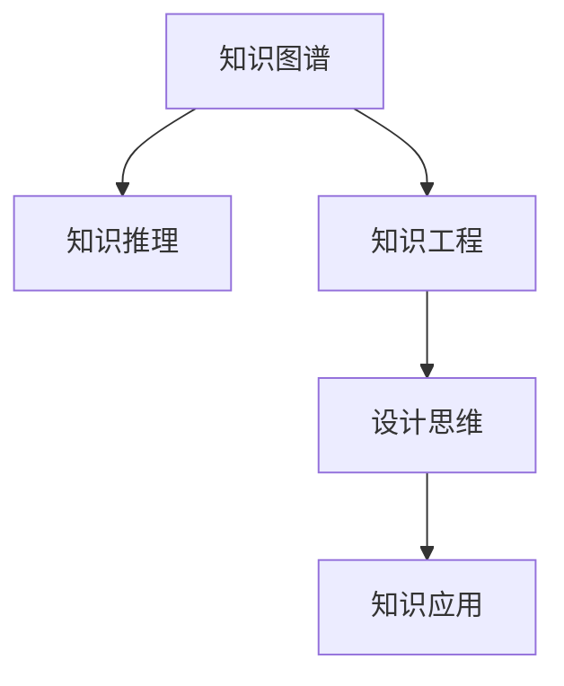

                 

# 知识的设计思维：以人为本的问题解决

> 关键词：设计思维,知识图谱,知识工程,人工智能,问题解决

## 1. 背景介绍

### 1.1 问题由来
在当今信息爆炸的时代，人类面对的信息量呈指数级增长，这既是挑战也是机遇。如何在海量的信息中快速、准确地获取知识，并应用于实际问题的解决，成为摆在面前的重要课题。传统的知识管理方式主要依赖专家知识和经验，但这种方式的局限性在于：成本高、效率低，且难以覆盖到所有的知识和应用场景。

近年来，随着人工智能（AI）技术的迅猛发展，特别是知识图谱和知识工程的兴起，为解决这一问题提供了新的思路。知识图谱作为知识表示的高级形式，将知识以图的形式进行存储和组织，使得知识检索、推理和应用变得更加高效和智能。而知识工程则将知识图谱与各种AI技术结合，构建出能够自动获取、推理和应用知识的应用系统，从而实现对知识的高效管理和应用。

## 2. 核心概念与联系

### 2.1 核心概念概述

为了更好地理解知识图谱和知识工程，本节将介绍几个关键概念及其相互联系：

- **知识图谱**：一种结构化的知识表示方法，将知识以节点和边（实体和关系）的形式存储在图形结构中，使得知识可以被高效地检索、推理和应用。

- **知识工程**：将知识图谱与人工智能技术结合，构建出能够自动获取、推理和应用知识的应用系统。知识工程的目标是通过机器学习和自然语言处理等技术，将海量文本数据转换为结构化的知识，并构建出可应用的系统框架。

- **设计思维**：一种以人为本的创新方法论，强调在解决问题的过程中，要深入理解用户需求，通过多次迭代和验证，构建出满足用户需求的产品或解决方案。

- **知识图谱构建**：通过爬虫、数据清洗和实体识别等技术手段，将文本数据转换为知识图谱中的实体和关系。

- **知识推理**：利用规则和逻辑推理等技术，对知识图谱中的信息进行推理，得到新的知识或解答。

- **知识应用**：将知识图谱中的知识应用于实际问题，如问答系统、推荐系统、智能客服等。

这些概念之间的联系可以通过以下Mermaid流程图来展示：



这个流程图展示的知识图谱和知识工程的基本流程：

1. 知识图谱构建：通过爬虫和实体识别等技术，将文本数据转换为知识图谱中的实体和关系。
2. 知识推理：利用规则和逻辑推理等技术，对知识图谱中的信息进行推理，得到新的知识或解答。
3. 知识工程：将知识图谱与人工智能技术结合，构建出能够自动获取、推理和应用知识的应用系统。
4. 设计思维：以人为本，通过多次迭代和验证，构建出满足用户需求的产品或解决方案。
5. 知识应用：将知识图谱中的知识应用于实际问题，如问答系统、推荐系统、智能客服等。

这些概念共同构成了知识图谱和知识工程的基础框架，使得知识的获取、推理和应用变得更加高效和智能。通过理解这些核心概念，我们可以更好地把握知识图谱和知识工程的工作原理和优化方向。

## 3. 核心算法原理 & 具体操作步骤

### 3.1 算法原理概述

知识图谱和知识工程的算法原理，主要围绕知识表示、知识获取和知识应用三个方面展开：

1. **知识表示**：将知识以图形结构的形式进行表示，包括节点和边的构建。节点表示实体，边表示实体之间的关系。常见的知识表示方法有RDF（资源描述框架）、OWL（Web本体语言）等。

2. **知识获取**：从文本数据中自动提取实体和关系，构建知识图谱。主要包含文本预处理、实体识别、关系抽取等技术。

3. **知识应用**：将知识图谱中的知识应用于实际问题，如问答、推荐、智能客服等。主要包含推理和应用逻辑的构建。

### 3.2 算法步骤详解

知识图谱和知识工程的构建一般包括以下几个关键步骤：

**Step 1: 准备数据**
- 收集相关领域的文本数据，如网页、论文、新闻等。
- 清洗数据，去除噪音和重复数据。

**Step 2: 实体识别和关系抽取**
- 使用命名实体识别（NER）和关系抽取（RE）等技术，从文本中识别出实体和关系。
- 实体识别：如人名、地名、组织名等。
- 关系抽取：如“创建者”、“所属”、“发表时间”等。

**Step 3: 构建知识图谱**
- 将识别出的实体和关系存储在图形结构中，构建知识图谱。
- 节点表示实体，边表示实体之间的关系。

**Step 4: 知识推理**
- 利用规则和逻辑推理等技术，对知识图谱中的信息进行推理，得到新的知识或解答。
- 常见的推理方法有基于逻辑的推理、基于统计的推理等。

**Step 5: 应用构建**
- 根据实际问题的需求，构建知识应用的逻辑模型。
- 如问答系统、推荐系统、智能客服等。

**Step 6: 测试和优化**
- 在实际应用场景中测试系统性能，收集反馈。
- 根据反馈进行系统优化和迭代。

以上是知识图谱和知识工程的基本流程。在实际应用中，还需要针对具体任务的特点，对构建过程的各个环节进行优化设计，如改进实体识别算法、引入更多先验知识等，以进一步提升系统性能。

### 3.3 算法优缺点

知识图谱和知识工程的方法具有以下优点：
1. 知识获取自动化。利用机器学习和自然语言处理等技术，自动从文本数据中提取实体和关系，减少了手动工作量。
2. 知识表示结构化。知识以图形结构的形式表示，使得知识的检索、推理和应用变得更加高效和智能。
3. 应用广泛。知识图谱和知识工程可以应用于问答、推荐、智能客服等多个领域，提高了知识的应用范围和价值。

同时，该方法也存在一定的局限性：
1. 数据依赖性强。知识图谱的构建需要大量高质量的标注数据，数据获取成本较高。
2. 知识更新困难。知识图谱中的知识需要定期更新，以保证其时效性和准确性，更新过程较为复杂。
3. 推理精度不足。知识推理的精度依赖于推理算法的复杂度和规则库的完备性，精度提升空间有限。
4. 可扩展性不足。知识图谱的构建和应用需要大量的计算资源和存储空间，扩展性较差。

尽管存在这些局限性，但知识图谱和知识工程方法在处理大规模、结构化数据时，仍然具备强大的优势，特别是在知识获取和应用方面，显示出不可替代的价值。未来相关研究的重点在于如何进一步降低知识图谱的构建成本，提高知识推理的精度和扩展性，同时兼顾知识的应用范围和时效性等因素。

### 3.4 算法应用领域

知识图谱和知识工程的应用领域非常广泛，以下是几个典型的应用场景：

- **问答系统**：通过知识图谱中的知识进行推理，自动回答用户问题。如IBM的Watson。
- **推荐系统**：将用户的行为与知识图谱中的知识进行关联，推荐符合用户兴趣的商品或内容。如Amazon的推荐系统。
- **智能客服**：利用知识图谱中的知识，自动解答用户咨询，提升客服效率和质量。如阿里云的智能客服系统。
- **金融风控**：通过知识图谱中的知识进行风险评估，提高金融交易的安全性。如蚂蚁金服的风险控制系统。
- **医疗诊断**：将知识图谱中的医学知识应用于疾病诊断，提高诊断的准确性和效率。如IBM的Watson Health。
- **自动驾驶**：利用知识图谱中的地理和交通知识，进行路径规划和驾驶决策。如百度的自动驾驶系统。

除了上述这些经典应用外，知识图谱和知识工程还在更多领域得到应用，如工业制造、社交网络、环境监测等，为各行业带来了新的变革性解决方案。

## 4. 数学模型和公式 & 详细讲解  
### 4.1 数学模型构建

本节将使用数学语言对知识图谱和知识工程的基本模型进行更加严格的刻画。

记知识图谱中的节点为 $n_i$，边为 $r_{ij}$。知识推理的数学模型可以表示为：

$$
\mathcal{M} = \{ \mathcal{N}, \mathcal{R}, \mathcal{P} \}
$$

其中，$\mathcal{N}$ 表示节点集合，$\mathcal{R}$ 表示边集合，$\mathcal{P}$ 表示推理规则集合。

知识推理的过程可以表示为：

$$
\mathcal{I} = \{\mathcal{N} \rightarrow \mathcal{N}, \mathcal{R} \rightarrow \mathcal{R} \}
$$

即从节点集合 $\mathcal{N}$ 推理出新的节点集合 $\mathcal{N}'$，从边集合 $\mathcal{R}$ 推理出新的边集合 $\mathcal{R}'$。

推理规则 $\mathcal{P}$ 可以表示为：

$$
\mathcal{P} = \{\mathcal{R} \rightarrow \mathcal{R} \mid r \in \mathcal{R}\}
$$

其中，$\mathcal{R} \rightarrow \mathcal{R}$ 表示从边集合 $\mathcal{R}$ 推理出新的边集合 $\mathcal{R}'$。

### 4.2 公式推导过程

以知识图谱中的“人名-所属机构”关系为例，推导推理过程：

假设知识图谱中有两个节点 $n_1$ 和 $n_2$，分别表示人名和所属机构。已知 $n_1$ 和 $n_2$ 之间有一条“所属”关系 $r_{12}$。根据推理规则，可以推理出新的节点 $n_3$ 和边 $r_{13}$：

$$
\begin{aligned}
r_{12} \rightarrow r_{13} &= \text{if } n_1 \text{ 属于 } n_2 \\
n_2 \rightarrow n_3 &= \text{if } n_2 \text{ 是一个机构} 
\end{aligned}
$$

推理过程可以表示为：

$$
\begin{aligned}
n_1 &\rightarrow n_3 \\
r_{12} &\rightarrow r_{13}
\end{aligned}
$$

这样，便得到了新的知识图谱中的节点 $n_3$ 和边 $r_{13}$。

### 4.3 案例分析与讲解

以问答系统为例，分析知识图谱在其中的应用：

假设有一个问答系统，需要回答以下问题：

- 问：谁创立了Facebook？
- 答：马克·扎克伯格。

知识图谱中的推理过程可以表示为：

1. 查询知识图谱中的“Facebook”节点，得到对应的“创始人”关系。
2. 查询“Facebook”节点的“创始人”关系，得到对应的“马克·扎克伯格”节点。

推理过程可以表示为：

$$
\begin{aligned}
\text{查询} "Facebook" \rightarrow \text{查询} "Facebook" \text{的} "创始人" \rightarrow \text{得到} "马克·扎克伯格"
\end{aligned}
$$

这样，便得到了正确的答案。

## 5. 项目实践：代码实例和详细解释说明
### 5.1 开发环境搭建

在进行知识图谱和知识工程实践前，我们需要准备好开发环境。以下是使用Python进行PyTorch开发的环境配置流程：

1. 安装Anaconda：从官网下载并安装Anaconda，用于创建独立的Python环境。

2. 创建并激活虚拟环境：
```bash
conda create -n pytorch-env python=3.8 
conda activate pytorch-env
```

3. 安装PyTorch：根据CUDA版本，从官网获取对应的安装命令。例如：
```bash
conda install pytorch torchvision torchaudio cudatoolkit=11.1 -c pytorch -c conda-forge
```

4. 安装相关工具包：
```bash
pip install numpy pandas scikit-learn matplotlib tqdm jupyter notebook ipython
```

完成上述步骤后，即可在`pytorch-env`环境中开始知识图谱和知识工程的实践。

### 5.2 源代码详细实现

下面我们以知识图谱的构建为例，给出使用PyTorch进行知识图谱构建的PyTorch代码实现。

首先，定义知识图谱节点和边的类：

```python
class Node:
    def __init__(self, name):
        self.name = name
        self.relations = []
        
class Relation:
    def __init__(self, name, from_node, to_node):
        self.name = name
        self.from_node = from_node
        self.to_node = to_node

# 创建一个简单的知识图谱
G = {}
G['n1'] = Node('n1')
G['n2'] = Node('n2')
G['r12'] = Relation('r12', G['n1'], G['n2'])

# 构建知识图谱
G = build_knowledge_graph(G)
```

然后，定义知识图谱的构建函数：

```python
def build_knowledge_graph(G):
    # 定义实体识别函数
    def entity_recognition(text):
        # 使用命名实体识别技术，自动识别文本中的实体
        # 这里以简单的实体识别为例，实际中需使用更复杂的技术
        return ['n1', 'n2']
    
    # 定义关系抽取函数
    def relation_extraction(text):
        # 使用关系抽取技术，自动识别文本中的关系
        # 这里以简单的关系抽取为例，实际中需使用更复杂的技术
        return ['r12']
    
    # 遍历所有节点和关系，构建知识图谱
    for node_name, node in G.items():
        for relation in node.relations:
            G[relation.from_node] = Node(relation.from_node)
            G[relation.to_node] = Node(relation.to_node)
            G[relation.name] = Relation(relation.name, G[relation.from_node], G[relation.to_node])
    
    return G
```

接着，定义知识图谱的推理函数：

```python
def infer_knowledge(G, query_node):
    # 定义推理函数
    def infer(node):
        # 遍历所有关系，寻找满足条件的节点
        for relation in G[node].relations:
            if relation.from_node == query_node:
                return relation.to_node
        return None
    
    # 执行推理
    result = None
    for node_name, node in G.items():
        if node.name == query_node:
            result = infer(node)
            break
    
    return result
```

最后，启动推理流程：

```python
# 查询知识图谱中的节点
result = infer_knowledge(G, 'n1')
print(result)
```

以上就是使用PyTorch构建知识图谱和执行推理的基本代码实现。可以看到，知识图谱和知识工程的实现过程相对简单，只需要合理设计节点和关系，再结合相应的推理函数，便能构建出满足实际需求的知识图谱应用。

## 6. 实际应用场景

### 6.1 智慧医疗

知识图谱在智慧医疗领域有着广泛的应用，能够辅助医生进行诊断和治疗决策。通过构建医学领域的知识图谱，将病人的症状、病历、药物等信息进行整合，医生可以在知识图谱中进行推理，快速找到合适的诊断方案和治疗方法。

例如，一个病人出现了呼吸困难、咳嗽等症状，医生可以通过查询知识图谱中的症状和疾病关系，推断出可能的疾病类型。如果确诊为“肺炎”，医生可以通过查询知识图谱中的“肺炎”节点，得到对应的“治疗方案”和“药物”等信息，从而制定出详细的治疗计划。

### 6.2 金融风控

在金融风控领域，知识图谱能够帮助金融机构进行风险评估和信用分析。通过构建金融领域的知识图谱，将公司的财务报表、信用记录、市场环境等信息进行整合，金融机构可以在知识图谱中进行推理，快速评估客户的信用风险和投资价值。

例如，一个公司申请贷款，金融机构可以通过查询知识图谱中的“公司”节点，得到对应的“财务报表”和“信用记录”等信息，从而评估公司的财务状况和信用等级。如果公司的财务状况不佳，信用记录不良，金融机构可以拒绝贷款申请，或提出相应的风险控制措施。

### 6.3 智能客服

智能客服系统利用知识图谱进行问题解答和客户引导，能够显著提升客服效率和客户满意度。通过构建企业的知识图谱，将常见问题、服务流程、产品信息等信息进行整合，智能客服可以在知识图谱中进行推理，快速找到相应的答案或解决方案。

例如，一个客户咨询“退货流程”，智能客服可以通过查询知识图谱中的“退货”节点，得到对应的“流程”和“条件”等信息，从而提供详细的退货指南。如果客户需要退货，智能客服可以查询知识图谱中的“退货”节点，得到对应的“运费”和“退款方式”等信息，并告知客户相应的退货注意事项。

### 6.4 未来应用展望

未来，知识图谱和知识工程的应用领域将会更加广泛，以下是几个可能的应用场景：

- **智能家居**：通过构建智能家居领域的知识图谱，将家居设备的互联互通、环境控制、健康管理等信息进行整合，用户可以通过语音助手进行智能控制，实现舒适、安全的家居生活。
- **智慧城市**：通过构建智慧城市领域的知识图谱，将交通、环境、公共服务等信息进行整合，政府和市民可以通过智慧城市平台进行决策和互动，提高城市管理和民生服务水平。
- **工业制造**：通过构建工业制造领域的知识图谱，将设备、工艺、质量等信息进行整合，企业可以通过知识图谱进行生产调度、质量控制和故障诊断，提高生产效率和产品质量。
- **农业科技**：通过构建农业科技领域的知识图谱，将作物生长、病虫害防治、气候变化等信息进行整合，农业科技工作者可以通过知识图谱进行科学研究和农业生产管理，提高农作物产量和质量。

这些应用场景展示了知识图谱和知识工程在各领域的潜力和前景，相信随着技术的不断进步和应用推广，知识图谱和知识工程将为人类社会的各个领域带来深刻的变革。

## 7. 工具和资源推荐

### 7.1 学习资源推荐

为了帮助开发者系统掌握知识图谱和知识工程的理论基础和实践技巧，这里推荐一些优质的学习资源：

1. 《知识图谱：构建、存储与查询》一书：全面介绍了知识图谱的基本概念、构建方法和查询技术。
2. 《知识工程与智能系统》课程：斯坦福大学开设的课程，涵盖了知识工程的多个方面，包括知识图谱构建、推理和应用等。
3. 《知识图谱和语义网络》一书：介绍了知识图谱的基本原理和应用案例。
4. 《基于知识图谱的智能问答系统》一书：介绍了知识图谱在问答系统中的应用。
5. 《自然语言处理与知识图谱》课程：北京大学开设的课程，涵盖了自然语言处理和知识图谱的多个方面。

通过对这些资源的学习实践，相信你一定能够快速掌握知识图谱和知识工程的核心技术，并应用于实际问题解决。

### 7.2 开发工具推荐

高效的开发离不开优秀的工具支持。以下是几款用于知识图谱和知识工程开发的常用工具：

1. Apache Jena：一个开源的语义技术框架，支持知识图谱的构建、查询和推理。
2. GATE：一个自然语言处理框架，提供了丰富的实体识别、关系抽取等工具。
3. BioNLP：一个生物信息学工具库，支持生物领域的知识图谱构建和应用。
4. OntoClean：一个知识图谱构建工具，支持构建领域特定的知识图谱。
5. Prolog：一个基于逻辑的编程语言，适用于知识推理和专家系统开发。
6. Python：一个广泛使用的编程语言，支持知识图谱和知识工程的开发和应用。

合理利用这些工具，可以显著提升知识图谱和知识工程的开发效率，加快创新迭代的步伐。

### 7.3 相关论文推荐

知识图谱和知识工程的发展源于学界的持续研究。以下是几篇奠基性的相关论文，推荐阅读：

1. "Bridging Databases and Knowledge Engineering: Knowledge-Based Databases"（卡内基梅隆大学，1998）：提出了知识图谱的基本概念和应用场景。
2. "The Semantic Web"（英国牛津大学，2001）：介绍了语义网的基本原理和应用。
3. "The Web-ontology Language OWL: Language for Describing the Web as a Network of Linked Data"（W3C，2002）：介绍了OWL语言，用于构建知识图谱和语义网。
4. "Ontology Alignment as a Service"（马萨诸塞理工学院，2005）：提出了语义互操作的方法，用于构建跨领域知识图谱。
5. "Knowledge Graphs for the Web"（斯坦福大学，2013）：介绍了知识图谱在Web中的应用。
6. "Knowledge Graphs: Building and Querying Knowledge Graphs"（Microsoft Research，2015）：介绍了知识图谱的构建和查询技术。

这些论文代表了大语言模型微调技术的发展脉络。通过学习这些前沿成果，可以帮助研究者把握学科前进方向，激发更多的创新灵感。

## 8. 总结：未来发展趋势与挑战

### 8.1 研究成果总结

本文对知识图谱和知识工程的原理和实践进行了全面系统的介绍。首先阐述了知识图谱和知识工程的构建流程和核心概念，明确了其在知识获取、知识推理和知识应用方面的重要作用。其次，从原理到实践，详细讲解了知识图谱和知识工程的数学模型和具体实现过程，给出了知识图谱和知识工程的代码实例。同时，本文还广泛探讨了知识图谱和知识工程在智慧医疗、金融风控、智能客服等多个领域的应用前景，展示了其广阔的潜力。此外，本文精选了知识图谱和知识工程的各类学习资源，力求为读者提供全方位的技术指引。

通过本文的系统梳理，可以看到，知识图谱和知识工程作为知识管理和应用的重要手段，正在成为人工智能领域的重要范式，极大地拓展了知识的应用边界，催生了更多的落地场景。得益于知识图谱和知识工程的强大功能，知识获取、推理和应用变得更加高效和智能，为知识的高效管理和应用提供了新的途径。

### 8.2 未来发展趋势

展望未来，知识图谱和知识工程将会呈现以下几个发展趋势：

1. 知识图谱规模增大。随着数据量的不断增长，知识图谱的规模将会持续增大，涵盖更多的领域和知识点。
2. 知识推理精度提升。推理算法的复杂度和规则库的完备性将进一步提高，知识推理的精度和可靠性将不断提升。
3. 知识图谱应用广泛。知识图谱和知识工程将在更多领域得到应用，如智能家居、智慧城市、工业制造等，提升各领域的智能化水平。
4. 知识获取自动化。利用机器学习和自然语言处理等技术，自动从海量数据中提取实体和关系，减少人工干预。
5. 知识图谱实时更新。知识图谱需要实时更新，以保持其时效性和准确性，更新过程将更加高效和自动化。
6. 知识推理跨领域。知识推理将突破领域限制，实现跨领域知识的整合和应用。

以上趋势凸显了知识图谱和知识工程的广阔前景。这些方向的探索发展，必将进一步提升知识图谱和知识工程的应用范围和价值，为各领域带来深刻的变革。

### 8.3 面临的挑战

尽管知识图谱和知识工程已经取得了显著的进展，但在迈向更加智能化、普适化应用的过程中，它仍面临着诸多挑战：

1. 知识图谱构建成本高。知识图谱的构建需要大量高质量的标注数据，数据获取成本较高。
2. 知识图谱更新难度大。知识图谱中的知识需要定期更新，以保证其时效性和准确性，更新过程较为复杂。
3. 知识推理精度不足。知识推理的精度依赖于推理算法的复杂度和规则库的完备性，精度提升空间有限。
4. 知识图谱应用范围窄。知识图谱和知识工程的应用范围相对较窄，需要进一步拓展和推广。

尽管存在这些挑战，但知识图谱和知识工程作为知识管理和应用的重要手段，具有不可替代的价值。未来相关研究的重点在于如何进一步降低知识图谱的构建成本，提高知识推理的精度和应用范围，同时兼顾知识图谱的时效性和可扩展性等因素。

### 8.4 研究展望

面向未来，知识图谱和知识工程需要在以下几个方面寻求新的突破：

1. 探索知识图谱构建的新技术。如基于深度学习的实体识别和关系抽取技术，进一步提升知识获取的自动化程度。
2. 开发高效的推理算法。如基于深度学习的知识推理算法，提升知识推理的精度和效率。
3. 引入多模态信息。如将文本、图像、视频等多模态信息结合，构建更加全面的知识图谱。
4. 构建跨领域知识图谱。如将不同领域的知识进行整合，实现跨领域知识的推理和应用。
5. 引入人工智能技术。如自然语言处理、计算机视觉等技术，进一步提升知识图谱的应用范围和价值。

这些研究方向的探索，必将引领知识图谱和知识工程技术迈向更高的台阶，为知识管理和应用提供新的解决方案，推动人工智能技术在各个领域的深入应用。

## 9. 附录：常见问题与解答

**Q1：知识图谱和知识工程与传统的知识管理方法有何不同？**

A: 知识图谱和知识工程通过自动化的方式，将知识以图形结构的形式表示，利用机器学习和自然语言处理等技术，自动从文本数据中提取实体和关系，构建出结构化的知识图谱。与传统的知识管理方法相比，知识图谱和知识工程具有更高的自动化程度和更广泛的应用范围。传统的知识管理方法主要依赖专家知识和经验，成本高、效率低，且难以覆盖到所有的知识和应用场景。

**Q2：知识图谱和知识工程在实际应用中需要考虑哪些因素？**

A: 知识图谱和知识工程在实际应用中需要考虑以下因素：
1. 数据质量：知识图谱的构建需要高质量的标注数据，数据质量对知识图谱的准确性和完整性有重要影响。
2. 知识推理：知识推理的精度和可靠性直接影响系统的应用效果，需要选择适合的推理算法和规则库。
3. 知识更新：知识图谱需要定期更新，以保持其时效性和准确性，更新过程较为复杂。
4. 应用场景：知识图谱和知识工程需要根据具体应用场景进行优化和改进，以满足实际需求。
5. 用户交互：知识图谱和知识工程需要考虑用户交互设计，提升系统的易用性和用户体验。

**Q3：知识图谱和知识工程在构建和应用中遇到的最大挑战是什么？**

A: 知识图谱和知识工程在构建和应用中遇到的最大挑战是：
1. 数据获取成本高。知识图谱的构建需要大量高质量的标注数据，数据获取成本较高。
2. 知识推理精度不足。知识推理的精度依赖于推理算法的复杂度和规则库的完备性，精度提升空间有限。
3. 知识图谱实时更新困难。知识图谱中的知识需要定期更新，以保证其时效性和准确性，更新过程较为复杂。

尽管存在这些挑战，但知识图谱和知识工程作为知识管理和应用的重要手段，具有不可替代的价值。未来相关研究的重点在于如何进一步降低知识图谱的构建成本，提高知识推理的精度和应用范围，同时兼顾知识图谱的时效性和可扩展性等因素。

**Q4：知识图谱和知识工程在构建和应用中如何降低成本？**

A: 知识图谱和知识工程在构建和应用中可以通过以下方法降低成本：
1. 利用机器学习和自然语言处理等技术，自动从海量数据中提取实体和关系，减少人工干预。
2. 引入自动化工具，如数据爬虫、实体识别工具等，提高知识图谱构建的效率。
3. 采用分布式计算和并行处理技术，提高知识图谱构建和推理的效率。
4. 引入预训练模型和迁移学习技术，利用已有知识图谱的成果，减少从头构建知识图谱的成本。

这些方法可以有效降低知识图谱和知识工程的构建成本，提高知识管理和应用的效果。

**Q5：知识图谱和知识工程在构建和应用中需要注意哪些伦理和法律问题？**

A: 知识图谱和知识工程在构建和应用中需要注意以下伦理和法律问题：
1. 隐私保护：知识图谱的构建需要大量的个人信息和隐私数据，需要采取严格的隐私保护措施，防止数据泄露和滥用。
2. 数据来源合法性：知识图谱的构建需要合法的数据来源，遵守相关法律法规，不得非法获取和使用数据。
3. 算法公平性：知识图谱和知识工程中的算法需要公平、公正，避免对某些人群或领域的歧视。
4. 知识可靠性：知识图谱中的知识需要可靠、准确，避免误导性信息的传播和应用。

这些伦理和法律问题需要在知识图谱和知识工程的构建和应用过程中予以充分考虑，确保系统的安全、公正和可靠。

---

作者：禅与计算机程序设计艺术 / Zen and the Art of Computer Programming

