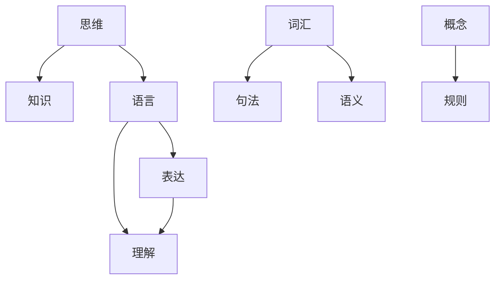

                 

# 知识的语言学基础：思维与表达的关系

在人工智能领域，知识不仅是算法与计算的核心，更是机器智能的根基。而语言作为人类最重要的思维工具，自然成为了知识表达和理解的重要载体。本文旨在深入探讨知识的语言学基础，即思维与表达的关系，通过逻辑清晰的结构与紧凑的叙述，揭示语言在人工智能中的核心作用与未来发展方向。

## 1. 背景介绍

### 1.1 问题的提出
知识与语言是人类智能的重要组成部分，它们之间的关系是研究人工智能深度的关键。语言不仅仅是人类交流的工具，更是思维与表达的桥梁。在人工智能系统中，语言提供了数据结构的天然方式，能够有效传递与存储信息，实现高级认知功能。而知识的表达与获取，则是构建智能系统、实现自主学习、推理与决策的核心。

### 1.2 问题的核心关键点
本研究聚焦于两个核心问题：
1. **知识如何通过语言进行表达与传递？**
2. **语言如何影响知识的获取与理解？**

在回答这些问题的同时，我们需要深入理解语言的符号性、规则性和上下文相关性，并探索知识与语言的结合方式，以及这种结合对人工智能系统的影响。

## 2. 核心概念与联系

### 2.1 核心概念概述
1. **知识(Knowledge)**：知识是人类对世界经验的积累，可表达为事实、概念、规则等。知识在人工智能中表现为数据、模型、推理规则等。
2. **语言(Language)**：语言是人类思维与交流的工具，由词汇、语法和语义组成。在人工智能中，语言是知识表达的主要载体。
3. **表达(Expression)**：表达是指将思维或知识转化为语言形式的过程。
4. **理解(Comprehension)**：理解是指通过语言解析和获取知识的过程。

### 2.2 核心概念联系与原理
语言的本质是符号系统，每一符号（如词汇）代表一种或多种概念或对象。这种符号与概念之间的映射关系，构成了语言的基本规则和机制。语言通过词语、句法和语义规则的组合，实现了复杂信息的传递和表达。

知识的表达通过词汇、句法和语义的整合，可以呈现为句子、段落乃至文本形式。而在理解过程中，语言解码器（如解析器）将文本转换为知识结构，进行语义理解和推理。

### 2.3 Mermaid 流程图
下面的流程图展示了语言与知识表达和理解的连接过程：



## 3. 核心算法原理 & 具体操作步骤

### 3.1 算法原理概述
语言与知识之间的关系，主要体现在表达和理解两个方面。表达涉及将知识转化为语言形式，而理解涉及从语言中解析和获取知识。基于语言的知识表达和理解，可以构建推理、学习与决策系统。

### 3.2 算法步骤详解
语言与知识表达的过程可以概括为以下步骤：

1. **词汇识别**：通过语言模型识别文本中的词汇。
2. **句法分析**：利用句法规则解析词汇之间的结构关系。
3. **语义理解**：通过语义模型解析词汇与结构的关系，得到知识表示。
4. **知识表达**：将知识表示转化为语言文本形式。

语言与知识理解的过程则包括：

1. **词汇解码**：通过语言模型解码词汇。
2. **句法解析**：利用句法规则解析结构关系。
3. **语义映射**：通过语义模型将结构映射为知识。

### 3.3 算法优缺点
**优点**：
1. **灵活性**：语言提供了一种通用的知识表达方式，便于不同知识之间的整合与共享。
2. **丰富性**：语言允许复杂的句法和语义结构，支持丰富的知识表示。
3. **交互性**：语言促进了人机交互，便于用户与系统进行自然语言交流。

**缺点**：
1. **歧义性**：同一句子可能有多种解释，影响知识获取的准确性。
2. **复杂性**：语言规则和表达形式的复杂性，增加了理解与推理的难度。
3. **上下文依赖**：理解与表达受上下文影响较大，可能导致模型失灵。

### 3.4 算法应用领域
语言与知识的结合在人工智能的各个领域都有广泛应用，包括：

1. **自然语言处理(NLP)**：如机器翻译、文本分类、情感分析等。
2. **机器学习**：如监督学习、强化学习、无监督学习等。
3. **知识图谱**：将知识结构化，便于推理与查询。
4. **智能问答**：通过语言理解回答问题，提供智能客服与知识库查询。
5. **语音识别**：将语音转化为文本，便于后续处理。

## 4. 数学模型和公式 & 详细讲解 & 举例说明

### 4.1 数学模型构建
在数学上，语言与知识的表达和理解可以表示为一系列符号、规则和关系的集合。设语言符号集为 $\Sigma$，句法规则集为 $R$，语义规则集为 $S$，知识表示为 $K$，表达函数为 $E$，理解函数为 $U$。

语言表达模型可以表示为：
$$
E(K, \Sigma, R) \rightarrow \text{语言文本}
$$

语言理解模型可以表示为：
$$
U(\text{语言文本}, \Sigma, R, S) \rightarrow K
$$

### 4.2 公式推导过程
以简单的句子为例，假设句子由主语、谓语和宾语构成。语言表达模型可以表示为主谓宾的映射，即：
$$
E(\text{主语}, \text{谓语}, \text{宾语}) \rightarrow \text{语言文本}
$$

语言理解模型可以表示为主谓宾的解析，即：
$$
U(\text{语言文本}) \rightarrow \text{主语}, \text{谓语}, \text{宾语}
$$

### 4.3 案例分析与讲解
假设有一个简单的句子：“John reads books”。语言表达模型将其转化为语言文本，理解模型从中解析出主语、谓语和宾语。这一过程可以用符号表示为：

表达：
$$
E(\text{John}, \text{reads}, \text{books}) \rightarrow \text{"John reads books"}
$$

理解：
$$
U(\text{"John reads books"}) \rightarrow (\text{John}, \text{reads}, \text{books})
$$

## 5. 项目实践：代码实例和详细解释说明

### 5.1 开发环境搭建
在进行语言与知识表达的实践前，我们需要准备好开发环境。以下是使用Python进行NLP开发的环境配置流程：

1. 安装Anaconda：从官网下载并安装Anaconda，用于创建独立的Python环境。
2. 创建并激活虚拟环境：
```bash
conda create -n nlp-env python=3.8 
conda activate nlp-env
```
3. 安装必要的库：
```bash
pip install nltk spacy transformers
```

### 5.2 源代码详细实现

以下是一个简单的文本分类器的实现，展示了语言与知识的结合：

```python
from transformers import TFBertForSequenceClassification, BertTokenizer

model = TFBertForSequenceClassification.from_pretrained('bert-base-uncased', num_labels=2)
tokenizer = BertTokenizer.from_pretrained('bert-base-uncased')

def encode_text(text):
    inputs = tokenizer(text, return_tensors='tf')
    return inputs['input_ids'], inputs['attention_mask']

def classify(text):
    input_ids, attention_mask = encode_text(text)
    inputs = {'input_ids': input_ids, 'attention_mask': attention_mask}
    with model.no_sync():
        outputs = model(inputs)
    logits = outputs.logits.numpy()
    label = logits.argmax(-1)
    return label

text = "This is a positive text"
class_label = classify(text)
print(f"Class label for '{text}' is {class_label}")
```

该代码使用BERT模型对文本进行分类，其中BERT模型通过自监督学习获得了丰富的语言知识，能够理解句子结构，从而对文本进行分类。

### 5.3 代码解读与分析
代码中，我们首先从HuggingFace库中加载预训练的BERT模型和分词器，然后定义了`encode_text`函数和`classify`函数。`encode_text`函数将文本转化为模型所需的输入格式，`classify`函数将文本输入模型进行分类，并输出预测结果。

## 6. 实际应用场景

### 6.1 智能客服系统

基于语言与知识的智能客服系统能够理解和处理客户的自然语言查询，提供24/7的即时响应。系统通过训练大量历史对话数据，能够理解常见的查询和问题，并通过知识图谱或FAQ数据库进行回答。例如，当用户询问“银行开户需要哪些材料”时，系统可以理解问题并从知识库中提取相关信息进行回答。

### 6.2 金融舆情监测

金融市场变化复杂，需要实时监控舆情变化。通过语言与知识结合的模型，可以自动分析金融新闻和社交媒体，识别出潜在的市场风险。例如，通过训练模型识别负面新闻和财务数据异常，可以提前预警风险事件。

### 6.3 个性化推荐系统

个性化推荐系统能够通过用户的历史行为和反馈，理解用户的兴趣和偏好，推荐最相关的商品或内容。通过语言模型对用户评论和行为数据进行分析，提取关键信息，并与知识图谱结合，实现精准推荐。

### 6.4 未来应用展望

随着语言模型的不断进步，未来的应用场景将更加广阔。以下是一些前沿应用领域：

1. **可控文本生成**：通过语言模型生成符合特定规则的文本，如科技文章、广告文案等。
2. **对话式智能助手**：实现更加流畅自然的对话交互，如智能家居、虚拟助手等。
3. **可解释性AI**：通过语言与知识结合，提供透明的推理过程和解释结果，增强模型可信度。
4. **跨语言知识共享**：通过多语言模型的结合，实现跨语言的知识共享和理解。
5. **人机协作**：在复杂任务中，通过语言与知识结合，实现人机协作，提升任务处理效率。

## 7. 工具和资源推荐

### 7.1 学习资源推荐
为了帮助开发者系统掌握语言与知识的结合理论，以下是一些优质的学习资源：

1. 《语言与知识：机器学习应用》书籍：介绍了语言与知识结合的基础理论和应用方法，适合深入学习。
2. 《自然语言处理综述》课程：涵盖NLP的各个方面，包括文本表示、机器翻译、情感分析等，是入门NLP的必备资源。
3. 《深度学习基础》课程：讲解深度学习的基本概念和算法，适合NLP领域的学习者。

### 7.2 开发工具推荐
以下是一些常用的开发工具，适合语言与知识结合的应用开发：

1. TensorFlow：由Google主导开发的深度学习框架，适合大规模工程应用。
2. PyTorch：灵活且易于迭代的深度学习框架，适合研究与实验。
3. HuggingFace Transformers：提供了丰富的预训练语言模型，适合微调和部署。
4. Jupyter Notebook：交互式的编程环境，适合快速实验和分享代码。

### 7.3 相关论文推荐
以下是几篇前沿的论文，介绍了语言与知识结合的研究进展：

1. "Knowledge Graphs for Multi-Task Learning"：介绍了知识图谱在多任务学习中的应用。
2. "Semantic Representation Learning for Multilingual Text Understanding"：探讨了多语言语义表示的学习方法。
3. "Explainable AI: Interpretable Machine Learning for AI Applications"：讨论了可解释性AI的实现方法和应用。

## 8. 总结：未来发展趋势与挑战

### 8.1 研究成果总结
本文对语言与知识结合的理论和实践进行了全面探讨。主要研究内容包括：

1. **语言与知识表达**：探讨了语言的符号性、句法规则和语义模型。
2. **语言与知识理解**：分析了词汇解码、句法解析和语义映射的过程。
3. **语言与知识应用**：介绍了智能客服、金融舆情、个性化推荐等实际应用。

### 8.2 未来发展趋势
未来，语言与知识结合的应用将更加广泛，以下是一些发展趋势：

1. **跨领域知识融合**：通过多领域知识图谱的结合，实现跨领域的知识理解和推理。
2. **零样本和少样本学习**：通过提示学习和数据增强，实现零样本和少样本条件下的知识获取。
3. **可解释性增强**：通过语言与知识结合，增强模型的可解释性，提高透明度和可信度。
4. **多模态信息融合**：通过结合视觉、语音等多模态信息，实现更全面、准确的知识获取。

### 8.3 面临的挑战
尽管语言与知识结合在人工智能中具有广泛应用，但仍面临一些挑战：

1. **歧义性**：语言本身的歧义性增加了理解的难度。
2. **复杂性**：语言规则和表达形式的复杂性，增加了推理和理解的复杂性。
3. **上下文依赖**：理解与表达受上下文影响较大，可能导致模型失灵。
4. **数据稀缺**：某些领域的数据稀缺，影响语言模型的训练效果。

### 8.4 研究展望
未来，我们需要在以下几个方向上继续深入研究：

1. **跨领域知识融合**：探索更高效的知识图谱和融合方法。
2. **多模态信息融合**：研究视觉、语音等多模态信息的整合与理解。
3. **可解释性增强**：通过语言与知识结合，增强模型的可解释性。
4. **零样本学习**：研究基于语言模型的零样本学习算法。

## 9. 附录：常见问题与解答

**Q1：语言模型如何处理歧义性？**

A: 语言模型通过上下文信息来处理歧义性。在理解过程中，通过上下文可以判断词汇的实际含义。例如，“I saw the man with a telescope”中的“telescope”根据上下文应理解为望远镜。

**Q2：如何提高语言模型的可解释性？**

A: 可解释性可以通过语言模型的特征提取和解释方法来实现。例如，可以使用特征可视化方法，展示模型对输入的敏感度；或通过生成式解释，展示模型推理过程。

**Q3：如何处理长文本的表达与理解？**

A: 长文本的表达与理解可以通过段落划分、句子分解和主题建模等方法进行。例如，将长文本划分为多个段落，并对每个段落进行独立理解，最后进行综合处理。

**Q4：如何提高语言模型的性能？**

A: 提高语言模型的性能可以通过以下几个方面进行：
1. 增加数据量：通过增加训练数据量，提升模型的泛化能力。
2. 优化模型结构：通过优化网络结构，提高模型的表达能力。
3. 引入先验知识：通过知识图谱和专家规则，增强模型的理解能力。

总之，语言与知识结合在人工智能中具有重要地位，通过对语言与知识表达和理解的深入研究，我们能够构建更加智能、可信、高效的AI系统，推动人工智能技术的发展与应用。

---

作者：禅与计算机程序设计艺术 / Zen and the Art of Computer Programming

