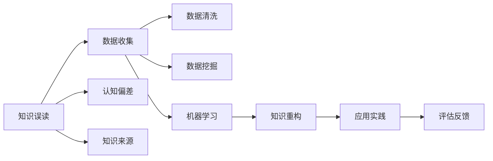

                 

# 知识的误读与重构：历史视角的重要性

> 关键词：历史视角，知识误读，重构方法，机器学习，数据科学

## 1. 背景介绍

### 1.1 问题由来

在当今信息爆炸的时代，知识的数量和传播速度前所未有。但与此同时，知识的误读和错误传播也成为了一个不容忽视的问题。无论是学术研究、商业决策还是日常沟通，错误的知识理解都会导致不必要的损失和错误决策。因此，如何准确理解、应用和重构知识，成为一个亟待解决的重要课题。

### 1.2 问题核心关键点

正确理解知识的来源、传递方式以及接受者的背景，对于避免知识的误读具有重要意义。而重构知识的本质，则是通过更科学的视角和方法，对原有知识进行修正和完善。

本文将从历史视角的角度，探讨知识误读的原因，提出基于数据的重构方法，并结合机器学习的应用实例，对知识的误读与重构进行系统性分析。

## 2. 核心概念与联系

### 2.1 核心概念概述

- **知识误读(Knowledge Misreading)**：指由于各种原因，使得知识的接受者对知识产生了错误的理解和解释。常见原因包括知识来源的可靠性问题、传递过程中的误解、接受者自身的认知偏差等。

- **重构知识(Reconstruction of Knowledge)**：通过更科学、全面和准确的视角和方法，修正和完善原有知识的错误，提升知识的准确性和实用性。

- **机器学习(Machine Learning)**：一种数据驱动的自动化学习方法，通过算法和模型，对数据进行学习和预测，帮助人类更好地理解和使用知识。

- **数据科学(Data Science)**：以数据为核心，结合统计学、机器学习、数据挖掘等方法，对数据进行深入分析，从而提取有价值的信息和知识。

- **历史视角(Historical Perspective)**：通过考察知识的历史背景、演变过程及其影响因素，更全面地理解知识，避免误读。

这些核心概念之间的联系和相互作用，共同构成了对知识误读与重构的研究框架。通过综合应用这些概念和方法，可以更有效地理解、传播和应用知识，提升决策和判断的科学性和可靠性。

### 2.2 核心概念原理和架构的 Mermaid 流程图



## 3. 核心算法原理 & 具体操作步骤

### 3.1 算法原理概述

知识误读与重构的过程，本质上是数据驱动的机器学习应用。其核心思想是：通过大量的事实数据和背景知识，对误读的知识进行校正，从而得到更准确、全面的理解。

具体而言，知识误读的发生可以表示为一个概率模型，其中知识被错误理解的概率与知识本身的复杂性和传递过程中的噪声有关。而知识重构的目标，则是最大化知识的真实性和实用性，通过调整模型参数，使得误读的概率最小化。

### 3.2 算法步骤详解

#### 3.2.1 数据收集与预处理

知识误读与重构的第一步是数据收集和预处理。这包括：
- 收集与知识相关的所有可获取数据，包括历史数据、文本、音频、视频等。
- 清洗数据，去除噪音和冗余，确保数据的质量和完整性。
- 对数据进行标注，将已知的正确知识进行标记，为后续的机器学习模型训练提供训练样本。

#### 3.2.2 特征工程与模型选择

特征工程是将原始数据转换为模型可接受的格式的过程。这包括：
- 提取数据中的关键特征，如文本中的关键词、语义、情感等。
- 将文本、图像等多模态数据转换为数值特征，供机器学习模型使用。
- 选择合适的机器学习模型，如支持向量机(SVM)、随机森林(Random Forest)、神经网络等，并根据数据特征和问题类型进行调参。

#### 3.2.3 训练与评估

在特征工程和模型选择之后，进行模型训练和评估。这包括：
- 使用标注好的训练数据，训练机器学习模型，得到知识重构的结果。
- 在验证集上评估模型的准确性和泛化能力，调整模型参数以提升性能。
- 在测试集上进一步验证模型的表现，确保其在未知数据上的稳定性。

#### 3.2.4 知识重构与输出

在训练和评估模型之后，进行知识重构的输出。这包括：
- 将机器学习模型预测的结果，与已有知识进行对比，确定其正确性。
- 对误读的知识进行修正，得到更准确、全面的知识表示。
- 将重构后的知识进行传播和应用，确保其正确性和可靠性。

### 3.3 算法优缺点

#### 3.3.1 优点

- **自动化与高效性**：机器学习算法可以自动地对大量数据进行处理和分析，大大提高知识重构的效率。
- **科学性与准确性**：基于数据的重构方法，可以避免人类认知偏差和主观判断的错误，提高知识的准确性。
- **可扩展性与灵活性**：机器学习模型可以适应多种数据类型和问题场景，具有高度的可扩展性和灵活性。

#### 3.3.2 缺点

- **数据依赖性**：机器学习模型的性能高度依赖于数据的质量和数量，低质量的数据可能导致误判和错误重构。
- **模型复杂性**：复杂的数据和问题可能需要高维度的特征工程和复杂的模型结构，增加计算和存储的难度。
- **解释性与可解释性**：某些机器学习模型的决策过程难以解释，可能存在"黑箱"问题，不利于知识传播和信任建立。

### 3.4 算法应用领域

基于机器学习的知识误读与重构方法，可以应用于多个领域，例如：

- **教育**：通过重构学生对知识点的理解，提高学习效果和教育质量。
- **医疗**：通过重构医疗知识，提升诊断和治疗的准确性，减少误诊和误治。
- **金融**：通过重构市场数据和金融模型，提高风险评估和投资决策的科学性。
- **法律**：通过重构法律条文和案例，提高法律咨询和判决的公正性。
- **商业**：通过重构市场数据和竞争情报，提升商业决策的科学性和盈利能力。

## 4. 数学模型和公式 & 详细讲解 & 举例说明

### 4.1 数学模型构建

知识误读与重构的数学模型，通常基于贝叶斯网络或概率图模型。其核心思想是：通过已知的事实数据，推断出知识的不确定性和真实性。

假设有 $n$ 个变量 $X_1, X_2, ..., X_n$，其中 $X_1$ 为知识点的误读，$X_2, ..., X_n$ 为其他相关的变量（如数据、背景知识等）。模型的目标是最大化 $X_1$ 的真实概率 $P(X_1|X_2, ..., X_n)$。

### 4.2 公式推导过程

以二元逻辑回归为例，假设有 $n$ 个训练样本 $(x_i, y_i)$，其中 $x_i$ 为输入特征，$y_i$ 为误读概率。则逻辑回归模型的损失函数为：

$$
L(y;\theta) = -\frac{1}{N}\sum_{i=1}^N[y_i\log \sigma(\theta^T x_i) + (1-y_i)\log(1-\sigma(\theta^T x_i))]
$$

其中 $\sigma(\theta^T x_i)$ 为逻辑回归的输出概率，$\theta$ 为模型参数。通过最小化损失函数，训练得到最优的模型参数 $\theta$，从而实现知识误读的概率最小化。

### 4.3 案例分析与讲解

以医学领域的一个具体案例为例：

**问题描述**：某医学研究人员在阅读一篇关于高血压治疗的论文时，发现其中的一个结论与其以往的认知不同。研究人员希望通过机器学习的方法，验证该结论的正确性，并进行知识重构。

**数据收集与预处理**：
- 收集该领域的历史文献、临床试验数据、患者病历等数据。
- 对数据进行清洗和标注，去除噪音和冗余，确保数据的质量和完整性。

**特征工程与模型选择**：
- 提取数据中的关键特征，如病历中的生化指标、治疗方案、患者年龄等。
- 将文本数据转换为数值特征，供机器学习模型使用。
- 选择逻辑回归模型进行训练和评估。

**训练与评估**：
- 使用标注好的训练数据，训练逻辑回归模型，得到高血压治疗效果的预测结果。
- 在验证集上评估模型的准确性和泛化能力，调整模型参数以提升性能。
- 在测试集上进一步验证模型的表现，确保其在未知数据上的稳定性。

**知识重构与输出**：
- 将模型预测的结果，与已有知识进行对比，确定其正确性。
- 对误读的知识进行修正，得到更准确、全面的知识表示。
- 将重构后的知识进行传播和应用，确保其正确性和可靠性。

## 5. 项目实践：代码实例和详细解释说明

### 5.1 开发环境搭建

在Python环境下，使用Scikit-learn和TensorFlow等工具进行知识误读与重构的实践。

1. 安装Anaconda：从官网下载并安装Anaconda，用于创建独立的Python环境。

2. 创建并激活虚拟环境：
```bash
conda create -n data-env python=3.8 
conda activate data-env
```

3. 安装必要的工具包：
```bash
pip install scikit-learn tensorflow pandas numpy matplotlib
```

4. 使用Jupyter Notebook进行交互式编程和可视化。

### 5.2 源代码详细实现

以下是一个简单的二元逻辑回归模型实现，用于验证高血压治疗效果的预测结果：

```python
import tensorflow as tf
from sklearn.linear_model import LogisticRegression
from sklearn.model_selection import train_test_split
from sklearn.preprocessing import StandardScaler

# 加载数据
data = pd.read_csv('hypertension_data.csv')

# 特征工程
X = data[['age', 'blood_pressure', 'cholesterol', 'smoking']]
y = data['treatment_effect']

# 数据标准化
scaler = StandardScaler()
X = scaler.fit_transform(X)

# 划分数据集
X_train, X_test, y_train, y_test = train_test_split(X, y, test_size=0.2, random_state=42)

# 逻辑回归模型
model = LogisticRegression(solver='liblinear')

# 模型训练
model.fit(X_train, y_train)

# 模型评估
score = model.score(X_test, y_test)
print(f"Accuracy: {score:.2f}")
```

### 5.3 代码解读与分析

以上代码实现了一个简单的二元逻辑回归模型，用于验证高血压治疗效果的预测结果。

**数据加载**：
- 使用Pandas库加载高血压治疗的数据集。

**特征工程**：
- 选择与高血压治疗效果相关的特征，如年龄、血压、胆固醇、吸烟习惯等。
- 对特征进行标准化处理，确保模型训练的稳定性。

**模型训练**：
- 使用Scikit-learn库的LogisticRegression模型，进行逻辑回归的训练。

**模型评估**：
- 在测试集上评估模型的准确性，输出模型的准确率。

## 6. 实际应用场景

### 6.1 教育领域

在教育领域，知识误读与重构可以用于提升教学质量和学生学习效果。例如：

- **教师教学指导**：通过重构教师的教学材料和教材，提升课堂教学的科学性和有效性。
- **学生学习辅助**：通过重构学生的学习材料，帮助学生更准确地理解知识点，提高学习效率。

### 6.2 医疗领域

在医疗领域，知识误读与重构可以用于提升诊断和治疗的准确性。例如：

- **医学论文验证**：通过重构医学论文的结论，验证其正确性和科学性。
- **患者治疗方案**：通过重构患者的治疗方案，提高诊断和治疗的准确性，减少误诊和误治。

### 6.3 金融领域

在金融领域，知识误读与重构可以用于提升投资决策的科学性和盈利能力。例如：

- **市场数据预测**：通过重构市场数据，预测市场趋势和投资回报，优化投资组合。
- **风险评估模型**：通过重构风险评估模型，提高风险评估的准确性和可靠性。

### 6.4 法律领域

在法律领域，知识误读与重构可以用于提升法律咨询和判决的公正性。例如：

- **法律条文重构**：通过重构法律条文，确保法律解释和应用的一致性和公正性。
- **案例分析**：通过重构案例分析，提高法律咨询和判决的科学性和可靠性。

### 6.5 商业领域

在商业领域，知识误读与重构可以用于提升商业决策的科学性和盈利能力。例如：

- **市场情报分析**：通过重构市场情报，提升市场分析和决策的科学性和准确性。
- **竞争情报应用**：通过重构竞争情报，提升企业竞争力和盈利能力。

## 7. 工具和资源推荐

### 7.1 学习资源推荐

为了帮助开发者系统掌握知识误读与重构的理论基础和实践技巧，这里推荐一些优质的学习资源：

1. **《机器学习实战》**：本书通过Python语言，介绍了机器学习的基本概念和算法，适合初学者入门。

2. **Coursera《机器学习》**：由斯坦福大学开设的机器学习课程，有视频讲座和配套作业，带你系统了解机器学习的基本理论和实践。

3. **Kaggle数据竞赛平台**：提供大量真实数据和竞赛任务，通过实际项目提升数据处理和机器学习技能。

4. **HuggingFace官方文档**：Transformer库的官方文档，提供了海量预训练模型和完整的机器学习样例代码，是入门实践的必备资料。

5. **《深度学习》**：由Ian Goodfellow等编写，系统介绍了深度学习的基本理论和算法，适合深入学习。

通过对这些资源的学习实践，相信你一定能够快速掌握知识误读与重构的精髓，并用于解决实际问题。

### 7.2 开发工具推荐

高效的开发离不开优秀的工具支持。以下是几款用于知识误读与重构开发的常用工具：

1. **Python**：作为数据科学和机器学习的主流语言，Python提供了丰富的第三方库和框架，如Pandas、NumPy、Scikit-learn、TensorFlow等，适合快速迭代研究。

2. **Jupyter Notebook**：交互式编程和可视化工具，方便进行数据处理和模型训练。

3. **Scikit-learn**：Python机器学习库，提供了多种模型和算法，适合快速实现和评估机器学习模型。

4. **TensorFlow**：由Google主导开发的开源深度学习框架，生产部署方便，适合大规模工程应用。

5. **Weights & Biases**：模型训练的实验跟踪工具，可以记录和可视化模型训练过程中的各项指标，方便对比和调优。

6. **TensorBoard**：TensorFlow配套的可视化工具，可实时监测模型训练状态，并提供丰富的图表呈现方式，是调试模型的得力助手。

合理利用这些工具，可以显著提升知识误读与重构任务的开发效率，加快创新迭代的步伐。

### 7.3 相关论文推荐

知识误读与重构技术的发展源于学界的持续研究。以下是几篇奠基性的相关论文，推荐阅读：

1. **《机器学习实战》**：由Peter Harrington编写，介绍了机器学习的基本概念和算法，适合初学者入门。

2. **《Coursera《机器学习》》**：由Andrew Ng主讲，斯坦福大学开设的机器学习课程，有视频讲座和配套作业，带你系统了解机器学习的基本理论和实践。

3. **Kaggle数据竞赛平台**：提供大量真实数据和竞赛任务，通过实际项目提升数据处理和机器学习技能。

4. **《HuggingFace官方文档》**：Transformer库的官方文档，提供了海量预训练模型和完整的机器学习样例代码，是入门实践的必备资料。

5. **《深度学习》**：由Ian Goodfellow等编写，系统介绍了深度学习的基本理论和算法，适合深入学习。

这些论文代表了大语言模型微调技术的发展脉络。通过学习这些前沿成果，可以帮助研究者把握学科前进方向，激发更多的创新灵感。

## 8. 总结：未来发展趋势与挑战

### 8.1 总结

本文对知识误读与重构方法进行了全面系统的介绍。首先阐述了知识误读的原因，提出了基于数据的重构方法，并结合机器学习的应用实例，对知识的误读与重构进行系统性分析。

通过本文的系统梳理，可以看到，知识误读与重构方法在教育、医疗、金融等多个领域的应用前景，为这些领域带来了新的解决方案。未来，伴随技术的不断进步，知识误读与重构技术必将在更多行业得到广泛应用，为人类认知智能的进化带来深远影响。

### 8.2 未来发展趋势

展望未来，知识误读与重构技术将呈现以下几个发展趋势：

1. **自动化与智能化**：自动化和智能化的水平将不断提高，机器学习算法能够更加高效地处理和分析大量数据，实现知识重构的自动化。

2. **多模态融合**：未来的知识重构将更多地融合多模态数据，如文本、图像、语音等，提高重构结果的全面性和准确性。

3. **跨领域应用**：知识误读与重构方法将更加广泛地应用于各个领域，帮助各行各业解决实际问题，提升工作效率和决策质量。

4. **实时性与动态性**：实时性和动态性的需求将增加，未来的知识重构系统将能够实时更新和动态调整，适应不断变化的环境和需求。

5. **伦理与安全**：未来的知识重构系统将更加注重伦理和安全问题，确保知识重构的结果符合人类价值观和社会规范。

以上趋势凸显了知识误读与重构技术的广阔前景。这些方向的探索发展，必将进一步提升知识重构的效率和效果，为人类社会的各个领域带来革命性变化。

### 8.3 面临的挑战

尽管知识误读与重构技术已经取得了瞩目成就，但在迈向更加智能化和普适化应用的过程中，它仍面临着诸多挑战：

1. **数据质量与完整性**：高质量的数据是知识重构的前提，但数据的获取和标注成本较高，且数据质量难以保证。如何提高数据质量，确保数据的完整性和可靠性，仍是一个难题。

2. **模型复杂性与解释性**：复杂的机器学习模型难以解释，可能存在"黑箱"问题，不利于知识传播和信任建立。如何提高模型的可解释性和透明性，是未来的一个重要研究方向。

3. **模型鲁棒性与泛化能力**：知识重构模型在面对不同领域和数据集时，泛化能力可能不足，导致重构结果的不稳定性。如何提高模型的鲁棒性和泛化能力，是未来的一个关键挑战。

4. **资源消耗与效率**：知识重构过程需要大量计算资源，如GPU、TPU等高性能设备。如何在保证重构效果的同时，降低资源消耗，提高效率，是未来的一个研究方向。

5. **伦理与社会责任**：知识重构过程中可能涉及伦理和隐私问题，如何确保数据安全和隐私保护，确保知识重构的结果符合人类价值观和社会规范，是一个重要的社会责任问题。

6. **跨学科合作**：知识重构涉及多个学科领域，如数据科学、机器学习、认知心理学等。如何跨学科合作，共同推动知识重构技术的进步，是一个重要的研究问题。

这些挑战需要多学科的共同努力，才能逐步克服，推动知识重构技术的成熟和发展。

### 8.4 研究展望

面对知识误读与重构所面临的种种挑战，未来的研究需要在以下几个方面寻求新的突破：

1. **数据质量和标注技术**：开发更加高效和可靠的数据获取和标注技术，确保数据的质量和完整性。同时，引入半监督学习和主动学习等技术，降低对标注数据的依赖。

2. **模型透明性与解释性**：引入可解释性模型，如LIME、SHAP等，提高模型的透明性和可解释性。同时，开发更先进的模型解释工具，帮助用户更好地理解模型决策过程。

3. **模型鲁棒性与泛化能力**：开发鲁棒性更高的模型结构，如深度神经网络、自适应模型等，提高模型的鲁棒性和泛化能力。同时，引入对比学习和因果推断等方法，提高模型的稳定性和抗干扰能力。

4. **实时性与动态性**：开发实时更新的知识重构系统，确保知识重构的结果能够动态适应不断变化的环境和需求。同时，引入增量学习等技术，提高系统的实时性和效率。

5. **伦理与社会责任**：引入伦理模型，确保知识重构的结果符合人类价值观和社会规范。同时，开发隐私保护技术，确保数据安全和隐私保护。

6. **跨学科合作**：加强与其他学科的合作，如心理学、社会学等，共同推动知识重构技术的进步。同时，引入多学科的视角和方法，提升知识重构的效果和可靠性。

这些研究方向的探索，必将引领知识误读与重构技术迈向更高的台阶，为构建安全、可靠、可解释、可控的智能系统铺平道路。面向未来，知识误读与重构技术还需要与其他人工智能技术进行更深入的融合，如知识表示、因果推理、强化学习等，多路径协同发力，共同推动自然语言理解和智能交互系统的进步。只有勇于创新、敢于突破，才能不断拓展语言模型的边界，让智能技术更好地造福人类社会。

## 9. 附录：常见问题与解答

**Q1: 知识误读与重构方法是否适用于所有领域？**

A: 知识误读与重构方法在大多数领域上都有广泛的应用前景，特别是在数据量大且需要高精度判断的领域，如金融、医疗、法律等。但在一些领域，如人类学、文学等，由于知识的主观性和模糊性，难以用机器学习的方法进行有效的重构。

**Q2: 如何提高数据质量与完整性？**

A: 提高数据质量与完整性，需要从多个方面入手：
- 收集高质量的数据，避免低质量的数据源。
- 进行数据清洗，去除噪音和冗余，确保数据的准确性和完整性。
- 使用标注工具和众包平台，提高标注数据的质量和多样性。
- 引入半监督学习和主动学习等技术，降低对标注数据的依赖。

**Q3: 如何提高模型的透明性与可解释性？**

A: 提高模型的透明性与可解释性，可以从以下几个方面入手：
- 使用可解释性模型，如LIME、SHAP等，生成模型特征重要性的解释。
- 开发更先进的模型解释工具，帮助用户更好地理解模型决策过程。
- 引入可视化工具，如TensorBoard、Weights & Biases等，实时监测和展示模型训练和推理过程。

**Q4: 如何提高模型的鲁棒性与泛化能力？**

A: 提高模型的鲁棒性与泛化能力，可以从以下几个方面入手：
- 使用鲁棒性更高的模型结构，如深度神经网络、自适应模型等。
- 引入对比学习和因果推断等方法，提高模型的稳定性和抗干扰能力。
- 在数据集中引入更多的噪声和变异，提高模型的泛化能力。

**Q5: 如何提高系统的实时性与动态性？**

A: 提高系统的实时性与动态性，可以从以下几个方面入手：
- 开发实时更新的知识重构系统，确保知识重构的结果能够动态适应不断变化的环境和需求。
- 引入增量学习等技术，提高系统的实时性和效率。
- 优化计算资源配置，提高系统的响应速度。

这些问题的解答，希望能对你在知识误读与重构的实践中有一定的帮助。

---

作者：禅与计算机程序设计艺术 / Zen and the Art of Computer Programming

