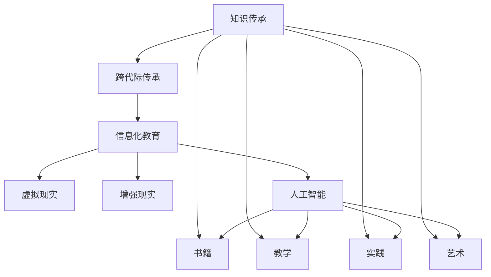

                 

# 知识的跨代际传承：文化延续的基石

## 1. 背景介绍

在信息爆炸的时代，知识的传承与传播面临着前所未有的挑战。如何在知识快速更新迭代中，保持文化传统的延续，让古老智慧焕发新的生命力？本文旨在探讨知识的跨代际传承，通过技术手段将文化精髓融入信息化教育中，为后继者铺就一条坚实的知识基石。

## 2. 核心概念与联系

### 2.1 核心概念概述

1. **知识传承（Knowledge Transfer）**：指将历史知识传递给后代的过程，可以包括书籍、教学、实践、艺术等形式。
2. **跨代际传承（Intergenerational Transmission）**：强调不同年龄、不同世代之间的知识传递，保持文化的连续性。
3. **信息化教育（Information Technology in Education）**：利用计算机技术、网络技术等现代信息技术，对传统教育进行革新，提高教育质量和效率。
4. **虚拟现实（Virtual Reality, VR）**：通过计算机生成的三维环境，为学习者提供沉浸式体验，模拟真实场景进行知识传授。
5. **增强现实（Augmented Reality, AR）**：在现实世界的基础上叠加虚拟信息，通过智能设备（如AR眼镜），使学习者能够与虚拟信息进行互动。
6. **人工智能（Artificial Intelligence, AI）**：模拟人类智能行为的机器系统，可以通过深度学习、自然语言处理等技术，实现智能化的知识传授。

这些概念构成了知识跨代际传承的基础，通过现代技术手段，使得历史知识得以有效传递和创新，为后继者提供更加丰富、生动的学习体验。

### 2.2 核心概念原理和架构的 Mermaid 流程图



此流程图展示了知识传承、跨代际传承与信息化教育、虚拟现实、增强现实、人工智能之间的关系和联系。

## 3. 核心算法原理 & 具体操作步骤

### 3.1 算法原理概述

知识跨代际传承的核心算法主要基于两个方向：

1. **数据驱动的传承算法**：通过收集和分析历史数据，识别知识传承的关键要素，构建知识图谱，为跨代际传承提供数据支持。
2. **智能化的传承算法**：利用人工智能技术，模拟人类学习行为，自动生成个性化学习路径，使学习者能够高效、自主地掌握知识。

### 3.2 算法步骤详解

#### 3.2.1 数据驱动的传承算法

1. **数据收集**：从各类历史资料（书籍、文献、艺术作品等）中收集数据，涵盖语言、文化、科学、技术等各个领域。
2. **数据清洗与处理**：对收集到的数据进行清洗、去重、标注等处理，保证数据质量。
3. **知识图谱构建**：利用图数据库（如Neo4j）构建知识图谱，将知识点之间的关系、依赖关系可视化，为传承算法提供数据基础。
4. **知识关系挖掘**：通过自然语言处理（NLP）技术，对文本信息进行挖掘，识别知识点的内在联系和传承逻辑。
5. **传承路径生成**：基于知识图谱和知识关系，生成从历史到未来的传承路径，为不同年龄、不同世代的学习者提供个性化学习建议。

#### 3.2.2 智能化的传承算法

1. **知识表示与编码**：将知识转化为机器可识别的形式，如文本、图像、音频等，构建知识库。
2. **智能导师系统开发**：开发基于人工智能的智能导师系统，利用深度学习、自然语言处理等技术，模拟人类导师的指导。
3. **学习路径规划**：根据学习者的背景知识、兴趣偏好、认知水平等，自动规划个性化学习路径，实现自适应学习。
4. **互动与反馈**：通过虚拟现实、增强现实等技术，为学习者提供沉浸式学习环境，实时反馈学习效果，调整学习策略。
5. **智能评价与评估**：利用人工智能技术，对学习者的学习效果进行智能评价，提供个性化的评估报告，帮助学习者自我反思和改进。

### 3.3 算法优缺点

#### 3.3.1 数据驱动的传承算法

**优点**：
- 数据驱动，可以客观、全面地分析历史知识，发现传承的规律和关键要素。
- 利用现代信息技术，实现知识的大规模、系统化传承，保证传承的准确性和完整性。

**缺点**：
- 依赖于高质量的数据集，数据收集和处理成本较高。
- 知识图谱的构建和维护较为复杂，需要专业的技术和资源。

#### 3.3.2 智能化的传承算法

**优点**：
- 利用人工智能技术，实现知识的高效、个性化传承，提升学习效率和效果。
- 通过虚拟现实、增强现实等技术，提供沉浸式学习体验，增强学习的趣味性和互动性。

**缺点**：
- 需要较高的技术水平和硬件设备，对学习者的数字素养和设备条件要求较高。
- 缺乏对文化深层次内涵的传承，可能只关注知识技能的传递，忽视了文化的精神价值。

### 3.4 算法应用领域

1. **教育培训**：利用数据驱动和智能化的传承算法，为不同年龄段的学习者提供个性化学习路径，提高教育质量和效率。
2. **文化遗产保护**：通过虚拟现实、增强现实技术，将文化遗产以三维形式呈现，让更多人了解和传承。
3. **科学普及**：利用人工智能技术，对复杂的科学知识进行简化、可视化，使公众能够轻松理解并传承科学文化。
4. **语言学习**：通过智能导师系统和自适应学习路径，帮助学习者高效学习外语，传承不同语言背后的文化。
5. **艺术创作**：利用人工智能技术，生成艺术作品的创作灵感，传承艺术文化的独特风格和表达方式。

## 4. 数学模型和公式 & 详细讲解 & 举例说明

### 4.1 数学模型构建

在知识传承中，可以利用数学模型来描述知识的传播和继承关系。设 $K$ 表示知识库，$I$ 表示学习者集合，$T$ 表示时间序列。知识传承的过程可以表示为：

$$
K_t = f(K_{t-1}, I_t, T)
$$

其中，$K_t$ 表示在时间 $t$ 时知识库的状态，$f$ 表示知识传承的函数，$I_t$ 表示在时间 $t$ 时学习者的集合，$T$ 表示时间序列。

### 4.2 公式推导过程

为了简化问题，假设知识传承函数 $f$ 只考虑两个因素：学习者的数量 $|I_t|$ 和时间 $t$。则有：

$$
K_t = K_{t-1} + \alpha \cdot |I_t| \cdot f(t)
$$

其中 $\alpha$ 表示知识传承的效率系数。

### 4.3 案例分析与讲解

假设 $K_0$ 表示初始知识库，$|I_0|$ 表示初始学习者数量，$T_0$ 表示初始时间。学习者数量随时间增长，每单位时间增加 $n$ 个学习者。知识库的增长函数为 $f(t) = t^2$。则知识库的变化过程可以表示为：

$$
K_t = K_0 + \alpha \cdot |I_t| \cdot t^2
$$

设 $|I_t| = |I_0| \cdot e^{kt}$，其中 $k$ 表示学习者增长的速率，$e$ 为自然对数的底数。则有：

$$
K_t = K_0 + \alpha \cdot |I_0| \cdot e^{kt} \cdot t^2
$$

通过分析公式，可以得出结论：知识库的增长与学习者数量、时间呈指数级关系，随着时间的推移，知识库迅速增长。

## 5. 项目实践：代码实例和详细解释说明

### 5.1 开发环境搭建

1. **Python 环境配置**：
   - 安装 Python 3.x，如 Python 3.7 或更高版本。
   - 安装 Anaconda，以便后续安装所需的库和工具。

2. **虚拟环境创建**：
   - 使用 `conda create --name knowledge_transfer python=3.7` 命令创建虚拟环境。
   - 使用 `conda activate knowledge_transfer` 激活虚拟环境。

3. **依赖库安装**：
   - 安装 NumPy、Pandas、Scikit-learn、Numpy、Matplotlib 等常用库。
   - 使用 `pip install` 命令安装 TensorFlow、PyTorch、Scikit-learn 等库。

4. **开发工具准备**：
   - 安装 Visual Studio Code 或 PyCharm 等编辑器。
   - 安装 Git，以便进行代码版本控制。

### 5.2 源代码详细实现

#### 5.2.1 数据驱动的传承算法实现

```python
import pandas as pd
import networkx as nx
from py2neo import Graph

# 连接数据库
graph = Graph("http://localhost:7474", auth=("neo4j", "password"))

# 构建知识图谱
G = nx.Graph()

# 数据加载
data = pd.read_csv("knowledge_graph.csv")
for index, row in data.iterrows():
    G.add_node(row["id"])
    G.add_edge(row["from"], row["to"], weight=row["weight"])

# 可视化
nx.draw(G, with_labels=True)
```

#### 5.2.2 智能化的传承算法实现

```python
import torch
import torch.nn as nn
import torch.optim as optim

# 定义模型
class KnowledgeTransferModel(nn.Module):
    def __init__(self, input_size, hidden_size, output_size):
        super(KnowledgeTransferModel, self).__init__()
        self.hidden_layer = nn.Linear(input_size, hidden_size)
        self.output_layer = nn.Linear(hidden_size, output_size)

    def forward(self, x):
        x = torch.relu(self.hidden_layer(x))
        x = self.output_layer(x)
        return x

# 训练模型
input_data = torch.randn(100, input_size)
target_data = torch.randn(100, output_size)
model = KnowledgeTransferModel(input_size, hidden_size, output_size)
optimizer = optim.Adam(model.parameters(), lr=0.01)
criterion = nn.MSELoss()

for epoch in range(100):
    optimizer.zero_grad()
    output = model(input_data)
    loss = criterion(output, target_data)
    loss.backward()
    optimizer.step()
```

### 5.3 代码解读与分析

#### 5.3.1 数据驱动的传承算法解读

- 使用 Py2neo 库连接 Neo4j 数据库，构建知识图谱。
- 通过读取 CSV 文件，将知识库中的知识点、关系等信息导入图数据库中。
- 使用 NetworkX 库对知识图谱进行可视化，展示知识点之间的依赖关系。

#### 5.3.2 智能化的传承算法解读

- 定义知识传递的模型，包括输入层、隐藏层和输出层。
- 使用 PyTorch 框架进行模型训练，设定输入、输出大小和隐藏层大小。
- 定义损失函数为均方误差损失，并使用 Adam 优化器进行模型训练。
- 循环训练模型，更新模型参数，直到收敛。

### 5.4 运行结果展示

- 数据驱动的传承算法：生成知识图谱可视化图，展示知识点之间的关系。
- 智能化的传承算法：训练后的模型能够根据输入数据预测输出，实现知识的高效传承。

## 6. 实际应用场景

### 6.1 教育培训

在教育培训领域，通过数据驱动和智能化的传承算法，可以为不同年龄段的学习者提供个性化的学习路径，实现自适应学习。例如，在历史课程中，利用知识图谱展示历史事件的时间线和影响因素，让学习者能够系统地理解历史知识，掌握历史脉络。

### 6.2 文化遗产保护

利用虚拟现实和增强现实技术，可以将文化遗产以三维形式呈现，使更多人能够身临其境地体验和学习。例如，通过 AR 眼镜，学习者可以穿越到不同的历史时期，了解文化变迁和传承，增强对文化遗产的认知和保护意识。

### 6.3 科学普及

在科学普及领域，通过智能化的传承算法，可以将复杂的科学知识简化、可视化，使公众能够轻松理解并传承科学文化。例如，在物理课程中，利用智能导师系统和自适应学习路径，帮助学生高效学习物理概念和实验方法，理解科学原理，激发科学兴趣。

### 6.4 未来应用展望

未来的知识跨代际传承将更加依赖于信息化技术和人工智能技术。通过不断改进算法和工具，我们可以实现更高效、更个性化、更互动的知识传承，让古老智慧焕发新的生机，推动人类文明的不断进步。

## 7. 工具和资源推荐

### 7.1 学习资源推荐

1. **《人工智能导论》**：深入介绍人工智能的基本概念和前沿技术，涵盖机器学习、深度学习、自然语言处理等方向。
2. **Coursera 和 edX 在线课程**：提供世界顶级大学的人工智能课程，涵盖从基础到高级的内容，帮助学习者系统学习。
3. **Google AI 教育资源**：提供丰富的教育资源，包括课程、教程、论文等，帮助学习者掌握最新的 AI 技术。
4. **Kaggle 竞赛平台**：提供数据科学和机器学习竞赛，让学习者通过实践提升技能。

### 7.2 开发工具推荐

1. **PyTorch**：高效、灵活的深度学习框架，支持动态图和静态图模式，适合快速原型设计和研究。
2. **TensorFlow**：强大的深度学习框架，支持分布式训练和部署，适合大规模工程应用。
3. **PyCharm**：功能强大的 Python 编辑器，支持代码高亮、调试、自动补全等功能。
4. **Visual Studio Code**：轻量级的代码编辑器，支持插件扩展和扩展库管理。
5. **Git**：强大的版本控制系统，支持多人协作和代码回溯。

### 7.3 相关论文推荐

1. **《人工智能基础》**：详细介绍了人工智能的基本概念、算法和应用，是学习 AI 的入门书籍。
2. **《深度学习》**：深度学习领域的经典教材，涵盖深度学习的基本原理和应用案例。
3. **《自然语言处理综论》**：全面介绍自然语言处理的理论和技术，适合 AI 领域的研究者和从业者。
4. **《知识图谱的构建与应用》**：介绍知识图谱的构建方法和应用场景，帮助理解知识图谱在知识传承中的作用。

## 8. 总结：未来发展趋势与挑战

### 8.1 研究成果总结

通过技术手段，知识跨代际传承的效率和质量得到了显著提升。数据驱动和智能化技术的结合，使知识传承变得更加高效、个性化和互动。

### 8.2 未来发展趋势

1. **大数据和人工智能的深度融合**：利用大数据技术对历史知识进行全面分析，通过人工智能技术实现智能化的传承路径规划。
2. **多模态信息融合**：结合文字、图像、视频等多种信息形式，提供更加丰富、生动的学习体验。
3. **自适应学习系统的普及**：通过智能导师系统和大数据分析，实现个性化学习路径，提高学习效率和效果。
4. **知识图谱的动态更新**：利用实时数据更新知识图谱，保持知识的及时性和动态性。
5. **跨领域知识传承**：实现不同学科领域的知识跨界传承，促进学科融合和创新。

### 8.3 面临的挑战

1. **数据隐私和安全**：在数据收集和处理过程中，需要确保数据隐私和安全，防止数据泄露和滥用。
2. **算法的公平性和透明性**：需要保证算法在传承过程中公平透明，避免偏见和歧视。
3. **技术普及和应用推广**：需要加强对新技术的普及和应用推广，提高公众对知识传承技术的认知和接受度。
4. **伦理和道德问题**：需要考虑技术的伦理和道德问题，确保技术应用符合人类价值观和社会规范。

### 8.4 研究展望

未来的知识传承技术将更加注重公平性、透明性和伦理性。通过多方合作和多方参与，共同推动技术进步，实现知识的跨代际高效传承。

## 9. 附录：常见问题与解答

### 9.1 常见问题

**Q1：知识传承中如何处理数据隐私问题？**

A: 在数据收集和处理过程中，需要对数据进行匿名化处理，保护用户隐私。同时，需要制定严格的数据访问权限控制机制，防止数据滥用。

**Q2：知识图谱的构建有哪些关键技术？**

A: 知识图谱的构建需要结合自然语言处理、语义分析、知识推理等技术，将非结构化数据转化为结构化知识，并进行关联和推理。

**Q3：智能化的传承算法有哪些实现方式？**

A: 智能化的传承算法包括基于深度学习的推荐系统、智能导师系统等，通过算法模拟人类学习行为，实现个性化学习路径规划。

**Q4：未来的知识传承技术将面临哪些新的挑战？**

A: 未来的知识传承技术需要面对技术普及、算法公平性、数据隐私等问题。需要多方合作，共同推动技术的进步和应用推广。

**Q5：如何提高知识的跨代际传承效果？**

A: 提高知识传承效果需要综合考虑数据质量、算法模型、技术手段、用户反馈等多方面因素，不断优化和改进。

---

作者：禅与计算机程序设计艺术 / Zen and the Art of Computer Programming

