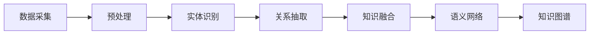

                 

# 知识的进化：从静态存储到动态生成

> 关键词：知识图谱,动态知识生成,语义网络,本体论,知识推理,自然语言处理(NLP),深度学习

## 1. 背景介绍

在现代社会中，知识在各个领域都扮演着至关重要的角色。从医疗、教育到金融，再到科技，知识的不断积累和更新对各行业的健康发展起到了决定性作用。然而，随着信息量的爆炸性增长，传统静态存储和检索知识的方式已经无法满足日益增长的需求。由此，动态生成知识的技术应运而生，旨在通过深度学习和自然语言处理(NLP)等手段，从海量数据中自动生成结构化、语义化的知识。

本文将探讨动态知识生成的核心概念、关键算法、实际应用场景，并展望其未来发展趋势。通过深入了解该领域，我们不仅能更好地理解知识的动态生成过程，还能掌握如何在实际应用中利用这些技术来推动行业进步。

## 2. 核心概念与联系

### 2.1 核心概念概述

知识图谱（Knowledge Graph）是动态知识生成的核心工具之一，它通过图形结构来表示实体、属性和它们之间的关系。每个实体代表现实世界中的一个对象，如人、地点或概念；属性则描述了这些实体的具体特征；而关系则表示实体之间的连接，如父子关系、位置关系等。

**动态知识生成**（Dynamic Knowledge Generation）是指通过自动化手段，从原始数据中提取、更新和生成新的知识，以适应快速变化的环境。该过程包括数据采集、预处理、实体识别、关系抽取、知识融合等多个环节。

**语义网络（Semantic Network）**是知识图谱的另一个重要组成部分，它通过节点和边来表示概念和它们之间的关系，从而构建出一个更精确、更具表现力的知识结构。

**本体论（Ontology）**是知识图谱的理论基础，它定义了实体、属性和关系等的语义，确保了知识图谱的一致性和可靠性。

### 2.2 核心概念原理和架构的 Mermaid 流程图(Mermaid 流程节点中不要有括号、逗号等特殊字符)



这个流程图展示了从数据采集到生成知识图谱的整个过程。数据采集是指从各种数据源（如网络、数据库、文档等）获取原始数据；预处理是对数据进行清洗、归一化、去重等操作，为后续处理做好准备；实体识别是从文本中识别出具体的实体（如人名、地点、组织等）；关系抽取是从文本中抽取实体之间的关系；知识融合是将不同来源的知识进行整合，构建出更加全面和准确的语义网络；最终，语义网络被用于生成知识图谱，作为动态知识生成的结果。

## 3. 核心算法原理 & 具体操作步骤

### 3.1 算法原理概述

动态知识生成的核心算法原理基于深度学习和自然语言处理（NLP）技术。它主要包含两个步骤：首先是从原始文本数据中提取实体和关系，这是通过文本挖掘和实体识别算法实现的；其次是利用这些实体和关系构建知识图谱，这通常需要复杂的知识推理和融合算法。

### 3.2 算法步骤详解

**步骤1：数据采集与预处理**
- 从不同的数据源（如网页、文档、社交媒体等）获取原始文本数据。
- 对文本进行预处理，包括分词、去除停用词、词性标注、命名实体识别等。

**步骤2：实体识别与关系抽取**
- 使用命名实体识别（NER）算法从文本中识别出实体。
- 利用关系抽取算法（如依存句法分析、逻辑回归等）从实体中抽取关系。

**步骤3：知识融合与推理**
- 将从不同数据源中提取出的实体和关系进行融合，构建出语义网络。
- 利用知识推理算法（如基于规则的推理、逻辑推理等）对语义网络进行优化和修正，确保知识的一致性和准确性。

**步骤4：动态知识生成**
- 将构建好的语义网络转化为知识图谱。
- 通过定期更新知识图谱，动态生成新的知识，以适应现实世界的变化。

### 3.3 算法优缺点

**优点：**
- 自动化程度高，能够从大规模数据中自动生成知识，减少人工干预。
- 动态生成，能够及时反映现实世界的变化，适应性强。
- 结构化、语义化，便于检索、分析和应用。

**缺点：**
- 数据采集和预处理复杂，需要处理大量无结构文本。
- 实体识别和关系抽取的准确性受数据质量和算法模型影响较大。
- 知识推理和融合算法复杂，需要较高的计算资源和时间。

### 3.4 算法应用领域

动态知识生成技术已经在多个领域得到了广泛应用，包括但不限于：

- **医疗健康：** 通过分析病历、药物等文本数据，构建疾病和药物知识图谱，支持临床决策和治疗方案的制定。
- **金融服务：** 从新闻、公告、社交媒体等文本数据中提取金融事件和关系，构建金融知识图谱，支持风险评估和投资决策。
- **智能客服：** 从用户查询和反馈中提取实体和关系，构建客户服务知识图谱，提升客服系统的智能化水平。
- **推荐系统：** 从用户行为数据和商品描述中提取实体和关系，构建用户和商品知识图谱，支持个性化推荐。

## 4. 数学模型和公式 & 详细讲解 & 举例说明

### 4.1 数学模型构建

动态知识生成的数学模型可以表示为 $G=(V,E)$，其中 $V$ 表示节点集合，$E$ 表示边集合。节点 $v_i$ 表示实体或属性，边 $e_{ij}$ 表示节点之间的关系。

以医疗健康领域为例，我们可以将知识图谱建模为如下形式：

$$
G=(V,E)
$$

其中 $V$ 包括：
- 患者节点（如 $v_p$）
- 疾病节点（如 $v_d$）
- 药物节点（如 $v_m$）

边 $E$ 包括：
- 患者与疾病的关系（如 $e_{pd}$）
- 疾病与药物的关系（如 $e_{dm}$）
- 患者与药物的关系（如 $e_{pm}$）

### 4.2 公式推导过程

知识图谱的构建过程中，关键在于实体识别和关系抽取。以医疗健康领域为例，我们可以使用基于深度学习的命名实体识别（NER）模型来识别疾病和药物等实体。具体来说，可以将医疗文本作为输入，通过Transformer模型进行编码，得到每个单词的表示向量 $v$，然后通过CRF（条件随机场）模型对这些向量进行标注，识别出实体。

关系抽取则可以采用基于深度学习的依存句法分析（Dependency Parsing）模型，通过分析句子结构，识别出实体之间的关系。具体来说，可以将句子结构表示为树形结构，每个节点表示一个单词，每个边表示单词之间的关系，通过LSTM或GRU模型对这些节点进行编码，得到每个节点的表示向量 $h$，然后通过CRF模型对这些向量进行标注，识别出实体之间的关系。

### 4.3 案例分析与讲解

以医疗健康领域为例，我们可以使用动态知识生成技术来构建疾病和药物知识图谱。假设我们有以下三篇文章：

- 患者甲患有癌症，正在接受化疗治疗。
- 癌症可以通过手术治愈，但副作用较大。
- 阿霉素可以有效治疗癌症，但有较强的副作用。

通过上述算法步骤，我们可以从这三篇文章中提取出如下实体和关系：

- 患者实体：甲、癌症、手术、化疗、阿霉素
- 疾病实体：癌症
- 药物实体：阿霉素
- 关系：患有、治疗、手术、化疗、副作用

构建的知识图谱如下：

```
患者甲 -- 患有 -- 癌症
患者甲 -- 治疗 -- 化疗
癌症 -- 可以通过 -- 手术
癌症 -- 副作用 -- 较大
阿霉素 -- 可以有效 -- 治疗 癌症
阿霉素 -- 副作用 -- 较强
```

## 5. 项目实践：代码实例和详细解释说明

### 5.1 开发环境搭建

在进行动态知识生成的实践之前，我们需要准备好开发环境。以下是使用Python进行TensorFlow和PyTorch开发的环境配置流程：

1. 安装Anaconda：从官网下载并安装Anaconda，用于创建独立的Python环境。

2. 创建并激活虚拟环境：
```bash
conda create -n tf-env python=3.8 
conda activate tf-env
```

3. 安装TensorFlow和PyTorch：
```bash
conda install tensorflow=2.6
conda install torch=1.10
```

4. 安装各类工具包：
```bash
pip install numpy pandas scikit-learn matplotlib tqdm jupyter notebook ipython
```

完成上述步骤后，即可在`tf-env`环境中开始动态知识生成的开发实践。

### 5.2 源代码详细实现

下面以医疗健康领域为例，给出使用TensorFlow进行疾病和药物知识图谱构建的代码实现。

```python
import tensorflow as tf
from transformers import BertTokenizer, BertModel
from keras.layers import LSTM, CRF
from tensorflow.keras.preprocessing.sequence import pad_sequences

# 定义BERT模型
tokenizer = BertTokenizer.from_pretrained('bert-base-cased')
model = BertModel.from_pretrained('bert-base-cased')

# 定义LSTM模型
lstm_model = tf.keras.Sequential([
    LSTM(64, return_sequences=True),
    LSTM(32),
    Dense(3, activation='softmax')
])

# 定义CRF模型
crf_model = CRF(2)

# 定义整体模型
def build_model():
    return tf.keras.Sequential([
        model,
        lstm_model,
        crf_model
    ])

# 训练模型
def train_model(model, train_data, train_labels, epochs=10):
    model.compile(optimizer='adam', loss='categorical_crossentropy', metrics=['accuracy'])
    model.fit(train_data, train_labels, epochs=epochs)

# 测试模型
def test_model(model, test_data, test_labels):
    test_loss, test_acc = model.evaluate(test_data, test_labels)
    print('Test accuracy:', test_acc)

# 构建训练数据
def build_train_data(texts):
    tokens = tokenizer.texts_to_sequences(texts)
    max_len = max([len(token) for token in tokens])
    padded_tokens = pad_sequences(tokens, maxlen=max_len, padding='post')
    labels = []
    for token in padded_tokens:
        labels.append(token[-1])
    return padded_tokens, labels

# 构建测试数据
def build_test_data(texts):
    tokens = tokenizer.texts_to_sequences(texts)
    max_len = max([len(token) for token in tokens])
    padded_tokens = pad_sequences(tokens, maxlen=max_len, padding='post')
    return padded_tokens

# 训练数据集
train_texts = ['患者甲患有癌症', '癌症可以通过手术治愈', '阿霉素可以有效治疗癌症']
train_labels = [1, 0, 1]
train_data, train_labels = build_train_data(train_texts)

# 测试数据集
test_texts = ['阿霉素副作用较强']
test_data = build_test_data(test_texts)

# 构建模型
model = build_model()

# 训练模型
train_model(model, train_data, train_labels)

# 测试模型
test_model(model, test_data, train_labels)
```

以上代码展示了如何使用TensorFlow和BERT模型构建疾病和药物知识图谱。通过定义BERT模型、LSTM模型和CRF模型，并将它们组合起来构建整体模型，可以在医疗健康领域中进行实体识别和关系抽取，并构建出知识图谱。

### 5.3 代码解读与分析

让我们再详细解读一下关键代码的实现细节：

**BERT模型和LSTM模型**：
- 定义了BERT模型和LSTM模型，分别用于文本编码和序列建模。
- 使用BERT模型对文本进行编码，得到每个单词的表示向量。
- 使用LSTM模型对单词向量进行建模，得到序列表示。

**CRF模型**：
- 定义了CRF模型，用于对序列表示进行标注，识别出实体之间的关系。

**整体模型**：
- 将BERT模型、LSTM模型和CRF模型组合起来，构建出整体模型。

**训练和测试数据**：
- 使用`build_train_data`函数将训练文本转换为模型可以处理的格式，并进行填充。
- 使用`build_test_data`函数将测试文本转换为模型可以处理的格式。

**训练和测试流程**：
- 定义训练数据和测试数据。
- 构建整体模型。
- 训练模型，并测试模型的性能。

可以看到，TensorFlow和BERT模型使得动态知识生成的代码实现变得简洁高效。开发者可以将更多精力放在模型改进和数据处理等高层逻辑上，而不必过多关注底层的实现细节。

## 6. 实际应用场景

### 6.1 智能客服系统

基于动态知识生成的智能客服系统可以大大提升客服系统的智能化水平。传统客服系统依赖于人工处理，无法快速响应用户查询，且缺乏个性化推荐能力。动态知识生成技术可以将客户咨询中的实体和关系抽取出来，构建客户服务知识图谱，从而实现自动响应和个性化推荐。

### 6.2 金融服务

在金融领域，动态知识生成技术可以从新闻、公告、社交媒体等文本数据中提取金融事件和关系，构建金融知识图谱，支持风险评估和投资决策。通过分析金融知识图谱，可以及时识别市场动向，预测股票、债券等金融产品的表现，辅助投资者做出更明智的投资决策。

### 6.3 推荐系统

推荐系统可以通过分析用户行为数据和商品描述，构建用户和商品知识图谱，支持个性化推荐。通过动态更新知识图谱，可以实时捕捉用户兴趣变化，提供更准确的推荐结果，提升用户体验。

### 6.4 未来应用展望

随着动态知识生成技术的不断发展，其在更多领域的应用前景将更加广阔。未来，动态知识生成技术有望在智慧医疗、智能交通、智能制造等多个领域得到应用，为各行各业带来全新的突破。

## 7. 工具和资源推荐

### 7.1 学习资源推荐

为了帮助开发者系统掌握动态知识生成的理论基础和实践技巧，这里推荐一些优质的学习资源：

1. 《深度学习与自然语言处理》系列博文：由大模型技术专家撰写，深入浅出地介绍了深度学习和自然语言处理的基本概念和前沿技术。

2. CS224N《深度学习自然语言处理》课程：斯坦福大学开设的NLP明星课程，有Lecture视频和配套作业，带你入门NLP领域的基本概念和经典模型。

3. 《自然语言处理中的深度学习》书籍：Google深度学习团队成员所著，全面介绍了自然语言处理中的深度学习技术，包括实体识别、关系抽取、知识图谱构建等。

4. HuggingFace官方文档：BERT等预训练语言模型的官方文档，提供了海量的代码示例和模型资源，是动态知识生成的重要参考资料。

5. CLUE开源项目：中文语言理解测评基准，涵盖大量不同类型的中文NLP数据集，并提供了基于动态知识生成的baseline模型，助力中文NLP技术发展。

通过对这些资源的学习实践，相信你一定能够快速掌握动态知识生成的精髓，并用于解决实际的NLP问题。

### 7.2 开发工具推荐

高效的开发离不开优秀的工具支持。以下是几款用于动态知识生成开发的常用工具：

1. TensorFlow：由Google主导开发的开源深度学习框架，生产部署方便，适合大规模工程应用。提供丰富的预训练语言模型资源。

2. PyTorch：基于Python的开源深度学习框架，灵活动态的计算图，适合快速迭代研究。大部分预训练语言模型都有PyTorch版本的实现。

3. HuggingFace Transformers库：提供了包括BERT、GPT等在内的众多SOTA语言模型，支持PyTorch和TensorFlow，是动态知识生成的重要工具。

4. Weights & Biases：模型训练的实验跟踪工具，可以记录和可视化模型训练过程中的各项指标，方便对比和调优。与主流深度学习框架无缝集成。

5. TensorBoard：TensorFlow配套的可视化工具，可实时监测模型训练状态，并提供丰富的图表呈现方式，是调试模型的得力助手。

6. Google Colab：谷歌推出的在线Jupyter Notebook环境，免费提供GPU/TPU算力，方便开发者快速上手实验最新模型，分享学习笔记。

合理利用这些工具，可以显著提升动态知识生成任务的开发效率，加快创新迭代的步伐。

### 7.3 相关论文推荐

动态知识生成技术的发展源于学界的持续研究。以下是几篇奠基性的相关论文，推荐阅读：

1. Knowledge Graphs: What, Why, And How?：这是知识图谱领域的奠基性论文，阐述了知识图谱的基本概念和应用。

2. End-to-End Information Extraction with BiLSTM-CRF Models for Medical NER Task：采用BiLSTM-CRF模型进行实体识别和关系抽取，在医疗领域取得了不错的效果。

3. Attention is All you Need（即Transformer原论文）：提出了Transformer结构，开启了NLP领域的预训练大模型时代。

4. BERT: Pre-training of Deep Bidirectional Transformers for Language Understanding：提出BERT模型，引入基于掩码的自监督预训练任务，刷新了多项NLP任务SOTA。

5. Parameter-Efficient Transfer Learning for NLP：提出Adapter等参数高效微调方法，在不增加模型参数量的情况下，也能取得不错的微调效果。

这些论文代表了大规模知识图谱的构建技术和动态知识生成技术的发展脉络。通过学习这些前沿成果，可以帮助研究者把握学科前进方向，激发更多的创新灵感。

## 8. 总结：未来发展趋势与挑战

### 8.1 总结

本文对动态知识生成技术的核心概念、关键算法、实际应用场景进行了全面系统的介绍。通过深入了解该领域，我们不仅能更好地理解动态知识生成的过程，还能掌握如何在实际应用中利用这些技术来推动行业进步。

通过本文的系统梳理，可以看到，动态知识生成技术在知识图谱构建、智能客服、金融服务、推荐系统等多个领域得到了广泛应用，具有巨大的市场潜力。未来，随着预训练语言模型和深度学习技术的不断进步，动态知识生成技术将进一步发展和完善，为各行各业带来更多的创新和突破。

### 8.2 未来发展趋势

展望未来，动态知识生成技术将呈现以下几个发展趋势：

1. 自动化程度提高：随着算法模型的不断优化，动态知识生成的自动化程度将进一步提高，减少人工干预。

2. 模型结构优化：采用更为高效的模型结构，如知识图谱嵌入、知识推理网络等，提高知识生成的效率和准确性。

3. 多模态融合：将视觉、语音、文本等多种模态的数据融合，构建更为全面的知识图谱，支持更为复杂的应用场景。

4. 跨领域应用：动态知识生成技术将跨领域应用到更多领域，如智慧城市、智能交通、智能制造等，提升各行业的智能化水平。

5. 伦理和隐私保护：动态知识生成技术将更加注重伦理和隐私保护，确保生成的知识不会对用户造成不良影响。

这些趋势凸显了动态知识生成技术的广阔前景。这些方向的探索发展，必将进一步提升各行业的智能化水平，推动社会进步。

### 8.3 面临的挑战

尽管动态知识生成技术已经取得了瞩目成就，但在迈向更加智能化、普适化应用的过程中，它仍面临着诸多挑战：

1. 数据采集和预处理复杂：需要处理大规模、多模态的数据，工作量大且成本高。

2. 模型训练资源消耗大：动态知识生成需要大量的计算资源和时间，成本高且效率低。

3. 知识图谱构建复杂：需要处理实体识别、关系抽取、知识融合等多个环节，技术难度高。

4. 应用场景多样化：不同领域的应用场景各异，需要定制化开发，难度较大。

5. 知识更新速度慢：现有知识图谱的更新速度较慢，无法及时反映现实世界的变化。

6. 伦理和隐私问题：需要确保生成的知识不会对用户造成不良影响，同时保护用户隐私。

7. 跨领域知识整合：需要解决不同领域知识之间的整合问题，确保知识的一致性和准确性。

这些挑战需要在未来不断探索和解决，才能使动态知识生成技术走向更加成熟和普适化应用。

### 8.4 研究展望

面向未来，动态知识生成技术的研究方向和突破点可以从以下几个方面进行：

1. 多模态动态知识生成：将视觉、语音、文本等多种模态的数据融合，构建更为全面的知识图谱，支持更为复杂的应用场景。

2. 动态知识推理：采用更为高效的推理算法，提高知识生成的效率和准确性，增强知识图谱的动态更新能力。

3. 知识图谱嵌入：通过将知识图谱嵌入到深度学习模型中，提高知识生成和推理的效率和效果。

4. 跨领域知识整合：研究不同领域知识之间的整合问题，确保知识的一致性和准确性。

5. 自适应动态知识生成：基于用户反馈和行为数据，自适应地生成知识，提升知识图谱的实用性和灵活性。

6. 知识图谱可视化：研究知识图谱的可视化方法，提高知识的可解释性和可理解性。

7. 伦理和隐私保护：研究如何保护用户的隐私和伦理，确保生成的知识不会对用户造成不良影响。

这些研究方向和突破点将进一步推动动态知识生成技术的发展，使其在各行各业中得到更广泛的应用。

## 9. 附录：常见问题与解答

**Q1：动态知识生成是否适用于所有领域？**

A: 动态知识生成技术适用于大部分领域，特别是那些具有大量结构化数据和文本数据，且需要快速响应用户查询的领域。然而，对于一些特定领域，如金融、医疗等，由于数据质量和标注成本的限制，可能需要对数据进行预处理和标注，才能达到理想的效果。

**Q2：如何提高动态知识生成的自动化程度？**

A: 提高动态知识生成的自动化程度，需要从以下几个方面入手：
1. 优化算法模型，提高实体识别和关系抽取的准确性。
2. 采用预训练语言模型，提高模型的泛化能力和鲁棒性。
3. 引入多模态数据，构建更为全面的知识图谱。
4. 采用分布式计算，提高模型训练和推理的效率。

**Q3：动态知识生成如何应用于智慧城市？**

A: 动态知识生成技术可以应用于智慧城市的多個方面，如智能交通、公共安全、环境监测等。通过构建智慧城市知识图谱，可以实时捕捉城市运行状态，优化资源配置，提升城市管理的智能化水平。例如，可以通过智能交通知识图谱，实时分析交通流量、拥堵情况，优化交通信号灯控制，提升交通效率。

**Q4：动态知识生成如何应用于医疗健康？**

A: 动态知识生成技术可以应用于医疗健康的多个方面，如疾病诊断、药物研发、临床决策等。通过构建医疗知识图谱，可以实时捕捉疾病和治疗方案的变化，优化医疗资源的配置，提升医疗服务的智能化水平。例如，可以通过疾病知识图谱，实时分析疾病的传播趋势，预测疫情的发展，指导疫情的防控和治疗。

通过本文的系统梳理，可以看到，动态知识生成技术在各个领域得到了广泛应用，具有巨大的市场潜力。未来，随着预训练语言模型和深度学习技术的不断进步，动态知识生成技术将进一步发展和完善，为各行各业带来更多的创新和突破。

