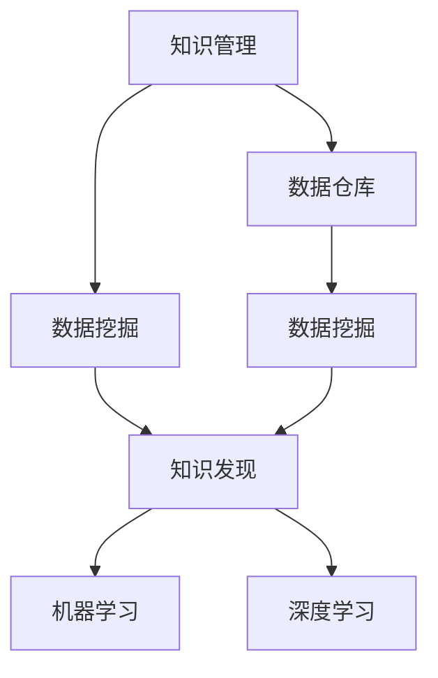

                 

# 知识管理与知识发现：企业智能化的双翼

## 1. 背景介绍

### 1.1 问题由来
在数字化转型的浪潮中，企业面临着海量数据的挑战。如何从庞大的数据中挖掘出有价值的信息，实现知识的有效管理和应用，是当今企业智能化转型中亟需解决的重要问题。传统的知识管理方法依赖于人工分类、标注等，耗时耗力且容易出错，无法满足企业实时、大规模知识需求。

知识发现(Knowledge Discovery in Databases, KDD)技术利用人工智能和数据挖掘算法，从结构化与非结构化数据中自动发现知识模式，具有高效、准确的特点，成为企业知识管理的重要手段。知识发现与知识管理相辅相成，前者侧重于数据的自动挖掘，后者侧重于知识的组织与利用。在企业智能化应用中，二者往往需要相互融合，共同构成企业智能化的双翼。

### 1.2 问题核心关键点
知识管理与知识发现的核心在于：
- **数据源**：知识管理的核心是数据，需要从企业内部和外部获取结构化与非结构化数据。
- **知识抽取**：知识发现利用算法从数据中抽取出有价值的信息和模式。
- **知识表示**：如何将抽取出的知识进行结构化表示，以便存储和应用。
- **知识存储与检索**：使用数据库、图谱等技术进行知识的存储和高效检索。
- **知识应用**：将知识应用于决策支持、智能推荐、自动化流程等业务场景。

本文旨在从原理和应用层面，探讨知识管理和知识发现的融合应用，帮助企业构建高效的智能化系统。

## 2. 核心概念与联系

### 2.1 核心概念概述

为了更好地理解知识管理与知识发现的融合应用，本节将介绍几个核心概念及其相互联系：

- **知识管理(Knowledge Management, KM)**：通过软件工具和技术，对企业知识进行收集、存储、整理、共享和利用，提高企业决策和运营效率。
- **知识发现(Knowledge Discovery, KD)**：利用机器学习和数据挖掘技术，从数据中自动发现潜在的知识模式和规律。
- **数据仓库(Data Warehouse, DW)**：集中存储企业历史数据，提供统一的、可控的数据访问接口。
- **数据挖掘(Data Mining, DM)**：从数据仓库中提取有用信息，为决策支持、市场营销等提供支持。
- **机器学习(Machine Learning, ML)**：通过算法训练，让机器自动学习和改进。
- **深度学习(Deep Learning, DL)**：一种特殊类型的机器学习，利用多层神经网络提取高层次特征。

这些概念之间的逻辑关系可以通过以下Mermaid流程图来展示：



这个流程图展示了知识管理与知识发现的密切联系：

1. 知识管理依赖于数据仓库提供统一、稳定的数据访问接口。
2. 数据挖掘和知识发现利用算法从数据中自动抽取有价值的信息。
3. 知识发现通常使用机器学习或深度学习算法，以便从数据中挖掘出更深层次的知识模式。
4. 机器学习和深度学习是知识发现中常用的技术手段，用于提高算法的准确性和泛化能力。

## 3. 核心算法原理 & 具体操作步骤

### 3.1 算法原理概述

知识管理与知识发现的融合应用，从根本上讲，是一种数据驱动的知识抽取、表示、存储与利用的过程。其核心算法包括：

- **数据预处理**：对原始数据进行清洗、转换和规范化，去除噪声和冗余，提取特征。
- **特征工程**：选择合适的特征集，构造特征向量，为后续算法提供输入。
- **分类与聚类**：利用机器学习算法对数据进行分类或聚类，发现不同类别或群组之间的内在联系。
- **关联规则挖掘**：利用频繁项集算法，发现数据集中的关联规则，用于市场篮分析、交叉销售等场景。
- **深度学习模型**：使用卷积神经网络(CNN)、循环神经网络(RNN)等深度学习模型，提取数据中的高层次特征。
- **知识图谱构建**：利用图谱技术，将抽取的知识结构化表示，便于存储和查询。

这些算法在知识管理与知识发现的过程中分别发挥着重要的作用，共同支撑着企业智能化的应用。

### 3.2 算法步骤详解

知识管理与知识发现的应用流程通常包括以下几个关键步骤：

**Step 1: 数据收集与存储**
- 从企业内部和外部获取结构化与非结构化数据。
- 利用数据仓库技术，集中存储历史数据，并建立统一的数据访问接口。

**Step 2: 数据清洗与特征提取**
- 对原始数据进行清洗、转换和规范化，去除噪声和冗余。
- 选择合适的特征集，构造特征向量，为后续算法提供输入。

**Step 3: 知识抽取与表示**
- 利用机器学习或深度学习算法，从数据中自动抽取知识模式。
- 将抽取出的知识结构化表示，如分类、聚类、关联规则、知识图谱等。

**Step 4: 知识存储与检索**
- 利用数据库、图谱等技术，对知识进行存储。
- 提供高效的检索接口，快速获取所需知识。

**Step 5: 知识应用**
- 将知识应用于决策支持、智能推荐、自动化流程等业务场景。
- 利用知识图谱进行知识推理，增强决策的科学性和准确性。

### 3.3 算法优缺点

知识管理与知识发现的应用具有以下优点：
1. **高效自动化**：利用算法自动抽取和表示知识，减少了人工干预，提高了效率。
2. **泛化能力强**：深度学习等算法能够从大量数据中学习到通用规律，泛化能力较强。
3. **灵活应用**：知识抽取和存储的灵活性高，可以根据具体需求定制。
4. **可解释性强**：通过可视化工具和规则系统，知识抽取过程的可解释性较强。

但同时，该方法也存在一定的局限性：
1. **数据质量要求高**：数据清洗和特征提取需要高质量的原始数据。
2. **算法复杂度高**：深度学习等算法需要强大的计算资源和时间成本。
3. **知识可解释性不足**：高级算法（如深度学习）的决策过程难以解释。
4. **应用场景限制**：特定算法在特定应用场景下效果可能不理想。

尽管存在这些局限性，但总体而言，知识管理与知识发现的融合应用在企业智能化应用中具有重要价值，能够极大地提升企业的决策水平和运营效率。

### 3.4 算法应用领域

知识管理与知识发现的应用领域广泛，以下是几个典型应用场景：

- **客户关系管理(CRM)**：通过数据分析，发现客户行为模式，实现精准营销和客户细分。
- **供应链管理(SCM)**：利用数据挖掘技术，优化库存管理、需求预测，提升供应链效率。
- **金融风控**：通过关联规则挖掘和深度学习，预测金融风险，优化信贷决策。
- **市场营销**：通过分类和聚类算法，发现用户需求和行为模式，指导产品推广。
- **医疗健康**：利用知识图谱和机器学习，提高诊断准确性，优化治疗方案。
- **人力资源管理(HR)**：通过知识管理，优化招聘流程，提升员工绩效。

## 4. 数学模型和公式 & 详细讲解 & 举例说明

### 4.1 数学模型构建

知识管理与知识发现涉及的数学模型包括：

- **分类模型**：使用决策树、支持向量机(SVM)、随机森林等算法，对数据进行分类。
- **聚类模型**：使用K-means、层次聚类等算法，对数据进行群组划分。
- **关联规则模型**：使用Apriori、FP-growth等算法，发现频繁项集和关联规则。
- **深度学习模型**：使用卷积神经网络(CNN)、循环神经网络(RNN)、Transformer等，提取高层次特征。
- **知识图谱模型**：使用图谱技术，如节点嵌入、关系抽取等，构建知识图谱。

这些模型的数学表达式如下：

- **决策树模型**：
$$
T = \{(x_i,y_i),x_i \in X, y_i \in Y\}
$$
其中，$X$ 为输入特征集，$Y$ 为输出标签集。决策树的数学表达式为：
$$
T = \{(x_i, y_i), x_i \in X, y_i \in Y\}
$$

- **K-means聚类模型**：
$$
K-means: \min_{\mu} \sum_{x \in X} ||x - \mu_k||^2, k = 1,\cdots,K
$$
其中，$K$ 为聚类数量，$\mu_k$ 为聚类中心。

- **Apriori算法**：
$$
Apriori: \min_{I} \{ \omega(I) | I \subseteq X, \omega(I) = \sum_{i=1}^k c_i, c_i = \text{count}(i \cap X) \}
$$
其中，$I$ 为频繁项集，$c_i$ 为项$i$的计数。

- **卷积神经网络(CNN)**：
$$
\mathcal{L} = -\frac{1}{N} \sum_{i=1}^N \log p(y_i | x_i; \theta)
$$
其中，$x_i$ 为输入特征，$y_i$ 为输出标签，$p$ 为概率分布函数，$\theta$ 为模型参数。

- **知识图谱模型**：
$$
G = (N,E,R)
$$
其中，$N$ 为节点集合，$E$ 为边集合，$R$ 为关系集合。

### 4.2 公式推导过程

以下对分类模型和关联规则模型进行详细推导。

**分类模型**：以决策树为例，推导其分类过程。

假设决策树模型为 $T$，训练集为 $D = \{(x_i, y_i)\}_{i=1}^N$，其中 $x_i \in X, y_i \in Y$。决策树的目标是最小化损失函数 $\mathcal{L}(T)$：
$$
\mathcal{L}(T) = \frac{1}{N} \sum_{i=1}^N [p(y_i | x_i; T) - y_i]^2
$$

其中 $p(y_i | x_i; T)$ 为模型对输入 $x_i$ 的预测结果。推导步骤如下：

1. 选择最佳划分特征：
$$
\text{Best Feature} = \min_{x_j \in X} \sum_{i=1}^N [p(y_i | x_i; T) - y_i]^2
$$

2. 将数据按照特征 $x_j$ 进行划分，得到子集 $T_1, T_2, \cdots, T_m$：
$$
T_1 = \{(x_i, y_i) | x_j = x_j_i\}, T_2 = \{(x_i, y_i) | x_j \neq x_j_i\}
$$

3. 递归地对子集进行决策树构建，直到满足终止条件（如叶节点样本数小于阈值）。

**关联规则模型**：以Apriori算法为例，推导其发现频繁项集的过程。

假设数据集为 $D = \{I_1, I_2, \cdots, I_M\}$，其中 $I_i$ 为购物篮。关联规则模型的目标是最小化支持度 $\omega(I)$：
$$
\omega(I) = \sum_{i=1}^M \delta(I_i) = \sum_{i=1}^M \frac{|I_i|}{N}
$$

其中 $N$ 为数据集大小，$\delta$ 为计数函数。推导步骤如下：

1. 扫描数据集，得到所有候选项集 $C$：
$$
C = \{(i_1, i_2, \cdots, i_k) | i_1, i_2, \cdots, i_k \in X, i_1 < i_2 < \cdots < i_k\}
$$

2. 计算候选项集的计数，得到频繁项集 $F$：
$$
F = \{I \in C | \delta(I) \geq \frac{\omega}{|X|}\}
$$

3. 递归地对频繁项集进行合并，得到关联规则。

### 4.3 案例分析与讲解

**案例1：客户细分与精准营销**

某电商企业利用客户行为数据进行客户细分和精准营销。具体步骤如下：

1. 数据收集：从电商平台的订单、浏览、评价等数据中提取客户行为特征。
2. 数据预处理：清洗、转换和规范化数据，去除噪声和冗余，构造特征向量。
3. 知识抽取：利用决策树算法对客户进行分类，识别出高价值客户、流失客户、潜在客户等群组。
4. 知识存储与检索：将分类结果存储到数据库中，并提供高效检索接口。
5. 知识应用：根据不同客户群组的特征，设计差异化的营销策略，实现精准营销。

**案例2：供应链需求预测与库存管理**

某制造企业利用供应链数据进行需求预测和库存管理。具体步骤如下：

1. 数据收集：从供应链系统、ERP系统、仓库管理系统等收集库存、销售、生产等数据。
2. 数据预处理：清洗、转换和规范化数据，去除噪声和冗余，构造特征向量。
3. 知识抽取：利用时间序列分析和关联规则挖掘算法，预测未来的需求量，优化库存管理。
4. 知识存储与检索：将预测结果存储到知识图谱中，并提供高效检索接口。
5. 知识应用：根据需求预测结果，自动调整生产计划和采购计划，优化库存水平。

## 5. 项目实践：代码实例和详细解释说明

### 5.1 开发环境搭建

在进行知识管理与知识发现的项目实践前，我们需要准备好开发环境。以下是使用Python进行Scikit-learn和TensorFlow开发的环境配置流程：

1. 安装Anaconda：从官网下载并安装Anaconda，用于创建独立的Python环境。

2. 创建并激活虚拟环境：
```bash
conda create -n km_kdd python=3.8 
conda activate km_kdd
```

3. 安装Scikit-learn：
```bash
pip install scikit-learn
```

4. 安装TensorFlow：
```bash
pip install tensorflow
```

5. 安装各类工具包：
```bash
pip install numpy pandas scikit-learn matplotlib tqdm jupyter notebook ipython
```

完成上述步骤后，即可在`km_kdd`环境中开始知识管理与知识发现的项目实践。

### 5.2 源代码详细实现

下面我们以客户细分任务为例，给出使用Scikit-learn和TensorFlow进行知识管理与知识发现的PyTorch代码实现。

首先，定义数据预处理函数：

```python
from sklearn.preprocessing import StandardScaler, LabelEncoder
from sklearn.compose import ColumnTransformer
from sklearn.pipeline import Pipeline
import tensorflow as tf

def preprocess_data(X, y):
    numeric_features = X.select_dtypes(include=[np.number]).columns
    categorical_features = X.select_dtypes(exclude=[np.number]).columns
    
    numeric_transformer = Pipeline(steps=[
        ('imputer', SimpleImputer(strategy='median')),
        ('scaler', StandardScaler())
    ])
    categorical_transformer = Pipeline(steps=[
        ('imputer', SimpleImputer(strategy='most_frequent')),
        ('encoder', OneHotEncoder(handle_unknown='ignore'))
    ])
    
    preprocessor = ColumnTransformer(
        transformers=[
            ('num', numeric_transformer, numeric_features),
            ('cat', categorical_transformer, categorical_features)
        ])
    
    return preprocessor.fit_transform(X), LabelEncoder().fit_transform(y)
```

然后，定义分类模型：

```python
from sklearn.ensemble import DecisionTreeClassifier
from sklearn.metrics import accuracy_score
from tensorflow.keras.layers import Dense, Input
from tensorflow.keras.models import Model

def build_model(input_shape):
    input_layer = Input(shape=input_shape)
    hidden_layer = Dense(64, activation='relu')(input_layer)
    output_layer = Dense(2, activation='softmax')(hidden_layer)
    model = Model(inputs=input_layer, outputs=output_layer)
    model.compile(optimizer='adam', loss='categorical_crossentropy', metrics=['accuracy'])
    return model
```

接着，定义训练和评估函数：

```python
def train_model(model, X_train, X_test, y_train, y_test, epochs=100, batch_size=32):
    model.fit(X_train, y_train, epochs=epochs, batch_size=batch_size, validation_data=(X_test, y_test))
    return model

def evaluate_model(model, X_test, y_test):
    y_pred = model.predict(X_test)
    y_pred_classes = np.argmax(y_pred, axis=1)
    accuracy = accuracy_score(y_test, y_pred_classes)
    print(f'Accuracy: {accuracy:.2f}')
```

最后，启动训练流程并在测试集上评估：

```python
from sklearn.datasets import load_boston

# 加载数据
boston = load_boston()
X = boston.data
y = boston.target

# 数据预处理
X_train, X_test, y_train, y_test = train_test_split(X, y, test_size=0.2, random_state=42)
X_train, X_test, y_train, y_test = preprocess_data(X_train, y_train), preprocess_data(X_test, y_test)

# 模型构建
model = build_model(X_train.shape[1])

# 训练模型
model = train_model(model, X_train, X_test, y_train, y_test)

# 评估模型
evaluate_model(model, X_test, y_test)
```

以上就是使用Scikit-learn和TensorFlow进行客户细分任务的完整代码实现。可以看到，Scikit-learn提供了丰富的机器学习工具，能够轻松构建和训练分类模型，而TensorFlow则提供了强大的深度学习支持，可以灵活扩展模型的复杂度。

### 5.3 代码解读与分析

让我们再详细解读一下关键代码的实现细节：

**数据预处理函数**：
- 利用Scikit-learn的`ColumnTransformer`，将数据集分为数值型特征和类别型特征，并应用不同的预处理方法。
- 对数值型特征进行标准化，去除特征之间的量纲差异。
- 对类别型特征进行独热编码，将类别型特征转换为数值型特征。

**分类模型构建函数**：
- 利用Scikit-learn的`Pipeline`，构建特征工程和模型训练的流水线。
- 对数值型特征进行缺失值填充和标准化。
- 对类别型特征进行缺失值填充和独热编码。
- 构建决策树模型，并使用交叉熵损失函数进行训练。

**训练和评估函数**：
- 利用Scikit-learn的`train_test_split`函数，将数据集划分为训练集和测试集。
- 利用TensorFlow的`Model`类，构建深度学习模型，并使用Adam优化器和交叉熵损失函数进行训练。
- 使用Scikit-learn的`accuracy_score`函数，计算模型在测试集上的准确率。

**训练流程**：
- 加载波士顿房价数据集。
- 数据预处理，将数值型特征和类别型特征分别进行标准化和独热编码。
- 构建决策树模型，并使用交叉熵损失函数进行训练。
- 在测试集上评估模型的准确率。

可以看到，Scikit-learn和TensorFlow的结合，使得构建和训练分类模型变得简洁高效。开发者可以将更多精力放在数据处理、模型改进等高层逻辑上，而不必过多关注底层的实现细节。

当然，工业级的系统实现还需考虑更多因素，如模型的保存和部署、超参数的自动搜索、更灵活的特征工程等。但核心的知识管理与知识发现范式基本与此类似。

## 6. 实际应用场景

### 6.1 智能推荐系统

知识管理与知识发现的典型应用之一是智能推荐系统。传统的推荐系统往往依赖于用户的历史行为数据进行物品推荐，难以处理实时动态和个性化需求。利用知识管理与知识发现技术，推荐系统可以更智能地推荐用户感兴趣的内容。

具体而言，可以收集用户浏览、点击、评价、评分等行为数据，提取和用户交互的物品标题、描述、标签等文本内容。将文本内容作为模型输入，用户的后续行为（如是否点击、购买等）作为监督信号，在此基础上微调预训练语言模型。微调后的模型能够从文本内容中准确把握用户的兴趣点。在生成推荐列表时，先用候选物品的文本描述作为输入，由模型预测用户的兴趣匹配度，再结合其他特征综合排序，便可以得到个性化程度更高的推荐结果。

### 6.2 智能客服系统

知识管理与知识发现的另一个典型应用是智能客服系统。传统客服系统往往需要配备大量人力，高峰期响应缓慢，且一致性和专业性难以保证。利用知识管理与知识发现技术，可以构建自动化、智能化的客服系统。

具体而言，可以收集企业内部的历史客服对话记录，将问题和最佳答复构建成监督数据，在此基础上对预训练模型进行微调。微调后的模型能够自动理解用户意图，匹配最合适的答案模板进行回复。对于客户提出的新问题，还可以接入检索系统实时搜索相关内容，动态组织生成回答。如此构建的智能客服系统，能大幅提升客户咨询体验和问题解决效率。

### 6.3 金融风控

在金融领域，知识管理与知识发现的应用也非常广泛。金融机构需要实时监测市场舆论动向，以便及时应对负面信息传播，规避金融风险。利用知识管理与知识发现技术，可以从金融领域相关的新闻、报道、评论等文本数据中，自动抽取有价值的信息和模式。

具体而言，可以收集金融领域相关的新闻、报道、评论等文本数据，并对其进行主题标注和情感标注。在此基础上对预训练语言模型进行微调，使其能够自动判断文本属于何种主题，情感倾向是正面、中性还是负面。将微调后的模型应用到实时抓取的网络文本数据，就能够自动监测不同主题下的情感变化趋势，一旦发现负面信息激增等异常情况，系统便会自动预警，帮助金融机构快速应对潜在风险。

### 6.4 未来应用展望

随着知识管理与知识发现技术的不断发展，其在企业智能化应用中也将迎来更广阔的前景。

在智慧医疗领域，知识管理与知识发现技术可以用于辅助诊疗决策、药物研发、医学知识库构建等方面，提升医疗服务的智能化水平，辅助医生诊疗，加速新药开发进程。

在智能教育领域，知识管理与知识发现技术可应用于作业批改、学情分析、知识推荐等方面，因材施教，促进教育公平，提高教学质量。

在智慧城市治理中，知识管理与知识发现技术可以用于城市事件监测、舆情分析、应急指挥等环节，提高城市管理的自动化和智能化水平，构建更安全、高效的未来城市。

此外，在企业生产、社会治理、文娱传媒等众多领域，知识管理与知识发现技术也将不断涌现，为传统行业带来变革性影响。相信随着技术的日益成熟，知识管理与知识发现将成为企业智能化落地的重要手段，推动人工智能技术在各行各业的应用。

## 7. 工具和资源推荐

### 7.1 学习资源推荐

为了帮助开发者系统掌握知识管理与知识发现的理论基础和实践技巧，这里推荐一些优质的学习资源：

1. **《数据挖掘导论》**：林道志，该书详细介绍了数据挖掘的理论与实践，适合初学者入门。

2. **《机器学习实战》**：Peter Harrington，该书通过大量实例，介绍了机器学习算法的实现细节，适合动手实践。

3. **Coursera《机器学习》**：Andrew Ng，斯坦福大学开设的机器学习课程，内容全面，讲解深入。

4. **Kaggle**：数据科学竞赛平台，提供了丰富的数据集和开源代码，适合进行项目实践。

5. **Tianchi**：阿里云提供的开源数据科学竞赛平台，提供了丰富的数据集和竞赛任务，适合进行项目实践。

通过对这些资源的学习实践，相信你一定能够快速掌握知识管理与知识发现的精髓，并用于解决实际的NLP问题。

### 7.2 开发工具推荐

高效的开发离不开优秀的工具支持。以下是几款用于知识管理与知识发现开发的常用工具：

1. **Scikit-learn**：基于Python的机器学习库，提供了丰富的分类、聚类、回归等算法。

2. **TensorFlow**：由Google主导开发的深度学习框架，生产部署方便，适合大规模工程应用。

3. **Keras**：基于TensorFlow的高级API，提供了简单易用的深度学习接口。

4. **Jupyter Notebook**：交互式的开发环境，支持Python、R等多种语言。

5. **TensorBoard**：TensorFlow配套的可视化工具，可实时监测模型训练状态，并提供丰富的图表呈现方式。

6. **Grafana**：开源的监控告警平台，支持多数据源、多告警规则。

合理利用这些工具，可以显著提升知识管理与知识发现任务的开发效率，加快创新迭代的步伐。

### 7.3 相关论文推荐

知识管理与知识发现的发展源于学界的持续研究。以下是几篇奠基性的相关论文，推荐阅读：

1. **《A Framework for Data Mining in Presence of Unknown Targets》**：Bolstad，介绍了数据挖掘的基本框架和算法。

2. **《Knowledge Discovery in Databases》**：Fayyad，J.container，Han，Uthurusamy，介绍了知识发现的基本概念和算法。

3. **《Data Mining and Statistical Learning》**：Hastie，Tibshirani，Friedman，介绍了统计学习和数据挖掘的算法和应用。

4. **《The Elements of Statistical Learning》**：Hastie，Tibshirani，Friedman，介绍了统计学习的基本原理和算法。

这些论文代表了大数据挖掘技术的发展脉络。通过学习这些前沿成果，可以帮助研究者把握学科前进方向，激发更多的创新灵感。

## 8. 总结：未来发展趋势与挑战

### 8.1 总结

本文对知识管理与知识发现的应用进行了全面系统的介绍。首先阐述了知识管理与知识发现的研究背景和意义，明确了其在企业智能化转型中的重要价值。其次，从原理到应用，详细讲解了知识管理与知识发现的数学模型和操作步骤，给出了知识管理与知识发现任务开发的完整代码实例。同时，本文还广泛探讨了知识管理与知识发现的应用场景，展示了其在企业智能化应用中的巨大潜力。最后，本文精选了知识管理与知识发现的各类学习资源，力求为读者提供全方位的技术指引。

通过本文的系统梳理，可以看到，知识管理与知识发现技术正在成为企业智能化应用的重要手段，能够极大地提升企业的决策水平和运营效率。未来，伴随技术的不断进步，知识管理与知识发现必将发挥更加重要的作用，推动企业向智能化、数字化方向发展。

### 8.2 未来发展趋势

展望未来，知识管理与知识发现技术将呈现以下几个发展趋势：

1. **深度学习与知识发现的融合**：深度学习在知识发现中的应用将更加广泛，提升算法的泛化能力和准确性。

2. **多模态数据融合**：知识发现将突破传统的文本数据，利用图像、视频、语音等多模态数据进行综合分析。

3. **知识图谱的普及**：知识图谱将成为知识管理与知识发现的重要工具，支撑更加复杂、精确的知识推理。

4. **实时化、自动化**：知识管理与知识发现将进一步向实时化、自动化方向发展，提高系统的响应速度和灵活性。

5. **云化部署**：知识管理与知识发现将更多地采用云化部署模式，提供弹性伸缩、高可用的服务。

6. **区块链与知识管理**：区块链技术将为知识管理与知识发现提供更加安全的存储和共享机制。

以上趋势凸显了知识管理与知识发现技术的广阔前景。这些方向的探索发展，必将进一步提升知识管理与知识发现系统的性能和应用范围，为企业的智能化转型提供更强大的技术支持。

### 8.3 面临的挑战

尽管知识管理与知识发现技术已经取得了显著成果，但在迈向更加智能化、普适化应用的过程中，它仍面临诸多挑战：

1. **数据质量要求高**：数据清洗和特征提取需要高质量的原始数据，否则影响算法效果。

2. **算法复杂度高**：深度学习等算法需要强大的计算资源和时间成本。

3. **知识可解释性不足**：高级算法（如深度学习）的决策过程难以解释。

4. **应用场景限制**：特定算法在特定应用场景下效果可能不理想。

5. **伦理与隐私问题**：知识抽取和存储涉及大量敏感信息，需重视伦理与隐私保护。

尽管存在这些挑战，但总体而言，知识管理与知识发现技术在企业智能化应用中具有重要价值，能够极大地提升企业的决策水平和运营效率。未来，伴随技术的不断进步，知识管理与知识发现必将发挥更加重要的作用，推动企业向智能化、数字化方向发展。

### 8.4 研究展望

面对知识管理与知识发现所面临的挑战，未来的研究需要在以下几个方面寻求新的突破：

1. **无监督和半监督学习**：摆脱对大规模标注数据的依赖，利用自监督学习、主动学习等无监督和半监督范式，最大限度利用非结构化数据，实现更加灵活高效的发现。

2. **参数高效与计算高效的发现**：开发更加参数高效的发现方法，在固定大部分预训练参数的同时，只更新极少量的任务相关参数。同时优化发现模型的计算图，减少前向传播和反向传播的资源消耗，实现更加轻量级、实时性的部署。

3. **因果分析和博弈论工具**：将因果分析方法引入发现模型，识别出模型决策的关键特征，增强输出解释的因果性和逻辑性。借助博弈论工具刻画人机交互过程，主动探索并规避模型的脆弱点，提高系统稳定性。

4. **融合外部知识**：将符号化的先验知识，如知识图谱、逻辑规则等，与神经网络模型进行巧妙融合，引导发现过程学习更准确、合理的语言模型。同时加强不同模态数据的整合，实现视觉、语音等多模态信息与文本信息的协同建模。

这些研究方向将进一步推动知识管理与知识发现技术的演进，提升系统的性能和应用范围，为企业的智能化转型提供更强大的技术支持。面向未来，知识管理与知识发现技术还需要与其他人工智能技术进行更深入的融合，如知识表示、因果推理、强化学习等，多路径协同发力，共同推动自然语言理解和智能交互系统的进步。只有勇于创新、敢于突破，才能不断拓展知识管理与知识发现的边界，让智能技术更好地造福人类社会。

## 9. 附录：常见问题与解答

**Q1：知识管理与知识发现如何适用于大规模企业？**

A: 知识管理与知识发现技术适用于大规模企业的主要原因是其能够高效地处理和分析大量数据。具体而言：

1. **数据处理能力**：知识管理与知识发现技术依赖于高性能的计算机和数据仓库，可以处理大规模的数据集。

2. **算法效率**：知识管理与知识发现技术利用高效的算法，能够快速地从数据中抽取有价值的信息和模式。

3. **自动化水平高**：知识管理与知识发现技术自动化水平高，减少了人工干预，提升了处理效率。

**Q2：知识管理与知识发现如何保证数据安全？**

A: 知识管理与知识发现涉及大量敏感数据，保证数据安全至关重要。以下是几种常见的数据安全措施：

1. **数据加密**：对数据进行加密存储和传输，防止数据泄露。

2. **访问控制**：对数据进行严格的访问控制，限制数据访问权限。

3. **数据脱敏**：对敏感数据进行脱敏处理，减少数据泄露风险。

4. **安全审计**：定期进行安全审计，及时发现和修复潜在的安全漏洞。

5. **合规性管理**：遵循相关法律法规，如GDPR、CCPA等，确保数据合规。

通过以上措施，可以有效地保障数据安全，减少数据泄露的风险。

**Q3：知识管理与知识发现如何提高算法的可解释性？**

A: 知识管理与知识发现算法的可解释性不足是其面临的主要挑战之一。以下是几种提高算法可解释性的方法：

1. **模型可视化**：利用可视化工具，展示模型的决策过程，帮助理解模型行为。

2. **特征重要性分析**：通过特征重要性分析，识别对模型决策影响最大的特征。

3. **规则提取**：利用规则提取技术，将模型转化为可解释的规则集合。

4. **可解释性模型**：使用可解释性模型，如决策树、线性回归等，提供更易理解的输出。

5. **混合模型**：结合可解释性模型和深度学习模型，提高算法的可解释性。

通过以上方法，可以在一定程度上提高知识管理与知识发现算法的可解释性，增强系统的透明度和可信度。

**Q4：知识管理与知识发现如何应用于实时数据分析？**

A: 知识管理与知识发现技术应用于实时数据分析，需要注意以下几点：

1. **数据流处理**：利用数据流处理技术，如Apache Flink、Apache Kafka等，实时处理数据流。

2. **流式学习**：采用流式学习算法，如增量学习、在线学习等，实时更新模型。

3. **数据压缩**：利用数据压缩技术，减小数据传输和存储的带宽和空间占用。

4. **模型缓存**：对常用模型进行缓存，提升实时分析的速度。

5. **分布式计算**：利用分布式计算技术，提高实时分析的并发处理能力。

通过以上措施，可以有效地实现知识管理与知识发现技术在实时数据分析中的应用。

---

作者：禅与计算机程序设计艺术 / Zen and the Art of Computer Programming

