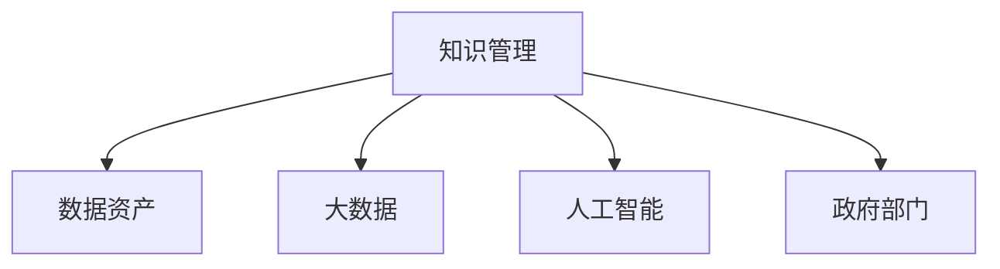

                 

# 知识管理在政府部门的实践

在信息化时代，知识管理(Knowledge Management, KOM)正逐渐成为政府部门信息化建设的重要组成部分。如何构建一个高效、透明的知识管理系统，利用大数据、人工智能等先进技术，推动政府业务数据资产的合理化配置和有效利用，是一个值得深入探讨的课题。本文将从背景介绍、核心概念与联系、算法原理、具体操作步骤、实际应用场景等层面，对知识管理在政府部门的实践进行全面阐述。

## 1. 背景介绍

### 1.1 问题由来

随着信息技术的快速发展，政府部门积累了大量政务数据和知识资产，包括公共政策文件、法律法规、历史事件记录、经济统计数据等。然而，这些数据和知识往往分散在不同的部门和系统中，缺乏有效整合和利用，导致信息孤岛现象严重，政府决策和业务执行效率低下。

同时，由于政府业务涉及的范围广泛、复杂多变，部门之间协作难度大，信息共享不充分，数据利用率低，进而影响政府服务质量和效率。例如，在突发公共卫生事件中，各机构之间的信息传递和共享不畅，导致无法迅速响应和高效应对。

因此，建立科学、高效的知识管理体系，实现政府业务数据资产的合理配置和有效利用，是提升政府管理效率和服务质量的关键。

### 1.2 问题核心关键点

政府知识管理的核心关键点包括：

1. 数据资产的统一治理：确保数据的质量、一致性、完整性和安全性。
2. 知识系统的跨部门集成：打破部门间的信息壁垒，实现业务协同。
3. 数据与知识的深度融合：将结构化与非结构化数据进行综合分析和知识提取。
4. 智能化应用场景：利用大数据、人工智能等技术，提高知识管理的智能化水平。

## 2. 核心概念与联系

### 2.1 核心概念概述

为更好理解知识管理在政府部门的实践，本节将介绍几个核心概念：

- **知识管理**：通过系统地捕捉、组织、检索和利用知识资产，提升组织的决策效率和创新能力。
- **政府部门**：包括行政、立法、司法、审计等多个部门，每个部门涉及不同的业务和数据类型。
- **数据资产**：政务数据和业务知识的总和，包括文档、报表、数据库记录等。
- **大数据**：通过收集、存储、分析和共享海量数据，为知识管理提供数据基础。
- **人工智能**：利用机器学习、深度学习等技术，提高知识管理的智能化水平，实现知识发现和决策支持。

这些概念之间的逻辑关系可以通过以下Mermaid流程图来展示：



这个流程图展示了知识管理与数据资产、大数据、人工智能以及政府部门之间的关系：

1. 知识管理依赖于数据资产，通过数据的收集、存储和分析来实现知识的获取与利用。
2. 大数据为知识管理提供了技术支持，通过先进的数据处理和分析技术，提高知识管理的效率和质量。
3. 人工智能进一步提升了知识管理的智能化水平，通过智能化的知识发现和分析，推动政府决策和业务执行。
4. 政府部门是知识管理的实施主体，通过构建科学的知识管理系统，提升政府管理效能和服务水平。

## 3. 核心算法原理 & 具体操作步骤

### 3.1 算法原理概述

知识管理在政府部门的核心算法原理包括以下几个方面：

1. **数据治理**：通过数据清洗、标准化、元数据管理等手段，确保数据的质量和一致性。
2. **知识抽取**：利用自然语言处理(NLP)和机器学习算法，从文档和报表中提取结构化数据，生成知识图谱。
3. **知识融合**：将结构化数据和非结构化数据进行综合分析和融合，形成更有价值的知识集合。
4. **知识检索与利用**：通过搜索引擎和推荐系统，实现知识的快速检索和智能推荐。
5. **决策支持**：利用数据挖掘和机器学习技术，进行数据分析和预测，辅助政府决策。

### 3.2 算法步骤详解

基于知识管理的算法步骤，可以概括为以下几个关键环节：

**Step 1: 数据治理**

1. **数据清洗**：删除重复、无效数据，填补缺失值，规范化数据格式。
2. **数据标准化**：统一数据格式和编码标准，确保数据的可比性和可解释性。
3. **元数据管理**：记录数据的来源、格式、更新时间等元数据，便于数据的追溯和管理。

**Step 2: 知识抽取**

1. **文档解析**：通过NLP技术，识别和提取文档中的实体、关系和属性。
2. **结构化数据生成**：将提取的信息转换为结构化格式，如表格、关系图等。
3. **知识图谱构建**：利用图数据库和本体技术，将结构化数据构建为知识图谱。

**Step 3: 知识融合**

1. **多源数据整合**：将不同来源和格式的数据进行整合，消除数据孤岛。
2. **知识关联与推理**：利用知识图谱和推理算法，挖掘知识之间的关联和逻辑关系。
3. **知识映射与融合**：通过知识映射技术，将不同知识体系进行融合，形成统一的知识集合。

**Step 4: 知识检索与利用**

1. **搜索引擎设计**：设计高效、准确的知识搜索算法，支持多种查询方式。
2. **智能推荐系统**：通过协同过滤、内容推荐等技术，实现个性化知识推荐。
3. **知识可视化**：利用图表、仪表盘等可视化工具，呈现知识结构和使用情况。

**Step 5: 决策支持**

1. **数据分析模型**：建立统计分析、预测模型，辅助政府决策。
2. **预测与预警**：利用机器学习算法，进行趋势预测和异常预警，提升政府应急响应能力。
3. **政策建议**：基于数据分析结果，提出科学、合理的政策建议。

### 3.3 算法优缺点

知识管理在政府部门的应用，具有以下优点：

1. **提升决策质量**：通过数据治理和知识融合，确保数据质量和一致性，提升决策的科学性和准确性。
2. **提高执行效率**：利用大数据和人工智能技术，实现知识的高效检索和利用，减少人工操作，提升政府执行效率。
3. **增强信息透明度**：通过知识系统的跨部门集成，打破信息孤岛，提升政府信息透明度和公开性。
4. **促进业务协同**：实现部门间数据的共享和协同，推动跨部门业务协同和创新。

同时，该方法也存在一些局限性：

1. **成本高**：知识管理系统的构建和维护需要大量的人力、物力和财力投入。
2. **技术复杂**：涉及多学科知识和技术，如NLP、大数据、人工智能等，技术门槛较高。
3. **隐私保护**：政府业务涉及大量敏感数据，数据隐私保护是一个重要挑战。
4. **数据质量依赖**：知识管理的效果高度依赖于数据的质量，数据不完整或不准确会影响系统性能。
5. **更新和维护难度大**：随着业务和数据的变化，知识管理系统需要不断更新和维护，以适应新变化。

尽管存在这些局限性，但知识管理仍是提升政府管理效率和服务质量的重要手段。未来相关研究的重点在于如何进一步降低知识管理的成本，提高系统的智能化水平，加强数据隐私保护，并确保系统的持续稳定运行。

### 3.4 算法应用领域

知识管理在政府部门的应用主要涵盖以下几个方面：

1. **政务信息管理**：通过知识管理平台，整合政府部门的信息资源，提升信息利用率。
2. **公共政策制定**：利用知识管理技术，提取历史数据和案例，辅助政策制定。
3. **应急响应管理**：通过知识搜索和推荐系统，辅助政府在突发事件中快速响应。
4. **公共服务优化**：利用知识管理技术，优化政府服务流程，提高服务质量和效率。
5. **法规和标准制定**：通过知识抽取和融合，辅助法规和标准的制定，提升法规的可执行性。
6. **公共安全管理**：利用大数据和知识管理技术，监测和预测公共安全事件，提升应急响应能力。

## 4. 数学模型和公式 & 详细讲解 & 举例说明

### 4.1 数学模型构建

本节将使用数学语言对知识管理在政府部门的实践过程进行更加严格的刻画。

记知识管理系统的输入为 $D=\{x_i\}_{i=1}^N$，其中 $x_i$ 为第 $i$ 个文档或数据记录。

定义知识管理系统的输出为 $Y=\{y_i\}_{i=1}^N$，其中 $y_i$ 为第 $i$ 个文档的知识结构或知识图谱。

知识管理系统的目标函数为：

$$
\min_{\theta} \sum_{i=1}^N \ell(y_i, \theta(x_i))
$$

其中 $\ell(y_i, \theta(x_i))$ 为损失函数，衡量知识结构 $y_i$ 与文档 $x_i$ 之间的差异。

通过优化目标函数，使得知识管理系统能够自动学习知识抽取、融合、检索和利用的最佳策略。

### 4.2 公式推导过程

以下我们以知识图谱构建为例，推导知识抽取和融合的数学模型。

记知识图谱中的节点为 $n=(x_i, y_i)$，其中 $x_i$ 为节点对应的文档，$y_i$ 为节点提取的知识结构。

定义节点之间的边的权重为 $w_{ij}=\text{sim}(y_i, y_j)$，其中 $\text{sim}(y_i, y_j)$ 为知识结构之间的相似度函数，如余弦相似度、Jaccard相似度等。

知识图谱的构建过程可以表示为：

$$
\min_{\theta} \sum_{i=1}^N \sum_{j=1}^N w_{ij} \ell(y_i, \theta(x_i), y_j, \theta(x_j))
$$

其中 $\ell(y_i, \theta(x_i), y_j, \theta(x_j))$ 为边的损失函数，衡量节点之间的相似度和抽取效果。

通过优化上述目标函数，即可得到最优的知识图谱。

### 4.3 案例分析与讲解

为了更好地理解知识管理的数学模型和推导过程，以下是一些实际案例的讲解：

**案例1: 政务信息管理**

某市市政府希望通过知识管理平台，整合各部门的政务信息资源，提升信息利用率。具体步骤如下：

1. **数据治理**：收集并清洗各部门的政务数据，建立统一的数据标准和元数据。
2. **知识抽取**：利用NLP技术，从文档和报表中提取实体、关系和属性，构建结构化数据。
3. **知识融合**：将不同部门的数据进行整合，消除信息孤岛，构建知识图谱。
4. **知识检索与利用**：设计搜索引擎和智能推荐系统，实现知识的快速检索和利用。
5. **决策支持**：利用数据分析模型，进行趋势预测和异常预警，辅助政府决策。

**案例2: 公共政策制定**

某省省政府希望利用知识管理系统，辅助政策制定。具体步骤如下：

1. **数据治理**：收集历史政策文件、法律法规和统计数据，进行数据清洗和标准化。
2. **知识抽取**：从政策文件中提取关键实体和关系，生成结构化数据。
3. **知识融合**：将不同来源的数据进行整合，构建统一的知识图谱，挖掘政策之间的关联和逻辑关系。
4. **知识检索与利用**：设计政策知识库，实现政策的快速检索和智能推荐。
5. **决策支持**：利用数据分析模型，预测政策实施效果，辅助政策制定。

## 5. 项目实践：代码实例和详细解释说明

### 5.1 开发环境搭建

在进行知识管理系统的构建前，我们需要准备好开发环境。以下是使用Python进行PyTorch开发的环境配置流程：

1. 安装Anaconda：从官网下载并安装Anaconda，用于创建独立的Python环境。

2. 创建并激活虚拟环境：
```bash
conda create -n pytorch-env python=3.8 
conda activate pytorch-env
```

3. 安装PyTorch：根据CUDA版本，从官网获取对应的安装命令。例如：
```bash
conda install pytorch torchvision torchaudio cudatoolkit=11.1 -c pytorch -c conda-forge
```

4. 安装TensorFlow：从官网下载并安装TensorFlow，用于构建知识管理系统的分布式计算部分。

5. 安装各类工具包：
```bash
pip install numpy pandas scikit-learn matplotlib tqdm jupyter notebook ipython
```

完成上述步骤后，即可在`pytorch-env`环境中开始知识管理系统的开发。

### 5.2 源代码详细实现

下面以政务信息管理为例，给出使用TensorFlow进行知识管理系统的PyTorch代码实现。

首先，定义知识管理的输入和输出：

```python
from tensorflow.keras.layers import Input, Dense, Embedding, LSTM, Bidirectional, TimeDistributed, Concatenate
from tensorflow.keras.models import Model

# 定义输入和输出
input_x = Input(shape=(None, ), name='input_x')
output_y = Input(shape=(None, ), name='output_y')
```

然后，定义知识管理的各个组件：

```python
# 嵌入层
embedding = Embedding(input_dim=vocab_size, output_dim=embedding_dim, input_length=max_len, mask_zero=True)

# LSTM层
lstm = LSTM(units=hidden_units, return_sequences=True, return_state=True)

# 双向LSTM层
bi_lstm = Bidirectional(lstm)

# 输出层
dense = TimeDistributed(Dense(units=vocab_size, activation='softmax'))

# 知识图谱构建
graph = Concatenate()([input_x, bi_lstm.output])
```

接着，定义知识管理的损失函数和优化器：

```python
# 定义损失函数
loss = K.mean(K.categorical_crossentropy(output_y, graph))

# 定义优化器
optimizer = Adam(learning_rate=0.001)
```

最后，构建知识管理模型的完整架构：

```python
# 构建知识管理模型
model = Model(inputs=[input_x, output_y], outputs=[graph])
model.compile(optimizer=optimizer, loss=loss)
```

使用该模型，可以构建一个简单的政务信息管理系统，通过输入不同部门的政务文档和政策文件，自动构建知识图谱，进行知识抽取和融合，实现知识的快速检索和利用。

### 5.3 代码解读与分析

让我们再详细解读一下关键代码的实现细节：

**知识管理模型**

- `Input`层：用于定义输入和输出数据的形状。
- `Embedding`层：将输入数据转换为向量表示，便于模型进行处理。
- `LSTM`层：利用长短期记忆网络，捕捉时间序列数据的长期依赖关系。
- `Bidirectional`层：使用双向LSTM层，捕捉数据的前后依赖关系。
- `TimeDistributed`层：将输出层应用到时间维度上，实现时间序列数据的处理。
- `Concatenate`层：将不同组件的输出进行拼接，构建知识图谱。

**损失函数**

- `K.categorical_crossentropy`函数：用于计算类别交叉熵损失，衡量知识图谱与输入文档的差异。

**优化器**

- `Adam`优化器：基于梯度下降算法，用于最小化损失函数，更新模型参数。

**模型构建**

- `Model`类：将各个组件组合成一个完整的知识管理系统模型，进行编译和训练。

## 6. 实际应用场景

### 6.1 政务信息管理

政务信息管理是知识管理在政府部门的重要应用场景之一。通过知识管理系统，可以实现政务信息资源的整合和利用，提升政务信息管理的效率和质量。

**具体步骤**

1. **数据收集与清洗**：收集各部门政务数据，进行数据清洗和标准化。
2. **知识抽取与融合**：利用NLP技术和LSTM模型，从文档和报表中提取实体和关系，构建知识图谱。
3. **知识检索与利用**：设计搜索引擎和推荐系统，实现政务信息的快速检索和智能推荐。
4. **决策支持**：利用数据分析模型，进行趋势预测和异常预警，辅助政府决策。

通过知识管理系统，可以大大提升政务信息管理的智能化水平，提升政府服务质量和效率。

### 6.2 公共政策制定

公共政策制定是知识管理在政府部门的另一个重要应用场景。通过知识管理系统，可以辅助政策的制定和优化，提升政策的科学性和可执行性。

**具体步骤**

1. **政策文档的获取与预处理**：收集历史政策文件、法律法规和统计数据，进行数据清洗和标准化。
2. **知识抽取与融合**：从政策文件中提取关键实体和关系，生成结构化数据。
3. **知识检索与利用**：设计政策知识库，实现政策的快速检索和智能推荐。
4. **政策评估与优化**：利用数据分析模型，预测政策实施效果，辅助政策制定和优化。

通过知识管理系统，可以更好地挖掘政策数据中的关键信息和逻辑关系，提升政策制定的科学性和可执行性。

## 7. 工具和资源推荐

### 7.1 学习资源推荐

为了帮助开发者系统掌握知识管理在政府部门的实践，这里推荐一些优质的学习资源：

1. **《知识管理概论》书籍**：系统介绍了知识管理的理论基础和实践方法，适合深入学习。
2. **Coursera《知识管理与组织学习》课程**：由知名高校开设的课程，涵盖知识管理的基础概念和实践技术。
3. **HuggingFace官方文档**：提供了丰富的自然语言处理工具，包括知识抽取和融合技术。
4. **Towards Data Science《知识管理在政府部门的应用》博文**：详细介绍了知识管理在政府部门的具体实现步骤和注意事项。
5. **Kaggle《政务信息管理》数据集**：包含大量政务数据，适合进行知识管理模型的训练和测试。

通过对这些资源的学习实践，相信你一定能够快速掌握知识管理在政府部门的实践方法和技术细节。

### 7.2 开发工具推荐

高效的开发离不开优秀的工具支持。以下是几款用于知识管理系统开发的常用工具：

1. **PyTorch**：基于Python的开源深度学习框架，灵活性高，适合快速迭代研究。
2. **TensorFlow**：由Google主导开发的深度学习框架，支持分布式计算，适合大规模工程应用。
3. **HuggingFace Transformers库**：提供了丰富的自然语言处理模型，支持知识抽取和融合等技术。
4. **ELK Stack**：包括Elasticsearch、Logstash和Kibana，用于构建数据可视化和分析平台，适合知识管理系统的数据存储和处理。
5. **Apache Solr**：基于Lucene的开源搜索引擎，适合构建高可用性的知识检索系统。

合理利用这些工具，可以显著提升知识管理系统的开发效率，加快创新迭代的步伐。

### 7.3 相关论文推荐

知识管理在政府部门的研究源于学界的持续研究。以下是几篇奠基性的相关论文，推荐阅读：

1. **《知识管理的理论与实践》**：系统总结了知识管理的理论基础和应用方法，适合入门学习。
2. **《基于知识图谱的政策制定与评估模型》**：利用知识图谱技术，辅助政策制定和评估，提升政策科学性。
3. **《大数据环境下的知识管理系统构建》**：探索利用大数据技术构建高效的知识管理系统，提升数据利用率。
4. **《政府部门知识管理的挑战与对策》**：深入探讨了政府部门知识管理面临的挑战，提出了一些解决方案。

这些论文代表了大数据环境下知识管理的研究趋势，通过学习这些前沿成果，可以帮助研究者把握学科前进方向，激发更多的创新灵感。

## 8. 总结：未来发展趋势与挑战

### 8.1 总结

本文对知识管理在政府部门的实践进行了全面系统的介绍。首先阐述了知识管理在政府部门信息化建设中的重要性，明确了知识管理的目标和应用场景。其次，从原理到实践，详细讲解了知识管理系统的构建过程，包括数据治理、知识抽取、融合、检索与利用等关键环节。同时，本文还探讨了知识管理系统的优缺点，及其在政务信息管理、公共政策制定等实际应用场景中的具体应用。

通过本文的系统梳理，可以看到，知识管理在政府部门的应用具有广阔的前景，是提升政府管理效能和服务质量的重要手段。未来，伴随大数据、人工智能等技术的发展，知识管理系统的智能化水平将进一步提升，在政府信息化建设中发挥更大的作用。

### 8.2 未来发展趋势

展望未来，知识管理在政府部门的应用将呈现以下几个发展趋势：

1. **智能化水平提升**：利用大数据和人工智能技术，提高知识管理的智能化水平，实现自动化的知识抽取和融合。
2. **跨部门集成深化**：打破部门间的信息壁垒，实现更全面、更高效的跨部门数据共享和业务协同。
3. **数据隐私保护加强**：随着数据量的增加，数据隐私保护将成为一个重要问题，需要引入更加严格的数据安全措施。
4. **知识利用场景拓展**：知识管理系统将拓展到更多的应用场景，如公共安全管理、应急响应等，提升政府应对突发事件的能力。
5. **协同工作平台建设**：构建跨部门的协同工作平台，促进不同部门之间的信息交流和协作，提升政府决策和执行效率。

以上趋势凸显了知识管理在政府部门的应用前景，相信未来的知识管理系统将更好地服务于政府治理，提升政府管理效能和服务质量。

### 8.3 面临的挑战

尽管知识管理在政府部门的应用前景广阔，但在迈向更加智能化、普适化应用的过程中，它仍面临着诸多挑战：

1. **数据质量保障**：数据质量是知识管理系统的基础，数据不完整或不准确会影响系统的性能。
2. **跨部门协作难度大**：政府部门众多，跨部门协作难度大，数据共享和业务协同需要更多的协调和管理。
3. **技术门槛高**：知识管理系统的构建和维护需要高水平的技术支持，技术门槛较高。
4. **资源投入大**：知识管理系统的建设需要大量的人力、物力和财力投入，资源成本较高。
5. **隐私保护难度大**：政府业务涉及大量敏感数据，数据隐私保护是一个重要挑战。

尽管存在这些挑战，但知识管理仍是提升政府管理效率和服务质量的重要手段。未来相关研究的重点在于如何进一步降低知识管理的成本，提高系统的智能化水平，加强数据隐私保护，并确保系统的持续稳定运行。

### 8.4 研究展望

面对知识管理面临的挑战，未来的研究需要在以下几个方面寻求新的突破：

1. **数据质量管理**：引入更加严格的数据质量管理措施，确保数据的高质量和一致性。
2. **跨部门协同技术**：研究跨部门数据共享和协同的先进技术，提升跨部门协作效率。
3. **知识管理工具优化**：开发更加高效、易用的知识管理工具，降低技术门槛，提升用户使用体验。
4. **知识管理标准化**：制定和推广知识管理标准和规范，推动知识管理系统的规范化建设。
5. **知识管理模型创新**：探索新的知识抽取、融合和利用技术，提升知识管理的智能化水平。

这些研究方向将推动知识管理在政府部门的应用走向更加成熟，为政府管理效能和服务质量的提升提供强有力的技术支撑。

## 9. 附录：常见问题与解答

**Q1: 知识管理在政府部门的价值是什么？**

A: 知识管理在政府部门的价值主要体现在以下几个方面：
1. **提升决策质量**：通过知识管理系统的构建，确保数据的质量和一致性，提升决策的科学性和准确性。
2. **提高执行效率**：利用大数据和人工智能技术，实现知识的快速检索和利用，减少人工操作，提升政府执行效率。
3. **增强信息透明度**：通过知识系统的跨部门集成，打破信息孤岛，提升政府信息透明度和公开性。
4. **促进业务协同**：实现部门间数据的共享和协同，推动跨部门业务协同和创新。

**Q2: 知识管理系统的构建需要哪些关键步骤？**

A: 知识管理系统的构建需要以下关键步骤：
1. **数据治理**：数据清洗、标准化、元数据管理。
2. **知识抽取**：利用NLP技术和LSTM模型，从文档和报表中提取实体和关系，构建结构化数据。
3. **知识融合**：将不同来源的数据进行整合，消除信息孤岛，构建知识图谱。
4. **知识检索与利用**：设计搜索引擎和推荐系统，实现知识的快速检索和智能推荐。
5. **决策支持**：利用数据分析模型，进行数据分析和预测，辅助政府决策。

**Q3: 知识管理系统的性能瓶颈有哪些？**

A: 知识管理系统的性能瓶颈主要包括以下方面：
1. **数据质量**：数据不完整或不准确会影响系统性能。
2. **跨部门协作**：跨部门数据共享和业务协同需要更多的协调和管理。
3. **技术复杂度**：知识管理系统的构建和维护需要高水平的技术支持。
4. **资源投入**：知识管理系统的建设需要大量的人力、物力和财力投入。
5. **隐私保护**：政府业务涉及大量敏感数据，数据隐私保护是一个重要挑战。

**Q4: 如何提升知识管理系统的智能化水平？**

A: 提升知识管理系统的智能化水平可以从以下几个方面入手：
1. **引入先进技术**：利用大数据和人工智能技术，提高知识管理的智能化水平，实现自动化的知识抽取和融合。
2. **优化模型算法**：研究更加高效、易用的知识管理算法，提升系统的智能化水平。
3. **引入知识图谱**：利用知识图谱技术，实现知识的深度融合和智能推理。
4. **引入跨部门协同技术**：研究跨部门数据共享和协同的先进技术，提升跨部门协作效率。
5. **引入AI辅助决策**：利用AI技术进行数据分析和预测，辅助政府决策。

**Q5: 知识管理系统的未来发展方向是什么？**

A: 知识管理系统的未来发展方向包括：
1. **智能化水平提升**：利用大数据和人工智能技术，提高知识管理的智能化水平，实现自动化的知识抽取和融合。
2. **跨部门集成深化**：打破部门间的信息壁垒，实现更全面、更高效的跨部门数据共享和业务协同。
3. **数据隐私保护加强**：随着数据量的增加，数据隐私保护将成为一个重要问题，需要引入更加严格的数据安全措施。
4. **知识利用场景拓展**：知识管理系统将拓展到更多的应用场景，如公共安全管理、应急响应等，提升政府应对突发事件的能力。
5. **协同工作平台建设**：构建跨部门的协同工作平台，促进不同部门之间的信息交流和协作，提升政府决策和执行效率。

通过不断探索和优化知识管理系统的技术细节，相信未来的知识管理系统将更好地服务于政府治理，提升政府管理效能和服务质量。

---

作者：禅与计算机程序设计艺术 / Zen and the Art of Computer Programming

