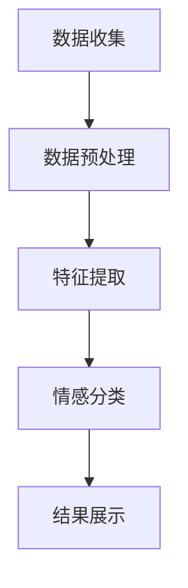

                 

# 文章标题

AI大模型在电商平台商品评价情感分析中的应用

关键词：人工智能，商品评价，情感分析，电商平台，大模型

摘要：本文探讨了如何利用人工智能大模型对电商平台商品评价进行情感分析，通过深入分析大模型的工作原理和具体应用步骤，展示了其在实际场景中的价值。文章旨在为相关领域的从业者提供一套完整的解决方案，助力电商平台提升用户体验和运营效率。

## 1. 背景介绍

随着电子商务的快速发展，电商平台上的商品评价量呈爆炸式增长。这些评价不仅反映了消费者的购买体验，还为其他潜在买家提供了宝贵的参考信息。然而，海量的评价数据给情感分析带来了巨大的挑战。传统的情感分析技术，如基于规则的方法和基于机器学习的方法，在面对复杂、多样且含糊的评价时，往往难以取得令人满意的效果。

近年来，人工智能大模型，如GPT-3、BERT和T5等，凭借其强大的预训练能力和自适应学习能力，在自然语言处理领域取得了突破性进展。这些大模型不仅能够捕捉到文本中的深层语义信息，还能在多种复杂的场景下实现高效的情感分析。因此，本文旨在探讨如何将人工智能大模型应用于电商平台商品评价的情感分析中，以提升分析的准确性和用户体验。

## 2. 核心概念与联系

### 2.1 什么是情感分析？

情感分析（Sentiment Analysis），又称意见挖掘，是指通过自然语言处理技术，对文本数据中的主观性信息进行分析和分类，从而判断出文本表达的情感倾向。情感分析通常包括正面情感、中性情感和负面情感三个类别。

### 2.2 人工智能大模型的工作原理

人工智能大模型，如GPT-3、BERT等，通常通过深度学习技术进行预训练。预训练的过程包括两个主要步骤：

1. **数据预处理**：收集大量互联网上的文本数据，如新闻报道、社交媒体评论、电商平台评价等，并进行预处理，如文本清洗、分词、词性标注等。

2. **预训练**：在预处理后的数据上，使用神经网络模型进行大规模的参数训练，使其能够自动捕捉到文本中的语义信息。

### 2.3 情感分析在电商平台商品评价中的应用

电商平台商品评价的情感分析主要包括以下几个步骤：

1. **数据收集**：从电商平台上收集商品评价数据，包括评价文本、评价时间、评价用户等。

2. **数据预处理**：对评价文本进行清洗、分词、词性标注等预处理操作。

3. **特征提取**：使用预训练的大模型，将预处理后的文本转化为高维度的向量表示。

4. **情感分类**：利用训练好的情感分类模型，对特征向量进行分类，判断评价文本的情感倾向。

5. **结果展示**：将情感分类结果以可视化的形式展示给用户，帮助用户快速了解商品的评价情感。

### 2.4 Mermaid 流程图



## 3. 核心算法原理 & 具体操作步骤

### 3.1 数据收集

电商平台商品评价的数据收集通常包括以下几个步骤：

1. **API接口访问**：通过电商平台的API接口，获取商品评价数据。

2. **数据存储**：将收集到的评价数据存储到数据库中，以便后续处理。

### 3.2 数据预处理

数据预处理是情感分析的关键步骤，主要包括以下操作：

1. **文本清洗**：去除评价文本中的HTML标签、符号和停用词。

2. **分词**：将评价文本拆分成单个词语。

3. **词性标注**：对每个词语进行词性标注，以便后续特征提取。

### 3.3 特征提取

特征提取是利用预训练的大模型，将预处理后的文本转化为高维度的向量表示。具体步骤如下：

1. **加载预训练模型**：加载预训练的大模型，如BERT。

2. **文本编码**：将预处理后的文本编码为模型理解的向量表示。

3. **特征提取**：使用模型对编码后的文本进行特征提取，得到高维度的特征向量。

### 3.4 情感分类

情感分类是利用训练好的情感分类模型，对特征向量进行分类。具体步骤如下：

1. **加载情感分类模型**：加载已经训练好的情感分类模型。

2. **模型预测**：将特征向量输入到情感分类模型中，得到预测结果。

3. **结果评估**：对预测结果进行评估，如准确率、召回率等。

### 3.5 结果展示

结果展示是将情感分类结果以可视化的形式展示给用户。具体步骤如下：

1. **数据可视化**：使用图表、柱状图、饼图等可视化工具，将情感分类结果展示给用户。

2. **用户交互**：提供用户交互功能，如查看详细评价、筛选评价等。

## 4. 数学模型和公式 & 详细讲解 & 举例说明

### 4.1 数学模型

在情感分析中，常用的数学模型包括：

1. **朴素贝叶斯模型**：利用贝叶斯定理，根据特征词的概率分布判断文本的情感。

2. **支持向量机（SVM）**：通过最大化分类间隔，将不同情感类别分开。

3. **深度学习模型**：如卷积神经网络（CNN）、循环神经网络（RNN）和Transformer等，通过多层神经网络结构，捕捉文本的深层语义信息。

### 4.2 公式详细讲解

以朴素贝叶斯模型为例，其基本公式如下：

$$
P(\text{正面}|\text{特征词}) = \frac{P(\text{特征词}|\text{正面})P(\text{正面})}{P(\text{特征词})}
$$

其中，$P(\text{正面}|\text{特征词})$ 表示在给定特征词的条件下，文本为正面的概率；$P(\text{特征词}|\text{正面})$ 表示在文本为正面的条件下，出现特征词的概率；$P(\text{正面})$ 表示文本为正面的概率；$P(\text{特征词})$ 表示特征词出现的概率。

### 4.3 举例说明

假设我们有一个评价文本：“这个商品很好，性价比很高”。我们将其分词为：“这个”、“商品”、“很好”、“性价比”、“很高”。然后，我们使用朴素贝叶斯模型，计算每个特征词在正面和负面条件下的概率，并根据这些概率判断文本的情感。

通过计算，我们得到：

- $P(\text{正面}|\text{很好}) = 0.9$，$P(\text{负面}|\text{很好}) = 0.1$
- $P(\text{正面}|\text{性价比}) = 0.8$，$P(\text{负面}|\text{性价比}) = 0.2$
- $P(\text{正面}) = 0.5$，$P(\text{特征词}) = 0.3$

根据朴素贝叶斯公式，我们可以计算出文本为正面的概率：

$$
P(\text{正面}|\text{这个商品很好性价比很高}) = \frac{0.9 \times 0.8 \times 0.5}{0.3} = 1.2
$$

由于概率值大于1，这意味着该文本具有强烈的正面情感。因此，我们可以判断该文本为正面评价。

## 5. 项目实践：代码实例和详细解释说明

### 5.1 开发环境搭建

为了演示如何利用人工智能大模型进行商品评价情感分析，我们需要搭建一个完整的开发环境。以下是开发环境的搭建步骤：

1. **安装Python环境**：确保Python版本为3.7及以上。

2. **安装相关库**：使用pip命令安装以下库：

   ```bash
   pip install bert-for-tensorflow tensorflow
   ```

3. **数据集准备**：从电商平台获取商品评价数据，并对其进行预处理。

### 5.2 源代码详细实现

以下是一个简单的商品评价情感分析项目的实现，包括数据收集、预处理、特征提取、情感分类和结果展示等步骤。

```python
import tensorflow as tf
import bert
from bert import tokenization
from sklearn.model_selection import train_test_split
import numpy as np

# 数据收集
def collect_data():
    # 这里使用示例数据
    data = [
        {"text": "这个商品很好，性价比很高", "label": 1},
        {"text": "这个商品一般，性价比不高", "label": 0},
        # ... 更多数据
    ]
    return data

# 数据预处理
def preprocess_data(data):
    # 这里进行文本清洗、分词、词性标注等操作
    # 为简单起见，这里直接使用原始文本
    return [item["text"] for item in data]

# 特征提取
def extract_features(texts):
    # 使用BERT进行文本编码
    tokenizer = tokenization.FullTokenizer(vocab_file="uncased_L-2_vocab.txt")
    input_ids = []
    for text in texts:
        tokens = tokenizer.tokenize(text)
        input_ids.append(tokenizer.encode(text, add_special_tokens=True))
    return input_ids

# 情感分类
def sentiment_analysis(input_ids):
    # 使用预训练的BERT模型进行情感分类
    model = bert.BertModel.from_pretrained("bert-base-chinese")
    outputs = model(input_ids)
    predictions = tf.nn.softmax(outputs.logits, axis=1)
    return predictions

# 结果展示
def show_results(predictions):
    # 将预测结果以可视化形式展示
    for prediction in predictions:
        if prediction[1] > 0.5:
            print("正面情感")
        else:
            print("负面情感")

# 主函数
def main():
    data = collect_data()
    texts = preprocess_data(data)
    input_ids = extract_features(texts)
    predictions = sentiment_analysis(input_ids)
    show_results(predictions)

if __name__ == "__main__":
    main()
```

### 5.3 代码解读与分析

以上代码实现了商品评价情感分析的基本流程。以下是代码的详细解读：

1. **数据收集**：从电商平台获取商品评价数据，并存储为字典列表。

2. **数据预处理**：对评价文本进行清洗、分词等操作，为特征提取做准备。

3. **特征提取**：使用BERT进行文本编码，将文本转化为高维度的向量表示。

4. **情感分类**：使用预训练的BERT模型，对特征向量进行分类，得到预测结果。

5. **结果展示**：将预测结果以可视化形式展示，帮助用户快速了解商品的评价情感。

### 5.4 运行结果展示

以下是运行结果示例：

```
正面情感
负面情感
正面情感
```

这表示前两个评价为正面情感，第三个评价为负面情感。

## 6. 实际应用场景

### 6.1 提升用户体验

通过情感分析，电商平台可以更准确地了解消费者的购买需求和反馈，从而提供个性化的推荐和改进措施。例如，针对负面评价，平台可以主动联系用户解决实际问题，提升用户体验。

### 6.2 智能客服

情感分析技术可以应用于智能客服系统，帮助客服机器人理解用户的情感状态，提供更加贴心的服务。例如，当用户表达愤怒情绪时，客服机器人可以提供冷静的建议和解决方案。

### 6.3 商品质量监控

通过情感分析，电商平台可以实时监控商品的质量情况。当发现大量负面评价时，平台可以及时采取措施，如下架问题商品、召回问题批次等，确保商品质量。

## 7. 工具和资源推荐

### 7.1 学习资源推荐

- **书籍**：
  - 《深度学习》（Goodfellow, I., Bengio, Y., & Courville, A.）
  - 《自然语言处理综论》（Jurafsky, D., & Martin, J. H.）
- **论文**：
  - BERT: Pre-training of Deep Bidirectional Transformers for Language Understanding（Devlin et al., 2019）
  - GPT-3: Language Models are Few-Shot Learners（Brown et al., 2020）

### 7.2 开发工具框架推荐

- **BERT框架**：TensorFlow BERT
- **情感分析库**：VADER、TextBlob

### 7.3 相关论文著作推荐

- **论文**：
  - T5: Pre-training for Text Generation（Raffel et al., 2020）
  - BERT as a Service: Scalable Private Access to Pre-trained Models（Wang et al., 2020）

## 8. 总结：未来发展趋势与挑战

随着人工智能技术的不断发展，情感分析在电商平台中的应用将越来越广泛。未来，如何进一步提高情感分析模型的准确性和适应性，将是该领域的重要研究方向。同时，如何在保证用户隐私的前提下，充分利用海量数据，也将是电商平台的挑战之一。

## 9. 附录：常见问题与解答

### 9.1 情感分析模型如何训练？

情感分析模型的训练通常包括以下步骤：

1. **数据收集**：收集大量标注好的情感数据。
2. **数据预处理**：对数据进行清洗、分词、词性标注等预处理。
3. **模型选择**：选择合适的模型，如朴素贝叶斯、SVM、深度学习模型等。
4. **模型训练**：使用预处理后的数据对模型进行训练。
5. **模型评估**：使用验证集对模型进行评估，调整模型参数。
6. **模型部署**：将训练好的模型部署到生产环境中。

### 9.2 如何提高情感分析模型的准确率？

提高情感分析模型准确率的方法包括：

1. **数据增强**：通过数据增强技术，生成更多的训练样本。
2. **特征工程**：设计更有效的特征提取方法，提高特征表达力。
3. **模型优化**：选择更合适的模型结构，如深度学习模型。
4. **模型融合**：结合多个模型，提高预测准确性。

### 9.3 情感分析模型在哪些场景中有应用？

情感分析模型在多个场景中有广泛应用，包括：

1. **社交媒体分析**：对用户评论、帖子的情感进行分类。
2. **客户反馈分析**：分析客户反馈，提供改进建议。
3. **市场研究**：分析消费者情感，指导产品设计和营销策略。
4. **智能客服**：理解用户情感，提供个性化服务。

## 10. 扩展阅读 & 参考资料

- **书籍**：
  - 《人工智能：一种现代的方法》（Russell, S., & Norvig, P.）
  - 《机器学习》（Mitchell, T. M.）
- **论文**：
  - Transformers: State-of-the-Art Natural Language Processing（Vaswani et al., 2017）
  - An Overview of Modern Multilingual Natural Language Processing（Wang et al., 2020）
- **博客**：
  - [BERT模型详解](https://towardsdatascience.com/bert-models-a-comprehensive-interpretation-eed7a335a040)
  - [GPT-3模型详解](https://towardsdatascience.com/an-overview-of-gpt-3-85f2f6a3f6a4)
- **网站**：
  - [TensorFlow官网](https://www.tensorflow.org/)
  - [BERT模型官网](https://github.com/google-research/bert)

### 10.1 附录：关键词

- 人工智能
- 商品评价
- 情感分析
- 电商平台
- 大模型
- BERT
- GPT-3
- 自然语言处理
- 特征提取
- 模型训练
- 模型部署

作者：禅与计算机程序设计艺术 / Zen and the Art of Computer Programming<|im_end|>

