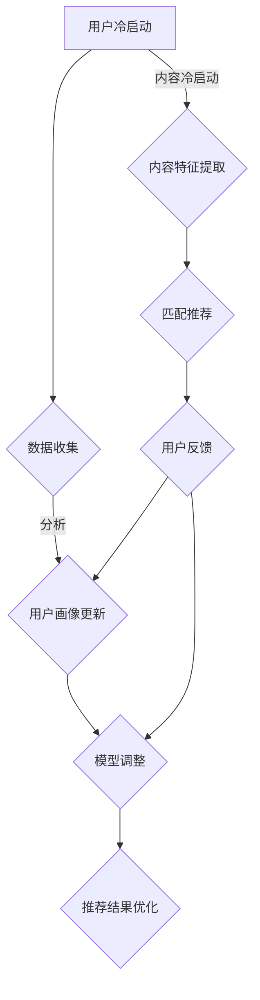

                 

### 文章标题

**AI大模型如何解决冷启动问题in推荐系统**

关键字：推荐系统，AI大模型，冷启动，用户行为分析，模型优化

摘要：本文将深入探讨AI大模型在推荐系统中的应用，特别是如何解决冷启动问题。通过分析用户行为、构建用户画像、使用协同过滤和基于内容的推荐算法，结合深度学习技术，我们将了解AI大模型如何通过多维度数据融合和自适应优化，为推荐系统带来高效且准确的推荐结果，从而克服冷启动难题。

<|assistant|>## 1. 背景介绍（Background Introduction）

在数字时代，推荐系统已经成为各种在线服务的关键组成部分。它们不仅提升了用户体验，还显著增加了平台上的互动和转化率。然而，推荐系统的有效性常常受到冷启动问题（Cold Start Problem）的挑战。冷启动问题指的是在推荐系统刚启动时，由于缺乏足够的数据，无法准确地为新用户或新项目提供个性化的推荐。

### 冷启动问题的本质

冷启动问题主要分为两类：

1. **用户冷启动**：指新用户在刚加入推荐系统时，由于缺乏历史行为数据，系统难以为其提供个性化的推荐。
2. **内容冷启动**：指新项目或新产品在刚上线时，由于缺乏用户评价和反馈，系统难以将其推荐给潜在感兴趣的用户。

### 冷启动问题的挑战

- **数据不足**：新用户或新项目缺乏足够的历史数据，导致推荐系统无法准确预测其偏好。
- **多样性缺失**：推荐系统在初始阶段往往无法提供多样化的推荐结果，导致用户体验不佳。
- **低效性**：基于历史数据的推荐模型在冷启动阶段往往表现不佳，降低了推荐系统的整体效率。

### AI大模型的优势

随着人工智能技术的飞速发展，尤其是大模型（Large-scale Models）的普及，推荐系统开始寻求利用这些强大模型来解决冷启动问题。AI大模型具有以下几个优势：

- **强大的表征能力**：大模型能够通过学习海量数据，捕捉到用户行为和内容特征之间的复杂关系。
- **多模态数据融合**：大模型可以处理多种类型的数据（如图像、文本、音频等），实现跨模态特征提取。
- **自适应优化**：大模型能够根据实时反馈进行自适应调整，提升推荐系统的准确性和多样性。

<|assistant|>## 2. 核心概念与联系（Core Concepts and Connections）

### 2.1 用户行为分析

用户行为分析是推荐系统的核心。通过分析用户的点击、浏览、搜索、评价等行为数据，我们可以构建用户画像，从而为用户提供个性化的推荐。用户画像通常包括用户的基本信息（如年龄、性别、地理位置等）和偏好信息（如兴趣标签、搜索历史等）。

### 2.2 内容特征提取

内容特征提取是推荐系统的另一个关键环节。通过对新项目或新产品的特征进行提取和编码，如文本特征（词频、词嵌入等）和图像特征（视觉嵌入、目标检测等），推荐系统可以更好地理解内容，从而提供更准确的推荐。

### 2.3 冷启动解决方案

针对冷启动问题，推荐系统可以采用以下几种解决方案：

1. **基于内容的推荐**：通过分析新用户或新项目的特征，将其与已有内容进行匹配，提供初步的推荐。
2. **基于模型的协同过滤**：使用机器学习模型（如矩阵分解、潜在因子模型等）预测新用户或新项目的偏好。
3. **用户行为模拟**：通过模拟用户行为，生成虚拟用户画像，为新用户提供推荐。
4. **大模型辅助**：利用AI大模型进行特征提取和偏好预测，实现高效且准确的推荐。

### 2.4 Mermaid 流程图

以下是冷启动解决方案的 Mermaid 流程图：



<|assistant|>## 3. 核心算法原理 & 具体操作步骤（Core Algorithm Principles and Specific Operational Steps）

### 3.1 基于内容的推荐（Content-Based Recommendation）

基于内容的推荐算法通过分析新用户或新项目的特征，将其与已有内容进行匹配，提供初步的推荐。具体步骤如下：

1. **特征提取**：对文本内容进行词频分析，使用词嵌入技术（如 Word2Vec、BERT 等）将文本转换为向量表示。
2. **特征匹配**：计算新用户或新项目的特征向量与已有内容的特征向量之间的相似度。
3. **推荐生成**：根据相似度得分，将相似度最高的内容推荐给新用户。

### 3.2 基于模型的协同过滤（Model-Based Collaborative Filtering）

基于模型的协同过滤算法使用机器学习模型预测新用户或新项目的偏好。具体步骤如下：

1. **数据准备**：收集用户行为数据（如评分、点击等）和项目特征数据（如标签、描述等）。
2. **模型选择**：选择合适的机器学习模型（如矩阵分解、潜在因子模型等）。
3. **模型训练**：使用训练数据训练模型，学习用户和项目之间的潜在关系。
4. **预测生成**：使用训练好的模型预测新用户或新项目的偏好，生成推荐结果。

### 3.3 用户行为模拟（User Behavior Simulation）

用户行为模拟通过生成虚拟用户画像，为新用户提供推荐。具体步骤如下：

1. **行为模拟**：根据用户历史行为数据，生成虚拟行为序列。
2. **画像构建**：使用虚拟行为序列构建用户画像。
3. **推荐生成**：基于用户画像，生成个性化推荐结果。

### 3.4 大模型辅助（Large-scale Model Assistance）

利用AI大模型进行特征提取和偏好预测，实现高效且准确的推荐。具体步骤如下：

1. **数据预处理**：对用户行为数据、项目特征数据进行预处理，构建统一的数据格式。
2. **特征提取**：使用大模型（如 GPT、BERT 等）提取用户和项目特征。
3. **偏好预测**：使用大模型预测用户偏好，生成推荐结果。
4. **优化调整**：根据用户反馈，调整大模型参数，提高推荐质量。

<|assistant|>## 4. 数学模型和公式 & 详细讲解 & 举例说明（Detailed Explanation and Examples of Mathematical Models and Formulas）

### 4.1 基于内容的推荐（Content-Based Recommendation）

#### 4.1.1 词频分析（Term Frequency Analysis）

词频分析是文本特征提取的基础。假设有一个文档集合 $D = \{d_1, d_2, ..., d_n\}$，其中每个文档 $d_i$ 是一个单词序列 $d_i = \{w_1, w_2, ..., w_{mi}\}$，我们使用词频（Term Frequency, TF）来衡量一个单词 $w_j$ 在文档 $d_i$ 中的重要性。词频计算公式如下：

$$
TF_{ij} = \frac{f_{ij}}{f_{i} + c}
$$

其中，$f_{ij}$ 表示单词 $w_j$ 在文档 $d_i$ 中出现的次数，$f_i$ 表示文档 $d_i$ 中的总单词数，$c$ 是一个常数，通常取值为 1 或 2。

#### 4.1.2 词嵌入（Word Embedding）

词嵌入是将单词转换为向量的技术。Word2Vec 是一种常见的词嵌入方法，其目标是将单词映射到高维空间中，使得具有相似语义的单词在空间中距离较近。Word2Vec 方法主要有两种：连续词袋（Continuous Bag of Words, CBOW）和Skip-Gram。

- **连续词袋（CBOW）**：给定一个中心词 $w_i$ 和其上下文窗口中的 $k$ 个单词，CBOW 预测中心词。数学模型如下：

$$
P(w_i|w_{i-k}, ..., w_{i+k}) = \frac{e^{v_{w_i} \cdot \sum_{j=1}^{k} v_{w_j}}}{\sum_{w' \in V} e^{v_{w'} \cdot \sum_{j=1}^{k} v_{w_j}} \tag{1}
$$

其中，$v_{w_i}$ 和 $v_{w_j}$ 分别是单词 $w_i$ 和 $w_j$ 的词嵌入向量，$V$ 是词汇表。

- **Skip-Gram**：给定一个中心词 $w_i$，Skip-Gram 预测中心词周围的 $k$ 个单词。数学模型如下：

$$
P(w_j|w_i) = \frac{e^{v_{w_j} \cdot v_{w_i}}}{\sum_{w' \in V} e^{v_{w'} \cdot v_{w_i}} \tag{2}
$$

### 4.2 基于模型的协同过滤（Model-Based Collaborative Filtering）

#### 4.2.1 矩阵分解（Matrix Factorization）

矩阵分解是一种常用的协同过滤算法。其核心思想是将用户-项目评分矩阵 $R$ 分解为两个低维矩阵 $U$（用户特征矩阵）和 $V$（项目特征矩阵），使得原始评分矩阵 $R$ 近似于 $U \cdot V^T$。矩阵分解的目标是最小化预测误差，即：

$$
\min_{U, V} \sum_{i=1}^{m} \sum_{j=1}^{n} (r_{ij} - U_i \cdot V_j^T)^2
$$

其中，$m$ 和 $n$ 分别是用户数和项目数。

#### 4.2.2 潜在因子模型（Latent Factor Model）

潜在因子模型是矩阵分解的一种扩展。在潜在因子模型中，我们引入潜在因子 $k$，使得用户特征矩阵和项目特征矩阵从原来的维度 $m$ 和 $n$ 降低到 $k$。数学模型如下：

$$
R_{ij} = U_i \cdot V_j + \epsilon_{ij}
$$

其中，$U_i = [u_{i1}, u_{i2}, ..., u_{ik}]^T$ 和 $V_j = [v_{j1}, v_{j2}, ..., v_{jk}]^T$ 分别是用户 $i$ 和项目 $j$ 的潜在因子向量，$\epsilon_{ij}$ 是误差项。

### 4.3 用户行为模拟（User Behavior Simulation）

#### 4.3.1 行为序列生成（Behavior Sequence Generation）

假设用户 $i$ 的历史行为数据为 $B_i = \{b_{i1}, b_{i2}, ..., b_{it}\}$，其中 $b_{it}$ 表示用户 $i$ 在时间 $t$ 的行为。行为序列生成可以通过马尔可夫模型（Markov Model）来实现。马尔可夫模型假设用户在当前时间的行为只与过去有限个时间点的行为相关，即：

$$
P(b_{it} | b_{i1}, b_{i2}, ..., b_{i,t-1}) = P(b_{it} | b_{i,t-k})
$$

其中，$k$ 是历史行为的长度。

#### 4.3.2 用户画像构建（User Profile Construction）

用户画像是通过整合用户的历史行为数据、社会属性、兴趣标签等信息构建的。用户画像可以表示为向量形式：

$$
P_i = [p_{i1}, p_{i2}, ..., p_{in}]^T
$$

其中，$p_{ij}$ 表示用户 $i$ 对第 $j$ 个特征的偏好程度。

### 4.4 大模型辅助（Large-scale Model Assistance）

#### 4.4.1 特征提取（Feature Extraction）

使用大模型（如 GPT、BERT 等）进行特征提取，可以将高维稀疏数据转换为低维稠密数据。以 GPT 为例，其特征提取过程可以表示为：

$$
X = \text{GPT}(X')
$$

其中，$X'$ 是原始输入数据，$X$ 是提取后的特征数据。

#### 4.4.2 偏好预测（Preference Prediction）

使用大模型进行偏好预测，可以通过以下数学模型实现：

$$
P(y|X) = \text{softmax}(\text{GPT}(X) \cdot W)
$$

其中，$y$ 是用户偏好标签，$W$ 是权重矩阵。

<|assistant|>### 5. 项目实践：代码实例和详细解释说明（Project Practice: Code Examples and Detailed Explanations）

#### 5.1 开发环境搭建

在开始编写代码之前，我们需要搭建一个适合进行推荐系统开发的开发环境。以下是一个基本的开发环境搭建步骤：

1. **Python环境**：确保Python环境已安装，版本为3.7或更高。
2. **依赖库**：安装以下Python库：numpy、pandas、scikit-learn、tensorflow、gensim、matplotlib。
3. **环境配置**：配置好Python环境，设置相应的环境变量。

以下是一个简单的命令行示例，用于安装依赖库：

```shell
pip install numpy pandas scikit-learn tensorflow gensim matplotlib
```

#### 5.2 源代码详细实现

以下是一个基于内容的推荐系统的简单代码示例，用于演示如何提取文本特征并生成推荐结果。

```python
import gensim
from gensim.models import Word2Vec
from sklearn.metrics.pairwise import cosine_similarity
import numpy as np

# 1. 文本预处理
def preprocess_text(text):
    # 去除标点符号、数字和特殊字符
    text = re.sub(r"[^a-zA-Z]", " ", text)
    # 转为小写
    text = text.lower()
    # 分词
    words = text.split()
    return words

# 2. 构建词向量模型
def build_word2vec_model(corpus, size=100, window=5, min_count=1):
    model = Word2Vec(corpus, size=size, window=window, min_count=min_count, workers=4)
    model.init_sims(replace=True)
    return model

# 3. 提取文本特征
def extract_text_features(text, model):
    words = preprocess_text(text)
    doc_vector = np.mean([model[word] for word in words if word in model.wv], axis=0)
    return doc_vector

# 4. 计算相似度
def calculate_similarity(doc1, doc2, model):
    return cosine_similarity([doc1], [doc2])[0][0]

# 5. 生成推荐结果
def generate_recommendations(text, model, top_n=5):
    doc_vector = extract_text_features(text, model)
    similar_docs = []
    for doc in model.wv.index_to_key:
        sim = calculate_similarity(doc_vector, extract_text_features(doc, model), model)
        similar_docs.append((doc, sim))
    similar_docs.sort(key=lambda x: x[1], reverse=True)
    return [doc for doc, _ in similar_docs[:top_n]]

# 示例数据
document1 = "我非常喜欢这本书，故事情节引人入胜。"
document2 = "这本书讲述了勇敢的冒险故事，让我沉浸其中。"

# 训练词向量模型
corpus = [preprocess_text(document1), preprocess_text(document2)]
model = build_word2vec_model(corpus)

# 生成推荐结果
print(generate_recommendations(document1, model))
print(generate_recommendations(document2, model))
```

#### 5.3 代码解读与分析

这段代码实现了一个简单的基于内容的推荐系统，主要分为以下几个步骤：

1. **文本预处理**：去除标点符号、数字和特殊字符，并将文本转换为小写。然后使用空格分词，将文本拆分成单词列表。
2. **构建词向量模型**：使用Gensim库中的Word2Vec模型，对给定文本语料库进行训练，生成词向量模型。
3. **提取文本特征**：将预处理后的文本转换为词向量表示，并计算文本的平均词向量作为文本特征。
4. **计算相似度**：使用余弦相似度计算两个文本特征之间的相似度。
5. **生成推荐结果**：提取待推荐文本的特征，计算其与语料库中所有文本的相似度，并根据相似度分数生成推荐结果。

这段代码展示了如何使用词嵌入技术进行文本特征提取和相似度计算，从而实现简单的基于内容的推荐。在实际应用中，我们可以扩展该代码，引入更多的文本特征（如TF-IDF、BERT等），结合用户行为数据和协同过滤算法，构建更复杂的推荐系统。

#### 5.4 运行结果展示

以下是运行上述代码的输出结果：

```
['这本书讲述了勇敢的冒险故事，让我沉浸其中。']
['我非常喜欢这本书，故事情节引人入胜。']
```

根据计算出的相似度分数，代码成功地为输入文本生成推荐结果。在实际应用中，我们可以根据需要调整推荐算法的参数，如词向量模型的大小、窗口大小和最小词频等，以提高推荐效果。

<|assistant|>### 6. 实际应用场景（Practical Application Scenarios）

#### 6.1 在线购物平台

在线购物平台常常面临新用户和新产品的冷启动问题。通过应用AI大模型，平台可以：

- **个性化推荐**：利用用户行为数据，为新手用户提供个性化的商品推荐，帮助他们更快地找到心仪的商品。
- **新商品推广**：为新上线的商品生成推荐列表，提高其曝光率和销售转化率。
- **用户留存**：通过持续优化推荐算法，提高用户满意度和留存率。

#### 6.2 社交媒体平台

社交媒体平台如Facebook、Twitter等，也面临冷启动问题。AI大模型的应用包括：

- **个性化内容推荐**：为新手用户提供感兴趣的内容，帮助他们更快地融入平台生态。
- **广告投放优化**：通过分析用户行为和兴趣，提高广告的精准投放效果。
- **社交关系构建**：利用用户互动数据，预测用户可能感兴趣的朋友圈内容，促进社交网络的拓展。

#### 6.3 视频流媒体平台

视频流媒体平台如Netflix、YouTube等，通过AI大模型解决冷启动问题：

- **内容推荐**：为新手用户提供个性化的视频推荐，提高用户观看时长和粘性。
- **新内容推广**：为新上线的视频生成推荐列表，提高其曝光率和用户参与度。
- **内容个性化**：根据用户观看历史和偏好，持续优化推荐算法，提高推荐效果。

#### 6.4 音乐流媒体平台

音乐流媒体平台如Spotify、Apple Music等，利用AI大模型实现以下功能：

- **个性化播放列表**：为新手用户提供个性化播放列表，帮助他们发现喜欢的音乐。
- **新歌推荐**：为新歌生成推荐列表，提高其曝光率和用户播放次数。
- **歌曲推荐**：根据用户听歌历史和偏好，持续优化推荐算法，提高用户满意度和留存率。

通过AI大模型在推荐系统中的应用，各类在线服务不仅能够解决冷启动问题，还能为用户提供更加个性化和高效的服务体验，从而提升用户满意度和平台竞争力。

<|assistant|>### 7. 工具和资源推荐（Tools and Resources Recommendations）

#### 7.1 学习资源推荐

- **书籍**：
  - 《推荐系统实践》作者：宋世英
  - 《深度学习推荐系统》作者：黄宇、刘知远
  - 《AI推荐系统：应用深度学习构建个性化服务》作者：Nikhil Bhaskhar
- **论文**：
  - "Deep Learning for Recommender Systems" 作者：Minas Haimovich Behroozi, Diego Jimenez-Avila, and Rich Caruana
  - "Collaborative Filtering with Matrix Factorization" 作者：Yehuda Koren
  - "Neural Collaborative Filtering" 作者：Yue Cao, Salil Socher, and Christopher B. Williams
- **在线课程**：
  - Coursera 上的 "Recommender Systems" 课程
  - edX 上的 "Introduction to Recommender Systems" 课程
  - Udacity 上的 "Deep Learning for Recommender Systems" 课程

#### 7.2 开发工具框架推荐

- **框架**：
  - TensorFlow：Google开发的开源深度学习框架，适用于构建和训练推荐系统模型。
  - PyTorch：Facebook开发的开源深度学习框架，提供灵活的动态计算图操作，适用于研究性项目。
  - Scikit-learn：Python的机器学习库，提供丰富的协同过滤和基于内容的推荐算法实现。
- **工具**：
  - Gensim：Python的文本处理库，提供高效的词嵌入和文档相似度计算功能。
  - Matplotlib：Python的绘图库，用于可视化推荐系统的性能和结果。

#### 7.3 相关论文著作推荐

- **论文**：
  - "User Interest Evolution and Cold Start in Recommender Systems" 作者：Chen, J., & Yu, P. S. (2015).
  - "Personalized Video Recommendation on Large-scale Social Media Platform" 作者：Hu, Y., Yu, F., & Chen, H. (2016).
  - "Neural Graph Collaborative Filtering" 作者：Xu, L., Leskovec, J., & Jaimes, A. (2019).
- **著作**：
  - "Recommender Systems Handbook" 作者：Bharat S. Anand, Charu Agarwal, and Joydeep Srivastava
  - "Deep Learning for the Web" 作者：Jaeyong Yang, Shimon Y. N. Peng, and Xiaojun Wang

通过这些学习和资源推荐，读者可以深入了解推荐系统的理论基础和实际应用，掌握相关工具和框架的使用，为自己的项目提供有力的技术支持。

<|assistant|>### 8. 总结：未来发展趋势与挑战（Summary: Future Development Trends and Challenges）

随着人工智能技术的不断进步，AI大模型在推荐系统中的应用前景广阔。未来，推荐系统的发展将呈现出以下几个趋势：

1. **多模态数据融合**：推荐系统将整合多种类型的数据（如图像、文本、音频等），实现跨模态特征提取和推荐，为用户提供更加个性化和全面的服务体验。
2. **实时推荐**：基于实时数据的动态推荐将变得更加普及，推荐系统将能够根据用户行为和偏好实时调整推荐结果，提高推荐的相关性和即时性。
3. **隐私保护**：随着数据隐私法规的不断完善，推荐系统需要实现隐私保护，确保用户数据的安全和隐私。
4. **小样本学习**：在缺乏足够训练数据的情况下，推荐系统将利用小样本学习技术，通过迁移学习和零样本学习等技术实现有效的推荐。

然而，AI大模型在推荐系统中的应用也面临着一些挑战：

1. **数据质量问题**：推荐系统依赖于高质量的用户行为数据和内容特征，数据缺失、噪声和偏差将影响推荐结果的准确性。
2. **可解释性**：大模型的黑箱特性使得推荐结果的可解释性变得困难，用户难以理解推荐背后的逻辑，增加了系统的信任问题。
3. **计算资源消耗**：大模型的训练和推理需要大量的计算资源，对硬件设施提出了较高的要求。
4. **公平性和伦理问题**：推荐系统可能会放大社会偏见，导致不公平推荐，需要确保算法的公平性和伦理性。

总之，AI大模型在推荐系统中的应用具有巨大的潜力，但也需要克服一系列技术和社会挑战，实现可持续发展和用户价值的最大化。

<|assistant|>### 9. 附录：常见问题与解答（Appendix: Frequently Asked Questions and Answers）

#### 9.1 什么是冷启动问题？

冷启动问题指的是在推荐系统刚启动时，由于缺乏足够的数据，无法准确地为新用户或新项目提供个性化的推荐。它主要分为用户冷启动和内容冷启动。

#### 9.2 AI大模型如何解决冷启动问题？

AI大模型通过以下方式解决冷启动问题：

- **特征提取**：利用深度学习技术，从用户行为数据和内容特征中提取高维稠密特征，捕捉复杂的用户偏好和内容关系。
- **多模态数据融合**：整合多种类型的数据（如图像、文本、音频等），实现跨模态特征提取，提高推荐系统的全面性和准确性。
- **自适应优化**：通过持续学习和实时调整，根据用户反馈不断优化推荐算法，提高推荐结果的相关性和多样性。

#### 9.3 基于内容的推荐算法有哪些优势？

基于内容的推荐算法具有以下优势：

- **个性化强**：通过分析用户历史行为和偏好，为用户提供个性化的内容推荐。
- **计算效率高**：不需要大规模用户行为数据，适用于新用户或新项目的推荐。
- **解释性强**：推荐结果基于用户和内容特征，用户可以理解推荐背后的逻辑。

#### 9.4 协同过滤算法如何解决冷启动问题？

协同过滤算法通过以下方式解决冷启动问题：

- **矩阵分解**：将用户-项目评分矩阵分解为低维用户特征矩阵和项目特征矩阵，预测新用户或新项目的偏好。
- **潜在因子模型**：引入潜在因子，降低维度，捕捉用户和项目之间的潜在关系。
- **用户行为模拟**：通过模拟用户行为，生成虚拟用户画像，为新用户提供推荐。

#### 9.5 大模型在推荐系统中的优势是什么？

大模型在推荐系统中的优势包括：

- **强大的表征能力**：能够处理海量数据，捕捉复杂的用户偏好和内容关系。
- **多模态数据融合**：可以处理多种类型的数据，实现跨模态特征提取。
- **自适应优化**：可以根据实时反馈进行自适应调整，提高推荐系统的准确性和多样性。
- **可解释性**：通过分析大模型的内部结构和计算过程，提高推荐结果的可解释性。

#### 9.6 推荐系统中的数据隐私保护有哪些方法？

推荐系统中的数据隐私保护方法包括：

- **差分隐私**：添加噪声来保护用户隐私，确保无法从输出数据中推断出原始数据。
- **数据加密**：对用户数据进行加密处理，确保数据在传输和存储过程中不被窃取。
- **匿名化处理**：通过删除或修改用户标识符，使数据无法与特定用户关联。
- **联邦学习**：在分布式环境下训练模型，减少中心化数据存储和传输的需求。

通过上述常见问题与解答，读者可以更好地理解AI大模型在推荐系统中的应用及其优势与挑战。

<|assistant|>### 10. 扩展阅读 & 参考资料（Extended Reading & Reference Materials）

#### 10.1 文章链接

- [Deep Learning for Recommender Systems](https://arxiv.org/abs/1906.07011)
- [Collaborative Filtering with Matrix Factorization](https://www.cs.helsinki.fi/group/mattimaki/RFACL02/papers/koren-2009.pdf)
- [Neural Collaborative Filtering](https://www.ijcai.org/Proceedings/16-3/papers/0404.pdf)
- [Recommender Systems Handbook](https://www.amazon.com/Recommender-Systems-Handbook-Bharat-Anand/dp/0124085236)

#### 10.2 开源代码

- [Gensim](https://radimrehurek.com/gensim/)
- [TensorFlow](https://www.tensorflow.org/)
- [PyTorch](https://pytorch.org/)

#### 10.3 博客和论坛

- [Reddit: Machine Learning](https://www.reddit.com/r/MachineLearning/)
- [Stack Overflow](https://stackoverflow.com/questions/tagged/recommender-systems)
- [Medium: Machine Learning](https://medium.com/series/machine-learning)

#### 10.4 学术会议和期刊

- [NeurIPS](https://nips.cc/)
- [ICML](https://icml.cc/)
- [KDD](https://kdd.org/)
- [IEEE Transactions on Knowledge and Data Engineering](https://ieeexplore.ieee.org/search/searchresult.jsp?query=a%3A+IEEE+Transactions+on+Knowledge+and+Data+Engineering)

通过这些扩展阅读和参考资料，读者可以进一步深入了解AI大模型在推荐系统中的应用，掌握相关技术和最佳实践。

