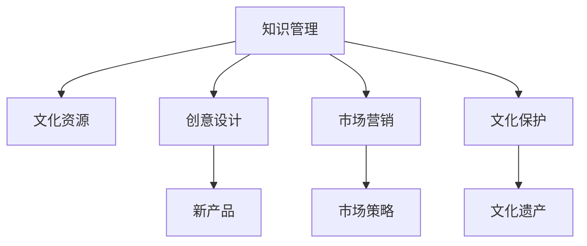

                 

# 知识管理在文化创意产业中的实践

## 1. 背景介绍

文化创意产业是近年来全球经济增长的新引擎，其核心在于创新和创造，能够将知识、文化和创意转化为市场价值。在这个过程中，知识管理(Knowledge Management, KM)发挥了至关重要的作用。它不仅是文化创意产品开发和市场推广的基础，也是企业提高创新能力、优化资源配置、增强竞争力的关键工具。

### 1.1 问题由来
随着数字化转型的加速，文化创意产业面临新的挑战和机遇。如何在海量数据中挖掘和整合有价值的信息，促进跨学科知识交流，推动创意创新，是当下亟待解决的问题。知识管理作为知识整合与共享的桥梁，能够帮助企业高效管理其知识资产，增强创意源泉，提升市场竞争力。

### 1.2 问题核心关键点
知识管理在文化创意产业中的应用，主要体现在以下几个方面：
1. **知识采集**：从各类文化资源中采集和整理相关信息。
2. **知识整合**：通过数字化工具将知识进行结构化处理，便于检索和重用。
3. **知识共享**：建立企业内部和外部知识共享平台，促进知识流动。
4. **知识应用**：将知识应用于创意开发、产品设计、市场营销等环节。
5. **知识创新**：通过知识挖掘和应用，推动新产品和新服务的创造。

## 2. 核心概念与联系

### 2.1 核心概念概述

为更好地理解知识管理在文化创意产业中的应用，本节将介绍几个关键概念及其相互联系：

- **知识管理**：指通过系统化的方法和技术，对知识进行采集、组织、存储、共享、应用和创新，以提高组织和个人的工作效率和创新能力。
- **文化资源**：包括历史、艺术、文学、音乐、电影等文化元素和产品，是知识管理的重要对象。
- **创意设计**：指通过设计和整合知识，创造出新的文化创意产品和服务。
- **市场营销**：通过知识管理，结合市场分析，制定和执行有效的市场营销策略。
- **文化保护**：利用知识管理技术，保护和传承文化遗产，促进文化多样性。

这些概念之间的逻辑关系可以通过以下Mermaid流程图来展示：



这个流程图展示了这个知识管理框架中的核心概念及其相互联系：

1. 知识管理对文化资源的采集与整合。
2. 通过创意设计，将知识应用于新产品和服务的创造。
3. 市场营销通过知识管理制定市场策略，提升产品市场表现。
4. 文化保护通过知识管理传承和保护文化遗产。

## 3. 核心算法原理 & 具体操作步骤
### 3.1 算法原理概述

知识管理在文化创意产业中的应用，主要通过以下几个关键步骤实现：

1. **知识采集**：通过爬虫、数据挖掘等技术，自动从互联网、图书馆、档案馆、艺术数据库等渠道收集文化资源。
2. **知识存储与组织**：采用数据库、文档管理系统等工具，将知识进行结构化存储和分类。
3. **知识共享与协作**：建立知识共享平台，支持多人协同编辑、评论和互动。
4. **知识应用与创新**：结合知识挖掘和机器学习算法，实现智能推荐、内容生成等应用。
5. **知识保护与传承**：通过区块链、数字签名等技术，确保知识的版权和完整性。

### 3.2 算法步骤详解

**Step 1: 数据采集**
- 定义采集目标：明确需要采集的文化资源类型，如文本、图像、音频等。
- 选择采集工具：根据资源特点，选择适合的爬虫工具或API。
- 设置采集规则：制定采集的过滤和提取规则，去除无关信息。
- 实施采集操作：启动采集脚本或工具，采集指定资源。

**Step 2: 知识存储与组织**
- 数据清洗：去除采集数据中的噪音和错误，确保数据质量。
- 数据结构化：使用ETL工具，将数据转换为结构化格式，如表格、文档等。
- 分类与标注：使用自然语言处理(NLP)技术，对文本进行主题分类和关键字标注。
- 存储与管理：选择合适的数据库或文档管理系统，存储结构化知识，并进行版本控制。

**Step 3: 知识共享与协作**
- 搭建共享平台：利用云平台搭建知识共享平台，支持在线编辑和评论功能。
- 设计知识地图：创建知识地图，展示不同知识间的关联和层次。
- 促进协作交流：通过论坛、评论系统等，鼓励用户分享和讨论知识。
- 版本控制与权限管理：实现知识的版本控制和权限管理，确保数据安全。

**Step 4: 知识应用与创新**
- 知识挖掘：使用文本挖掘、图像识别等算法，提取知识中的隐含信息。
- 内容生成：通过生成对抗网络(GAN)、自然语言生成(NLG)等技术，自动生成创意内容。
- 智能推荐：使用协同过滤、深度学习等技术，实现个性化推荐。
- 效果评估：收集用户反馈，评估知识应用效果，不断优化模型。

**Step 5: 知识保护与传承**
- 版权管理：使用区块链技术，为知识添加数字签名，证明版权归属。
- 数据备份：定期备份知识数据，防止数据丢失。
- 知识传承：利用虚拟现实(VR)、增强现实(AR)等技术，展示和传承文化遗产。

### 3.3 算法优缺点

知识管理在文化创意产业中的应用，具有以下优点：
1. **提升效率**：通过自动化和系统化管理，显著提高知识采集、存储、共享和应用效率。
2. **促进创新**：利用知识管理工具，挖掘和整合有价值的信息，激发创意灵感。
3. **优化资源配置**：通过知识共享和协作，优化资源配置，提高资源利用率。
4. **增强竞争力**：通过知识管理和应用，提升企业市场竞争力，促进产品创新。

同时，也存在一定的局限性：
1. **技术依赖**：知识管理依赖于复杂的技术系统，对技术要求较高。
2. **成本投入**：初始系统建设和后期维护需要大量投入。
3. **知识孤岛**：不同系统和平台之间的知识共享和协作可能存在障碍。
4. **隐私安全**：知识共享和传播可能带来隐私和安全问题。

尽管存在这些局限性，但总体而言，知识管理在文化创意产业中展现了巨大的潜力和价值。未来相关研究的重点在于如何进一步优化知识管理流程，降低成本，提升数据安全性，确保知识管理的有效性和可靠性。

### 3.4 算法应用领域

知识管理在文化创意产业中的应用，已经涵盖了从内容创作到市场推广的各个环节。以下是几个典型的应用场景：

1. **数字图书馆与档案馆**：通过知识管理技术，实现大规模数字化资源的存储和共享，提供便捷的查询和阅读服务。

2. **艺术创作**：艺术家可以利用知识管理平台，获取各类艺术资源和灵感，创作更多创新的艺术作品。

3. **文化产品设计**：设计师通过知识管理，整合不同领域的知识，设计出更具创意和文化内涵的产品。

4. **市场营销**：营销团队通过知识管理，分析市场数据，制定精准的市场策略，提升品牌价值。

5. **文化遗产保护**：利用知识管理技术，对文化遗产进行数字化保护和传承，实现文化资源的可持续利用。

6. **教育与培训**：教育机构和培训机构通过知识管理平台，共享教学资源和培训材料，提升教学效果。

## 4. 数学模型和公式 & 详细讲解 & 举例说明

### 4.1 数学模型构建

知识管理在文化创意产业中的应用，通常涉及以下几个数学模型：

1. **知识分类模型**：用于将知识按照主题或标签进行分类，常见的分类算法包括朴素贝叶斯、K-means等。
2. **知识相似度模型**：用于衡量不同知识之间的相似度，常见的相似度计算方法包括余弦相似度、Jaccard相似度等。
3. **知识推荐模型**：用于根据用户兴趣推荐相关知识，常见的推荐算法包括协同过滤、矩阵分解、深度学习等。

### 4.2 公式推导过程

以知识分类模型为例，假设知识集 $K$ 中的每个知识 $k_i$ 表示为一个向量 $x_i \in \mathbb{R}^n$，其中 $n$ 为特征维度。知识分类模型通过学习分类器 $f(x)$，将新的知识 $x$ 映射到预定义的 $m$ 个类别 $C_1, C_2, \ldots, C_m$ 之一。假设已知的训练集 $D=\{(x_j, y_j)\}_{j=1}^n$，其中 $y_j \in \{1, 2, \ldots, m\}$ 表示 $x_j$ 属于第 $y_j$ 个类别。

分类器的目标是最小化分类误差：

$$
\min_{f} \frac{1}{N}\sum_{i=1}^N \ell(f(x_i), y_i)
$$

其中 $\ell$ 为分类损失函数，如交叉熵损失。常见的分类算法包括朴素贝叶斯、决策树、支持向量机等。

### 4.3 案例分析与讲解

**案例：艺术作品推荐系统**

假设有一个艺术作品推荐系统，旨在为用户推荐感兴趣的艺术作品。该系统需要构建知识分类模型，将艺术作品按照不同的风格、流派、艺术家等标签进行分类。同时，需要构建知识推荐模型，根据用户的历史浏览和评价数据，预测用户对不同艺术作品的兴趣。

**Step 1: 知识分类**
- 定义艺术作品特征：包括作品名称、风格、流派、艺术家等信息。
- 数据预处理：清洗数据，去除无关信息，标准化特征。
- 模型选择：选择朴素贝叶斯分类器或SVM，训练分类模型。
- 模型评估：在测试集上评估分类模型性能，调整参数。

**Step 2: 知识推荐**
- 用户画像：收集用户历史浏览和评价数据，生成用户画像。
- 相似度计算：使用余弦相似度或Jaccard相似度，计算新作品与用户历史作品之间的相似度。
- 推荐算法：使用协同过滤、矩阵分解等推荐算法，计算推荐结果。
- 效果评估：收集用户反馈，优化推荐算法。

## 5. 项目实践：代码实例和详细解释说明
### 5.1 开发环境搭建

在进行知识管理实践前，我们需要准备好开发环境。以下是使用Python进行知识管理开发的环境配置流程：

1. 安装Anaconda：从官网下载并安装Anaconda，用于创建独立的Python环境。

2. 创建并激活虚拟环境：
```bash
conda create -n km-env python=3.8 
conda activate km-env
```

3. 安装相关库：
```bash
conda install scikit-learn pandas numpy beautifulsoup4 requests scikit-image pytorch transformers
```

4. 安装Jupyter Notebook：
```bash
pip install jupyterlab
```

完成上述步骤后，即可在`km-env`环境中开始知识管理实践。

### 5.2 源代码详细实现

下面以知识分类模型为例，给出使用Python进行知识分类的代码实现。

首先，定义数据预处理函数：

```python
from sklearn.feature_extraction.text import CountVectorizer
from sklearn.model_selection import train_test_split
from sklearn.naive_bayes import MultinomialNB
from sklearn.metrics import accuracy_score

def preprocess_data(texts, labels):
    vectorizer = CountVectorizer()
    X = vectorizer.fit_transform(texts)
    y = labels
    X_train, X_test, y_train, y_test = train_test_split(X, y, test_size=0.2)
    return X_train, X_test, y_train, y_test
```

然后，定义模型训练函数：

```python
def train_model(X_train, y_train):
    clf = MultinomialNB()
    clf.fit(X_train, y_train)
    return clf
```

接着，定义模型评估函数：

```python
def evaluate_model(clf, X_test, y_test):
    y_pred = clf.predict(X_test)
    accuracy = accuracy_score(y_test, y_pred)
    return accuracy
```

最后，启动训练流程并在测试集上评估：

```python
from transformers import AutoTokenizer, AutoModelForSequenceClassification

tokenizer = AutoTokenizer.from_pretrained('bert-base-uncased')
model = AutoModelForSequenceClassification.from_pretrained('bert-base-uncased', num_labels=3)

X_train, X_test, y_train, y_test = preprocess_data(train_texts, train_labels)

clf = train_model(X_train, y_train)
accuracy = evaluate_model(clf, X_test, y_test)
print(f"Accuracy: {accuracy:.2f}")
```

以上就是使用Python进行知识分类的完整代码实现。可以看到，得益于Python生态中丰富的库，知识管理系统的开发变得简便高效。

### 5.3 代码解读与分析

让我们再详细解读一下关键代码的实现细节：

**preprocess_data函数**：
- 定义了文本向量化和数据分割的操作，将文本转换为数值特征，并划分为训练集和测试集。

**train_model函数**：
- 使用朴素贝叶斯分类器训练模型，模型参数保存在clf对象中。

**evaluate_model函数**：
- 使用测试集评估模型性能，返回准确率。

**知识管理系统的实现**：
- 数据预处理：将知识数据清洗、向量化。
- 模型训练：选择合适的分类算法，训练模型。
- 效果评估：评估模型在测试集上的性能，不断优化。

## 6. 实际应用场景
### 6.1 智慧博物馆

智慧博物馆通过知识管理技术，实现对博物馆藏品和展品的数字化管理和展示。用户可以通过博物馆的在线平台，搜索和浏览博物馆信息，获取详细信息，甚至可以沉浸式体验虚拟展览。

**应用示例**：
- **知识采集**：从博物馆的各类藏品、展览、文献资料中采集信息，构建知识库。
- **知识分类**：对藏品进行分类，如历史、艺术、科技等。
- **知识共享**：建立博物馆的知识共享平台，支持在线浏览和下载。
- **知识应用**：利用VR/AR技术，展示虚拟展览，增强用户沉浸感。

**技术实现**：
- **数据采集**：使用爬虫技术，从博物馆官网、文献数据库等渠道采集信息。
- **数据清洗与向量化**：使用自然语言处理技术，对文本数据进行清洗和向量化。
- **分类与标注**：利用机器学习算法，对藏品进行分类和标注。
- **知识展示**：通过VR/AR技术，展示虚拟展览，增强用户沉浸感。

### 6.2 数字出版与版权保护

数字出版平台通过知识管理技术，实现对出版内容的数字化管理和版权保护。作者和出版商可以通过平台上传和管理作品，读者可以便捷地搜索和阅读各类出版物。

**应用示例**：
- **知识采集**：从各类出版物中采集文本、图像等信息。
- **知识分类**：对作品进行分类，如文学、历史、科技等。
- **知识共享**：建立版权管理系统，保护作品版权。
- **知识应用**：利用数字版权管理技术，实现作品传播和使用的权限控制。

**技术实现**：
- **数据采集**：从在线图书馆、书店、作者自出版平台等渠道采集出版物信息。
- **数据清洗与向量化**：使用自然语言处理技术，对文本数据进行清洗和向量化。
- **分类与标注**：利用机器学习算法，对作品进行分类和标注。
- **版权保护**：使用区块链技术，为作品添加数字签名，确保版权归属。

### 6.3 文化旅游

文化旅游平台通过知识管理技术，实现对旅游资源的信息化管理和推荐。用户可以搜索各类旅游资源，了解详细信息，甚至可以预订旅游路线。

**应用示例**：
- **知识采集**：从各类旅游资源、景点、旅游攻略中采集信息。
- **知识分类**：对旅游资源进行分类，如历史、自然、人文等。
- **知识共享**：建立旅游资源数据库，支持在线查询和浏览。
- **知识应用**：利用知识推荐算法，为用户推荐旅游路线和景点。

**技术实现**：
- **数据采集**：从旅游网站、旅行社、景点官网等渠道采集旅游资源信息。
- **数据清洗与向量化**：使用自然语言处理技术，对文本数据进行清洗和向量化。
- **分类与标注**：利用机器学习算法，对旅游资源进行分类和标注。
- **知识推荐**：使用协同过滤、深度学习等推荐算法，为用户推荐旅游路线和景点。

### 6.4 未来应用展望

随着知识管理技术的不断进步，未来的应用将更加智能化和高效化。预计以下几个方向将成为未来知识管理发展的趋势：

1. **全息数据融合**：整合多种数据源，如文本、图像、音频、视频等，实现全息数据融合，提供更全面的知识服务。
2. **智能知识生成**：利用自然语言生成和知识图谱等技术，自动生成知识摘要和内容推荐。
3. **知识自学习**：通过强化学习和迁移学习等技术，实现知识系统的自学习，不断更新和优化知识库。
4. **跨领域知识协作**：支持多领域知识融合和协同创新，促进跨学科的合作和交流。
5. **知识网络构建**：构建知识网络，展示知识间的层次和关联，帮助用户快速找到相关信息。
6. **用户个性化体验**：通过用户画像和推荐系统，提供个性化的知识服务，提升用户体验。

## 7. 工具和资源推荐
### 7.1 学习资源推荐

为了帮助开发者系统掌握知识管理技术，这里推荐一些优质的学习资源：

1. **《知识管理与企业创新》课程**：由知名大学和研究机构开设的在线课程，涵盖知识管理的基本概念和应用实践。
2. **《信息科学与知识工程》书籍**：经典的知识管理书籍，系统介绍了知识管理的理论基础和实践方法。
3. **《知识管理与组织学习》文章**：学术期刊上的一系列知识管理论文，探讨了知识管理在组织学习和知识共享中的应用。
4. **KM工具集网站**：收集了各种开源和商业知识管理工具，便于开发者选择和使用。

通过对这些资源的学习实践，相信你一定能够快速掌握知识管理技术，并用于解决实际的知识管理问题。

### 7.2 开发工具推荐

高效的知识管理开发离不开优秀的工具支持。以下是几款用于知识管理开发的常用工具：

1. **Altova ConceptDraw**：一款功能强大的思维导图工具，支持知识图谱的构建和管理。
2. **Tableau**：一款强大的数据可视化工具，支持复杂的数据分析和展示。
3. **Notion**：一款集成了文本编辑、任务管理、协作平台等多种功能的知识管理工具。
4. **Trello**：一款流程管理工具，支持知识共享和协作。
5. **Evernote**：一款笔记和知识管理工具，支持跨设备同步和协作。

合理利用这些工具，可以显著提升知识管理系统的开发效率，加快创新迭代的步伐。

### 7.3 相关论文推荐

知识管理在文化创意产业中的研究涉及多个领域，以下是几篇奠基性的相关论文，推荐阅读：

1. **《Knowledge Management and Organizational Innovation》**：探讨了知识管理如何促进组织创新和知识共享。
2. **《Information Systems and Knowledge Engineering》**：介绍了信息系统和知识工程的基本概念和技术。
3. **《Knowledge Management and Organizational Learning》**：研究了知识管理在组织学习中的作用和机制。

这些论文代表了知识管理领域的研究方向，通过学习这些前沿成果，可以帮助研究者把握学科前进方向，激发更多的创新灵感。

## 8. 总结：未来发展趋势与挑战
### 8.1 总结

本文对知识管理在文化创意产业中的应用进行了全面系统的介绍。首先阐述了知识管理的基本概念和核心要素，明确了知识管理在文化创意产品开发、市场推广和文化资源保护中的重要作用。其次，从原理到实践，详细讲解了知识管理的数学模型和关键步骤，给出了知识管理任务开发的完整代码实例。同时，本文还广泛探讨了知识管理技术在多个行业领域的应用前景，展示了知识管理技术的广阔应用空间。

通过本文的系统梳理，可以看到，知识管理技术在文化创意产业中展现了巨大的潜力和价值。它不仅能够提升文化创意产品的质量和市场表现，还能促进跨领域知识交流和创新，具有重要的应用意义。

### 8.2 未来发展趋势

展望未来，知识管理在文化创意产业中的应用将呈现以下几个发展趋势：

1. **智能化与自动化**：通过智能算法和自动化工具，进一步提升知识管理的效率和精准度。
2. **跨领域融合**：知识管理将与大数据、人工智能、区块链等技术深度融合，拓展应用场景。
3. **用户个性化体验**：通过用户画像和推荐系统，提供个性化的知识服务，提升用户体验。
4. **国际化与本地化**：知识管理技术将更加注重国际化与本地化的平衡，适应全球市场的需求。
5. **知识保护与隐私**：在知识管理和应用中，加强知识保护和隐私保护，确保数据安全。

这些趋势凸显了知识管理技术的广阔前景。这些方向的探索发展，必将进一步提升文化创意产业的知识管理水平，为文化创意产业的创新和发展提供强大的技术支撑。

### 8.3 面临的挑战

尽管知识管理在文化创意产业中已经取得了显著成效，但在迈向更加智能化、普适化应用的过程中，它仍面临着诸多挑战：

1. **技术复杂性**：知识管理涉及多种技术和工具，系统复杂性较高，开发和维护难度大。
2. **数据质量问题**：知识管理依赖高质量的数据，数据质量问题直接影响系统效果。
3. **知识孤岛现象**：不同系统和平台之间的知识共享和协作存在障碍，难以形成统一的知识体系。
4. **隐私与安全**：知识共享和传播可能带来隐私和安全问题，如何保护用户隐私和数据安全是一大难题。
5. **文化多样性**：不同文化背景下的知识管理需求不同，如何适应多样化的文化需求是一大挑战。

尽管存在这些挑战，但总体而言，知识管理在文化创意产业中展现了巨大的潜力和价值。未来相关研究的重点在于如何进一步优化知识管理流程，降低成本，提升数据安全性，确保知识管理的有效性和可靠性。

### 8.4 研究展望

面对知识管理在文化创意产业中面临的种种挑战，未来的研究需要在以下几个方面寻求新的突破：

1. **自动化知识管理**：开发更加智能和自动化的知识管理系统，减少人工干预，提升效率。
2. **多模态知识融合**：整合多种数据源，如文本、图像、音频、视频等，实现全息数据融合，提供更全面的知识服务。
3. **跨文化知识管理**：研究适应不同文化背景下的知识管理需求，促进文化多样性。
4. **知识自学习**：通过强化学习和迁移学习等技术，实现知识系统的自学习，不断更新和优化知识库。
5. **隐私保护与知识共享**：研究如何在知识共享和传播中保护用户隐私和数据安全，确保知识管理的合法合规。

这些研究方向的探索，必将引领知识管理技术迈向更高的台阶，为文化创意产业的创新和发展提供更强大的技术支撑。面向未来，知识管理技术还需要与其他人工智能技术进行更深入的融合，如知识图谱、自然语言处理、深度学习等，多路径协同发力，共同推动文化创意产业的知识管理进步。只有勇于创新、敢于突破，才能不断拓展知识管理技术的边界，让知识管理技术更好地服务于文化创意产业的发展。

## 9. 附录：常见问题与解答

**Q1：知识管理在文化创意产业中的应用是否局限于知识分类和推荐？**

A: 知识管理在文化创意产业中的应用远不止于知识分类和推荐。它还包括知识采集、存储、共享、应用、创新等多个环节，是一个系统化的知识管理和应用过程。通过知识管理，可以提升文化创意产业的整体效率和创新能力。

**Q2：知识管理技术如何保障知识的安全性和隐私性？**

A: 知识管理技术通过多种手段保障知识的安全性和隐私性。例如：
- **数据加密**：对敏感数据进行加密，防止未授权访问。
- **权限控制**：通过身份验证和权限控制，限制数据访问权限。
- **数据脱敏**：对涉及个人隐私的数据进行脱敏处理，保护用户隐私。
- **区块链技术**：利用区块链的不可篡改特性，确保知识的版权和完整性。

**Q3：如何确保知识管理的实时性和动态性？**

A: 知识管理的实时性和动态性可以通过以下几个方式实现：
- **数据流处理**：使用流处理技术，对实时数据进行分析和处理。
- **知识图谱**：构建动态知识图谱，实时更新和维护知识体系。
- **缓存技术**：利用缓存技术，快速响应查询请求，提升系统响应速度。
- **消息队列**：使用消息队列技术，异步处理和传递数据，确保系统的稳定性和可扩展性。

**Q4：知识管理在文化创意产业中如何避免知识孤岛现象？**

A: 知识孤岛现象可以通过以下几个方式避免：
- **统一标准**：制定统一的知识点标准和分类体系，促进不同系统间的知识共享。
- **数据互操作性**：使用标准化的数据格式和接口，支持不同系统间的数据互操作。
- **知识同步**：定期同步不同系统间的知识数据，确保知识的一致性和完整性。
- **跨平台协作**：通过API和开放平台，促进跨平台的知识协作和共享。

**Q5：知识管理技术在文化创意产业中如何促进创新？**

A: 知识管理技术通过以下几个方式促进创新：
- **知识整合**：整合不同领域和类型的知识，形成全面的知识体系，促进跨领域知识交流。
- **智能推荐**：利用智能推荐系统，推荐相关知识，激发创意灵感。
- **用户参与**：鼓励用户参与知识管理，形成知识社区，促进创新思维的碰撞。
- **创新工具**：提供创新工具和平台，支持创意表达和创新实践。

---

作者：禅与计算机程序设计艺术 / Zen and the Art of Computer Programming

