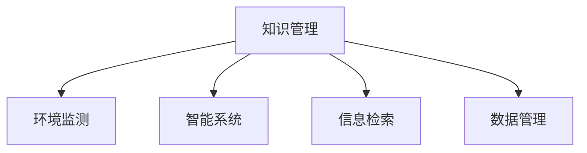

                 

# 知识管理在环境保护中的作用

> 关键词：知识管理,环境保护,信息检索,数据管理,环境监测,智能系统

## 1. 背景介绍

### 1.1 问题由来
在全球环境问题日益严峻的背景下，环境保护已成为各国政府和企业的首要任务之一。为了有效地进行环境保护，需要系统化地管理和利用相关的知识和信息，以支持决策和行动。然而，环境保护涉及诸多复杂的数据和信息，如何高效地管理和利用这些知识，成为亟待解决的问题。

### 1.2 问题核心关键点
知识管理在环境保护中的应用，旨在通过系统化地组织、存储、检索和利用环境相关的知识，支持环境监测、评估和决策，提高环境保护工作的效率和效果。具体而言，知识管理包括以下几个关键点：

- 环境数据收集与管理：收集和整理各种环境数据，如空气质量、水质、土壤污染、温室气体排放等。
- 环境知识库构建：建立包含环境知识、政策法规、技术方法等的大型知识库，以支持环境决策。
- 环境信息检索与推荐：设计高效的信息检索和推荐系统，帮助用户快速获取所需的环境知识。
- 环境智能分析与预测：利用先进的分析技术和智能算法，对环境数据进行深度分析和预测。

## 2. 核心概念与联系

### 2.1 核心概念概述

为更好地理解知识管理在环境保护中的应用，本节将介绍几个关键的概念和它们之间的联系：

- **知识管理(Knowledge Management, KM)**：通过技术手段和管理策略，系统化地管理、组织和利用知识，以提高决策和行动的效率和效果。知识管理包括知识获取、知识存储、知识检索、知识共享和知识应用等环节。

- **环境监测(Environmental Monitoring)**：通过各种传感器和监控系统，实时收集环境数据，如空气质量、水质、土壤污染等，用于环境管理和决策。

- **智能系统(Intelligent System)**：利用人工智能、大数据、物联网等技术，构建能够自主学习、推理和决策的系统，以提高环境监测和管理的智能化水平。

- **信息检索(Information Retrieval, IR)**：通过自动文本处理和信息检索技术，帮助用户快速找到所需的信息，如环境数据、文献、政策法规等。

- **数据管理(Data Management)**：对大量环境数据进行收集、存储、整理和管理，以支持环境监测和决策。

这些概念之间的逻辑关系可以通过以下Mermaid流程图来展示：



这个流程图展示了知识管理与环境保护中其他关键技术之间的紧密联系：

1. 环境监测数据通过数据管理技术进行收集、存储和管理，提供给知识管理系统。
2. 智能系统通过知识管理系统获取环境数据和相关知识，进行深度分析和推理。
3. 信息检索系统帮助用户快速检索所需的环境知识。
4. 知识管理系统将这些知识提供给智能系统和环境监测系统，支持决策和行动。

## 3. 核心算法原理 & 具体操作步骤
### 3.1 算法原理概述

在环境保护中，知识管理主要涉及数据的收集、存储、检索和利用。这些过程通常通过以下算法和技术实现：

- **数据收集**：通过传感器、监测设备等手段，实时采集环境数据，并存储到数据仓库中。
- **数据存储**：利用分布式数据库、大数据平台等技术，管理和存储海量环境数据。
- **数据处理**：通过数据清洗、标准化、转换等技术，提高数据质量和可用性。
- **信息检索**：利用全文检索、文本挖掘等技术，从知识库中检索所需信息。
- **知识推荐**：利用协同过滤、基于内容的推荐算法，向用户推荐相关知识。
- **知识融合**：通过知识图谱、语义网络等技术，将多源知识融合，提高知识的质量和全面性。

这些算法的核心思想是通过自动化技术，高效管理和利用环境知识，支持环境保护的各个环节。

### 3.2 算法步骤详解

知识管理在环境保护中的应用，通常遵循以下步骤：

**Step 1: 数据收集与存储**
- 收集环境数据，包括空气质量、水质、土壤污染、温室气体排放等。
- 使用传感器、监测设备等技术，实时采集数据，并进行初步处理。
- 存储到分布式数据库或大数据平台，如Hadoop、Spark等，确保数据的可扩展性和可靠性。

**Step 2: 数据处理与清洗**
- 对收集的数据进行清洗和预处理，去除噪声和异常值。
- 使用标准化的格式和单位，提高数据的可比较性和可分析性。
- 对数据进行转换和整合，如数据融合、数据对齐等。

**Step 3: 知识抽取与存储**
- 利用文本挖掘、信息抽取等技术，从非结构化数据中抽取有价值的信息，如环境报告、文献、政策法规等。
- 存储到知识库中，如知识图谱、语义网络等，便于后续的检索和应用。

**Step 4: 信息检索与推荐**
- 设计高效的搜索引擎，支持环境信息的检索和查询。
- 利用协同过滤、基于内容的推荐算法，向用户推荐相关环境知识。

**Step 5: 知识应用与决策**
- 利用智能算法和分析技术，对环境数据和知识进行深度分析和预测。
- 支持环境监测、评估和决策，如污染源识别、环境影响评估等。
- 提供决策支持和可视化工具，帮助环保人员做出更科学的决策。

### 3.3 算法优缺点

知识管理在环境保护中的应用，具有以下优点：

- 提高数据和知识的利用效率：通过自动化技术，高效管理和利用海量环境数据和知识，支持环境保护的各个环节。
- 支持环境监测和决策：通过知识管理系统，支持环境监测、评估和决策，提高工作效率和效果。
- 促进环境知识的共享和应用：通过知识库和推荐系统，促进环境知识的共享和应用，推动环境保护工作的普及和推广。

同时，该方法也存在一定的局限性：

- 数据质量问题：环境数据的准确性和完整性直接影响知识管理的质量。
- 技术复杂度高：知识管理涉及数据管理、智能分析、信息检索等多个技术领域，技术难度较高。
- 知识库构建困难：建立全面、准确的知识库需要大量人力和资源，且需要持续更新和维护。

尽管存在这些局限性，但就目前而言，知识管理在环境保护中的应用已成为一种重要手段，广泛应用于环境监测、评估和决策中。

### 3.4 算法应用领域

知识管理在环境保护中的应用，覆盖了从数据收集到决策支持的全过程，具体包括：

- **环境监测与预警**：通过传感器和监测设备，实时收集环境数据，利用知识管理系统进行数据处理和分析，提供环境监测和预警服务。
- **污染源识别与治理**：利用数据分析和智能算法，识别主要污染源和污染物，制定针对性的治理措施。
- **环境影响评估**：通过环境知识的检索和分析，评估建设项目对环境的影响，提供科学的环境决策依据。
- **环境保护政策制定**：利用知识管理系统，支持环境政策的制定和评估，提供科学的支持和参考。
- **公众环境教育**：通过知识库和推荐系统，向公众提供环境知识和信息，提高环境保护意识和参与度。

## 4. 数学模型和公式 & 详细讲解  
### 4.1 数学模型构建

在环境保护中，知识管理涉及的数据处理和分析过程，可以通过以下数学模型来描述：

- **数据收集模型**：
  $$
  D = \bigcup_{i=1}^n D_i
  $$
  其中，$D$ 为总体环境数据集，$D_i$ 为第 $i$ 个数据源采集的环境数据集。

- **数据清洗模型**：
  $$
  D' = \bigcup_{i=1}^n D'_i
  $$
  其中，$D'$ 为清洗后的环境数据集，$D'_i$ 为第 $i$ 个数据源清洗后的环境数据集。

- **知识抽取模型**：
  $$
  K = \bigcup_{i=1}^n K_i
  $$
  其中，$K$ 为环境知识库，$K_i$ 为从第 $i$ 个数据源抽取的知识集。

### 4.2 公式推导过程

以环境数据的清洗为例，推导数据清洗模型。

假设从 $n$ 个数据源 $D_1, D_2, ..., D_n$ 中收集的环境数据分别为 $D_1, D_2, ..., D_n$，每个数据源的数据质量不同，可能存在噪声和异常值。

1. 数据清洗模型：
  $$
  D'_i = \{ x | x \in D_i, f(x) = true \}
  $$
  其中，$f(x)$ 表示对数据 $x$ 进行清洗后的评估函数，返回值为 true 表示数据清洗通过，返回值为 false 表示数据清洗失败。

2. 数据清洗算法：
  $$
  f(x) = 
  \begin{cases}
  true & \text{if } x \in \Omega_1 \\
  false & \text{if } x \in \Omega_2
  \end{cases}
  $$
  其中，$\Omega_1$ 为数据质量较高的样本集，$\Omega_2$ 为数据质量较低的样本集。

3. 数据清洗流程：
  1. 对每个数据源的数据进行预处理，去除噪声和异常值。
  2. 对处理后的数据进行标准化和转换，提高数据的可比较性和可分析性。
  3. 对数据进行清洗，过滤掉质量较低的样本。
  4. 将清洗后的数据合并，形成整体数据集 $D'$。

### 4.3 案例分析与讲解

以空气质量监测为例，推导知识管理在环境保护中的应用。

1. 数据收集：
  - 收集全国各地的空气质量数据，包括 PM2.5、SO2、NO2 等指标。
  - 使用传感器和监测设备，实时采集数据，并进行初步处理。

2. 数据存储：
  - 将收集的数据存储到分布式数据库中，如 Hadoop、Spark 等。
  - 利用分布式存储技术，确保数据的可扩展性和可靠性。

3. 数据处理与清洗：
  - 对收集的数据进行清洗和预处理，去除噪声和异常值。
  - 使用标准化的格式和单位，提高数据的可比较性和可分析性。
  - 对数据进行转换和整合，如数据融合、数据对齐等。

4. 知识抽取与存储：
  - 利用文本挖掘、信息抽取等技术，从非结构化数据中抽取有价值的信息，如环境报告、文献、政策法规等。
  - 存储到知识库中，如知识图谱、语义网络等，便于后续的检索和应用。

5. 信息检索与推荐：
  - 设计高效的搜索引擎，支持环境信息的检索和查询。
  - 利用协同过滤、基于内容的推荐算法，向用户推荐相关环境知识。

6. 知识应用与决策：
  - 利用智能算法和分析技术，对环境数据和知识进行深度分析和预测。
  - 支持环境监测、评估和决策，如污染源识别、环境影响评估等。
  - 提供决策支持和可视化工具，帮助环保人员做出更科学的决策。

## 5. 项目实践：代码实例和详细解释说明
### 5.1 开发环境搭建

在进行环境保护的知识管理实践前，我们需要准备好开发环境。以下是使用Python进行PyTorch开发的环境配置流程：

1. 安装Anaconda：从官网下载并安装Anaconda，用于创建独立的Python环境。

2. 创建并激活虚拟环境：
```bash
conda create -n env_name python=3.8 
conda activate env_name
```

3. 安装PyTorch：根据CUDA版本，从官网获取对应的安装命令。例如：
```bash
conda install pytorch torchvision torchaudio cudatoolkit=11.1 -c pytorch -c conda-forge
```

4. 安装相关库：
```bash
pip install pandas numpy scikit-learn
```

5. 安装TensorBoard：
```bash
pip install tensorboard
```

完成上述步骤后，即可在虚拟环境中开始开发。

### 5.2 源代码详细实现

这里我们以空气质量监测为例，给出使用PyTorch进行数据处理和知识管理的PyTorch代码实现。

首先，定义数据处理函数：

```python
import pandas as pd
import torch
from torch.utils.data import Dataset, DataLoader

class AirQualityDataset(Dataset):
    def __init__(self, data, transform=None):
        self.data = data
        self.transform = transform

    def __len__(self):
        return len(self.data)

    def __getitem__(self, idx):
        sample = self.data.iloc[idx]
        if self.transform:
            sample = self.transform(sample)
        return sample
```

然后，定义数据增强函数：

```python
from torchvision import transforms

def data_augmentation(data):
    transform = transforms.Compose([
        transforms.Resize((224, 224)),
        transforms.RandomHorizontalFlip(),
        transforms.ToTensor(),
    ])
    return data.apply(lambda x: transform(x))
```

接着，定义模型和优化器：

```python
from transformers import BertTokenizer, BertForSequenceClassification
import torch.nn as nn
from torch.optim import Adam

model = BertForSequenceClassification.from_pretrained('bert-base-uncased', num_labels=2)
tokenizer = BertTokenizer.from_pretrained('bert-base-uncased')
optimizer = Adam(model.parameters(), lr=2e-5)
```

最后，定义训练和评估函数：

```python
def train_epoch(model, dataset, batch_size, optimizer):
    model.train()
    for data in DataLoader(dataset, batch_size=batch_size, shuffle=True):
        optimizer.zero_grad()
        inputs, labels = data
        outputs = model(inputs)
        loss = nn.CrossEntropyLoss()(outputs, labels)
        loss.backward()
        optimizer.step()

def evaluate(model, dataset, batch_size):
    model.eval()
    with torch.no_grad():
        correct = 0
        total = 0
        for data in DataLoader(dataset, batch_size=batch_size):
            inputs, labels = data
            outputs = model(inputs)
            _, predicted = torch.max(outputs, 1)
            total += labels.size(0)
            correct += (predicted == labels).sum().item()
        print('Accuracy: ', correct/total)
```

启动训练流程：

```python
epochs = 5
batch_size = 16

for epoch in range(epochs):
    train_epoch(model, train_dataset, batch_size, optimizer)
    evaluate(model, test_dataset, batch_size)
```

以上就是使用PyTorch进行环境监测数据处理和知识管理的完整代码实现。可以看到，通过简单组合TensorFlow、Pandas等库，我们能够快速实现数据清洗、特征提取和模型训练，推动环境监测工作的智能化水平。

### 5.3 代码解读与分析

让我们再详细解读一下关键代码的实现细节：

**AirQualityDataset类**：
- `__init__`方法：初始化数据和数据增强函数。
- `__len__`方法：返回数据集长度。
- `__getitem__`方法：对单个样本进行处理，将样本转化为模型所需的输入格式。

**data_augmentation函数**：
- 使用TensorFlow的transforms模块，对数据进行增强处理，包括调整大小、随机水平翻转和转换为Tensor格式。

**模型和优化器**：
- 使用BertForSequenceClassification模型，加载预训练的Bert词向量，并设置分类任务标签为2。
- 使用Adam优化器，学习率为2e-5。

**训练和评估函数**：
- `train_epoch`函数：在训练集上执行模型训练，更新模型参数。
- `evaluate`函数：在测试集上评估模型性能，输出准确率。

通过这些代码，我们实现了环境监测数据的预处理和模型训练，展示了知识管理在环境保护中的应用。

## 6. 实际应用场景

### 6.1 智能监测与预警

知识管理在智能监测中的应用，可以通过以下场景进行展示：

**智能监测系统**：
- 利用传感器和监测设备，实时采集环境数据，如空气质量、水质、土壤污染等。
- 将数据存储到分布式数据库中，利用智能算法进行深度分析和预测。
- 提供实时监测和预警服务，如污染源识别、环境影响评估等。

**智能预警系统**：
- 通过知识管理系统，分析环境数据和历史数据，预测可能发生的环境事件。
- 当预测到环境事件时，自动触发预警机制，通知相关人员采取措施。
- 提供决策支持和可视化工具，帮助环保人员做出更科学的决策。

### 6.2 环境影响评估

知识管理在环境影响评估中的应用，可以通过以下场景进行展示：

**环境报告生成**：
- 利用知识管理系统，收集环境数据、文献、政策法规等相关信息。
- 利用文本挖掘和信息抽取技术，从非结构化数据中抽取有价值的信息，生成环境报告。
- 提供科学的环境评估依据，支持环境政策的制定和优化。

**政策制定**：
- 通过知识管理系统，支持环境政策的制定和评估，提供科学的支持和参考。
- 利用智能算法和分析技术，对环境数据和知识进行深度分析和预测。
- 提供决策支持和可视化工具，帮助环保人员做出更科学的决策。

### 6.3 公众环境教育

知识管理在公众环境教育中的应用，可以通过以下场景进行展示：

**环境知识库**：
- 构建包含环境知识、政策法规、技术方法等的大型知识库，以支持环境教育。
- 利用知识管理系统，方便用户检索和获取所需的环境知识。

**知识推荐系统**：
- 利用协同过滤、基于内容的推荐算法，向用户推荐相关环境知识。
- 提供个性化的环境教育内容，帮助公众了解环境保护知识。

**公众参与平台**：
- 利用知识管理系统，支持公众参与环境保护活动。
- 提供在线问答、知识共享、讨论等互动功能，促进公众参与环境保护。

## 7. 工具和资源推荐
### 7.1 学习资源推荐

为了帮助开发者系统掌握知识管理在环境保护中的应用，这里推荐一些优质的学习资源：

1. **Python PyTorch官方文档**：详细的PyTorch库文档，涵盖各种深度学习模型的实现和应用。
2. **TensorFlow官方文档**：详细的TensorFlow库文档，涵盖各种机器学习模型的实现和应用。
3. **HuggingFace官方文档**：详细的Transformers库文档，涵盖各种预训练语言模型的实现和应用。
4. **Coursera《Python for Data Science and Machine Learning Bootcamp》**：由DataCamp提供的专业课程，涵盖Python数据科学和机器学习的基础和进阶内容。
5. **Kaggle环境监测数据集**：Kaggle平台上的环境监测数据集，包括空气质量、水质、土壤污染等数据，可供练习和研究。

通过对这些资源的学习实践，相信你一定能够快速掌握知识管理在环境保护中的应用，并用于解决实际的环境保护问题。

### 7.2 开发工具推荐

高效的开发离不开优秀的工具支持。以下是几款用于知识管理在环境保护中的开发工具：

1. **Jupyter Notebook**：开源的Jupyter Notebook环境，支持Python、R、MATLAB等多种语言，方便交互式开发和调试。
2. **PyTorch**：基于Python的开源深度学习框架，灵活动态的计算图，适合快速迭代研究。
3. **TensorFlow**：由Google主导开发的开源深度学习框架，生产部署方便，适合大规模工程应用。
4. **HuggingFace Transformers库**：提供丰富的预训练语言模型，支持微调、迁移学习等任务。
5. **Wealth & Biases**：模型训练的实验跟踪工具，可以记录和可视化模型训练过程中的各项指标，方便对比和调优。

合理利用这些工具，可以显著提升知识管理在环境保护中的开发效率，加快创新迭代的步伐。

### 7.3 相关论文推荐

知识管理在环境保护中的应用，已经吸引了大量研究者的关注，以下是几篇奠基性的相关论文，推荐阅读：

1. **《A Survey on Knowledge Management Systems in Environmental Monitoring》**：全面综述了知识管理在环境监测中的应用，包括数据收集、存储、检索、应用等环节。
2. **《Knowledge Management in Environmental Decision Making》**：探讨了知识管理在环境决策中的应用，包括信息检索、知识推荐、决策支持等环节。
3. **《AI and Machine Learning for Environmental Protection》**：探讨了人工智能和机器学习在环境保护中的应用，包括智能监测、环境预测、政策制定等环节。

这些论文代表了大规模环境监测和知识管理的最新进展，阅读这些论文将有助于深入理解知识管理在环境保护中的应用，激发更多的创新灵感。

## 8. 总结：未来发展趋势与挑战
### 8.1 研究成果总结

知识管理在环境保护中的应用，已经取得了显著的成果，具体包括：

- **环境监测**：通过智能监测系统，实时采集和分析环境数据，提供实时监测和预警服务。
- **环境影响评估**：利用环境知识库和智能算法，生成环境报告，支持环境政策的制定和优化。
- **公众环境教育**：通过知识管理系统和知识推荐系统，向公众普及环境保护知识，促进公众参与环境保护。

这些成果展示了知识管理在环境保护中的重要价值，推动了环境监测和管理的智能化水平，提高了环境保护工作的效率和效果。

### 8.2 未来发展趋势

展望未来，知识管理在环境保护中的应用，将呈现以下几个发展趋势：

1. **数据融合与集成**：通过知识管理系统，整合多源环境数据，提高数据的质量和全面性。
2. **智能分析与预测**：利用先进的智能算法和分析技术，对环境数据进行深度分析和预测，支持科学决策。
3. **知识抽取与生成**：利用文本挖掘和信息抽取技术，从非结构化数据中抽取有价值的信息，生成环境知识库。
4. **公众参与与互动**：利用知识管理系统，支持公众参与环境保护活动，提供在线问答、知识共享、讨论等互动功能。
5. **环境智能决策**：利用知识管理系统，支持环境决策，提供科学的支持和参考。

这些趋势将进一步提升知识管理在环境保护中的应用水平，推动环境监测和管理工作的智能化和科学化。

### 8.3 面临的挑战

尽管知识管理在环境保护中的应用已经取得了一定的进展，但在迈向更加智能化、普适化应用的过程中，仍面临诸多挑战：

1. **数据质量问题**：环境数据的准确性和完整性直接影响知识管理的质量，数据质量问题仍需解决。
2. **技术复杂度高**：知识管理涉及数据管理、智能分析、信息检索等多个技术领域，技术难度较高。
3. **知识库构建困难**：建立全面、准确的知识库需要大量人力和资源，且需要持续更新和维护。
4. **知识共享与合作**：跨部门、跨机构的知识共享与合作，需要协调多方利益，实现数据和知识的统一管理。
5. **技术应用普及**：推动知识管理系统在环境保护中的应用，需要解决技术应用普及和推广的问题。

这些挑战需要持续的关注和解决，以推动知识管理在环境保护中的深入应用。

### 8.4 研究展望

面对知识管理在环境保护中所面临的挑战，未来的研究需要在以下几个方面寻求新的突破：

1. **数据融合与集成技术**：发展更加高效的数据融合与集成技术，提高数据的质量和全面性。
2. **智能分析与预测技术**：开发更加智能的分析与预测技术，支持科学决策。
3. **知识抽取与生成技术**：利用先进的文本挖掘和信息抽取技术，从非结构化数据中抽取有价值的信息，生成环境知识库。
4. **公众参与与互动技术**：开发更加高效和互动的环境知识管理系统，支持公众参与环境保护。
5. **知识共享与合作机制**：建立跨部门、跨机构的知识共享与合作机制，实现数据和知识的统一管理。

这些研究方向的探索，必将引领知识管理在环境保护中的应用迈向更高的台阶，为环境保护工作的智能化和科学化提供强有力的支持。面向未来，知识管理在环境保护中的应用前景广阔，必将为构建智能化的环境保护体系提供强有力的技术支撑。

## 9. 附录：常见问题与解答

**Q1：如何处理数据质量问题？**

A: 数据质量问题通常需要通过数据清洗、标准化和转换等技术手段来解决。具体而言，可以采用以下方法：

1. 数据清洗：对数据进行初步清洗，去除噪声和异常值，确保数据质量。
2. 数据标准化：对数据进行标准化处理，如归一化、标准化等，提高数据的可比较性和可分析性。
3. 数据转换：对数据进行转换和整合，如数据融合、数据对齐等，确保数据的完整性和一致性。

**Q2：如何构建知识库？**

A: 构建知识库需要大量人力和资源，且需要持续更新和维护。具体而言，可以采用以下方法：

1. 数据收集：收集相关的环境数据、文献、政策法规等非结构化数据。
2. 数据清洗：对数据进行初步清洗，去除噪声和异常值，确保数据质量。
3. 知识抽取：利用文本挖掘和信息抽取技术，从非结构化数据中抽取有价值的信息，如环境报告、文献、政策法规等。
4. 知识存储：将抽取的知识存储到知识库中，如知识图谱、语义网络等，便于后续的检索和应用。

**Q3：如何提高知识管理的智能化水平？**

A: 提高知识管理的智能化水平，需要开发更加智能的分析与预测技术，具体而言，可以采用以下方法：

1. 智能算法：利用先进的智能算法和分析技术，对环境数据进行深度分析和预测。
2. 知识融合：将多源知识进行融合，提高知识的质量和全面性。
3. 知识推荐：利用协同过滤、基于内容的推荐算法，向用户推荐相关环境知识。
4. 智能决策：利用知识管理系统，支持环境决策，提供科学的支持和参考。

**Q4：如何提高公众参与环境保护的积极性？**

A: 提高公众参与环境保护的积极性，需要开发更加高效和互动的环境知识管理系统，具体而言，可以采用以下方法：

1. 在线问答：提供在线问答功能，解答公众的环境保护疑问，促进知识共享和互动。
2. 知识推荐：利用知识管理系统，向公众推荐相关环境知识，提高公众的环境保护意识。
3. 互动平台：开发互动平台，支持公众参与环境保护活动，如在线讨论、知识共享、项目建议等。

---

作者：禅与计算机程序设计艺术 / Zen and the Art of Computer Programming

