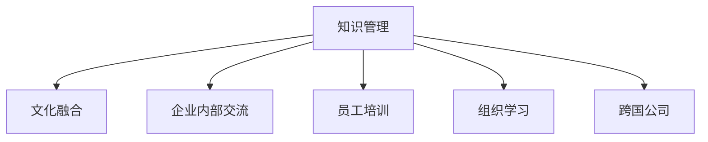

                 

# 知识管理在跨国公司文化融合中的作用

> 关键词：知识管理, 文化融合, 跨国公司, 企业内部交流, 员工培训, 组织学习

## 1. 背景介绍

在当今全球化迅速发展的背景下，跨国公司越来越多。这些公司面临着管理跨地域、文化多样性以及不同市场规则的挑战。因此，如何促进公司内部不同文化背景下的员工之间的沟通和交流，同时将公司的知识和经验进行有效的管理和传递，成为跨国公司需要解决的重大问题。在这个过程中，知识管理（Knowledge Management, KM）扮演着至关重要的角色。本文将探讨知识管理在跨国公司文化融合中的作用，并提供一些实际的案例和建议。

## 2. 核心概念与联系

### 2.1 核心概念概述

- **知识管理（Knowledge Management, KM）**：是指通过一系列策略、技术和工具，组织内部对知识进行识别、获取、分享、存储、保护、传递和应用，从而实现知识资本最大化。

- **文化融合（Cultural Integration）**：指不同文化背景的个体和群体在共同的组织环境中，通过相互交流、理解和合作，逐渐形成共同的价值观、行为规范和工作习惯的过程。

- **跨国公司（Multinational Corporations）**：在全球范围内运营的公司，通常由不同国家的分公司和子公司组成，文化多样性是这些公司的一个显著特征。

- **企业内部交流（Internal Communication）**：指组织内部员工之间的沟通和信息交换，是知识共享和应用的基础。

- **员工培训（Employee Training）**：通过培训提高员工的知识技能，使其适应企业文化和岗位需求。

- **组织学习（Organizational Learning）**：通过知识的共享和应用，组织成员之间相互学习和知识传递，促进组织整体的创新和进步。

这些概念之间的逻辑关系可以通过以下Mermaid流程图来展示：



这个流程图展示了知识管理与其他相关概念的联系：

1. 知识管理是文化融合的基础。通过知识管理，公司可以建立跨文化沟通的桥梁。
2. 企业内部交流是知识管理的关键环节。只有内部沟通顺畅，才能实现知识的有效传递。
3. 员工培训是知识管理的核心内容。通过培训，员工可以掌握新的知识和技能。
4. 组织学习是知识管理的终极目标。通过组织学习，公司可以不断创新和进步。
5. 跨国公司是知识管理的适用场景。文化多样性使得跨国公司在知识管理上具有特殊挑战。

## 3. 核心算法原理 & 具体操作步骤

### 3.1 算法原理概述

知识管理在跨国公司文化融合中的作用，主要体现在以下几个方面：

1. **跨文化沟通**：通过知识管理平台，不同文化背景的员工可以进行交流，促进相互理解和尊重。
2. **知识共享**：通过知识管理，员工可以分享自己的经验和知识，提高组织的整体知识水平。
3. **员工培训**：通过知识管理系统，可以制定个性化的培训计划，使员工更快地融入公司文化。
4. **组织学习**：知识管理平台可以记录和分析组织内部的知识流动，促进组织学习。

### 3.2 算法步骤详解

以下是一般步骤，适用于跨国公司进行知识管理的实际操作：

**Step 1: 建立知识管理平台**

- 确定知识管理系统的需求。包括功能模块、技术平台和预算。
- 选择合适的知识管理软件。如Confluence、SharePoint、Microsoft 365等。
- 设计知识分类体系和数据模型。
- 配置权限管理和信息安全。

**Step 2: 数据收集和整理**

- 搜集和整理公司内部和外部的知识资源。包括文档、报告、专利、会议记录等。
- 对知识进行分类、标注和结构化处理。
- 创建知识库和知识地图。

**Step 3: 知识共享和传播**

- 建立知识共享机制。如定期会议、知识分享会、内部论坛等。
- 利用知识管理系统进行信息发布和检索。
- 通过社交网络和即时通讯工具促进知识交流。

**Step 4: 员工培训和应用**

- 设计员工培训计划，包括知识培训、技能培训和文化培训。
- 利用知识管理平台进行培训记录和反馈。
- 定期评估员工培训效果，调整培训内容和方法。

**Step 5: 持续改进和优化**

- 收集员工反馈，进行持续改进。
- 监测知识管理的绩效指标，如知识获取率、知识使用率等。
- 优化知识管理策略，提升整体知识水平。

### 3.3 算法优缺点

知识管理在跨国公司文化融合中具有以下优点：

1. **促进跨文化沟通**：提供了一个统一的沟通平台，帮助不同文化背景的员工进行交流和理解。
2. **提升知识共享效率**：通过系统化的管理，使知识传播更加高效。
3. **支持个性化培训**：根据员工的需求和职业发展路径，定制培训内容。
4. **增强组织学习能力**：通过知识管理平台，组织能够及时获取和应用最新的知识。

同时，知识管理也存在一些缺点：

1. **依赖技术平台**：知识管理系统的选择和配置需要投入大量的技术和资源。
2. **用户习惯改变**：员工需要适应新的工作方式和工具，有一定的接受度门槛。
3. **知识质量控制**：需要确保知识库中的内容准确、完整和及时更新。
4. **文化和语言障碍**：不同文化背景的员工对知识管理的理解和应用可能存在差异。

### 3.4 算法应用领域

知识管理在跨国公司文化融合中的应用领域主要包括：

1. **人力资源管理**：通过知识管理提升招聘、培训和绩效评估的效率和效果。
2. **研发和创新**：利用知识管理促进跨部门合作，加速创新过程。
3. **市场和客户关系**：通过知识管理了解市场和客户需求，提升市场响应速度。
4. **质量管理**：利用知识管理提升产品和服务质量，减少错误和失误。
5. **运营管理**：通过知识管理优化流程和资源配置，提高运营效率。

## 4. 数学模型和公式 & 详细讲解 & 举例说明

### 4.1 数学模型构建

知识管理的数学模型可以概括为以下几个关键要素：

- **知识获取率（Knowledge Acquisition Rate, KAR）**：指单位时间内获取知识的数量。
- **知识共享率（Knowledge Sharing Rate, KSR）**：指单位时间内知识共享的数量。
- **知识使用率（Knowledge Utilization Rate, KUR）**：指单位时间内知识被应用的次数。
- **知识留存率（Knowledge Retention Rate, KRR）**：指知识在一定时间内的留存情况。

### 4.2 公式推导过程

假设一个跨国公司有 $N$ 名员工，知识管理平台的年总访问次数为 $A$，每个员工平均访问次数为 $P$，知识共享的平均次数为 $S$，知识使用的平均次数为 $U$，知识平均留存时间为 $T$。那么，知识管理的模型可以表示为：

$$
KAR = \frac{A}{N} \times P
$$

$$
KSR = A \times S
$$

$$
KUR = A \times U
$$

$$
KRR = \frac{S}{T}
$$

其中，$A$ 可以通过公司内部的统计数据获取，$P$、$S$ 和 $U$ 可以通过知识管理系统的使用数据得出，$T$ 可以通过知识共享和使用的历史记录分析得出。

### 4.3 案例分析与讲解

以下是一个实际案例：

某跨国公司有 1000 名员工，知识管理平台年总访问次数为 50 万次，每个员工平均访问次数为 50 次，知识共享的平均次数为 5 次，知识使用的平均次数为 3 次，知识平均留存时间为 30 天。

根据公式计算：

- 知识获取率 $KAR = \frac{50 \times 10^4}{1000} \times 50 = 250$ 次/人/年
- 知识共享率 $KSR = 50 \times 10^4 \times 5 = 250$ 次/年
- 知识使用率 $KUR = 50 \times 10^4 \times 3 = 150$ 次/年
- 知识留存率 $KRR = \frac{5}{30} = 0.17$

通过这些数据，公司可以评估知识管理的绩效，发现存在的问题并进行优化。

## 5. 项目实践：代码实例和详细解释说明

### 5.1 开发环境搭建

要进行知识管理系统的开发，需要以下环境：

1. 操作系统：如 Linux、Windows、macOS。
2. 编程语言：如 Python、Java、JavaScript。
3 数据库：如 MySQL、Oracle、MongoDB。
4 应用服务器：如 Tomcat、Nginx、Apache。
5 开发工具：如 Eclipse、Visual Studio、Sublime Text。
6 版本控制系统：如 Git、SVN。

### 5.2 源代码详细实现

以下是一个简化的知识管理系统代码示例，主要涉及用户管理、知识库管理和共享功能：

```python
class User:
    def __init__(self, name, role):
        self.name = name
        self.role = role

class Knowledge:
    def __init__(self, title, content, tags, author):
        self.title = title
        self.content = content
        self.tags = tags
        self.author = author

class KnowledgeBase:
    def __init__(self):
        self.knowledge_list = []

    def add_knowledge(self, knowledge):
        self.knowledge_list.append(knowledge)

    def get_knowledge_by_tag(self, tag):
        return [knowledge for knowledge in self.knowledge_list if tag in knowledge.tags]

class KnowledgeShare:
    def __init__(self, user, knowledge, message):
        self.user = user
        self.knowledge = knowledge
        self.message = message

    def share_knowledge(self, knowledge_share):
        knowledge = knowledge_share.knowledge
        message = knowledge_share.message
        print(f"{knowledge_share.user.name} shared {knowledge.title} with the following message: {message}")
```

### 5.3 代码解读与分析

上述代码中，`User` 类表示用户，`Knowledge` 类表示知识，`KnowledgeBase` 类表示知识库，`KnowledgeShare` 类表示知识共享。

1. `User` 类包含用户名和角色信息。
2. `Knowledge` 类包含知识的标题、内容、标签和作者信息。
3. `KnowledgeBase` 类表示知识库，包含知识列表，支持添加知识和按标签检索知识。
4. `KnowledgeShare` 类表示知识共享，包括用户、知识和消息。

### 5.4 运行结果展示

以下是一个简化的知识管理系统的运行结果展示：

```
John shared 'Data Science Tutorials' with the following message: 'This is a great resource for learning data science!'
Jane shared 'Machine Learning Algorithms' with the following message: 'I found this very helpful for my project.'
```

## 6. 实际应用场景

### 6.1 智能客服系统

在智能客服系统中，知识管理可以极大地提升客户服务质量。通过知识库管理，客服人员可以快速查找并使用公司内部的知识库，提高响应速度和处理效率。同时，知识管理系统还可以记录和分析客户服务数据，帮助公司改进服务流程和提高服务质量。

### 6.2 研发和创新

在研发和创新领域，知识管理可以支持跨部门协作，加速新产品开发。通过知识共享平台，研发团队可以快速获取其他部门的最新研究成果和资料，提高研发效率和创新能力。

### 6.3 质量管理

在质量管理领域，知识管理可以提升产品质量和工艺水平。通过知识库管理，质检人员可以快速查找和应用相关标准和流程，提高质检效率和质量。

### 6.4 未来应用展望

未来，知识管理将在跨国公司文化融合中发挥更加重要的作用。随着技术的进步，知识管理将更加智能化和自动化，通过人工智能和大数据技术，知识获取、共享和应用将更加高效。同时，知识管理还将与其他技术（如区块链、物联网等）结合，形成更加复杂和强大的知识生态系统。

## 7. 工具和资源推荐

### 7.1 学习资源推荐

1. **《知识管理的理论和实践》（Knowledge Management: Theory and Practice）**：由Pulina and Hamill撰写的经典书籍，涵盖了知识管理的各个方面，包括理论、实践和技术。
2. **《组织学习》（Organizational Learning）**：由Edgar Schein撰写的书籍，详细介绍了组织学习的理论和实践。
3. **Coursera上的《知识管理》课程**：由Richard Alberts和Sonia Cabrera教授，通过视频和互动方式，讲解知识管理的相关知识和案例。
4. **LinkedIn Learning的《知识管理》课程**：通过实际案例和工具演示，帮助学员掌握知识管理技能。

### 7.2 开发工具推荐

1. **Confluence**：全球最大的知识管理软件，支持文档、页面、知识库等多种知识形式的管理。
2. **SharePoint**：微软的知识管理平台，提供强大的协作和信息共享功能。
3. **Microsoft 365**：集成了知识管理、协作和生产力工具的综合性平台。
4. **Eclipse**：开源的编程集成开发环境，支持多种编程语言和开发工具。
5. **Visual Studio**：微软的集成开发环境，支持多种编程语言和框架。
6. **Sublime Text**：轻量级的文本编辑器，支持多种编程语言和插件。

### 7.3 相关论文推荐

1. **《知识管理的社会化观点》（The Social Perspective of Knowledge Management）**：由Geoffrey Odell和Eduardo Salas撰写的论文，探讨了知识管理中的社会化因素。
2. **《知识管理中的社会网络分析》（Social Network Analysis in Knowledge Management）**：由Diana Burley和Kathleen Mwenya撰写的论文，分析了知识管理中的社交网络结构。
3. **《知识共享和组织学习》（Knowledge Sharing and Organizational Learning）**：由Larry L. Kiesler、Henry N. Leung和Ralph H. Smith撰写的论文，探讨了知识共享和组织学习之间的关系。
4. **《跨国公司文化融合》（Cultural Integration in Multinational Companies）**：由Lisa A. Coughlin和Richard T. Beasley撰写的论文，分析了跨国公司文化融合的策略和实践。

## 8. 总结：未来发展趋势与挑战

### 8.1 总结

本文对知识管理在跨国公司文化融合中的作用进行了全面系统的介绍。首先阐述了知识管理和文化融合的概念，明确了两者之间的内在联系。其次，从原理到实践，详细讲解了知识管理的数学模型和操作步骤，给出了知识管理系统的代码示例。同时，本文还探讨了知识管理在智能客服、研发和创新、质量管理等多个场景中的应用，展示了知识管理的广阔前景。最后，本文精选了知识管理的各类学习资源和开发工具，力求为读者提供全方位的技术指引。

通过本文的系统梳理，可以看到，知识管理在跨国公司文化融合中扮演着至关重要的角色。它不仅帮助公司建立了跨文化沟通的桥梁，提升了知识共享效率，还支持了员工培训和组织学习，是促进跨国公司文化融合的重要手段。未来，随着知识管理技术的不断进步，其应用范围和效果将更加广泛和显著。

### 8.2 未来发展趋势

展望未来，知识管理将呈现以下几个发展趋势：

1. **智能化和自动化**：随着人工智能和大数据技术的发展，知识管理将更加智能化和自动化，通过算法优化知识获取、共享和应用效率。
2. **跨平台集成**：知识管理将与其他技术（如物联网、区块链等）结合，形成更加复杂和强大的知识生态系统。
3. **个性化和定制化**：根据用户需求和角色，提供个性化的知识服务，支持定制化的知识管理方案。
4. **实时性和动态性**：通过实时数据采集和分析，支持动态的知识更新和优化。
5. **安全性与隐私保护**：加强知识管理系统的安全性和隐私保护，确保知识的安全共享和使用。

这些趋势将进一步提升知识管理的效率和效果，使其在跨国公司文化融合中发挥更大的作用。

### 8.3 面临的挑战

尽管知识管理在跨国公司文化融合中已经取得了显著成效，但在未来发展中仍面临一些挑战：

1. **技术和成本**：知识管理系统的开发和维护需要较高的技术投入和成本，中小型企业难以承担。
2. **数据质量**：知识管理系统的有效运行依赖于高质量的数据，数据收集和整理的难度较大。
3. **文化差异**：不同文化背景的员工对知识管理的理解和应用可能存在差异，需要采取针对性的措施。
4. **知识孤岛**：如果知识管理系统中存在知识孤岛，即部分知识难以共享和应用，会影响整体效果。
5. **技术适应性**：需要员工适应新的工作方式和工具，有一定的接受度门槛。

### 8.4 研究展望

面对知识管理面临的这些挑战，未来的研究需要在以下几个方面寻求新的突破：

1. **开发低成本知识管理系统**：通过开源软件和云服务，降低知识管理的成本，使更多企业能够应用。
2. **提高数据质量**：通过自动化数据收集和清洗，提高知识库的质量和完整性。
3. **跨文化知识管理**：研究和推广跨文化知识管理策略，提高不同文化背景员工的接受度和参与度。
4. **解决知识孤岛**：建立知识共享和协作机制，打破知识孤岛，提高知识的全局可用性。
5. **提升技术适应性**：通过培训和支持，提高员工对知识管理系统的适应性和应用能力。

这些研究方向的探索，必将引领知识管理技术迈向更高的台阶，为跨国公司文化融合和知识共享提供更加强大和可靠的支持。面向未来，知识管理需要与其他技术（如区块链、物联网等）结合，多路径协同发力，共同推动跨国公司知识管理和文化融合的创新和进步。

## 9. 附录：常见问题与解答

**Q1：跨国公司如何选择合适的知识管理系统？**

A: 跨国公司在选择知识管理系统时，应考虑以下几个方面：
1. 公司的规模和需求：选择适合公司规模和业务需求的知识管理平台。
2. 数据的保密性和安全性：确保知识管理系统的数据保密性和安全性。
3. 易用性和灵活性：选择易用、灵活的知识管理系统，方便员工使用。
4. 技术支持和培训：选择有完善技术支持和培训服务，确保系统稳定运行。

**Q2：知识管理系统的用户培训有哪些建议？**

A: 知识管理系统的用户培训建议如下：
1. 制定培训计划：根据不同部门和岗位需求，制定有针对性的培训计划。
2. 使用案例演示：通过实际案例演示，帮助员工理解知识管理系统的功能和应用。
3. 设立培训中心：设立专门的培训中心，定期进行培训和支持。
4. 建立知识库：建立公司内部知识库，方便员工查找和使用知识。
5. 持续评估和改进：定期评估培训效果，不断改进培训内容和方式。

**Q3：如何进行跨文化知识管理？**

A: 进行跨文化知识管理的建议如下：
1. 建立多元文化团队：组建包含不同文化背景的团队，促进跨文化交流和协作。
2. 设计文化敏感的培训：设计符合不同文化背景的培训内容，提高员工的适应能力。
3. 支持多语言功能：支持多语言的知识管理平台，方便不同语言背景的员工使用。
4. 加强文化交流：加强不同文化背景员工的沟通和交流，促进文化理解和融合。
5. 尊重文化差异：尊重和包容不同文化背景员工的观点和习惯，促进文化多样性。

**Q4：知识管理系统如何提升组织学习能力？**

A: 知识管理系统提升组织学习能力的建议如下：
1. 建立知识共享机制：建立知识共享机制，促进员工之间的知识交流和传递。
2. 支持知识地图：利用知识地图，帮助员工快速查找和应用知识。
3. 引入学习分析：引入学习分析工具，评估员工的学习效果和知识掌握情况。
4. 支持个性化学习：根据员工的学习习惯和需求，提供个性化的学习资源和建议。
5. 定期进行知识审计：定期进行知识审计，发现和解决知识共享中的问题。

---

作者：禅与计算机程序设计艺术 / Zen and the Art of Computer Programming

