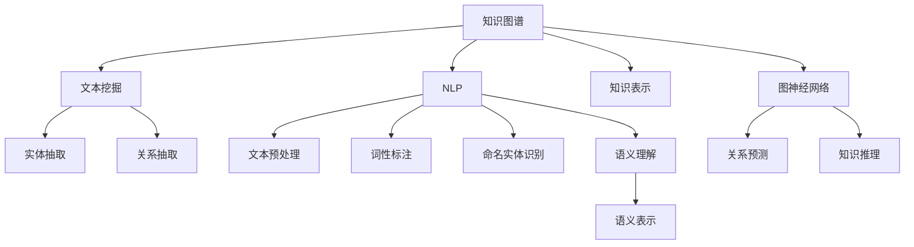

                 

# 知识经济下知识付费的人工智能知识图谱构建

> 关键词：知识付费,人工智能,知识图谱,自然语言处理(NLP),文本挖掘,知识表示,图神经网络(GNN)

## 1. 背景介绍

### 1.1 问题由来
随着知识经济时代的到来，人们对高质量知识的需求日益增长，知识付费成为了一种新兴的教育消费模式。传统的信息检索方式，如搜索引擎，已难以满足人们对深度学习、跨学科知识、个性化推荐等高层次知识的需求。如何高效地组织、获取、利用知识，成为了亟待解决的问题。

人工智能（AI）技术的发展，为解决这一问题提供了新的思路。通过深度学习、自然语言处理（NLP）等技术，可以从海量的文本数据中挖掘出知识图谱，构建起知识与知识之间的关联网络。知识图谱不仅能帮助用户快速获取所需知识，还能提供推荐、决策支持等多维度的智能服务。

### 1.2 问题核心关键点
构建知识图谱的关键在于如何从大量文本数据中提取出实体和关系，构建出知识库。在此基础上，如何利用知识图谱提升知识付费平台的用户体验和个性化推荐能力，是知识图谱应用的核心问题。

目前，主要的数据来源包括专业文献、百科全书、教育网站、博客等。然而，这些数据源的数据格式和质量参差不齐，难以直接用于构建高质量的知识图谱。因此，如何有效处理文本数据，提高知识抽取的准确性和效率，是大规模知识图谱构建的关键挑战。

## 2. 核心概念与联系

### 2.1 核心概念概述

为更好地理解知识图谱的构建过程，本节将介绍几个密切相关的核心概念：

- 知识图谱(Knowledge Graph)：一种用图结构表示实体及其关系的数据模型，用于描述和组织大量结构化的知识信息。知识图谱可被广泛应用于搜索引擎、推荐系统、智能问答等多个领域。
- 自然语言处理(Natural Language Processing, NLP)：涉及计算机理解和处理人类语言的技术，包括文本预处理、词性标注、命名实体识别、语义理解等。NLP是大规模知识抽取和知识图谱构建的重要技术。
- 文本挖掘(Text Mining)：通过数据分析、模式识别等手段，从文本数据中挖掘出有用信息的过程。文本挖掘在知识图谱构建中，用于抽取实体和关系，发现知识间的隐性联系。
- 知识表示(Knowledge Representation)：描述知识库中实体和关系的语义形式，是知识图谱构建和推理的基础。
- 图神经网络(Graph Neural Network, GNN)：一种利用图结构进行节点信息传递和聚合的神经网络模型，用于处理图结构数据，如图谱数据。GNN在知识图谱构建和推理中，用于关系预测和知识推理。

这些核心概念之间的逻辑关系可以通过以下Mermaid流程图来展示：



这个流程图展示了大规模知识图谱构建的相关核心概念及其之间的关系：

1. 知识图谱的构建基于NLP和文本挖掘技术，用于从文本数据中抽取实体和关系。
2. 实体抽取和关系抽取技术，通常使用命名实体识别（NER）、依存句法分析（Dependency Parsing）等NLP技术。
3. 知识表示技术用于描述实体和关系间的语义关系，常见有RDF、OWL、ontology等。
4. GNN模型利用图结构进行信息传递和聚合，用于处理知识图谱中的关系预测和知识推理。

## 3. 核心算法原理 & 具体操作步骤
### 3.1 算法原理概述

大规模知识图谱的构建过程，可以抽象为以下几个关键步骤：

1. **文本数据预处理**：清洗文本数据，去除噪音，标准化格式。
2. **命名实体识别**：从文本中自动识别出实体，如人名、地名、机构名等。
3. **关系抽取**：识别文本中实体间的语义关系，如“谁与谁在何时何地做了什么事”。
4. **知识表示**：将抽取出的实体和关系转换为知识图谱中的节点和边。
5. **图神经网络建模**：利用图神经网络模型，对知识图谱进行关系预测和知识推理。

知识图谱构建的核心是实体和关系的抽取，而实体抽取是知识图谱构建中的难点之一。传统的方法主要依赖于规则和词典，难以适应大规模、无结构、多语言的文本数据。

### 3.2 算法步骤详解

#### 3.2.1 文本数据预处理

文本数据预处理是知识图谱构建的第一步，包括文本清洗、分词、词性标注、去停用词、词干提取等步骤。预处理流程如下：

1. **文本清洗**：去除HTML标签、噪声字符、重复内容等。
2. **分词**：将文本切分成词语或词组，常用方法包括基于规则、统计、机器学习等。
3. **词性标注**：标注每个词语的词性，如名词、动词、形容词等，有助于后续的命名实体识别和关系抽取。
4. **去停用词**：去除常用的停用词，如“的”、“是”等，以减少噪音。
5. **词干提取**：将词语还原为词干，如将“running”还原为“run”。

#### 3.2.2 命名实体识别

命名实体识别是知识图谱构建的核心任务之一，用于从文本中自动识别出特定的实体，如人名、地名、机构名等。命名实体识别的流程如下：

1. **特征提取**：提取文本中与实体相关的特征，如上下文、语法、同义词等。
2. **候选实体生成**：基于特征提取，生成候选实体列表。
3. **实体分类**：对候选实体进行分类，确定其实体类型，如人名、地名、机构名等。
4. **实体消歧**：对于同名实体，通过上下文信息进行消歧，确定其具体实体。

#### 3.2.3 关系抽取

关系抽取用于识别文本中实体间的语义关系，如“谁与谁在何时何地做了什么事”。关系抽取的流程如下：

1. **模式选择**：选择适合目标任务的关系抽取模式，如基于规则的模式、基于机器学习的模式等。
2. **关系标注**：利用模式选择的结果，标注文本中实体间的关系，生成关系列表。
3. **关系验证**：对标注的关系进行验证，剔除噪音关系。

#### 3.2.4 知识表示

知识表示是将抽取出的实体和关系转换为知识图谱中的节点和边的过程。知识表示的过程如下：

1. **实体表示**：将实体转换为知识图谱中的节点，如人名节点、地名节点等。
2. **关系表示**：将关系转换为知识图谱中的边，如“人名-出生日期”边。
3. **节点和边的属性**：为节点和边添加属性，如人名的性别、出生日期等。

#### 3.2.5 图神经网络建模

图神经网络建模是知识图谱构建的重要技术之一，用于对知识图谱进行关系预测和知识推理。图神经网络建模的过程如下：

1. **图结构定义**：定义知识图谱的图结构，如人名-出生日期图。
2. **节点嵌入学习**：利用图神经网络学习节点嵌入，用于节点间的相似度计算。
3. **关系嵌入学习**：利用图神经网络学习关系嵌入，用于关系预测。
4. **图推理**：利用图神经网络进行图结构上的知识推理，如推断人名与生日之间的关系。

### 3.3 算法优缺点

大规模知识图谱构建技术具有以下优点：

1. **自动化程度高**：自动化处理大规模文本数据，显著提高抽取效率。
2. **覆盖范围广**：可覆盖多种语言和领域，构建出通用型的知识图谱。
3. **推理能力强**：利用图神经网络进行知识推理，可处理复杂的知识关系。

但同时，大规模知识图谱构建技术也存在以下缺点：

1. **数据源限制**：数据源的数量和质量直接影响知识图谱的构建效果。
2. **复杂度高**：处理大规模、多语言的文本数据，计算复杂度较高。
3. **推理误差**：由于实体和关系的复杂性，关系预测和知识推理可能存在误差。

### 3.4 算法应用领域

大规模知识图谱构建技术已经在多个领域得到了广泛应用，包括但不限于：

1. **搜索引擎优化(SEO)**：通过知识图谱提升搜索结果的相关性和准确性。
2. **个性化推荐系统**：基于用户行为和知识图谱，生成个性化推荐内容。
3. **智能问答系统**：利用知识图谱进行知识推理和自然语言理解，实现智能问答。
4. **医疗信息管理**：通过知识图谱存储和查询医学知识，支持医疗决策。
5. **金融风险管理**：利用知识图谱进行风险评估和信用评分。
6. **智能客服系统**：利用知识图谱进行问题解答和客户引导。

除了上述这些典型应用外，知识图谱技术还在更多领域中得到了创新性的应用，如城市规划、环境保护、文化遗产保护等，为各行业的信息化和智能化提供了新的解决方案。

## 4. 数学模型和公式 & 详细讲解
### 4.1 数学模型构建

大规模知识图谱构建过程涉及多个数学模型，以下以实体抽取为例，简要介绍其数学模型构建。

假设文本数据集为 $\mathcal{D}=\{d_1, d_2, ..., d_n\}$，每个文本 $d_i$ 包含 $N_i$ 个句子，每个句子包含 $M_i$ 个词语。设 $R=\{R_1, R_2, ..., R_k\}$ 为实体抽取的目标关系集合。

定义实体抽取模型为 $M:\mathcal{D}\times R \rightarrow \{0,1\}$，其中 $0$ 表示实体不存在，$1$ 表示实体存在。则实体抽取问题可以表示为最大化似然函数 $P(d_i, R_j)=\prod_{w\in R_j}M(d_i, w)$。

## 5. 项目实践：代码实例和详细解释说明
### 5.1 开发环境搭建

在进行知识图谱构建的实践前，需要先准备好开发环境。以下是使用Python进行PyTorch开发的环境配置流程：

1. 安装Anaconda：从官网下载并安装Anaconda，用于创建独立的Python环境。

2. 创建并激活虚拟环境：
```bash
conda create -n graph-env python=3.8 
conda activate graph-env
```

3. 安装PyTorch：根据CUDA版本，从官网获取对应的安装命令。例如：
```bash
conda install pytorch torchvision torchaudio cudatoolkit=11.1 -c pytorch -c conda-forge
```

4. 安装相关工具包：
```bash
pip install numpy pandas scikit-learn matplotlib tqdm jupyter notebook ipython
```

5. 安装spaCy：
```bash
pip install spacy
python -m spacy download en_core_web_sm
```

完成上述步骤后，即可在`graph-env`环境中开始知识图谱构建的实践。

### 5.2 源代码详细实现

以下是使用spaCy和PyTorch进行命名实体识别的Python代码实现：

```python
import spacy
import torch
import torch.nn as nn
import torch.nn.functional as F

# 加载spaCy的英文模型
nlp = spacy.load('en_core_web_sm')

# 定义命名实体识别模型
class NERModel(nn.Module):
    def __init__(self, n_tags, n_words):
        super(NERModel, self).__init__()
        self.embedding = nn.Embedding(n_words, 64)
        self.rnn = nn.LSTM(64, 64, 2, batch_first=True)
        self.fc = nn.Linear(64, n_tags)
        
    def forward(self, input_ids, attention_mask):
        embeddings = self.embedding(input_ids)
        rnn_output, _ = self.rnn(embeddings, None)
        logits = self.fc(rnn_output[:, -1, :])
        return logits
    
# 定义训练函数
def train_epoch(model, optimizer, train_loader, device, n_tags):
    model.train()
    total_loss = 0
    for batch in train_loader:
        input_ids, attention_mask, labels = batch
        input_ids = input_ids.to(device)
        attention_mask = attention_mask.to(device)
        labels = labels.to(device)
        optimizer.zero_grad()
        logits = model(input_ids, attention_mask)
        loss = F.cross_entropy(logits, labels)
        loss.backward()
        optimizer.step()
        total_loss += loss.item()
    return total_loss / len(train_loader)
```

以上代码实现了基于LSTM的命名实体识别模型，并给出了训练函数的实现。在实践中，我们还需要定义损失函数、评估函数、保存模型等代码，完成知识图谱构建的完整流程。

### 5.3 代码解读与分析

这里我们简要解读一下关键代码的实现细节：

**NERModel类**：
- `__init__`方法：初始化模型参数，包括嵌入层、LSTM层和全连接层。
- `forward`方法：定义模型前向传播的过程，首先进行词嵌入，然后通过LSTM层进行处理，最后输出实体标签的概率分布。

**train_epoch函数**：
- 定义训练函数，遍历训练集中的每个批次。
- 在每个批次上，进行前向传播计算损失，反向传播更新模型参数。
- 记录整个epoch的平均损失，并返回用于评估模型的精度和召回率。

## 6. 实际应用场景
### 6.1 知识付费平台推荐系统

知识付费平台推荐系统是基于知识图谱构建的典型应用。通过构建包含书籍、课程、作者等实体和关系的网络，知识图谱可以提供个性化的推荐服务，帮助用户发现感兴趣的课程和书籍。

在技术实现上，知识图谱可用于用户行为分析，挖掘用户兴趣点。同时，通过对实体和关系的相似度计算，知识图谱还可以生成用户画像，提升推荐准确性。例如，在推荐系统算法中，可以基于用户画像和知识图谱构建推荐模型，使用图神经网络进行知识推理，生成更加个性化的推荐内容。

### 6.2 智能问答系统

智能问答系统是知识图谱的另一大应用方向。通过构建包含领域知识库的知识图谱，问答系统可以提供精准的解答，支持跨领域知识的自动搜索和推理。

在智能问答系统的构建中，知识图谱用于存储实体和关系，利用图神经网络进行知识推理和答案生成。系统可以通过自然语言理解技术，将用户查询转换为图谱查询，使用知识图谱进行实体链接和关系推理，最后生成答案并返回给用户。例如，在智能客服系统中，知识图谱可用于自动回答常见问题，提升客户满意度。

### 6.3 医疗信息管理系统

医疗信息管理系统是知识图谱在医疗领域的重要应用。通过构建包含医学知识库的知识图谱，医疗系统可以实现智能化诊断、药物推荐、病历管理等功能。

在医疗信息管理系统的构建中，知识图谱用于存储医学知识，支持医学知识的查询和推理。例如，在医生进行诊断时，系统可以通过知识图谱搜索相关医学知识，提供诊断建议和推荐的治疗方案。同时，知识图谱还可以用于医学知识库的维护和管理，支持医学知识的不断更新和扩展。

### 6.4 未来应用展望

随着知识图谱技术的不断成熟，其应用场景将不断扩展，为各行业带来新的智能化解决方案。

在智慧城市治理中，知识图谱可用于智能交通、环境监测、应急管理等领域，提升城市管理的智能化水平。在教育领域，知识图谱可用于智能辅导、学习路径推荐、在线课程推荐等，提升教育质量和个性化服务。在金融领域，知识图谱可用于信用评分、风险评估、智能投顾等，提升金融服务的智能化水平。

未来，知识图谱技术将与更多的AI技术进行深度融合，如图像识别、语音识别、语音合成等，构建起跨模态的知识图谱，实现更全面、更精准的知识检索和推理。

## 7. 工具和资源推荐
### 7.1 学习资源推荐

为了帮助开发者系统掌握知识图谱的构建技术，这里推荐一些优质的学习资源：

1. 《知识图谱构建与实战》系列博文：由知识图谱技术专家撰写，全面介绍了知识图谱的构建流程、工具和技术。

2. Coursera《自然语言处理》课程：斯坦福大学开设的NLP明星课程，涵盖了知识图谱构建的基本概念和经典模型。

3. 《Knowledge Graphs for Data Science》书籍：介绍了知识图谱在大数据和机器学习中的应用，提供了丰富的实践案例。

4. CKG（Comprehensive Knowledge Graph）开源项目：提供了大规模知识图谱数据集，供开发者进行知识图谱的构建和评估。

5. Neo4j官方文档：开源图形数据库Neo4j的官方文档，提供了丰富的图数据库操作和知识图谱构建样例。

通过对这些资源的学习实践，相信你一定能够快速掌握知识图谱的构建技术，并用于解决实际的NLP问题。

### 7.2 开发工具推荐

高效的开发离不开优秀的工具支持。以下是几款用于知识图谱构建开发的常用工具：

1. PyTorch：基于Python的开源深度学习框架，灵活动态的计算图，适合快速迭代研究。

2. TensorFlow：由Google主导开发的开源深度学习框架，生产部署方便，适合大规模工程应用。

3. SpaCy：开源的自然语言处理库，提供了高效的文本处理和命名实体识别功能。

4. Gephi：开源的图形可视化工具，用于绘制和分析知识图谱的网络结构。

5. Neo4j：开源的图数据库，支持大规模图数据存储和查询，适合知识图谱的构建和管理。

合理利用这些工具，可以显著提升知识图谱构建的开发效率，加快创新迭代的步伐。

### 7.3 相关论文推荐

知识图谱和知识抽取技术的发展源于学界的持续研究。以下是几篇奠基性的相关论文，推荐阅读：

1. 《A Survey on Knowledge Graph Construction and Mining》：总结了知识图谱构建和知识抽取的研究进展和技术挑战。

2. 《Knowledge Graph Embedding》：介绍了知识图谱嵌入技术，利用神经网络学习实体和关系的语义表示。

3. 《Building Machine Knowledge Bases》：讨论了基于机器学习的知识图谱构建方法，并介绍了多种数据源和算法。

4. 《Semantic Query Processing in Knowledge Graphs》：研究了知识图谱上的语义查询处理算法，提供了高效的查询和推理技术。

5. 《Graph Neural Networks》：介绍了图神经网络的基本原理和应用，提供了图神经网络在知识图谱上的应用实例。

这些论文代表了大规模知识图谱构建技术的发展脉络。通过学习这些前沿成果，可以帮助研究者把握学科前进方向，激发更多的创新灵感。

## 8. 总结：未来发展趋势与挑战
### 8.1 研究成果总结

本文对知识图谱构建技术进行了全面系统的介绍。首先阐述了知识图谱在知识经济中的重要作用，明确了知识图谱构建技术对于提升知识付费平台的用户体验和推荐能力的关键价值。其次，从原理到实践，详细讲解了知识图谱构建的数学模型和操作步骤，给出了知识图谱构建的完整代码实例。同时，本文还广泛探讨了知识图谱在智能问答、医疗信息管理等实际应用场景中的应用前景，展示了知识图谱技术的广阔前景。

通过本文的系统梳理，可以看到，知识图谱构建技术正在成为知识付费平台的重要范式，极大地提升了平台的智能化水平，推动了人工智能技术在垂直行业的落地应用。未来，伴随知识图谱技术的持续演进，知识付费平台必将在个性化推荐、智能问答、知识发现等更多领域大放异彩，深刻影响人类的生产生活方式。

### 8.2 未来发展趋势

展望未来，知识图谱构建技术将呈现以下几个发展趋势：

1. **自动化程度提升**：自动化的知识图谱构建工具将更加智能，能够自动识别和抽取实体和关系，无需人工干预。

2. **多语言支持**：知识图谱构建技术将支持多种语言，构建跨语言的知识图谱，提升全球化的知识共享能力。

3. **知识融合能力增强**：未来的知识图谱将能够更好地整合不同领域和模态的知识，构建更加全面、精准的知识图谱。

4. **知识推理能力提升**：利用图神经网络等技术，知识图谱将具备更强大的知识推理能力，支持复杂的知识推理和决策支持。

5. **实时动态更新**：知识图谱将实现实时动态更新，通过在线学习机制，不断吸收新知识，保持知识的时效性和适用性。

6. **用户友好性提升**：知识图谱构建工具将更加用户友好，支持可视化的构建过程和交互界面，提升用户体验。

以上趋势凸显了知识图谱构建技术的广阔前景。这些方向的探索发展，必将进一步提升知识付费平台的智能化水平，为人工智能技术在垂直行业的落地应用提供新的突破。

### 8.3 面临的挑战

尽管知识图谱构建技术已经取得了显著进展，但在迈向更加智能化、普适化应用的过程中，它仍面临着诸多挑战：

1. **数据源限制**：知识图谱的数据源数量和质量直接影响构建效果，获取高质量的数据源是一个重要挑战。

2. **计算复杂度**：处理大规模、多语言的文本数据，计算复杂度较高，需要更高效的算法和硬件支持。

3. **推理误差**：由于实体和关系的复杂性，关系预测和知识推理可能存在误差，影响系统的可靠性。

4. **隐私和安全**：知识图谱构建过程中涉及大量的敏感信息，如何保护用户隐私和数据安全是一个重要问题。

5. **模型解释性不足**：知识图谱模型通常缺乏可解释性，难以解释其内部工作机制和决策逻辑，影响系统的透明度和可信度。

6. **跨领域应用难度大**：不同领域的知识图谱构建技术差异较大，难以实现跨领域的知识图谱构建和应用。

正视知识图谱面临的这些挑战，积极应对并寻求突破，将是大规模知识图谱构建技术迈向成熟的必由之路。相信随着学界和产业界的共同努力，这些挑战终将一一被克服，知识图谱构建技术必将在构建知识付费平台、智能问答、医疗信息管理等更多领域大放异彩，深刻影响人类的生产生活方式。

### 8.4 研究展望

面向未来，知识图谱构建技术的研究方向可以从以下几个方面进行探索：

1. **无监督和半监督知识图谱构建**：探索无监督和半监督学习技术，通过利用自监督学习、主动学习等无监督和半监督范式，最大限度利用非结构化数据，实现更加灵活高效的构建。

2. **多语言知识图谱构建**：探索跨语言的语义表示和知识抽取技术，构建跨语言的知识图谱，提升全球化的知识共享能力。

3. **知识图谱的语义增强**：研究如何利用多模态数据（如语音、图像、视频等）增强知识图谱的语义表示，提升知识图谱的丰富性和适用性。

4. **知识图谱的可解释性研究**：研究如何增强知识图谱模型的可解释性，使其能够更好地理解和解释其内部工作机制和决策逻辑。

5. **知识图谱的安全和隐私保护**：研究如何保护知识图谱构建过程中的用户隐私和数据安全，构建安全的知识图谱管理系统。

6. **知识图谱的跨领域应用**：研究如何实现跨领域知识图谱的构建和应用，支持不同领域的知识共享和整合。

这些研究方向凸显了知识图谱构建技术的发展方向，必将推动知识图谱技术迈向更高的台阶，为人工智能技术在垂直行业的落地应用提供新的突破。

## 9. 附录：常见问题与解答

**Q1：知识图谱构建是否需要大规模标注数据？**

A: 知识图谱构建过程通常不需要大规模标注数据，而是通过自动化的命名实体识别和关系抽取技术，从文本数据中自动抽取实体和关系。当然，对于一些特定的应用场景，如多语言知识图谱构建，可能需要少量人工标注数据进行辅助。

**Q2：如何提高知识图谱的实体链接准确性？**

A: 提高知识图谱的实体链接准确性，可以从以下几个方面进行改进：
1. 使用更先进的命名实体识别技术，如BERT、ELMo等，提高实体识别的准确性。
2. 引入外部知识库，如Wikipedia、DBpedia等，增强知识图谱的实体覆盖率。
3. 利用图神经网络进行知识推理，结合上下文信息，提高实体链接的准确性。

**Q3：知识图谱构建过程中如何处理实体消歧？**

A: 实体消歧是知识图谱构建中的重要问题，可以从以下几个方面进行处理：
1. 使用多种命名实体识别技术，如基于规则、机器学习、深度学习等，提高实体识别的准确性。
2. 引入上下文信息，如句子结构、语义关系等，增强实体消歧的效果。
3. 利用图神经网络进行知识推理，结合上下文信息，提高实体消歧的准确性。

**Q4：知识图谱构建过程中如何处理噪声数据？**

A: 处理噪声数据是知识图谱构建中的重要挑战，可以从以下几个方面进行处理：
1. 使用数据清洗技术，如去除HTML标签、噪音字符等，提高数据质量。
2. 引入文本预处理技术，如词性标注、分词等，减少噪音干扰。
3. 利用图神经网络进行噪声过滤，结合上下文信息，提高知识图谱的准确性。

**Q5：如何评估知识图谱构建的效果？**

A: 评估知识图谱构建的效果，可以从以下几个方面进行：
1. 使用实体抽取和关系抽取的准确率、召回率等指标，评估知识图谱构建的准确性。
2. 使用知识图谱推理的精度、召回率等指标，评估知识图谱的推理能力。
3. 使用实际应用场景中的效果评估，如推荐系统的准确性和用户满意度等，评估知识图谱的应用效果。

通过对这些问题的解答，相信你能够更好地理解知识图谱构建技术的实现过程和应用前景，为实际应用提供更全面的技术指引。

---

作者：禅与计算机程序设计艺术 / Zen and the Art of Computer Programming

