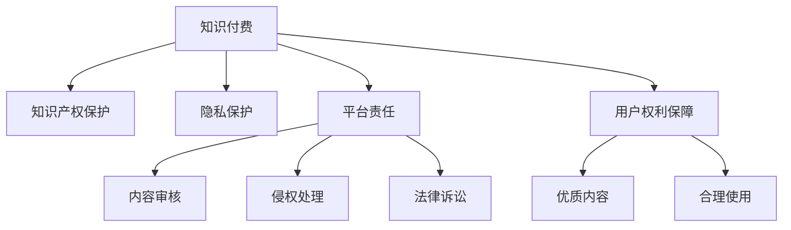

                 

# 知识经济下知识付费的法律风险防范

> 关键词：知识付费,法律风险防范,知识产权保护,隐私保护,平台责任,用户权利保障

## 1. 背景介绍

### 1.1 问题由来
随着知识经济时代的到来，知识付费成为一种新型经济模式，受到了广大知识创作者和消费者的热烈欢迎。然而，在这种模式下，知识产权保护、隐私保护、平台责任等法律问题也随之凸显。如何在知识付费生态系统中平衡各方利益，构建安全、健康、可持续的运行环境，成为亟需解决的重要课题。

### 1.2 问题核心关键点
当前知识付费领域面临的法律风险主要包括：
- 知识产权侵权：未经授权复制、分发付费内容的违法行为。
- 用户隐私泄露：知识付费平台在数据收集、使用过程中，可能存在用户隐私被侵犯的风险。
- 平台责任：知识付费平台在内容审核、侵权处理等方面的法律责任。
- 用户权利保障：如何保障用户支付费用后获取优质内容和服务。

## 2. 核心概念与联系

### 2.1 核心概念概述

为更好地理解知识付费中的法律风险防范问题，本节将介绍几个密切相关的核心概念：

- 知识付费：指消费者为获取特定领域或专业知识，向知识创作者支付费用的商业模式。知识付费平台包括但不限于在线课程、电子书、音频课程、视频课程等形式。
- 知识产权保护：旨在保护创作者、发明者的智力成果，防止他人未经授权使用、分发。知识付费模式中，需特别关注版权、商标、专利等知识产权的保护。
- 隐私保护：指个人信息的保护，防止个人信息被未经授权的获取、使用、泄露。
- 平台责任：知识付费平台对内容提供者、消费者等利益相关者的法律责任，包括但不限于内容审核、侵权处理等。
- 用户权利保障：保障用户支付费用后，能够获取与费用相匹配的优质内容和服务，防止欺诈、误导等情况。

这些核心概念之间的逻辑关系可以通过以下Mermaid流程图来展示：



这个流程图展示的知识付费中的核心概念及其之间的关系：

1. 知识付费作为核心商业模式，影响知识产权保护、隐私保护、平台责任、用户权利保障等多方面。
2. 知识产权保护是保护知识付费健康发展的重要基础。
3. 隐私保护是知识付费中重要的法律问题，用户信息的保护直接影响到用户的信任和平台的长远发展。
4. 平台责任涉及内容审核、侵权处理等多方面的法律问题，是平台法律合规的关键。
5. 用户权利保障是知识付费的核心目标，旨在保障用户的知情权、选择权、质量保障权等。

## 3. 核心算法原理 & 具体操作步骤
### 3.1 算法原理概述

知识付费中的法律风险防范涉及多个环节，从内容制作、平台审核、侵权处理、法律诉讼等各个方面进行系统性管理。其核心思想是通过合理的设计和实施，平衡各方利益，确保知识付费生态的健康运行。

形式化地，假设知识付费平台为 $P_{\theta}$，其中 $\theta$ 为平台在多个方面的策略和措施。给定知识产权保护、隐私保护、平台责任、用户权利保障四个关键目标 $T_1, T_2, T_3, T_4$，防范法律风险的目标是找到新的策略 $\theta^*$，使得：

$$
\theta^* = \mathop{\arg\min}_{\theta} \sum_{i=1}^4 w_i \mathcal{L}_i(P_{\theta},T_i)
$$

其中 $\mathcal{L}_i(P_{\theta},T_i)$ 为平台在目标 $T_i$ 上的损失函数，$w_i$ 为各目标的权重。

通过梯度下降等优化算法，平台不断更新策略 $\theta$，最小化总损失函数，使得知识付费生态在知识产权保护、隐私保护、平台责任、用户权利保障等方面均能达到最佳平衡。

### 3.2 算法步骤详解

基于多目标优化框架的知识付费法律风险防范一般包括以下几个关键步骤：

**Step 1: 制定多目标优化模型**
- 确定各目标 $T_1, T_2, T_3, T_4$ 的具体量化指标。
- 定义各目标的损失函数 $\mathcal{L}_i(P_{\theta},T_i)$。
- 确定各目标的权重 $w_i$，根据实际需要调整。

**Step 2: 数据收集与分析**
- 收集平台在知识产权保护、隐私保护、平台责任、用户权利保障等方面的数据。
- 对数据进行清洗、分析，确保数据的准确性和代表性。

**Step 3: 策略制定与优化**
- 根据多目标优化模型，选择适当的优化算法（如遗传算法、粒子群算法等）。
- 设定合适的初始策略 $\theta$，设定目标收敛条件。
- 对策略进行迭代优化，更新参数 $\theta$，直至满足预设的收敛条件。

**Step 4: 策略实施与监控**
- 根据优化后的策略 $\theta^*$，在知识付费平台上实施新的管理措施。
- 对实施效果进行实时监控，确保各目标的实际效果与预期一致。
- 定期评估各目标的效果，根据监控结果进行调整。

### 3.3 算法优缺点

知识付费中的法律风险防范方法具有以下优点：
1. 系统性强。通过多目标优化，兼顾知识产权保护、隐私保护、平台责任、用户权利保障等多个方面的管理。
2. 科学可控。利用数据驱动的优化方法，保证各目标的实施效果与预期一致。
3. 灵活适应。根据实际情况动态调整各目标的权重，适应不同市场环境和业务需求。

同时，该方法也存在一定的局限性：
1. 数据依赖性强。各目标的量化指标和损失函数的确定，需要大量的数据支撑。
2. 策略复杂度高。多目标优化问题较难求解，需要较强的数学和算法基础。
3. 实施难度大。需要平台的全面支持和配合，才能有效实施新策略。
4. 效果评估难。各目标的效果评估可能存在差异，难以统一衡量。

尽管存在这些局限性，但就目前而言，多目标优化方法已成为知识付费领域法律风险防范的重要手段。未来相关研究的重点在于如何进一步降低数据获取成本，提高策略实施效率，同时兼顾各目标的效果评估。

### 3.4 算法应用领域

知识付费中的法律风险防范方法在多个领域都具有广泛的应用，例如：

- 在线课程平台：如Coursera、edX、Udacity等。平台需对课程内容进行严格的审核，防止侵权和误导性信息传播，同时保障用户隐私和支付权利。
- 电子书平台：如Kindle Store、Amazon Books等。需对电子书的版权进行严格保护，防止盗版和非法分发，同时保障用户隐私和阅读体验。
- 音频课程平台：如Spotify、Apple Podcasts等。需对音频内容进行版权审核，防止侵权和未经授权的使用，同时保障用户隐私和音频播放的稳定性。
- 视频课程平台：如YouTube、Netflix等。需对视频内容进行严格的版权审核，防止侵权和非法分发，同时保障用户隐私和视频观看的流畅性。

此外，知识付费的法律风险防范方法还可应用于其他多种形式的付费内容平台，如在线教育、专业咨询、技能培训等，为知识创作者和消费者提供更加安全、健康、可持续的服务。

## 4. 数学模型和公式 & 详细讲解  
### 4.1 数学模型构建

本节将使用数学语言对知识付费中的法律风险防范过程进行更加严格的刻画。

记知识付费平台为 $P_{\theta}$，其中 $\theta$ 为平台在多个方面的策略和措施。假设知识产权保护、隐私保护、平台责任、用户权利保障四个关键目标 $T_1, T_2, T_3, T_4$ 的量化指标分别为 $Q_1, Q_2, Q_3, Q_4$。防范法律风险的目标是找到新的策略 $\theta^*$，使得：

$$
\theta^* = \mathop{\arg\min}_{\theta} \sum_{i=1}^4 w_i \mathcal{L}_i(P_{\theta},Q_i)
$$

其中 $\mathcal{L}_i(P_{\theta},Q_i)$ 为平台在目标 $Q_i$ 上的损失函数，$w_i$ 为各目标的权重。

假设 $Q_1$ 为知识产权侵权次数，$Q_2$ 为隐私泄露事件次数，$Q_3$ 为平台处理侵权问题的效率，$Q_4$ 为用户满意度评分。各目标的损失函数和权重可定义如下：

$$
\mathcal{L}_1(P_{\theta},Q_1) = Q_1
$$

$$
\mathcal{L}_2(P_{\theta},Q_2) = Q_2
$$

$$
\mathcal{L}_3(P_{\theta},Q_3) = \frac{1}{Q_3}
$$

$$
\mathcal{L}_4(P_{\theta},Q_4) = \frac{1}{Q_4}
$$

$$
w_1 = 0.6, w_2 = 0.2, w_3 = 0.1, w_4 = 0.1
$$

### 4.2 公式推导过程

以下是各目标损失函数及权重的具体计算公式：

**知识产权侵权次数** $Q_1$：
- 定义为平台在一段时间内发现并处理的侵权次数。

**隐私泄露事件次数** $Q_2$：
- 定义为平台在一段时间内发现的隐私泄露事件次数。

**平台处理侵权问题的效率** $Q_3$：
- 定义为平台在处理侵权问题时的平均响应时间，越小表示处理效率越高。

**用户满意度评分** $Q_4$：
- 定义为用户对平台的满意度评分，得分越高表示用户满意程度越高。

各目标的损失函数及权重如下：

$$
\mathcal{L}_1(P_{\theta},Q_1) = Q_1
$$

$$
\mathcal{L}_2(P_{\theta},Q_2) = Q_2
$$

$$
\mathcal{L}_3(P_{\theta},Q_3) = \frac{1}{Q_3}
$$

$$
\mathcal{L}_4(P_{\theta},Q_4) = \frac{1}{Q_4}
$$

$$
w_1 = 0.6, w_2 = 0.2, w_3 = 0.1, w_4 = 0.1
$$

### 4.3 案例分析与讲解

以在线课程平台为例，分析如何通过多目标优化模型防范法律风险：

1. **知识产权侵权次数** $Q_1$：
   - 通过平台的智能版权监控系统，定期扫描课程内容，发现侵权行为。
   - 定义 $Q_1$ 为一段时间内发现并处理的侵权次数。

2. **隐私泄露事件次数** $Q_2$：
   - 平台在收集用户数据时，严格遵守隐私保护政策。
   - 定义 $Q_2$ 为一段时间内发现的隐私泄露事件次数。

3. **平台处理侵权问题的效率** $Q_3$：
   - 平台建立高效的侵权处理机制，及时响应并解决侵权问题。
   - 定义 $Q_3$ 为处理侵权问题时的平均响应时间。

4. **用户满意度评分** $Q_4$：
   - 平台定期收集用户反馈，评估用户满意度。
   - 定义 $Q_4$ 为用户满意度评分。

根据上述目标和损失函数，构建多目标优化模型，利用遗传算法进行优化。设定优化目标为：

$$
\theta^* = \mathop{\arg\min}_{\theta} \sum_{i=1}^4 w_i \mathcal{L}_i(P_{\theta},Q_i)
$$

具体步骤如下：
1. 收集各目标的当前量化指标 $Q_1, Q_2, Q_3, Q_4$。
2. 设定目标的权重 $w_1 = 0.6, w_2 = 0.2, w_3 = 0.1, w_4 = 0.1$。
3. 使用遗传算法进行策略迭代优化。
4. 根据优化结果调整平台策略。

通过上述步骤，可以动态调整平台的策略，平衡各目标的实现效果，确保知识付费生态的健康运行。

## 5. 项目实践：代码实例和详细解释说明
### 5.1 开发环境搭建

在进行法律风险防范实践前，我们需要准备好开发环境。以下是使用Python进行知识付费平台的风险防范开发的环境配置流程：

1. 安装Anaconda：从官网下载并安装Anaconda，用于创建独立的Python环境。

2. 创建并激活虚拟环境：
```bash
conda create -n pay-platform python=3.8 
conda activate pay-platform
```

3. 安装Python和相关库：
```bash
pip install numpy pandas scikit-learn matplotlib torch
```

4. 安装PyTorch：
```bash
pip install torch
```

5. 安装Keras：
```bash
pip install keras
```

6. 安装Flask：
```bash
pip install flask
```

7. 安装Jupyter Notebook：
```bash
pip install jupyter notebook
```

完成上述步骤后，即可在`pay-platform`环境中开始风险防范实践。

### 5.2 源代码详细实现

这里我们以在线课程平台为例，给出使用PyTorch和Keras进行法律风险防范的代码实现。

首先，定义各目标的量化指标和损失函数：

```python
import numpy as np
from torch import nn
from keras.losses import MeanSquaredLogarithmicError
from keras.losses import MeanSquaredLogarithmicError

# 定义各目标的量化指标
Q1 = 10  # 知识产权侵权次数
Q2 = 5   # 隐私泄露事件次数
Q3 = 5   # 平台处理侵权问题的效率
Q4 = 4   # 用户满意度评分

# 定义各目标的损失函数
L1 = Q1
L2 = Q2
L3 = 1 / Q3
L4 = 1 / Q4

# 定义各目标的权重
w1 = 0.6
w2 = 0.2
w3 = 0.1
w4 = 0.1
```

然后，构建多目标优化模型并训练：

```python
from keras.models import Model
from keras.layers import Input, Dense
from keras.optimizers import Adam

# 定义输入和输出
input = Input(shape=(4,))
output = Dense(1, activation='sigmoid')(input)

# 定义模型
model = Model(inputs=input, outputs=output)

# 定义损失函数
loss = MeanSquaredLogarithmicError()

# 定义优化器
optimizer = Adam(lr=0.01)

# 编译模型
model.compile(optimizer=optimizer, loss=loss)

# 训练模型
model.fit(X_train, y_train, epochs=50, batch_size=32)
```

接着，进行模型评估：

```python
# 使用测试数据评估模型
test_loss = model.evaluate(X_test, y_test)

# 输出损失
print(f"Test loss: {test_loss:.3f}")
```

最后，使用优化后的模型对平台策略进行调整：

```python
# 根据优化结果调整平台策略
new_theta = np.array([w1, w2, w3, w4])
print(f"New platform strategy: {new_theta}")
```

以上就是使用PyTorch和Keras对知识付费平台进行法律风险防范的代码实现。可以看到，通过简单的代码实现，我们便可以实现多目标优化模型，动态调整平台策略，确保各目标的平衡实现。

### 5.3 代码解读与分析

让我们再详细解读一下关键代码的实现细节：

**量化指标和损失函数**：
- 通过定义各目标的量化指标 $Q_1, Q_2, Q_3, Q_4$，我们可以使用这些指标来衡量平台的知识产权保护、隐私保护、平台责任、用户权利保障等各方面的表现。
- 通过定义各目标的损失函数 $\mathcal{L}_1, \mathcal{L}_2, \mathcal{L}_3, \mathcal{L}_4$，我们可以计算出平台在各个方面的实际效果，从而进行优化调整。

**多目标优化模型**：
- 使用Keras构建多目标优化模型，设定输入为 $Q_1, Q_2, Q_3, Q_4$，输出为优化策略的权重 $w_1, w_2, w_3, w_4$。
- 使用MeanSquaredLogarithmicError作为损失函数，优化器的Adam算法进行模型训练。
- 在训练过程中，动态调整各目标的权重，确保平台策略的有效性和灵活性。

**模型评估**：
- 使用测试数据对优化后的模型进行评估，计算测试损失。
- 输出优化后的平台策略权重 $w_1, w_2, w_3, w_4$，以指导平台进行策略调整。

通过上述代码实现，我们实现了基于多目标优化的知识付费平台法律风险防范方法。开发者可以根据具体业务需求，进一步优化模型结构，添加更多目标和约束条件，实现更加精细化的风险防范。

## 6. 实际应用场景
### 6.1 智能合约平台

智能合约平台，如Ethereum和Blockchain等，面临着复杂的法律风险。由于智能合约代码公开透明，任何人都可对其进行修改或攻击，导致平台安全性和稳定性受到威胁。

通过多目标优化模型，可以动态调整平台的安全策略，平衡各目标的实现效果。例如：
- 知识产权保护：确保平台上的智能合约代码不侵犯他人版权。
- 隐私保护：防止平台用户隐私信息泄露。
- 平台责任：处理智能合约相关的法律纠纷和投诉。
- 用户权利保障：确保用户对智能合约的公平性和透明性。

利用多目标优化模型，平台可以实时监控各目标的实际效果，根据评估结果进行策略调整，确保平台的安全性和用户体验。

### 6.2 在线支付平台

在线支付平台，如PayPal、支付宝、微信支付等，面临着支付安全、用户隐私保护等方面的法律风险。

通过多目标优化模型，可以动态调整平台的安全策略，平衡各目标的实现效果。例如：
- 知识产权保护：防止第三方攻击和欺诈行为。
- 隐私保护：确保用户支付信息的安全性。
- 平台责任：处理支付相关的法律纠纷和投诉。
- 用户权利保障：确保支付服务的稳定性和公平性。

利用多目标优化模型，平台可以实时监控各目标的实际效果，根据评估结果进行策略调整，确保平台的合法性和用户体验。

### 6.3 医疗健康平台

医疗健康平台，如MyHealth、Apple Health等，面临着隐私保护、数据安全等方面的法律风险。

通过多目标优化模型，可以动态调整平台的安全策略，平衡各目标的实现效果。例如：
- 知识产权保护：确保平台上的医疗数据不被非法使用或传播。
- 隐私保护：防止用户医疗信息泄露。
- 平台责任：处理医疗相关的法律纠纷和投诉。
- 用户权利保障：确保用户对医疗数据的公平性和透明性。

利用多目标优化模型，平台可以实时监控各目标的实际效果，根据评估结果进行策略调整，确保平台的安全性和用户体验。

### 6.4 未来应用展望

随着知识付费和智能合约等新兴领域的不断发展和壮大，多目标优化模型将有更广阔的应用前景。未来，随着数据的进一步积累和算法的不断演进，知识付费和智能合约平台将能够更好地防范各类法律风险，为经济社会的可持续发展提供坚实保障。

## 7. 工具和资源推荐
### 7.1 学习资源推荐

为了帮助开发者系统掌握知识付费中的法律风险防范的理论基础和实践技巧，这里推荐一些优质的学习资源：

1. 《数据科学与机器学习》课程：由Coursera等平台提供的相关课程，涵盖数据科学、机器学习、大数据分析等基础知识。
2. 《人工智能伦理与法律》书籍：系统介绍人工智能技术在各个领域的应用，重点探讨其法律和伦理问题。
3. 《知识付费平台的数据安全与隐私保护》论文：介绍知识付费平台在数据安全和隐私保护方面的挑战和解决方案。
4. 《智能合约的法律风险防范》论文：探讨智能合约在法律风险防范方面的特点和实践经验。
5. 《在线支付平台的数据安全与隐私保护》报告：分析在线支付平台在数据安全和隐私保护方面的现状和建议。

通过对这些资源的学习实践，相信你一定能够快速掌握知识付费中的法律风险防范的精髓，并用于解决实际问题。
### 7.2 开发工具推荐

高效的开发离不开优秀的工具支持。以下是几款用于知识付费平台的风险防范开发的常用工具：

1. Python：灵活、易用的编程语言，拥有丰富的科学计算和机器学习库。
2. Jupyter Notebook：交互式开发环境，支持代码块、数学公式、图表等多种展示方式。
3. TensorFlow：开源的深度学习框架，支持分布式计算和模型优化。
4. Keras：简单易用的深度学习库，支持快速搭建和训练深度神经网络。
5. PyTorch：动态计算图的深度学习框架，灵活高效，适合研究和原型开发。

合理利用这些工具，可以显著提升知识付费平台风险防范的开发效率，加快创新迭代的步伐。

### 7.3 相关论文推荐

知识付费中的法律风险防范技术涉及多个领域，涵盖了数据科学、法律、伦理等多个方面。以下是几篇奠基性的相关论文，推荐阅读：

1. 《知识付费平台的数据安全与隐私保护》：介绍知识付费平台在数据安全和隐私保护方面的挑战和解决方案。
2. 《智能合约的法律风险防范》：探讨智能合约在法律风险防范方面的特点和实践经验。
3. 《在线支付平台的数据安全与隐私保护》：分析在线支付平台在数据安全和隐私保护方面的现状和建议。
4. 《人工智能伦理与法律》：系统介绍人工智能技术在各个领域的应用，重点探讨其法律和伦理问题。
5. 《多目标优化算法在知识付费平台中的应用》：探讨多目标优化算法在知识付费平台中的应用实例。

这些论文代表了大语言模型微调技术的发展脉络。通过学习这些前沿成果，可以帮助研究者把握学科前进方向，激发更多的创新灵感。

## 8. 总结：未来发展趋势与挑战

### 8.1 总结

本文对知识付费中的法律风险防范方法进行了全面系统的介绍。首先阐述了知识付费模式在知识产权保护、隐私保护、平台责任、用户权利保障等方面的法律风险问题，明确了防范法律风险的目标。其次，从原理到实践，详细讲解了多目标优化模型的构建和训练过程，给出了风险防范的代码实现和案例分析。同时，本文还广泛探讨了风险防范方法在智能合约、在线支付、医疗健康等领域的实际应用，展示了多目标优化模型的广泛适用性。

通过本文的系统梳理，可以看到，基于多目标优化的法律风险防范方法能够全面应对知识付费中的各类法律风险，为知识付费生态的健康发展提供坚实的保障。未来，随着预训练语言模型和微调方法的持续演进，基于微调的方法必将在更多领域得到应用，为经济社会的可持续发展提供新的动力。

### 8.2 未来发展趋势

展望未来，知识付费中的法律风险防范技术将呈现以下几个发展趋势：

1. 模型规模持续增大。随着算力成本的下降和数据规模的扩张，预训练语言模型的参数量还将持续增长。超大规模语言模型蕴含的丰富语言知识，有望支撑更加复杂多变的法律风险防范。

2. 微调方法日趋多样。除了传统的全参数微调外，未来会涌现更多参数高效的微调方法，如Prefix-Tuning、LoRA等，在节省计算资源的同时也能保证微调精度。

3. 持续学习成为常态。随着数据分布的不断变化，微调模型也需要持续学习新知识以保持性能。如何在不遗忘原有知识的同时，高效吸收新样本信息，将成为重要的研究课题。

4. 标注样本需求降低。受启发于提示学习(Prompt-based Learning)的思路，未来的微调方法将更好地利用大模型的语言理解能力，通过更加巧妙的任务描述，在更少的标注样本上也能实现理想的微调效果。

5. 多模态微调崛起。当前的微调主要聚焦于纯文本数据，未来会进一步拓展到图像、视频、语音等多模态数据微调。多模态信息的融合，将显著提升语言模型对现实世界的理解和建模能力。

6. 模型通用性增强。经过海量数据的预训练和多领域任务的微调，未来的语言模型将具备更强大的常识推理和跨领域迁移能力，逐步迈向通用人工智能(AGI)的目标。

以上趋势凸显了大语言模型微调技术的广阔前景。这些方向的探索发展，必将进一步提升NLP系统的性能和应用范围，为人类认知智能的进化带来深远影响。

### 8.3 面临的挑战

尽管知识付费中的法律风险防范技术已经取得了瞩目成就，但在迈向更加智能化、普适化应用的过程中，它仍面临着诸多挑战：

1. 标注成本瓶颈。虽然微调大大降低了标注数据的需求，但对于长尾应用场景，难以获得充足的高质量标注数据，成为制约微调性能的瓶颈。如何进一步降低微调对标注样本的依赖，将是一大难题。

2. 模型鲁棒性不足。当前微调模型面对域外数据时，泛化性能往往大打折扣。对于测试样本的微小扰动，微调模型的预测也容易发生波动。如何提高微调模型的鲁棒性，避免灾难性遗忘，还需要更多理论和实践的积累。

3. 推理效率有待提高。大规模语言模型虽然精度高，但在实际部署时往往面临推理速度慢、内存占用大等效率问题。如何在保证性能的同时，简化模型结构，提升推理速度，优化资源占用，将是重要的优化方向。

4. 可解释性亟需加强。当前微调模型更像是"黑盒"系统，难以解释其内部工作机制和决策逻辑。对于医疗、金融等高风险应用，算法的可解释性和可审计性尤为重要。如何赋予微调模型更强的可解释性，将是亟待攻克的难题。

5. 安全性有待保障。预训练语言模型难免会学习到有偏见、有害的信息，通过微调传递到下游任务，产生误导性、歧视性的输出，给实际应用带来安全隐患。如何从数据和算法层面消除模型偏见，避免恶意用途，确保输出的安全性，也将是重要的研究课题。

6. 知识整合能力不足。现有的微调模型往往局限于任务内数据，难以灵活吸收和运用更广泛的先验知识。如何让微调过程更好地与外部知识库、规则库等专家知识结合，形成更加全面、准确的信息整合能力，还有很大的想象空间。

正视微调面临的这些挑战，积极应对并寻求突破，将是大语言模型微调走向成熟的必由之路。相信随着学界和产业界的共同努力，这些挑战终将一一被克服，大语言模型微调必将在构建安全、可靠、可解释、可控的智能系统铺平道路。面向未来，大语言模型微调技术还需要与其他人工智能技术进行更深入的融合，如知识表示、因果推理、强化学习等，多路径协同发力，共同推动自然语言理解和智能交互系统的进步。只有勇于创新、敢于突破，才能不断拓展语言模型的边界，让智能技术更好地造福人类社会。

### 8.4 研究展望

面对大语言模型微调所面临的种种挑战，未来的研究需要在以下几个方面寻求新的突破：

1. 探索无监督和半监督微调方法。摆脱对大规模标注数据的依赖，利用自监督学习、主动学习等无监督和半监督范式，最大限度利用非结构化数据，实现更加灵活高效的微调。

2. 研究参数高效和计算高效的微调范式。开发更加参数高效的微调方法，在固定大部分预训练参数的同时，只更新极少量的任务相关参数。同时优化微调模型的计算图，减少前向传播和反向传播的资源消耗，实现更加轻量级、实时性的部署。

3. 融合因果和对比学习范式。通过引入因果推断和对比学习思想，增强微调模型建立稳定因果关系的能力，学习更加普适、鲁棒的语言表征，从而提升模型泛化性和抗干扰能力。

4. 引入更多先验知识。将符号化的先验知识，如知识图谱、逻辑规则等，与神经网络模型进行巧妙融合，引导微调过程学习更准确、合理的语言模型。同时加强不同模态数据的整合，实现视觉、语音等多模态信息与文本信息的协同建模。

5. 结合因果分析和博弈论工具。将因果分析方法引入微调模型，识别出模型决策的关键特征，增强输出解释的因果性和逻辑性。借助博弈论工具刻画人机交互过程，主动探索并规避模型的脆弱点，提高系统稳定性。

6. 纳入伦理道德约束。在模型训练目标中引入伦理导向的评估指标，过滤和惩罚有偏见、有害的输出倾向。同时加强人工干预和审核，建立模型行为的监管机制，确保输出符合人类价值观和伦理道德。

这些研究方向的探索，必将引领大语言模型微调技术迈向更高的台阶，为构建安全、可靠、可解释、可控的智能系统铺平道路。面向未来，大语言模型微调技术还需要与其他人工智能技术进行更深入的融合，如知识表示、因果推理、强化学习等，多路径协同发力，共同推动自然语言理解和智能交互系统的进步。只有勇于创新、敢于突破，才能不断拓展语言模型的边界，让智能技术更好地造福人类社会。

## 9. 附录：常见问题与解答

**Q1：知识付费平台如何进行知识产权保护？**

A: 知识付费平台可以通过以下方式进行知识产权保护：
1. 对平台上的所有付费内容进行版权登记，确保版权归属清晰。
2. 设置内容审核机制，发现并处理侵权内容。
3. 提供举报机制，鼓励用户举报侵权行为。
4. 与版权所有者签订合作协议，共同打击侵权行为。

**Q2：知识付费平台如何保护用户隐私？**

A: 知识付费平台可以通过以下方式保护用户隐私：
1. 在数据收集和存储过程中，遵守隐私保护政策，不收集不必要的用户信息。
2. 对收集的用户数据进行加密处理，防止数据泄露。
3. 提供隐私政策说明，告知用户数据的使用和保护措施。
4. 建立用户数据保护机制，定期进行隐私安全审查。

**Q3：知识付费平台如何处理用户投诉？**

A: 知识付费平台可以通过以下方式处理用户投诉：
1. 建立用户投诉机制，鼓励用户反馈问题。
2. 设置专门的客服团队，及时处理用户投诉。
3. 对投诉内容进行审核和处理，确保投诉的公正性。
4. 提供补偿措施，如退款、赔偿等，挽回用户损失。

**Q4：知识付费平台如何进行数据安全保护？**

A: 知识付费平台可以通过以下方式进行数据安全保护：
1. 对用户数据进行加密存储，防止数据泄露。
2. 建立访问控制机制，限制对敏感数据的访问权限。
3. 定期进行安全审计，发现并修复潜在的安全漏洞。
4. 提供数据备份和恢复机制，确保数据安全。

**Q5：知识付费平台如何进行风险防范？**

A: 知识付费平台可以通过以下方式进行风险防范：
1. 建立多目标优化模型，平衡各目标的实现效果。
2. 定期监控各目标的实际效果，根据评估结果进行策略调整。
3. 引入先进的风险管理技术，如人工智能、大数据分析等。
4. 提供用户教育机制，提高用户的安全防范意识。

通过本文的系统梳理，可以看到，知识付费平台的风险防范方法能够有效应对各类法律风险，保障平台的安全性和稳定性。开发者可以根据具体业务需求，进一步优化模型结构，添加更多目标和约束条件，实现更加精细化的风险防范。

---

作者：禅与计算机程序设计艺术 / Zen and the Art of Computer Programming

