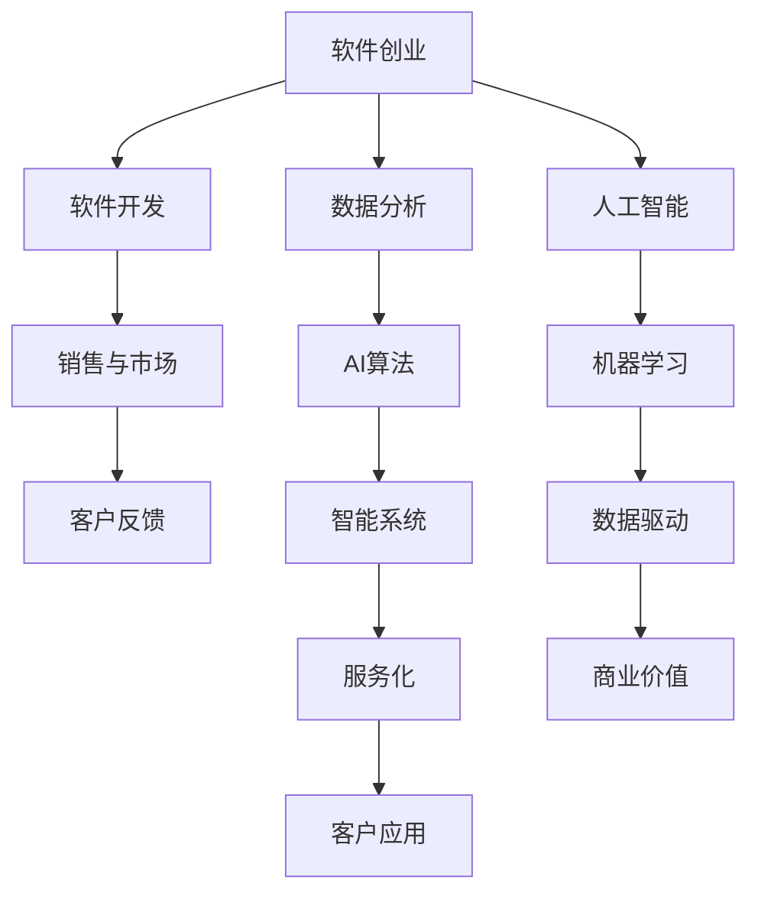

                 

# 知识经济下程序员的创业之道

## 1. 背景介绍

在知识经济时代，信息技术成为驱动经济增长的关键力量。程序员作为信息技术的创造者和实践者，面临着前所未有的创业机遇和挑战。如何把握知识经济的特点，发挥信息技术的作用，创造出符合市场需求的创新产品，成为程序员创业之路的必修课。本文将从背景介绍、核心概念与联系、核心算法原理、项目实践、实际应用场景等多个角度深入探讨程序员在知识经济下的创业之道。

## 2. 核心概念与联系

### 2.1 核心概念概述

在知识经济背景下，程序员的创业主要聚焦于信息技术领域，利用软件开发、数据分析、人工智能等技术，创建具备创新性和市场价值的产品。

- **软件创业**：通过开发和销售软件产品或服务，满足市场需求，实现商业价值。
- **数据驱动创业**：利用大数据、人工智能等技术，进行数据分析和建模，提供决策支持服务。
- **AI创业**：基于人工智能算法，开发智能系统或应用，提升自动化和智能化水平。

### 2.2 核心概念原理和架构的 Mermaid 流程图



## 3. 核心算法原理 & 具体操作步骤

### 3.1 算法原理概述

程序员在创业过程中，通常需要掌握一些核心的算法和技术，以实现产品的创新和优化。

- **软件开发**：包括软件开发框架（如Spring、Django等）、版本控制（如Git）、持续集成（如Jenkins）等。
- **数据分析**：涉及数据收集、数据清洗、数据分析（如统计分析、机器学习等）、数据可视化（如Tableau）等。
- **人工智能**：涵盖机器学习（如分类、回归、聚类等）、深度学习（如卷积神经网络、循环神经网络等）、自然语言处理（如文本分类、情感分析等）。

### 3.2 算法步骤详解

软件开发过程中，核心步骤包括：

1. **需求分析**：与用户和市场沟通，明确产品功能和用户需求。
2. **系统设计**：进行系统架构设计，选择技术栈和开发工具。
3. **编码实现**：根据设计文档，进行代码实现。
4. **测试与调试**：通过单元测试、集成测试、系统测试等手段，发现和修复问题。
5. **部署上线**：将产品部署到服务器，进行版本发布。

数据分析过程中的关键步骤包括：

1. **数据收集**：从不同渠道收集数据，如日志文件、用户行为数据、市场调研数据等。
2. **数据清洗**：去除噪声和异常值，处理缺失值和重复值。
3. **数据建模**：选择合适的算法，进行数据建模和特征工程。
4. **模型评估**：通过交叉验证、ROC曲线、AUC等指标，评估模型性能。
5. **模型应用**：将模型应用到实际场景中，进行预测或推荐。

人工智能的算法步骤包括：

1. **数据预处理**：对原始数据进行清洗、归一化、特征提取等操作。
2. **模型训练**：使用训练数据集，进行模型训练和参数调整。
3. **模型测试**：在测试数据集上，评估模型性能和泛化能力。
4. **模型优化**：通过调参、集成、迁移学习等手段，提升模型效果。
5. **模型部署**：将训练好的模型部署到生产环境，进行实时预测或决策。

### 3.3 算法优缺点

软件开发过程的优点包括：

- **灵活性**：可以根据需求快速调整和迭代产品功能。
- **可扩展性**：能够通过模块化设计和微服务架构，支持系统扩展。
- **技术多样性**：涉及多种技术栈和工具，满足不同场景需求。

缺点包括：

- **成本高**：软件开发和维护需要较高的人力和资源投入。
- **风险高**：市场需求变化快，产品迭代周期长，存在失败风险。

数据分析的优点包括：

- **洞察力强**：通过数据分析，可以发现市场趋势和用户需求。
- **决策支持**：提供基于数据支持的决策参考，减少主观判断误差。
- **结果可验证**：通过模型评估和验证，确保分析结果的可靠性和准确性。

缺点包括：

- **数据质量要求高**：需要高质量、完整的数据集，数据收集和清洗复杂。
- **技术门槛高**：涉及复杂的数据处理和建模技术，需要专业技能支持。

人工智能的优点包括：

- **自动化强**：能够自动化完成复杂任务，提高工作效率。
- **智能决策**：基于深度学习和机器学习算法，进行智能决策和推荐。
- **技术前沿**：处于技术前沿领域，具备创新和竞争优势。

缺点包括：

- **模型复杂**：模型复杂度增加，训练和优化难度大。
- **数据依赖**：需要大量高质量标注数据，数据获取成本高。
- **解释性差**：黑盒模型难于解释其内部机制和决策过程。

### 3.4 算法应用领域

软件开发在各行各业都有广泛应用，如电子商务平台、社交网络应用、移动端APP等。

数据分析广泛应用于金融、电商、医疗、教育等领域，提供数据驱动的决策支持。

人工智能技术则在语音识别、图像识别、自然语言处理、智能推荐等方面，展现出了强大的应用潜力。

## 4. 数学模型和公式 & 详细讲解 & 举例说明

### 4.1 数学模型构建

对于软件开发，常用的模型包括：

- **系统架构模型**：如UML（统一建模语言），用于描述系统组件和交互关系。
- **测试模型**：如单元测试模型、集成测试模型，用于验证系统功能。
- **部署模型**：如微服务架构模型，用于设计分布式系统。

对于数据分析，常用的数学模型包括：

- **回归模型**：如线性回归、多项式回归、决策树回归等，用于预测连续变量。
- **分类模型**：如逻辑回归、支持向量机、随机森林等，用于分类预测。
- **聚类模型**：如K-means聚类、层次聚类等，用于发现数据分布特征。

对于人工智能，常用的数学模型包括：

- **神经网络模型**：如前馈神经网络、卷积神经网络、循环神经网络等，用于处理结构化数据。
- **深度学习模型**：如自编码器、生成对抗网络、变分自编码器等，用于处理非结构化数据。
- **强化学习模型**：如Q-learning、策略梯度等，用于决策优化。

### 4.2 公式推导过程

以线性回归模型为例，其公式推导如下：

设$y$为连续变量，$x$为特征向量，$\theta$为模型参数。线性回归模型公式为：

$$
y = \theta_0 + \theta_1x_1 + \theta_2x_2 + \ldots + \theta_nx_n
$$

其中$\theta_0,\theta_1,\theta_2,\ldots,\theta_n$为回归系数。最小二乘法求解$\theta$的过程如下：

$$
\theta = (X^TX)^{-1}X^Ty
$$

其中$X=[x_1, x_2, \ldots, x_n]$，$y=[y_1, y_2, \ldots, y_n]$，$(X^TX)^{-1}$为矩阵$X^TX$的逆矩阵。

### 4.3 案例分析与讲解

以电商平台的推荐系统为例，数据分析和人工智能相结合，提供个性化推荐服务。

- **数据收集**：从用户浏览记录、购买历史、评分数据中，提取特征变量。
- **数据清洗**：处理缺失值、噪声值、异常值。
- **数据建模**：使用协同过滤、深度学习等算法，建立用户-商品相似性矩阵。
- **模型评估**：通过A/B测试、离线评估指标（如精确率、召回率、F1分数），评估推荐模型效果。
- **模型优化**：通过特征工程、模型调参、集成学习等手段，提升推荐精度。
- **模型应用**：将训练好的模型部署到推荐引擎中，实时推荐商品给用户。

## 5. 项目实践：代码实例和详细解释说明

### 5.1 开发环境搭建

- **软件开发**：搭建Jenkins服务器，实现CI/CD，提升开发效率。
- **数据分析**：搭建Hadoop集群，进行大数据处理和分析。
- **人工智能**：使用TensorFlow或PyTorch框架，搭建深度学习模型。

### 5.2 源代码详细实现

以下是一个简单的电商推荐系统代码实现：

```python
import pandas as pd
import numpy as np
from sklearn.model_selection import train_test_split
from sklearn.feature_extraction.text import TfidfVectorizer
from sklearn.linear_model import LogisticRegression
from sklearn.metrics import accuracy_score

# 读取数据
data = pd.read_csv('data.csv')

# 数据清洗
data = data.dropna(subset=['item_id', 'user_id', 'rating'])

# 特征提取
tfidf = TfidfVectorizer()
X = tfidf.fit_transform(data['item_description'])
y = data['rating']

# 数据分割
X_train, X_test, y_train, y_test = train_test_split(X, y, test_size=0.2, random_state=42)

# 模型训练
model = LogisticRegression()
model.fit(X_train, y_train)

# 模型评估
y_pred = model.predict(X_test)
accuracy = accuracy_score(y_test, y_pred)
print('Accuracy:', accuracy)
```

### 5.3 代码解读与分析

- **数据读取与清洗**：使用pandas库，读取CSV格式的数据文件，并进行数据清洗，去除缺失值和异常值。
- **特征提取**：使用TF-IDF算法，将商品描述转换为数值特征向量。
- **模型训练与评估**：使用逻辑回归模型，进行训练和测试，计算模型精度。

## 6. 实际应用场景

### 6.1 电商推荐

电商推荐系统通过分析用户行为数据，为用户推荐感兴趣的商品，提高转化率和销售额。

### 6.2 金融风险评估

金融领域通过数据分析，评估客户的信用风险，提供贷款、保险等服务。

### 6.3 医疗诊断

医疗诊断系统通过分析患者历史数据，提供疾病预测和治疗方案，提升医疗服务质量。

### 6.4 未来应用展望

未来，知识经济将进一步深化，信息技术在各个领域的应用将更加广泛和深入。程序员需要不断学习和掌握新技术，紧跟市场趋势，创造出更多创新产品，满足市场需求。

## 7. 工具和资源推荐

### 7.1 学习资源推荐

- **书籍**：《深入理解计算机系统》《数据科学导论》《Python编程：从入门到实践》等。
- **在线课程**：Coursera、Udacity、edX等平台提供的计算机科学、数据科学相关课程。
- **技术社区**：Stack Overflow、GitHub、Kaggle等平台，获取技术支持和参与开源项目。

### 7.2 开发工具推荐

- **版本控制**：Git，Github。
- **构建工具**：Jenkins，Maven。
- **数据分析**：Pandas，NumPy，Scikit-Learn。
- **人工智能**：TensorFlow，PyTorch，Scikit-Learn。

### 7.3 相关论文推荐

- 《深度学习》：Ian Goodfellow等著。
- 《机器学习实战》：Peter Harrington著。
- 《Python数据科学手册》：Jake VanderPlas著。

## 8. 总结：未来发展趋势与挑战

### 8.1 研究成果总结

知识经济下的程序员创业，需要掌握软件开发、数据分析、人工智能等核心技能，开发创新性产品，满足市场需求。通过本文的学习，可以理解知识经济的特点，掌握核心算法和实践技巧，提升创业成功率。

### 8.2 未来发展趋势

- **技术迭代快**：信息技术发展迅速，需要持续学习和掌握新技术。
- **市场竞争激烈**：市场竞争激烈，需要不断创新和优化产品。
- **市场需求多样**：市场需求多样化，需要灵活调整和满足不同需求。

### 8.3 面临的挑战

- **技术门槛高**：需要掌握多种技术栈和工具，技术复杂度高。
- **市场变化快**：市场变化快，需要快速迭代和适应。
- **资源投入大**：开发和维护需要较高的人力和资源投入。

### 8.4 研究展望

未来，知识经济将进一步发展，信息技术在各个领域的应用将更加深入。程序员需要不断学习和掌握新技术，紧跟市场趋势，创造出更多创新产品，满足市场需求。同时，需要注意数据隐私和伦理问题，确保技术应用的合法性和道德性。

## 9. 附录：常见问题与解答

**Q1：如何选择合适的编程语言？**

A: 根据项目需求和团队背景，选择合适的编程语言。常见的选择包括Python、Java、C++等。

**Q2：如何提高编程效率？**

A: 使用IDE（集成开发环境），如Visual Studio Code、PyCharm等。使用版本控制工具，如Git。使用代码生成工具，如JHipster、Spring Boot等。

**Q3：如何快速上手新技术？**

A: 参加在线课程和培训，阅读相关书籍和文档。参与开源项目，与社区交流。关注行业动态，参加技术会议和研讨会。

**Q4：如何解决代码重构问题？**

A: 使用设计模式，如单例模式、工厂模式等。进行代码重构，优化代码结构和性能。使用自动化工具，如SonarQube、JArchitect等，进行代码质量检测和分析。

**Q5：如何管理项目进度？**

A: 使用项目管理工具，如JIRA、Trello等。设定清晰的项目目标和里程碑。进行代码审查和测试，确保项目质量。定期汇报项目进展，与利益相关者沟通。

作者：禅与计算机程序设计艺术 / Zen and the Art of Computer Programming

