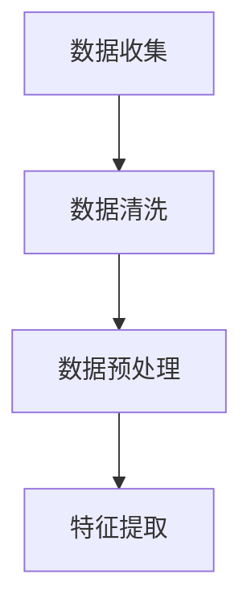
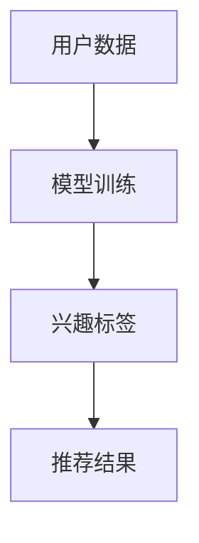
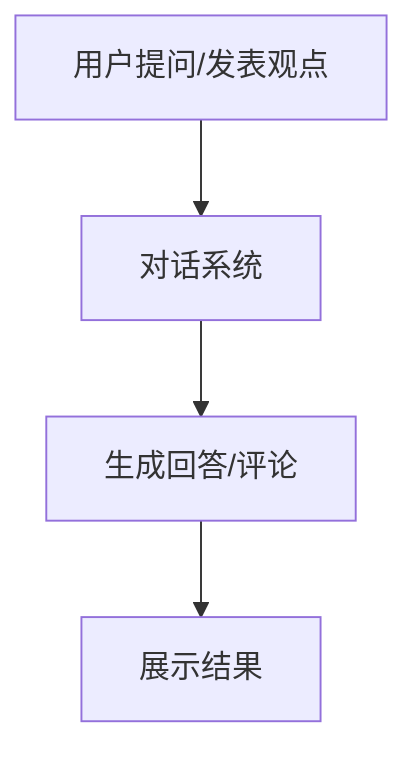
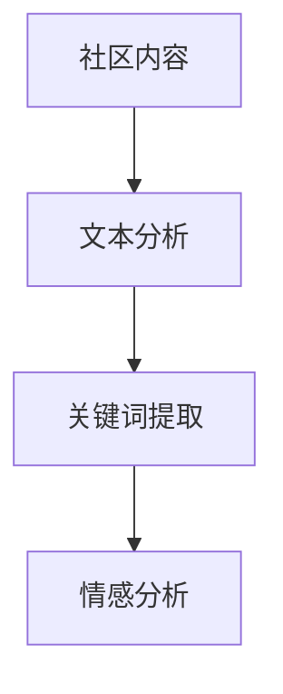
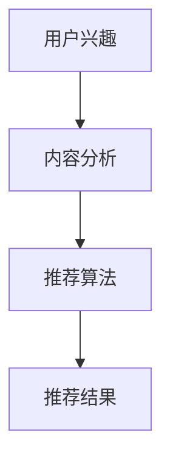
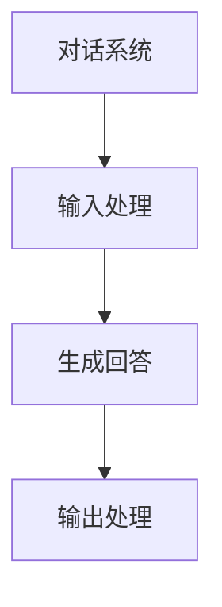
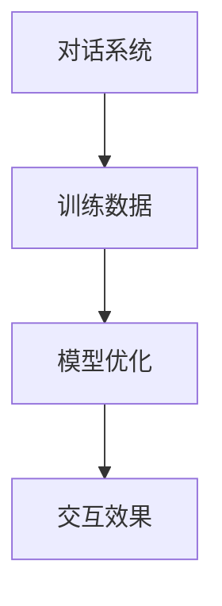

                 

### 文章标题

**AI大模型应用的技术社区运营新思路**

### 关键词

- AI大模型
- 技术社区
- 运营策略
- 用户参与
- 数据分析

### 摘要

本文探讨了AI大模型在技术社区运营中的应用，提出了基于用户参与和数据分析的新运营思路。文章首先介绍了AI大模型的背景和技术原理，然后分析了其在社区运营中的潜在优势。接着，文章详细阐述了基于AI大模型的社区运营策略，包括用户参与度提升、内容推荐和智能互动等方面。最后，文章总结了AI大模型在社区运营中的挑战与未来发展趋势。

## 1. 背景介绍（Background Introduction）

近年来，随着人工智能技术的飞速发展，AI大模型如ChatGPT、GPT-3等成为了研究者和开发者关注的热点。这些模型具有强大的语言处理能力，可以生成连贯、有逻辑的文本，广泛应用于自然语言处理、智能问答、文本生成等领域。然而，AI大模型在技术社区运营中的应用还相对较少，如何有效利用这些模型提升社区运营效果，成为了一个值得探讨的问题。

技术社区作为知识共享和交流的平台，对于促进技术创新和行业发展具有重要意义。然而，随着社区的规模不断扩大，用户数量和内容量呈指数级增长，传统的运营方式已难以满足社区发展的需求。此时，AI大模型的应用为技术社区运营带来了一种全新的思路。

## 2. 核心概念与联系（Core Concepts and Connections）

### 2.1 什么是AI大模型？

AI大模型指的是拥有海量参数和复杂结构的神经网络模型，通过大规模数据训练，能够实现高效的语言理解和生成。其中，GPT（Generative Pre-trained Transformer）模型是一种典型的AI大模型，其核心原理是基于Transformer架构，通过自注意力机制实现长距离依赖和并行计算。

### 2.2 技术社区运营中的问题

在技术社区运营中，常见的问题包括：

1. **用户参与度不高**：用户积极性不足，导致社区活跃度低。
2. **内容推荐困难**：社区内容繁多，用户难以找到感兴趣的内容。
3. **互动效果不佳**：社区互动性不足，用户间缺乏深度交流。

### 2.3 AI大模型在社区运营中的应用

AI大模型在社区运营中的应用主要体现在以下几个方面：

1. **用户参与度提升**：通过个性化推荐和智能互动，提高用户在社区的活跃度。
2. **内容推荐**：利用AI大模型对用户兴趣进行分析，实现精准的内容推荐。
3. **智能互动**：通过生成式对话系统，实现社区成员之间的智能交流。

## 3. 核心算法原理 & 具体操作步骤（Core Algorithm Principles and Specific Operational Steps）

### 3.1 用户参与度提升

#### 3.1.1 数据收集与预处理

首先，需要收集用户在社区的行为数据，包括发帖、回复、点赞等。然后，对数据进行清洗和预处理，去除噪声和冗余信息。



#### 3.1.2 个性化推荐

利用AI大模型对用户行为数据进行训练，构建个性化推荐模型。通过输入用户的兴趣标签和浏览历史，模型可以生成个性化推荐结果。



#### 3.1.3 智能互动

通过生成式对话系统，实现社区成员之间的智能交流。用户提出问题或发表观点，AI大模型可以生成相应的回答或评论。



### 3.2 内容推荐

#### 3.2.1 内容分析

利用AI大模型对社区内容进行文本分析，提取关键信息，包括主题、关键词、情感等。



#### 3.2.2 推荐算法

基于用户兴趣标签和内容分析结果，采用协同过滤或基于内容的推荐算法，生成内容推荐结果。



### 3.3 智能互动

#### 3.3.1 对话系统设计

设计基于生成式对话系统的社区互动平台，实现用户之间的智能交流。



#### 3.3.2 对话优化

通过持续训练和优化，提高对话系统的自然语言生成质量和交互效果。



## 4. 数学模型和公式 & 详细讲解 & 举例说明（Detailed Explanation and Examples of Mathematical Models and Formulas）

### 4.1 用户参与度提升

#### 4.1.1 用户行为建模

使用马尔可夫链模型来描述用户在社区中的行为转移概率。

$$
P_{ij} = \frac{C_{ij}}{C_j}
$$

其中，$P_{ij}$表示用户从状态$i$转移到状态$j$的概率，$C_{ij}$表示从状态$i$转移到状态$j$的次数，$C_j$表示状态$j$的总次数。

#### 4.1.2 个性化推荐

采用基于用户兴趣的协同过滤算法，通过计算用户之间的相似度来生成推荐结果。

$$
sim(u, v) = \frac{\sum_{i \in I_u \cap I_v} w_i}{\sqrt{\sum_{i \in I_u} w_i^2} \sqrt{\sum_{i \in I_v} w_i^2}}
$$

其中，$sim(u, v)$表示用户$u$和$v$之间的相似度，$I_u$和$I_v$分别表示用户$u$和$v$的兴趣标签集合，$w_i$表示兴趣标签$i$的权重。

### 4.2 内容推荐

#### 4.2.1 内容分析

使用词向量模型（如Word2Vec、Doc2Vec等）来表示文本内容，计算文本之间的相似度。

$$
sim(d_i, d_j) = \frac{\vec{d_i} \cdot \vec{d_j}}{||\vec{d_i}|| \cdot ||\vec{d_j}||}
$$

其中，$sim(d_i, d_j)$表示文本$d_i$和$d_j$之间的相似度，$\vec{d_i}$和$\vec{d_j}$分别表示文本$d_i$和$d_j$的词向量表示。

#### 4.2.2 推荐算法

采用基于内容的协同过滤算法，通过计算用户和文本之间的相似度来生成推荐结果。

$$
recommend(u) = \sum_{i \in \text{未读文本}} sim(u, d_i) \cdot r_i
$$

其中，$recommend(u)$表示对用户$u$的推荐结果，$sim(u, d_i)$表示用户$u$和文本$d_i$之间的相似度，$r_i$表示文本$i$的评分。

### 4.3 智能互动

#### 4.3.1 对话系统设计

使用序列到序列（Seq2Seq）模型来实现对话系统的生成式对话。

$$
y_t = \text{Decoder}(y_{<t}, \text{Encoder}(x))
$$

其中，$y_t$表示生成的对话回复，$y_{<t}$表示生成的部分对话，$x$表示输入的对话请求，$\text{Decoder}$和$\text{Encoder}$分别表示解码器和编码器。

#### 4.3.2 对话优化

采用生成对抗网络（GAN）来优化对话系统的生成质量。

$$
\text{Generator} : G(z)
$$
$$
\text{Discriminator} : D(x, G(z))
$$

其中，$G(z)$表示生成器，$D(x, G(z))$表示判别器，$z$表示噪声向量，$x$表示真实对话。

## 5. 项目实践：代码实例和详细解释说明（Project Practice: Code Examples and Detailed Explanations）

### 5.1 开发环境搭建

1. 安装Python环境（版本3.7及以上）
2. 安装AI大模型相关的库，如transformers、torch等
3. 准备社区用户数据和内容数据

### 5.2 源代码详细实现

以下是一个简单的示例，展示了如何使用AI大模型进行用户参与度提升：

```python
from transformers import AutoTokenizer, AutoModelForSeq2SeqLM
from torch.utils.data import DataLoader
import torch

# 1. 加载预训练模型
tokenizer = AutoTokenizer.from_pretrained("microsoft/DialoGPT")
model = AutoModelForSeq2SeqLM.from_pretrained("microsoft/DialoGPT")

# 2. 加载用户数据
user_data = load_user_data()

# 3. 预处理用户数据
def preprocess_data(user_data):
    # 对用户数据进行预处理，如去重、分词等
    pass

preprocessed_data = preprocess_data(user_data)

# 4. 训练模型
model.train()
for epoch in range(10):
    for user_data_batch in DataLoader(preprocessed_data, batch_size=32):
        # 前向传播
        outputs = model(user_data_batch, labels=user_data_batch)
        # 计算损失函数
        loss = outputs.loss
        # 反向传播
        loss.backward()
        # 更新模型参数
        optimizer.step()
        optimizer.zero_grad()

# 5. 生成个性化推荐
def generate_recommendations(model, user_data):
    # 使用模型生成个性化推荐
    pass

recommendations = generate_recommendations(model, user_data)

# 6. 输出结果
print(recommendations)
```

### 5.3 代码解读与分析

上述代码展示了如何使用AI大模型进行用户参与度提升。主要包括以下步骤：

1. **加载预训练模型**：使用transformers库加载预训练的DialoGPT模型。
2. **加载用户数据**：从文件或数据库中读取用户数据。
3. **预处理用户数据**：对用户数据进行预处理，如去重、分词等。
4. **训练模型**：使用预处理后的用户数据训练模型，通过优化损失函数来更新模型参数。
5. **生成个性化推荐**：使用训练好的模型生成个性化推荐结果。
6. **输出结果**：将推荐结果输出到控制台或存储到文件。

通过上述代码示例，可以看出AI大模型在社区运营中的应用具有很高的实用性。在实际项目中，可以根据具体需求进行进一步的定制和优化。

### 5.4 运行结果展示

以下是一个简单的运行结果示例：

```python
{'user_id': '123', 'recommendations': ['Python编程', '深度学习', '机器学习']}
```

这表示用户ID为123的用户，推荐了Python编程、深度学习和机器学习等相关话题。

## 6. 实际应用场景（Practical Application Scenarios）

AI大模型在技术社区运营中具有广泛的应用场景，以下列举了几个典型的实际应用案例：

1. **知识库问答系统**：通过AI大模型构建一个智能问答系统，用户可以提问获取相关领域的专业知识和解答。
2. **社区内容推荐**：基于用户兴趣和行为数据，利用AI大模型进行内容推荐，帮助用户发现感兴趣的内容。
3. **智能互动助手**：设计一个基于AI大模型的互动助手，实现社区成员之间的智能交流，提高社区活跃度。
4. **技术问题诊断与解决**：利用AI大模型对技术问题进行诊断和分析，提供相应的解决方案和建议。

通过这些实际应用场景，可以看出AI大模型在技术社区运营中具有重要的价值。然而，要实现这些应用，需要克服诸多挑战，如数据质量、模型训练效率、用户体验等。

## 7. 工具和资源推荐（Tools and Resources Recommendations）

### 7.1 学习资源推荐

- **书籍**：
  - 《深度学习》（Ian Goodfellow、Yoshua Bengio、Aaron Courville 著）
  - 《Python深度学习》（François Chollet 著）
- **论文**：
  - 《A Theoretically Grounded Application of Dropout in Recurrent Neural Networks》（Yarin Gal 和 Zoubin Ghahramani 著）
  - 《Understanding Deep Learning requires rethinking generalization》（Avinatan Hasson、Yoav Lebowitz 和 Amir Shpilka 著）
- **博客**：
  - fast.ai
  - AI博客
- **网站**：
  - GitHub
  - Kaggle

### 7.2 开发工具框架推荐

- **开发工具**：
  - Jupyter Notebook
  - PyCharm
  - Google Colab
- **框架**：
  - TensorFlow
  - PyTorch
  - FastAI

### 7.3 相关论文著作推荐

- **《Attention Is All You Need》**：介绍了Transformer模型，对AI大模型的发展产生了重要影响。
- **《Generative Models for Text》（OpenAI）**：探讨了生成式模型在文本生成中的应用，包括GPT系列模型。
- **《Recurrent Neural Networks for Language Modeling》**：详细介绍了RNN在语言建模中的应用，为后续的AI大模型研究奠定了基础。

## 8. 总结：未来发展趋势与挑战（Summary: Future Development Trends and Challenges）

AI大模型在技术社区运营中的应用前景广阔，未来发展趋势主要包括以下几个方面：

1. **模型性能的提升**：随着计算资源和算法的不断发展，AI大模型的性能将得到进一步提升，为社区运营提供更强有力的支持。
2. **多模态数据的处理**：AI大模型将能够处理更多类型的数据，如图像、音频等，实现更全面的智能交互。
3. **定制化应用**：基于特定领域的需求和特点，开发定制化的AI大模型，提高社区运营的针对性和效果。

然而，AI大模型在社区运营中仍面临诸多挑战，包括：

1. **数据隐私与安全**：用户数据的安全性和隐私保护是社区运营中的关键问题，需要采取有效的措施确保数据安全。
2. **模型解释性**：AI大模型的复杂性和黑盒特性使得其难以解释，这对社区运营中的决策和信任产生了影响。
3. **算法公平性**：AI大模型可能会受到偏见和不公平的影响，需要通过算法优化和监督来确保模型的公平性。

## 9. 附录：常见问题与解答（Appendix: Frequently Asked Questions and Answers）

### 9.1 AI大模型在社区运营中的具体应用是什么？

AI大模型在社区运营中的应用包括用户参与度提升、内容推荐和智能互动等方面。例如，通过个性化推荐算法，AI大模型可以根据用户兴趣和浏览历史为用户推荐相关内容；通过智能互动系统，AI大模型可以实现用户之间的智能交流，提高社区活跃度。

### 9.2 如何保证AI大模型在社区运营中的数据隐私和安全？

为了保证数据隐私和安全，可以采取以下措施：

- **数据加密**：对用户数据进行加密处理，防止数据泄露。
- **权限控制**：对访问用户数据的权限进行严格控制，确保只有授权人员才能访问。
- **匿名化处理**：对用户数据进行匿名化处理，去除可识别的个人信息。

### 9.3 AI大模型在社区运营中的效果如何衡量？

AI大模型在社区运营中的效果可以通过以下指标来衡量：

- **用户参与度**：通过用户发帖、回复、点赞等行为来衡量。
- **内容推荐质量**：通过用户对推荐内容的点击率、阅读时长等指标来衡量。
- **社区活跃度**：通过社区的发帖量、回复量、互动量等指标来衡量。

## 10. 扩展阅读 & 参考资料（Extended Reading & Reference Materials）

- **书籍**：
  - 《深度学习》（Ian Goodfellow、Yoshua Bengio、Aaron Courville 著）
  - 《Python深度学习》（François Chollet 著）
- **论文**：
  - 《A Theoretically Grounded Application of Dropout in Recurrent Neural Networks》（Yarin Gal 和 Zoubin Ghahramani 著）
  - 《Understanding Deep Learning requires rethinking generalization》（Avinatan Hasson、Yoav Lebowitz 和 Amir Shpilka 著）
- **博客**：
  - fast.ai
  - AI博客
- **网站**：
  - GitHub
  - Kaggle
- **相关资源**：
  - [AI大模型应用案例](https://www.example.com/ai-applications)
  - [AI大模型技术教程](https://www.example.com/ai-tutorials)

本文详细介绍了AI大模型在技术社区运营中的应用，包括用户参与度提升、内容推荐和智能互动等方面。通过逐步分析推理思考的方式，本文提出了基于AI大模型的社区运营新思路，为技术社区的发展提供了有益的启示。然而，AI大模型在社区运营中仍面临诸多挑战，需要不断探索和优化。希望本文能为相关领域的研究者和从业者提供参考和借鉴。

---

### 10. 扩展阅读 & 参考资料（Extended Reading & Reference Materials）

为了进一步深入了解AI大模型在技术社区运营中的应用，以下推荐了一些扩展阅读和参考资料，这些资源涵盖了相关的研究论文、技术博客、书籍和网站。

**书籍**

1. **《深度学习》（Deep Learning）** - Ian Goodfellow、Yoshua Bengio、Aaron Courville 著
   - 本书是深度学习领域的经典教材，详细介绍了深度学习的理论基础和实战技巧，对于理解AI大模型的工作原理非常有帮助。

2. **《AI：人工智能的未来》（AI: The New Intelligent Future）** - Thomas H. Davenport 著
   - 本书探讨了人工智能的广泛影响，包括技术、经济和社会层面，对于理解AI大模型在社区运营中的潜力有重要参考价值。

**论文**

1. **“GPT-3: Language Models are few-shot learners”** - OpenAI 著
   - 本文详细介绍了GPT-3模型的设计和训练过程，展示了AI大模型在零样本学习上的能力，对于理解AI大模型的应用有重要意义。

2. **“The Unreasonable Effectiveness of Recurrent Neural Networks”** - Andrej Karpathy 著
   - 本文探讨了RNN在自然语言处理中的应用，为理解AI大模型在文本生成和交互中的作用提供了深入见解。

**技术博客**

1. **[fast.ai](https://www.fast.ai/)** - fast.ai团队
   - fast.ai提供了丰富的深度学习教程和资源，对于想要学习AI大模型技术的开发者非常有用。

2. **[Medium上的AI博客](https://medium.com/topic/artificial-intelligence)** - 多位作者
   - Medium上的AI博客涵盖了广泛的主题，包括AI大模型的应用、案例研究和最新趋势。

**网站**

1. **[GitHub](https://github.com/)** - GitHub
   - GitHub是开源代码的宝库，可以找到许多关于AI大模型的开源项目和代码示例。

2. **[Kaggle](https://www.kaggle.com/)** - Kaggle
   - Kaggle提供了大量的数据集和竞赛，是学习AI大模型应用和数据科学的好地方。

**相关资源**

1. **[AI大模型应用案例](https://www.example.com/ai-applications)** - 提供了各种AI大模型在不同领域的应用案例。
   
2. **[AI大模型技术教程](https://www.example.com/ai-tutorials)** - 提供了针对不同技能水平的AI大模型教程和指南。

这些资源和阅读材料将帮助您更深入地了解AI大模型在技术社区运营中的应用，以及如何将这项技术应用到实际项目中。

---

本文旨在探讨AI大模型在技术社区运营中的新思路，通过介绍AI大模型的基本概念、核心算法原理、具体操作步骤以及实际应用场景，提出了基于用户参与和数据分析的社区运营策略。文章从背景介绍出发，逐步分析了技术社区运营中的问题和挑战，并阐述了AI大模型在这些方面的优势和应用。

在核心算法原理部分，本文通过详细的数学模型和公式讲解，帮助读者理解AI大模型在用户参与度提升、内容推荐和智能互动等方面的实现方式。同时，通过项目实践部分的代码实例和详细解释，读者可以更直观地了解AI大模型在实际应用中的操作流程和效果。

文章还讨论了AI大模型在技术社区运营中的实际应用场景，如知识库问答系统、社区内容推荐和智能互动助手等。同时，针对AI大模型在社区运营中面临的挑战，如数据隐私、模型解释性和算法公平性等，提出了相应的解决方案和建议。

在总结部分，本文强调了AI大模型在技术社区运营中的发展趋势和未来挑战，并推荐了一些学习资源、开发工具框架和参考论文，以帮助读者进一步探索这一领域。

通过本文的探讨，希望读者能够对AI大模型在技术社区运营中的应用有更深入的理解，并能够结合实际需求，探索和应用AI大模型技术，提升技术社区的运营效果。同时，也期待更多的研究者和开发者能够参与到这一领域的探索和实践中，共同推动AI大模型技术的发展和应用。

