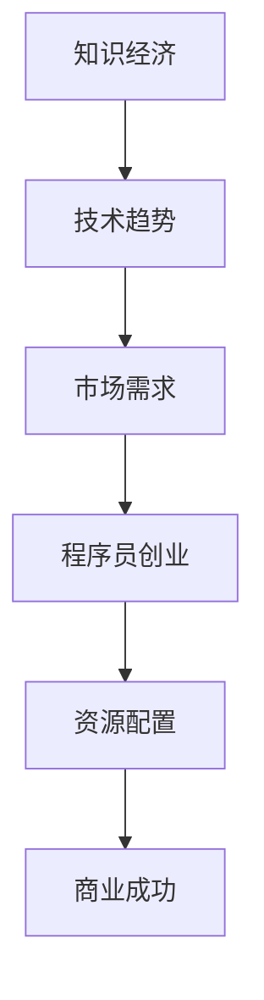

                 

# 知识经济下程序员的创业策略

## 1. 背景介绍

### 1.1 问题由来
在知识经济蓬勃发展的当下，技术创新的速度日益加快，各行各业对专业人才的需求不断增长。特别是近年来，人工智能、大数据、云计算等领域的迅猛发展，为程序员创业提供了广阔的空间和机遇。然而，创业之路并非坦途，如何在知识经济时代抓住机遇，把握发展方向，成为每个有志于创业的程序员都必须面对的重大挑战。

### 1.2 问题核心关键点
创业成功的关键在于对技术趋势的敏锐把握、对市场需求的高效响应以及资源配置的合理优化。在知识经济下，创业者应从技术、市场、人才、资金等多个角度出发，制定科学合理的创业策略。

## 2. 核心概念与联系

### 2.1 核心概念概述

为更好地理解知识经济下程序员的创业策略，本节将介绍几个密切相关的核心概念：

- **知识经济**：以知识资源为主要生产要素，通过技术创新驱动经济发展的经济形态。在这一背景下，创业项目往往与新技术、新模式紧密相关。
- **程序员创业**：指具备编程技能和软件开发经验的个人或团队，依托计算机技术和互联网平台，通过技术创新和商业模式创新，实现商业价值和社会价值的双重增长。
- **技术趋势**：指技术领域的发展动向和未来方向。对技术趋势的准确判断是选择创业方向的重要依据。
- **市场需求**：指目标客户或用户对产品或服务的需求状况。对市场需求的高效响应是创业项目成功的关键。
- **资源配置**：指对人力、物力、财力等创业资源进行科学合理分配和利用，以实现资源效益最大化。

这些核心概念之间的逻辑关系可以通过以下Mermaid流程图来展示：



这个流程图展示了知识经济下程序员创业的主要逻辑链条：首先，知识经济时代的技术趋势引领了技术创新方向；接着，创业者根据市场需求选择创业方向；然后，通过合理的资源配置，形成商业模式和产品原型；最后，通过商业运作实现商业成功。

## 3. 核心算法原理 & 具体操作步骤

### 3.1 算法原理概述

在知识经济下，程序员创业的本质是利用自身技术优势，结合市场需求，创新商业模式，构建可行的商业模型。核心算法原理主要包括以下几个方面：

- **技术趋势识别**：通过分析技术领域的研究报告、专利、论文等资料，识别出当前和未来的技术趋势。
- **市场需求分析**：通过调查问卷、用户访谈、数据分析等方式，获取市场需求信息，评估市场潜力和竞争态势。
- **商业模式设计**：根据技术趋势和市场需求，设计出切实可行的商业模式，明确产品或服务的价值主张、客户群体、盈利模式等关键要素。
- **资源配置优化**：通过成本效益分析、风险评估等方法，优化资源配置，实现资源的高效利用。

### 3.2 算法步骤详解

以下是基于知识经济下程序员创业的详细步骤：

**Step 1: 识别技术趋势**

- 收集并分析技术领域的各类资料，如研究报告、专利、学术论文等。
- 参加技术会议、行业峰会，关注前沿技术动态。
- 加入专业社群、技术论坛，与行业专家交流讨论。
- 持续关注主要科技公司的技术动向和产品发布。

**Step 2: 分析市场需求**

- 通过在线调查、电话访谈、焦点小组等方式，收集潜在用户的反馈和需求。
- 利用数据分析工具，如Google Analytics、Tableau等，分析用户行为数据，挖掘潜在需求。
- 参考竞争对手的产品和市场表现，评估自身项目的市场潜力和竞争力。
- 使用市场预测模型，如SWOT分析、PEST分析等，评估市场环境的机遇与挑战。

**Step 3: 设计商业模式**

- 确定目标客户和用户群体，分析其需求和痛点。
- 结合技术趋势，设计出独特且有竞争力的产品或服务。
- 明确盈利模式，如广告收入、订阅费、交易抽成等。
- 制定营销策略，包括品牌定位、推广渠道、定价策略等。

**Step 4: 优化资源配置**

- 进行成本效益分析，评估各项资源投入产出比。
- 通过风险评估模型，识别潜在风险和应对策略。
- 采用敏捷开发方法，灵活调整产品开发和市场推广策略。
- 合理配置团队资源，包括技术、市场、运营等各方面人才。

**Step 5: 实施与迭代**

- 启动项目开发和市场推广，逐步验证商业模式和产品原型。
- 根据市场反馈，不断优化产品功能和商业模式。
- 引入投资和合作伙伴，扩大资源投入，加速项目成长。
- 持续监控市场和竞争环境，及时调整战略方向。

### 3.3 算法优缺点

基于知识经济下程序员创业的算法具有以下优点：

- **科学性**：通过对技术趋势和市场需求的多维度分析，制定科学的创业策略，减少决策盲目性。
- **高效性**：合理配置资源，降低成本，提高效率，加速项目推进。
- **灵活性**：敏捷开发方法能够快速响应市场变化，及时调整策略，保持竞争优势。

同时，该算法也存在一些局限性：

- **技术更新快**：技术领域日新月异，需要持续跟踪和学习新技术，以保持竞争优势。
- **市场需求变化快**：市场环境瞬息万变，对市场需求分析需要快速反应，精准把握。
- **资源投入大**：创业初期资源有限，需科学合理分配，避免资源浪费。
- **市场竞争激烈**：知识经济下竞争激烈，需不断创新和优化，以保持领先地位。

尽管存在这些局限性，但就目前而言，基于知识经济下程序员创业的算法仍然是最主流和最有效的创业策略之一。未来相关研究的重点在于如何进一步提高技术趋势识别的准确性，优化市场需求分析方法，提升资源配置的科学性，以及增强策略的灵活性和应对市场变化的能力。

### 3.4 算法应用领域

基于知识经济下程序员创业的算法，在各类创业项目中都有广泛应用，例如：

- **人工智能创业项目**：如自然语言处理、计算机视觉、智能推荐系统等。
- **大数据创业项目**：如数据清洗、数据挖掘、数据可视化等。
- **云计算创业项目**：如云服务、云存储、云安全等。
- **物联网创业项目**：如智能家居、智慧城市、工业物联网等。
- **区块链创业项目**：如数字货币、智能合约、供应链管理等。

除了上述这些经典项目外，知识经济下程序员创业还广泛应用于更多创新场景中，如可穿戴设备、智能农业、教育科技等，为各行各业带来变革性影响。

## 4. 数学模型和公式 & 详细讲解 & 举例说明

### 4.1 数学模型构建

在知识经济下程序员创业策略中，涉及到的数学模型主要集中在技术趋势识别和市场需求分析两个方面。

- **技术趋势模型**：通过分析技术领域的各类资料，构建技术发展路径图，评估各项技术趋势的成熟度和市场潜力。
- **市场需求模型**：通过用户反馈和行为数据，构建用户需求模型，评估不同产品或服务的市场需求。

### 4.2 公式推导过程

以下以技术趋势模型为例，推导其基本公式。

**技术趋势模型**：

假设技术领域有 $n$ 个研究方向，每个方向的发展速度为 $v_i$，市场需求为 $d_i$，市场潜力为 $p_i$。则技术趋势 $T$ 可以表示为：

$$
T = \sum_{i=1}^n v_i \times d_i \times p_i
$$

其中，$v_i$ 表示第 $i$ 个研究方向的发展速度，$d_i$ 表示该方向的市场需求，$p_i$ 表示该方向的市场潜力。

**市场需求模型**：

假设用户群体有 $m$ 个，每个用户的需求满意度为 $s_j$，转化率为 $r_j$。则市场需求 $D$ 可以表示为：

$$
D = \sum_{j=1}^m s_j \times r_j
$$

其中，$s_j$ 表示第 $j$ 个用户群体的需求满意度，$r_j$ 表示该群体的转化率。

### 4.3 案例分析与讲解

以智能推荐系统为例，分析其技术趋势和市场需求模型。

**技术趋势模型**：

- **发展速度**：推荐算法的发展速度较快，包括基于协同过滤、深度学习、强化学习等算法。
- **市场需求**：推荐系统的应用场景广泛，如电商、社交媒体、视频平台等。
- **市场潜力**：推荐系统能够显著提升用户体验和转化率，市场潜力巨大。

因此，智能推荐系统的技术趋势 $T$ 可以表示为：

$$
T = v_1 \times d_1 \times p_1 + v_2 \times d_2 \times p_2 + \cdots + v_n \times d_n \times p_n
$$

**市场需求模型**：

- **需求满意度**：不同用户对推荐系统的满意度差异较大。
- **转化率**：推荐系统能够显著提升用户的购买和点击转化率。

因此，推荐系统的市场需求 $D$ 可以表示为：

$$
D = \sum_{j=1}^m s_j \times r_j
$$

通过上述模型的构建和推导，可以更科学地评估智能推荐系统的技术趋势和市场需求，从而指导创业决策。

## 5. 项目实践：代码实例和详细解释说明

### 5.1 开发环境搭建

在进行创业项目开发前，我们需要准备好开发环境。以下是使用Python进行PyTorch开发的环境配置流程：

1. 安装Anaconda：从官网下载并安装Anaconda，用于创建独立的Python环境。

2. 创建并激活虚拟环境：
```bash
conda create -n pytorch-env python=3.8 
conda activate pytorch-env
```

3. 安装PyTorch：根据CUDA版本，从官网获取对应的安装命令。例如：
```bash
conda install pytorch torchvision torchaudio cudatoolkit=11.1 -c pytorch -c conda-forge
```

4. 安装各类工具包：
```bash
pip install numpy pandas scikit-learn matplotlib tqdm jupyter notebook ipython
```

完成上述步骤后，即可在`pytorch-env`环境中开始项目开发。

### 5.2 源代码详细实现

下面以智能推荐系统为例，给出使用Transformers库对BERT模型进行微调的PyTorch代码实现。

首先，定义推荐系统的数据处理函数：

```python
from transformers import BertTokenizer
from torch.utils.data import Dataset
import torch

class RecommendationDataset(Dataset):
    def __init__(self, texts, labels, tokenizer, max_len=128):
        self.texts = texts
        self.labels = labels
        self.tokenizer = tokenizer
        self.max_len = max_len
        
    def __len__(self):
        return len(self.texts)
    
    def __getitem__(self, item):
        text = self.texts[item]
        label = self.labels[item]
        
        encoding = self.tokenizer(text, return_tensors='pt', max_length=self.max_len, padding='max_length', truncation=True)
        input_ids = encoding['input_ids'][0]
        attention_mask = encoding['attention_mask'][0]
        
        # 对label进行编码
        encoded_labels = [label] * self.max_len
        labels = torch.tensor(encoded_labels, dtype=torch.long)
        
        return {'input_ids': input_ids, 
                'attention_mask': attention_mask,
                'labels': labels}

# 标签与id的映射
label2id = {'positive': 1, 'negative': 0}
id2label = {v: k for k, v in label2id.items()}

# 创建dataset
tokenizer = BertTokenizer.from_pretrained('bert-base-cased')

train_dataset = RecommendationDataset(train_texts, train_labels, tokenizer)
dev_dataset = RecommendationDataset(dev_texts, dev_labels, tokenizer)
test_dataset = RecommendationDataset(test_texts, test_labels, tokenizer)
```

然后，定义模型和优化器：

```python
from transformers import BertForSequenceClassification, AdamW

model = BertForSequenceClassification.from_pretrained('bert-base-cased', num_labels=2)

optimizer = AdamW(model.parameters(), lr=2e-5)
```

接着，定义训练和评估函数：

```python
from torch.utils.data import DataLoader
from tqdm import tqdm
from sklearn.metrics import accuracy_score

device = torch.device('cuda') if torch.cuda.is_available() else torch.device('cpu')
model.to(device)

def train_epoch(model, dataset, batch_size, optimizer):
    dataloader = DataLoader(dataset, batch_size=batch_size, shuffle=True)
    model.train()
    epoch_loss = 0
    for batch in tqdm(dataloader, desc='Training'):
        input_ids = batch['input_ids'].to(device)
        attention_mask = batch['attention_mask'].to(device)
        labels = batch['labels'].to(device)
        model.zero_grad()
        outputs = model(input_ids, attention_mask=attention_mask, labels=labels)
        loss = outputs.loss
        epoch_loss += loss.item()
        loss.backward()
        optimizer.step()
    return epoch_loss / len(dataloader)

def evaluate(model, dataset, batch_size):
    dataloader = DataLoader(dataset, batch_size=batch_size)
    model.eval()
    preds, labels = [], []
    with torch.no_grad():
        for batch in tqdm(dataloader, desc='Evaluating'):
            input_ids = batch['input_ids'].to(device)
            attention_mask = batch['attention_mask'].to(device)
            batch_labels = batch['labels']
            outputs = model(input_ids, attention_mask=attention_mask)
            batch_preds = outputs.logits.argmax(dim=2).to('cpu').tolist()
            batch_labels = batch_labels.to('cpu').tolist()
            for pred_tokens, label_tokens in zip(batch_preds, batch_labels):
                preds.append(pred_tokens[:len(label_tokens)])
                labels.append(label_tokens)
                
    print(f'Accuracy: {accuracy_score(labels, preds)}')
```

最后，启动训练流程并在测试集上评估：

```python
epochs = 5
batch_size = 16

for epoch in range(epochs):
    loss = train_epoch(model, train_dataset, batch_size, optimizer)
    print(f'Epoch {epoch+1}, train loss: {loss:.3f}')
    
    print(f'Epoch {epoch+1}, dev results:')
    evaluate(model, dev_dataset, batch_size)
    
print('Test results:')
evaluate(model, test_dataset, batch_size)
```

以上就是使用PyTorch对BERT进行智能推荐系统微调的完整代码实现。可以看到，得益于Transformers库的强大封装，我们可以用相对简洁的代码完成BERT模型的加载和微调。

### 5.3 代码解读与分析

让我们再详细解读一下关键代码的实现细节：

**RecommendationDataset类**：
- `__init__`方法：初始化文本、标签、分词器等关键组件。
- `__len__`方法：返回数据集的样本数量。
- `__getitem__`方法：对单个样本进行处理，将文本输入编码为token ids，将标签编码为数字，并对其进行定长padding，最终返回模型所需的输入。

**label2id和id2label字典**：
- 定义了标签与数字id之间的映射关系，用于将预测结果解码为实际的标签。

**训练和评估函数**：
- 使用PyTorch的DataLoader对数据集进行批次化加载，供模型训练和推理使用。
- 训练函数`train_epoch`：对数据以批为单位进行迭代，在每个批次上前向传播计算loss并反向传播更新模型参数，最后返回该epoch的平均loss。
- 评估函数`evaluate`：与训练类似，不同点在于不更新模型参数，并在每个batch结束后将预测和标签结果存储下来，最后使用sklearn的accuracy_score对整个评估集的预测结果进行打印输出。

**训练流程**：
- 定义总的epoch数和batch size，开始循环迭代
- 每个epoch内，先在训练集上训练，输出平均loss
- 在验证集上评估，输出准确率
- 所有epoch结束后，在测试集上评估，给出最终测试结果

可以看到，PyTorch配合Transformers库使得BERT微调的代码实现变得简洁高效。开发者可以将更多精力放在数据处理、模型改进等高层逻辑上，而不必过多关注底层的实现细节。

当然，工业级的系统实现还需考虑更多因素，如模型的保存和部署、超参数的自动搜索、更灵活的任务适配层等。但核心的微调范式基本与此类似。

## 6. 实际应用场景

### 6.1 智能客服系统

基于大语言模型微调的对话技术，可以广泛应用于智能客服系统的构建。传统客服往往需要配备大量人力，高峰期响应缓慢，且一致性和专业性难以保证。而使用微调后的对话模型，可以7x24小时不间断服务，快速响应客户咨询，用自然流畅的语言解答各类常见问题。

在技术实现上，可以收集企业内部的历史客服对话记录，将问题和最佳答复构建成监督数据，在此基础上对预训练对话模型进行微调。微调后的对话模型能够自动理解用户意图，匹配最合适的答案模板进行回复。对于客户提出的新问题，还可以接入检索系统实时搜索相关内容，动态组织生成回答。如此构建的智能客服系统，能大幅提升客户咨询体验和问题解决效率。

### 6.2 金融舆情监测

金融机构需要实时监测市场舆论动向，以便及时应对负面信息传播，规避金融风险。传统的人工监测方式成本高、效率低，难以应对网络时代海量信息爆发的挑战。基于大语言模型微调的文本分类和情感分析技术，为金融舆情监测提供了新的解决方案。

具体而言，可以收集金融领域相关的新闻、报道、评论等文本数据，并对其进行主题标注和情感标注。在此基础上对预训练语言模型进行微调，使其能够自动判断文本属于何种主题，情感倾向是正面、中性还是负面。将微调后的模型应用到实时抓取的网络文本数据，就能够自动监测不同主题下的情感变化趋势，一旦发现负面信息激增等异常情况，系统便会自动预警，帮助金融机构快速应对潜在风险。

### 6.3 个性化推荐系统

当前的推荐系统往往只依赖用户的历史行为数据进行物品推荐，无法深入理解用户的真实兴趣偏好。基于大语言模型微调技术，个性化推荐系统可以更好地挖掘用户行为背后的语义信息，从而提供更精准、多样的推荐内容。

在实践中，可以收集用户浏览、点击、评论、分享等行为数据，提取和用户交互的物品标题、描述、标签等文本内容。将文本内容作为模型输入，用户的后续行为（如是否点击、购买等）作为监督信号，在此基础上微调预训练语言模型。微调后的模型能够从文本内容中准确把握用户的兴趣点。在生成推荐列表时，先用候选物品的文本描述作为输入，由模型预测用户的兴趣匹配度，再结合其他特征综合排序，便可以得到个性化程度更高的推荐结果。

### 6.4 未来应用展望

随着大语言模型微调技术的发展，其在更多领域的应用前景广阔。

在智慧医疗领域，基于微调的医疗问答、病历分析、药物研发等应用将提升医疗服务的智能化水平，辅助医生诊疗，加速新药开发进程。

在智能教育领域，微调技术可应用于作业批改、学情分析、知识推荐等方面，因材施教，促进教育公平，提高教学质量。

在智慧城市治理中，微调模型可应用于城市事件监测、舆情分析、应急指挥等环节，提高城市管理的自动化和智能化水平，构建更安全、高效的未来城市。

此外，在企业生产、社会治理、文娱传媒等众多领域，基于大模型微调的人工智能应用也将不断涌现，为NLP技术带来全新的突破。相信随着预训练语言模型和微调方法的持续演进，知识经济下的程序员创业将迎来更广阔的发展空间。

## 7. 工具和资源推荐

### 7.1 学习资源推荐

为了帮助开发者系统掌握大语言模型微调的理论基础和实践技巧，这里推荐一些优质的学习资源：

1. 《Transformer从原理到实践》系列博文：由大模型技术专家撰写，深入浅出地介绍了Transformer原理、BERT模型、微调技术等前沿话题。

2. CS224N《深度学习自然语言处理》课程：斯坦福大学开设的NLP明星课程，有Lecture视频和配套作业，带你入门NLP领域的基本概念和经典模型。

3. 《Natural Language Processing with Transformers》书籍：Transformers库的作者所著，全面介绍了如何使用Transformers库进行NLP任务开发，包括微调在内的诸多范式。

4. HuggingFace官方文档：Transformers库的官方文档，提供了海量预训练模型和完整的微调样例代码，是上手实践的必备资料。

5. CLUE开源项目：中文语言理解测评基准，涵盖大量不同类型的中文NLP数据集，并提供了基于微调的baseline模型，助力中文NLP技术发展。

通过对这些资源的学习实践，相信你一定能够快速掌握大语言模型微调的精髓，并用于解决实际的NLP问题。
###  7.2 开发工具推荐

高效的开发离不开优秀的工具支持。以下是几款用于大语言模型微调开发的常用工具：

1. PyTorch：基于Python的开源深度学习框架，灵活动态的计算图，适合快速迭代研究。大部分预训练语言模型都有PyTorch版本的实现。

2. TensorFlow：由Google主导开发的开源深度学习框架，生产部署方便，适合大规模工程应用。同样有丰富的预训练语言模型资源。

3. Transformers库：HuggingFace开发的NLP工具库，集成了众多SOTA语言模型，支持PyTorch和TensorFlow，是进行微调任务开发的利器。

4. Weights & Biases：模型训练的实验跟踪工具，可以记录和可视化模型训练过程中的各项指标，方便对比和调优。与主流深度学习框架无缝集成。

5. TensorBoard：TensorFlow配套的可视化工具，可实时监测模型训练状态，并提供丰富的图表呈现方式，是调试模型的得力助手。

6. Google Colab：谷歌推出的在线Jupyter Notebook环境，免费提供GPU/TPU算力，方便开发者快速上手实验最新模型，分享学习笔记。

合理利用这些工具，可以显著提升大语言模型微调任务的开发效率，加快创新迭代的步伐。

### 7.3 相关论文推荐

大语言模型和微调技术的发展源于学界的持续研究。以下是几篇奠基性的相关论文，推荐阅读：

1. Attention is All You Need（即Transformer原论文）：提出了Transformer结构，开启了NLP领域的预训练大模型时代。

2. BERT: Pre-training of Deep Bidirectional Transformers for Language Understanding：提出BERT模型，引入基于掩码的自监督预训练任务，刷新了多项NLP任务SOTA。

3. Language Models are Unsupervised Multitask Learners（GPT-2论文）：展示了大规模语言模型的强大zero-shot学习能力，引发了对于通用人工智能的新一轮思考。

4. Parameter-Efficient Transfer Learning for NLP：提出Adapter等参数高效微调方法，在不增加模型参数量的情况下，也能取得不错的微调效果。

5. Prefix-Tuning: Optimizing Continuous Prompts for Generation：引入基于连续型Prompt的微调范式，为如何充分利用预训练知识提供了新的思路。

6. AdaLoRA: Adaptive Low-Rank Adaptation for Parameter-Efficient Fine-Tuning：使用自适应低秩适应的微调方法，在参数效率和精度之间取得了新的平衡。

这些论文代表了大语言模型微调技术的发展脉络。通过学习这些前沿成果，可以帮助研究者把握学科前进方向，激发更多的创新灵感。

## 8. 总结：未来发展趋势与挑战

### 8.1 总结

本文对知识经济下程序员的创业策略进行了全面系统的介绍。首先阐述了技术创新和经济发展的关联性，明确了技术趋势和市场需求对创业方向选择的重要性。其次，从技术趋势识别、市场需求分析、商业模式设计到资源配置优化，详细讲解了知识经济下程序员创业的核心算法原理和具体操作步骤。通过示例代码和案例分析，展示了创业策略的实际应用场景和操作细节。最后，探讨了知识经济下程序员创业面临的挑战和未来突破方向，为后续研究指明了方向。

通过本文的系统梳理，可以看到，知识经济下程序员创业成功的关键在于科学合理地把握技术趋势和市场需求，设计切实可行的商业模式，优化资源配置，科学高效地实施和迭代。只有从多个维度综合考虑，才能最大限度地发挥技术优势，把握商业机遇，实现创业成功。

### 8.2 未来发展趋势

展望未来，知识经济下程序员的创业策略将呈现以下几个发展趋势：

1. **技术趋势快速变化**：知识经济下技术更新速度快，创业者需持续学习和跟踪前沿技术，保持竞争力。
2. **市场需求多样化**：随着经济形态的多元化，市场需求也更加多样，创业者需具备跨行业理解和跨领域应用的综合能力。
3. **资源配置灵活化**：在技术快速迭代和市场需求多变的背景下，资源配置需要更加灵活，快速调整以适应变化。
4. **商业模式创新化**：创业者需不断创新商业模式，结合区块链、物联网、大数据等新兴技术，打造差异化竞争优势。
5. **平台化、生态化**：创业项目越来越依赖于平台和生态的支撑，形成“平台+内容+应用”的生态系统，提升整体竞争力。
6. **国际化、全球化**：知识经济下市场更加国际化，创业者需具备全球化视野，寻找国际市场机会。

这些趋势凸显了知识经济下程序员创业的复杂性和挑战性，也表明了创业机会的广阔和多样性。创业者需不断提高自身能力，灵活应对变化，才能在知识经济下立于不败之地。

### 8.3 面临的挑战

尽管知识经济下程序员创业充满机遇，但也面临诸多挑战：

1. **技术更新快速**：技术领域日新月异，创业者需持续学习和跟踪前沿技术，保持竞争力。
2. **市场需求变化快**：市场需求瞬息万变，创业者需快速响应市场变化，灵活调整战略。
3. **资源投入大**：创业初期资源有限，需科学合理分配，避免资源浪费。
4. **市场竞争激烈**：知识经济下竞争激烈，需不断创新和优化，以保持领先地位。
5. **技术风险高**：技术复杂度高，需不断验证和迭代，降低技术风险。
6. **商业模式不确定**：商业模式创新需市场验证，需具备试错能力和风险管理能力。

尽管存在这些挑战，但就目前而言，知识经济下程序员创业仍然是最主流和最有效的创业策略之一。未来相关研究的重点在于如何进一步提高技术趋势识别的准确性，优化市场需求分析方法，提升资源配置的科学性，以及增强策略的灵活性和应对市场变化的能力。

### 8.4 研究展望

面对知识经济下程序员创业所面临的挑战，未来的研究需要在以下几个方面寻求新的突破：

1. **加速技术趋势跟踪**：开发更加高效的自动化技术趋势跟踪系统，实时监控和分析技术领域的发展动向。
2. **深化市场需求理解**：构建更智能的市场需求分析模型，自动生成市场报告，辅助决策。
3. **优化资源配置方法**：研究资源配置优化算法，提升资源利用效率，降低成本。
4. **增强商业模式设计**：结合区块链、物联网等新兴技术，设计更加多样化和差异化的商业模式。
5. **提高市场反应速度**：利用人工智能和大数据分析，快速响应市场变化，调整策略。
6. **降低技术风险**：开发更加稳健的模型和算法，提高技术成功率和稳定性。

这些研究方向的探索，必将引领知识经济下程序员创业的不断进步，为构建高效、灵活、可持续的商业生态系统铺平道路。面向未来，程序员创业需不断创新、勇于探索，方能在知识经济的浪潮中乘风破浪，实现商业梦想。

## 9. 附录：常见问题与解答

**Q1：知识经济下技术创新的重要性体现在哪些方面？**

A: 知识经济下技术创新的重要性体现在以下几个方面：

1. **推动经济增长**：技术创新是知识经济的重要驱动力，能够显著提升生产效率，促进经济增长。
2. **提高竞争力**：技术创新是企业竞争力的重要来源，能够使企业保持领先地位，获得更高的市场份额。
3. **创造新市场**：技术创新能够创造新的市场和商业模式，带来新的增长点。
4. **改善生活质量**：技术创新能够改善生活质量，提高社会福祉，如智能医疗、智能交通、智能城市等。
5. **促进就业**：技术创新能够创造新的就业机会，推动就业结构升级。

**Q2：如何选择技术趋势和市场需求？**

A: 选择技术趋势和市场需求需综合考虑以下几个方面：

1. **技术成熟度**：选择具有较高成熟度的技术趋势，以降低技术风险。
2. **市场潜力**：选择有较大市场潜力的需求，以提高商业成功概率。
3. **竞争态势**：选择竞争态势较弱的市场，以避免激烈竞争。
4. **用户需求**：选择用户需求强烈的市场，以确保项目落地。
5. **资源适配性**：选择与自身资源适配性较高的技术趋势和需求，以降低开发成本。

**Q3：如何优化资源配置？**

A: 优化资源配置需综合考虑以下几个方面：

1. **成本效益分析**：对各项资源投入进行成本效益分析，确保资源投入产出比最大化。
2. **风险评估**：对潜在风险进行评估，制定风险管理策略，避免资源浪费。
3. **敏捷开发**：采用敏捷开发方法，灵活调整资源配置，快速响应市场变化。
4. **人才管理**：合理配置团队人才，确保团队高效协作。
5. **技术评估**：定期评估技术趋势和市场需求，及时调整资源配置策略。

**Q4：如何降低技术风险？**

A: 降低技术风险需综合考虑以下几个方面：

1. **技术验证**：在项目开发早期进行技术验证，确保技术可行。
2. **原型开发**：开发最小可行产品(MVP)，快速迭代验证市场需求。
3. **风险管理**：制定风险管理计划，评估和应对潜在风险。
4. **技术支持**：建立技术支持体系，提供技术保障。
5. **持续改进**：持续优化技术方案，降低技术风险。

**Q5：如何提高商业模式设计的灵活性？**

A: 提高商业模式设计的灵活性需综合考虑以下几个方面：

1. **多业务融合**：结合不同业务领域，设计更加多样化和差异化的商业模式。
2. **平台化生态**：构建平台化生态系统，提供多种服务，增加用户黏性。
3. **用户参与**：引入用户参与设计，提高商业模式的市场响应速度。
4. **技术创新**：结合新兴技术，创新商业模式，提升竞争优势。
5. **数据驱动**：利用大数据分析，动态调整商业模式策略。

这些问题的解答，希望能为你提供一些思路和方法，帮助你在知识经济下更好地把握创业机会，实现商业梦想。

---

作者：禅与计算机程序设计艺术 / Zen and the Art of Computer Programming

