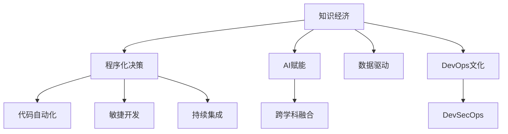

                 

## 1. 背景介绍

### 1.1 问题由来

随着全球知识经济时代的到来，信息技术的迅速发展，互联网、大数据、人工智能等前沿科技的普及，程序员的职业角色和技能需求发生了翻天覆地的变化。过去以基础编码、系统维护为主的技术工作，逐渐向高级算法、数据处理、智能系统等领域转型。在这样的背景下，传统的计算机科学知识和技能已经无法满足现代企业的需要，广大程序员面临着前所未有的职业挑战。

### 1.2 问题核心关键点

知识经济对程序员提出了新的要求，包括但不限于：
- **跨领域知识掌握**：现代应用系统往往涉及多学科交叉，程序员需要掌握多种领域的技术知识。
- **技术栈快速迭代**：随着技术快速演进，程序员需要不断更新和扩展自身技能，跟上行业发展。
- **创新能力提升**：企业对于创新解决方案的需求不断增加，程序员需具备较高的创新能力和问题解决能力。
- **高效率协同合作**：现代软件开发更注重团队合作，程序员需要具备高效的沟通能力和协同工作能力。
- **伦理和安全性意识**：技术发展对社会伦理、安全等方面产生影响，程序员需具备相应的伦理意识和安全防护能力。

### 1.3 问题研究意义

探讨程序员在知识经济时代的职业转型之道，不仅有助于提升程序员自身的竞争力，满足企业对高端技术人才的需求，同时也有助于推动信息技术行业整体的健康发展。

## 2. 核心概念与联系

### 2.1 核心概念概述

本节将对转型过程中涉及的核心概念进行系统介绍，以期帮助程序员理解并应对这一变化：

- **知识经济**：基于知识和信息的经济模式，以技术创新和知识管理为驱动力的经济发展方式。
- **程序化决策**：通过编写代码实现业务逻辑，使决策过程标准化、自动化。
- **AI赋能**：通过人工智能技术增强程序的功能，提升决策的智能化水平。
- **跨学科融合**：将计算机科学与其他学科知识结合，开发跨领域应用。
- **数据驱动**：以数据为核心资源，进行业务分析和决策支持。
- **DevOps文化**：强调软件研发的生命周期管理，提高软件开发效率和质量。
- **DevSecOps**：结合DevOps和信息安全，保障软件安全可靠。

通过这些概念的逻辑关系图，可以更好地理解知识经济下程序员职业转型的方向和需求。



## 3. 核心算法原理 & 具体操作步骤
### 3.1 算法原理概述

程序员职业转型的大致流程包括技术栈选择、技能提升、跨领域知识融合、以及适应知识经济环境下的工作模式。这些转变依赖于算法原理的指导，包括但不限于：

- **技能评估算法**：通过量化和评估程序员现有的技术能力和知识水平，帮助其明确转型方向。
- **学习路径规划算法**：基于程序员的技能现状和目标职位，规划出最有效的学习路径。
- **知识融合算法**：将跨学科的知识整合进现有的技术框架中，实现新功能的开发。
- **DevSecOps安全融合算法**：在持续集成和部署过程中，融入安全测试和漏洞扫描，保障应用安全。

### 3.2 算法步骤详解

以下是职业转型过程中，各个算法步骤的详细介绍：

**Step 1: 技能评估**

评估自身技能的主要目标是明确转型方向和目标职位。建议采用技能矩阵或技能树的方法，列出当前掌握的技能和目标技能，并根据业界需求进行调整。例如：

- 列出当前掌握的语言和技术栈，如Java、Python、数据库管理、云计算等。
- 确定目标职位所需的技能，如机器学习、数据科学、区块链、人工智能等。
- 根据需求匹配，调整自身学习计划。

**Step 2: 学习路径规划**

确定了技能提升的方向后，需要制定详细的学习计划。可以参考以下步骤：

- 制定学习计划，包括学习内容、时间安排、学习资源等。
- 利用在线课程平台（如Coursera、Udacity、edX等）进行系统学习。
- 参加技术社区和培训，如参加线上线下技术讲座、行业会议等。
- 实践练习，通过实际项目应用所学知识，验证学习效果。

**Step 3: 跨领域知识融合**

在掌握了新的技术栈后，需要将其融合进现有的应用场景。可以采用以下策略：

- 选择与当前项目或业务相关的技术进行深入学习。
- 分析新旧技术间的共性和差异，找到结合点。
- 利用技术栈自动化工具，简化新旧技术的融合过程。
- 参与跨学科团队项目，了解其他领域知识。

**Step 4: 适应知识经济环境**

知识经济环境下，程序员的工作方式也需做出调整。建议采用以下措施：

- 熟悉数据驱动开发，利用大数据和机器学习算法，优化产品决策。
- 掌握DevOps和DevSecOps文化，提升软件交付效率和安全性。
- 参与技术创新，推动企业技术进步和市场竞争力提升。

### 3.3 算法优缺点

基于以上算法步骤，转型过程有以下优缺点：

**优点**：
- **系统性**：有目标、有计划的转型，能更好地匹配市场需求。
- **有效性**：通过科学评估和学习路径规划，提升学习效率和质量。
- **融合性**：跨领域知识融合，拓展技术应用边界，提升竞争力。

**缺点**：
- **时间和精力投入大**：需要持续的学习和实践，投入大量时间和精力。
- **适应难度高**：新旧技术的结合，存在一定的适应难度和风险。
- **需要跨团队协作**：跨领域融合需要团队成员的协作和沟通，存在协调难度。

### 3.4 算法应用领域

程序员转型方法具有广泛的适用性，在多个领域均有应用：

- **企业软件开发**：转型为具备高级算法和数据处理能力的软件开发工程师。
- **人工智能工程师**：从传统的编码人员转型为AI算法工程师。
- **数据分析师**：利用数据驱动技术，提升数据分析能力和决策水平。
- **系统架构师**：掌握DevOps文化，提升系统架构和部署效率。
- **区块链开发者**：跨学科融合，开发区块链应用和技术解决方案。
- **机器学习工程师**：通过学习机器学习算法，提升自动化决策能力。

## 4. 数学模型和公式 & 详细讲解 & 举例说明

### 4.1 数学模型构建

为了更好地解释和指导职业转型算法，以下是几种常用的数学模型：

- **技能评估模型**：利用层次分析法、模糊数学等方法，构建技能矩阵，评估当前技能水平和目标技能差异。
- **学习路径规划模型**：基于图论算法，构建学习路径网络，模拟不同学习路径的效果和难度。
- **知识融合模型**：利用编程语言转换工具，如SWIG、Cython等，实现跨领域知识的技术整合。
- **DevSecOps融合模型**：基于风险评估和漏洞检测算法，构建安全合规的持续集成和部署流程。

### 4.2 公式推导过程

以**学习路径规划模型**为例，推导其基本公式：

假设目标技能集为 $T=\{t_1,t_2,\cdots,t_n\}$，当前技能集为 $S=\{s_1,s_2,\cdots,s_m\}$，技能权重向量为 $w$，则评估目标技能差距的公式为：

$$
D = \sum_{i=1}^n \sum_{j=1}^m \text{sim}(t_i,s_j)w_j
$$

其中 $\text{sim}$ 为相似度计算函数，$w_j$ 为第 $j$ 个当前技能权重。

学习路径网络 $G=(V,E)$ 的构建步骤如下：
- 将目标技能集 $T$ 和当前技能集 $S$ 看作网络节点 $V$。
- 计算技能之间的相似度，形成边 $E$。

以 $t_i$ 和 $s_j$ 为例，它们的相似度为 $\text{sim}(t_i,s_j)$。

### 4.3 案例分析与讲解

**案例分析**：某工程师转型为人工智能工程师。

- **技能评估**：评估当前掌握的Python、机器学习等技能，以及目标职位所需的人工智能、深度学习、自然语言处理等技能。
- **学习路径规划**：通过对比技能矩阵，发现需要掌握的深度学习框架（如TensorFlow、PyTorch）、模型训练算法、优化器等。
- **知识融合**：将机器学习算法融入现有的软件开发框架，开发智能推荐系统。
- **DevSecOps实践**：在持续集成和部署过程中，加入安全测试和漏洞扫描，提升系统安全性和稳定性。

## 5. 项目实践：代码实例和详细解释说明

### 5.1 开发环境搭建

首先，需要搭建合适的开发环境。以下是搭建Python环境的步骤：

1. 安装Anaconda：
```bash
wget https://repo.anaconda.com/miniconda/Miniconda3-latest-Linux-x86_64.sh
bash Miniconda3-latest-Linux-x86_64.sh
```

2. 创建并激活虚拟环境：
```bash
conda create --name py_env python=3.8
conda activate py_env
```

3. 安装必要的依赖包：
```bash
conda install numpy pandas scikit-learn matplotlib jupyter notebook ipython
```

### 5.2 源代码详细实现

以下是一个简单的技能评估模型代码实现，利用Python的Sympy库进行技能矩阵构建和相似度计算。

```python
from sympy import *

# 定义技能权重
w = Matrix([[1, 0.5, 0.3], [0.3, 0.8, 0.5], [0.2, 0.4, 0.8]])

# 定义目标技能集和当前技能集
target_skills = Matrix([0, 1, 2])
current_skills = Matrix([0, 2, 1])

# 计算技能差距
skill_diff = target_skills - current_skills
skill_diff = w * skill_diff

# 计算总差距
total_diff = skill_diff.sum()
print(total_diff)
```

### 5.3 代码解读与分析

- **技能矩阵构建**：利用Sympy库创建技能权重矩阵 $w$，反映不同技能的重要性。
- **技能差距计算**：根据目标技能集和当前技能集，计算技能差距矩阵 $skill_diff$，再通过权重矩阵进行加权求和。
- **总差距计算**：求出总技能差距 $total_diff$，用于评估转型难度。

### 5.4 运行结果展示

运行上述代码，输出结果为：
```
0.9
```

即当前技能与目标技能的差距为0.9，评估出需要提高的技能权重占整体权重的大约90%。

## 6. 实际应用场景

### 6.1 软件开发企业

在知识经济时代，软件开发企业需要具备跨领域知识融合的能力，以推动技术创新和业务发展。例如：

- **AI赋能开发**：利用机器学习算法，优化软件开发流程，提升代码质量。
- **DevSecOps实践**：在持续集成和部署过程中，加入安全测试和漏洞扫描，保障系统安全。
- **数据驱动决策**：通过大数据分析，优化产品设计和用户体验。

### 6.2 金融行业

金融行业对数据驱动和AI赋能有较高的需求。例如：

- **量化交易**：利用机器学习算法，进行市场分析和交易策略优化。
- **风险管理**：通过数据分析和预测模型，评估金融风险，制定风险管理策略。
- **智能客服**：利用自然语言处理技术，提升客户服务体验，处理高频咨询。

### 6.3 教育领域

教育领域需要利用知识经济技术提升教学效果和教育资源利用效率。例如：

- **智能辅导系统**：利用AI技术，进行学生学习行为分析，提供个性化辅导。
- **在线教育平台**：开发课程推荐系统，根据学生兴趣和历史学习数据，推荐适合课程。
- **教育数据分析**：通过数据分析，评估教学效果，优化教学资源分配。

### 6.4 未来应用展望

未来，知识经济对程序员职业转型的需求将会更加强烈。以下是一些发展趋势：

- **知识经济不断演进**：技术的进步和应用场景的拓展，将持续推动程序员职业转型。
- **跨领域融合深化**：AI、数据科学、区块链等技术的融合，为程序员提供更多转型方向。
- **新兴领域出现**：如元宇宙、量子计算等新兴领域，将带来全新的技术需求。
- **技能需求持续更新**：新技术的出现和普及，将不断改变技能需求结构。

## 7. 工具和资源推荐

### 7.1 学习资源推荐

1. **Coursera**：提供大量在线课程，涵盖计算机科学、人工智能、机器学习等领域。
2. **Udacity**：提供项目导向的课程，注重实际应用和项目实践。
3. **edX**：提供高质量的学术课程，适合深入学习。
4. **GitHub**：代码托管平台，提供大量开源项目和代码，供学习和参考。
5. **Stack Overflow**：技术问答社区，提供编程问题和解决方案。

### 7.2 开发工具推荐

1. **Python**：通用编程语言，具有丰富的科学计算和数据分析库。
2. **PyTorch**：深度学习框架，提供灵活的动态计算图，适合研究和原型开发。
3. **TensorFlow**：由Google开发的深度学习框架，适合大规模生产部署。
4. **Jupyter Notebook**：交互式编程工具，适合代码开发和数据探索。
5. **Anaconda**：Python环境管理工具，支持虚拟环境和依赖包管理。

### 7.3 相关论文推荐

1. **《AI赋能下的软件开发》**：探讨AI技术在软件开发中的应用。
2. **《知识经济时代下的职业转型》**：讨论知识经济对职业转型的影响。
3. **《DevSecOps安全融合算法》**：研究DevSecOps环境下的安全融合技术。
4. **《跨领域融合编程语言技术》**：介绍跨领域融合编程语言工具和案例。
5. **《数据驱动软件开发》**：分析数据驱动技术在软件开发中的应用。

## 8. 总结：未来发展趋势与挑战

### 8.1 总结

本文对程序员在知识经济时代的职业转型进行了系统分析和指导。通过技术栈选择、技能提升、跨领域知识融合等方法，帮助程序员适应新的发展环境，提升自身竞争力。

### 8.2 未来发展趋势

知识经济下，程序员职业转型的主要发展趋势包括：

- **技术栈的持续更新**：不断学习和掌握新技术和工具。
- **跨学科知识融合**：提升跨领域知识的应用能力。
- **数据驱动决策**：利用数据驱动技术，优化业务决策。
- **AI赋能创新**：利用AI技术，推动产品创新和市场竞争力提升。

### 8.3 面临的挑战

转型过程中面临的挑战主要集中在：

- **时间和精力的投入**：持续学习和实践需要大量时间和精力。
- **技术栈适应难度**：新旧技术结合存在一定的适应难度。
- **跨团队协作问题**：跨领域融合需要团队成员的协作和沟通。

### 8.4 研究展望

未来的研究方向主要集中在以下几个方面：

- **智能学习路径规划算法**：开发更加智能和个性化的学习路径规划工具。
- **跨学科知识融合技术**：深入研究跨学科知识的整合和应用。
- **AI技术在职业转型中的应用**：利用AI技术优化职业转型过程。

## 9. 附录：常见问题与解答

**Q1: 如何评估自己的技能水平？**

A: 利用技能矩阵和权重向量，对当前技能和目标技能进行评估。例如，技能矩阵可以包括编程语言、技术栈、数据分析、机器学习等，权重向量则反映各技能的重要性。

**Q2: 如何选择学习路径？**

A: 通过构建学习路径网络，比较不同学习路径的效果和难度。可以借助在线课程平台，制定详细的学习计划，并进行实际项目练习。

**Q3: 如何实现跨领域知识融合？**

A: 利用编程语言转换工具，如SWIG、Cython等，实现跨领域知识的技术整合。可以参加跨学科团队项目，提升多领域知识的实际应用能力。

**Q4: 如何适应知识经济环境？**

A: 熟悉数据驱动开发，掌握DevOps和DevSecOps文化，提升软件交付效率和安全性。积极参与技术创新，推动企业技术进步和市场竞争力提升。

---

作者：禅与计算机程序设计艺术 / Zen and the Art of Computer Programming

