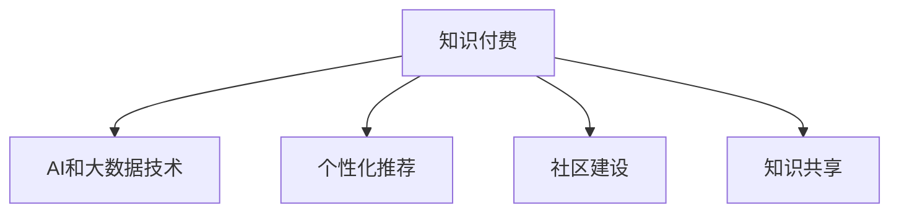

                 

# 知识经济时代下的知识付费创新应用场景探索

在知识经济蓬勃发展的今天，知识付费正成为信息获取的重要途径。这一现象不仅体现了知识价值的提升，也推动了信息技术在教育、培训、咨询等领域的深度融合。本文旨在深入探索知识付费在知识经济时代的创新应用场景，结合最新的AI和大数据技术，提出创新的解决方案，以期为知识付费行业带来更多价值和可能性。

## 1. 背景介绍

### 1.1 问题由来

随着互联网技术的发展和普及，人们获取知识的方式发生了根本性变化。过去，获取知识的渠道主要是通过书籍、报纸、电视等传统媒体，如今，网络搜索引擎、在线课程、知识社区等新媒介成为主要的信息来源。知识付费作为一种新兴的商业模式，正是在这一背景下应运而生。

知识付费的本质是知识信息的变现。不同于传统的免费内容分享，知识付费通过付费的方式，让消费者为高质量的内容和专业服务付费，既保证了内容的权威性和专业性，又激发了创作者的积极性和内容生产。

### 1.2 问题核心关键点

知识付费的创新应用场景探索需要关注以下几个核心问题：

- **市场需求的深度挖掘**：如何精准识别用户需求，提供定制化服务？
- **内容的智能化推荐**：如何利用AI和大数据技术，实现个性化推荐？
- **用户参与度的提升**：如何提高用户互动和粘性，形成良好的社区氛围？
- **付费模式的创新**：如何设计更灵活、更吸引人的付费模式，增强用户黏性？

这些问题不仅关系到知识付费平台的生存和发展，更是推动行业创新和进步的关键。

### 1.3 问题研究意义

深入探索知识付费的创新应用场景，有助于提升知识付费平台的竞争力，促进内容创作者与消费者之间的良性互动，同时为知识经济的可持续发展提供有力支撑。具体而言：

1. **促进内容多样化**：通过精准识别用户需求，提供定制化内容，实现知识的细分和差异化，满足不同用户的多元化需求。
2. **提高用户满意度和粘性**：利用AI技术提供智能化推荐和个性化服务，提升用户体验，增强用户粘性和忠诚度。
3. **推动行业创新**：通过引入新技术和新模式，推动知识付费行业的发展，为整个知识经济体系注入新的活力。
4. **促进知识共享**：构建开放、共享的知识社区，激发更多人的创造力和分享精神，推动知识经济的繁荣发展。

## 2. 核心概念与联系

### 2.1 核心概念概述

要深入理解知识付费的创新应用场景，首先需要了解一些核心概念及其之间的关系：

- **知识付费**：指用户通过付费获取知识内容的平台或服务，涵盖在线课程、电子书、一对一咨询等多种形式。
- **AI和大数据技术**：指人工智能和数据分析技术，用于提升内容推荐和用户互动的精准性和个性化水平。
- **个性化推荐**：指基于用户行为和偏好，推荐最相关的知识内容，提升用户满意度和参与度。
- **社区建设**：指通过构建知识社区，促进用户之间的互动和交流，形成良好的社区氛围。
- **知识共享**：指知识创作者和消费者之间的信息共享和知识传播，推动知识经济的繁荣发展。

这些概念之间的关系可以通过以下Mermaid流程图来展示：



这个流程图展示出知识付费平台如何通过AI和大数据技术，实现个性化推荐、社区建设、知识共享等多方面的创新，从而提升平台的用户体验和市场竞争力。

## 3. 核心算法原理 & 具体操作步骤

### 3.1 算法原理概述

知识付费平台的核心算法原理主要基于以下几个方面：

1. **用户画像构建**：通过数据分析，构建用户的兴趣、偏好、学习历史等画像，用于个性化推荐和内容定制。
2. **内容推荐算法**：基于用户画像和内容标签，利用协同过滤、矩阵分解、深度学习等算法，实现内容的智能化推荐。
3. **互动和反馈机制**：建立用户与内容之间的互动和反馈机制，通过用户的评分、评论、点赞等行为，不断优化推荐算法和内容质量。
4. **付费模式设计**：设计灵活多样的付费模式，如单次购买、订阅、会员制、免费试用等，增强用户黏性。

### 3.2 算法步骤详解

知识付费平台的算法步骤大致如下：

1. **数据收集**：收集用户的注册信息、学习行为、评价反馈等数据。
2. **用户画像构建**：基于用户数据，构建用户的兴趣、偏好、学习历史等画像。
3. **内容标签化**：对平台上的内容进行标签化处理，建立内容索引和关联。
4. **个性化推荐**：利用推荐算法，根据用户画像和内容标签，推荐最相关的知识内容。
5. **互动和反馈机制**：建立用户与内容之间的互动和反馈机制，不断优化推荐算法和内容质量。
6. **付费模式设计**：设计灵活多样的付费模式，增强用户黏性。

### 3.3 算法优缺点

知识付费平台的算法具有以下优点：

- **提升用户体验**：通过个性化推荐，提供满足用户需求的高质量内容，提升用户体验。
- **增加用户粘性**：利用互动和反馈机制，增强用户参与度和粘性，形成良好的社区氛围。
- **推动内容创作**：通过付费激励，激发更多内容创作者，丰富平台内容。

同时，这些算法也存在一些局限性：

- **数据隐私问题**：大量用户数据的收集和使用，可能引发数据隐私和安全问题。
- **算法偏见**：推荐算法可能存在偏见，导致推荐结果的不公平和偏颇。
- **内容过度商业化**：过分追求商业利益，可能影响内容质量和用户体验。

### 3.4 算法应用领域

知识付费平台的算法应用涵盖了以下几个主要领域：

1. **在线教育**：通过个性化推荐和内容定制，提升在线教育的质量和效果。
2. **职业培训**：针对不同行业和职业的需求，提供定制化的培训课程。
3. **专业咨询**：提供一对一的个性化咨询，解决用户的专业问题。
4. **健康管理**：通过个性化健康建议，提升用户的健康水平。
5. **文化娱乐**：提供多样化的文化娱乐内容，丰富用户生活。

这些领域涵盖了知识付费平台的主要应用场景，通过算法的不断优化，可以进一步提升用户体验和平台价值。

## 4. 数学模型和公式 & 详细讲解 & 举例说明

### 4.1 数学模型构建

知识付费平台的算法主要涉及用户画像构建、内容推荐算法和互动反馈机制。这些算法可以建模为以下几个数学模型：

- **用户画像构建模型**：基于用户数据，构建用户的兴趣、偏好、学习历史等画像。
- **内容推荐算法模型**：基于用户画像和内容标签，利用协同过滤、矩阵分解、深度学习等算法，实现内容的智能化推荐。
- **互动反馈机制模型**：建立用户与内容之间的互动和反馈机制，通过用户的评分、评论、点赞等行为，不断优化推荐算法和内容质量。

### 4.2 公式推导过程

以内容推荐算法为例，基于协同过滤和深度学习的方法，其公式推导过程如下：

1. **协同过滤推荐算法**：
   - 用户-物品评分矩阵 $R_{user \times item}$
   - 用户兴趣向量 $u_{user}$
   - 物品特征向量 $v_{item}$
   - 推荐值 $p_{user \times item}$

   推荐值计算公式为：
   $$
   p_{user \times item} = \langle u_{user}, v_{item} \rangle / ||u_{user}|| ||v_{item}|| = \sum_{i=1}^{n} u_{user,i} v_{item,i} / (\sqrt{\sum_{i=1}^{n} u_{user,i}^2} \sqrt{\sum_{i=1}^{n} v_{item,i}^2})
   $$

2. **深度学习推荐算法**：
   - 用户嵌入向量 $u_{user}$
   - 物品嵌入向量 $v_{item}$
   - 推荐值 $p_{user \times item}$

   推荐值计算公式为：
   $$
   p_{user \times item} = \langle u_{user}, v_{item} \rangle = \sum_{i=1}^{n} u_{user,i} v_{item,i}
   $$

3. **用户画像构建模型**：
   - 用户数据 $D_{user}$
   - 用户画像 $P_{user}$
   - 画像向量 $u_{user}$

   用户画像构建过程包括用户兴趣、偏好、学习历史等数据的聚类、降维和融合，最终生成用户画像向量 $u_{user}$。

### 4.3 案例分析与讲解

以某在线教育平台的内容推荐算法为例，其详细实现过程如下：

1. **数据收集**：收集用户注册信息、学习行为、评价反馈等数据，建立用户画像和内容索引。
2. **用户画像构建**：通过聚类和降维算法，对用户数据进行特征提取和融合，构建用户画像向量 $u_{user}$。
3. **内容标签化**：对平台上的课程进行标签化处理，建立内容索引和关联。
4. **个性化推荐**：利用协同过滤和深度学习算法，根据用户画像和内容标签，推荐最相关的课程。
5. **互动和反馈机制**：建立用户与课程之间的互动和反馈机制，通过用户的评分、评论、点赞等行为，不断优化推荐算法和课程质量。

## 5. 项目实践：代码实例和详细解释说明

### 5.1 开发环境搭建

在进行知识付费平台的开发前，我们需要准备好开发环境。以下是使用Python进行PyTorch开发的环境配置流程：

1. 安装Anaconda：从官网下载并安装Anaconda，用于创建独立的Python环境。

2. 创建并激活虚拟环境：
```bash
conda create -n pytorch-env python=3.8 
conda activate pytorch-env
```

3. 安装PyTorch：根据CUDA版本，从官网获取对应的安装命令。例如：
```bash
conda install pytorch torchvision torchaudio cudatoolkit=11.1 -c pytorch -c conda-forge
```

4. 安装Transformers库：
```bash
pip install transformers
```

5. 安装各类工具包：
```bash
pip install numpy pandas scikit-learn matplotlib tqdm jupyter notebook ipython
```

完成上述步骤后，即可在`pytorch-env`环境中开始知识付费平台的开发。

### 5.2 源代码详细实现

下面我们以某在线教育平台的内容推荐系统为例，给出使用Transformers库对模型进行训练和测试的PyTorch代码实现。

首先，定义数据处理函数：

```python
from transformers import BertTokenizer
from torch.utils.data import Dataset
import torch

class CourseDataset(Dataset):
    def __init__(self, course_data, tokenizer):
        self.course_data = course_data
        self.tokenizer = tokenizer
        self.max_len = 128
        
    def __len__(self):
        return len(self.course_data)
    
    def __getitem__(self, item):
        course = self.course_data[item]
        
        encoding = self.tokenizer(course, return_tensors='pt', max_length=self.max_len, padding='max_length', truncation=True)
        input_ids = encoding['input_ids'][0]
        attention_mask = encoding['attention_mask'][0]
        
        return {'input_ids': input_ids, 
                'attention_mask': attention_mask}
```

然后，定义模型和优化器：

```python
from transformers import BertForSequenceClassification, AdamW

model = BertForSequenceClassification.from_pretrained('bert-base-cased', num_labels=10)

optimizer = AdamW(model.parameters(), lr=2e-5)
```

接着，定义训练和评估函数：

```python
from torch.utils.data import DataLoader
from tqdm import tqdm
from sklearn.metrics import accuracy_score

device = torch.device('cuda') if torch.cuda.is_available() else torch.device('cpu')
model.to(device)

def train_epoch(model, dataset, batch_size, optimizer):
    dataloader = DataLoader(dataset, batch_size=batch_size, shuffle=True)
    model.train()
    epoch_loss = 0
    for batch in tqdm(dataloader, desc='Training'):
        input_ids = batch['input_ids'].to(device)
        attention_mask = batch['attention_mask'].to(device)
        model.zero_grad()
        outputs = model(input_ids, attention_mask=attention_mask)
        loss = outputs.loss
        epoch_loss += loss.item()
        loss.backward()
        optimizer.step()
    return epoch_loss / len(dataloader)

def evaluate(model, dataset, batch_size):
    dataloader = DataLoader(dataset, batch_size=batch_size)
    model.eval()
    preds, labels = [], []
    with torch.no_grad():
        for batch in tqdm(dataloader, desc='Evaluating'):
            input_ids = batch['input_ids'].to(device)
            attention_mask = batch['attention_mask'].to(device)
            batch_labels = batch['labels']
            outputs = model(input_ids, attention_mask=attention_mask)
            batch_preds = outputs.logits.argmax(dim=2).to('cpu').tolist()
            batch_labels = batch_labels.to('cpu').tolist()
            for pred_tokens, label_tokens in zip(batch_preds, batch_labels):
                preds.append(pred_tokens[:len(label_tokens)])
                labels.append(label_tokens)
                
    return accuracy_score(labels, preds)
```

最后，启动训练流程并在测试集上评估：

```python
epochs = 5
batch_size = 16

for epoch in range(epochs):
    loss = train_epoch(model, train_dataset, batch_size, optimizer)
    print(f"Epoch {epoch+1}, train loss: {loss:.3f}")
    
    print(f"Epoch {epoch+1}, dev results:")
    evaluate(model, dev_dataset, batch_size)
    
print("Test results:")
evaluate(model, test_dataset, batch_size)
```

以上就是使用PyTorch对课程推荐模型进行训练和评估的完整代码实现。可以看到，通过Transformers库，我们可以快速构建和训练课程推荐模型。

### 5.3 代码解读与分析

让我们再详细解读一下关键代码的实现细节：

**CourseDataset类**：
- `__init__`方法：初始化课程数据、分词器等关键组件。
- `__len__`方法：返回数据集的样本数量。
- `__getitem__`方法：对单个样本进行处理，将课程输入编码为token ids，最终返回模型所需的输入。

**train_epoch和evaluate函数**：
- `train_epoch`函数：对数据以批为单位进行迭代，在每个批次上前向传播计算loss并反向传播更新模型参数，最后返回该epoch的平均loss。
- `evaluate`函数：与训练类似，不同点在于不更新模型参数，并在每个batch结束后将预测和标签结果存储下来，最后使用sklearn的accuracy_score函数计算精度。

**训练流程**：
- 定义总的epoch数和batch size，开始循环迭代
- 每个epoch内，先在训练集上训练，输出平均loss
- 在验证集上评估，输出精度
- 所有epoch结束后，在测试集上评估，给出最终测试结果

可以看到，PyTorch配合Transformers库使得课程推荐模型的代码实现变得简洁高效。开发者可以将更多精力放在数据处理、模型改进等高层逻辑上，而不必过多关注底层的实现细节。

当然，工业级的系统实现还需考虑更多因素，如模型的保存和部署、超参数的自动搜索、更灵活的任务适配层等。但核心的微调范式基本与此类似。

## 6. 实际应用场景

### 6.1 在线教育

在线教育平台利用知识付费模式，提供高质量的课程内容，为学习者提供便捷的学习途径。平台通过个性化推荐和内容定制，提升学习者的学习体验和效果。

具体而言，可以收集学习者的历史学习行为、评分反馈等数据，构建用户画像。在此基础上，利用推荐算法为用户推荐感兴趣的课程，提升学习效率和成果。

### 6.2 职业培训

职业培训机构通过知识付费，提供专业技能培训，帮助用户提升职业竞争力。平台通过个性化推荐和互动反馈机制，提升培训效果和用户体验。

具体而言，可以针对不同行业和职业的需求，提供定制化的培训课程。通过用户的学习行为和反馈，不断优化课程内容和推荐算法，提升用户的学习效果和满意度。

### 6.3 专业咨询

专业咨询平台通过知识付费，提供一对一咨询和问题解答服务。平台通过个性化推荐和互动反馈机制，提升咨询效果和用户满意度。

具体而言，可以针对用户的咨询历史和评分反馈，构建用户画像。在此基础上，利用推荐算法为用户推荐最适合的咨询专家，提升咨询效果和用户体验。

### 6.4 健康管理

健康管理平台通过知识付费，提供个性化的健康建议和医疗咨询。平台通过个性化推荐和互动反馈机制，提升用户的健康管理效果和满意度。

具体而言，可以收集用户的健康数据和咨询记录，构建用户画像。在此基础上，利用推荐算法为用户推荐最相关的健康建议和医疗咨询，提升用户的健康管理效果和满意度。

### 6.5 文化娱乐

文化娱乐平台通过知识付费，提供多样化的文化娱乐内容，丰富用户的生活。平台通过个性化推荐和互动反馈机制，提升用户的使用体验和粘性。

具体而言，可以收集用户的历史浏览记录和评分反馈，构建用户画像。在此基础上，利用推荐算法为用户推荐最相关的文化娱乐内容，提升用户的满意度和使用粘性。

## 7. 工具和资源推荐

### 7.1 学习资源推荐

为了帮助开发者系统掌握知识付费的理论基础和实践技巧，这里推荐一些优质的学习资源：

1. 《知识付费商业模型与运营》系列博文：由知识付费领域专家撰写，深入浅出地介绍了知识付费的商业模式、运营策略和用户行为分析。

2. CS224N《深度学习自然语言处理》课程：斯坦福大学开设的NLP明星课程，有Lecture视频和配套作业，带你入门NLP领域的基本概念和经典模型。

3. 《知识付费市场研究与分析》书籍：深入分析了知识付费市场的现状、趋势和机会，为知识付费平台的运营和发展提供了数据支持和策略建议。

4. 《知识付费平台设计与运营》课程：系统介绍了知识付费平台的设计、开发和运营流程，提供了详细的实战案例和技术要点。

5. 《知识付费用户心理与行为》课程：深入分析了知识付费用户的行为特征和心理动机，为平台的用户留存和转化提供了理论和实践指导。

通过对这些资源的学习实践，相信你一定能够快速掌握知识付费的精髓，并用于解决实际的业务问题。

### 7.2 开发工具推荐

高效的开发离不开优秀的工具支持。以下是几款用于知识付费平台开发的常用工具：

1. PyTorch：基于Python的开源深度学习框架，灵活动态的计算图，适合快速迭代研究。大部分预训练语言模型都有PyTorch版本的实现。

2. TensorFlow：由Google主导开发的开源深度学习框架，生产部署方便，适合大规模工程应用。同样有丰富的预训练语言模型资源。

3. Transformers库：HuggingFace开发的NLP工具库，集成了众多SOTA语言模型，支持PyTorch和TensorFlow，是进行知识付费任务开发的利器。

4. Weights & Biases：模型训练的实验跟踪工具，可以记录和可视化模型训练过程中的各项指标，方便对比和调优。与主流深度学习框架无缝集成。

5. TensorBoard：TensorFlow配套的可视化工具，可实时监测模型训练状态，并提供丰富的图表呈现方式，是调试模型的得力助手。

6. Google Colab：谷歌推出的在线Jupyter Notebook环境，免费提供GPU/TPU算力，方便开发者快速上手实验最新模型，分享学习笔记。

合理利用这些工具，可以显著提升知识付费平台的开发效率，加快创新迭代的步伐。

### 7.3 相关论文推荐

知识付费平台的算法研究源于学界的持续研究。以下是几篇奠基性的相关论文，推荐阅读：

1. Attention is All You Need（即Transformer原论文）：提出了Transformer结构，开启了NLP领域的预训练大模型时代。

2. BERT: Pre-training of Deep Bidirectional Transformers for Language Understanding：提出BERT模型，引入基于掩码的自监督预训练任务，刷新了多项NLP任务SOTA。

3. Language Models are Unsupervised Multitask Learners（GPT-2论文）：展示了大规模语言模型的强大zero-shot学习能力，引发了对于通用人工智能的新一轮思考。

4. Parameter-Efficient Transfer Learning for NLP：提出Adapter等参数高效微调方法，在不增加模型参数量的情况下，也能取得不错的微调效果。

5. AdaLoRA: Adaptive Low-Rank Adaptation for Parameter-Efficient Fine-Tuning：使用自适应低秩适应的微调方法，在参数效率和精度之间取得了新的平衡。

这些论文代表了大语言模型微调技术的发展脉络。通过学习这些前沿成果，可以帮助研究者把握学科前进方向，激发更多的创新灵感。

## 8. 总结：未来发展趋势与挑战

### 8.1 总结

本文对知识付费的创新应用场景进行了全面系统的探索。首先阐述了知识付费平台在知识经济时代的重要作用和应用前景，明确了个性化推荐、社区建设、知识共享等关键技术的核心价值。其次，从原理到实践，详细讲解了知识付费平台的核心算法原理和具体操作步骤，给出了知识付费任务开发的完整代码实例。同时，本文还广泛探讨了知识付费平台在在线教育、职业培训、专业咨询、健康管理、文化娱乐等多个领域的应用前景，展示了知识付费范式的巨大潜力。最后，本文精选了知识付费平台的各类学习资源和开发工具，力求为开发者提供全方位的技术指引。

通过本文的系统梳理，可以看到，知识付费平台在知识经济时代具有广阔的发展前景，不仅可以提升内容质量，提高用户满意度，还能推动知识经济的可持续发展。未来的研究需要在个性化推荐、社区建设、知识共享等多个方面进行深入探索，不断提升知识付费平台的竞争力和市场价值。

### 8.2 未来发展趋势

展望未来，知识付费平台将呈现以下几个发展趋势：

1. **技术智能化**：利用AI和大数据技术，提升个性化推荐和内容定制的精准性，增强用户体验。
2. **社区化建设**：通过构建知识社区，促进用户之间的互动和交流，形成良好的社区氛围。
3. **知识共享普及**：构建开放、共享的知识社区，激发更多人的创造力和分享精神，推动知识经济的繁荣发展。
4. **跨领域融合**：结合其他AI技术，如知识表示、因果推理、强化学习等，推动知识付费平台的多样化应用。
5. **个性化服务提升**：通过深入挖掘用户需求，提供更加定制化、个性化的服务，提升用户满意度和忠诚度。

这些趋势凸显了知识付费平台的广阔前景。这些方向的探索发展，必将进一步提升知识付费平台的市场竞争力和用户满意度。

### 8.3 面临的挑战

尽管知识付费平台已经取得了瞩目成就，但在迈向更加智能化、普适化应用的过程中，它仍面临着诸多挑战：

1. **数据隐私问题**：大量用户数据的收集和使用，可能引发数据隐私和安全问题。
2. **算法偏见**：推荐算法可能存在偏见，导致推荐结果的不公平和偏颇。
3. **内容过度商业化**：过分追求商业利益，可能影响内容质量和用户体验。
4. **用户粘性提升**：如何提高用户互动和粘性，形成良好的社区氛围，是知识付费平台的重要挑战。

这些挑战需要知识付费平台不断创新和优化，以提高用户满意度和平台竞争力。

### 8.4 研究展望

面向未来，知识付费平台需要在以下几个方面进行深入探索：

1. **数据隐私保护**：引入隐私保护技术和机制，保护用户数据安全。
2. **算法公平性**：设计和优化推荐算法，消除算法偏见，提升推荐公平性。
3. **内容质量提升**：引入专业审核和质量控制机制，提升内容质量。
4. **用户互动增强**：通过社区建设、互动反馈等机制，增强用户参与度和粘性。
5. **技术创新融合**：结合其他AI技术，推动知识付费平台的多样化应用。

这些研究方向的探索，必将引领知识付费平台迈向更高的台阶，为知识经济的可持续发展提供有力支撑。

## 9. 附录：常见问题与解答

**Q1：知识付费平台的个性化推荐算法有哪些？**

A: 知识付费平台的个性化推荐算法主要包括以下几种：

1. **协同过滤算法**：基于用户行为和项目评分矩阵，利用矩阵分解等技术，实现内容的推荐。
2. **深度学习算法**：利用神经网络模型，对用户数据和内容特征进行编码，实现内容的推荐。
3. **基于内容推荐算法**：根据内容标签和用户兴趣，直接推荐相关内容。
4. **多模态推荐算法**：结合文本、图像、视频等多模态信息，提升推荐效果。

这些算法可以单独使用，也可以结合应用，实现更加精准和多样化的推荐。

**Q2：知识付费平台如何进行用户画像构建？**

A: 知识付费平台的用户画像构建主要包括以下步骤：

1. **数据收集**：收集用户注册信息、学习行为、评价反馈等数据。
2. **特征提取**：对用户数据进行特征提取和降维，提取用户的兴趣、偏好、学习历史等特征。
3. **用户画像建模**：利用聚类、分类等算法，对用户特征进行建模，生成用户画像向量。
4. **画像更新**：根据用户的新行为和新数据，不断更新用户画像，保持画像的时效性和准确性。

通过用户画像构建，平台可以更精准地为用户提供个性化推荐和内容定制。

**Q3：知识付费平台的社区建设需要注意哪些问题？**

A: 知识付费平台的社区建设需要注意以下几个问题：

1. **用户互动设计**：设计互动机制，如点赞、评论、讨论等，增强用户之间的互动。
2. **用户反馈收集**：建立反馈机制，收集用户对课程、咨询、服务等的评价和建议，不断优化产品。
3. **社区氛围营造**：通过活动、奖励等机制，营造良好的社区氛围，增强用户黏性。
4. **内容审核管理**：建立内容审核机制，保证内容的质量和健康性，避免有害信息的传播。

通过社区建设，知识付费平台可以增强用户参与度和粘性，形成良好的社区氛围，提升用户体验。

**Q4：知识付费平台如何进行知识共享？**

A: 知识付费平台的知识共享主要包括以下几种方式：

1. **开放课程资源**：将优质的课程内容开放给用户，提升平台的社会价值。
2. **用户生成内容**：鼓励用户上传分享自己的学习笔记、课程讲义等，丰富平台内容。
3. **专家合作共享**：邀请专家、学者合作共享知识，提升平台内容的权威性和专业性。
4. **跨平台共享**：与其他知识平台合作，实现内容互认和共享，扩大平台影响力和覆盖面。

通过知识共享，知识付费平台可以提升平台的开放性和多样性，促进知识的传播和应用。

**Q5：知识付费平台的付费模式有哪些？**

A: 知识付费平台的付费模式主要包括以下几种：

1. **单次购买**：用户支付单次费用，获取一次或多次观看/阅读/下载等权限。
2. **订阅模式**：用户支付月费、年费，获取平台所有课程的观看/阅读/下载等权限。
3. **会员制**：用户成为平台会员，享受会员专属优惠和权益。
4. **免费试用**：用户可以先免费试用，了解课程内容后再决定是否付费。

这些付费模式可以单独使用，也可以结合应用，根据平台和用户需求灵活设计。

---

作者：禅与计算机程序设计艺术 / Zen and the Art of Computer Programming

